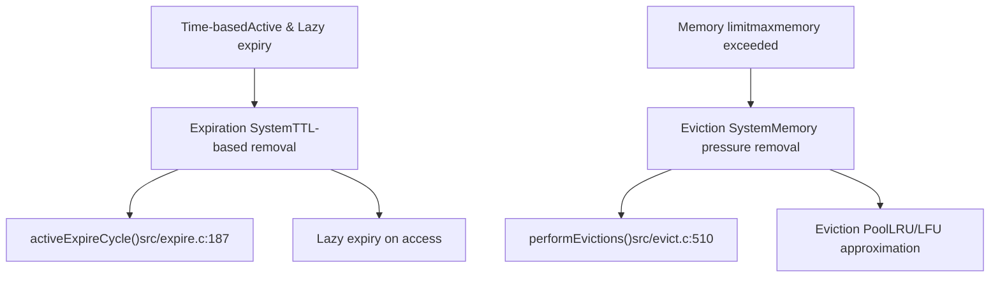
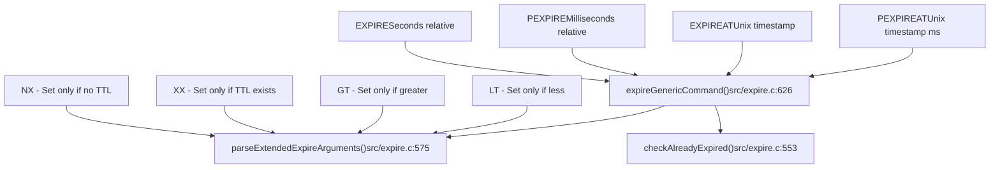
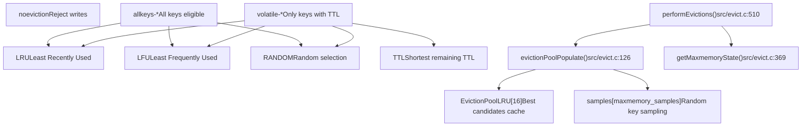
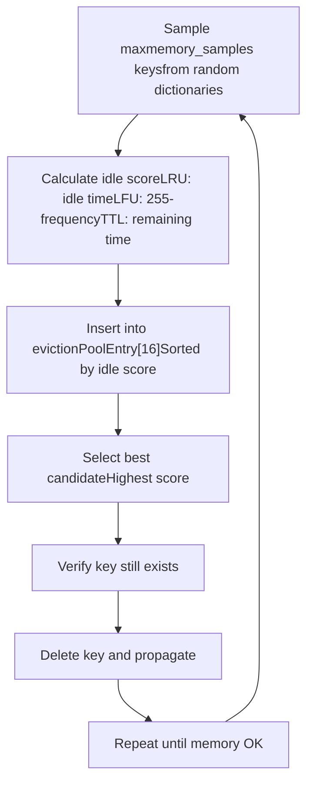
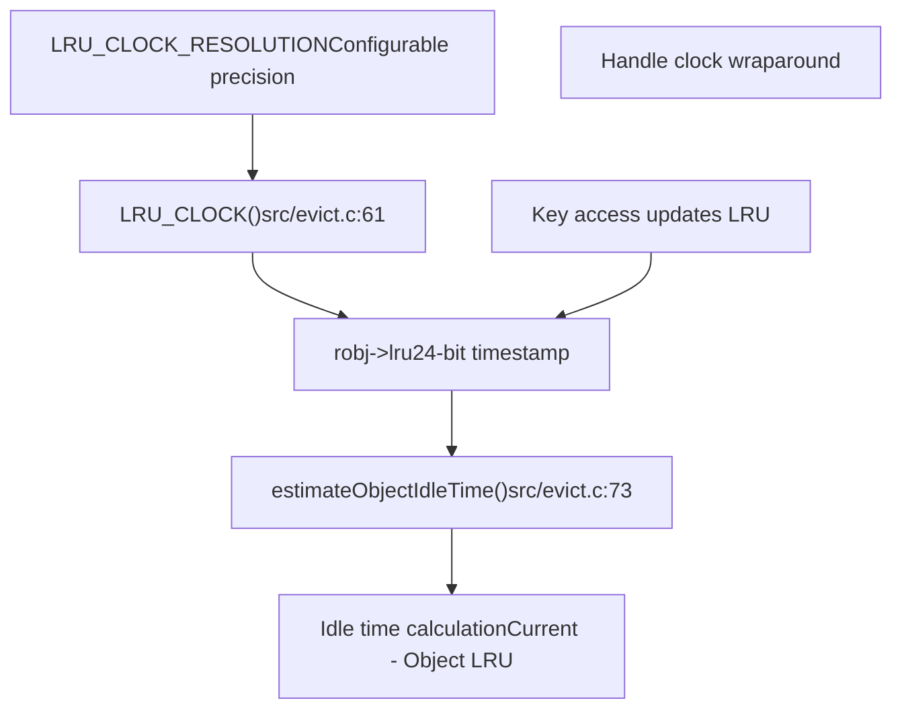
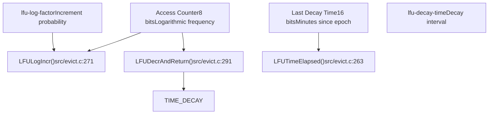
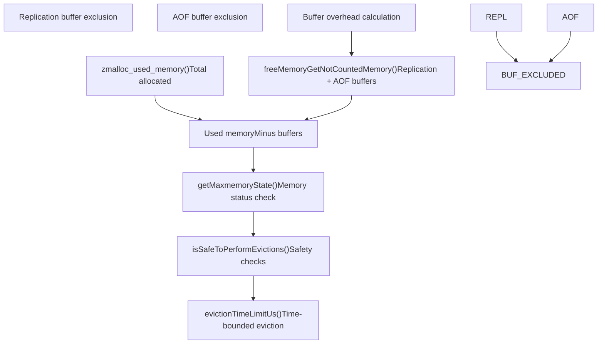

# Eviction and Expiration Policies

Relevant source files

-   [src/evict.c](https://github.com/redis/redis/blob/8ad54215/src/evict.c)
-   [src/expire.c](https://github.com/redis/redis/blob/8ad54215/src/expire.c)
-   [tests/unit/expire.tcl](https://github.com/redis/redis/blob/8ad54215/tests/unit/expire.tcl)
-   [tests/unit/maxmemory.tcl](https://github.com/redis/redis/blob/8ad54215/tests/unit/maxmemory.tcl)

This document covers Redis's memory management mechanisms for automatically removing keys from the database. Redis provides two complementary systems: **expiration** for keys with time-to-live (TTL) values and **eviction** for managing memory usage when limits are exceeded.

For information about general memory allocation and management, see [Memory Allocators and Build System](/redis/redis/4.2-memory-allocators-and-build-system). For details about data structure implementations that support these policies, see [Dictionary and Key-Value Store](/redis/redis/3.5-dictionary-and-key-value-store).

## Overview

Redis implements two distinct but complementary key removal mechanisms to manage memory usage and data lifecycle:


**Sources:** [src/expire.c1-552](https://github.com/redis/redis/blob/8ad54215/src/expire.c#L1-L552) [src/evict.c1-736](https://github.com/redis/redis/blob/8ad54215/src/evict.c#L1-L736)

## Expiration System Architecture

The expiration system manages keys with TTL values through both proactive and reactive mechanisms:

```mermaid
flowchart TD
    ACCESS["Key AccessLazy Expiry"]
    CRON["Server CronActive Expiry"]
    BEFORESLEEP["beforeSleep()Fast Cycle"]
    TRY_EXPIRE["activeExpireCycleTryExpire()src/expire.c:38"]
    ACTIVE_CYCLE["activeExpireCycle()src/expire.c:187"]
    HF_CYCLE["activeExpireHashFieldCycle()src/expire.c:144"]
    DB_EXPIRES["db->expireskvstore with TTL keys"]
    SLAVE_KEYS["slaveKeysWithExpireWritable replica tracking"]
    EFFORT["server.active_expire_effort"]
    SETTINGS["ACTIVE_EXPIRE_CYCLE_*constants"]

    ACCESS --> TRY_EXPIRE
    CRON --> ACTIVE_CYCLE
    BEFORESLEEP --> ACTIVE_CYCLE
    ACTIVE --> CYCLE_TRY_EXPIRE
    ACTIVE --> CYCLE_HF_CYCLE
    TRY --> EXPIRE_DB_EXPIRES
    EFFORT --> ACTIVE_CYCLE
    SETTINGS --> ACTIVE_CYCLE
```


**Sources:** [src/expire.c187-408](https://github.com/redis/redis/blob/8ad54215/src/expire.c#L187-L408) [src/expire.c38-51](https://github.com/redis/redis/blob/8ad54215/src/expire.c#L38-L51) [src/expire.c144-185](https://github.com/redis/redis/blob/8ad54215/src/expire.c#L144-L185)

### Active Expiration Cycle

The `activeExpireCycle()` function implements Redis's proactive key expiration with two modes:

| Mode | Trigger | Duration Limit | Purpose |
| --- | --- | --- | --- |
| `ACTIVE_EXPIRE_CYCLE_FAST` | `beforeSleep()` | 1000μs | Quick cleanup between commands |
| `ACTIVE_EXPIRE_CYCLE_SLOW` | Server cron | 25% CPU time | Thorough periodic cleanup |

The cycle uses adaptive sampling based on the `server.active_expire_effort` configuration (1-10 scale) to balance CPU usage with expiry thoroughness.

**Sources:** [src/expire.c187-408](https://github.com/redis/redis/blob/8ad54215/src/expire.c#L187-L408) [src/expire.c92-98](https://github.com/redis/redis/blob/8ad54215/src/expire.c#L92-L98)

### TTL Commands Implementation

Redis provides multiple TTL-setting commands implemented through `expireGenericCommand()`:


**Sources:** [src/expire.c626-742](https://github.com/redis/redis/blob/8ad54215/src/expire.c#L626-L742) [src/expire.c575-611](https://github.com/redis/redis/blob/8ad54215/src/expire.c#L575-L611) [src/expire.c553-561](https://github.com/redis/redis/blob/8ad54215/src/expire.c#L553-L561)

## Eviction System Architecture

The eviction system activates when memory usage exceeds the `maxmemory` limit, implementing various policies to select keys for removal:


**Sources:** [src/evict.c510-735](https://github.com/redis/redis/blob/8ad54215/src/evict.c#L510-L735) [src/evict.c126-215](https://github.com/redis/redis/blob/8ad54215/src/evict.c#L126-L215) [src/evict.c369-405](https://github.com/redis/redis/blob/8ad54215/src/evict.c#L369-L405)

### Eviction Pool Algorithm

Redis uses an approximation algorithm for LRU/LFU eviction to avoid the overhead of maintaining exact ordering:


The eviction pool structure maintains the best candidates across multiple sampling rounds:

```
struct evictionPoolEntry {
    unsigned long long idle;    /* Score for eviction priority */
    sds key;                   /* Key name */
    sds cached;               /* Cached SDS for efficiency */
    int dbid;                 /* Database number */
    int slot;                 /* Hash slot */
};
```
**Sources:** [src/evict.c36-42](https://github.com/redis/redis/blob/8ad54215/src/evict.c#L36-L42) [src/evict.c126-215](https://github.com/redis/redis/blob/8ad54215/src/evict.c#L126-L215) [src/evict.c83-101](https://github.com/redis/redis/blob/8ad54215/src/evict.c#L83-L101)

## LRU and LFU Implementation

### LRU Clock System

Redis implements LRU tracking using a global clock with reduced precision to minimize memory overhead:


**Sources:** [src/evict.c53-81](https://github.com/redis/redis/blob/8ad54215/src/evict.c#L53-L81)

### LFU Bit Field Layout

LFU implementation splits the 24-bit `lru` field into two components:


The logarithmic counter provides probabilistic frequency tracking where higher frequencies become increasingly harder to increment, preventing counter saturation.

**Sources:** [src/evict.c218-298](https://github.com/redis/redis/blob/8ad54215/src/evict.c#L218-L298) [src/evict.c271-279](https://github.com/redis/redis/blob/8ad54215/src/evict.c#L271-L279) [src/evict.c291-298](https://github.com/redis/redis/blob/8ad54215/src/evict.c#L291-L298)

## Memory Management Integration

### Memory Accounting

The eviction system carefully accounts for different types of memory to avoid feedback loops:


**Sources:** [src/evict.c308-343](https://github.com/redis/redis/blob/8ad54215/src/evict.c#L308-L343) [src/evict.c369-405](https://github.com/redis/redis/blob/8ad54215/src/evict.c#L369-L405) [src/evict.c453-466](https://github.com/redis/redis/blob/8ad54215/src/evict.c#L453-L466)

### Eviction Time Limiting

Redis limits eviction time to prevent blocking the server using the `maxmemory-eviction-tenacity` configuration:

| Tenacity | Time Limit | Behavior |
| --- | --- | --- |
| 0-10 | 0-500μs | Linear progression |
| 11-99 | 500μs-2min | Geometric progression (15%) |
| 100 | Unlimited | No time limit |

**Sources:** [src/evict.c468-484](https://github.com/redis/redis/blob/8ad54215/src/evict.c#L468-L484)

## Configuration Parameters

### Expiration Configuration

| Parameter | Default | Description |
| --- | --- | --- |
| `active-expire-effort` | 1 | Expiry aggressiveness (1-10) |
| `hz` | 10 | Server cron frequency |

### Eviction Configuration

| Parameter | Default | Description |
| --- | --- | --- |
| `maxmemory` | 0 | Memory limit (0 = unlimited) |
| `maxmemory-policy` | `noeviction` | Eviction policy |
| `maxmemory-samples` | 5 | Keys to sample for eviction |
| `maxmemory-eviction-tenacity` | 10 | Eviction time control |
| `lfu-log-factor` | 10 | LFU increment probability factor |
| `lfu-decay-time` | 1 | LFU decay interval (minutes) |

**Sources:** [src/evict.c34](https://github.com/redis/redis/blob/8ad54215/src/evict.c#L34-L34) [src/expire.c93-97](https://github.com/redis/redis/blob/8ad54215/src/expire.c#L93-L97) [tests/unit/maxmemory.tcl152-183](https://github.com/redis/redis/blob/8ad54215/tests/unit/maxmemory.tcl#L152-L183)
