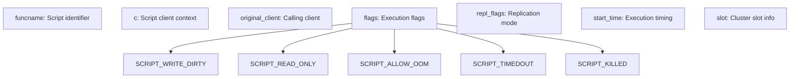

# Scripting and Extensions

Relevant source files

-   [runtest-moduleapi](https://github.com/redis/redis/blob/8ad54215/runtest-moduleapi)
-   [src/commands.c](https://github.com/redis/redis/blob/8ad54215/src/commands.c)
-   [src/eval.c](https://github.com/redis/redis/blob/8ad54215/src/eval.c)
-   [src/function\_lua.c](https://github.com/redis/redis/blob/8ad54215/src/function_lua.c)
-   [src/functions.c](https://github.com/redis/redis/blob/8ad54215/src/functions.c)
-   [src/functions.h](https://github.com/redis/redis/blob/8ad54215/src/functions.h)
-   [src/redismodule.h](https://github.com/redis/redis/blob/8ad54215/src/redismodule.h)
-   [src/script.c](https://github.com/redis/redis/blob/8ad54215/src/script.c)
-   [src/script.h](https://github.com/redis/redis/blob/8ad54215/src/script.h)
-   [src/script\_lua.c](https://github.com/redis/redis/blob/8ad54215/src/script_lua.c)
-   [src/script\_lua.h](https://github.com/redis/redis/blob/8ad54215/src/script_lua.h)
-   [tests/modules/Makefile](https://github.com/redis/redis/blob/8ad54215/tests/modules/Makefile)
-   [tests/modules/misc.c](https://github.com/redis/redis/blob/8ad54215/tests/modules/misc.c)
-   [tests/unit/functions.tcl](https://github.com/redis/redis/blob/8ad54215/tests/unit/functions.tcl)
-   [tests/unit/moduleapi/misc.tcl](https://github.com/redis/redis/blob/8ad54215/tests/unit/moduleapi/misc.tcl)
-   [tests/unit/scripting.tcl](https://github.com/redis/redis/blob/8ad54215/tests/unit/scripting.tcl)

Redis provides multiple mechanisms for extending its functionality beyond the built-in commands through scripting and loadable extensions. This document covers the three primary extension mechanisms: Lua scripting via EVAL commands, Redis Functions, and the Redis Module API.

For detailed information about Lua scripting and Redis Functions implementation, see [Lua Scripting and Redis Functions](/redis/redis/5.1-lua-scripting-and-redis-functions). For module development and the C API, see [Redis Module API](/redis/redis/5.2-redis-module-api).

## Overall Architecture

Redis scripting and extensions are built around a layered architecture that provides isolation, security, and performance while maintaining consistency with Redis's single-threaded execution model.

### Extension Mechanisms Overview

```mermaid
flowchart TD
    EVAL["EVAL/EVALSHA Commands"]
    FCALL["FCALL/FCALL_RO Commands"]
    MODULE_CMD["Module Commands"]
    SCRIPT_CTX["scriptRunCtx"]
    SCRIPT_CORE["script.c Core"]
    SCRIPT_LUA["script_lua.c Shared"]
    EVAL_ENGINE["eval.c Legacy Engine"]
    FUNC_ENGINE["function_lua.c Functions Engine"]
    REDIS_API["Redis Command API"]
    MODULE_API["RedisModule API"]
    COMMANDS["Command Processing"]
    DB["Database Operations"]
    NETWORKING["Client Management"]

    EVAL --> EVAL_ENGINE
    FCALL --> FUNC_ENGINE
    MODULE --> CMD_MODULE_API
    EVAL --> ENGINE_SCRIPT_LUA
    FUNC --> ENGINE_SCRIPT_LUA
    SCRIPT --> LUA_SCRIPT_CORE
    SCRIPT --> CORE_SCRIPT_CTX
    MODULE --> API_COMMANDS
    REDIS --> API_COMMANDS
    SCRIPT --> CTX_COMMANDS
    COMMANDS --> DB
    COMMANDS --> NETWORKING
```

Sources: [src/script.h48-59](https://github.com/redis/redis/blob/8ad54215/src/script.h#L48-L59) [src/functions.h37-74](https://github.com/redis/redis/blob/8ad54215/src/functions.h#L37-L74) [src/redismodule.h10-12](https://github.com/redis/redis/blob/8ad54215/src/redismodule.h#L10-L12)

### Script Execution Context

The `scriptRunCtx` structure provides the foundation for all script execution, managing security, resource limits, and Redis interaction:

Sources: [src/script.h48-59](https://github.com/redis/redis/blob/8ad54215/src/script.h#L48-L59) [src/script.h40-47](https://github.com/redis/redis/blob/8ad54215/src/script.h#L40-L47)

## Extension Mechanisms

Redis supports three primary extension mechanisms, each designed for different use cases and providing different levels of integration.

| Mechanism | Commands | Engine | Use Case | Persistence |
| --- | --- | --- | --- | --- |
| Legacy Lua Scripts | `EVAL`, `EVALSHA` | Lua 5.1 | Ad-hoc scripting | Script cache |
| Redis Functions | `FCALL`, `FCALL_RO` | Lua 5.1 | Persistent server-side functions | RDB/AOF |
| Redis Modules | Custom commands | C API | System extensions | Module loading |

Sources: [src/eval.c294-317](https://github.com/redis/redis/blob/8ad54215/src/eval.c#L294-L317) [src/functions.c31-41](https://github.com/redis/redis/blob/8ad54215/src/functions.c#L31-L41) [src/redismodule.h858-904](https://github.com/redis/redis/blob/8ad54215/src/redismodule.h#L858-L904)

### Lua Scripting (EVAL/EVALSHA)

The original Redis scripting mechanism provides immediate script execution with automatic caching based on SHA1 hashes:

```mermaid
flowchart TD
    EVAL_CMD["EVAL Command"]
    SHA_CALC["Calculate SHA1"]
    CACHE_CHECK["Check Script Cache"]
    CACHED_FUNC["Execute Cached"]
    COMPILE["Compile Lua Code"]
    CACHE_STORE["Store in Cache"]
    EXECUTE["Execute Script"]
    SCRIPT_EXEC["Script Execution Context"]
    EVALSHA_CMD["EVALSHA Command"]
    DIRECT_CACHE["Direct Cache Lookup"]
    ERROR["NOSCRIPT Error"]

    EVAL --> CMD_SHA_CALC
    SHA --> CALC_CACHE_CHECK
    CACHE --> CHECK_CACHED_FUNC
    CACHE --> CHECK_COMPILE
    COMPILE --> CACHE_STORE
    CACHE --> STORE_EXECUTE
    CACHED --> FUNC_SCRIPT_EXEC
    EXECUTE --> SCRIPT_EXEC
    EVALSHA --> CMD_DIRECT_CACHE
    DIRECT --> CACHE_CACHED_FUNC
    DIRECT --> CACHE_ERROR
```

Sources: [src/eval.c296-317](https://github.com/redis/redis/blob/8ad54215/src/eval.c#L296-L317) [src/eval.c470-501](https://github.com/redis/redis/blob/8ad54215/src/eval.c#L470-L501)

### Redis Functions

The newer Functions API provides persistent, named functions with library organization:

```mermaid
flowchart TD
    FUNC_LOAD["FUNCTION LOAD"]
    PARSE_LIB["Parse Library Code"]
    CREATE_LIB["Create functionLibInfo"]
    REGISTER_FUNCS["Register Functions"]
    PERSIST["Persist to RDB/AOF"]
    FCALL["FCALL Command"]
    LOOKUP_FUNC["Lookup functionInfo"]
    ENGINE_CALL["engine->call()"]
    LUA_EXEC["Lua Execution"]
    LIB_INFO["functionLibInfo"]
    FUNC_DICT["functions dict"]
    ENGINE_INFO["engineInfo"]
    LIB_CODE["Library code"]

    FUNC --> LOAD_PARSE_LIB
    PARSE --> LIB_CREATE_LIB
    CREATE --> LIB_REGISTER_FUNCS
    REGISTER --> FUNCS_PERSIST
    FCALL --> LOOKUP_FUNC
    LOOKUP --> FUNC_ENGINE_CALL
    ENGINE --> CALL_LUA_EXEC
    CREATE --> LIB_LIB_INFO
    LIB --> INFO_FUNC_DICT
    LIB --> INFO_ENGINE_INFO
    LIB --> INFO_LIB_CODE
```

Sources: [src/functions.c270-279](https://github.com/redis/redis/blob/8ad54215/src/functions.c#L270-L279) [src/functions.h95-102](https://github.com/redis/redis/blob/8ad54215/src/functions.h#L95-L102) [src/function\_lua.c147-170](https://github.com/redis/redis/blob/8ad54215/src/function_lua.c#L147-L170)

### Script Security and Sandboxing

Both Lua scripting mechanisms implement comprehensive sandboxing to ensure script safety:

```mermaid
flowchart TD
    GLOBALS["Global Protection"]
    ALLOWLIST["Function Allow Lists"]
    READONLY["Read-Only Tables"]
    TIMEOUT["Execution Timeout"]
    MEMORY["Memory Limits"]
    OOM_CHECKS["OOM Checks"]
    EXECUTION_TIME["Execution Time Limits"]
    INTERRUPT["Script Interruption"]
    ACL_CHECK["ACL Validation"]
    CLUSTER_CHECK["Cluster Validation"]
    WRITE_CHECK["Write Permission Check"]
    REPLICATION["Replication Validation"]
    SCRIPT_INIT["Script Initialization"]
    RUNTIME_CHECK["Runtime Checks"]
    CMD_EXEC["Command Execution"]

    GLOBALS --> SCRIPT_INIT
    ALLOWLIST --> SCRIPT_INIT
    READONLY --> SCRIPT_INIT
    MEMORY --> RUNTIME_CHECK
    OOM --> CHECKS_RUNTIME_CHECK
    EXECUTION --> TIME_INTERRUPT
    ACL --> CHECK_CMD_EXEC
    CLUSTER --> CHECK_CMD_EXEC
    WRITE --> CHECK_CMD_EXEC
    REPLICATION --> CMD_EXEC
```

Sources: [src/script\_lua.c30-120](https://github.com/redis/redis/blob/8ad54215/src/script_lua.c#L30-L120) [src/script.c375-474](https://github.com/redis/redis/blob/8ad54215/src/script.c#L375-L474) [src/script.c126-155](https://github.com/redis/redis/blob/8ad54215/src/script.c#L126-L155)

### Redis Module API

The Module API provides a C interface for creating native Redis extensions with full access to Redis internals:

Sources: [src/redismodule.h888-904](https://github.com/redis/redis/blob/8ad54215/src/redismodule.h#L888-L904) [src/redismodule.h1200-1500](https://github.com/redis/redis/blob/8ad54215/src/redismodule.h#L1200-L1500) [tests/modules/misc.c1-50](https://github.com/redis/redis/blob/8ad54215/tests/modules/misc.c#L1-L50)

## Command Processing Integration

All extension mechanisms integrate with Redis's command processing pipeline through standardized interfaces:

| Component | Lua Scripts | Functions | Modules |
| --- | --- | --- | --- |
| Command Registration | Dynamic (`EVAL`) | Static (`FCALL`) | Static (`RedisModule_CreateCommand`) |
| Argument Parsing | Built-in | Built-in | Manual |
| ACL Integration | Automatic | Automatic | Manual |
| Cluster Support | Automatic | Automatic | Manual |
| Replication | Automatic | Automatic | Manual |

Sources: [src/script.c177-302](https://github.com/redis/redis/blob/8ad54215/src/script.c#L177-L302) [src/functions.c800-850](https://github.com/redis/redis/blob/8ad54215/src/functions.c#L800-L850) [src/redismodule.h950-1000](https://github.com/redis/redis/blob/8ad54215/src/redismodule.h#L950-L1000)

The scripting and extensions system provides Redis with powerful extensibility while maintaining the performance, reliability, and consistency guarantees that Redis is known for. Each mechanism serves different use cases, from simple data transformations to complex server-side logic and full system extensions.
