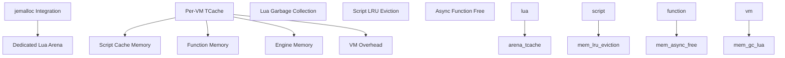

# Lua Scripting and Redis Functions

Relevant source files

-   [src/commands.c](https://github.com/redis/redis/blob/8ad54215/src/commands.c)
-   [src/eval.c](https://github.com/redis/redis/blob/8ad54215/src/eval.c)
-   [src/function\_lua.c](https://github.com/redis/redis/blob/8ad54215/src/function_lua.c)
-   [src/functions.c](https://github.com/redis/redis/blob/8ad54215/src/functions.c)
-   [src/functions.h](https://github.com/redis/redis/blob/8ad54215/src/functions.h)
-   [src/script.c](https://github.com/redis/redis/blob/8ad54215/src/script.c)
-   [src/script.h](https://github.com/redis/redis/blob/8ad54215/src/script.h)
-   [src/script\_lua.c](https://github.com/redis/redis/blob/8ad54215/src/script_lua.c)
-   [src/script\_lua.h](https://github.com/redis/redis/blob/8ad54215/src/script_lua.h)
-   [tests/unit/functions.tcl](https://github.com/redis/redis/blob/8ad54215/tests/unit/functions.tcl)
-   [tests/unit/scripting.tcl](https://github.com/redis/redis/blob/8ad54215/tests/unit/scripting.tcl)

## Purpose and Scope

This document covers Redis's Lua scripting capabilities, including both the legacy EVAL commands and the modern Redis Functions system. It explains the architecture, execution model, security mechanisms, and API interactions that enable server-side Lua script execution in Redis. The system provides atomic execution of complex operations, server-side computation, and extensible command functionality.

For information about the module system for extending Redis with native code, see [Redis Module API](/redis/redis/5.2-redis-module-api).

## Architecture Overview

Redis supports two Lua scripting systems: the legacy EVAL commands and the modern Functions system. Both share common infrastructure but have different execution models and management approaches.

### Core Scripting Components

```mermaid
flowchart TD
    EVAL["EVAL/EVALSHA"]
    EVAL_RO["EVAL_RO/EVALSHA_RO"]
    FCALL["FCALL/FCALL_RO"]
    FLOAD["FUNCTION LOAD"]
    FDEL["FUNCTION DELETE"]
    script_c["script.cscriptRunCtx"]
    eval_c["eval.cluaCtx"]
    functions_c["functions.cfunctionsLibCtx"]
    script_lua_c["script_lua.cLua-Redis Bridge"]
    function_lua_c["function_lua.cLua Function Engine"]
    lua_state["lua_StateInterpreter"]
    lua_scripts["Script Cache"]
    lua_functions["Function Registry"]
    commands_c["Command Execution"]
    acl["ACL Validation"]
    cluster["Cluster Support"]
    repl["Replication"]

    EVAL --> eval_c
    EVAL --> RO_eval_c
    FCALL --> functions_c
    FLOAD --> functions_c
    FDEL --> functions_c
    eval --> c_script_c
    functions --> c_script_c
    script --> c_script_lua_c
    functions --> c_function_lua_c
    script --> lua_c_lua_state
    function --> lua_c_lua_state
    lua --> state_lua_scripts
    lua --> state_lua_functions
    script --> c_commands_c
    script --> c_acl
    script --> c_cluster
    script --> c_repl
```

**Sources:** [src/eval.c1-50](https://github.com/redis/redis/blob/8ad54215/src/eval.c#L1-L50) [src/script.c1-50](https://github.com/redis/redis/blob/8ad54215/src/script.c#L1-L50) [src/functions.c1-50](https://github.com/redis/redis/blob/8ad54215/src/functions.c#L1-L50) [src/script\_lua.c1-50](https://github.com/redis/redis/blob/8ad54215/src/script_lua.c#L1-L50)

### Script Execution Context

The `scriptRunCtx` structure provides the core execution context for both EVAL and Functions:

| Field | Type | Purpose |
| --- | --- | --- |
| `funcname` | `const char*` | Name of executing function/script |
| `c` | `client*` | Script execution client |
| `original_client` | `client*` | Original calling client |
| `flags` | `int` | Execution flags (read-only, allow-oom, etc.) |
| `repl_flags` | `int` | Replication settings |
| `start_time` | `monotime` | Execution start timestamp |
| `slot` | `int` | Cluster slot for key validation |

**Sources:** [src/script.h48-59](https://github.com/redis/redis/blob/8ad54215/src/script.h#L48-L59)

## Legacy EVAL System

The EVAL system provides backwards-compatible Lua script execution with SHA1-based caching and script management.

### EVAL Command Flow

> **[Mermaid sequence]**
> *(图表结构无法解析)*

**Sources:** [src/eval.c434-491](https://github.com/redis/redis/blob/8ad54215/src/eval.c#L434-L491) [src/script.c176-302](https://github.com/redis/redis/blob/8ad54215/src/script.c#L176-L302) [src/script\_lua.c218-222](https://github.com/redis/redis/blob/8ad54215/src/script_lua.c#L218-L222)

### Script Caching and Management

The EVAL system maintains a cache of compiled scripts indexed by SHA1 hash:

-   **Script Cache**: `lctx.lua_scripts` dictionary maps SHA1 → `luaScript`
-   **LRU Management**: `lua_scripts_lru_list` for cache eviction
-   **Memory Tracking**: `lua_scripts_mem` tracks cache memory usage
-   **Function Naming**: Scripts compiled as `f_<sha1>` functions in Lua registry

**Sources:** [src/eval.c58-65](https://github.com/redis/redis/blob/8ad54215/src/eval.c#L58-L65) [src/eval.c532-580](https://github.com/redis/redis/blob/8ad54215/src/eval.c#L532-L580)

## Redis Functions System

The Functions system provides persistent, named functions with library organization and enhanced metadata.

### Function Library Architecture

```mermaid
flowchart TD
    lib_ctx["functionsLibCtxCurrent Context"]
    libraries["libraries dictname → functionLibInfo"]
    functions["functions dictname → functionInfo"]
    engines_stats["engines_stats dictEngine Statistics"]
    lib_info["functionLibInfoname, code, functions"]
    func_info["functionInfoname, function, desc, flags"]
    engine_info["engineInfoname, engine, client"]
    engine["engine structCallbacks"]
    lua_engine["function_lua.cLua Engine Implementation"]
    create_cb["create()"]
    call_cb["call()"]
    free_cb["free_function()"]

    lib --> ctx_libraries
    lib --> ctx_functions
    lib --> ctx_engines_stats
    libraries --> lib_info
    functions --> func_info
    lib --> info_func_info
    func --> info_engine_info
    engine --> info_engine
    engine --> lua_engine
    engine --> create_cb
    engine --> call_cb
    engine --> free_cb
```

**Sources:** [src/functions.h35-103](https://github.com/redis/redis/blob/8ad54215/src/functions.h#L35-L103) [src/functions.c36-41](https://github.com/redis/redis/blob/8ad54215/src/functions.c#L36-L41) [src/function\_lua.c40-49](https://github.com/redis/redis/blob/8ad54215/src/function_lua.c#L40-L49)

### Function Registration Process

Functions are registered during `FUNCTION LOAD` execution using the `redis.register_function()` API:

1.  **Parse shebang**: Extract engine and flags from `#!lua` header
2.  **Create library**: Initialize `functionLibInfo` with metadata
3.  **Compile code**: Engine compiles library code with timeout protection
4.  **Register functions**: `redis.register_function()` calls create `functionInfo` entries
5.  **Link library**: Add to global function registry

**Sources:** [src/functions.c244-268](https://github.com/redis/redis/blob/8ad54215/src/functions.c#L244-L268) [src/function\_lua.c88-142](https://github.com/redis/redis/blob/8ad54215/src/function_lua.c#L88-L142) [src/function\_lua.c403-424](https://github.com/redis/redis/blob/8ad54215/src/function_lua.c#L403-L424)

## Lua Execution Environment

Both EVAL and Functions share a common Lua execution environment with Redis API integration.

### Lua State Configuration

```mermaid
flowchart TD
    lua_state["lua_StateMain Interpreter"]
    globals["Global TableProtected"]
    registry["LUA_REGISTRYINDEXInternal Storage"]
    redis_api["redis table"]
    call_func["redis.call()"]
    pcall_func["redis.pcall()"]
    setresp_func["redis.setresp()"]
    sha1hex_func["redis.sha1hex()"]
    log_func["redis.log()"]
    cjson["cjson library"]
    cmsgpack["cmsgpack library"]
    bit["bit operations"]
    math["math library"]
    string["string library"]
    table["table library"]
    globals_protection["Global Protection"]
    readonly_tables["Read-only Tables"]
    sandbox["OS Function Sandboxing"]

    lua --> state_globals
    lua --> state_registry
    globals --> redis_api
    redis --> api_call_func
    redis --> api_pcall_func
    redis --> api_setresp_func
    redis --> api_sha1hex_func
    redis --> api_log_func
    globals --> cjson
    globals --> cmsgpack
    globals --> bit
    globals --> math
    globals --> string
    globals --> table
    lua --> state_globals_protection
    lua --> state_readonly_tables
    lua --> state_sandbox
```

**Sources:** [src/script\_lua.c30-109](https://github.com/redis/redis/blob/8ad54215/src/script_lua.c#L30-L109) [src/eval.c170-257](https://github.com/redis/redis/blob/8ad54215/src/eval.c#L170-L257) [src/function\_lua.c427-490](https://github.com/redis/redis/blob/8ad54215/src/function_lua.c#L427-L490)

### Redis Command Integration

The `redis.call()` and `redis.pcall()` functions provide the primary interface for executing Redis commands from Lua:

-   **Argument Conversion**: `luaArgsToRedisArgv()` converts Lua values to Redis objects
-   **Command Execution**: `scriptCall()` validates and executes commands
-   **Reply Conversion**: `redisProtocolToLuaType()` converts Redis replies to Lua values
-   **Error Handling**: `redis.pcall()` returns errors as tables, `redis.call()` raises Lua errors

**Sources:** [src/script\_lua.c782-796](https://github.com/redis/redis/blob/8ad54215/src/script_lua.c#L782-L796) [src/script.c616-690](https://github.com/redis/redis/blob/8ad54215/src/script.c#L616-L690) [src/script\_lua.c218-222](https://github.com/redis/redis/blob/8ad54215/src/script_lua.c#L218-L222)

## Script Execution Flow

### Execution Context Management

> **[Mermaid stateDiagram]**
> *(图表结构无法解析)*

**Sources:** [src/script.c176-302](https://github.com/redis/redis/blob/8ad54215/src/script.c#L176-L302) [src/script.c126-155](https://github.com/redis/redis/blob/8ad54215/src/script.c#L126-L155) [src/script.c305-325](https://github.com/redis/redis/blob/8ad54215/src/script.c#L305-L325)

### Command Validation Pipeline

Each `redis.call()` execution goes through multiple validation layers:

| Validation Step | Function | Purpose |
| --- | --- | --- |
| Command Lookup | `lookupCommand()` | Find command definition |
| Arity Check | `scriptVerifyCommandArity()` | Validate argument count |
| ACL Validation | `scriptVerifyACL()` | Check user permissions |
| Write Permission | `scriptVerifyWriteCommandAllow()` | Validate write operations |
| OOM Check | `scriptVerifyOOM()` | Memory limit validation |
| Cluster Check | `scriptVerifyClusterState()` | Cross-slot validation |
| Stale Check | `scriptVerifyAllowStale()` | Replica staleness check |

**Sources:** [src/script.c375-609](https://github.com/redis/redis/blob/8ad54215/src/script.c#L375-L609)

## Command Processing

### EVAL Command Family

The EVAL commands support both script text and SHA1-based execution:

-   **EVAL**: Execute script text directly
-   **EVALSHA**: Execute cached script by SHA1 hash
-   **EVAL\_RO**: Read-only script execution
-   **EVALSHA\_RO**: Read-only cached script execution

**Sources:** [src/eval.c1200-1300](https://github.com/redis/redis/blob/8ad54215/src/eval.c#L1200-L1300)

### Function Command Family

The Function commands provide comprehensive function management:

-   **FUNCTION LOAD**: Load function library with optional flags
-   **FCALL/FCALL\_RO**: Call named functions
-   **FUNCTION DELETE**: Remove function library
-   **FUNCTION LIST**: List functions with metadata
-   **FUNCTION DUMP/RESTORE**: Serialize/deserialize functions
-   **FUNCTION FLUSH**: Clear all functions
-   **FUNCTION KILL**: Terminate running function
-   **FUNCTION STATS**: Runtime statistics

**Sources:** [src/functions.c432-473](https://github.com/redis/redis/blob/8ad54215/src/functions.c#L432-L473) [src/functions.c500-600](https://github.com/redis/redis/blob/8ad54215/src/functions.c#L500-L600)

## Memory Management

### Lua Memory Tracking

**Sources:** [src/script.c52-107](https://github.com/redis/redis/blob/8ad54215/src/script.c#L52-L107) [src/eval.c532-580](https://github.com/redis/redis/blob/8ad54215/src/eval.c#L532-L580) [src/functions.c105-114](https://github.com/redis/redis/blob/8ad54215/src/functions.c#L105-L114)

### Garbage Collection and Cleanup

-   **Script GC**: `luaGC()` performs incremental garbage collection
-   **Script Eviction**: LRU eviction for EVAL script cache (500 script limit)
-   **Function Cleanup**: Async cleanup for large function libraries
-   **Memory Reporting**: Detailed memory usage via `INFO memory`

**Sources:** [src/script\_lua.c1046-1063](https://github.com/redis/redis/blob/8ad54215/src/script_lua.c#L1046-L1063) [src/eval.c532-580](https://github.com/redis/redis/blob/8ad54215/src/eval.c#L532-L580) [src/functions.c183-194](https://github.com/redis/redis/blob/8ad54215/src/functions.c#L183-L194)

## Security and Sandboxing

### Global Protection

The Lua environment implements strict global variable protection:

-   **Read Protection**: Access to undefined globals raises errors
-   **Write Protection**: Modification of global table is forbidden
-   **Allowlists**: Predefined sets of allowed global variables
-   **Recursive Protection**: Table protection applied recursively

**Sources:** [src/script\_lua.c94-109](https://github.com/redis/redis/blob/8ad54215/src/script_lua.c#L94-L109) [src/eval.c249-255](https://github.com/redis/redis/blob/8ad54215/src/eval.c#L249-L255)

### OS Function Sandboxing

Dangerous OS functions are removed or restricted:

-   **Removed Functions**: `os.execute()`, `os.exit()`, `os.getenv()`, `io.*`
-   **Allowed Functions**: `os.clock()` for timing
-   **Load Protection**: `loadfile()`, `dofile()` removed
-   **Debug Removal**: `debug` table removed after initialization

**Sources:** [src/script\_lua.c115-120](https://github.com/redis/redis/blob/8ad54215/src/script_lua.c#L115-L120) [tests/unit/scripting.tcl747-755](https://github.com/redis/redis/blob/8ad54215/tests/unit/scripting.tcl#L747-L755)

### Script Flags and Permissions

Function scripts can declare execution flags in shebang headers:

| Flag | Purpose |
| --- | --- |
| `no-writes` | Prevent write commands |
| `allow-oom` | Allow execution when OOM |
| `allow-stale` | Allow execution on stale replica |
| `no-cluster` | Prevent cluster mode execution |
| `allow-cross-slot-keys` | Allow cross-slot key access |

**Sources:** [src/script.h61-67](https://github.com/redis/redis/blob/8ad54215/src/script.h#L61-L67) [src/script.c23-30](https://github.com/redis/redis/blob/8ad54215/src/script.c#L23-L30)

This comprehensive scripting system enables powerful server-side computation while maintaining Redis's performance, security, and consistency guarantees.
