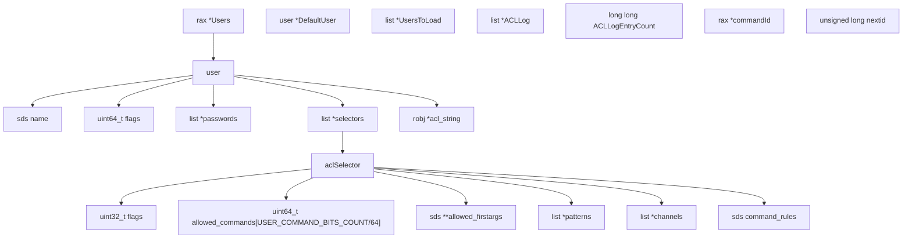
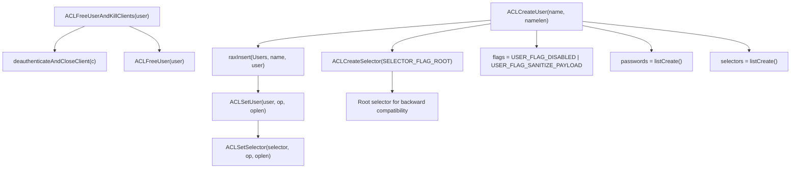
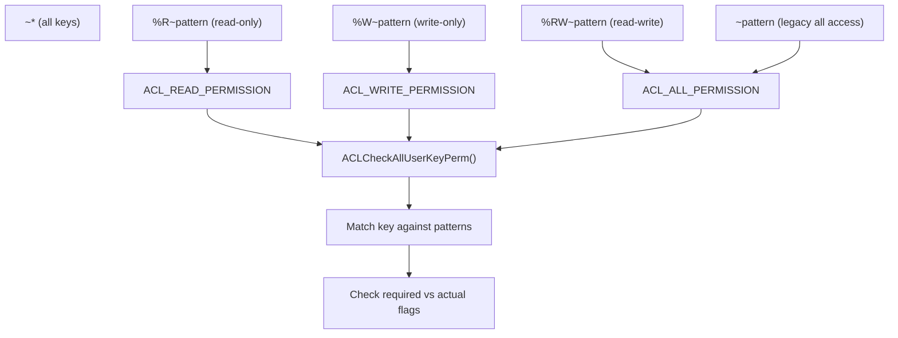
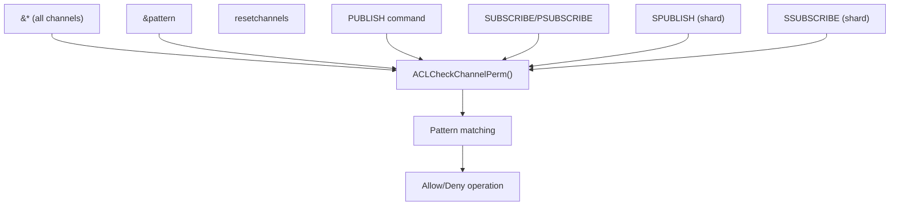
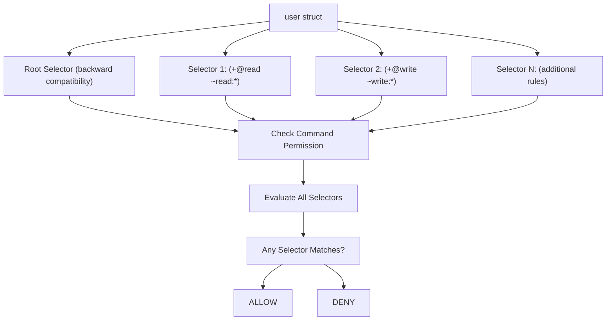
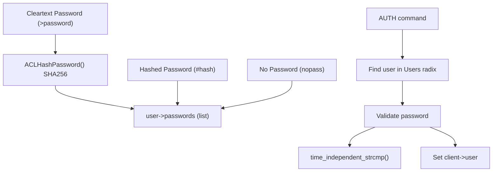

# Access Control Lists

Relevant source files

-   [src/acl.c](https://github.com/redis/redis/blob/8ad54215/src/acl.c)
-   [tests/assets/user.acl](https://github.com/redis/redis/blob/8ad54215/tests/assets/user.acl)
-   [tests/unit/acl-v2.tcl](https://github.com/redis/redis/blob/8ad54215/tests/unit/acl-v2.tcl)
-   [tests/unit/acl.tcl](https://github.com/redis/redis/blob/8ad54215/tests/unit/acl.tcl)
-   [tests/unit/introspection-2.tcl](https://github.com/redis/redis/blob/8ad54215/tests/unit/introspection-2.tcl)

Redis Access Control Lists (ACLs) provide a comprehensive authentication and authorization system that enables fine-grained control over user permissions. The ACL system allows administrators to define users with specific command permissions, key access patterns, and pub/sub channel restrictions.

## System Architecture

The ACL system is built around several core components that work together to enforce security policies:

### Core Data Structures


Sources: [src/acl.c20-41](https://github.com/redis/redis/blob/8ad54215/src/acl.c#L20-L41) [src/acl.c121-132](https://github.com/redis/redis/blob/8ad54215/src/acl.c#L121-L132) [src/acl.c146-173](https://github.com/redis/redis/blob/8ad54215/src/acl.c#L146-L173)

The ACL system maintains a global radix tree (`Users`) that maps usernames to `user` structures. Each user contains authentication credentials, flags, and one or more `aclSelector` structures that define their permissions. The `commandId` rax tree maps command names to IDs for efficient permission checking.

### Command Categories and Permission Checking

```mermaid
flowchart TD
    ACLCommandCategories["struct ACLCategoryItem *ACLCommandCategories"]
    ACLDefaultCommandCategories["ACLDefaultCommandCategories[]"]
    nextCommandCategory["size_t nextCommandCategory"]
    ACLAddCommandCategory["ACLAddCommandCategory()"]
    ACLGetCommandBitCoordinates["ACLGetCommandBitCoordinates()"]
    ACLGetSelectorCommandBit["ACLGetSelectorCommandBit()"]
    ACLSetSelectorCommandBit["ACLSetSelectorCommandBit()"]
    ACLCheckCommandPerm["ACLCheckCommandPerm()"]
    orig_commands["server.orig_commands"]
    subcommands_dict["cmd->subcommands_dict"]
    cmd_id["cmd->id"]
    acl_categories["cmd->acl_categories"]

    ACLCommandCategories --> ACLGetCommandBitCoordinates
    orig --> commands_cmd_id
    cmd --> id_ACLGetSelectorCommandBit
    acl --> categories_ACLSetSelectorCommandBit
    subcommands --> dict_cmd_id
    ACLGetSelectorCommandBit --> ACLCheckCommandPerm
```


Sources: [src/acl.c45-71](https://github.com/redis/redis/blob/8ad54215/src/acl.c#L45-L71) [src/acl.c89-105](https://github.com/redis/redis/blob/8ad54215/src/acl.c#L89-L105) [src/acl.c526-531](https://github.com/redis/redis/blob/8ad54215/src/acl.c#L526-L531) [src/acl.c540-544](https://github.com/redis/redis/blob/8ad54215/src/acl.c#L540-L544)

The ACL system defines command categories (like "keyspace", "read", "write", etc.) that group related commands. Each command is assigned a unique ID and can belong to multiple categories. The permission checking system uses bit manipulation for efficient command permission verification.

## User Management

### User Lifecycle and Management Functions


Sources: [src/acl.c420-442](https://github.com/redis/redis/blob/8ad54215/src/acl.c#L420-L442) [src/acl.c482-499](https://github.com/redis/redis/blob/8ad54215/src/acl.c#L482-L499) [src/acl.c345-362](https://github.com/redis/redis/blob/8ad54215/src/acl.c#L345-L362) [src/acl.c463-472](https://github.com/redis/redis/blob/8ad54215/src/acl.c#L463-L472)

The `ACLCreateUser` function creates a new user with `USER_FLAG_DISABLED` and `USER_FLAG_SANITIZE_PAYLOAD` flags. Each user starts with a root selector created via `ACLCreateSelector` with `SELECTOR_FLAG_ROOT` for backward compatibility. When a user is deleted with `ACLFreeUserAndKillClients`, all connected clients authenticated as that user are disconnected.

### User Flags and States

| Flag | Purpose | Description |
| --- | --- | --- |
| `USER_FLAG_ENABLED` | User can authenticate | Allows the user to connect to Redis |
| `USER_FLAG_DISABLED` | User cannot authenticate | Prevents the user from connecting (default) |
| `USER_FLAG_NOPASS` | No password required | Allows authentication without password |
| `USER_FLAG_SANITIZE_PAYLOAD` | Sanitize command arguments in logs | Hides sensitive data in logs (default) |
| `USER_FLAG_SANITIZE_PAYLOAD_SKIP` | Skip sanitization | Shows all command arguments in logs |

Sources: [src/acl.c121-132](https://github.com/redis/redis/blob/8ad54215/src/acl.c#L121-L132)

These flags control the basic behavior of a user account. New users are created with `USER_FLAG_DISABLED` and `USER_FLAG_SANITIZE_PAYLOAD` by default. The flags can be modified using the `ACL SETUSER` command with options like `on`, `off`, `nopass`, etc.

## Permission System

### Command Permission Bitmap System

```mermaid
flowchart TD
    ACLSetSelectorCommandBitsForCategory["ACLSetSelectorCommandBitsForCategory()"]
    ACLChangeSelectorPerm["ACLChangeSelectorPerm(selector, cmd, allow)"]
    subcommands_dict["Iterate cmd->subcommands_dict"]
    cmd_id["unsigned long id"]
    ACLGetCommandBitCoordinates["ACLGetCommandBitCoordinates(id, &word, &bit)"]
    word_calc["*word = id / sizeof(uint64_t) / 8"]
    bit_calc["*bit = 1ULL << (id % (sizeof(uint64_t) * 8))"]
    ACLGetSelectorCommandBit["ACLGetSelectorCommandBit(selector, id)"]
    allowed_commands_check["selector->allowed_commands[word] & bit"]
    ACLSetSelectorCommandBit["ACLSetSelectorCommandBit(selector, id, value)"]
    SELECTOR_FLAG_ALLCOMMANDS["Clear SELECTOR_FLAG_ALLCOMMANDS if value=0"]
    allowed_firstargs["selector->allowed_firstargs[id]"]
    ACLAddAllowedFirstArg["ACLAddAllowedFirstArg(selector, id, sub)"]
    ACLResetFirstArgsForCommand["ACLResetFirstArgsForCommand(selector, id)"]

    cmd --> id_ACLGetCommandBitCoordinates
    ACLGetCommandBitCoordinates --> word_calc
    ACLGetCommandBitCoordinates --> bit_calc
    word --> calc_ACLGetSelectorCommandBit
    bit --> calc_ACLGetSelectorCommandBit
    ACLGetSelectorCommandBit --> allowed_commands_check
    ACLSetSelectorCommandBit --> SELECTOR_FLAG_ALLCOMMANDS
    cmd --> id_allowed_firstargs
    allowed --> firstargs_ACLAddAllowedFirstArg
    ACLSetSelectorCommandBitsForCategory --> ACLChangeSelectorPerm
    ACLChangeSelectorPerm --> subcommands_dict
```


Sources: [src/acl.c526-531](https://github.com/redis/redis/blob/8ad54215/src/acl.c#L526-L531) [src/acl.c540-567](https://github.com/redis/redis/blob/8ad54215/src/acl.c#L540-L567) [src/acl.c651-664](https://github.com/redis/redis/blob/8ad54215/src/acl.c#L651-L664) [src/acl.c913-1001](https://github.com/redis/redis/blob/8ad54215/src/acl.c#L913-L1001)

The system uses `USER_COMMAND_BITS_COUNT` to define the maximum number of commands. Each command ID maps to a specific bit in the `allowed_commands` array via `ACLGetCommandBitCoordinates`. Categories are processed by `ACLSetSelectorCommandBitsForCategory` which iterates through all commands with matching `acl_categories` flags.

The `allowed_firstargs` array enables more granular control by allowing specific subcommands or command arguments. For example, a user might be allowed to use `CONFIG GET` but not `CONFIG SET`.

### Key Access Patterns

Redis ACL v2 introduced granular key permissions with read, write, and read-write access:


Sources: [src/acl.c292-326](https://github.com/redis/redis/blob/8ad54215/src/acl.c#L292-L326) [src/acl.c330-341](https://github.com/redis/redis/blob/8ad54215/src/acl.c#L330-L341)

Key patterns control which keys a user can access. The system supports different permission types:

-   `~pattern` - Full access to keys matching the pattern (legacy)
-   `%R~pattern` - Read-only access to keys matching the pattern
-   `%W~pattern` - Write-only access to keys matching the pattern
-   `%RW~pattern` - Read-write access (equivalent to `~pattern`)
-   `~*` or `allkeys` - Access to all keys

Each Redis command is internally tagged with the type of key access it requires (read, write, or both). The ACL system checks if the user has the appropriate permission for the keys being accessed.

### Channel Permissions

Pub/sub channel access is controlled through pattern matching similar to key patterns:


Sources: [src/acl.c164-170](https://github.com/redis/redis/blob/8ad54215/src/acl.c#L164-L170) [tests/unit/acl.tcl93-170](https://github.com/redis/redis/blob/8ad54215/tests/unit/acl.tcl#L93-L170)

Channel permissions control which Pub/Sub channels a user can access:

-   `&pattern` - Access to channels matching the pattern
-   `&*` or `allchannels` - Access to all channels
-   `resetchannels` - Reset channel permissions (remove all)

The ACL system enforces these permissions for all Pub/Sub operations including `PUBLISH`, `SUBSCRIBE`, `PSUBSCRIBE`, and their shard variants. When a user's channel permissions are revoked, any active subscriptions to those channels are automatically terminated.

## Selectors (ACL v2)

### Selector Architecture

ACL v2 introduced selectors, allowing users to have multiple sets of permissions that are evaluated independently:


Sources: [src/acl.c408-413](https://github.com/redis/redis/blob/8ad54215/src/acl.c#L408-L413) [src/acl.c345-371](https://github.com/redis/redis/blob/8ad54215/src/acl.c#L345-L371) [tests/unit/acl-v2.tcl1-21](https://github.com/redis/redis/blob/8ad54215/tests/unit/acl-v2.tcl#L1-L21)

Each selector is independent and contains its own command permissions, key patterns, and channel patterns. A command is allowed if ANY selector permits it. This allows for more complex permission scenarios, such as allowing a user to perform read operations on one set of keys and write operations on another set.

The root selector provides backward compatibility with ACL v1 and is always present. Additional selectors are defined using parentheses in the ACL syntax: `(+@read ~read:*)`.

### Selector Management Functions

| Function | Purpose | Description |
| --- | --- | --- |
| `ACLCreateSelector` | Create new selector with flags | Initializes a selector with specified flags |
| `ACLFreeSelector` | Clean up selector resources | Releases memory used by a selector |
| `ACLCopySelector` | Create exact copy of selector | Duplicates a selector including all permissions |
| `ACLUserGetRootSelector` | Get backward-compatible root selector | Returns the first selector (root) |
| `ACLSetSelector` | Configure selector permissions | Parses and applies ACL rules to a selector |

Sources: [src/acl.c345-413](https://github.com/redis/redis/blob/8ad54215/src/acl.c#L345-L413) [src/acl.c179-180](https://github.com/redis/redis/blob/8ad54215/src/acl.c#L179-L180)

Selectors are managed internally through these functions. The `ACLCreateSelector` function initializes a new selector with empty permissions by default. The `ACLSetSelector` function parses ACL rules and applies them to the selector. When a user is copied with `ACLCopyUser`, all selectors are duplicated as well.

## Authentication Mechanisms

### Password Systems

Redis supports multiple authentication methods:


Sources: [src/acl.c193-199](https://github.com/redis/redis/blob/8ad54215/src/acl.c#L193-L199) [src/acl.c203-218](https://github.com/redis/redis/blob/8ad54215/src/acl.c#L203-L218) [src/acl.c222-237](https://github.com/redis/redis/blob/8ad54215/src/acl.c#L222-L237) [tests/unit/acl.tcl25-71](https://github.com/redis/redis/blob/8ad54215/tests/unit/acl.tcl#L25-L71)

The system uses SHA256 for password hashing and time-independent string comparison to prevent timing attacks. Redis supports multiple authentication methods:

1.  **Cleartext Passwords**: Added with `>password` syntax, stored as SHA256 hashes
2.  **Hashed Passwords**: Added directly with `#hash` syntax (64-character hex SHA256 hash)
3.  **No Password**: Set with `nopass` flag, allowing authentication without a password
4.  **Multiple Passwords**: A user can have multiple valid passwords simultaneously

Passwords can be added or removed individually without affecting other passwords. The `time_independent_strcmp` function prevents timing attacks by comparing strings in constant time regardless of where differences occur.

## ACL File Format and Persistence

### ACL File Structure

Redis ACLs can be persisted to and loaded from external files using the `aclfile` configuration directive. The ACL file format uses a simple line-based syntax:

```
user alice on allcommands allkeys &* >alice
user bob on -@all +@set +acl ~set* &* >bob
user doug on resetchannels &test +@all ~* >doug
user default on nopass ~* &* +@all
```
Sources: [tests/assets/user.acl1-5](https://github.com/redis/redis/blob/8ad54215/tests/assets/user.acl#L1-L5)

Each line defines a user with their complete permission set. The format supports:

-   User flags (`on`, `off`, `nopass`)
-   Command permissions (`+@category`, `-@category`, `+command`, `-command`)
-   Key patterns (`~pattern`, `%R~pattern`, `%W~pattern`)
-   Channel patterns (`&pattern`, `allchannels`, `resetchannels`)
-   Passwords (`>password`, `#hashedpassword`)
-   Selectors (enclosed in parentheses)

### ACL Loading and Saving

| Function | Purpose | Implementation |
| --- | --- | --- |
| `ACLLoadUsersAtStartup` | Load users from ACL file at startup | Reads file line by line, parses each user definition |
| `ACLSaveToFile` | Save current ACL state to file | Iterates through Users radix tree, writes user definitions |
| `ACLLoadFromFile` | Load users from file (ACL LOAD) | Runtime loading of ACL file |

Sources: [src/acl.c27-33](https://github.com/redis/redis/blob/8ad54215/src/acl.c#L27-L33)

The `UsersToLoad` list stores user definitions read from the configuration file during startup. These users are loaded after modules initialize to ensure all commands and categories are available for permission assignment.

## ACL Logging and Monitoring

### ACL Security Logging System

```mermaid
flowchart TD
    ACL_LOG_RESET["ACL LOG RESET"]
    listEmpty["listEmpty(ACLLog)"]
    ACL_LOG_count["ACL LOG [count]"]
    listGetNodeValue["listGetNodeValue()"]
    ACLCheckCommandPerm["ACLCheckCommandPerm() returns C_ERR"]
    ACLCheckAllUserKeyPerm["ACLCheckAllUserKeyPerm() returns C_ERR"]
    ACLCheckChannelPerm["ACLCheckChannelPerm() returns C_ERR"]
    AuthenticateUser["authenticateUser() fails"]
    ACLLogAddEntry["ACLLogAddEntry(c, reason, context, object, username)"]
    log_entry_struct["Security log entry struct"]
    entry_id["entry-id (unique)"]
    timestamp_created["timestamp-created"]
    timestamp_last_updated["timestamp-last-updated"]
    count["count (aggregation)"]
    username["username"]
    context["context (toplevel/multi/lua)"]
    reason["reason (command/key/channel/auth)"]
    object["object (command/key/channel name)"]
    client_info["client-info"]
    ACLLog_list["list *ACLLog"]
    ACLLogEntryCount["long long ACLLogEntryCount"]
    ACLFreeLogEntry["ACLFreeLogEntry(void *le)"]

    ACLCheckCommandPerm --> ACLLogAddEntry
    ACLCheckAllUserKeyPerm --> ACLLogAddEntry
    ACLCheckChannelPerm --> ACLLogAddEntry
    AuthenticateUser --> ACLLogAddEntry
    ACLLogAddEntry --> log_entry_struct
    log --> entry_struct_entry_id
    log --> entry_struct_timestamp_created
    log --> entry_struct_timestamp_last_updated
    log --> entry_struct_count
    log --> entry_struct_username
    log --> entry_struct_context
    log --> entry_struct_reason
    log --> entry_struct_object
    log --> entry_struct_client_info
    ACLLogAddEntry --> ACLLog_list
    ACLLog --> list_ACLLogEntryCount
    ACL --> LOG_RESET_listEmpty
    ACL --> LOG_count_listGetNodeValue
```


Sources: [src/acl.c34-37](https://github.com/redis/redis/blob/8ad54215/src/acl.c#L34-L37) [tests/unit/acl.tcl678-699](https://github.com/redis/redis/blob/8ad54215/tests/unit/acl.tcl#L678-L699) [tests/unit/acl.tcl701-741](https://github.com/redis/redis/blob/8ad54215/tests/unit/acl.tcl#L701-L741)

The ACL logging system records security violations in a global log that can be inspected with the `ACL LOG` command. The system logs four types of violations:

1.  **Command violations**: When a user attempts to execute a disallowed command
2.  **Key violations**: When a user attempts to access a key they don't have permission for
3.  **Channel violations**: When a user attempts to access a pub/sub channel without permission
4.  **Authentication failures**: When authentication fails due to wrong credentials

Each log entry contains detailed information including:

-   A unique entry ID (`ACLLogEntryCount` provides unique incrementing IDs)
-   Timestamps for creation and last update
-   Count of occurrences (for aggregated similar events)
-   Username that caused the violation
-   Execution context (toplevel, multi, lua)
-   Reason for the violation
-   Object that was accessed
-   Client information

The log can be reset with `ACL LOG RESET` and viewed with `ACL LOG [count]` where count limits the number of entries returned. The maximum log size is controlled by the `acllog-max-len` configuration parameter.

## Configuration and Management Commands

### ACL Command Implementation

| Command | Implementation | Key Functions | Purpose |
| --- | --- | --- | --- |
| `ACL SETUSER` | `aclCommand` | `ACLSetUser`, `ACLSetSelector` | Create/modify user permissions |
| `ACL GETUSER` | `aclCommand` | `ACLDescribeUser`, `ACLDescribeSelector` | Retrieve user configuration |
| `ACL LIST` | `aclCommand` | `ACLDescribeUser`, `raxStart`, `raxNext` | List all users and their rules |
| `ACL WHOAMI` | `aclCommand` | `c->user->name` | Get current authenticated user name |
| `ACL LOG` | `aclCommand` | `listLength(ACLLog)`, `listGetNodeValue` | View security event log |
| `ACL CAT` | `aclCommand` | `ACLCommandCategories`, `dictIterator` | List command categories and their commands |
| `ACL DRYRUN` | `aclCommand` | `ACLCheckCommandPerm`, `ACLCheckAllUserKeyPerm` | Test permissions without execution |
| `ACL USERS` | `aclCommand` | `raxStart`, `raxNext` | List all usernames |
| `ACL DELUSER` | `aclCommand` | `raxRemove`, `ACLFreeUserAndKillClients` | Delete user and disconnect clients |
| `ACL LOAD` | `aclCommand` | `ACLLoadFromFile` | Reload users from configured ACL file |
| `ACL SAVE` | `aclCommand` | `ACLSaveToFile` | Save current ACL state to file |
| `ACL GENPASS` | `aclCommand` | `getRandomHexChars` | Generate secure random password |

Sources: [tests/unit/acl.tcl1-12](https://github.com/redis/redis/blob/8ad54215/tests/unit/acl.tcl#L1-L12) [tests/unit/acl-v2.tcl333-348](https://github.com/redis/redis/blob/8ad54215/tests/unit/acl-v2.tcl#L333-L348) [tests/unit/acl.tcl913-918](https://github.com/redis/redis/blob/8ad54215/tests/unit/acl.tcl#L913-L918)

The `ACL DRYRUN` command uses the same permission checking functions (`ACLCheckCommandPerm`, `ACLCheckAllUserKeyPerm`) as normal command execution but without actually running the command. This allows testing of complex permission scenarios including key patterns, command restrictions, and selector evaluation.

The `ACL LOAD` and `ACL SAVE` commands manage the persistence of ACL rules to disk. By default, Redis looks for an ACL file at the path specified by the `aclfile` configuration directive.

### Rule Syntax and Parsing

The ACL system supports a rich syntax for defining permissions:

-   **User flags**: `on`, `off`, `nopass`, `sanitize-payload`
-   **Passwords**: `>password`, `#hashedpassword`, `<removepassword`
-   **Commands**: `+command`, `-command`, `+@category`, `-@category`
-   **Keys**: `~pattern`, `%R~pattern`, `%W~pattern`, `%RW~pattern`
-   **Channels**: `&pattern`, `allchannels`, `resetchannels`
-   **Selectors**: `(+@read ~read:*)`

Sources: [src/acl.c1024-1500](https://github.com/redis/redis/blob/8ad54215/src/acl.c#L1024-L1500) [tests/unit/acl-v2.tcl62-83](https://github.com/redis/redis/blob/8ad54215/tests/unit/acl-v2.tcl#L62-L83)

This comprehensive ACL system provides Redis with enterprise-grade security capabilities while maintaining backward compatibility and ease of use.
