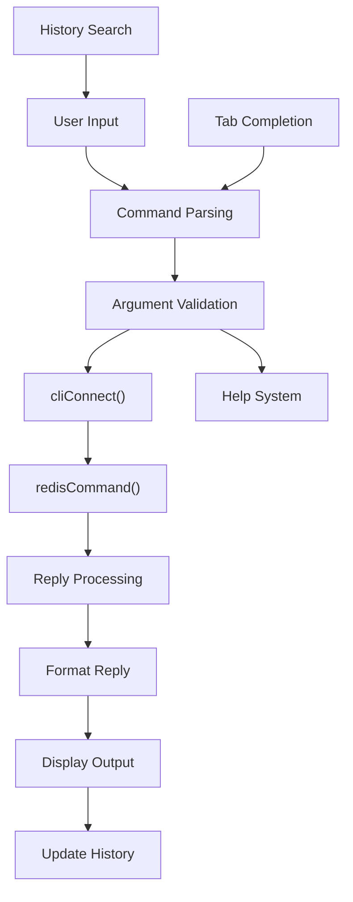
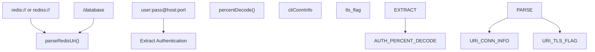

# Redis CLI and Benchmark Tools

Relevant source files

-   [src/cli\_common.c](https://github.com/redis/redis/blob/8ad54215/src/cli_common.c)
-   [src/cli\_common.h](https://github.com/redis/redis/blob/8ad54215/src/cli_common.h)
-   [src/redis-benchmark.c](https://github.com/redis/redis/blob/8ad54215/src/redis-benchmark.c)
-   [src/redis-cli.c](https://github.com/redis/redis/blob/8ad54215/src/redis-cli.c)
-   [tests/integration/redis-benchmark.tcl](https://github.com/redis/redis/blob/8ad54215/tests/integration/redis-benchmark.tcl)
-   [tests/integration/redis-cli.tcl](https://github.com/redis/redis/blob/8ad54215/tests/integration/redis-cli.tcl)
-   [tests/support/benchmark.tcl](https://github.com/redis/redis/blob/8ad54215/tests/support/benchmark.tcl)
-   [tests/unit/limits.tcl](https://github.com/redis/redis/blob/8ad54215/tests/unit/limits.tcl)

This document covers the client-side command-line tools provided with Redis: `redis-cli` and `redis-benchmark`. These tools provide interactive command execution, performance testing, and various operational utilities for Redis server management and diagnostics.

For information about the Redis server core and networking, see [Server Architecture and Lifecycle](/redis/redis/2.1-server-architecture-and-lifecycle) and [Client Connection Management](/redis/redis/2.2-client-connection-management). For details about Redis security features used by these tools, see [Access Control Lists](/redis/redis/8.1-access-control-lists) and [Network Security and TLS](/redis/redis/8.2-network-security-and-tls).

## Tool Overview

Redis provides two primary command-line utilities for client-side operations:

```mermaid
flowchart TD
    CLI["redis-cli"]
    BENCH["redis-benchmark"]
    COMMON["cli_common"]
    INTERACTIVE["Interactive Command Execution"]
    BATCH["Batch Processing"]
    MONITOR["Monitor Mode"]
    PUBSUB["Pub/Sub Mode"]
    CLUSTER["Cluster Management"]
    PERF["Performance Testing"]
    MULTI["Multi-threading"]
    PIPELINE["Pipelining"]
    STATS["Latency Statistics"]
    TLS["TLS/SSL Support"]
    URI["URI Parsing"]
    CONN["Connection Management"]
    SERVER["Redis Server Instance"]
    CLUSTER_NODES["Cluster Nodes"]

    CLI --> INTERACTIVE
    CLI --> BATCH
    CLI --> MONITOR
    CLI --> PUBSUB
    CLI --> CLUSTER
    BENCH --> PERF
    BENCH --> MULTI
    BENCH --> PIPELINE
    BENCH --> STATS
    COMMON --> TLS
    COMMON --> URI
    COMMON --> CONN
    CLI --> SERVER
    BENCH --> SERVER
    CLI --> CLUSTER_NODES
    BENCH --> CLUSTER_NODES
```

Sources: [src/redis-cli.c1-100](https://github.com/redis/redis/blob/8ad54215/src/redis-cli.c#L1-L100) [src/redis-benchmark.c1-100](https://github.com/redis/redis/blob/8ad54215/src/redis-benchmark.c#L1-L100) [src/cli\_common.h1-59](https://github.com/redis/redis/blob/8ad54215/src/cli_common.h#L1-L59)

## Redis CLI Architecture

The Redis CLI is implemented in `redis-cli.c` as a comprehensive command-line interface supporting multiple operational modes and advanced features.

### Core Configuration Structure

```mermaid
flowchart TD
    CONFIG["config struct"]
    CONN_INFO["cliConnInfo"]
    SSL_CONFIG["cliSSLconfig"]
    CLUSTER_CMD["clusterManagerCommand"]
    HOSTIP["hostip"]
    HOSTPORT["hostport"]
    DBNUM["input_dbnum"]
    AUTH["auth"]
    USER["user"]
    INTERACTIVE["interactive"]
    MONITOR["monitor_mode"]
    PUBSUB["pubsub_mode"]
    CLUSTER["cluster_mode"]
    SLAVE["slave_mode"]
    PIPE["pipe_mode"]
    SCAN["scan_mode"]
    LATENCY["latency_mode"]
    OUTPUT["output"]
    STANDARD["OUTPUT_STANDARD"]
    RAW["OUTPUT_RAW"]
    CSV["OUTPUT_CSV"]
    JSON["OUTPUT_JSON"]

    CONN --> INFO_HOSTIP
    CONN --> INFO_HOSTPORT
    CONN --> INFO_DBNUM
    CONN --> INFO_AUTH
    CONN --> INFO_USER
    CONFIG --> INTERACTIVE
    CONFIG --> MONITOR
    CONFIG --> PUBSUB
    CONFIG --> CLUSTER
    CONFIG --> SLAVE
    CONFIG --> PIPE
    CONFIG --> SCAN
    CONFIG --> LATENCY
    CONFIG --> OUTPUT
    OUTPUT --> STANDARD
    OUTPUT --> RAW
    OUTPUT --> CSV
    OUTPUT --> JSON
```

The main configuration is managed through a global `config` structure that encompasses connection details, operational modes, and output formatting options.

Sources: [src/redis-cli.c198-270](https://github.com/redis/redis/blob/8ad54215/src/redis-cli.c#L198-L270) [src/cli\_common.h27-34](https://github.com/redis/redis/blob/8ad54215/src/cli_common.h#L27-L34)

### Command Processing Pipeline

Sources: [src/redis-cli.c2800-3000](https://github.com/redis/redis/blob/8ad54215/src/redis-cli.c#L2800-L3000) [src/redis-cli.c1002-1100](https://github.com/redis/redis/blob/8ad54215/src/redis-cli.c#L1002-L1100)

### Help System Implementation

The CLI includes a comprehensive help system that dynamically loads command documentation:

Sources: [src/redis-cli.c918-967](https://github.com/redis/redis/blob/8ad54215/src/redis-cli.c#L918-L967) [src/redis-cli.c430-445](https://github.com/redis/redis/blob/8ad54215/src/redis-cli.c#L430-L445) [src/redis-cli.c902-914](https://github.com/redis/redis/blob/8ad54215/src/redis-cli.c#L902-L914)

## Redis Benchmark Architecture

Redis Benchmark provides performance testing capabilities with multi-threading and detailed latency analysis.

### Benchmark Configuration Structure

```mermaid
flowchart TD
    CONFIG["config struct"]
    THREADS["benchmarkThread[]"]
    CLIENTS["client list"]
    CLUSTER_NODES["clusterNode[]"]
    NUMCLIENTS["numclients"]
    REQUESTS["requests"]
    PIPELINE["pipeline"]
    NUM_THREADS["num_threads"]
    KEYSIZE["keysize"]
    DATASIZE["datasize"]
    THREAD_STRUCT["benchmarkThread"]
    THREAD_ID["index"]
    EVENT_LOOP["aeEventLoop *el"]
    PTHREAD["pthread_t thread"]
    CLIENT_STRUCT["_client"]
    CONTEXT["redisContext"]
    OBUF["sds obuf"]
    THREAD_ID_CLIENT["thread_id"]

    CONFIG --> NUMCLIENTS
    CONFIG --> REQUESTS
    CONFIG --> PIPELINE
    CONFIG --> NUM_THREADS
    CONFIG --> KEYSIZE
    CONFIG --> DATASIZE
    THREADS --> THREAD_STRUCT
    THREAD --> STRUCT_THREAD_ID
    THREAD --> STRUCT_EVENT_LOOP
    THREAD --> STRUCT_PTHREAD
    CLIENTS --> CLIENT_STRUCT
    CLIENT --> STRUCT_CONTEXT
    CLIENT --> STRUCT_OBUF
    CLIENT --> STRUCT_THREAD_ID_CLIENT
```

Sources: [src/redis-benchmark.c61-108](https://github.com/redis/redis/blob/8ad54215/src/redis-benchmark.c#L61-L108) [src/redis-benchmark.c134-138](https://github.com/redis/redis/blob/8ad54215/src/redis-benchmark.c#L134-L138) [src/redis-benchmark.c110-130](https://github.com/redis/redis/blob/8ad54215/src/redis-benchmark.c#L110-L130)

### Benchmark Execution Flow

```mermaid
flowchart TD
    PARSE_ARGS["Parse Arguments"]
    CREATE_THREADS["createBenchmarkThread()"]
    CREATE_CLIENTS["createMissingClients()"]
    WRITE_HANDLER["writeHandler()"]
    READ_HANDLER["readHandler()"]
    CLIENT_DONE["clientDone()"]
    LATENCY_HIST["hdr_histogram"]
    THROUGHPUT["showThroughput()"]
    STATS_COLLECTION["Statistics Collection"]
    MAIN_THREAD["Main Thread"]
    WORKER_THREADS["Worker Threads"]
    EXEC_THREAD["execBenchmarkThread()"]

    PARSE --> ARGS_CREATE_THREADS
    CREATE --> THREADS_CREATE_CLIENTS
    CREATE --> CLIENTS_WRITE_HANDLER
    WRITE --> HANDLER_READ_HANDLER
    READ --> HANDLER_CLIENT_DONE
    READ --> HANDLER_LATENCY_HIST
    MAIN --> THREAD_WORKER_THREADS
    WORKER --> THREADS_EXEC_THREAD
    EXEC --> THREAD_THROUGHPUT
    THROUGHPUT --> STATS_COLLECTION
```

Sources: [src/redis-benchmark.c555-602](https://github.com/redis/redis/blob/8ad54215/src/redis-benchmark.c#L555-L602) [src/redis-benchmark.c442-553](https://github.com/redis/redis/blob/8ad54215/src/redis-benchmark.c#L442-L553) [src/redis-benchmark.c169-182](https://github.com/redis/redis/blob/8ad54215/src/redis-benchmark.c#L169-L182)

### Latency Measurement System

```mermaid
flowchart TD
    HDR_HISTOGRAM["hdr_histogram"]
    CURRENT_SEC["current_sec_latency_histogram"]
    ATOMIC_RECORD["hdr_record_value_atomic()"]
    START_TIME["ustime() - start"]
    END_TIME["ustime() - latency calculation"]
    PRECISION["DEFAULT_LATENCY_PRECISION"]
    MIN_VALUE["CONFIG_LATENCY_HISTOGRAM_MIN_VALUE"]
    MAX_VALUE["CONFIG_LATENCY_HISTOGRAM_MAX_VALUE"]
    PERCENTILES["Percentile Calculations"]

    START --> TIME_END_TIME
    END --> TIME_ATOMIC_RECORD
    ATOMIC --> RECORD_HDR_HISTOGRAM
    ATOMIC --> RECORD_CURRENT_SEC
    HDR --> HISTOGRAM_PERCENTILES
    PERCENTILES --> MIN_VALUE
    PERCENTILES --> MAX_VALUE
```

Sources: [src/redis-benchmark.c49-51](https://github.com/redis/redis/blob/8ad54215/src/redis-benchmark.c#L49-L51) [src/redis-benchmark.c528-542](https://github.com/redis/redis/blob/8ad54215/src/redis-benchmark.c#L528-L542) [src/redis-benchmark.c452](https://github.com/redis/redis/blob/8ad54215/src/redis-benchmark.c#L452-L452)

## Common Client Functionality

The `cli_common` module provides shared functionality across Redis client tools.

### Connection Management

| Function | Purpose | Key Features |
| --- | --- | --- |
| `cliSecureConnection()` | TLS/SSL setup | Certificate validation, cipher configuration |
| `parseRedisUri()` | URI parsing | Support for `redis://` and `rediss://` schemes |
| `cliWriteConn()` | Raw connection writing | Transparent TLS support, buffer management |
| `redisConnectWrapper()` | Connection wrapper | Timeout support, error handling |

### SSL/TLS Configuration Structure

```mermaid
flowchart TD
    SSL_CONFIG["cliSSLconfig"]
    SSL_CTX["SSL_CTX"]
    SSL_OBJECT["SSL object"]
    SNI["sni"]
    CACERT["cacert"]
    CACERTDIR["cacertdir"]
    CERT["cert"]
    KEY["key"]
    CIPHERS["ciphers"]
    CIPHERSUITES["ciphersuites"]
    SKIP_VERIFY["skip_cert_verify"]
    SECURE_INIT["cliSecureInit()"]
    SECURE_CONN["cliSecureConnection()"]
    SSL_INIT["redisInitiateSSL()"]

    SSL --> CONFIG_SNI
    SSL --> CONFIG_CACERT
    SSL --> CONFIG_CACERTDIR
    SSL --> CONFIG_CERT
    SSL --> CONFIG_KEY
    SSL --> CONFIG_CIPHERS
    SSL --> CONFIG_CIPHERSUITES
    SSL --> CONFIG_SKIP_VERIFY
    SECURE --> INIT_SSL_CTX
    SSL --> CTX_SECURE_CONN
    SECURE --> CONN_SSL_OBJECT
    SSL --> OBJECT_SSL_INIT
```

Sources: [src/cli\_common.c39-109](https://github.com/redis/redis/blob/8ad54215/src/cli_common.c#L39-L109) [src/cli\_common.h7-24](https://github.com/redis/redis/blob/8ad54215/src/cli_common.h#L7-L24)

### URI Parsing Implementation

The URI parsing system supports Redis connection URIs with authentication and database selection:

Sources: [src/cli\_common.c294-362](https://github.com/redis/redis/blob/8ad54215/src/cli_common.c#L294-L362) [src/cli\_common.c257-284](https://github.com/redis/redis/blob/8ad54215/src/cli_common.c#L257-L284)

## Cluster Support

Both tools include comprehensive Redis Cluster support with automatic slot mapping and failover handling.

### Cluster Management in CLI

```mermaid
flowchart TD
    CLUSTER_CMD["clusterManagerCommand"]
    NODE_ARRAY["clusterNode[]"]
    SLOT_CONFIG["Slot Configuration"]
    CREATE_CLUSTER["create"]
    CHECK_CLUSTER["check"]
    REBALANCE["rebalance"]
    RESHARD["reshard"]
    ADD_NODE["add-node"]
    DEL_NODE["del-node"]
    NODE_STRUCT["clusterNode"]
    NODE_IP["ip"]
    NODE_PORT["port"]
    SLOTS["slots[]"]
    FLAGS["flags"]

    NODE --> ARRAY_NODE_STRUCT
    NODE --> STRUCT_NODE_IP
    NODE --> STRUCT_NODE_PORT
    NODE --> STRUCT_SLOTS
    NODE --> STRUCT_FLAGS
    CLUSTER --> CMD_CREATE_CLUSTER
    CLUSTER --> CMD_CHECK_CLUSTER
    CLUSTER --> CMD_REBALANCE
    CLUSTER --> CMD_RESHARD
    CLUSTER --> CMD_ADD_NODE
    CLUSTER --> CMD_DEL_NODE
    NODE --> ARRAY_SLOT_CONFIG
```

Sources: [src/redis-cli.c172-192](https://github.com/redis/redis/blob/8ad54215/src/redis-cli.c#L172-L192) [src/redis-cli.c66-118](https://github.com/redis/redis/blob/8ad54215/src/redis-cli.c#L66-L118)

### Benchmark Cluster Support

```mermaid
flowchart TD
    CLUSTER_MODE["cluster_mode"]
    SLOT_UPDATE["updateClusterSlotsConfiguration()"]
    HASHTAG["setClusterKeyHashTag()"]
    FETCH_SLOTS["fetchClusterSlotsConfiguration()"]
    CRC16_TABLE["crc16_slot_table[]"]
    SLOT_ASSIGNMENT["Random Slot Selection"]
    MOVED_ERROR["MOVED response"]
    ASK_ERROR["ASK response"]
    CLUSTER_DOWN["CLUSTERDOWN response"]

    CLUSTER --> MODE_SLOT_UPDATE
    SLOT --> UPDATE_FETCH_SLOTS
    FETCH --> SLOTS_CRC16_TABLE
    CRC16 --> TABLE_HASHTAG
    HASHTAG --> SLOT_ASSIGNMENT
    MOVED --> ERROR_FETCH_SLOTS
    ASK --> ERROR_FETCH_SLOTS
    CLUSTER --> DOWN_FETCH_SLOTS
```

Sources: [src/redis-benchmark.c395-418](https://github.com/redis/redis/blob/8ad54215/src/redis-benchmark.c#L395-L418) [src/redis-benchmark.c475-492](https://github.com/redis/redis/blob/8ad54215/src/redis-benchmark.c#L475-L492) [src/redis-benchmark.c179-180](https://github.com/redis/redis/blob/8ad54215/src/redis-benchmark.c#L179-L180)

## Testing and Validation

Both tools include comprehensive test suites that validate functionality across different scenarios.

### CLI Test Coverage

| Test Category | Test File Location | Key Features |
| --- | --- | --- |
| Interactive CLI | [tests/integration/redis-cli.tcl80-86](https://github.com/redis/redis/blob/8ad54215/tests/integration/redis-cli.tcl#L80-L86) | Terminal interaction, history search |
| Command parsing | [tests/integration/redis-cli.tcl380-397](https://github.com/redis/redis/blob/8ad54215/tests/integration/redis-cli.tcl#L380-L397) | Quote handling, argument validation |
| Subscription modes | [tests/integration/redis-cli.tcl399-444](https://github.com/redis/redis/blob/8ad54215/tests/integration/redis-cli.tcl#L399-L444) | Pub/sub, push message handling |
| Output formats | [tests/integration/redis-cli.tcl518-540](https://github.com/redis/redis/blob/8ad54215/tests/integration/redis-cli.tcl#L518-L540) | JSON, CSV, raw output |
| URI connections | [tests/integration/redis-cli.tcl40-51](https://github.com/redis/redis/blob/8ad54215/tests/integration/redis-cli.tcl#L40-L51) | Authentication, TLS |

### Benchmark Test Coverage

| Test Category | Test File Location | Key Features |
| --- | --- | --- |
| Basic benchmarks | [tests/integration/redis-benchmark.tcl34-38](https://github.com/redis/redis/blob/8ad54215/tests/integration/redis-benchmark.tcl#L34-L38) | Set/get operations |
| Multi-threading | [tests/integration/redis-benchmark.tcl78-85](https://github.com/redis/redis/blob/8ad54215/tests/integration/redis-benchmark.tcl#L78-L85) | Thread safety, statistics |
| Pipelining | [tests/integration/redis-benchmark.tcl87-97](https://github.com/redis/redis/blob/8ad54215/tests/integration/redis-benchmark.tcl#L87-L97) | Pipeline depth validation |
| Custom commands | [tests/integration/redis-benchmark.tcl99-108](https://github.com/redis/redis/blob/8ad54215/tests/integration/redis-benchmark.tcl#L99-L108) | Arbitrary command execution |
| TLS support | [tests/integration/redis-benchmark.tcl139-176](https://github.com/redis/redis/blob/8ad54215/tests/integration/redis-benchmark.tcl#L139-L176) | Cipher configuration |

Sources: [tests/integration/redis-cli.tcl1-50](https://github.com/redis/redis/blob/8ad54215/tests/integration/redis-cli.tcl#L1-L50) [tests/integration/redis-benchmark.tcl1-50](https://github.com/redis/redis/blob/8ad54215/tests/integration/redis-benchmark.tcl#L1-L50)
