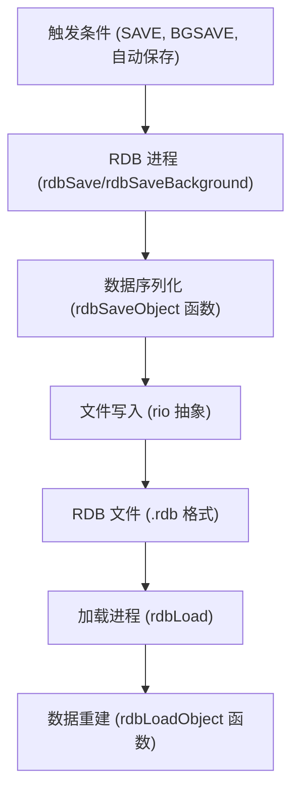
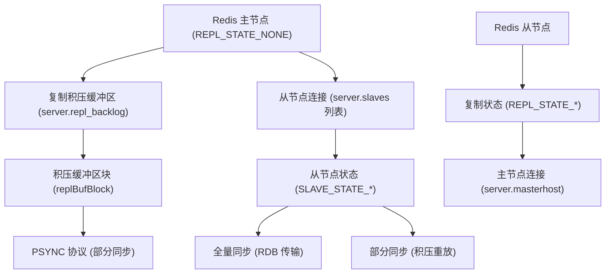
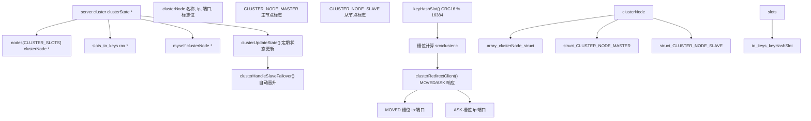
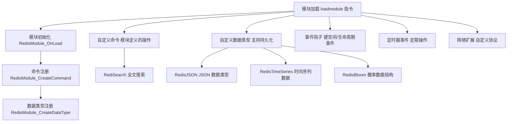
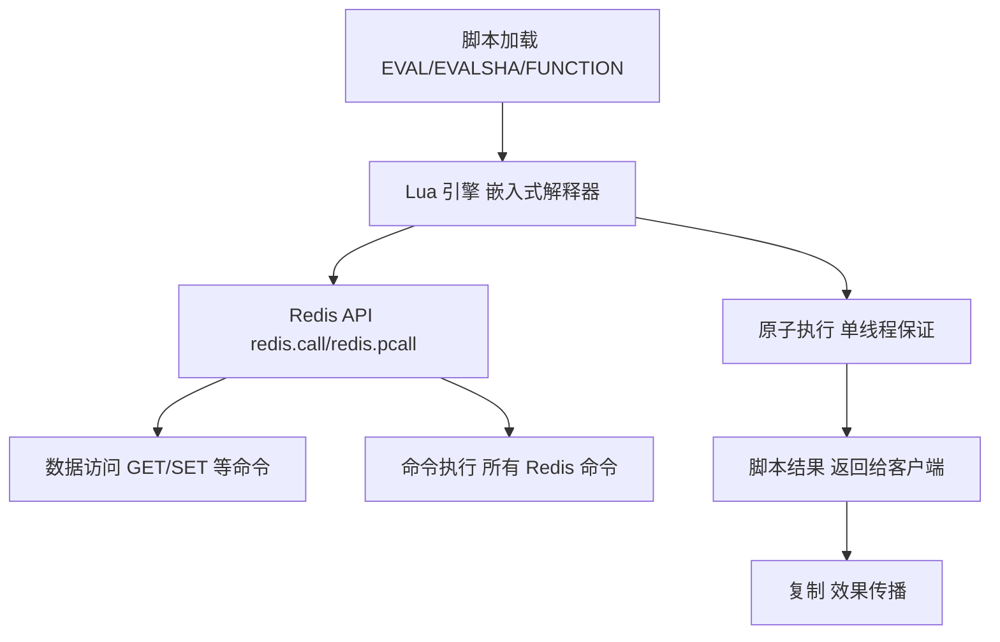

# Redis 概览

相关源文件

-   [README.md](https://github.com/redis/redis/blob/8ad54215/README.md)

## 什么是 Redis？

Redis 是一款快速、通用的内存数据结构服务器，可用作缓存、数据库、消息代理和搜索引擎。对于构建实时数据驱动应用程序的开发人员，Redis 提供了最快且功能最丰富的数据平台，读写操作均具有亚毫秒级的延迟。

### 核心使用场景

Redis 在多个领域的各种应用中表现出色：

| 类别 | 使用场景 | 使用的 Redis 特性 |
| --- | --- | --- |
| **缓存** | 会话存储、API 响应缓存、数据库查询缓存 | 多种逐出策略、键过期、哈希字段过期 |
| **数据结构** | 计数器、队列、排行榜、速率限制器 | 字符串（Strings）、列表（Lists）、集合（Sets）、有序集合（Sorted Sets）、哈希（Hashes）、事务、脚本 |
| **实时分析** | 个性化、推荐、欺诈检测 | 时间序列（Time series）、概率数据结构、聚合 |
| **消息传递与事件** | 任务队列、发布/订阅（Pub/Sub）、事件流 | 列表（Lists）、有序集合（Sorted Sets）、流（Streams）、发布/订阅（Pub/Sub） |
| **搜索与 AI** | 文档搜索、向量相似度、语义缓存 | JSON 文档、向量搜索、通过 Redis 查询引擎进行全文本搜索 |

### 为什么选择 Redis？

-   **性能**：采用高效数据结构的内存存储，实现了亚毫秒级延迟。
-   **灵活性**：除了简单的键值存储外，还提供丰富的原生数据类型集。
-   **可扩展性**：提供用于自定义功能和快速命令实现的模块 API（Module API）。
-   **简洁性**：命令文档齐全，使用基于文本的 RESP 协议。
-   **多功能性**：在各种生产工作负载中经过了大规模的实战检验。
-   **无处不在**：已成为缓存、会话管理、队列和实时应用程序的事实标准。

### 技术架构基础

Redis 使用 C 语言实现，围绕单线程事件驱动核心构建，并具有可选的 I/O 线程。其架构核心在于：

-   **事件驱动设计**：基于 `ae` 事件循环构建，使用 `epoll`/`kqueue` 进行 I/O 多路复用。
-   **统一对象模型**：所有数据均存储为 `robj`（Redis 对象），并具有特定类型的编码。
-   **内存优先方法**：内存作为主要存储，具有可选的持久化机制。
-   **扩展框架**：模块 API（Module API）和嵌入式 Lua 脚本支持可编程性。
-   **分布式能力**：内置集群和复制功能以实现高可用性。

[src/server.c](https://github.com/redis/redis/blob/8ad54215/src/server.c) 中的服务器核心通过 `struct redisServer` 类型的全局变量 `server` 协调所有子系统。

**来源：** [README.md42-194](https://github.com/redis/redis/blob/8ad54215/README.md#L42-L194) [src/server.c5000-5300](https://github.com/redis/redis/blob/8ad54215/src/server.c#L5000-L5300) [src/server.h1800-2200](https://github.com/redis/redis/blob/8ad54215/src/server.h#L1800-L2200)

## Redis 架构概览

Redis 架构旨在通过以 `redisServer` 结构为中心的分层系统实现高性能、可扩展性和可扩展性。

### 系统高层架构

```mermaid
flowchart TD
    redis_cli["redis-cli 交互式客户端"]
    redis_benchmark["redis-benchmark 性能测试"]
    client_libs["客户端库 Python, Java, Node.js 等"]
    networking["网络层 networking.c"]
    command_proc["命令处理 server.c"]
    data_storage["数据存储 db.c, kvstore.h"]
    persistence["持久化 rdb.c, aof.c"]
    core_types["核心数据类型 t_string.c, t_list.c, t_hash.c"]
    memory_mgmt["内存管理 zmalloc.c, object.c"]
    data_structures["高效结构 dict.c, ziplist.c, listpack.c"]
    modules["Redis 模块 module.c"]
    lua_scripts["Lua 脚本 script.c"]
    functions["Redis 函数 functions.c"]
    replication["主从复制 replication.c"]
    cluster["Redis 集群 cluster.c"]
    sentinel["Redis 哨兵 sentinel.c"]

    client --> libs_networking
    redis --> cli_networking
    redis --> benchmark_networking
    networking --> command_proc
    command --> proc_data_storage
    command --> proc_core_types
    data --> storage_memory_mgmt
    data --> storage_data_structures
    data --> storage_persistence
    command --> proc_modules
    command --> proc_lua_scripts
    command --> proc_functions
    data --> storage_replication
    command --> proc_cluster
    sentinel --> replication
```



### 核心组件集成

Redis 服务器通过全局变量 `server` 集成了几个关键子系统：

| 组件 | 实现文件 | 主要职责 |
| --- | --- | --- |
| **事件循环** | `ae.c`, `ae.h` | I/O 多路复用和事件处理 |
| **网络** | `networking.c` | 客户端连接和 RESP 协议 |
| **命令系统** | `server.c`, `commands/` | 命令注册和执行 |
| **存储引擎** | `db.c`, `kvstore.c` | 键值存储和数据库管理 |
| **内存管理** | `zmalloc.c`, `object.c` | 内存分配和对象生命周期 |
| **持久化** | `rdb.c`, `aof.c` | 数据持久性和恢复 |
| **复制** | `replication.c` | 主从同步 |
| **扩展** | `module.c`, `script.c` | 可编程性和自定义功能 |

### 数据流架构

```mermaid
flowchart TD
    client_request["客户端请求 RESP 协议"]
    networking_read["readQueryFromClient() networking.c"]
    command_parse["processInputBuffer() 解析命令"]
    command_lookup["lookupCommand() server.commands"]
    acl_check["ACL 验证 acl.c"]
    command_exec["call() 执行命令"]
    data_ops["数据操作 db.c, t_*.c"]
    persistence_log["持久化 AOF/RDB 日志"]
    repl_propagate["复制 传播到从节点"]
    response_gen["addReply() 生成响应"]
    networking_write["sendReplyToClient() networking.c"]
    client_response["客户端响应 RESP 协议"]

    client --> request_networking_read
    networking --> read_command_parse
    command --> parse_command_lookup
    command --> lookup_acl_check
    acl --> check_command_exec
    command --> exec_data_ops
    data --> ops_persistence_log
    data --> ops_repl_propagate
    command --> exec_response_gen
    response --> gen_networking_write
    networking --> write_client_response
```



**来源：** [src/server.c5000-5300](https://github.com/redis/redis/blob/8ad54215/src/server.c#L5000-L5300) [src/networking.c120-300](https://github.com/redis/redis/blob/8ad54215/src/networking.c#L120-L300) [src/db.c195-350](https://github.com/redis/redis/blob/8ad54215/src/db.c#L195-L350) [src/ae.c](https://github.com/redis/redis/blob/8ad54215/src/ae.c) [src/ae.h](https://github.com/redis/redis/blob/8ad54215/src/ae.h) [src/commands/](https://github.com/redis/redis/blob/8ad54215/src/commands/)

## 服务器核心组件

Redis 服务器核心在 [src/server.c](https://github.com/redis/redis/blob/8ad54215/src/server.c) 中实现，并通过 `struct redisServer` 类型的全局变量 `server` 进行管理。主服务器循环由 [src/ae.h](https://github.com/redis/redis/blob/8ad54215/src/ae.h) 中定义的事件系统驱动。

### 全局服务器状态

`redisServer` 结构包含所有关键服务器状态，包括：

-   **数据库数组**：`server.db` 持有多个 Redis 数据库。
-   **客户端追踪**：`server.clients` 维护活跃的客户端连接。
-   **配置**：由 [src/config.c](https://github.com/redis/redis/blob/8ad54215/src/config.c) 管理的运行时配置参数。
-   **复制状态**：主/从状态和复制积压缓冲区（backlog）。
-   **集群状态**：集群模式下的节点信息和槽位（slot）映射。
-   **模块状态**：已加载的模块及其注册的命令。

### 命令处理流水线实现

```mermaid
flowchart TD
    client_conn["client *c 连接"]
    readQueryFromClient["readQueryFromClient() src/networking.c:1500"]
    processInputBuffer["processInputBuffer() RESP 协议解析器"]
    processCommand["processCommand() src/server.c:3500"]
    lookupCommand["lookupCommand() server.commands 字典"]
    ACLCheckAllPerm["ACLCheckAllPerm() src/acl.c:1800"]
    call_func["call() src/server.c:2900"]
    redisCommand_proc["cmd->proc() 命令处理函数"]
    selectDb["selectDb() server.db[dbid]"]
    lookupKeyWrite["lookupKeyWrite() src/db.c:285"]
    expireIfNeeded["expireIfNeeded() src/db.c:45"]
    type_handlers["类型处理程序 t_string.c, t_list.c 等"]
    moduleCommand["模块命令 RedisModuleCmdFunc"]
    evalGenericCommand["evalGenericCommand() src/script.c"]
    propagate["propagate() AOF + 复制"]
    feedAppendOnlyFile["feedAppendOnlyFile() src/aof.c"]
    replicationFeedSlaves["replicationFeedSlaves() src/replication.c"]
    addReply["addReply() src/networking.c:448"]
    sendReplyToClient["sendReplyToClient() src/networking.c"]

    client --> conn_readQueryFromClient
    readQueryFromClient --> processInputBuffer
    processInputBuffer --> processCommand
    processCommand --> lookupCommand
    lookupCommand --> ACLCheckAllPerm
    ACLCheckAllPerm --> call_func
    call --> func_redisCommand_proc
    redisCommand --> proc_selectDb
    selectDb --> lookupKeyWrite
    lookupKeyWrite --> expireIfNeeded
    redisCommand --> proc_type_handlers
    redisCommand --> proc_moduleCommand
    redisCommand --> proc_evalGenericCommand
    type --> handlers_propagate
    propagate --> feedAppendOnlyFile
    propagate --> replicationFeedSlaves
    call --> func_addReply
    addReply --> sendReplyToClient
```

流水线中的关键数据结构和函数：

-   **`client` 结构体**：代表单个客户端连接，包含查询缓冲区和回复缓冲区。
-   **`redisCommand` 结构体**：包含命令元数据，包括 `proc` 函数指针和标志位。
-   **`server.commands`**：将命令名称映射到 `redisCommand` 结构体的哈希表。
-   **`server.db[]`**：`redisDb` 结构体数组，每个结构体包含 `keys` 和 `expires` 键值存储实例。
-   **`call()` 函数**：核心命令执行函数，负责监控、日志记录和传播。
-   **`propagate()`**：确保命令效果到达 AOF 文件和从节点实例。

**来源：** [src/networking.c1500-1600](https://github.com/redis/redis/blob/8ad54215/src/networking.c#L1500-L1600) [src/server.c2900-3000](https://github.com/redis/redis/blob/8ad54215/src/server.c#L2900-L3000) [src/server.c3500-3700](https://github.com/redis/redis/blob/8ad54215/src/server.c#L3500-L3700) [src/db.c45-100](https://github.com/redis/redis/blob/8ad54215/src/db.c#L45-L100) [src/db.c285-300](https://github.com/redis/redis/blob/8ad54215/src/db.c#L285-L300) [src/acl.c1800-1900](https://github.com/redis/redis/blob/8ad54215/src/acl.c#L1800-L1900)

## 数据管理系统

Redis 通过围绕 `kvstore` 抽象构建的多层存储系统来组织数据，该抽象同时支持单实例和集群部署。

### 数据存储架构与键管理

```mermaid
flowchart TD
    redisServer_db["server.db[16] struct redisDb*"]
    redisDb_keys["db->keys kvstore *"]
    redisDb_expires["db->expires kvstore *"]
    kvstoreIteratorInit["kvstoreIteratorInit() src/kvstore.c"]
    kvstoreDictLookup["kvstoreDictLookup() 基于槽位的查找"]
    dictFind["dictFind() src/dict.c"]
    dictEntry["dictEntry *de 哈希表条目"]
    dictGetKV["dictGetKV(de) 返回 kvobj*"]
    kvobj_robj["kvobj (robj) 统一的键值对象"]
    kvobjGetKey["kvobjGetKey() 嵌入式键访问"]
    object_ptr["o->ptr 值指针"]
    OBJ_STRING_encoding["OBJ_STRING+ 编码变体"]
    OBJ_LIST_encoding["OBJ_LIST+ OBJ_ENCODING_QUICKLIST"]
    OBJ_HASH_encoding["OBJ_HASH+ OBJ_ENCODING_LISTPACK"]
    OBJ_SET_encoding["OBJ_SET+ 编码变体"]
    OBJ_ZSET_encoding["OBJ_ZSET+ OBJ_ENCODING_SKIPLIST"]
    OBJ_STREAM_encoding["OBJ_STREAM+ 流结构"]
    expireIfNeeded_check["expireIfNeeded() src/db.c:45"]
    dbDelete["dbDelete() 基于 TTL 的移除"]

    redisServer --> db_redisDb_keys
    redisServer --> db_redisDb_expires
    redisDb --> keys_kvstoreIteratorInit
    redisDb --> keys_kvstoreDictLookup
    kvstoreDictLookup --> dictFind
    dictFind --> dictEntry
    dictEntry --> dictGetKV
    dictGetKV --> kvobj_robj
    kvobj --> robj_kvobjGetKey
    kvobj --> robj_object_ptr
    object --> ptr_OBJ_STRING_encoding
    object --> ptr_OBJ_LIST_encoding
    object --> ptr_OBJ_HASH_encoding
    object --> ptr_OBJ_SET_encoding
    object --> ptr_OBJ_ZSET_encoding
    object --> ptr_OBJ_STREAM_encoding
    redisDb --> expires_expireIfNeeded_check
    expireIfNeeded --> check_dbDelete
```



#### 核心数据访问函数

| 函数 | 用途 | 位置 |
| --- | --- | --- |
| `lookupKey()` | 带有过期的统一键查找 | [src/db.c198-253](https://github.com/redis/redis/blob/8ad54215/src/db.c#L198-L253) |
| `lookupKeyRead()` | 只读键访问 | [src/db.c271-273](https://github.com/redis/redis/blob/8ad54215/src/db.c#L271-L273) |
| `lookupKeyWrite()` | 带有过期执行的写访问 | [src/db.c285-287](https://github.com/redis/redis/blob/8ad54215/src/db.c#L285-L287) |
| `dbAdd()` | 添加新的键值对 | [src/db.c325-341](https://github.com/redis/redis/blob/8ad54215/src/db.c#L325-L341) |
| `dbDelete()` | 移除键并处理清理 | [src/db.c390-420](https://github.com/redis/redis/blob/8ad54215/src/db.c#L390-L420) |
| `expireIfNeeded()` | TTL 检查和过期处理 | [src/db.c45-100](https://github.com/redis/redis/blob/8ad54215/src/db.c#L45-L100) |

`kvobj` 类型扩展了 `robj`，将键直接嵌入对象结构中以提高内存效率，这对短键特别有利。这种统一的方法减少了内存碎片并提高了缓存局部性。

**来源：** [src/db.c45-420](https://github.com/redis/redis/blob/8ad54215/src/db.c#L45-L420) [src/server.h69-92](https://github.com/redis/redis/blob/8ad54215/src/server.h#L69-L92) [src/kvstore.h](https://github.com/redis/redis/blob/8ad54215/src/kvstore.h) [src/dict.c](https://github.com/redis/redis/blob/8ad54215/src/dict.c) [src/object.c39-85](https://github.com/redis/redis/blob/8ad54215/src/object.c#L39-L85)

## 持久化层

Redis 提供两种持久化机制，可以独立运行或结合使用：

### RDB (Redis 数据库) 快照



`rdb.c` 中的 RDB 实现提供：

-   **二进制格式**：所有数据的高效二进制序列化 [src/rdb.c95-188](https://github.com/redis/redis/blob/8ad54215/src/rdb.c#L95-L188)。
-   **后台保存**：基于 fork 的 `BGSAVE`，避免阻塞主进程 [src/rdb.c](https://github.com/redis/redis/blob/8ad54215/src/rdb.c)。
-   **压缩**：对字符串值进行可选的 LZF 压缩。
-   **完整性检查**：用于数据验证的 CRC64 校验和。

### AOF (追加日志文件) 日志

AOF 系统记录命令以提供时间点恢复：

-   **命令日志记录**：所有写命令都追加到 AOF 文件中 [src/aof.c1-50](https://github.com/redis/redis/blob/8ad54215/src/aof.c#L1-L50)。
-   **多部分 AOF**：基础文件（RDB 格式）加上增量文件（AOF 格式） [src/aof.c47-70](https://github.com/redis/redis/blob/8ad54215/src/aof.c#L47-L70)。
-   **后台重写**：通过 `BGREWRITEAOF` 定期进行 AOF 压缩。
-   **清单追踪**：`aofManifest` 结构管理多个 AOF 文件 [src/aof.c152-171](https://github.com/redis/redis/blob/8ad54215/src/aof.c#L152-L171)。

**来源：** [src/rdb.c95-500](https://github.com/redis/redis/blob/8ad54215/src/rdb.c#L95-L500) [src/aof.c1-300](https://github.com/redis/redis/blob/8ad54215/src/aof.c#L1-L300) [src/server.h1600-1700](https://github.com/redis/redis/blob/8ad54215/src/server.h#L1600-L1700)

## 高可用系统

Redis 支持多种高可用性和可扩展性部署模式：

### 复制系统



复制系统处理：

-   **全量同步**：向新从节点进行初始 RDB 传输 [src/replication.c100-200](https://github.com/redis/redis/blob/8ad54215/src/replication.c#L100-L200)。
-   **部分同步**：使用复制积压缓冲区进行增量更新 [src/replication.c200-400](https://github.com/redis/redis/blob/8ad54215/src/replication.c#L200-L400)。
-   **从节点状态管理**：通过 `REPL_STATE_*` 和 `SLAVE_STATE_*` 常量进行管理 [src/server.h495-556](https://github.com/redis/redis/blob/8ad54215/src/server.h#L495-L556)。

### Redis 集群实现



#### 关键集群数据结构和函数

| 组件 | 用途 | 实现位置 |
| --- | --- | --- |
| `clusterState` | 全局集群状态 | [src/cluster.c100-200](https://github.com/redis/redis/blob/8ad54215/src/cluster.c#L100-L200) |
| `clusterNode` | 单个节点信息 | [src/cluster.c80-95](https://github.com/redis/redis/blob/8ad54215/src/cluster.c#L80-L95) |
| `keyHashSlot()` | 将键映射到哈希槽 | [src/cluster.c1000-1020](https://github.com/redis/redis/blob/8ad54215/src/cluster.c#L1000-L1020) |
| `clusterRedirectClient()` | 处理槽位迁移 | [src/cluster.c4500-4600](https://github.com/redis/redis/blob/8ad54215/src/cluster.c#L4500-L4600) |
| `clusterCron()` | 定期集群维护 | [src/cluster.c5000-5200](https://github.com/redis/redis/blob/8ad54215/src/cluster.c#L5000-L5200) |

集群运行 16384 个哈希槽，分布在主节点上，使用 CRC16 哈希函数进行确定性的键到槽映射。通过 `MOVED` 和 `ASK` 响应进行的客户端重定向处理集群重新配置期间的槽位迁移。

**来源：** [src/cluster.c80-200](https://github.com/redis/redis/blob/8ad54215/src/cluster.c#L80-L200) [src/cluster.c1000-1020](https://github.com/redis/redis/blob/8ad54215/src/cluster.c#L1000-L1020) [src/cluster.c4500-4600](https://github.com/redis/redis/blob/8ad54215/src/cluster.c#L4500-L4600) [src/cluster.c5000-5200](https://github.com/redis/redis/blob/8ad54215/src/cluster.c#L5000-L5200)

### 复制系统实现


#### 核心复制函数

| 函数 | 用途 | 关键行为 |
| --- | --- | --- |
| `replicationFeedSlaves()` | 将命令传播到从节点 | [src/replication.c400-500](https://github.com/redis/redis/blob/8ad54215/src/replication.c#L400-L500) |
| `syncCommand()` | 处理 SYNC/PSYNC 请求 | [src/replication.c800-1000](https://github.com/redis/redis/blob/8ad54215/src/replication.c#L800-L1000) |
| `replicationSendAck()` | 从节点确认 | [src/replication.c1500-1550](https://github.com/redis/redis/blob/8ad54215/src/replication.c#L1500-L1550) |
| `startBgsaveForReplication()` | 启动全量同步 | [src/replication.c600-700](https://github.com/redis/redis/blob/8ad54215/src/replication.c#L600-L700) |
| `replicationScriptCacheFlush()` | 脚本缓存管理 | [src/replication.c1200-1250](https://github.com/redis/redis/blob/8ad54215/src/replication.c#L1200-L1250) |

复制系统维护一个循环缓冲区（`repl_backlog`）用于部分同步，允许从节点从特定偏移量开始追赶，而无需进行完整的 RDB 传输。`PSYNC` 命令实现了高效的从节点重连。

**来源：** [src/replication.c400-1550](https://github.com/redis/redis/blob/8ad54215/src/replication.c#L400-L1550) [src/server.h495-570](https://github.com/redis/redis/blob/8ad54215/src/server.h#L495-L570) [src/rdb.c1200-1400](https://github.com/redis/redis/blob/8ad54215/src/rdb.c#L1200-L1400)

## 构建系统与入门指南

### 从源码编译 Redis

Redis 提供了一个支持多平台和配置的全面构建系统。构建过程通过 [Makefile](https://github.com/redis/redis/blob/8ad54215/Makefile) 控制，并具有用于不同特性的各种标志。

#### 核心编译选项

| 编译标志 | 用途 | 依赖 |
| --- | --- | --- |
| `BUILD_WITH_MODULES=yes` | 启用所有数据结构和 Redis 查询引擎 | CMake, Rust 工具链 |
| `BUILD_TLS=yes` | 启用 TLS/SSL 支持 | OpenSSL 开发库 |
| `USE_SYSTEMD=yes` | 启用 systemd 集成 | systemd 开发库 |
| `MALLOC=jemalloc` | 使用 jemalloc 分配器 | jemalloc (Linux 上默认) |

#### 基础编译流程

```
# 下载 Redis 源码
cd /usr/src
wget -O redis-8.0.0.tar.gz https://github.com/redis/redis/archive/refs/tags/8.0.0.tar.gz
tar xvf redis-8.0.0.tar.gz
cd redis-8.0.0

# 编译所有特性
export BUILD_TLS=yes BUILD_WITH_MODULES=yes INSTALL_RUST_TOOLCHAIN=yes DISABLE_WERRORS=yes
make -j "$(nproc)" all

# 运行 Redis
./src/redis-server redis-full.conf
```

#### 构建系统架构

```mermaid
flowchart TD
    makefile["Makefile 顶层构建控制"]
    src_makefile["src/Makefile 核心构建逻辑"]
    deps_build["deps/ 第三方依赖"]
    redis_server["redis-server 主服务器二进制文件"]
    redis_cli["redis-cli 客户端二进制文件"]
    redis_benchmark["redis-benchmark 测试工具"]
    redis_sentinel["redis-sentinel 高可用监控"]
    jemalloc["jemalloc 内存分配器"]
    lua["lua 脚本引擎"]
    hiredis["hiredis C 客户端库"]
    linenoise["linenoise 行编辑库"]
    modules_build["构建模块 JSON, Search, TimeSeries"]
    cmake_build["CMake 构建 复杂的模块依赖"]
    rust_build["Rust 组件 高性能模块"]

    makefile --> src_makefile
    makefile --> deps_build
    src --> makefile_redis_server
    src --> makefile_redis_cli
    src --> makefile_redis_benchmark
    src --> makefile_redis_sentinel
    deps --> build_jemalloc
    deps --> build_lua
    deps --> build_hiredis
    deps --> build_linenoise
    makefile --> modules_build
    modules --> build_cmake_build
    modules --> build_rust_build
```



### 客户端工具与实用程序

Redis 包含多个用于不同操作需求的命令行工具：

| 工具 | 用途 | 关键特性 |
| --- | --- | --- |
| `redis-cli` | 交互式客户端与管理 | REPL 模式、集群管理、脚本编写 |
| `redis-benchmark` | 性能测试与负载生成 | 多种测试场景、延迟分析 |
| `redis-server` | 主服务器二进制文件 | 所有部署模式（单机、集群、哨兵） |
| `redis-sentinel` | 高可用监控 | 自动故障转移、服务发现 |
| `redis-check-rdb` | RDB 文件验证与修复 | 数据完整性验证 |
| `redis-check-aof` | AOF 文件验证与修复 | 日志文件一致性检查 |

### 开发与测试

代码库包含全面的测试基础设施：

-   **单元测试**：位于 [tests/unit/](https://github.com/redis/redis/blob/8ad54215/tests/unit/)，使用 TCL 测试框架。
-   **集成测试**：集群和哨兵测试位于 [tests/cluster/](https://github.com/redis/redis/blob/8ad54215/tests/cluster/) 和 [tests/sentinel/](https://github.com/redis/redis/blob/8ad54215/tests/sentinel/)。
-   **持续集成**：GitHub Actions 工作流位于 [.github/workflows/](https://github.com/redis/redis/blob/8ad54215/.github/workflows/)。
-   **内存测试**：Valgrind 集成和内存泄漏检测。
-   **性能基准测试**：内置基准测试和性能分析工具。

**来源：** [README.md200-830](https://github.com/redis/redis/blob/8ad54215/README.md#L200-L830) [Makefile](https://github.com/redis/redis/blob/8ad54215/Makefile) [src/Makefile](https://github.com/redis/redis/blob/8ad54215/src/Makefile) [deps/](https://github.com/redis/redis/blob/8ad54215/deps/) [tests/](https://github.com/redis/redis/blob/8ad54215/tests/) [.github/workflows/](https://github.com/redis/redis/blob/8ad54215/.github/workflows/)

## 可扩展性框架

Redis 提供了多种在核心数据类型和命令之外扩展功能的机制。

### 模块系统

Redis 模块 API（Redis Modules API）在 [src/module.c](https://github.com/redis/redis/blob/8ad54215/src/module.c) 中实现，提供了一个全面的 C 语言扩展框架：



关键模块能力包括：

-   **命令注册**：通过 `RedisModule_CreateCommand()` 注册自定义命令。
-   **数据类型扩展**：支持持久化和复制的自定义数据类型。
-   **事件通知**：键空间事件、客户端连接和服务器生命周期钩子。
-   **内存管理**：与 Redis 内存追踪和限制集成。
-   **网络**：自定义协议处理程序和连接管理。

### Lua 脚本与函数

嵌入式 Lua 脚本在 [src/script.c](https://github.com/redis/redis/blob/8ad54215/src/script.c) 中实现，提供服务器端可编程性：



脚本特性包括：

-   **脚本执行**：用于执行 Lua 代码的 `EVAL`、`EVALSHA` 和 `FUNCTION` 命令。
-   **原子操作**：脚本在 Redis 事件循环中原子地执行。
-   **Redis API 访问**：用于命令执行的 `redis.call()` 和 `redis.pcall()` 函数。
-   **持久化函数**：在服务器重启后依然存在的函数库。
-   **效果复制**：脚本效果会传播到从节点并记录到 AOF。

**来源：** [src/module.c](https://github.com/redis/redis/blob/8ad54215/src/module.c) [src/script.c](https://github.com/redis/redis/blob/8ad54215/src/script.c) [src/functions.c](https://github.com/redis/redis/blob/8ad54215/src/functions.c)

## 配置与管理

Redis 配置通过以下方式管理：

-   **配置文件**：具有广泛选项的 `redis.conf` [redis.conf1-100](https://github.com/redis/redis/blob/8ad54215/redis.conf#L1-L100)。
-   **运行时配置**：`CONFIG GET/SET` 命令 [src/config.c400-600](https://github.com/redis/redis/blob/8ad54215/src/config.c#L400-L600)。
-   **标准化配置系统**：类型安全的配置处理 [src/config.c170-280](https://github.com/redis/redis/blob/8ad54215/src/config.c#L170-L280)。

配置系统支持多种数据类型，包括字符串、数字、枚举和复杂结构，全部通过 `standardConfig` 框架管理 [src/config.c241-269](https://github.com/redis/redis/blob/8ad54215/src/config.c#L241-L269)。

**来源：** [src/config.c1-600](https://github.com/redis/redis/blob/8ad54215/src/config.c#L1-L600) [redis.conf1-200](https://github.com/redis/redis/blob/8ad54215/redis.conf#L1-L200) [src/server.h1810-1900](https://github.com/redis/redis/blob/8ad54215/src/server.h#L1810-L1900)
