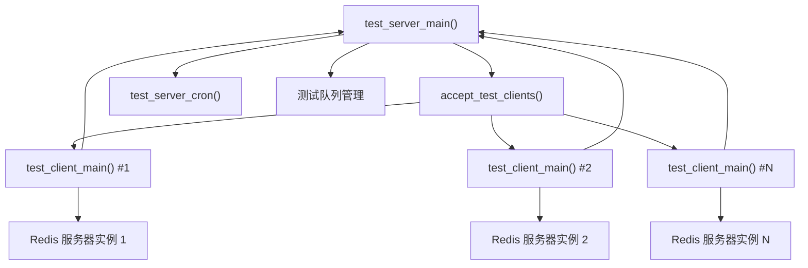
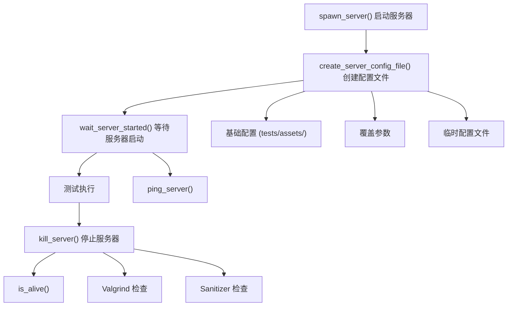
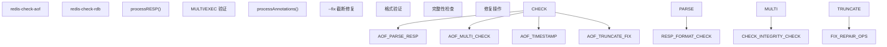

# 开发与测试

相关源文件

-   [.github/workflows/ci.yml](https://github.com/redis/redis/blob/8ad54215/.github/workflows/ci.yml)
-   [.github/workflows/daily.yml](https://github.com/redis/redis/blob/8ad54215/.github/workflows/daily.yml)
-   [.gitignore](https://github.com/redis/redis/blob/8ad54215/.gitignore)
-   [Makefile](https://github.com/redis/redis/blob/8ad54215/Makefile)
-   [deps/Makefile](https://github.com/redis/redis/blob/8ad54215/deps/Makefile)
-   [deps/fast\_float/Makefile](https://github.com/redis/redis/blob/8ad54215/deps/fast_float/Makefile)
-   [deps/fast\_float/README.md](https://github.com/redis/redis/blob/8ad54215/deps/fast_float/README.md)
-   [deps/fast\_float/fast\_float.h](https://github.com/redis/redis/blob/8ad54215/deps/fast_float/fast_float.h)
-   [deps/fast\_float/fast\_float\_strtod.cpp](https://github.com/redis/redis/blob/8ad54215/deps/fast_float/fast_float_strtod.cpp)
-   [deps/fast\_float/fast\_float\_strtod.h](https://github.com/redis/redis/blob/8ad54215/deps/fast_float/fast_float_strtod.h)
-   [src/redis-check-aof.c](https://github.com/redis/redis/blob/8ad54215/src/redis-check-aof.c)
-   [tests/integration/aof-multi-part.tcl](https://github.com/redis/redis/blob/8ad54215/tests/integration/aof-multi-part.tcl)
-   [tests/integration/aof-race.tcl](https://github.com/redis/redis/blob/8ad54215/tests/integration/aof-race.tcl)
-   [tests/integration/aof.tcl](https://github.com/redis/redis/blob/8ad54215/tests/integration/aof.tcl)
-   [tests/integration/replication.tcl](https://github.com/redis/redis/blob/8ad54215/tests/integration/replication.tcl)
-   [tests/support/aofmanifest.tcl](https://github.com/redis/redis/blob/8ad54215/tests/support/aofmanifest.tcl)
-   [tests/support/server.tcl](https://github.com/redis/redis/blob/8ad54215/tests/support/server.tcl)
-   [tests/support/test.tcl](https://github.com/redis/redis/blob/8ad54215/tests/support/test.tcl)
-   [tests/support/util.tcl](https://github.com/redis/redis/blob/8ad54215/tests/support/util.tcl)
-   [tests/test\_helper.tcl](https://github.com/redis/redis/blob/8ad54215/tests/test_helper.tcl)
-   [tests/unit/other.tcl](https://github.com/redis/redis/blob/8ad54215/tests/unit/other.tcl)

本页面记录了 Redis 的开发基础设施、测试框架和构建系统。内容涵盖了测试执行架构、构建过程、持续集成工作流以及用于维护代码质量和可靠性的开发工具。

有关单个子系统的特定测试信息，请参阅各自的子系统页面。有关构建配置的详细信息，请参阅[构建系统与依赖](/redis/redis/10.1-build-system-and-dependencies)。

## 测试框架架构

Redis 使用了一个用 Tcl 编写的先进分布式测试框架，该框架支持在多个 Redis 实例之间进行并行测试执行。该框架遵循服务器-客户端架构，由一个测试服务器（Test Server）协调多个测试客户端（Test Clients）。

### 分布式测试执行模型

测试服务器管理一个测试客户端池，并在它们之间分发测试单元。每个客户端启动自己的 Redis 服务器实例，并将结果报告回服务器。

**来源：** [tests/test\_helper.tcl266-305](https://github.com/redis/redis/blob/8ad54215/tests/test_helper.tcl#L266-L305) [tests/test\_helper.tcl514-531](https://github.com/redis/redis/blob/8ad54215/tests/test_helper.tcl#L514-L531)

### 测试客户端-服务器通信

> **[Mermaid 序列图 (sequence)]**
> *(注：此处的图表结构已根据原文保留占位)*

测试客户端使用自定义协议与服务器通信，该协议发送的状态包包括测试结果、服务器启动事件和完成通知。

**来源：** [tests/test\_helper.tcl344-411](https://github.com/redis/redis/blob/8ad54215/tests/test_helper.tcl#L344-L411) [tests/test\_helper.tcl533-538](https://github.com/redis/redis/blob/8ad54215/tests/test_helper.tcl#L533-L538)

### 服务器实例管理

测试框架包含复杂的 Redis 服务器生命周期管理：

**来源：** [tests/support/server.tcl288-320](https://github.com/redis/redis/blob/8ad54215/tests/support/server.tcl#L288-L320) [tests/support/server.tcl436-500](https://github.com/redis/redis/blob/8ad54215/tests/support/server.tcl#L436-L500) [tests/support/server.tcl45-131](https://github.com/redis/redis/blob/8ad54215/tests/support/server.tcl#L45-L131)

## 测试断言框架

Redis 提供了一个全面的断言框架，包含各种断言类型和实用程序：

| 断言类型 | 函数 | 用途 |
| --- | --- | --- |
| 基础断言 | `assert`, `assert_equal`, `assert_not_equal` | 值比较 |
| 数值比较 | `assert_lessthan`, `assert_morethan`, `assert_range` | 数值验证 |
| 模式匹配 | `assert_match`, `assert_no_match` | 字符串模式验证 |
| 错误处理 | `assert_error` | 异常测试 |
| Redis 特定 | `assert_encoding`, `assert_type`, `assert_refcount` | Redis 对象验证 |
| 条件等待 | `wait_for_condition` | 异步条件轮询 |

**来源：** [tests/support/test.tcl13-143](https://github.com/redis/redis/blob/8ad54215/tests/support/test.tcl#L13-L143)

## 构建系统架构

Redis 使用了一个基于 Make 的分层构建系统，管理主代码库及其依赖项。

### 构建层级

```mermaid
flowchart TD
    MAIN_MAKE["Makefile (根目录)"]
    SRC_MAKE["src/Makefile"]
    REDIS_SERVER["redis-server"]
    REDIS_CLI["redis-cli"]
    REDIS_TOOLS["redis-check-*"]
    DEPS_MAKE["deps/Makefile"]
    JEMALLOC["jemalloc"]
    LUA["lua"]
    HIREDIS["hiredis"]
    HDR_HIST["hdr_histogram"]
    FAST_FLOAT["fast_float"]
    LINENOISE["linenoise"]
    FPCONV["fpconv"]
    MOD_MAKE["modules/Makefile"]
    TLS_MODULE["redis-tls.so"]

    MAIN --> MAKE_SRC_MAKE
    MAIN --> MAKE_DEPS_MAKE
    MAIN --> MAKE_MOD_MAKE
    SRC --> MAKE_REDIS_SERVER
    SRC --> MAKE_REDIS_CLI
    SRC --> MAKE_REDIS_TOOLS
    DEPS --> MAKE_JEMALLOC
    DEPS --> MAKE_LUA
    DEPS --> MAKE_HIREDIS
    DEPS --> MAKE_HDR_HIST
    DEPS --> MAKE_FAST_FLOAT
    DEPS --> MAKE_LINENOISE
    DEPS --> MAKE_FPCONV
```

顶层 Makefile 协调各个子目录的构建，而每个组件管理其特定的构建要求。

**来源：** [Makefile1-17](https://github.com/redis/redis/blob/8ad54215/Makefile#L1-L17) [deps/Makefile32-145](https://github.com/redis/redis/blob/8ad54215/deps/Makefile#L32-L145)

### 依赖项管理

依赖项的构建仔细处理了编译器标志和跨平台考量：

-   **条件构建**：TLS 支持、Sanitizer、平台特定优化。
-   **标志传播**：`DEPS_CFLAGS` 和 `DEPS_LDFLAGS` 会传递给依赖项。
-   **清理追踪**：缓存构建标志以在发生更改时触发重新构建。

**来源：** [deps/Makefile15-53](https://github.com/redis/redis/blob/8ad54215/deps/Makefile#L15-L53) [deps/Makefile67-144](https://github.com/redis/redis/blob/8ad54215/deps/Makefile#L67-L144)

## 持续集成流水线

Redis 通过 GitHub Actions 维护全面的 CI/CD 流水线，包括快速反馈和广泛的每日测试。

### CI 工作流结构

```mermaid
flowchart TD
    UBUNTU_TESTS["多种 Ubuntu 变体"]
    PLATFORM_TESTS["多平台测试"]
    FORTIFY["Fortify 测试"]
    TLS_TESTS["TLS 测试"]
    IO_THREADS["IO 线程测试"]
    VALGRIND_TESTS["Valgrind 测试"]
    PR["拉取请求 (Pull Request)"]
    PUSH["推送到分支 (Push)"]
    UBUNTU_BASIC["test-ubuntu-latest"]
    SANITIZER["test-sanitizer-address"]
    DEBIAN_OLD["build-debian-old"]
    MACOS["build-macos-latest"]
    BUILD_32["build-32bit"]
    LIBC_MALLOC["build-libc-malloc"]
    CENTOS["build-centos-jemalloc"]
    OLD_CHAIN["build-old-chain-jemalloc"]

    PR --> UBUNTU_BASIC
    PR --> SANITIZER
    PR --> DEBIAN_OLD
    PR --> MACOS
    PUSH --> UBUNTU_BASIC
    UBUNTU --> BASIC_BUILD_32
    BUILD --> 32_LIBC_MALLOC
    LIBC --> MALLOC_CENTOS
    PLATFORM --> TESTS_UBUNTU_TESTS
    UBUNTU --> TESTS_FORTIFY
    FORTIFY --> TLS_TESTS
    TLS --> TESTS_IO_THREADS
```

**来源：** [.github/workflows/ci.yml1-103](https://github.com/redis/redis/blob/8ad54215/.github/workflows/ci.yml#L1-L103) [.github/workflows/daily.yml1-50](https://github.com/redis/redis/blob/8ad54215/.github/workflows/daily.yml#L1-L50)

### 测试矩阵配置

每日工作流运行包含不同配置的广泛测试矩阵：

| 配置 | 用途 | 关键参数 |
| --- | --- | --- |
| Ubuntu 标准 | 基础功能 | jemalloc, 标准标志 |
| Fortify | 安全加固 | `-D_FORTIFY_SOURCE=3` |
| LibC Malloc | 备选分配器 | `MALLOC=libc` |
| 32-位构建 | 架构兼容性 | `32bit` 目标 |
| 启用 TLS | 安全连接 | `BUILD_TLS=yes` |
| IO 线程 | 多线程 | `--config io-threads 4` |
| Valgrind | 内存调试 | Valgrind 包装器 |
| 地址 Sanitizer | 内存安全 | `SANITIZER=address` |

**来源：** [.github/workflows/daily.yml34-329](https://github.com/redis/redis/blob/8ad54215/.github/workflows/daily.yml#L34-L329)

## 测试分类与组织

Redis 根据功能和执行要求将测试分为几个类别：

### 测试目录结构

```mermaid
flowchart TD
    TESTS_ROOT["tests/"]
    UNIT["unit/"]
    INTEGRATION["integration/"]
    SUPPORT["support/"]
    ASSETS["assets/"]
    MODULES["modules/"]
    BASIC["basic.tcl"]
    TYPES["type/*.tcl"]
    OTHER["other.tcl"]
    MODULEAPI["moduleapi/*.tcl"]
    CLUSTER_UNIT["cluster/*.tcl"]
    REPLICATION["replication.tcl"]
    AOF["aof*.tcl"]
    RDB["rdb*.tcl"]
    PSYNC["psync*.tcl"]
    TEST_HELPER["test_helper.tcl"]
    SERVER_SUPPORT["server.tcl"]
    TEST_FRAMEWORK["test.tcl"]
    UTILITIES["util.tcl"]

    TESTS --> ROOT_UNIT
    TESTS --> ROOT_INTEGRATION
    TESTS --> ROOT_SUPPORT
    UNIT --> BASIC
    UNIT --> TYPES
    UNIT --> OTHER
    UNIT --> MODULEAPI
    UNIT --> CLUSTER_UNIT
    INTEGRATION --> REPLICATION
    INTEGRATION --> AOF
    INTEGRATION --> RDB
    INTEGRATION --> PSYNC
    SUPPORT --> TEST_HELPER
    SUPPORT --> SERVER_SUPPORT
    SUPPORT --> TEST_FRAMEWORK
    SUPPORT --> UTILITIES
```

**来源：** [tests/test\_helper.tcl24-30](https://github.com/redis/redis/blob/8ad54215/tests/test_helper.tcl#L24-L30) [tests/test\_helper.tcl32-38](https://github.com/redis/redis/blob/8ad54215/tests/test_helper.tcl#L32-L38)

### 测试执行流程

测试通过标准化的运行脚本执行：

-   **`runtest`**：用于单元测试和集成测试的主要测试运行程序。
-   **`runtest-cluster`**：集群特定的测试执行。
-   **`runtest-sentinel`**：哨兵高可用测试。

这些脚本支持用于过滤、调试和配置的各种选项。

**来源：** [tests/test\_helper.tcl540-582](https://github.com/redis/redis/blob/8ad54215/tests/test_helper.tcl#L540-L582)

## 开发工具与实用程序

Redis 在代码库中内置了几个开发和调试实用程序：

### Redis 检查实用程序

`redis-check-aof` 实用程序提供了全面的 AOF 文件验证和修复功能，包括事务边界检查和格式验证。

**来源：** [src/redis-check-aof.c138-165](https://github.com/redis/redis/blob/8ad54215/src/redis-check-aof.c#L138-L165) [src/redis-check-aof.c176-205](https://github.com/redis/redis/blob/8ad54215/src/redis-check-aof.c#L176-L205)

### 测试执行选项

测试框架支持广泛的配置选项：

| 选项类别 | 示例 | 用途 |
| --- | --- | --- |
| 测试选择 | `--single`, `--only`, `--skip-till` | 控制测试执行范围 |
| 调试 | `--verbose`, `--dump-logs`, `--stop` | 调试测试失败 |
| 清理/安全 | `--valgrind`, `--tsan` | 内存和线程安全 |
| 网络 | `--tls`, `--host`, `--port` | 连接配置 |
| 性能 | `--accurate`, `--clients N` | 测试彻底性和并行化 |

**来源：** [tests/test\_helper.tcl540-582](https://github.com/redis/redis/blob/8ad54215/tests/test_helper.tcl#L540-L582) [tests/test\_helper.tcl584-718](https://github.com/redis/redis/blob/8ad54215/tests/test_helper.tcl#L584-L718)

Redis 的开发和测试基础设施通过全面的测试、灵活的构建配置和广泛的 CI/CD 覆盖，为维护代码质量提供了坚实的基础。分布式测试架构实现了高效的并行测试，同时保持了测试用例之间的隔离。
