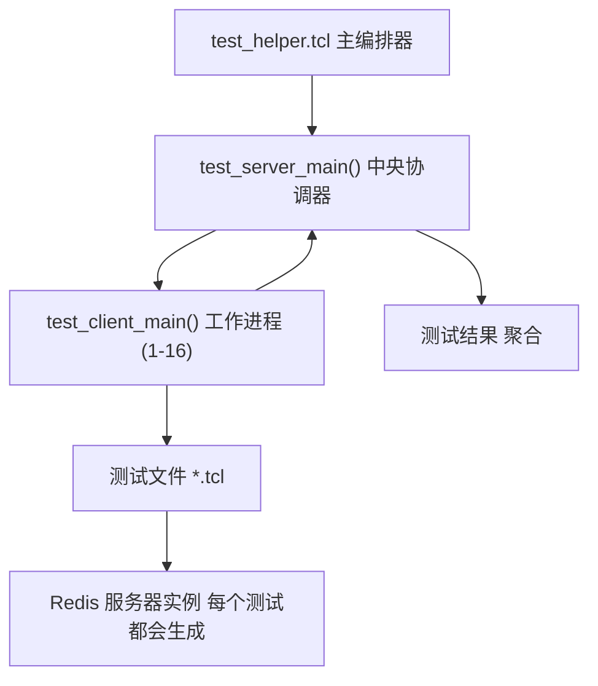
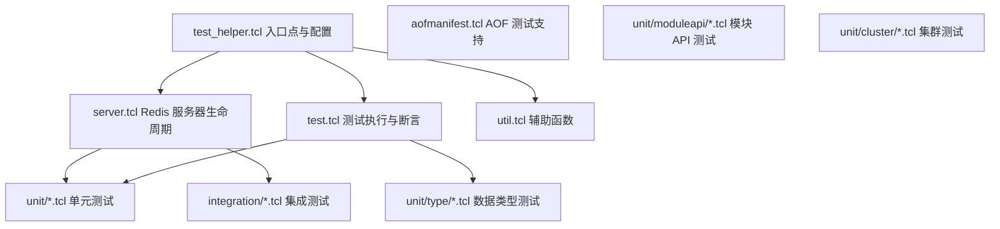
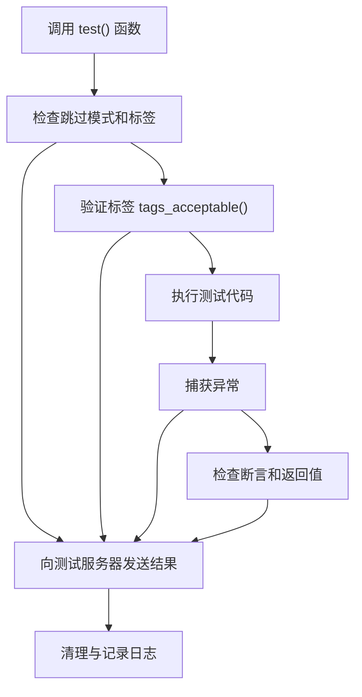
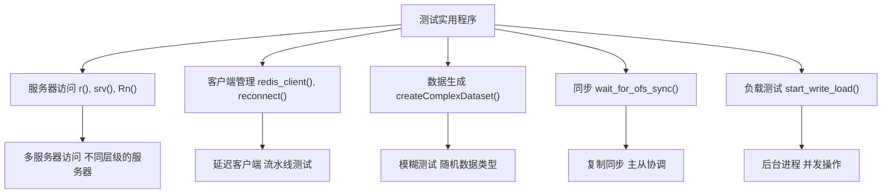
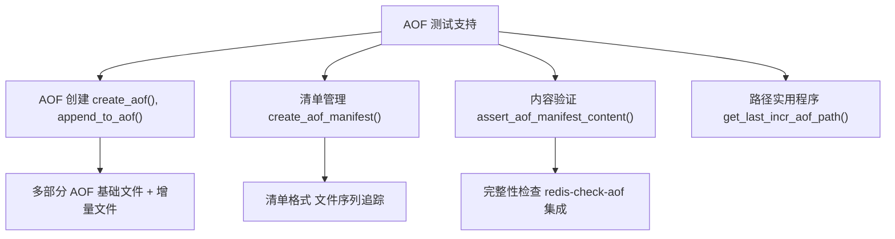
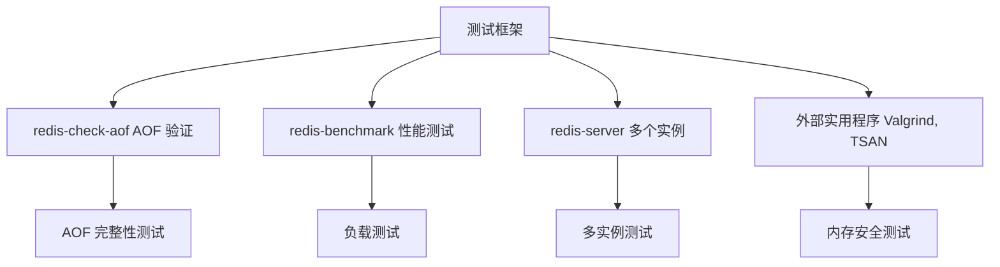

# 测试框架

相关源文件

-   [src/redis-check-aof.c](https://github.com/redis/redis/blob/8ad54215/src/redis-check-aof.c)
-   [tests/integration/aof-multi-part.tcl](https://github.com/redis/redis/blob/8ad54215/tests/integration/aof-multi-part.tcl)
-   [tests/integration/aof-race.tcl](https://github.com/redis/redis/blob/8ad54215/tests/integration/aof-race.tcl)
-   [tests/integration/aof.tcl](https://github.com/redis/redis/blob/8ad54215/tests/integration/aof.tcl)
-   [tests/integration/replication.tcl](https://github.com/redis/redis/blob/8ad54215/tests/integration/replication.tcl)
-   [tests/support/aofmanifest.tcl](https://github.com/redis/redis/blob/8ad54215/tests/support/aofmanifest.tcl)
-   [tests/support/server.tcl](https://github.com/redis/redis/blob/8ad54215/tests/support/server.tcl)
-   [tests/support/test.tcl](https://github.com/redis/redis/blob/8ad54215/tests/support/test.tcl)
-   [tests/support/util.tcl](https://github.com/redis/redis/blob/8ad54215/tests/support/util.tcl)
-   [tests/test\_helper.tcl](https://github.com/redis/redis/blob/8ad54215/tests/test_helper.tcl)
-   [tests/unit/other.tcl](https://github.com/redis/redis/blob/8ad54215/tests/unit/other.tcl)

Redis 测试框架提供了一套全面的测试套件基础设施，用于验证 Redis 在单元测试、集成测试以及各种部署场景下的功能。该框架使用分布式服务端-客户端架构来并行运行测试，具备精密的服务器生命周期管理和广泛的断言实用程序。

有关编译测试基础设施的构建系统的信息，请参阅[构建系统与依赖](/redis/redis/10.1-build-system-and-dependencies)。

## 架构概览

测试框架实现了一个服务端-客户端模型，由一个中央测试服务端协调多个同时执行单个测试文件的测试客户端进程。

### 测试编排架构



**来源：** [tests/test\_helper.tcl266-305](https://github.com/redis/redis/blob/8ad54215/tests/test_helper.tcl#L266-L305) [tests/test\_helper.tcl514-531](https://github.com/redis/redis/blob/8ad54215/tests/test_helper.tcl#L514-L531)

### 核心框架组件



**来源：** [tests/test\_helper.tcl13-19](https://github.com/redis/redis/blob/8ad54215/tests/test_helper.tcl#L13-L19) [tests/test\_helper.tcl24-30](https://github.com/redis/redis/blob/8ad54215/tests/test_helper.tcl#L24-L30)

## 测试服务端-客户端通信

该框架在测试服务端和客户端之间使用基于 TCP 的通信协议，用于协调和结果报告。

### 通信协议

> **[Mermaid 序列图 (sequence)]**
> *(注：此处的图表结构已根据原文保留占位)*

**来源：** [tests/test\_helper.tcl344-411](https://github.com/redis/redis/blob/8ad54215/tests/test_helper.tcl#L344-L411) [tests/test\_helper.tcl522-530](https://github.com/redis/redis/blob/8ad54215/tests/test_helper.tcl#L522-L530)

通信使用带有状态码的结构化数据包：

-   `ready`：客户端准备好工作。
-   `testing`：测试开始。
-   `ok`：测试通过。
-   `err`：测试失败。
-   `done`：测试文件执行完毕。
-   `run`：服务端向客户端分配测试任务。

## 服务器管理

测试框架通过 `server.tcl` 提供了精密的 Redis 服务器生命周期管理。

### 服务器生命周期

> **[Mermaid 状态图 (stateDiagram)]**
> *(注：此处的图表结构已根据原文保留占位)*

**来源：** [tests/support/server.tcl288-320](https://github.com/redis/redis/blob/8ad54215/tests/support/server.tcl#L288-L320) [tests/support/server.tcl322-349](https://github.com/redis/redis/blob/8ad54215/tests/support/server.tcl#L322-L349) [tests/support/server.tcl45-131](https://github.com/redis/redis/blob/8ad54215/tests/support/server.tcl#L45-L131)

关键服务器管理函数：

| 函数 | 用途 | 关键特性 |
| --- | --- | --- |
| `start_server()` | 主服务器启动 | 配置解析、端口分配、TLS 支持 |
| `spawn_server()` | 进程创建 | Valgrind 支持、环境设置 |
| `kill_server()` | 清理 | 内存泄漏检查、优雅停机 |
| `server_is_up()` | 健康检查 | 基于 PING 的连通性验证 |

## 测试框架核心

`test.tcl` 中的测试执行引擎提供了基础的测试运行和断言能力。

### 测试执行流程



**来源：** [tests/support/test.tcl164-276](https://github.com/redis/redis/blob/8ad54215/tests/support/test.tcl#L164-L276)

### 断言系统

该框架提供了全面的断言函数：

| 断言 | 用途 | 使用示例 |
| --- | --- | --- |
| `assert` | 基础条件检查 | `assert {$val > 0}` |
| `assert_equal` | 值相等检查 | `assert_equal $expected $actual` |
| `assert_match` | 模式匹配 | `assert_match "*error*" $msg` |
| `assert_error` | 异常验证 | `assert_error "*WRONGTYPE*" {r lpush string val}` |
| `assert_encoding` | 对象编码检查 | `assert_encoding ziplist mylist` |
| `wait_for_condition` | 轮询直到条件满足 | `wait_for_condition 50 100 {$ready}` |

**来源：** [tests/support/test.tcl13-142](https://github.com/redis/redis/blob/8ad54215/tests/support/test.tcl#L13-L142)

## 配置与执行选项

测试框架支持通过命令行选项和全局变量进行广泛配置。

### 关键配置变量

```mermaid
flowchart TD
    Config["配置选项"]
    Execution["执行控制"]
    Filtering["测试过滤"]
    Environment["环境"]
    Debug["调试/分析"]
    NumClients["::numclients 并行工作进程 (16)"]
    Loop["::loop 重复测试"]
    Timeout["::timeout 最大执行时间"]
    SingleTests["::single_tests 运行特定单元"]
    OnlyTests["::only_tests 模式匹配"]
    SkipTests["::skiptests 跳过模式"]
    Tags["::allowtags/::denytags 基于标签的过滤"]
    External["::external 外部服务器模式"]
    TLS["::tls TLS 测试"]
    Cluster["::cluster_mode 集群协议"]
    Valgrind["::valgrind 内存检查"]
    Verbose["::verbose 输出级别"]
    DumpLogs["::dump_logs 失败时输出服务器日志"]

    Config --> Execution
    Config --> Filtering
    Config --> Environment
    Config --> Debug
    Execution --> NumClients
    Execution --> Loop
    Execution --> Timeout
    Filtering --> SingleTests
    Filtering --> OnlyTests
    Filtering --> SkipTests
    Filtering --> Tags
    Environment --> External
    Environment --> TLS
    Environment --> Cluster
    Debug --> Valgrind
    Debug --> Verbose
    Debug --> DumpLogs
```



**来源：** [tests/test\_helper.tcl42-86](https://github.com/redis/redis/blob/8ad54215/tests/test_helper.tcl#L42-L86) [tests/test\_helper.tcl584-718](https://github.com/redis/redis/blob/8ad54215/tests/test_helper.tcl#L584-L718)

## 测试组织与分类

测试按分层的目录结构进行组织，并具有特定用途：

### 测试目录结构

| 目录 | 用途 | 示例测试 |
| --- | --- | --- |
| `unit/` | 核心功能测试 | 基础命令、数据结构 |
| `unit/type/` | 特定数据类型测试 | 字符串、列表、集合、流 |
| `unit/moduleapi/` | 模块 API 验证 | 模块加载、API 函数 |
| `unit/cluster/` | 集群功能 | 槽位管理、节点通信 |
| `integration/` | 系统集成测试 | 复制、AOF、持久化 |

**来源：** [tests/test\_helper.tcl24-30](https://github.com/redis/redis/blob/8ad54215/tests/test_helper.tcl#L24-L30)

### 测试标签系统

测试使用标签系统进行分类和过滤：

```tcl
test {测试名称} {
    # 测试代码
} {} {tags {slow external:skip}}
```

常用的标签包括：

-   `slow`：运行时间较长的测试。
-   `external:skip`：测试外部服务器时跳过。
-   `needs:debug`：需要调试 (debug) 构建版本。
-   `cluster:skip`：在集群模式下跳过。
-   `tls:skip`：在 TLS 模式下跳过。

**来源：** [tests/support/server.tcl186-256](https://github.com/redis/redis/blob/8ad54215/tests/support/server.tcl#L186-L256) [tests/support/test.tcl164-186](https://github.com/redis/redis/blob/8ad54215/tests/support/test.tcl#L164-L186)

## 专门测试实用程序

该框架包含用于复杂测试场景的专门实用程序。

### Redis 服务器交互实用程序



**来源：** [tests/test\_helper.tcl121-161](https://github.com/redis/redis/blob/8ad54215/tests/test_helper.tcl#L121-L161) [tests/support/util.tcl588-632](https://github.com/redis/redis/blob/8ad54215/tests/support/util.tcl#L588-L632) [tests/support/util.tcl312-416](https://github.com/redis/redis/blob/8ad54215/tests/support/util.tcl#L312-L416)

### AOF 与持久化测试

该框架包含对测试 AOF (仅追加文件) 功能的专门支持：



**来源：** [tests/support/aofmanifest.tcl129-174](https://github.com/redis/redis/blob/8ad54215/tests/support/aofmanifest.tcl#L129-L174) [tests/integration/aof-multi-part.tcl26-52](https://github.com/redis/redis/blob/8ad54215/tests/integration/aof-multi-part.tcl#L26-L52)

## 外部工具集成

测试框架集成了外部 Redis 工具以进行全面验证。

### 工具集成架构



**来源：** [tests/integration/aof.tcl107-130](https://github.com/redis/redis/blob/8ad54215/tests/integration/aof.tcl#L107-L130) [tests/integration/aof-race.tcl11](https://github.com/redis/redis/blob/8ad54215/tests/integration/aof-race.tcl#L11-L11) [tests/support/server.tcl295-309](https://github.com/redis/redis/blob/8ad54215/tests/support/server.tcl#L295-L309)

`redis-check-aof` 工具在 AOF 文件验证和修复方面得到了广泛测试：

```c
int checkSingleAof(char *aof_filename, char *aof_filepath, int last_file, int fix, int preamble)
```

该函数验证 AOF 文件的完整性，并支持旧式和多部分 AOF 格式。

**来源：** [src/redis-check-aof.c223-333](https://github.com/redis/redis/blob/8ad54215/src/redis-check-aof.c#L223-L333)
