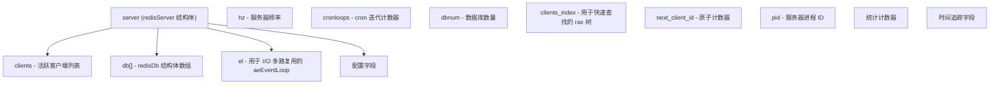
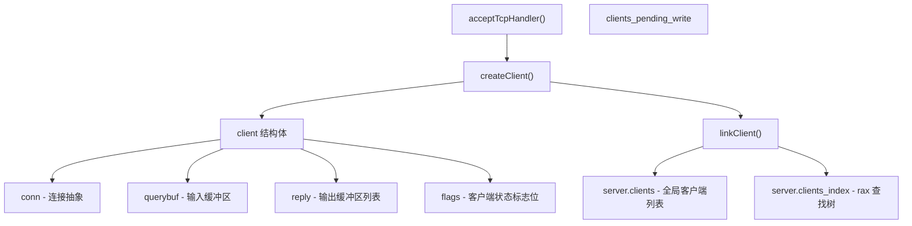
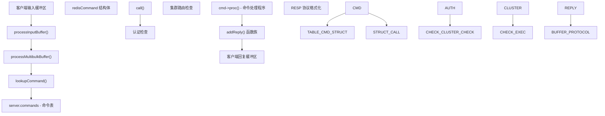
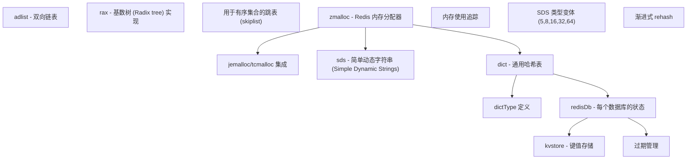
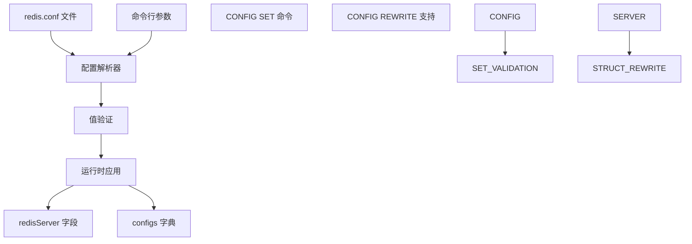

# Redis 核心

相关源文件

-   [redis.conf](https://github.com/redis/redis/blob/8ad54215/redis.conf)
-   [src/aof.c](https://github.com/redis/redis/blob/8ad54215/src/aof.c)
-   [src/config.c](https://github.com/redis/redis/blob/8ad54215/src/config.c)
-   [src/db.c](https://github.com/redis/redis/blob/8ad54215/src/db.c)
-   [src/debug.c](https://github.com/redis/redis/blob/8ad54215/src/debug.c)
-   [src/module.c](https://github.com/redis/redis/blob/8ad54215/src/module.c)
-   [src/networking.c](https://github.com/redis/redis/blob/8ad54215/src/networking.c)
-   [src/object.c](https://github.com/redis/redis/blob/8ad54215/src/object.c)
-   [src/rdb.c](https://github.com/redis/redis/blob/8ad54215/src/rdb.c)
-   [src/replication.c](https://github.com/redis/redis/blob/8ad54215/src/replication.c)
-   [src/server.c](https://github.com/redis/redis/blob/8ad54215/src/server.c)
-   [src/server.h](https://github.com/redis/redis/blob/8ad54215/src/server.h)
-   [tests/unit/introspection.tcl](https://github.com/redis/redis/blob/8ad54215/tests/unit/introspection.tcl)

## 目的与范围

本文件涵盖了 Redis 的核心服务器架构，重点关注使 Redis 能够作为高性能内存数据库服务器运行的基础组件。这包括全局服务器状态管理、客户端连接处理、网络层、命令处理流水线以及扩展的集成点。

有关特定数据类型和存储机制的信息，请参阅[数据存储与管理](/redis/redis/3-data-storage-and-management)。有关高可用性特性，请参阅[高可用与分布式](/redis/redis/6-high-availability-and-distribution)。有关持久化机制，请参阅[持久化与复制](/redis/redis/7-persistence-and-replication)。

## 全局服务器状态

Redis 的核心是 [src/server.h1259-1884](https://github.com/redis/redis/blob/8ad54215/src/server.h#L1259-L1884) 中定义的全局 `redisServer` 结构，它在名为 `server` 的单个全局实例中维护所有服务器状态。该结构包含 600 多个字段，控制着 Redis 运行的各个方面，从基础配置到高级特性。

**来源：** [src/server.h1259-1884](https://github.com/redis/redis/blob/8ad54215/src/server.h#L1259-L1884) [src/server.c80](https://github.com/redis/redis/blob/8ad54215/src/server.c#L80-L80)

## 服务器初始化与生命周期

服务器初始化遵循由 `server.c` 中的函数管理的明确序列。主入口点建立全局状态并初始化所有子系统。

### 服务器启动流程

[src/server.c3456-3719](https://github.com/redis/redis/blob/8ad54215/src/server.c#L3456-L3719) 中的 `initServer()` 函数执行关键的初始化工作，包括：

-   为优雅停机设置信号处理程序
-   为常用值创建共享对象
-   通过 `aeCreateEventLoop()` 初始化事件循环
-   网络套接字创建和绑定
-   数据库初始化
-   周期性任务调度

**来源：** [src/server.c3456-3719](https://github.com/redis/redis/blob/8ad54215/src/server.c#L3456-L3719) [src/server.c1451-1700](https://github.com/redis/redis/blob/8ad54215/src/server.c#L1451-L1700)

## 客户端连接架构

Redis 通过一个复杂的系统管理客户端连接，该系统同时处理网络层和客户端状态管理。

### 客户端结构体与生命周期

每个客户端连接由 [src/server.h1023-1258](https://github.com/redis/redis/blob/8ad54215/src/server.h#L1023-L1258) 中定义的 `client` 结构表示。客户端生命周期包括创建、认证、命令处理和清理。

[src/networking.c121-235](https://github.com/redis/redis/blob/8ad54215/src/networking.c#L121-L235) 中的 `createClient()` 函数初始化：

-   连接抽象层 (`connection`)
-   用于协议处理的输入/输出缓冲区
-   认证状态和用户上下文
-   命令解析状态
-   内存使用追踪

**来源：** [src/networking.c121-235](https://github.com/redis/redis/blob/8ad54215/src/networking.c#L121-L235) [src/networking.c92-100](https://github.com/redis/redis/blob/8ad54215/src/networking.c#L92-L100)

### 网络与事件处理

Redis 使用构建在 `ae` (异步事件) 库之上的事件驱动架构。网络层处理 TCP 和 Unix 套接字连接，并支持可配置的 I/O 线程。

```mermaid
flowchart TD
    AE["ae.c 事件循环"]
    FILE_EVENTS["文件事件 (I/O)"]
    TIME_EVENTS["时间事件 (周期性)"]
    CONN_TCP["TCP 连接"]
    CONN_UNIX["Unix 套接字连接"]
    CONN_TLS["TLS 连接 (可选)"]
    READ_HANDLER["readQueryFromClient()"]
    WRITE_HANDLER["sendReplyToClient()"]
    ACCEPT_HANDLER["acceptTcpHandler()"]
    PROTO["RESP 协议解析器"]
    CMD_QUEUE["命令队列"]
    REPLY_QUEUE["回复队列"]

    AE --> FILE_EVENTS
    AE --> TIME_EVENTS
    FILE --> EVENTS_ACCEPT_HANDLER
    FILE --> EVENTS_READ_HANDLER
    FILE --> EVENTS_WRITE_HANDLER
    ACCEPT --> HANDLER_CONN_TCP
    ACCEPT --> HANDLER_CONN_UNIX
    READ --> HANDLER_PROTO
    PROTO --> CMD_QUEUE
    WRITE --> HANDLER_REPLY_QUEUE
```

网络层实现了几个关键函数：

-   `src/networking.c` 中的 `acceptTcpHandler()` 用于处理新连接
-   [src/networking.c2178-2276](https://github.com/redis/redis/blob/8ad54215/src/networking.c#L2178-L2276) 中的 `readQueryFromClient()` 用于读取数据
-   [src/networking.c1378-1502](https://github.com/redis/redis/blob/8ad54215/src/networking.c#L1378-L1502) 中的 `sendReplyToClient()` 用于写入响应

**来源：** [src/networking.c2178-2276](https://github.com/redis/redis/blob/8ad54215/src/networking.c#L2178-L2276) [src/networking.c1378-1502](https://github.com/redis/redis/blob/8ad54215/src/networking.c#L1378-L1502) [src/server.c1451-1700](https://github.com/redis/redis/blob/8ad54215/src/server.c#L1451-L1700)

## 命令处理流水线

Redis 实现了一个多阶段命令处理流水线，负责协议解析、命令查找、执行和响应生成。

### 命令处理流程

命令处理涉及几个关键组件：

-   **协议解析**：在 `processInputBuffer()` 中进行 RESP (Redis 序列化协议) 解析。
-   **命令查找**：使用 `lookupCommand()` 在 `server.commands` 哈希表中查找。
-   **执行上下文**：`call()` 函数管理执行环境。
-   **响应格式化**：各种 `addReply*()` 函数负责格式化响应。

**来源：** [src/networking.c2178-2276](https://github.com/redis/redis/blob/8ad54215/src/networking.c#L2178-L2276) [src/server.c3938-4162](https://github.com/redis/redis/blob/8ad54215/src/server.c#L3938-L4162)

## 核心数据结构与内存管理

Redis 核心依赖于几种支持高级 Redis 数据类型的基本数据结构。

### 核心基础设施数据结构

关键数据结构包括：

-   **SDS (简单动态字符串)**：具有多种大小类别的 Redis 字符串实现。
-   **dict**：具有渐进式 rehash 能力的通用哈希表。
-   **kvstore**：数据库级键值存储抽象。
-   **rax**：用于前缀操作和索引的基数树。

**来源：** [src/server.h48-66](https://github.com/redis/redis/blob/8ad54215/src/server.h#L48-L66) [src/sds.h](https://github.com/redis/redis/blob/8ad54215/src/sds.h) [src/dict.h](https://github.com/redis/redis/blob/8ad54215/src/dict.h) [src/kvstore.h](https://github.com/redis/redis/blob/8ad54215/src/kvstore.h)

## 配置系统

Redis 配置通过一个灵活的系统进行管理，该系统支持静态配置文件和通过 `CONFIG` 命令进行的运行时更新。

### 配置架构

[src/config.c](https://github.com/redis/redis/blob/8ad54215/src/config.c) 中的配置系统提供：

-   **静态配置**：启动期间解析 redis.conf 文件。
-   **运行时配置**：用于实时更新的 `CONFIG SET`/`CONFIG GET` 命令。
-   **验证框架**：针对配置值的特定类型验证。
-   **配置持久化**：使用 `CONFIG REWRITE` 更新配置文件。

**来源：** [src/config.c432-503](https://github.com/redis/redis/blob/8ad54215/src/config.c#L432-L503) [redis.conf1-2000](https://github.com/redis/redis/blob/8ad54215/redis.conf#L1-L2000)

## 模块系统集成

Redis 核心提供了一个全面的模块 API，允许在保持性能和稳定性的同时扩展 Redis 功能。

### 模块集成点

```mermaid
flowchart TD
    MODULE_API["RedisModule API"]
    MODULE_CTX["RedisModuleCtx"]
    MODULE_DICT["modules 字典"]
    CMD_REGISTRATION["命令注册"]
    TYPE_REGISTRATION["数据类型注册"]
    EVENT_HOOKS["事件通知"]
    THREAD_SAFETY["线程安全上下文"]
    MEMORY_MGMT["模块内存管理"]
    AUTO_MEMORY["自动清理"]
    CALL_REPLIES["RM_Call() 基础设施"]

    MODULE --> API_MODULE_CTX
    MODULE --> API_CMD_REGISTRATION
    MODULE --> API_TYPE_REGISTRATION
    MODULE --> CTX_MEMORY_MGMT
    MODULE --> CTX_AUTO_MEMORY
    CMD --> REGISTRATION_CALL_REPLIES
    EVENT --> HOOKS_THREAD_SAFETY
```

模块系统提供：

-   **API 层**：提供 500 多个用于模块开发的函数。
-   **内存管理**：自动清理和内存池分配。
-   **命令集成**：与 Redis 命令处理无缝集成。
-   **线程安全**：为多线程模块提供安全上下文。

**来源：** [src/module.c527-6000](https://github.com/redis/redis/blob/8ad54215/src/module.c#L527-L6000) [src/module.c131-157](https://github.com/redis/redis/blob/8ad54215/src/module.c#L131-L157)

## 事件循环与周期性任务

Redis 的核心操作使用单线程事件循环，周期性维护任务由 `serverCron()` 函数管理。

### 事件循环结构

```mermaid
flowchart TD
    MAIN["aeMain() - 事件循环"]
    BEFORE_SLEEP["beforeSleep()"]
    PROCESS_EVENTS["aeProcessEvents()"]
    AFTER_SLEEP["afterSleep()"]
    ACCEPT["连接接收"]
    READ["客户端数据读取"]
    WRITE["客户端数据写入"]
    SERVER_CRON["serverCron() - 周期性任务"]
    CLIENT_CRON["客户端维护"]
    DB_CRON["数据库维护"]

    MAIN --> BEFORE_SLEEP
    BEFORE --> SLEEP_PROCESS_EVENTS
    PROCESS --> EVENTS_AFTER_SLEEP
    AFTER --> SLEEP_MAIN
    PROCESS --> EVENTS_ACCEPT
    PROCESS --> EVENTS_READ
    PROCESS --> EVENTS_WRITE
    PROCESS --> EVENTS_SERVER_CRON
    SERVER --> CRON_CLIENT_CRON
    SERVER --> CRON_DB_CRON
```

[src/server.c1451-1700](https://github.com/redis/redis/blob/8ad54215/src/server.c#L1451-L1700) 中的 `serverCron()` 函数执行关键维护工作：

-   客户端超时和清理
-   数据库过期处理
-   内存使用监控
-   复制健康检查
-   统计信息更新

**来源：** [src/server.c1451-1700](https://github.com/redis/redis/blob/8ad54215/src/server.c#L1451-L1700) [src/server.c1245-1449](https://github.com/redis/redis/blob/8ad54215/src/server.c#L1245-L1449)

这种架构使 Redis 能够在保持一致性的同时实现高性能，并通过其模块化设计提供丰富的功能集。
