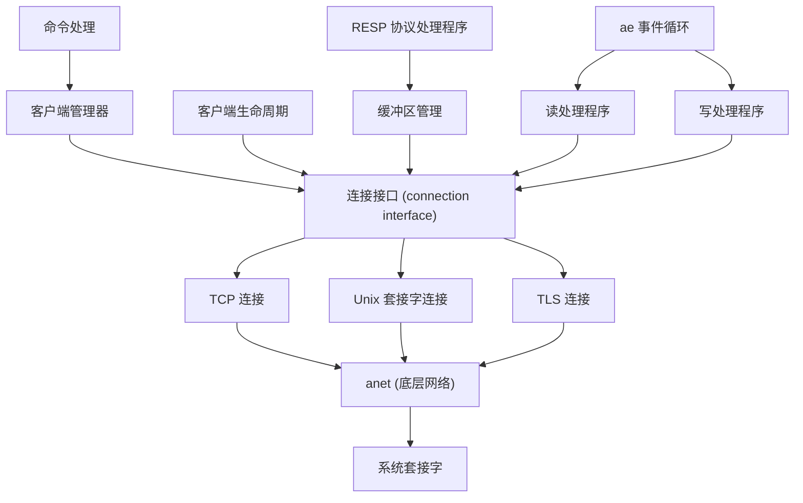
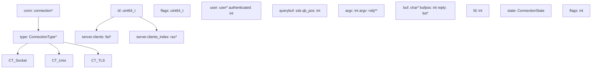
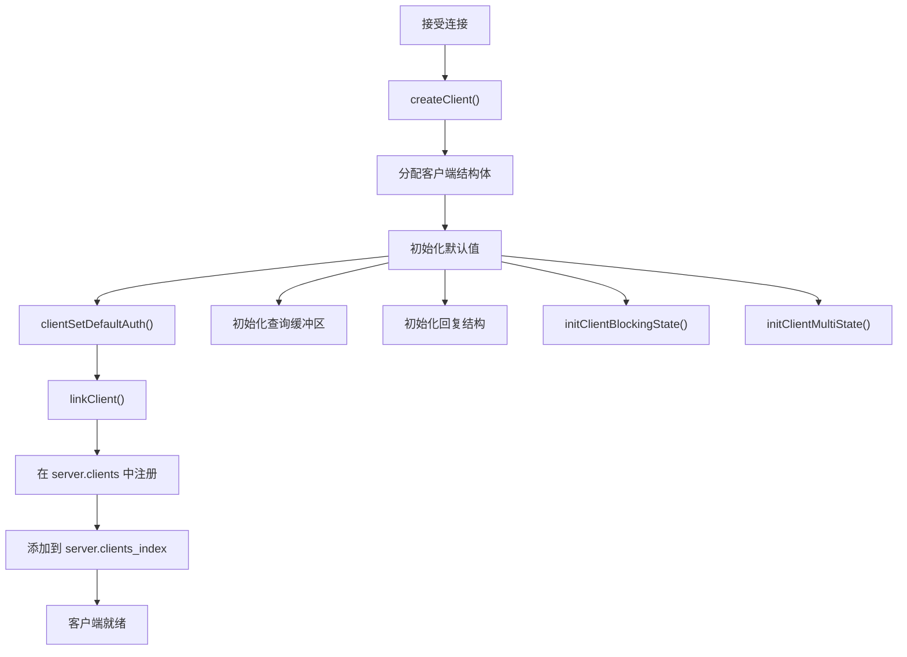
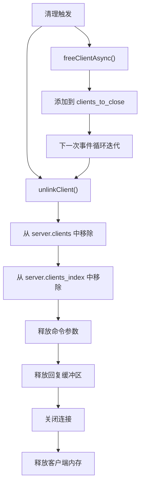
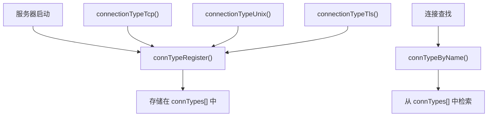
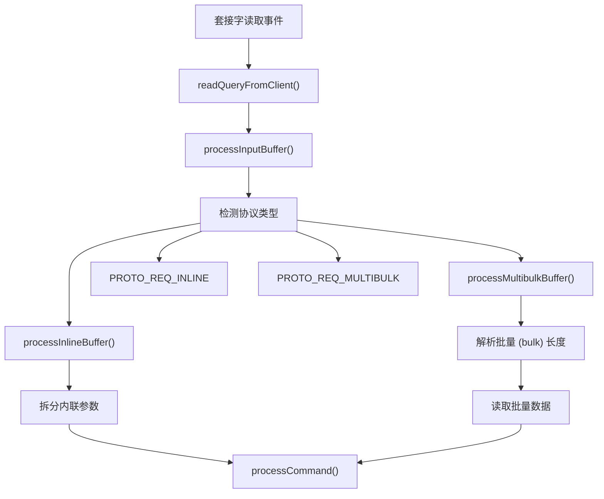
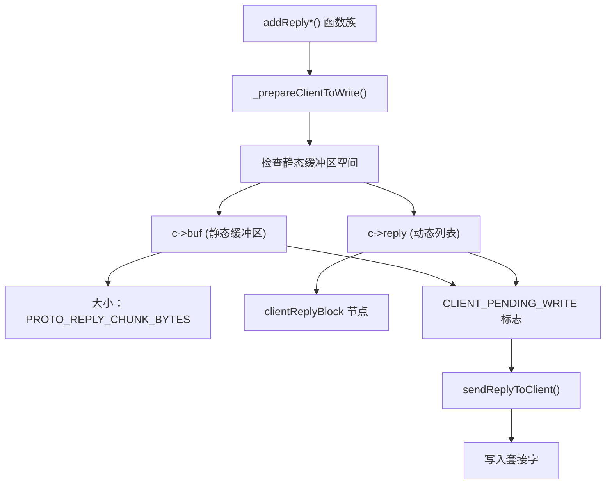
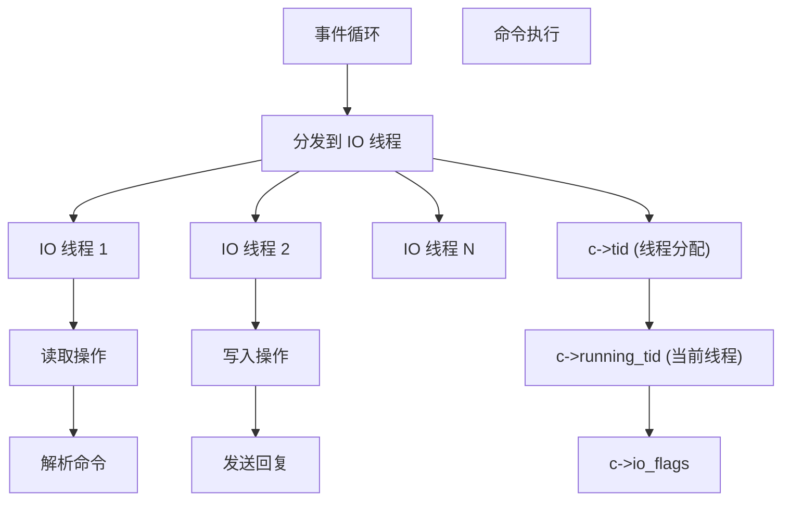
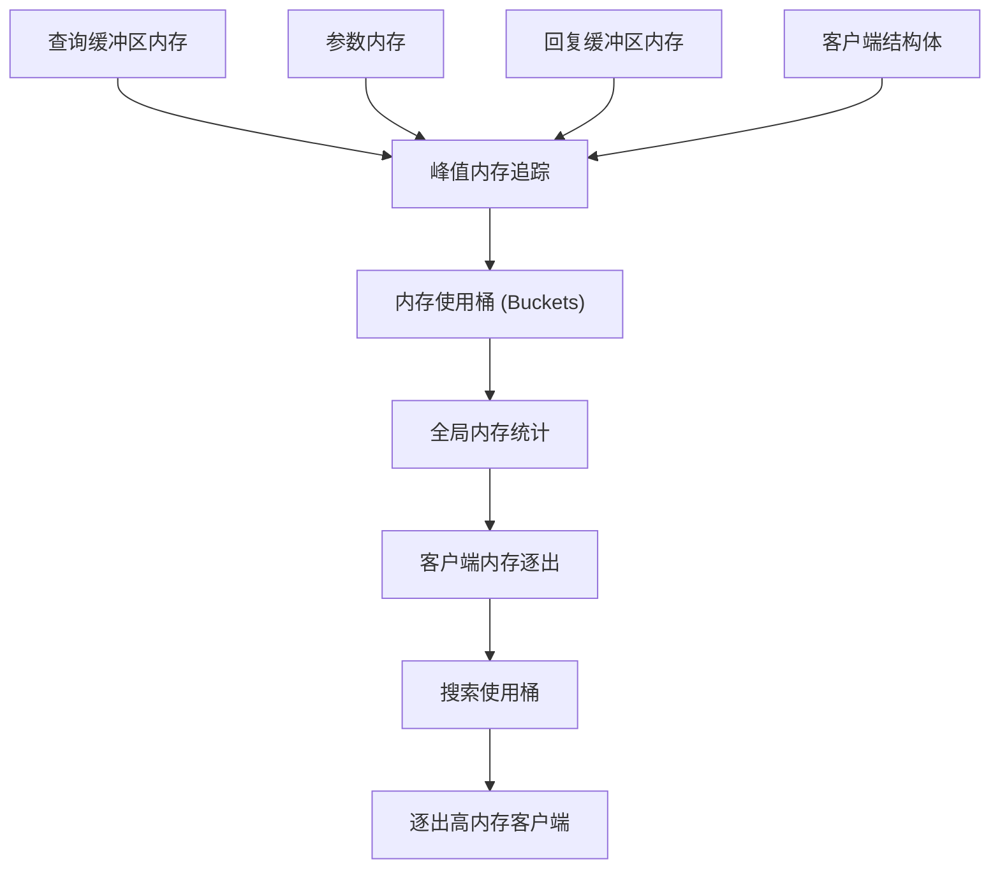

# 客户端连接管理

相关源文件

-   [redis.conf](https://github.com/redis/redis/blob/8ad54215/redis.conf)
-   [src/anet.c](https://github.com/redis/redis/blob/8ad54215/src/anet.c)
-   [src/anet.h](https://github.com/redis/redis/blob/8ad54215/src/anet.h)
-   [src/aof.c](https://github.com/redis/redis/blob/8ad54215/src/aof.c)
-   [src/config.c](https://github.com/redis/redis/blob/8ad54215/src/config.c)
-   [src/connection.c](https://github.com/redis/redis/blob/8ad54215/src/connection.c)
-   [src/connection.h](https://github.com/redis/redis/blob/8ad54215/src/connection.h)
-   [src/db.c](https://github.com/redis/redis/blob/8ad54215/src/db.c)
-   [src/debug.c](https://github.com/redis/redis/blob/8ad54215/src/debug.c)
-   [src/module.c](https://github.com/redis/redis/blob/8ad54215/src/module.c)
-   [src/networking.c](https://github.com/redis/redis/blob/8ad54215/src/networking.c)
-   [src/object.c](https://github.com/redis/redis/blob/8ad54215/src/object.c)
-   [src/rdb.c](https://github.com/redis/redis/blob/8ad54215/src/rdb.c)
-   [src/replication.c](https://github.com/redis/redis/blob/8ad54215/src/replication.c)
-   [src/server.c](https://github.com/redis/redis/blob/8ad54215/src/server.c)
-   [src/server.h](https://github.com/redis/redis/blob/8ad54215/src/server.h)
-   [src/socket.c](https://github.com/redis/redis/blob/8ad54215/src/socket.c)
-   [src/tls.c](https://github.com/redis/redis/blob/8ad54215/src/tls.c)
-   [src/unix.c](https://github.com/redis/redis/blob/8ad54215/src/unix.c)
-   [tests/unit/introspection.tcl](https://github.com/redis/redis/blob/8ad54215/tests/unit/introspection.tcl)

本文涵盖了 Redis 的客户端连接管理系统，该系统负责处理客户端到 Redis 服务器连接的建立、维护和终止。这包括连接抽象层、客户端生命周期管理、协议处理以及输出缓冲区管理。

有关连接建立后的命令处理信息，请参阅[命令处理流水线](/redis/redis/2.3-command-processing-pipeline)。有关驱动连接处理的服务器初始化和事件循环，请参阅[服务器架构与生命周期](/redis/redis/2.1-server-architecture-and-lifecycle)。

## 架构概览

Redis 为客户端连接管理实现了一个分层架构，将不同的传输类型（TCP、Unix 套接字、TLS）抽象在通用接口之后，同时提供对数千个并发连接的高效处理。

### 客户端连接架构

**来源：** [src/networking.c1-50](https://github.com/redis/redis/blob/8ad54215/src/networking.c#L1-L50) [src/connection.h1-100](https://github.com/redis/redis/blob/8ad54215/src/connection.h#L1-L100) [src/server.h1800-2000](https://github.com/redis/redis/blob/8ad54215/src/server.h#L1800-L2000)

### 核心数据结构

**来源：** [src/server.h1800-2100](https://github.com/redis/redis/blob/8ad54215/src/server.h#L1800-L2100) [src/connection.h47-120](https://github.com/redis/redis/blob/8ad54215/src/connection.h#L47-L120) [src/server.c90-100](https://github.com/redis/redis/blob/8ad54215/src/server.c#L90-L100)

## 客户端生命周期管理

### 客户端创建与初始化

当服务器接受一个新连接时，客户端生命周期就开始了。`createClient` 函数使用默认值初始化一个新的客户端结构。

**来源：** [src/networking.c121-235](https://github.com/redis/redis/blob/8ad54215/src/networking.c#L121-L235) [src/networking.c90-100](https://github.com/redis/redis/blob/8ad54215/src/networking.c#L90-L100)

`createClient` 执行的关键初始化步骤：

-   使用 `zmalloc` 分配客户端结构体。
-   设置特定于连接的属性（TCP keepalive、读处理程序）。
-   初始化大小为 `PROTO_REPLY_CHUNK_BYTES` 的回复缓冲区。
-   设置默认数据库 (0) 和客户端 ID。
-   配置身份验证状态。
-   将客户端链接到全局客户端列表和索引。

### 客户端状态转换

客户端在生命周期中会经历各种状态，通过一套全面的标志位（flags）系统进行管理：

| 状态 | 标志位 | 描述 |
| --- | --- | --- |
| 普通 (Normal) | 无 | 标准的请求-响应客户端 |
| 从节点 (Slave) | `CLIENT_SLAVE` | 复制连接 |
| 主节点 (Master) | `CLIENT_MASTER` | 主节点连接 |
| 阻塞 (Blocked) | `CLIENT_BLOCKED` | 等待阻塞操作 |
| 事务 (Multi) | `CLIENT_MULTI` | 处于 MULTI/EXEC 事务中 |
| 监控 (Monitor) | `CLIENT_MONITOR` | 监控所有命令 |
| 发布/订阅 (PubSub) | `CLIENT_PUBSUB` | 已订阅频道 |

**来源：** [src/server.h361-433](https://github.com/redis/redis/blob/8ad54215/src/server.h#L361-L433)

### 客户端清理与终止

客户端清理涉及多个步骤，以确保资源得到妥善释放：

**来源：** [src/networking.c1200-1400](https://github.com/redis/redis/blob/8ad54215/src/networking.c#L1200-L1400) [src/server.c2800-3000](https://github.com/redis/redis/blob/8ad54215/src/server.c#L2800-L3000)

## 连接抽象层

Redis 实现了一个连接抽象层，为不同的传输类型提供了统一的接口，同时允许特定于传输的优化。

### 连接类型接口

```mermaid
flowchart TD
    GETTYPE["get_type()"]
    INIT["init()"]
    CLEANUP["cleanup()"]
    CONFIGURE["configure()"]
    AEHANDLER["ae_handler()"]
    CONNECT["connect()"]
    WRITE["write()"]
    READ["read()"]
    CLOSE["close()"]
    ACCEPT["accept()"]
    ADDR["addr()"]
    TCPINIT["connSocketInit()"]
    TCPWRITE["connSocketWrite()"]
    TCPREAD["connSocketRead()"]
    TCPCLOSE["connSocketClose()"]
    UNIXINIT["connUnixInit()"]
    UNIXHANDLER["connUnixEventHandler()"]
    TLSINIT["connTLSInit()"]
    TLSWRITE["connTLSWrite()"]
    TLSREAD["connTLSRead()"]

    GETTYPE --> TCPINIT
    WRITE --> TCPWRITE
    READ --> TCPREAD
    CLOSE --> TCPCLOSE
    AEHANDLER --> UNIXHANDLER
    INIT --> TLSINIT
    WRITE --> TLSWRITE
    READ --> TLSREAD
```

**来源：** [src/connection.h47-120](https://github.com/redis/redis/blob/8ad54215/src/connection.h#L47-L120) [src/socket.c32-50](https://github.com/redis/redis/blob/8ad54215/src/socket.c#L32-L50) [src/unix.c30-50](https://github.com/redis/redis/blob/8ad54215/src/unix.c#L30-L50) [src/tls.c40-100](https://github.com/redis/redis/blob/8ad54215/src/tls.c#L40-L100)

### 连接注册与发现

连接类型在服务器启动时注册，并可以按名称查找：

**来源：** [src/connection.c32-50](https://github.com/redis/redis/blob/8ad54215/src/connection.c#L32-L50) [src/socket.c400-450](https://github.com/redis/redis/blob/8ad54215/src/socket.c#L400-L450) [src/unix.c100-120](https://github.com/redis/redis/blob/8ad54215/src/unix.c#L100-L120)

## 协议处理

### RESP 协议处理

Redis 使用 RESP (Redis 序列化协议) 进行客户端-服务器通信，主要在网络层进行处理：

**来源：** [src/networking.c2400-2600](https://github.com/redis/redis/blob/8ad54215/src/networking.c#L2400-L2600) [src/networking.c2200-2400](https://github.com/redis/redis/blob/8ad54215/src/networking.c#L2200-L2400)

协议检测和解析逻辑：

-   内联协议 (Inline protocol)：简单的空格分隔命令。
-   多批量协议 (Multi-bulk protocol)：基于数组的 RESP 格式。
-   协议类型存储在 `c->reqtype` 中。
-   解析状态维护在 `c->multibulklen` 和 `c->bulklen` 中。

### 查询缓冲区管理

Redis 使用先进的查询缓冲区管理系统来高效处理传入的命令：

| 缓冲区类型 | 用途 | 大小管理 |
| --- | --- | --- |
| `c->querybuf` | 主查询缓冲区 | 动态，从可重用大小开始 |
| 线程可重用型 | `thread_reusable_qb` | 线程内跨客户端共享 |
| 私有缓冲区 | 客户端特定 | 在可重用缓冲区不足时分配 |

**来源：** [src/networking.c36-50](https://github.com/redis/redis/blob/8ad54215/src/networking.c#L36-L50) [src/server.c827-871](https://github.com/redis/redis/blob/8ad54215/src/server.c#L827-L871)

## 输出缓冲区管理

### 缓冲区架构

Redis 实现了一个两级输出缓冲区系统，针对小回复和大回复都进行了优化：

**来源：** [src/networking.c280-312](https://github.com/redis/redis/blob/8ad54215/src/networking.c#L280-L312) [src/networking.c393-440](https://github.com/redis/redis/blob/8ad54215/src/networking.c#L393-L440)

### 缓冲区优化特性

Redis 为输出缓冲区管理实现了几项优化：

1.  **动态缓冲区调整**：缓冲区根据使用模式调整大小。
    -   当峰值使用量等于缓冲区大小时进行扩容。
    -   当使用量降至容量一半以下时进行缩容。
    -   重置间隔由 `reply_buffer_peak_reset_time` 控制。
2.  **内存追踪**：追踪客户端内存使用情况以支持逐出。
    -   输入缓冲区大小：查询缓冲区 + argv 内存。
    -   输出缓冲区大小：静态缓冲区 + 回复列表。
    -   根据内存使用量进行分桶，以实现高效逐出。
3.  **客户端输出缓冲区限制**：可配置的限制以防止 OOM。
    -   硬限制 (Hard limit)：立即断开连接。
    -   软限制 (Soft limit)：超过时间阈值后断开连接。
    -   为普通、从节点和发布/订阅客户端设置不同的限制。

**来源：** [src/server.c897-940](https://github.com/redis/redis/blob/8ad54215/src/server.c#L897-L940) [src/networking.6000-6200](https://github.com/redis/redis/blob/8ad54215/src/networking.c#L6000-L6200)

## 线程安全与 IO 线程

### IO 线程架构

Redis 支持多线程 IO 来处理客户端连接，同时保持单线程的命令执行：

**来源：** [src/networking.c140-142](https://github.com/redis/redis/blob/8ad54215/src/networking.c#L140-L142) [src/server.h215-225](https://github.com/redis/redis/blob/8ad54215/src/server.h#L215-L225)

### 线程安全的客户端操作

IO 线程中的客户端操作使用特殊的标志位和同步机制：

| 标志位 | 用途 |
| --- | --- |
| `CLIENT_IO_READ_ENABLED` | 客户端可以从套接字读取 |
| `CLIENT_IO_WRITE_ENABLED` | 客户端可以向套接字写入 |
| `CLIENT_IO_PENDING_COMMAND` | 命令已就绪，等待处理 |
| `CLIENT_IO_REUSABLE_QUERYBUFFER` | 正在使用共享查询缓冲区 |

**来源：** [src/server.h440-447](https://github.com/redis/redis/blob/8ad54215/src/server.h#L440-L447)

## 内存管理

### 客户端内存追踪

Redis 为客户端实现了全面的内存追踪，以支持逐出策略和监控：

**来源：** [src/server.c958-1000](https://github.com/redis/redis/blob/8ad54215/src/server.c#L958-L1000) [src/server.c1000-1100](https://github.com/redis/redis/blob/8ad54215/src/server.c#L1000-L1100)

### 内存使用桶 (Buckets)

客户端根据内存使用情况被组织到桶中，以便实现高效逐出：

-   桶使用对数大小（2 的幂）。
-   范围从 `CLIENT_MEM_USAGE_BUCKET_MIN_LOG` (32KB) 到 `CLIENT_MEM_USAGE_BUCKET_MAX_LOG` (4GB)。
-   实现了对高内存客户端的 O(1) 查找以进行逐出。
-   分别为输入和输出缓冲区的使用情况进行追踪。

**来源：** [src/server.h154-158](https://github.com/redis/redis/blob/8ad54215/src/server.h#L154-L158) [src/server.c980-1000](https://github.com/redis/redis/blob/8ad54215/src/server.c#L980-L1000)
