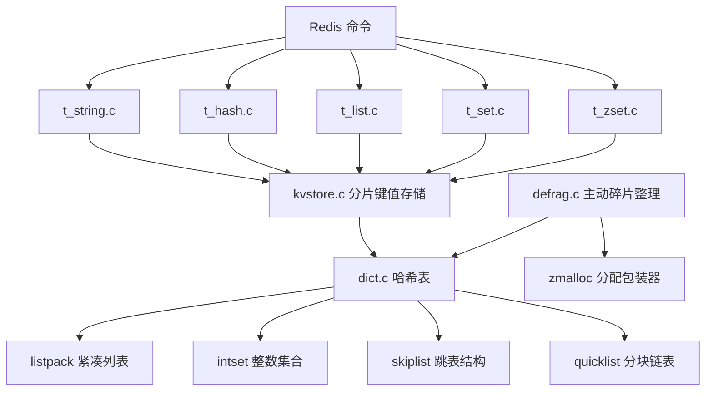
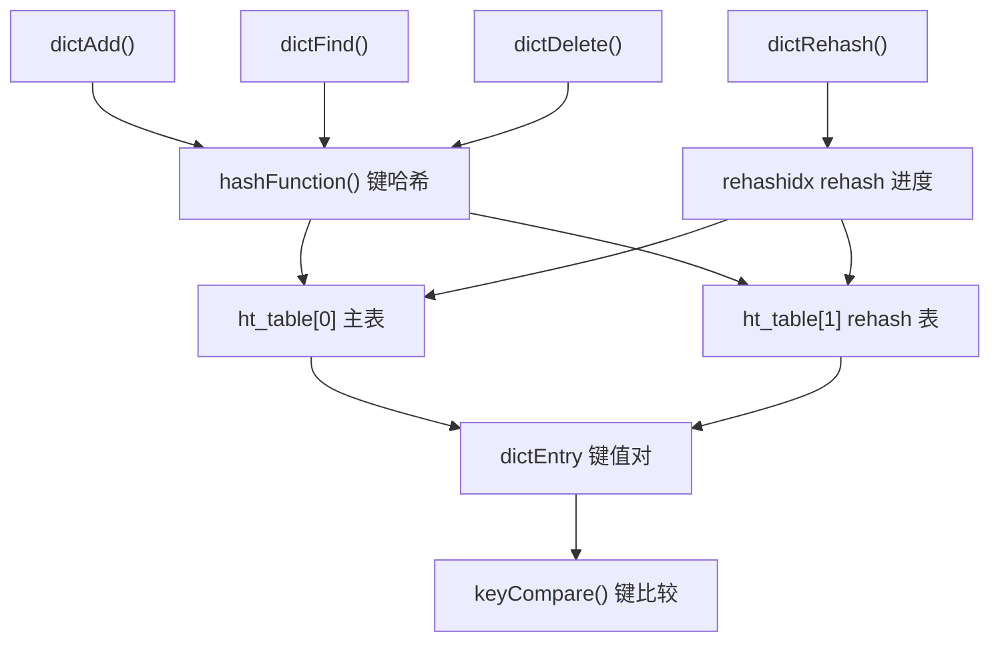

# 数据存储与管理

相关源文件

-   [src/defrag.c](https://github.com/redis/redis/blob/8ad54215/src/defrag.c)
-   [src/dict.c](https://github.com/redis/redis/blob/8ad54215/src/dict.c)
-   [src/dict.h](https://github.com/redis/redis/blob/8ad54215/src/dict.h)
-   [src/iothread.c](https://github.com/redis/redis/blob/8ad54215/src/iothread.c)
-   [src/kvstore.c](https://github.com/redis/redis/blob/8ad54215/src/kvstore.c)
-   [src/kvstore.h](https://github.com/redis/redis/blob/8ad54215/src/kvstore.h)
-   [src/t\_hash.c](https://github.com/redis/redis/blob/8ad54215/src/t_hash.c)
-   [src/t\_list.c](https://github.com/redis/redis/blob/8ad54215/src/t_list.c)
-   [src/t\_set.c](https://github.com/redis/redis/blob/8ad54215/src/t_set.c)
-   [src/t\_string.c](https://github.com/redis/redis/blob/8ad54215/src/t_string.c)
-   [src/t\_zset.c](https://github.com/redis/redis/blob/8ad54215/src/t_zset.c)
-   [tests/README.md](https://github.com/redis/redis/blob/8ad54215/tests/README.md)
-   [tests/unit/info-keysizes.tcl](https://github.com/redis/redis/blob/8ad54215/tests/unit/info-keysizes.tcl)
-   [tests/unit/info.tcl](https://github.com/redis/redis/blob/8ad54215/tests/unit/info.tcl)
-   [tests/unit/keyspace.tcl](https://github.com/redis/redis/blob/8ad54215/tests/unit/keyspace.tcl)
-   [tests/unit/memefficiency.tcl](https://github.com/redis/redis/blob/8ad54215/tests/unit/memefficiency.tcl)
-   [tests/unit/networking.tcl](https://github.com/redis/redis/blob/8ad54215/tests/unit/networking.tcl)
-   [tests/unit/obuf-limits.tcl](https://github.com/redis/redis/blob/8ad54215/tests/unit/obuf-limits.tcl)
-   [tests/unit/shutdown.tcl](https://github.com/redis/redis/blob/8ad54215/tests/unit/shutdown.tcl)
-   [tests/unit/type/hash.tcl](https://github.com/redis/redis/blob/8ad54215/tests/unit/type/hash.tcl)
-   [tests/unit/type/incr.tcl](https://github.com/redis/redis/blob/8ad54215/tests/unit/type/incr.tcl)
-   [tests/unit/type/list.tcl](https://github.com/redis/redis/blob/8ad54215/tests/unit/type/list.tcl)
-   [tests/unit/type/set.tcl](https://github.com/redis/redis/blob/8ad54215/tests/unit/type/set.tcl)
-   [tests/unit/type/string.tcl](https://github.com/redis/redis/blob/8ad54215/tests/unit/type/string.tcl)
-   [tests/unit/type/zset.tcl](https://github.com/redis/redis/blob/8ad54215/tests/unit/type/zset.tcl)

本文提供了 Redis 核心数据存储架构的概览，重点关注所有数据操作背后的基本机制和抽象。内容涵盖了键值存储基础设施、数据类型编码策略以及使 Redis 能够实现高性能数据处理的内存管理方法。

有关特定数据类型（字符串、哈希、列表、集合、有序集合）的详细实现，请参阅[核心数据类型实现](/redis/redis/3.1-core-data-types-implementation)。有关内存高效编码的详细信息，请参阅[内存高效的数据结构](/redis/redis/3.4-memory-efficient-data-structures)。有关底层字典实现，请参阅[字典与键值存储](/redis/redis/3.5-dictionary-and-key-value-store)。

## 存储架构概览

Redis 实现了分层存储架构，其中使用了多种编码策略来针对不同的数据模式优化内存使用和性能。核心原则是根据大小和内容特征，为每个数据结构使用尽可能内存高效的编码。

**核心存储架构**

**来源：** [src/t\_string.c1-1000](https://github.com/redis/redis/blob/8ad54215/src/t_string.c#L1-L1000) [src/t\_hash.c1-1000](https://github.com/redis/redis/blob/8ad54215/src/t_hash.c#L1-L1000) [src/t\_list.c1-1000](https://github.com/redis/redis/blob/8ad54215/src/t_list.c#L1-L1000) [src/t\_set.c1-1000](https://github.com/redis/redis/blob/8ad54215/src/t_set.c#L1-L1000) [src/t\_zset.c1-1000](https://github.com/redis/redis/blob/8ad54215/src/t_zset.c#L1-L1000) [src/kvstore.c1-100](https://github.com/redis/redis/blob/8ad54215/src/kvstore.c#L1-L100) [src/dict.c1-100](https://github.com/redis/redis/blob/8ad54215/src/dict.c#L1-L100) [src/defrag.c1-100](https://github.com/redis/redis/blob/8ad54215/src/defrag.c#L1-L100)

## 核心存储抽象

### 字典基础设施

`dict` 结构作为基本哈希表实现，是大多数 Redis 数据结构的基础。它提供平均时间复杂度为 O(1) 的操作，并采用渐进式 rehash 来保持性能。

**字典操作流程**

**来源：** [src/dict.c190-500](https://github.com/redis/redis/blob/8ad54215/src/dict.c#L190-L500) [src/dict.h53-120](https://github.com/redis/redis/blob/8ad54215/src/dict.h#L53-L120)

### KV 存储分片

`kvstore` 抽象提供了一个字典数组，以实现键的高效分片。这对于 Redis 集群特别有用，因为键分布在不同的哈希槽中。

| 组件 | 用途 | 关键函数 |
| --- | --- | --- |
| `kvstore` | 分片键值存储 | `kvstoreAdd()`, `kvstoreFind()`, `kvstoreDelete()` |
| `kvstoreDictIterator` | 跨分片迭代器 | `kvstoreDictIteratorStart()`, `kvstoreDictIteratorNext()` |
| `kvstoreIterator` | 键级迭代 | `kvstoreIteratorInit()`, `kvstoreIteratorNext()` |

**来源：** [src/kvstore.c37-100](https://github.com/redis/redis/blob/8ad54215/src/kvstore.c#L37-L100) [src/kvstore.h15-50](https://github.com/redis/redis/blob/8ad54215/src/kvstore.h#L15-L50)

## 数据类型编码策略

Redis 为每种数据类型采用多种编码策略，根据数据特征自动选择最节省内存的选项：

**编码选择矩阵**

```mermaid
flowchart TD
    STR_RAW["OBJ_ENCODING_RAW sds 字符串"]
    STR_INT["OBJ_ENCODING_INT long 整数"]
    STR_EMBSTR["OBJ_ENCODING_EMBSTR 嵌入式字符串"]
    HASH_LISTPACK["OBJ_ENCODING_LISTPACK 紧凑键值对"]
    HASH_HT["OBJ_ENCODING_HT dict 哈希表"]
    HASH_LISTPACK_EX["OBJ_ENCODING_LISTPACK_EX 带有字段过期"]
    LIST_LISTPACK["OBJ_ENCODING_LISTPACK 单个紧凑节点"]
    LIST_QUICKLIST["OBJ_ENCODING_QUICKLIST 链式 listpack 节点"]
    SET_INTSET["OBJ_ENCODING_INTSET 仅整数集合"]
    SET_LISTPACK["OBJ_ENCODING_LISTPACK 小字符串集合"]
    SET_HT["OBJ_ENCODING_HT 哈希表"]
    ZSET_LISTPACK["OBJ_ENCODING_LISTPACK 小有序集合"]
    ZSET_SKIPLIST["OBJ_ENCODING_SKIPLIST 跳表 + 字典"]
    SIZE_LIMIT["大小阈值 max-*-entries"]
    VALUE_LIMIT["值阈值 max-*-value"]
    TYPE_CONSTRAINT["类型约束 仅限整数"]

    SIZE --> LIMIT_HASH_LISTPACK
    SIZE --> LIMIT_LIST_LISTPACK
    SIZE --> LIMIT_SET_LISTPACK
    SIZE --> LIMIT_ZSET_LISTPACK
    VALUE --> LIMIT_HASH_LISTPACK
    VALUE --> LIMIT_LIST_LISTPACK
    VALUE --> LIMIT_SET_LISTPACK
    VALUE --> LIMIT_ZSET_LISTPACK
    TYPE --> CONSTRAINT_STR_INT
    TYPE --> CONSTRAINT_SET_INTSET
```

**来源：** [src/t\_hash.c606-635](https://github.com/redis/redis/blob/8ad54215/src/t_hash.c#L606-L635) [src/t\_list.c40-55](https://github.com/redis/redis/blob/8ad54215/src/t_list.c#L40-L55) [src/t\_set.c31-52](https://github.com/redis/redis/blob/8ad54215/src/t_set.c#L31-L52) [src/t\_zset.c20-42](https://github.com/redis/redis/blob/8ad54215/src/t_zset.c#L20-L42)

## 内存管理与优化

### 主动碎片整理

Redis 包含一个主动碎片整理系统，通过重新定位内存分配来减少外部碎片。碎片整理过程分阶段运行，且延迟受限。

**碎片整理流程**

```mermaid
flowchart TD
    STAGE_KEYS["defragStageDbKeys 主键空间"]
    STAGE_HEXPIRES["defragStageHExpires 哈希字段过期"]
    STAGE_PUBSUB["defragStagePubsub 发布/订阅频道"]
    STAGE_MODULES["defragStageModuleKeys 模块数据"]
    DEFRAG_CTX["DefragContext 全局状态"]
    REMAINING_STAGES["remaining_stages 阶段队列"]
    CURRENT_STAGE["current_stage 当前阶段"]
    DEFRAG_ALLOC["activeDefragAlloc() 重新定位分配"]
    JE_HINT["je_get_defrag_hint() 碎片检查"]
    ZMALLOC_NOTCACHE["zmalloc_no_tcache() 避免缓存复用"]

    DEFRAG --> CTX_REMAINING_STAGES
    REMAINING --> STAGES_STAGE_KEYS
    REMAINING --> STAGES_STAGE_HEXPIRES
    REMAINING --> STAGES_STAGE_PUBSUB
    REMAINING --> STAGES_STAGE_MODULES
    STAGE --> KEYS_DEFRAG_ALLOC
    STAGE --> HEXPIRES_DEFRAG_ALLOC
    STAGE --> PUBSUB_DEFRAG_ALLOC
    STAGE --> MODULES_DEFRAG_ALLOC
    DEFRAG --> ALLOC_JE_HINT
    JE --> HINT_ZMALLOC_NOTCACHE
```

**来源：** [src/defrag.c25-75](https://github.com/redis/redis/blob/8ad54215/src/defrag.c#L25-L75) [src/defrag.c140-170](https://github.com/redis/redis/blob/8ad54215/src/defrag.c#L140-L170) [src/defrag.c325-400](https://github.com/redis/redis/blob/8ad54215/src/defrag.c#L325-L400)

### 编码转换触发器

当超过阈值时，数据结构会自动在编码之间进行转换：

| 数据类型 | 小规模编码 | 大规模编码 | 转换触发条件 |
| --- | --- | --- | --- |
| 哈希 (Hash) | `OBJ_ENCODING_LISTPACK` | `OBJ_ENCODING_HT` | `hash-max-listpack-entries`/`hash-max-listpack-value` |
| 列表 (List) | `OBJ_ENCODING_LISTPACK` | `OBJ_ENCODING_QUICKLIST` | `list-max-listpack-size` |
| 集合 (Set) | `OBJ_ENCODING_INTSET`/`OBJ_ENCODING_LISTPACK` | `OBJ_ENCODING_HT` | `set-max-intset-entries`/`set-max-listpack-entries` |
| 有序集合 (ZSet) | `OBJ_ENCODING_LISTPACK` | `OBJ_ENCODING_SKIPLIST` | `zset-max-listpack-entries`/`zset-max-listpack-value` |

**来源：** [src/t\_hash.c606-635](https://github.com/redis/redis/blob/8ad54215/src/t_hash.c#L606-L635) [src/t\_list.c23-56](https://github.com/redis/redis/blob/8ad54215/src/t_list.c#L23-L56) [src/t\_set.c46-52](https://github.com/redis/redis/blob/8ad54215/src/t_set.c#L46-L52) [tests/unit/type/zset.tcl100-117](https://github.com/redis/redis/blob/8ad54215/tests/unit/type/zset.tcl#L100-L117)

## 键值操作

### 操作分发

Redis 命令通过数据类型实现文件进行分发，这些文件处理特定编码的操作：

**命令处理流程**

**来源：** [src/t\_hash.c1200-1300](https://github.com/redis/redis/blob/8ad54215/src/t_hash.c#L1200-L1300) [src/t\_list.c364-385](https://github.com/redis/redis/blob/8ad54215/src/t_list.c#L364-L385) [src/t\_set.c100-120](https://github.com/redis/redis/blob/8ad54215/src/t_set.c#L100-L120) [src/t\_zset.c1200-1400](https://github.com/redis/redis/blob/8ad54215/src/t_zset.c#L1200-L1400)

### 存储效率

分层编码方法显著节省了内存。例如，哈希字段可以以 listpack 格式存储，在未设置 TTL 的情况下，每个字段仅有 2 字节的额外开销，而哈希表编码中完整的 `dictEntry` 结构开销则大得多。

内存效率测试表明，Redis 对较大值（1-16KB 范围内）实现了 75-82% 的效率，证明了编码策略优化的有效性。

**来源：** [tests/unit/memefficiency.tcl15-51](https://github.com/redis/redis/blob/8ad54215/tests/unit/memefficiency.tcl#L15-L51) [src/t\_hash.c295-310](https://github.com/redis/redis/blob/8ad54215/src/t_hash.c#L295-L310)
