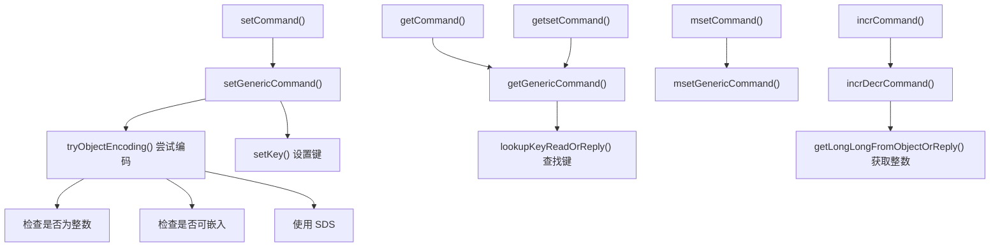
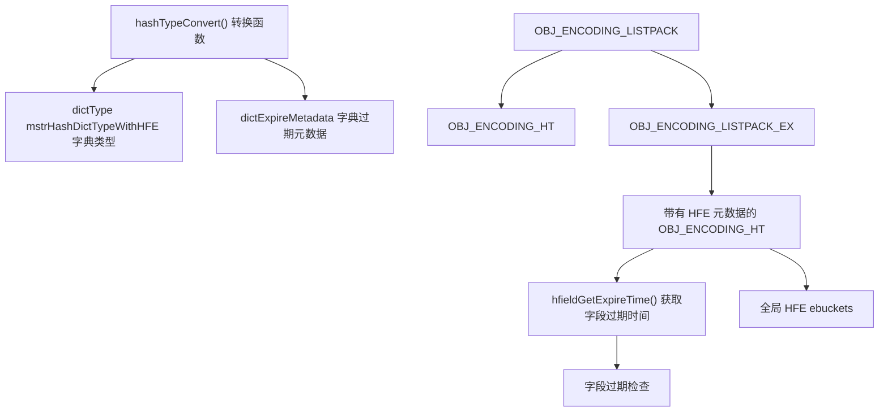
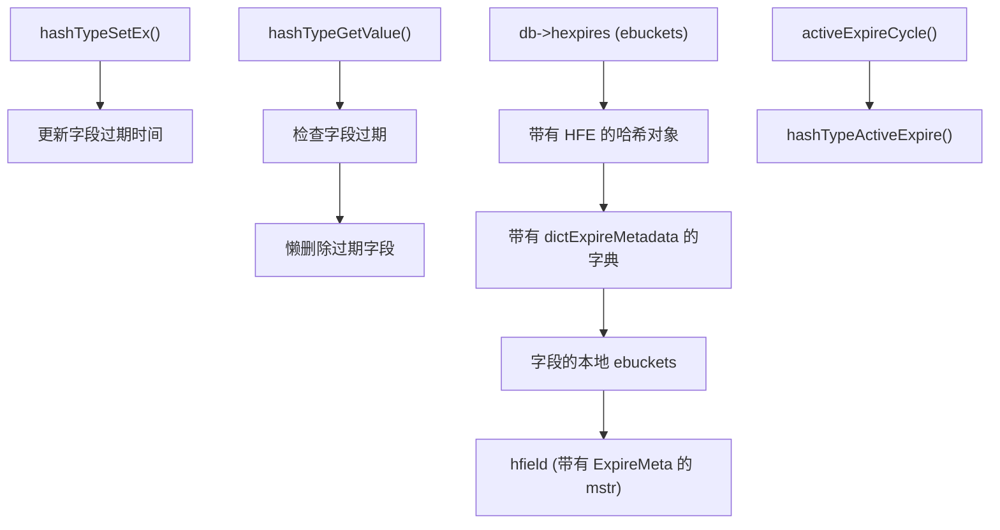
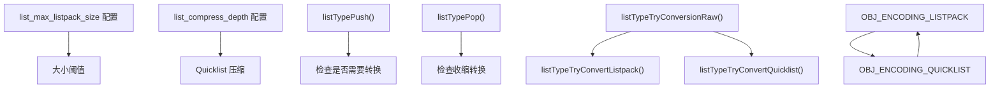
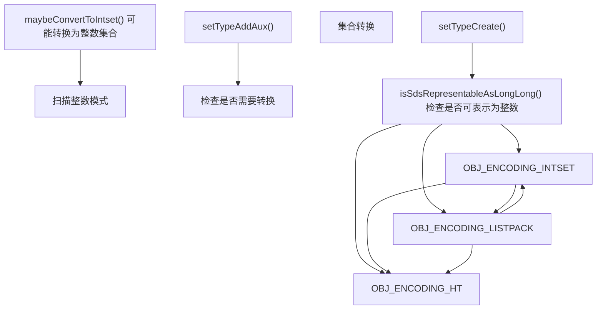
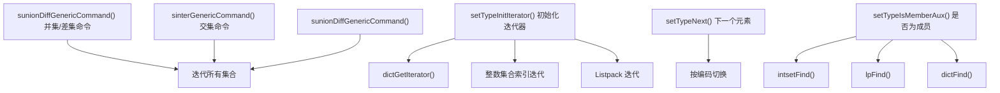
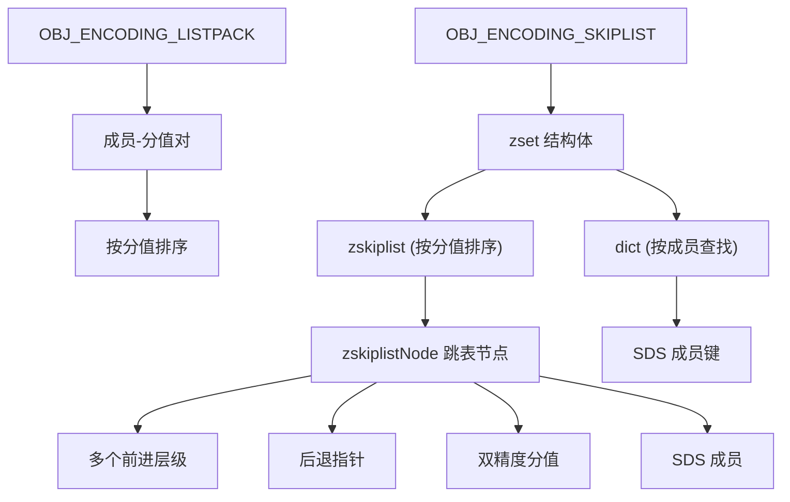
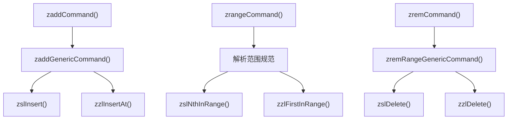
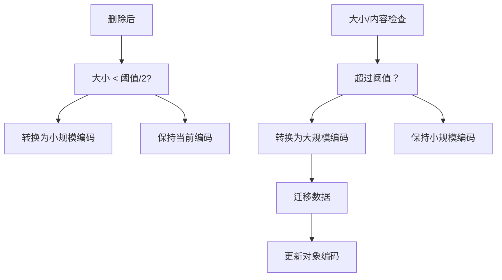

# 核心数据类型实现

相关源文件

-   [src/t\_hash.c](https://github.com/redis/redis/blob/8ad54215/src/t_hash.c)
-   [src/t\_list.c](https://github.com/redis/redis/blob/8ad54215/src/t_list.c)
-   [src/t\_set.c](https://github.com/redis/redis/blob/8ad54215/src/t_set.c)
-   [src/t\_string.c](https://github.com/redis/redis/blob/8ad54215/src/t_string.c)
-   [src/t\_zset.c](https://github.com/redis/redis/blob/8ad54215/src/t_zset.c)
-   [tests/README.md](https://github.com/redis/redis/blob/8ad54215/tests/README.md)
-   [tests/unit/keyspace.tcl](https://github.com/redis/redis/blob/8ad54215/tests/unit/keyspace.tcl)
-   [tests/unit/type/hash.tcl](https://github.com/redis/redis/blob/8ad54215/tests/unit/type/hash.tcl)
-   [tests/unit/type/incr.tcl](https://github.com/redis/redis/blob/8ad54215/tests/unit/type/incr.tcl)
-   [tests/unit/type/list.tcl](https://github.com/redis/redis/blob/8ad54215/tests/unit/type/list.tcl)
-   [tests/unit/type/set.tcl](https://github.com/redis/redis/blob/8ad54215/tests/unit/type/set.tcl)
-   [tests/unit/type/string.tcl](https://github.com/redis/redis/blob/8ad54215/tests/unit/type/string.tcl)
-   [tests/unit/type/zset.tcl](https://github.com/redis/redis/blob/8ad54215/tests/unit/type/zset.tcl)

本文涵盖了 Redis 五种核心数据类型的实现细节：字符串 (strings)、哈希 (hashes)、列表 (lists)、集合 (sets) 和有序集合 (sorted sets/ZSETs)。重点介绍了内部编码、内存优化策略以及转换机制，这些机制使得每种数据类型都能高效处理小规模和大规模数据集。

有关内存管理和逐出策略的信息，请参阅[内存管理](/redis/redis/4-memory-management)。有关 listpack 和 intset 等底层内存高效结构的详细信息，请参阅[内存高效的数据结构](/redis/redis/3.4-memory-efficient-data-structures)。

## 概览与编码策略

Redis 为每种核心数据类型实现了多种内部编码，这些编码根据大小阈值和内容特征进行透明切换。这种双重编码方法优化了小规模集合的内存使用，同时保持了大规模集合的性能。

### 核心数据类型编码

```mermaid
flowchart TD
    ZSET["OBJ_ZSET"]
    ZSET_LP["OBJ_ENCODING_LISTPACK"]
    ZSET_SKIPLIST["OBJ_ENCODING_SKIPLIST"]
    SET["OBJ_SET"]
    SET_INTSET["OBJ_ENCODING_INTSET"]
    SET_LP["OBJ_ENCODING_LISTPACK"]
    SET_HT["OBJ_ENCODING_HT"]
    LIST["OBJ_LIST"]
    LIST_LP["OBJ_ENCODING_LISTPACK"]
    LIST_QL["OBJ_ENCODING_QUICKLIST"]
    HASH["OBJ_HASH"]
    HASH_LP["OBJ_ENCODING_LISTPACK"]
    HASH_LPEX["OBJ_ENCODING_LISTPACK_EX"]
    HASH_HT["OBJ_ENCODING_HT"]
    STR["OBJ_STRING"]
    STR_RAW["OBJ_ENCODING_RAW"]
    STR_INT["OBJ_ENCODING_INT"]
    STR_EMBSTR["OBJ_ENCODING_EMBSTR"]

    ZSET --> ZSET_LP
    ZSET --> ZSET_SKIPLIST
    SET --> SET_INTSET
    SET --> SET_LP
    SET --> SET_HT
    LIST --> LIST_LP
    LIST --> LIST_QL
    HASH --> HASH_LP
    HASH --> HASH_LPEX
    HASH --> HASH_HT
    STR --> STR_RAW
    STR --> STR_INT
    STR --> STR_EMBSTR
```

**来源：** [src/t\_string.c1-700](https://github.com/redis/redis/blob/8ad54215/src/t_string.c#L1-L700) [src/t\_hash.c1-150](https://github.com/redis/redis/blob/8ad54215/src/t_hash.c#L1-L150) [src/t\_list.c1-100](https://github.com/redis/redis/blob/8ad54215/src/t_list.c#L1-L100) [src/t\_set.c1-50](https://github.com/redis/redis/blob/8ad54215/src/t_set.c#L1-L50) [src/t\_zset.c1-100](https://github.com/redis/redis/blob/8ad54215/src/t_zset.c#L1-L100)

## 字符串实现

Redis 字符串支持三种针对不同用例优化的编码：

-   **`OBJ_ENCODING_INT`**：用于能放进 `long` 类型的整数。
-   **`OBJ_ENCODING_EMBSTR`**：用于嵌入在对象结构中的短字符串。
-   **`OBJ_ENCODING_RAW`**：用于使用 SDS (简单动态字符串) 的较长字符串。

### 字符串命令处理

`setGenericCommand()` 函数处理带有 NX/XX、用于过期的 EX/PX 以及用于原子“获取并设置”操作的 GET 等选项的 SET 变体。

**来源：** [src/t\_string.c73-149](https://github.com/redis/redis/blob/8ad54215/src/t_string.c#L73-L149) [src/t\_string.c294-305](https://github.com/redis/redis/blob/8ad54215/src/t_string.c#L294-L305) [src/t\_string.c322-334](https://github.com/redis/redis/blob/8ad54215/src/t_string.c#L322-L334)

## 哈希实现

Redis 中的哈希表使用了一种先进的多编码方法，并支持哈希字段过期 (HFE)：

### 哈希编码转换

`listpackEx` 结构扩展了常规 listpack 编码以支持每个字段的 TTL 值，按照过期时间维护字段顺序以实现高效清理。

### 哈希字段过期架构

**来源：** [src/t\_hash.c116-130](https://github.com/redis/redis/blob/8ad54215/src/t_hash.c#L116-L130) [src/t\_hash.c181-230](https://github.com/redis/redis/blob/8ad54215/src/t_hash.c#L181-L230) [src/t\_hash.c299-436](https://github.com/redis/redis/blob/8ad54215/src/t_hash.c#L299-L436)

## 列表实现

列表根据大小和配置使用两种编码：

-   **`OBJ_ENCODING_LISTPACK`**：对小列表内存高效。
-   **`OBJ_ENCODING_QUICKLIST`**：针对大列表的混合结构（listpack 链表）。

### 列表转换策略

转换系统对增长和收缩采用了不同的策略，以避免在编码之间产生抖动（oscillation）。

**来源：** [src/t\_list.c23-56](https://github.com/redis/redis/blob/8ad54215/src/t_list.c#L23-L56) [src/t\_list.c67-95](https://github.com/redis/redis/blob/8ad54215/src/t_list.c#L67-L95) [src/t\_list.c112-139](https://github.com/redis/redis/blob/8ad54215/src/t_list.c#L112-L139)

## 集合实现

集合采用了三种针对不同数据模式优化的编码：

### 集合编码选择

如果发现所有元素都是整数，`maybeConvertToIntset()` 函数可以将哈希表或 listpack 集合转换回整数集合 (intsets)。

### 集合操作实现

**来源：** [src/t\_set.c31-52](https://github.com/redis/redis/blob/8ad54215/src/t_set.c#L31-L52) [src/t\_set.c110-215](https://github.com/redis/redis/blob/8ad54215/src/t_set.c#L110-215) [src/t\_set.c311-382](https://github.com/redis/redis/blob/8ad54215/src/t_set.c#L311-L382)

## 有序集合 (ZSet) 实现

有序集合为不同的访问模式使用了双重数据结构：

### ZSet 双重结构设计

跳表实现在提供 O(log N) 操作的同时，在字典和跳表中保持相同的 SDS 字符串，以实现内存效率。

### ZSet 操作流程

**来源：** [src/t\_zset.c20-42](https://github.com/redis/redis/blob/8ad54215/src/t_zset.c#L20-L42) [src/t\_zset.c58-177](https://github.com/redis/redis/blob/8ad54215/src/t_zset.c#L58-L177) [src/t\_zset.c769-1300](https://github.com/redis/redis/blob/8ad54215/src/t_zset.c#L769-L1300)

## 编码转换机制

所有数据类型都实现了基于阈值的转换系统，监控大小和内容以确定最优编码：

### 转换决策矩阵

| 数据类型 | 小规模编码 | 阈值配置 | 大规模编码 | 触发条件 |
| --- | --- | --- | --- | --- |
| 字符串 | `INT`/`EMBSTR` | `不适用` | `RAW` | 长度、数值内容 |
| 哈希 | `LISTPACK` | `hash_max_listpack_entries/value` | `HT` | 条目数、字段大小 |
| 列表 | `LISTPACK` | `list_max_listpack_size` | `QUICKLIST` | 总大小、条目数 |
| 集合 | `INTSET`/`LISTPACK` | `set_max_intset_entries`, `set_max_listpack_entries` | `HT` | 条目数、内容类型 |
| 有序集合 | `LISTPACK` | `zset_max_listpack_entries/value` | `SKIPLIST` | 条目数、成员大小 |

### 通用转换模式

收缩阈值通常是增长阈值的一半，以防止在边界附近由于频繁的大小变化而在编码之间产生抖动。

**来源：** [src/t\_hash.c606-635](https://github.com/redis/redis/blob/8ad54215/src/t_hash.c#L606-L635) [src/t\_list.c67-95](https://github.com/redis/redis/blob/8ad54215/src/t_list.c#L67-L95) [src/t\_set.c46-67](https://github.com/redis/redis/blob/8ad54215/src/t_set.c#L46-L67)
