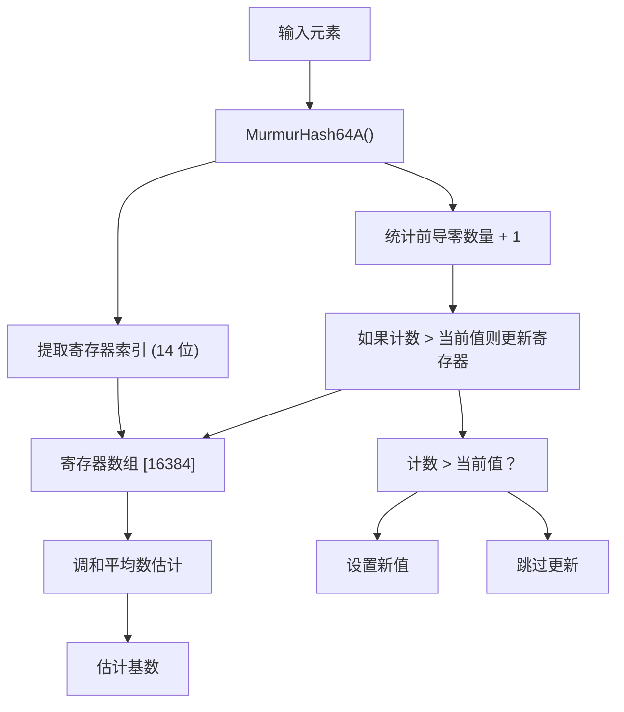
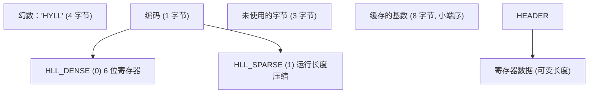
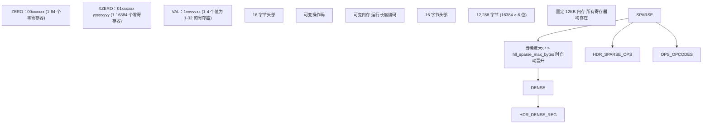
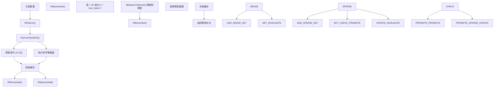
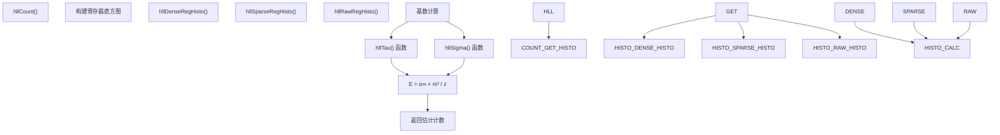
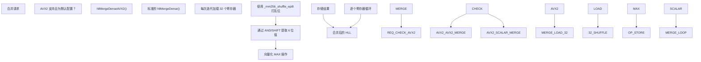
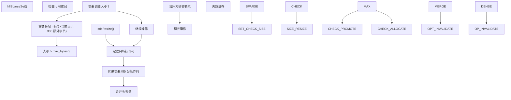

# HyperLogLog

相关源文件

-   [src/commands/pfmerge.json](https://github.com/redis/redis/blob/8ad54215/src/commands/pfmerge.json)
-   [src/hyperloglog.c](https://github.com/redis/redis/blob/8ad54215/src/hyperloglog.c)
-   [tests/unit/hyperloglog.tcl](https://github.com/redis/redis/blob/8ad54215/tests/unit/hyperloglog.tcl)
-   [utils/generate-module-api-doc.rb](https://github.com/redis/redis/blob/8ad54215/utils/generate-module-api-doc.rb)

本文涵盖了 Redis 的 HyperLogLog 实现，这是一种用于基数估计 (cardinality estimation) 的概率数据结构。HyperLogLog 允许在大数据集中高效估计唯一元素的数量，且无论实际基数大小如何，仅占用固定内存 (12KB)。Redis 使用两种表示形式：低基数时使用更节省内存的稀疏表示 (sparse)，高基数时使用稠密表示 (dense)。

有关其他概率数据结构的信息，请参阅 [核心数据类型实现](/redis/redis/3.1-core-data-types-implementation) 中的主要数据类型实现。

## 算法概览

Redis 实现了 HyperLogLog 算法，使用 64 位哈希函数和 16,384 个 6 位寄存器，为数十亿个唯一元素的基数估计提供高精度。

**HyperLogLog 算法流程**

该算法使用 `MurmurHash64A` 哈希函数处理元素，从前 14 位提取寄存器索引，并统计剩余 50 位中的前导零数量。每个寄存器存储哈希到该寄存器的元素所见过的最大前导零计数。

**来源：** [src/hyperloglog.c29-47](https://github.com/redis/redis/blob/8ad54215/src/hyperloglog.c#L29-L47) [src/hyperloglog.c451-472](https://github.com/redis/redis/blob/8ad54215/src/hyperloglog.c#L451-L472) [src/hyperloglog.c1042-1077](https://github.com/redis/redis/blob/8ad54215/src/hyperloglog.c#L1042-L1077)

## 数据结构与表示

### HLL 头部结构

**HLL 数据结构布局**

`struct hllhdr` 定义了两种表示形式通用的头部格式。缓存的基数使用最高有效位 (MSB) 作为失效标志。

**来源：** [src/hyperloglog.c57-79](https://github.com/redis/redis/blob/8ad54215/src/hyperloglog.c#L57-L79) [src/hyperloglog.c174-180](https://github.com/redis/redis/blob/8ad54215/src/hyperloglog.c#L174-L180) [src/hyperloglog.c182-184](https://github.com/redis/redis/blob/8ad54215/src/hyperloglog.c#L182-L184)

### 稠密 vs 稀疏表示

**稠密与稀疏表示对比**

当稀疏表示超过 `server.hll_sparse_max_bytes` 或寄存器值超过 32 时，Redis 会自动将其从稀疏表示晋升为稠密表示。

**来源：** [src/hyperloglog.c48-172](https://github.com/redis/redis/blob/8ad54215/src/hyperloglog.c#L48-L172) [src/hyperloglog.c577-642](https://github.com/redis/redis/blob/8ad54215/src/hyperloglog.c#L577-L642) [src/hyperloglog.c659-911](https://github.com/redis/redis/blob/8ad54215/src/hyperloglog.c#L659-L911)

## 核心操作

### 元素添加过程

**元素添加流程**

`hllAdd` 函数根据当前编码路由到稠密或稀疏实现，并在必要时自动执行晋升。

**来源：** [src/hyperloglog.c1079-1087](https://github.com/redis/redis/blob/8ad54215/src/hyperloglog.c#L1079-L1087) [src/hyperloglog.c486-509](https://github.com/redis/redis/blob/8ad54215/src/hyperloglog.c#L486-L509) [src/hyperloglog.c913-924](https://github.com/redis/redis/blob/8ad54215/src/hyperloglog.c#L913-L924)

### 基数估计

**基数估计过程**

该估计使用了一种改进的算法，基于 Otmar Ertl 的论文《New cardinality estimation algorithms for HyperLogLog sketches》，并使用了 tau 和 sigma 修正函数。

**来源：** [src/hyperloglog.c1042-1077](https://github.com/redis/redis/blob/8ad54215/src/hyperloglog.c#L1042-L1077) [src/hyperloglog.c997-1029](https://github.com/redis/redis/blob/8ad54215/src/hyperloglog.c#L997-L1029) [src/hyperloglog.c512-567](https://github.com/redis/redis/blob/8ad54215/src/hyperloglog.c#L512-L567)

## 命令与 API

### Redis HyperLogLog 命令

| 命令 | 函数 | 用途 |
| --- | --- | --- |
| `PFADD` | `pfaddCommand` | 向 HyperLogLog 添加元素 |
| `PFCOUNT` | `pfcountCommand` | 获取基数估计值 |
| `PFMERGE` | `pfmergeCommand` | 合并多个 HyperLogLog |
| `PFDEBUG` | `pfdebugCommand` | 调试操作 |

```mermaid
flowchart TD
    CLIENT["Redis 客户端"]
    CMD_PARSE["命令解析器"]
    PFADD["PFADD key elements..."]
    PFCOUNT["PFCOUNT key [key ...]"]
    PFMERGE["PFMERGE destkey sourcekey [sourcekey ...]"]
    ADD_VALIDATE["验证 HLL 对象"]
    ADD_ELEMENTS["添加每个元素"]
    HLL_ADD["hllAdd()"]
    COUNT_VALIDATE["验证 HLL 对象"]
    MULTI_COUNT["是否为多个键？"]
    MERGE_TEMP["合并到临时对象"]
    SINGLE_COUNT["hllCount()"]
    MERGE_VALIDATE["验证对象"]
    HLL_MERGE["hllMerge()"]
    REPLY["回复客户端"]

    CLIENT --> CMD_PARSE
    CMD --> PARSE_PFADD
    CMD --> PARSE_PFCOUNT
    CMD --> PARSE_PFMERGE
    PFADD --> ADD_VALIDATE
    ADD --> VALIDATE_ADD_ELEMENTS
    ADD --> ELEMENTS_HLL_ADD
    PFCOUNT --> COUNT_VALIDATE
    COUNT --> VALIDATE_MULTI_COUNT
    MULTI --> COUNT_MERGE_TEMP
    MULTI --> COUNT_SINGLE_COUNT
    MERGE --> TEMP_SINGLE_COUNT
    PFMERGE --> MERGE_VALIDATE
    MERGE --> VALIDATE_HLL_MERGE
    HLL --> ADD_REPLY
    SINGLE --> COUNT_REPLY
    HLL --> MERGE_REPLY
```

**命令处理流程**

在执行操作前，命令使用 `isHLLObjectOrReply()` 验证 HLL 对象。多键 `PFCOUNT` 会创建一个临时的合并表示形式用于估计。

**来源：** [src/hyperloglog.c1461-1525](https://github.com/redis/redis/blob/8ad54215/src/hyperloglog.c#L1461-L1525) [src/hyperloglog.c1527-1622](https://github.com/redis/redis/blob/8ad54215/src/hyperloglog.c#L1527-L1622) [src/hyperloglog.c1624-1720](https://github.com/redis/redis/blob/8ad54215/src/hyperloglog.c#L1624-L1720)

## 内存管理与优化

### AVX2 SIMD 优化

**针对稠密合并的 AVX2 SIMD 优化**

该实现包含经过 AVX2 优化的稠密合并，每次迭代处理 32 个寄存器，显著提高了对稠密 HyperLogLog 执行 `PFMERGE` 操作的性能。

**来源：** [src/hyperloglog.c1089-1193](https://github.com/redis/redis/blob/8ad54215/src/hyperloglog.c#L1089-L1193) [src/hyperloglog.c1195-1213](https://github.com/redis/redis/blob/8ad54215/src/hyperloglog.c#L1195-L1213)

### 稀疏表示管理

**稀疏表示内存管理**

稀疏实现使用贪婪分配来最小化重新分配次数，并包含操作码合并优化以保持紧凑表示。

**来源：** [src/hyperloglog.c678-684](https://github.com/redis/redis/blob/8ad54215/src/hyperloglog.c#L678-L684) [src/hyperloglog.c792-852](https://github.com/redis/redis/blob/8ad54215/src/hyperloglog.c#L792-L852) [src/hyperloglog.c855-891](https://github.com/redis/redis/blob/8ad54215/src/hyperloglog.c#L855-L891)
