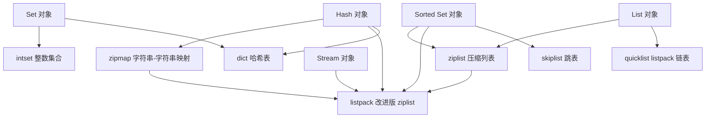
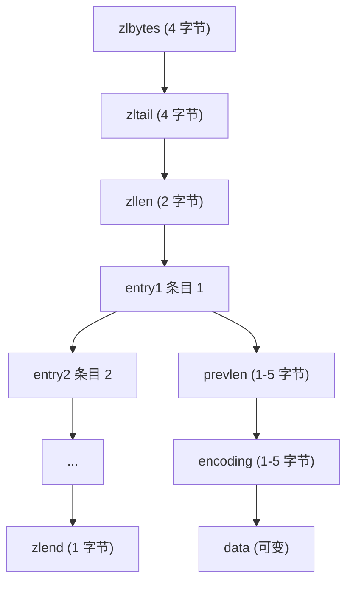
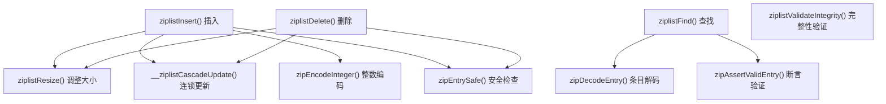
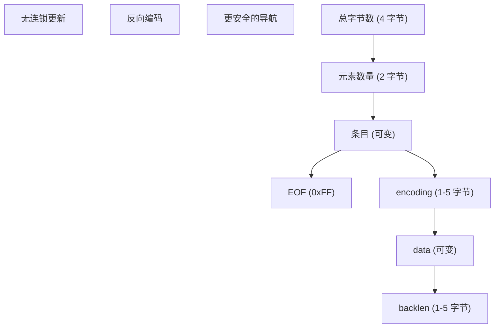
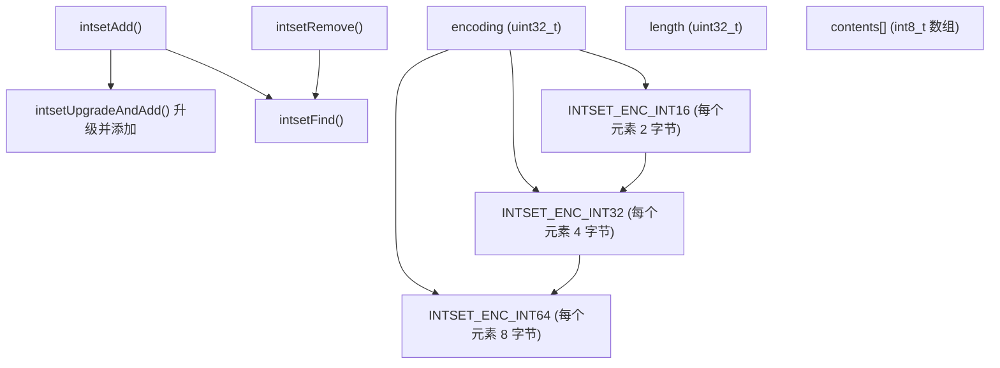
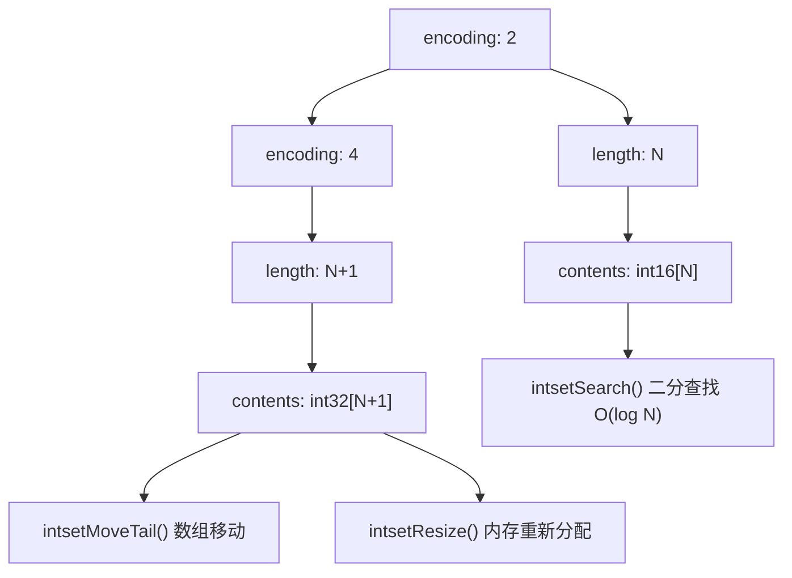
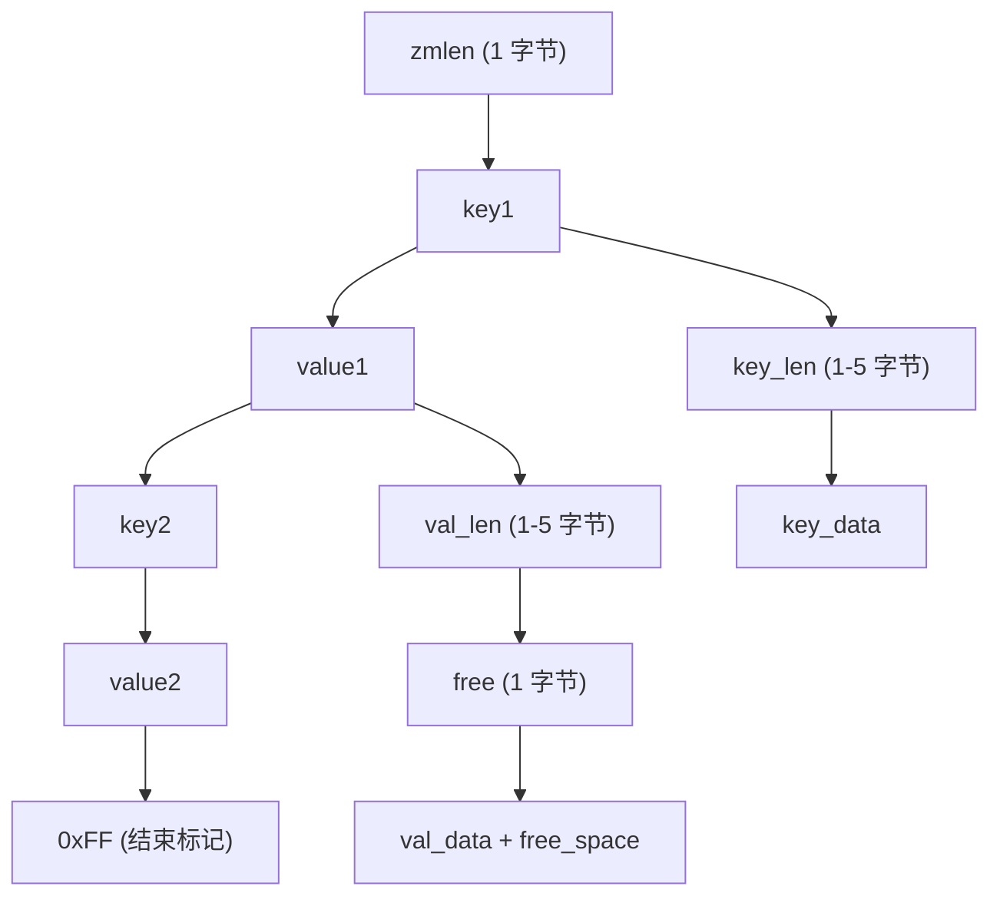
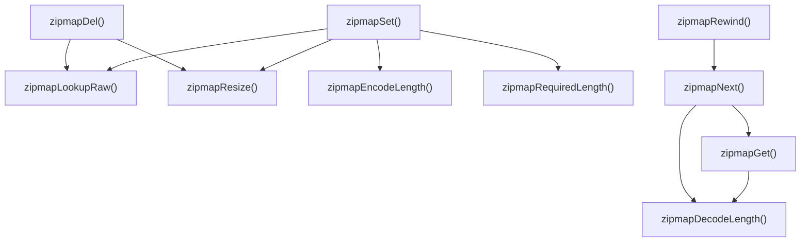
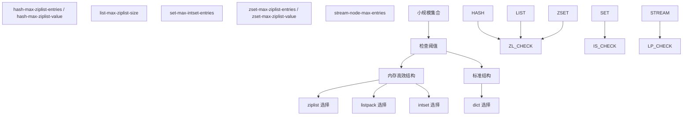
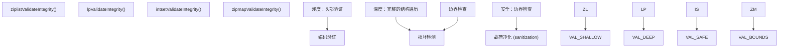

# 内存高效的数据结构

相关源文件

-   [src/intset.c](https://github.com/redis/redis/blob/8ad54215/src/intset.c)
-   [src/intset.h](https://github.com/redis/redis/blob/8ad54215/src/intset.h)
-   [src/listpack.c](https://github.com/redis/redis/blob/8ad54215/src/listpack.c)
-   [src/listpack.h](https://github.com/redis/redis/blob/8ad54215/src/listpack.h)
-   [src/ziplist.c](https://github.com/redis/redis/blob/8ad54215/src/ziplist.c)
-   [src/ziplist.h](https://github.com/redis/redis/blob/8ad54215/src/ziplist.h)
-   [src/zipmap.c](https://github.com/redis/redis/blob/8ad54215/src/zipmap.c)
-   [src/zipmap.h](https://github.com/redis/redis/blob/8ad54215/src/zipmap.h)
-   [tests/integration/corrupt-dump-fuzzer.tcl](https://github.com/redis/redis/blob/8ad54215/tests/integration/corrupt-dump-fuzzer.tcl)
-   [tests/integration/corrupt-dump.tcl](https://github.com/redis/redis/blob/8ad54215/tests/integration/corrupt-dump.tcl)

本文涵盖了 Redis 的内存高效数据结构，这些结构为小规模集合提供了紧凑的表示形式。当超过大小阈值时，这些结构会自动从内存优化的编码切换到更通用的数据结构。

有关使用这些结构的核心数据类型实现的信息，请参阅[核心数据类型实现](/redis/redis/3.1-core-data-types-implementation)。有关字典和键值存储架构的详细信息，请参阅[字典与键值存储](/redis/redis/3.5-dictionary-and-key-value-store)。

## 概览

Redis 采用了几种专门的数据结构，以最大限度地减少小规模集合的内存使用。这些结构通过使用紧凑的二进制编码并避免指针开销，以一定的操作复杂度换取显著的内存节省。

**内存高效结构选择标准：**

| 结构 | 用途 | 阈值配置 | 内存收益 |
| --- | --- | --- | --- |
| `ziplist` | 列表、哈希、有序集合 | `*-max-ziplist-entries/value` | 减少 50-80% |
| `listpack` | 流、较新的哈希 | `*-max-listpack-entries` | 与 ziplist 类似，设计更佳 |
| `intset` | 仅限整数的集合 | `set-max-intset-entries` | 整数场景下减少 90% 以上 |
| `zipmap` | 小哈希 (旧版) | 固定的小规模 | 减少 60-70% |

**来源：** [src/ziplist.c1-180](https://github.com/redis/redis/blob/8ad54215/src/ziplist.c#L1-L180) [src/listpack.c1-30](https://github.com/redis/redis/blob/8ad54215/src/listpack.c#L1-L30) [src/intset.c39-53](https://github.com/redis/redis/blob/8ad54215/src/intset.c#L39-L53) [src/zipmap.c1-70](https://github.com/redis/redis/blob/8ad54215/src/zipmap.c#L1-L70)

## Ziplist 实现

`ziplist` 是一个压缩的双向链表，以紧凑的二进制格式存储字符串和整数。在较新版本中被 `listpack` 取代之前，它是主要的内存高效结构。

### Ziplist 结构布局

**关键函数：**

-   `ziplistNew()` - 创建空的 ziplist。
-   `ziplistPush()` - 在头部/尾部添加元素。
-   `ziplistInsert()` - 在任意位置插入。
-   `__ziplistCascadeUpdate()` - 处理条目大小变化时的连锁更新。

**编码类型：**

-   **字符串**：6 位 (≤63 字节), 14 位 (≤16383 字节), 32 位 (≤2^32 字节)。
-   **整数**：4 位立即数 (0-12), 8 位, 16 位, 24 位, 32 位, 64 位。

**来源：** [src/ziplist.c11-151](https://github.com/redis/redis/blob/8ad54215/src/ziplist.c#L11-L151) [src/ziplist.h37-44](https://github.com/redis/redis/blob/8ad54215/src/ziplist.h#L37-L44)

### Ziplist 条目操作

ziplist 通过精心的内存管理和编码优化来支持高效操作：

**关键实现细节：**

-   **连锁更新 (Cascade Updates)**：当一个条目的大小发生变化时，后续条目可能需要更新 `prevlen` 字段。
-   **安全检查**：`zipEntrySafe()` 验证条目是否在缓冲区边界内。
-   **整数优化**：小整数 (0-12) 直接编码在编码字节本身中。

**来源：** [src/ziplist.c750-850](https://github.com/redis/redis/blob/8ad54215/src/ziplist.c#L750-L850) [src/ziplist.c628-688](https://github.com/redis/redis/blob/8ad54215/src/ziplist.c#L628-L688) [src/ziplist.c521-575](https://github.com/redis/redis/blob/8ad54215/src/ziplist.c#L521-L575)

## Listpack 实现

`listpack` 是 `ziplist` 的现代替代品，旨在消除连锁更新问题，同时保持内存效率。

### Listpack 结构设计

**编码优化：**

-   **7 位无符号整数**：单字节 (0-127)。
-   **13 位有符号整数**：双字节 (-4096 到 4095)。
-   **字符串长度**：6 位、12 位或 32 位长度前缀。
-   **反向长度 (backlen)**：经过反向编码，用于高效的反向遍历。

**核心函数：**

-   `lpNew()` - 创建空的 listpack。
-   `lpInsertString()` / `lpInsertInteger()` - 插入操作。
-   `lpDelete()` - 移除条目。
-   `lpNext()` / `lpPrev()` - 无连锁更新问题的导航。

**来源：** [src/listpack.c27-130](https://github.com/redis/redis/blob/8ad54215/src/listpack.c#L27-L130) [src/listpack.c250-334](https://github.com/redis/redis/blob/8ad54215/src/listpack.c#L250-L334) [src/listpack.h28-35](https://github.com/redis/redis/blob/8ad54215/src/listpack.h#L28-L35)

### Listpack 与 Ziplist 比较

| 特性 | Ziplist | Listpack |
| --- | --- | --- |
| **连锁更新** | 当 `prevlen` 改变时需要 | 通过设计消除 |
| **条目导航** | 通过 `prevlen` 正向，反向复杂 | 通过 `backlen` 支持双向 |
| **内存开销** | 略低 | 因 `backlen` 略高 |
| **操作复杂度** | 更新时最坏情况 O(N²) | 所有操作均为 O(N) |
| **用途** | 旧版，仍用于列表 | 新实现的首选 |

**来源：** [src/listpack.c395-408](https://github.com/redis/redis/blob/8ad54215/src/listpack.c#L395-L408) [src/ziplist.c730-850](https://github.com/redis/redis/blob/8ad54215/src/ziplist.c#L730-L850)

## Intset 实现

`intset` 通过使用具有自动编码升级功能的有序数组，为仅包含整数的集合提供了内存高效的存储。

### Intset 结构与编码

**关键实现特性：**

-   **自动升级**：当添加需要更大编码的值时，整个 intset 会进行升级。
-   **二分查找**：`intsetSearch()` 在有序数组中提供 O(log N) 的查找。
-   **内存效率**：无指针，直接数组存储，开销极小。
-   **字节序 (Endianness)**：通过 `memrev16ifbe()` 等函数正确处理字节顺序。

**升级过程：**

1.  确定新值所需的编码。
2.  为升级后的编码分配新内存。
3.  从后向前复制现有值，以避免覆盖。
4.  在适当位置插入新值。
5.  更新编码和长度字段。

**来源：** [src/intset.c35-53](https://github.com/redis/redis/blob/8ad54215/src/intset.c#L35-L53) [src/intset.c158-182](https://github.com/redis/redis/blob/8ad54215/src/intset.c#L158-L182) [src/intset.c113-156](https://github.com/redis/redis/blob/8ad54215/src/intset.c#L113-L156)

### Intset 内存布局

**来源：** [src/intset.c105-111](https://github.com/redis/redis/blob/8ad54215/src/intset.c#L105-L111) [src/intset.c184-203](https://github.com/redis/redis/blob/8ad54215/src/intset.c#L184-L203) [src/intset.c294-297](https://github.com/redis/redis/blob/8ad54215/src/intset.c#L294-L297)

## Zipmap 实现

`zipmap` 通过使用带有长度前缀条目的线性布局，为小型哈希对象提供内存高效的字符串到字符串映射。

### Zipmap 内存布局

**Zipmap 特性：**

-   **线性搜索**：O(N) 查找，但对于小规模数据非常缓存友好 (cache-friendly)。
-   **空闲空间管理**：值可以有尾随的空闲字节，以减少重新分配。
-   **长度编码**：长度 < 254 使用 1 字节，其他使用 5 字节 (1 字节前缀 + 4 字节长度)。
-   **内存效率**：无指针，连续内存布局。

**核心操作：**

-   `zipmapSet()` - 插入/更新键值对，具有空闲空间管理。
-   `zipmapGet()` - 用于检索键的线性搜索。
-   `zipmapDel()` - 移除条目并压缩内存。
-   `zipmapNext()` - 为遍历提供迭代器支持。

**来源：** [src/zipmap.c23-56](https://github.com/redis/redis/blob/8ad54215/src/zipmap.c#L23-L56) [src/zipmap.c76-115](https://github.com/redis/redis/blob/8ad54215/src/zipmap.c#L76-L115) [src/zipmap.c193-283](https://github.com/redis/redis/blob/8ad54215/src/zipmap.c#L193-L283)

### Zipmap 操作流程

**来源：** [src/zipmap.c117-151](https://github.com/redis/redis/blob/8ad54215/src/zipmap.c#L117-L151) [src/zipmap.c285-316](https://github.com/redis/redis/blob/8ad54215/src/zipmap.c#L285-L316) [src/zipmap.c335-357](https://github.com/redis/redis/blob/8ad54215/src/zipmap.c#L335-L357)

## 内存优化策略

Redis 的内存高效结构采用了几种关键策略，在为小规模集合维持可接受性能的同时，最大限度地减少内存使用。

### 编码选择与阈值

**内存节省分析：**

| 结构 | 消除的指针开销 | 编码效率 | 总节省 |
| --- | --- | --- | --- |
| **ziplist** vs 链表 | 每个节点 16 字节 | 整数压缩 | 50-80% |
| **intset** vs 哈希表 | 哈希表 + 指针开销 | 原生整数存储 | 85-95% |
| **listpack** vs dict | 字典条目 + 指针开销 | 字符串长度优化 | 60-75% |
| **zipmap** vs dict | 字典条目开销 | 线性布局 | 60-70% |

**来源：** [src/ziplist.c269-277](https://github.com/redis/redis/blob/8ad54215/src/ziplist.c#L269-L277) [src/intset.c302-343](https://github.com/redis/redis/blob/8ad54215/src/intset.c#L302-L343) [src/listpack.c123-129](https://github.com/redis/redis/blob/8ad54215/src/listpack.c#L123-L129)

### 完整性验证与损坏检测

所有内存高效结构都包含全面的验证，以检测损坏并确保数据完整性：

**验证特性：**

-   **边界验证**：所有条目访问都针对结构边界进行验证。
-   **编码验证**：检查条目编码的一致性。
-   **大小一致性**：头部大小与实际内容匹配。
-   **损坏检测**：模糊测试 (Fuzzing) 和完整性测试可检测畸形数据。

**来源：** [src/ziplist.c628-708](https://github.com/redis/redis/blob/8ad54215/src/ziplist.c#L628-L708) [src/listpack.c1139-1203](https://github.com/redis/redis/blob/8ad54215/src/listpack.c#L1139-L1203) [src/intset.c299-343](https://github.com/redis/redis/blob/8ad54215/src/intset.c#L299-L343) [src/zipmap.c359-424](https://github.com/redis/redis/blob/8ad54215/src/zipmap.c#L359-L424)
