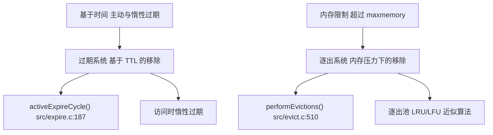
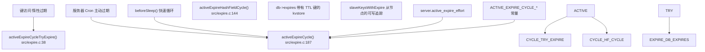
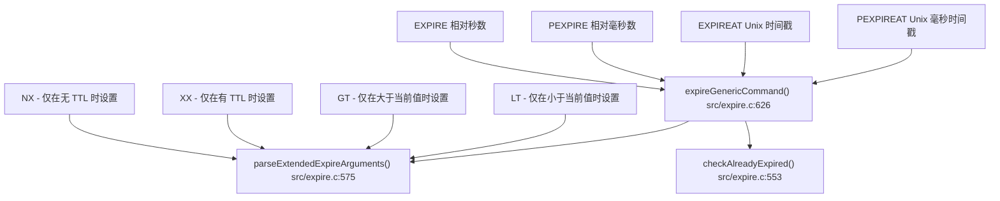
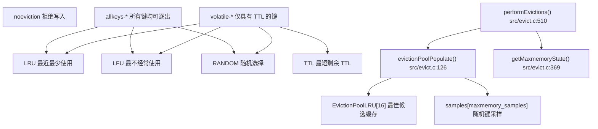
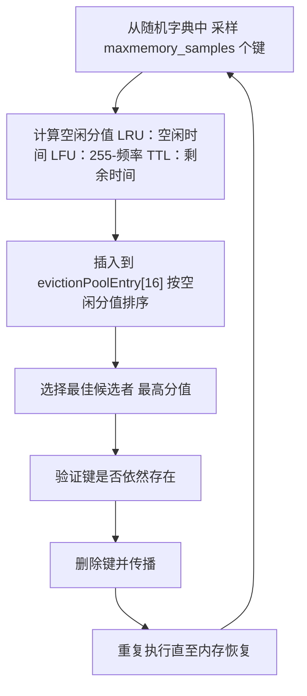
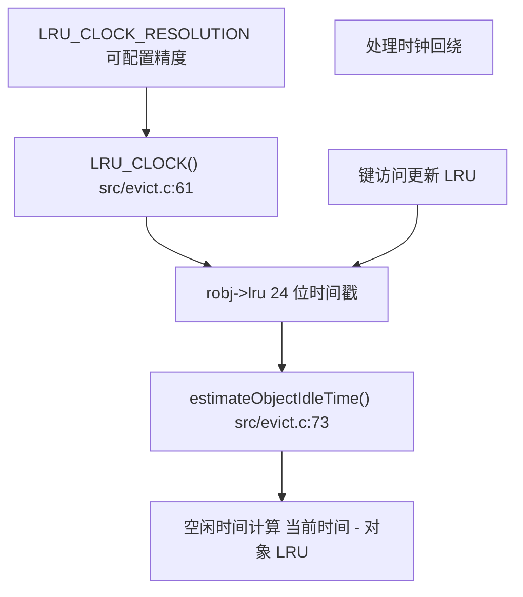
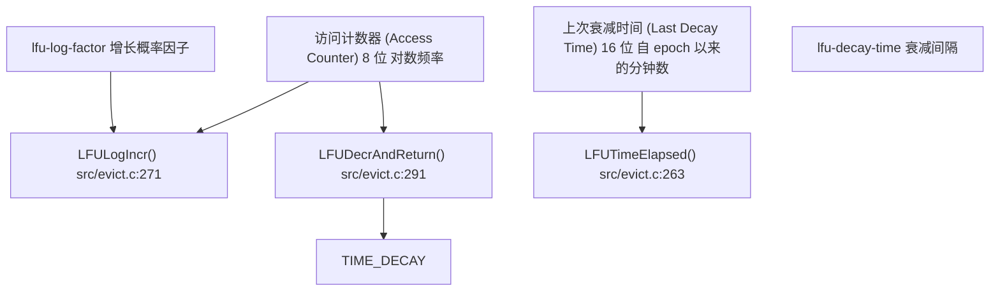
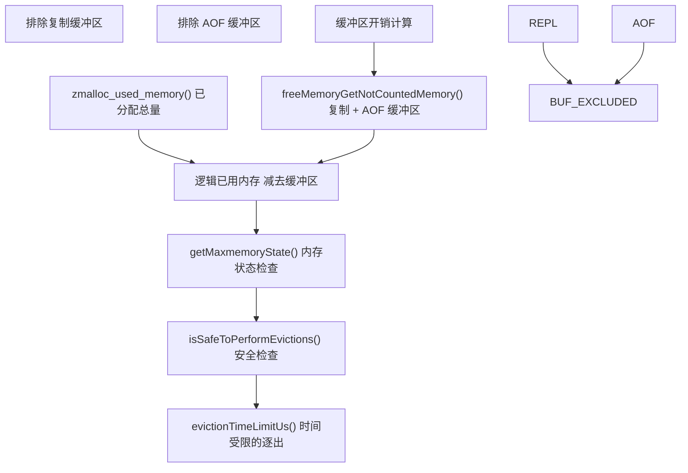

# 逐出与过期策略

相关源文件

-   [src/evict.c](https://github.com/redis/redis/blob/8ad54215/src/evict.c)
-   [src/expire.c](https://github.com/redis/redis/blob/8ad54215/src/expire.c)
-   [tests/unit/expire.tcl](https://github.com/redis/redis/blob/8ad54215/tests/unit/expire.tcl)
-   [tests/unit/maxmemory.tcl](https://github.com/redis/redis/blob/8ad54215/tests/unit/maxmemory.tcl)

本文涵盖了 Redis 用于从数据库中自动移除键的内存管理机制。Redis 提供了两个互补的系统：针对具有生存时间 (TTL) 值的键的**过期 (expiration)** 系统，以及用于在超过内存限制时管理内存使用的**逐出 (eviction)** 系统。

有关通用内存分配和管理的信息，请参阅[内存分配器与构建系统](/redis/redis/4.2-memory-allocators-and-build-system)。有关支持这些策略的数据结构实现的详细信息，请参阅[字典与键值存储](/redis/redis/3.5-dictionary-and-key-value-store)。

## 概览

Redis 实现了两种不同但互补的键移除机制，以管理内存使用和数据生命周期：



**来源：** [src/expire.c1-552](https://github.com/redis/redis/blob/8ad54215/src/expire.c#L1-L552) [src/evict.c1-736](https://github.com/redis/redis/blob/8ad54215/src/evict.c#L1-L736)

## 过期系统架构

过期系统通过主动和被动机制管理具有 TTL 值的键：



**来源：** [src/expire.c187-408](https://github.com/redis/redis/blob/8ad54215/src/expire.c#L187-L408) [src/expire.c38-51](https://github.com/redis/redis/blob/8ad54215/src/expire.c#L38-L51) [src/expire.c144-185](https://github.com/redis/redis/blob/8ad54215/src/expire.c#L144-L185)

### 主动过期循环

`activeExpireCycle()` 函数实现了 Redis 的主动键过期功能，具有两种模式：

| 模式 | 触发时机 | 时长限制 | 目的 |
| --- | --- | --- | --- |
| `ACTIVE_EXPIRE_CYCLE_FAST` | `beforeSleep()` | 1000μs | 命令之间的快速清理 |
| `ACTIVE_EXPIRE_CYCLE_SLOW` | 服务器 Cron | 25% CPU 时间 | 彻底的定期清理 |

该循环根据 `server.active_expire_effort` 配置（1-10 级）使用自适应采样，以平衡 CPU 使用率与过期彻底性。

**来源：** [src/expire.c187-408](https://github.com/redis/redis/blob/8ad54215/src/expire.c#L187-L408) [src/expire.c92-98](https://github.com/redis/redis/blob/8ad54215/src/expire.c#L92-L98)

### TTL 命令实现

Redis 提供了多个用于设置 TTL 的命令，均通过 `expireGenericCommand()` 实现：



**来源：** [src/expire.c626-742](https://github.com/redis/redis/blob/8ad54215/src/expire.c#L626-L742) [src/expire.c575-611](https://github.com/redis/redis/blob/8ad54215/src/expire.c#L575-L611) [src/expire.c553-561](https://github.com/redis/redis/blob/8ad54215/src/expire.c#L553-L561)

## 逐出系统架构

当内存使用量超过 `maxmemory` 限制时，逐出系统激活，实施各种策略选择要移除的键：



**来源：** [src/evict.c510-735](https://github.com/redis/redis/blob/8ad54215/src/evict.c#L510-L735) [src/evict.c126-215](https://github.com/redis/redis/blob/8ad54215/src/evict.c#L126-L215) [src/evict.c369-405](https://github.com/redis/redis/blob/8ad54215/src/evict.c#L369-L405)

### 逐出池算法

Redis 为 LRU/LFU 逐出使用近似算法，以避免维护精确顺序带来的开销：



逐出池结构体在多次采样轮次中维护最佳候选者：

```c
struct evictionPoolEntry {
    unsigned long long idle;    /* 逐出优先级分值 */
    sds key;                   /* 键名 */
    sds cached;               /* 缓存的 SDS 以提高效率 */
    int dbid;                 /* 数据库 ID */
    int slot;                 /* 哈希槽 */
};
```

**来源：** [src/evict.c36-42](https://github.com/redis/redis/blob/8ad54215/src/evict.c#L36-L42) [src/evict.c126-215](https://github.com/redis/redis/blob/8ad54215/src/evict.c#L126-L215) [src/evict.c83-101](https://github.com/redis/redis/blob/8ad54215/src/evict.c#L83-L101)

## LRU 与 LFU 实现

### LRU 时钟系统

Redis 使用一个低精度的全局时钟实现 LRU 追踪，以最小化内存开销：



**来源：** [src/evict.c53-81](https://github.com/redis/redis/blob/8ad54215/src/evict.c#L53-L81)

### LFU 位字段布局

LFU 实现将 24 位的 `lru` 字段拆分为两个组件：



对数计数器提供概率性的频率追踪，随着频率越高，增长难度越大，从而防止计数器饱和。

**来源：** [src/evict.c218-298](https://github.com/redis/redis/blob/8ad54215/src/evict.c#L218-L298) [src/evict.c271-279](https://github.com/redis/redis/blob/8ad54215/src/evict.c#L271-L279) [src/evict.c291-298](https://github.com/redis/redis/blob/8ad54215/src/evict.c#L291-L298)

## 内存管理集成

### 内存计量

逐出系统仔细计量不同类型的内存，以避免反馈循环：



**来源：** [src/evict.c308-343](https://github.com/redis/redis/blob/8ad54215/src/evict.c#L308-L343) [src/evict.c369-405](https://github.com/redis/redis/blob/8ad54215/src/evict.c#L369-L405) [src/evict.c453-466](https://github.com/redis/redis/blob/8ad54215/src/evict.c#L453-L466)

### 逐出时间限制

Redis 使用 `maxmemory-eviction-tenacity` 配置限制逐出时间，以防止阻塞服务器：

| 韧性 (Tenacity) | 时间限制 | 行为 |
| --- | --- | --- |
| 0-10 | 0-500μs | 线性增长 |
| 11-99 | 500μs-2分钟 | 几何增长 (15%) |
| 100 | 无限制 | 无时间限制 |

**来源：** [src/evict.c468-484](https://github.com/redis/redis/blob/8ad54215/src/evict.c#L468-L484)

## 配置参数

### 过期配置

| 参数 | 默认值 | 描述 |
| --- | --- | --- |
| `active-expire-effort` | 1 | 过期激进程度 (1-10) |
| `hz` | 10 | 服务器 Cron 频率 |

### 逐出配置

| 参数 | 默认值 | 描述 |
| --- | --- | --- |
| `maxmemory` | 0 | 内存上限 (0 = 无限制) |
| `maxmemory-policy` | `noeviction` | 逐出策略 |
| `maxmemory-samples` | 5 | 逐出时的采样键数 |
| `maxmemory-eviction-tenacity` | 10 | 逐出时间控制 |
| `lfu-log-factor` | 10 | LFU 增长概率因子 |
| `lfu-decay-time` | 1 | LFU 衰减间隔 (分钟) |

**来源：** [src/evict.c34](https://github.com/redis/redis/blob/8ad54215/src/evict.c#L34-L34) [src/expire.c93-97](https://github.com/redis/redis/blob/8ad54215/src/expire.c#L93-L97) [tests/unit/maxmemory.tcl152-183](https://github.com/redis/redis/blob/8ad54215/tests/unit/maxmemory.tcl#L152-L183)
