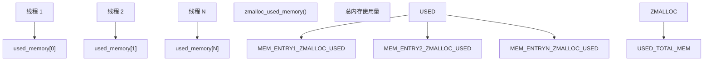
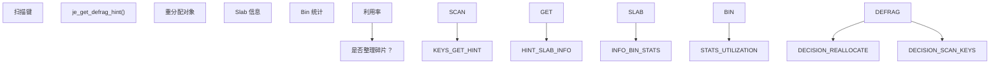

# 内存分配器与构建系统

相关源文件

-   [deps/jemalloc/include/jemalloc/internal/jemalloc\_internal\_externs.h](https://github.com/redis/redis/blob/8ad54215/deps/jemalloc/include/jemalloc/internal/jemalloc_internal_externs.h)
-   [deps/jemalloc/include/jemalloc/internal/jemalloc\_internal\_inlines\_c.h](https://github.com/redis/redis/blob/8ad54215/deps/jemalloc/include/jemalloc/internal/jemalloc_internal_inlines_c.h)
-   [deps/jemalloc/include/jemalloc/jemalloc\_macros.h.in](https://github.com/redis/redis/blob/8ad54215/deps/jemalloc/include/jemalloc/jemalloc_macros.h.in)
-   [deps/jemalloc/src/jemalloc.c](https://github.com/redis/redis/blob/8ad54215/deps/jemalloc/src/jemalloc.c)
-   [deps/jemalloc/src/jemalloc\_cpp.cpp](https://github.com/redis/redis/blob/8ad54215/deps/jemalloc/src/jemalloc_cpp.cpp)
-   [src/Makefile](https://github.com/redis/redis/blob/8ad54215/src/Makefile)
-   [src/config.h](https://github.com/redis/redis/blob/8ad54215/src/config.h)
-   [src/zmalloc.c](https://github.com/redis/redis/blob/8ad54215/src/zmalloc.c)
-   [src/zmalloc.h](https://github.com/redis/redis/blob/8ad54215/src/zmalloc.h)

本文涵盖了 Redis 的内存分配器抽象层，以及构建系统在选择和配置内存分配器中的作用。重点介绍了 `zmalloc` 抽象层，它在不同的底层分配器（jemalloc、tcmalloc、libc malloc）之上提供了一个统一的接口；以及构建系统如何根据平台、配置和运行时要求来确定使用哪个分配器。

有关内存逐出策略和 TTL 管理的信息，请参阅[逐出与过期策略](/redis/redis/4.1-eviction-and-expiration-policies)。有关更广泛的构建系统主题（包括依赖管理），请参阅[构建系统与依赖](/redis/redis/10.1-build-system-and-dependencies)。

## 分配器抽象架构

Redis 使用一个名为 `zmalloc` 的内存分配器抽象层，无论底层的内存分配器是什么，它都提供一个一致的接口。这种抽象使 Redis 能够使用不同的分配器，同时保持统一的内存追踪和调试能力。

### 分配器选择架构

```mermaid
flowchart TD
    MAKEFILE["Makefile"]
    CONFIG_H["config.h"]
    PLATFORM_DETECT["平台检测"]
    ZMALLOC_H["zmalloc.h"]
    ZMALLOC_C["zmalloc.c"]
    MEMORY_TRACKING["内存追踪"]
    JEMALLOC["jemalloc"]
    TCMALLOC["tcmalloc"]
    LIBC_MALLOC["libc malloc"]
    REDIS_SERVER["redis-server"]
    DATA_STRUCTURES["数据结构"]
    PERSISTENCE["持久化"]

    MAKEFILE --> ZMALLOC_C
    CONFIG --> H_ZMALLOC_H
    PLATFORM --> DETECT_MAKEFILE
    ZMALLOC --> C_JEMALLOC
    ZMALLOC --> C_TCMALLOC
    ZMALLOC --> C_LIBC_MALLOC
    REDIS --> SERVER_ZMALLOC_H
    DATA --> STRUCTURES_ZMALLOC_H
    PERSISTENCE --> ZMALLOC_H
    MEMORY --> TRACKING_ZMALLOC_C
```

**来源：** [src/Makefile79-106](https://github.com/redis/redis/blob/8ad54215/src/Makefile#L79-L106) [src/zmalloc.h18-88](https://github.com/redis/redis/blob/8ad54215/src/zmalloc.h#L18-L88) [src/zmalloc.c56-80](https://github.com/redis/redis/blob/8ad54215/src/zmalloc.c#L56-L80)

### 构建时分配器选择

构建系统使用分层方法来确定使用哪个内存分配器：

```mermaid
flowchart TD
    START["构建开始"]
    PLATFORM_CHECK["平台检查"]
    JEMALLOC_DEFAULT["MALLOC=jemalloc (默认)"]
    LIBC_DEFAULT["MALLOC=libc (默认)"]
    ENV_OVERRIDE["环境变量覆盖？"]
    TCMALLOC_SET["MALLOC=tcmalloc"]
    TCMALLOC_MIN["MALLOC=tcmalloc_minimal"]
    JEMALLOC_SET["MALLOC=jemalloc"]
    LIBC_SET["MALLOC=libc"]
    SANITIZER_CHECK["是否启用 Sanitizer？"]
    FINAL_CONFIG["最终配置"]
    FORCE_LIBC["MALLOC=libc (强制)"]
    COMPILE_FLAGS["设置编译器标志"]

    START --> PLATFORM_CHECK
    PLATFORM --> CHECK_JEMALLOC_DEFAULT
    PLATFORM --> CHECK_LIBC_DEFAULT
    JEMALLOC --> DEFAULT_ENV_OVERRIDE
    LIBC --> DEFAULT_ENV_OVERRIDE
    ENV --> OVERRIDE_TCMALLOC_SET
    ENV --> OVERRIDE_TCMALLOC_MIN
    ENV --> OVERRIDE_JEMALLOC_SET
    ENV --> OVERRIDE_LIBC_SET
    ENV --> OVERRIDE_SANITIZER_CHECK
    TCMALLOC --> SET_FINAL_CONFIG
    TCMALLOC --> MIN_FINAL_CONFIG
    JEMALLOC --> SET_FINAL_CONFIG
    LIBC --> SET_FINAL_CONFIG
    SANITIZER --> CHECK_FORCE_LIBC
    SANITIZER --> CHECK_FINAL_CONFIG
    FORCE --> LIBC_FINAL_CONFIG
    FINAL --> CONFIG_COMPILE_FLAGS
```

**来源：** [src/Makefile79-138](https://github.com/redis/redis/blob/8ad54215/src/Makefile#L79-L138)

## 内存分配器类型与配置

Redis 支持三类主要内存分配器，每一类都有不同的特性和使用场景：

| 分配器 | 宏定义 | 库文件 | 使用场景 | 内存追踪方式 |
| --- | --- | --- | --- | --- |
| jemalloc | `USE_JEMALLOC` | `deps/jemalloc/lib/libjemalloc.a` | 生产环境 (Linux 默认) | 通过 `je_malloc_usable_size` 的原生追踪 |
| tcmalloc | `USE_TCMALLOC` | `-ltcmalloc` | Google 相关环境 | 通过 `tc_malloc_size` 的原生追踪 |
| tcmalloc\_minimal | `USE_TCMALLOC` | `-ltcmalloc_minimal` | 极低开销场景 | 通过 `tc_malloc_size` 的原生追踪 |
| libc | 默认 | 系统 malloc | 开发、Sanitizer 调试 | 通过前缀存储的手动追踪 |

**来源：** [src/Makefile282-296](https://github.com/redis/redis/blob/8ad54215/src/Makefile#L282-L296) [src/zmalloc.h18-74](https://github.com/redis/redis/blob/8ad54215/src/zmalloc.h#L18-L74)

### jemalloc 集成

Redis 使用经过修改的 jemalloc 版本，并包含了 Redis 特定的增强功能：

```mermaid
flowchart TD
    JE_MALLOC["je_malloc()"]
    TCACHE["线程缓存 (TCACHE)"]
    JE_FREE["je_free()"]
    ARENAS["Arenas (分配区)"]
    DEFRAG_HINT["je_get_defrag_hint() 碎片整理提示"]
    ALLOC_USIZE["je_*_with_usize()"]
    BG_THREADS["后台线程"]
    ARENA_STATS["逐 Arena 统计"]
    ZMALLOC_DEFRAG["主动碎片整理"]
    ZMALLOC_STATS["内存统计"]
    ZMALLOC_PURGE["内存清除 (Purge)"]

    DEFRAG --> HINT_ZMALLOC_DEFRAG
    ALLOC --> USIZE_ZMALLOC_STATS
    BG --> THREADS_ZMALLOC_PURGE
    ARENA --> STATS_ZMALLOC_STATS
    JE --> MALLOC_TCACHE
    JE --> FREE_TCACHE
    TCACHE --> ARENAS
```

**来源：** [deps/jemalloc/include/jemalloc/jemalloc\_macros.h.in153-156](https://github.com/redis/redis/blob/8ad54215/deps/jemalloc/include/jemalloc/jemalloc_macros.h.in#L153-L156) [src/zmalloc.c730-944](https://github.com/redis/redis/blob/8ad54215/src/zmalloc.c#L730-L944)

## 运行时内存追踪

`zmalloc` 抽象层在所有受支持的分配器上提供线程安全的内存使用追踪：

### 线程本地内存计量

**来源：** [src/zmalloc.c82-116](https://github.com/redis/redis/blob/8ad54215/src/zmalloc.c#L82-L116) [src/zmalloc.c503-516](https://github.com/redis/redis/blob/8ad54215/src/zmalloc.c#L503-L516)

### 内存分配流程

运行时的分配流程根据底层分配器的不同而有所差异，但遵循一致的模式：

```mermaid
flowchart TD
    ALLOC_REQUEST["分配请求"]
    SIZE_CHECK["大小是否 >= SIZE_MAX/2？"]
    RETURN_NULL["返回 NULL"]
    ALLOCATOR_TYPE["分配器类型"]
    JE_ALLOC["je_malloc()"]
    TC_ALLOC["tc_malloc()"]
    LIBC_ALLOC["malloc()"]
    JE_SIZE["je_malloc_usable_size()"]
    TC_SIZE["tc_malloc_size()"]
    PREFIX_STORE["在头部 (prefix) 存储大小"]
    UPDATE_STATS["update_zmalloc_stat_alloc() 更新统计"]
    THREAD_INDEX["获取线程索引"]
    ATOMIC_INCR["原子增加 used_memory[]"]
    RETURN_PTR["返回指针"]

    ALLOC --> REQUEST_SIZE_CHECK
    SIZE --> CHECK_RETURN_NULL
    SIZE --> CHECK_ALLOCATOR_TYPE
    ALLOCATOR --> TYPE_JE_ALLOC
    ALLOCATOR --> TYPE_TC_ALLOC
    ALLOCATOR --> TYPE_LIBC_ALLOC
    JE --> ALLOC_JE_SIZE
    TC --> ALLOC_TC_SIZE
    LIBC --> ALLOC_PREFIX_STORE
    JE --> SIZE_UPDATE_STATS
    TC --> SIZE_UPDATE_STATS
    PREFIX --> STORE_UPDATE_STATS
    UPDATE --> STATS_THREAD_INDEX
    THREAD --> INDEX_ATOMIC_INCR
    ATOMIC --> INCR_RETURN_PTR
```

**来源：** [src/zmalloc.c129-154](https://github.com/redis/redis/blob/8ad54215/src/zmalloc.c#L129-L154) [src/zmalloc.c101-109](https://github.com/redis/redis/blob/8ad54215/src/zmalloc.c#L101-L109)

## 构建配置选项

### Sanitizer 兼容性

当启用 Sanitizer 时，Redis 会自动强制使用 libc malloc 以避免冲突：

| Sanitizer | 配置参数 | 分配器覆盖 | 额外标志 |
| --- | --- | --- | --- |
| 地址 Sanitizer | `SANITIZER=address` | `MALLOC=libc` | `-fsanitize=address` |
| 未定义行为 Sanitizer | `SANITIZER=undefined` | `MALLOC=libc` | `-fsanitize=undefined` |
| 线程 Sanitizer | `SANITIZER=thread` | 无需覆盖 | `-fsanitize=thread` |
| 内存 Sanitizer | `SANITIZER=memory` | `MALLOC=libc` | `-fsanitize=memory` |

**来源：** [src/Makefile107-138](https://github.com/redis/redis/blob/8ad54215/src/Makefile#L107-L138)

### 平台特定优化

构建系统会应用平台特定的优化和权宜方案：

**来源：** [src/config.h44-336](https://github.com/redis/redis/blob/8ad54215/src/config.h#L44-L336)

## 高级内存管理特性

### 主动碎片整理支持

当使用 jemalloc 时，Redis 可以利用特定于分配器的提示执行主动碎片整理：

**来源：** [deps/jemalloc/include/jemalloc/internal/jemalloc\_internal\_inlines\_c.h342-391](https://github.com/redis/redis/blob/8ad54215/deps/jemalloc/include/jemalloc/internal/jemalloc_internal_inlines_c.h#L342-L391) [src/zmalloc.h79-81](https://github.com/redis/redis/blob/8ad54215/src/zmalloc.h#L79-L81)

### 内存统计集成

分配器抽象层提供了用于监控的详细内存统计信息：

| 统计指标 | jemalloc 来源 | 用途 |
| --- | --- | --- |
| `allocated` (已分配) | `stats.allocated` | 总已分配字节数 |
| `active` (活动) | `stats.active` | 活动内存页 |
| `resident` (常驻) | `stats.resident` | 常驻内存 (RSS) |
| `retained` (保留) | `stats.retained` | 保留的虚拟内存 |
| `muzzy` (模糊) | `stats.arenas.*.pmuzzy` | Muzzy 页 |
| `frag_smallbins_bytes` | 计算得出 | 小 bin 碎片 |

**来源：** [src/zmalloc.c799-845](https://github.com/redis/redis/blob/8ad54215/src/zmalloc.c#L799-L845)

这种内存分配器抽象使 Redis 能够在不同的环境中优化内存使用，同时保持一致的行为和全面的监控能力。
