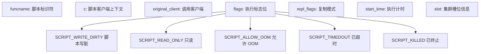

# 脚本与扩展

相关源文件

-   [runtest-moduleapi](https://github.com/redis/redis/blob/8ad54215/runtest-moduleapi)
-   [src/commands.c](https://github.com/redis/redis/blob/8ad54215/src/commands.c)
-   [src/eval.c](https://github.com/redis/redis/blob/8ad54215/src/eval.c)
-   [src/function\_lua.c](https://github.com/redis/redis/blob/8ad54215/src/function_lua.c)
-   [src/functions.c](https://github.com/redis/redis/blob/8ad54215/src/functions.c)
-   [src/functions.h](https://github.com/redis/redis/blob/8ad54215/src/functions.h)
-   [src/redismodule.h](https://github.com/redis/redis/blob/8ad54215/src/redismodule.h)
-   [src/script.c](https://github.com/redis/redis/blob/8ad54215/src/script.c)
-   [src/script.h](https://github.com/redis/redis/blob/8ad54215/src/script.h)
-   [src/script\_lua.c](https://github.com/redis/redis/blob/8ad54215/src/script_lua.c)
-   [src/script\_lua.h](https://github.com/redis/redis/blob/8ad54215/src/script_lua.h)
-   [tests/modules/Makefile](https://github.com/redis/redis/blob/8ad54215/tests/modules/Makefile)
-   [tests/modules/misc.c](https://github.com/redis/redis/blob/8ad54215/tests/modules/misc.c)
-   [tests/unit/functions.tcl](https://github.com/redis/redis/blob/8ad54215/tests/unit/functions.tcl)
-   [tests/unit/moduleapi/misc.tcl](https://github.com/redis/redis/blob/8ad54215/tests/unit/moduleapi/misc.tcl)
-   [tests/unit/scripting.tcl](https://github.com/redis/redis/blob/8ad54215/tests/unit/scripting.tcl)

Redis 提供了多种机制，通过脚本编写和可加载扩展来扩展其在内置命令之外的功能。本文档涵盖了三种主要的扩展机制：通过 EVAL 命令实现的 Lua 脚本、Redis 函数（Redis Functions）以及 Redis 模块 API（Redis Module API）。

有关 Lua 脚本和 Redis 函数实现的详细信息，请参阅 [Lua 脚本与 Redis 函数](/redis/redis/5.1-lua-scripting-and-redis-functions)。有关模块开发和 C API，请参阅 [Redis 模块 API](/redis/redis/5.2-redis-module-api)。

## 总体架构

Redis 脚本和扩展围绕分层架构构建，在提供隔离性、安全性和性能的同时，保持与 Redis 单线程执行模型的一致性。

### 扩展机制概览

```mermaid
flowchart TD
    EVAL["EVAL/EVALSHA 命令"]
    FCALL["FCALL/FCALL_RO 命令"]
    MODULE_CMD["模块命令"]
    SCRIPT_CTX["scriptRunCtx"]
    SCRIPT_CORE["script.c 核心"]
    SCRIPT_LUA["script_lua.c 共享层"]
    EVAL_ENGINE["eval.c 旧版引擎"]
    FUNC_ENGINE["function_lua.c 函数引擎"]
    REDIS_API["Redis 命令 API"]
    MODULE_API["RedisModule API"]
    COMMANDS["命令处理"]
    DB["数据库操作"]
    NETWORKING["客户端管理"]

    EVAL --> EVAL_ENGINE
    FCALL --> FUNC_ENGINE
    MODULE --> CMD_MODULE_API
    EVAL --> ENGINE_SCRIPT_LUA
    FUNC --> ENGINE_SCRIPT_LUA
    SCRIPT --> LUA_SCRIPT_CORE
    SCRIPT --> CORE_SCRIPT_CTX
    MODULE --> API_COMMANDS
    REDIS --> API_COMMANDS
    SCRIPT --> CTX_COMMANDS
    COMMANDS --> DB
    COMMANDS --> NETWORKING
```

**来源：** [src/script.h48-59](https://github.com/redis/redis/blob/8ad54215/src/script.h#L48-L59) [src/functions.h37-74](https://github.com/redis/redis/blob/8ad54215/src/functions.h#L37-L74) [src/redismodule.h10-12](https://github.com/redis/redis/blob/8ad54215/src/redismodule.h#L10-L12)

### 脚本执行上下文

`scriptRunCtx` 结构为所有脚本执行提供了基础，管理安全性、资源限制和 Redis 交互：

**来源：** [src/script.h48-59](https://github.com/redis/redis/blob/8ad54215/src/script.h#L48-L59) [src/script.h40-47](https://github.com/redis/redis/blob/8ad54215/src/script.h#L40-L47)

## 扩展机制

Redis 支持三种主要的扩展机制，每种机制针对不同的用例设计，并提供不同级别的集成。

| 机制 | 命令 | 引擎 | 用例 | 持久性 |
| --- | --- | --- | --- | --- |
| 旧版 Lua 脚本 | `EVAL`, `EVALSHA` | Lua 5.1 | 临时脚本编写 | 脚本缓存 |
| Redis 函数 | `FCALL`, `FCALL_RO` | Lua 5.1 | 持久化服务器端函数 | RDB/AOF |
| Redis 模块 | 自定义命令 | C API | 系统扩展 | 模块加载 |

**来源：** [src/eval.c294-317](https://github.com/redis/redis/blob/8ad54215/src/eval.c#L294-L317) [src/functions.c31-41](https://github.com/redis/redis/blob/8ad54215/src/functions.c#L31-L41) [src/redismodule.h858-904](https://github.com/redis/redis/blob/8ad54215/src/redismodule.h#L858-L904)

### Lua 脚本 (EVAL/EVALSHA)

Redis 最初的脚本机制，提供即时的脚本执行，并基于 SHA1 哈希值进行自动缓存：

```mermaid
flowchart TD
    EVAL_CMD["EVAL 命令"]
    SHA_CALC["计算 SHA1"]
    CACHE_CHECK["检查脚本缓存"]
    CACHED_FUNC["执行已缓存脚本"]
    COMPILE["编译 Lua 代码"]
    CACHE_STORE["存入缓存"]
    EXECUTE["执行脚本"]
    SCRIPT_EXEC["脚本执行上下文"]
    EVALSHA_CMD["EVALSHA 命令"]
    DIRECT_CACHE["直接查询缓存"]
    ERROR["NOSCRIPT 错误"]

    EVAL --> CMD_SHA_CALC
    SHA --> CALC_CACHE_CHECK
    CACHE --> CHECK_CACHED_FUNC
    CACHE --> CHECK_COMPILE
    COMPILE --> CACHE_STORE
    CACHE --> STORE_EXECUTE
    CACHED --> FUNC_SCRIPT_EXEC
    EXECUTE --> SCRIPT_EXEC
    EVALSHA --> CMD_DIRECT_CACHE
    DIRECT --> CACHE_CACHED_FUNC
    DIRECT --> CACHE_ERROR
```

**来源：** [src/eval.c296-317](https://github.com/redis/redis/blob/8ad54215/src/eval.c#L296-L317) [src/eval.c470-501](https://github.com/redis/redis/blob/8ad54215/src/eval.c#L470-L501)

### Redis 函数 (Redis Functions)

较新的函数 API 提供了持久化的命名函数，并具有库 (library) 组织形式：

```mermaid
flowchart TD
    FUNC_LOAD["FUNCTION LOAD"]
    PARSE_LIB["解析库代码"]
    CREATE_LIB["创建 functionLibInfo"]
    REGISTER_FUNCS["注册函数"]
    PERSIST["持久化到 RDB/AOF"]
    FCALL["FCALL 命令"]
    LOOKUP_FUNC["查找 functionInfo"]
    ENGINE_CALL["engine->call()"]
    LUA_EXEC["Lua 执行"]
    LIB_INFO["functionLibInfo"]
    FUNC_DICT["functions 字典"]
    ENGINE_INFO["engineInfo"]
    LIB_CODE["库代码"]

    FUNC --> LOAD_PARSE_LIB
    PARSE --> LIB_CREATE_LIB
    CREATE --> LIB_REGISTER_FUNCS
    REGISTER --> FUNCS_PERSIST
    FCALL --> LOOKUP_FUNC
    LOOKUP --> FUNC_ENGINE_CALL
    ENGINE --> CALL_LUA_EXEC
    CREATE --> LIB_LIB_INFO
    LIB --> INFO_FUNC_DICT
    LIB --> INFO_ENGINE_INFO
    LIB --> INFO_LIB_CODE
```

**来源：** [src/functions.c270-279](https://github.com/redis/redis/blob/8ad54215/src/functions.c#L270-L279) [src/functions.h95-102](https://github.com/redis/redis/blob/8ad54215/src/functions.h#L95-L102) [src/function\_lua.c147-170](https://github.com/redis/redis/blob/8ad54215/src/function_lua.c#L147-L170)

### 脚本安全与沙箱

两种 Lua 脚本机制都实现了全面的沙箱机制以确保脚本安全性：

```mermaid
flowchart TD
    GLOBALS["全局变量保护"]
    ALLOWLIST["函数允许列表"]
    READONLY["只读表"]
    TIMEOUT["执行超时"]
    MEMORY["内存限制"]
    OOM_CHECKS["OOM 检查"]
    EXECUTION_TIME["执行时间限制"]
    INTERRUPT["脚本中断"]
    ACL_CHECK["ACL 验证"]
    CLUSTER_CHECK["集群验证"]
    WRITE_CHECK["写权限检查"]
    REPLICATION["复制验证"]
    SCRIPT_INIT["脚本初始化"]
    RUNTIME_CHECK["运行时检查"]
    CMD_EXEC["命令执行"]

    GLOBALS --> SCRIPT_INIT
    ALLOWLIST --> SCRIPT_INIT
    READONLY --> SCRIPT_INIT
    MEMORY --> RUNTIME_CHECK
    OOM --> CHECKS_RUNTIME_CHECK
    EXECUTION --> TIME_INTERRUPT
    ACL --> CHECK_CMD_EXEC
    CLUSTER --> CHECK_CMD_EXEC
    WRITE --> CHECK_CMD_EXEC
    REPLICATION --> CMD_EXEC
```

**来源：** [src/script\_lua.c30-120](https://github.com/redis/redis/blob/8ad54215/src/script_lua.c#L30-L120) [src/script.c375-474](https://github.com/redis/redis/blob/8ad54215/src/script.c#L375-L474) [src/script.c126-155](https://github.com/redis/redis/blob/8ad54215/src/script.c#L126-L155)

### Redis 模块 API (Redis Module API)

模块 API 提供了一个 C 语言接口，用于创建原生 Redis 扩展，并可以完全访问 Redis 内部机制：

**来源：** [src/redismodule.h888-904](https://github.com/redis/redis/blob/8ad54215/src/redismodule.h#L888-L904) [src/redismodule.h1200-1500](https://github.com/redis/redis/blob/8ad54215/src/redismodule.h#L1200-L1500) [tests/modules/misc.c1-50](https://github.com/redis/redis/blob/8ad54215/tests/modules/misc.c#L1-L50)

## 命令处理集成

所有扩展机制都通过标准化接口与 Redis 的命令处理流水线集成：

| 组件 | Lua 脚本 | Redis 函数 | 模块 |
| --- | --- | --- | --- |
| 命令注册 | 动态 (`EVAL`) | 静态 (`FCALL`) | 静态 (`RedisModule_CreateCommand`) |
| 参数解析 | 内置 | 内置 | 手动 |
| ACL 集成 | 自动 | 自动 | 手动 |
| 集群支持 | 自动 | 自动 | 手动 |
| 复制支持 | 自动 | 自动 | 手动 |

**来源：** [src/script.c177-302](https://github.com/redis/redis/blob/8ad54215/src/script.c#L177-L302) [src/functions.c800-850](https://github.com/redis/redis/blob/8ad54215/src/functions.c#L800-L850) [src/redismodule.h950-1000](https://github.com/redis/redis/blob/8ad54215/src/redismodule.h#L950-L1000)

脚本与扩展系统为 Redis 提供了强大的可扩展性，同时保持了 Redis 所著称的性能、可靠性和一致性保证。每种机制都服务于不同的用例，从简单的数据转换到复杂的服务器端逻辑以及完整的系统扩展。
