# Redis 模块 API

相关源文件

-   [runtest-moduleapi](https://github.com/redis/redis/blob/8ad54215/runtest-moduleapi)
-   [src/redismodule.h](https://github.com/redis/redis/blob/8ad54215/src/redismodule.h)
-   [tests/modules/Makefile](https://github.com/redis/redis/blob/8ad54215/tests/modules/Makefile)
-   [tests/modules/misc.c](https://github.com/redis/redis/blob/8ad54215/tests/modules/misc.c)
-   [tests/unit/moduleapi/misc.tcl](https://github.com/redis/redis/blob/8ad54215/tests/unit/moduleapi/misc.tcl)

Redis 模块 API 提供了一个全面的接口，用于通过动态加载的模块扩展 Redis 功能。该 API 定义在 `redismodule.h` 中，通过结构化的函数接口公开 Redis 的核心能力，使模块能够安全地注册命令、管理内存、处理数据类型以及与 Redis 服务器交互。

API 围绕模块通过 `RedisModule_GetApi()` 获取的函数指针进行组织，在保持跨 Redis 版本二进制兼容性的同时，提供了对 Redis 内部机制的版本兼容访问。

## API 结构与组织

Redis 模块 API 被组织成 `redismodule.h` 中定义的全面函数接口。该 API 使用动态函数指针系统，模块在初始化时通过 `RedisModule_GetApi()` 获取函数地址。

### API 函数指针系统

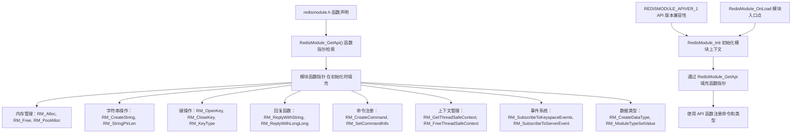

**来源：** [src/redismodule.h41-43](https://github.com/redis/redis/blob/8ad54215/src/redismodule.h#L41-L43) [src/redismodule.h888-904](https://github.com/redis/redis/blob/8ad54215/src/redismodule.h#L888-L904) [tests/modules/misc.c551-627](https://github.com/redis/redis/blob/8ad54215/tests/modules/misc.c#L551-L627)

API 提供了大约 300 多个按逻辑类别组织的函数。每个模块在初始化期间获取这些函数指针，确保了版本兼容性，并允许 Redis 在不同版本之间保持二进制兼容性。

## 核心 API 函数

Redis 模块 API 按功能类别组织，每个类别为模块开发提供特定的能力。API 使用一致的命名模式和返回值约定。

### 关键 API 函数类别

| API 类别 | 主要函数 | 目的 |
| --- | --- | --- |
| 内存管理 | `RedisModule_Alloc`, `RedisModule_Free`, `RedisModule_Calloc`, `RedisModule_TryAlloc`, `RedisModule_PoolAlloc` | Redis 感知的内存分配和池管理 |
| 字符串操作 | `RedisModule_CreateString`, `RedisModule_StringPtrLen`, `RedisModule_StringToLongLong`, `RedisModule_StringCompare` | 字符串的创建、转换和操作 |
| 键操作 | `RedisModule_OpenKey`, `RedisModule_CloseKey`, `RedisModule_KeyExists`, `RedisModule_KeyType`, `RedisModule_RandomKey` | 数据库键的访问、元数据和操作 |
| 回复函数 | `RedisModule_ReplyWithString`, `RedisModule_ReplyWithLongLong`, `RedisModule_ReplyWithArray`, `RedisModule_ReplyWithCallReply` | 客户端响应的生成和格式化 |
| 命令系统 | `RedisModule_CreateCommand`, `RedisModule_GetCommand`, `RedisModule_SetCommandInfo`, `RedisModule_CreateSubcommand` | 命令注册和元数据 |
| 上下文管理 | `RedisModule_GetThreadSafeContext`, `RedisModule_FreeThreadSafeContext`, `RedisModule_GetClientId` | 执行上下文和客户端信息 |
| 调用接口 | `RedisModule_Call`, `RedisModule_CallReplyType`, `RedisModule_FreeCallReply` | 命令间的执行和回复处理 |
| 事件系统 | `RedisModule_SubscribeToKeyspaceEvents`, `RedisModule_SubscribeToServerEvent`, `RedisModule_NotifyKeyspaceEvent` | 事件订阅和通知 |

**来源：** [src/redismodule.h33-100](https://github.com/redis/redis/blob/8ad54215/src/redismodule.h#L33-L100) [src/redismodule.h1000-1100](https://github.com/redis/redis/blob/8ad54215/src/redismodule.h#L1000-L1100) [tests/modules/misc.c60-92](https://github.com/redis/redis/blob/8ad54215/tests/modules/misc.c#L60-L92) [tests/modules/misc.c146-173](https://github.com/redis/redis/blob/8ad54215/tests/modules/misc.c#L146-L173)

### API 返回值约定

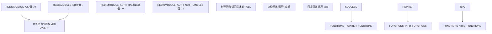

**来源：** [src/redismodule.h33-39](https://github.com/redis/redis/blob/8ad54215/src/redismodule.h#L33-L39) [tests/modules/misc.c554-627](https://github.com/redis/redis/blob/8ad54215/tests/modules/misc.c#L554-L627)

大多数 API 函数在成功时返回 `REDISMODULE_OK` (0)，在失败时返回 `REDISMODULE_ERR` (1)，在整个 API 中提供了连贯的错误处理。创建对象的函数通常返回指针或 NULL，而查询函数返回特定的数据类型。

## 函数注册与回调模式

Redis 模块通过回调函数注册功能，这些函数与 Redis 的命令处理和事件系统集成。API 为不同的集成点提供了几种回调类型。

### 命令函数注册

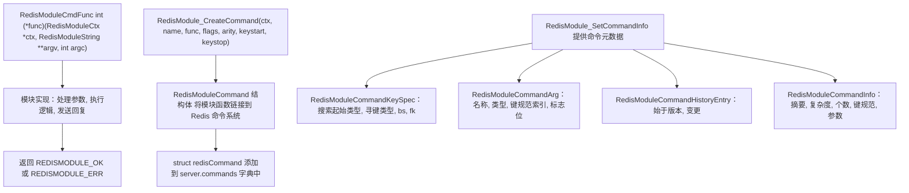

**来源：** [src/redismodule.h888-904](https://github.com/redis/redis/blob/8ad54215/src/redismodule.h#L888-L904) [src/redismodule.h380-480](https://github.com/redis/redis/blob/8ad54215/src/redismodule.h#L380-L480) [tests/modules/misc.c551-627](https://github.com/redis/redis/blob/8ad54215/tests/modules/misc.c#L551-L627) [tests/modules/misc.c60-92](https://github.com/redis/redis/blob/8ad54215/tests/modules/misc.c#L60-L92)

命令函数接收一个 `RedisModuleCtx`、参数数组 (`RedisModuleString **argv`) 和参数个数 (`int argc`)。它们必须在成功时返回 `REDISMODULE_OK`，在失败时返回 `REDISMODULE_ERR`。

### 事件回调注册

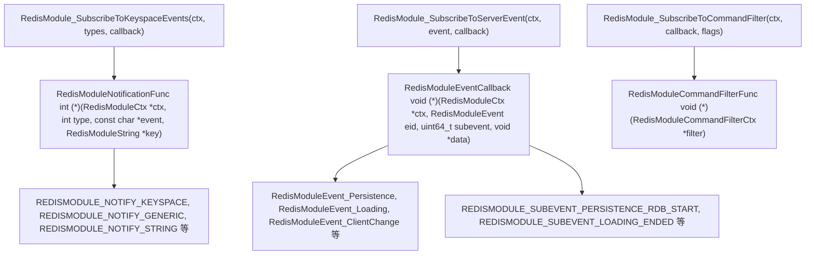

**来源：** [src/redismodule.h486-520](https://github.com/redis/redis/blob/8ad54215/src/redismodule.h#L486-L520) [src/redismodule.h547-621](https://github.com/redis/redis/blob/8ad54215/src/redismodule.h#L547-L621) [src/redismodule.h222-245](https://github.com/redis/redis/blob/8ad54215/src/redismodule.h#L222-L245) [tests/modules/misc.c13-20](https://github.com/redis/redis/blob/8ad54215/tests/modules/misc.c#L13-L20)

事件回调为模块提供了反应式能力，允许它们响应键空间更改、服务器事件和命令执行。每种回调类型都有特定的签名要求和返回值预期。

## 上下文管理与执行环境

`RedisModuleCtx` 结构作为模块与 Redis 之间的主要接口，提供了执行上下文、资源管理和 API 访问。理解上下文管理对于正确的模块开发至关重要。

### RedisModuleCtx 结构与用法

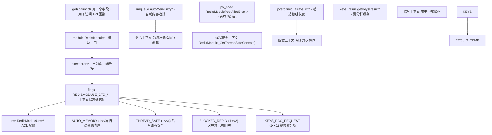

**来源：** [src/redismodule.h888](https://github.com/redis/redis/blob/8ad54215/src/redismodule.h#L888-L888) [tests/modules/misc.c352-374](https://github.com/redis/redis/blob/8ad54215/tests/modules/misc.c#L352-L374) [tests/modules/misc.c287-329](https://github.com/redis/redis/blob/8ad54215/tests/modules/misc.c#L287-L329)

上下文既提供了执行环境也提供了资源管理。`getapifuncptr` 字段必须位于首位，以启用模块使用的基于宏的 API 函数查找系统。

### 上下文生命周期与内存管理

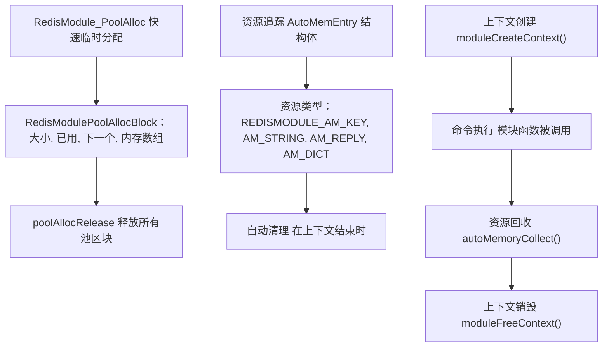

**来源：** [tests/modules/misc.c506-525](https://github.com/redis/redis/blob/8ad54215/tests/modules/misc.c#L506-L525) [src/redismodule.h1000-1100](https://github.com/redis/redis/blob/8ad54215/src/redismodule.h#L1000-L1100)

上下文管理通过自动内存追踪和池分配系统确保了正确的资源清理，防止模块操作中的内存泄漏。

## 内存管理 API

Redis 模块 API 提供了精密的内存管理能力，并集成了 Redis 的内存追踪和管理系统。理解不同的分配策略对于构建高效模块至关重要。

### 内存分配函数

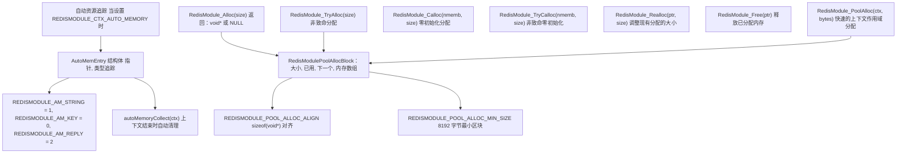

**来源：** [src/redismodule.h1000-1100](https://github.com/redis/redis/blob/8ad54215/src/redismodule.h#L1000-L1100) [tests/modules/misc.c506-525](https://github.com/redis/redis/blob/8ad54215/tests/modules/misc.c#L506-L525)

API 既提供了标准的堆分配，也为临时对象提供了高效的池分配。池分配对于命令作用域的分配特别有用，这些分配在命令完成时会被自动释放。

### 内存管理策略

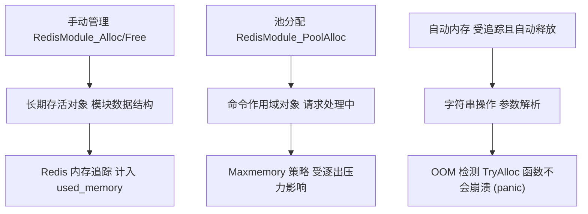

**来源：** [tests/modules/misc.c506-525](https://github.com/redis/redis/blob/8ad54215/tests/modules/misc.c#L506-L525) [src/redismodule.h510-590](https://github.com/redis/redis/blob/8ad54215/src/redismodule.h#L510-L590)

模块内存分配集成了 Redis 的内存管理系统，计入 `used_memory` 统计数据，并受 maxmemory 策略和 OOM 检测的影响。

## 错误处理与调试

Redis 模块 API 提供了全面的错误处理机制和调试能力，帮助开发人员构建健壮的模块。

### 错误报告与返回值

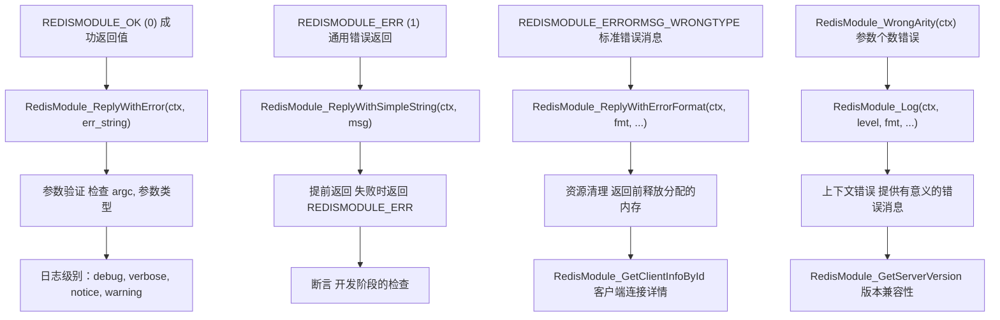

**来源：** [src/redismodule.h33-39](https://github.com/redis/redis/blob/8ad54215/src/redismodule.h#L33-L39) [src/redismodule.h251-276](https://github.com/redis/redis/blob/8ad54215/src/redismodule.h#L251-L276) [tests/modules/misc.c22-35](https://github.com/redis/redis/blob/8ad54215/tests/modules/misc.c#L22-L35) [tests/modules/misc.c331-350](https://github.com/redis/redis/blob/8ad54215/tests/modules/misc.c#L331-L350)

模块应始终如一地使用 `REDISMODULE_OK` 和 `REDISMODULE_ERR` 返回值，通过回复函数提供有意义的错误消息，并使用日志记录进行调试。

### 常见错误处理模式

```c
// 来自 misc.c 的错误处理模式示例
int test_keyexists(RedisModuleCtx *ctx, RedisModuleString **argv, int argc) {
    if (argc < 2) return RedisModule_WrongArity(ctx);  // 验证参数

    RedisModuleString *key = argv[1];
    int exists = RedisModule_KeyExists(ctx, key);
    return RedisModule_ReplyWithBool(ctx, exists);      // 始终发送回复
}

// 带有清理流程的错误处理模式
int test_getlru(RedisModuleCtx *ctx, RedisModuleString **argv, int argc) {
    if (argc < 2) {
        RedisModule_WrongArity(ctx);
        return REDISMODULE_OK;  // WrongArity 会发送回复
    }

    RedisModuleKey *key = open_key_or_reply(ctx, argv[1], REDISMODULE_READ);
    if (!key) return REDISMODULE_OK;  // open_key_or_reply 已发送错误回复

    mstime_t lru;
    RedisModule_GetLRU(key, &lru);
    RedisModule_ReplyWithLongLong(ctx, lru);
    RedisModule_CloseKey(key);  // 务必清理资源
    return REDISMODULE_OK;
}
```

**来源：** [tests/modules/misc.c174-179](https://github.com/redis/redis/blob/8ad54215/tests/modules/misc.c#L174-L179) [tests/modules/misc.c190-202](https://github.com/redis/redis/blob/8ad54215/tests/modules/misc.c#L190-L202) [tests/modules/misc.c181-188](https://github.com/redis/redis/blob/8ad54215/tests/modules/misc.c#L181-L188)

## API 测试与开发

Redis 提供了专门为模块 API 开发和验证而设计的全面测试基础设施和开发工具。

### 模块测试框架

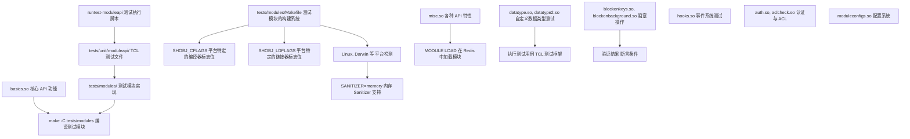

**来源：** [tests/modules/Makefile1-105](https://github.com/redis/redis/blob/8ad54215/tests/modules/Makefile#L1-L105) [runtest-moduleapi1-63](https://github.com/redis/redis/blob/8ad54215/runtest-moduleapi#L1-L63) [tests/unit/moduleapi/misc.tcl1-10](https://github.com/redis/redis/blob/8ad54215/tests/unit/moduleapi/misc.tcl#L1-L10)

测试框架提供了 40 多个测试模块，涵盖了模块 API 的各个方面，从基础功能到阻塞操作和自定义数据类型等高级特性。

### API 开发模式

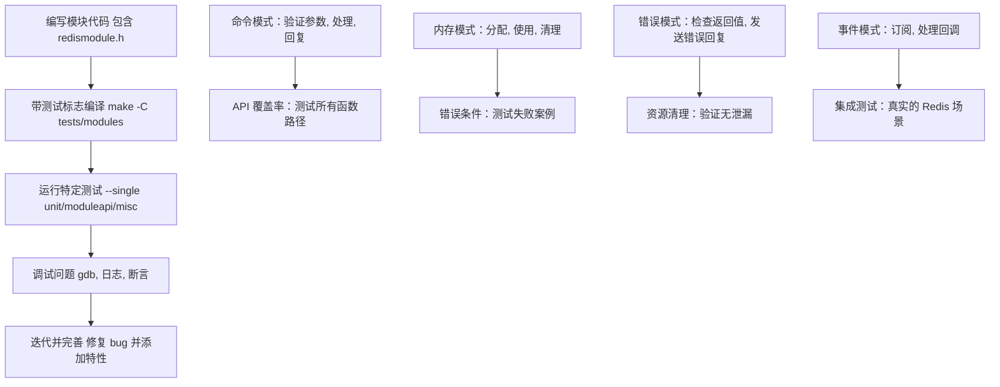

**来源：** [tests/modules/misc.c551-627](https://github.com/redis/redis/blob/8ad54215/tests/modules/misc.c#L551-L627) [tests/unit/moduleapi/misc.tcl200-300](https://github.com/redis/redis/blob/8ad54215/tests/unit/moduleapi/misc.tcl#L200-L300) [runtest-moduleapi16-62](https://github.com/redis/redis/blob/8ad54215/runtest-moduleapi#L16-L62)

### 测试模块中的 API 用法示例

测试模块展示了正确的 API 使用模式：

```c
// 来自 misc.c 的命令注册模式
int RedisModule_OnLoad(RedisModuleCtx *ctx, RedisModuleString **argv, int argc) {
    if (RedisModule_Init(ctx,"misc",1,REDISMODULE_APIVER_1) == REDISMODULE_ERR)
        return REDISMODULE_ERR;

    // 使用正确的标志位和参数个数注册命令
    if (RedisModule_CreateCommand(ctx,"test.call_generic", test_call_generic,"",0,0,0) == REDISMODULE_ERR)
        return REDISMODULE_ERR;

    // 订阅键空间事件
    if (RedisModule_SubscribeToKeyspaceEvents(ctx,
        REDISMODULE_NOTIFY_KEY_MISS | REDISMODULE_NOTIFY_EXPIRED,
        KeySpace_NotificationModuleKeyMissExpired) != REDISMODULE_OK) {
        return REDISMODULE_ERR;
    }

    return REDISMODULE_OK;
}

// 带有错误处理的 API 调用模式
int test_call_generic(RedisModuleCtx *ctx, RedisModuleString **argv, int argc) {
    if (argc < 2) {
        RedisModule_WrongArity(ctx);
        return REDISMODULE_OK;
    }

    const char* cmdname = RedisModule_StringPtrLen(argv[1], NULL);
    RedisModuleCallReply *reply = RedisModule_Call(ctx, cmdname, "v", argv+2, (size_t)argc-2);
    if (reply) {
        RedisModule_ReplyWithCallReply(ctx, reply);
        RedisModule_FreeCallReply(reply);
    } else {
        RedisModule_ReplyWithError(ctx, strerror(errno));
    }
    return REDISMODULE_OK;
}
```

**来源：** [tests/modules/misc.c554-627](https://github.com/redis/redis/blob/8ad54215/tests/modules/misc.c#L554-L627) [tests/modules/misc.c60-76](https://github.com/redis/redis/blob/8ad54215/tests/modules/misc.c#L60-L76) [tests/modules/misc.c557-559](https://github.com/redis/redis/blob/8ad54215/tests/modules/misc.c#L557-L559)

测试框架通过涵盖成功和失败路径的全面测试用例来验证 API 行为，确保模块开发能够对 API 的可靠性和一致性充满信心。

## 模块构建与测试

Redis 为模块开发提供了全面的构建和测试基础设施。

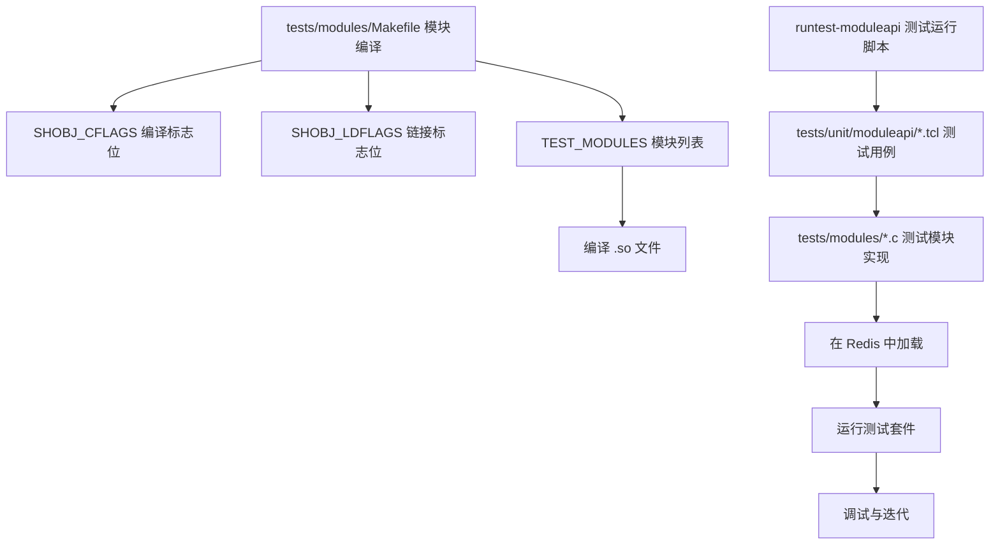

**来源：** [tests/modules/Makefile1-104](https://github.com/redis/redis/blob/8ad54215/tests/modules/Makefile#L1-L104) [runtest-moduleapi1-62](https://github.com/redis/redis/blob/8ad54215/runtest-moduleapi#L1-L62) [tests/unit/moduleapi/misc.tcl1-10](https://github.com/redis/redis/blob/8ad54215/tests/unit/moduleapi/misc.tcl#L1-L10)

构建系统支持多平台，并为创建 Redis 模块提供标准化的编译标志位。测试框架包含涵盖了 API 功能、错误条件和集成场景的全面测试用例。
