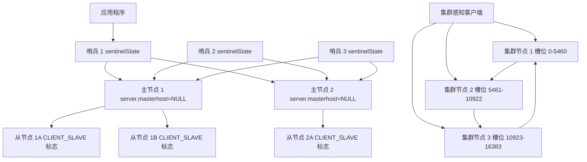
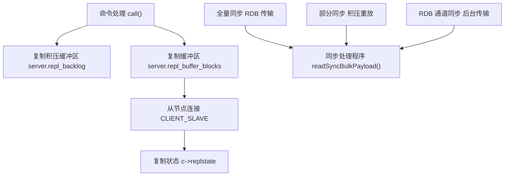
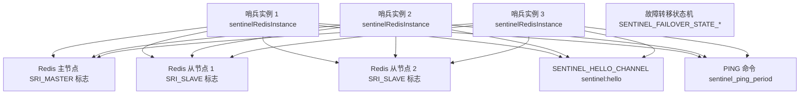
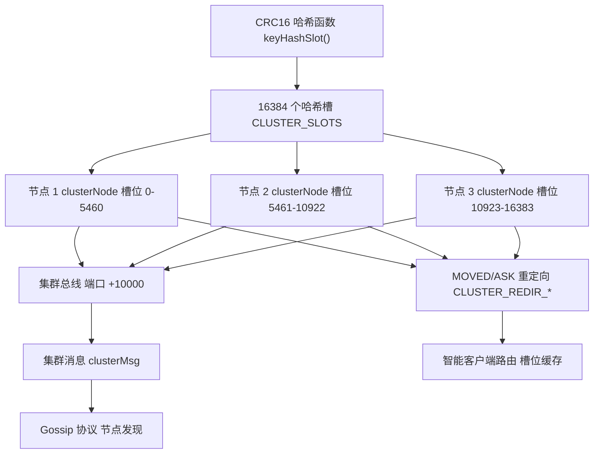
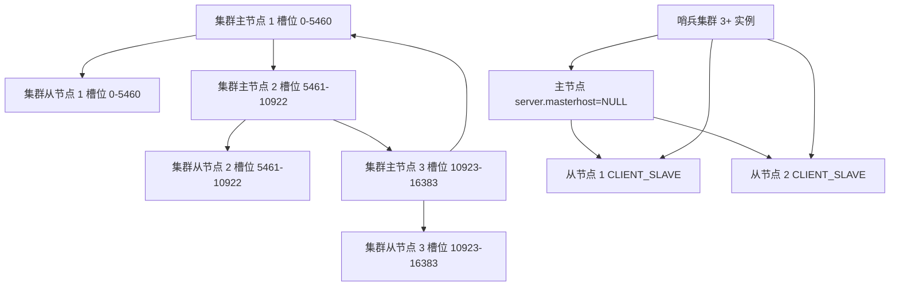

# 高可用与扩展

相关源文件

-   [sentinel.conf](https://github.com/redis/redis/blob/8ad54215/sentinel.conf)
-   [src/cluster.c](https://github.com/redis/redis/blob/8ad54215/src/cluster.c)
-   [src/cluster.h](https://github.com/redis/redis/blob/8ad54215/src/cluster.h)
-   [src/cluster\_legacy.c](https://github.com/redis/redis/blob/8ad54215/src/cluster_legacy.c)
-   [src/cluster\_legacy.h](https://github.com/redis/redis/blob/8ad54215/src/cluster_legacy.h)
-   [src/sentinel.c](https://github.com/redis/redis/blob/8ad54215/src/sentinel.c)
-   [tests/sentinel/tests/00-base.tcl](https://github.com/redis/redis/blob/8ad54215/tests/sentinel/tests/00-base.tcl)
-   [tests/sentinel/tests/01-conf-update.tcl](https://github.com/redis/redis/blob/8ad54215/tests/sentinel/tests/01-conf-update.tcl)
-   [tests/sentinel/tests/02-slaves-reconf.tcl](https://github.com/redis/redis/blob/8ad54215/tests/sentinel/tests/02-slaves-reconf.tcl)
-   [tests/sentinel/tests/05-manual.tcl](https://github.com/redis/redis/blob/8ad54215/tests/sentinel/tests/05-manual.tcl)
-   [tests/sentinel/tests/06-ckquorum.tcl](https://github.com/redis/redis/blob/8ad54215/tests/sentinel/tests/06-ckquorum.tcl)
-   [tests/sentinel/tests/07-down-conditions.tcl](https://github.com/redis/redis/blob/8ad54215/tests/sentinel/tests/07-down-conditions.tcl)
-   [tests/sentinel/tests/09-acl-support.tcl](https://github.com/redis/redis/blob/8ad54215/tests/sentinel/tests/09-acl-support.tcl)
-   [tests/sentinel/tests/10-replica-priority.tcl](https://github.com/redis/redis/blob/8ad54215/tests/sentinel/tests/10-replica-priority.tcl)
-   [tests/sentinel/tests/11-port-0.tcl](https://github.com/redis/redis/blob/8ad54215/tests/sentinel/tests/11-port-0.tcl)
-   [tests/sentinel/tests/12-master-reboot.tcl](https://github.com/redis/redis/blob/8ad54215/tests/sentinel/tests/12-master-reboot.tcl)
-   [tests/support/cluster\_util.tcl](https://github.com/redis/redis/blob/8ad54215/tests/support/cluster_util.tcl)
-   [tests/unit/cluster/hostnames.tcl](https://github.com/redis/redis/blob/8ad54215/tests/unit/cluster/hostnames.tcl)
-   [tests/unit/cluster/human-announced-nodename.tcl](https://github.com/redis/redis/blob/8ad54215/tests/unit/cluster/human-announced-nodename.tcl)

本文涵盖了 Redis 用于实现高可用性和水平扩展的分布式系统特性。它提供了三种主要机制的概览：复制（replication）、Redis 哨兵（Sentinel）和 Redis 集群（Cluster），以及它们如何协同工作以提供容错和扩展能力。

有关补充这些高可用特性的持久化机制的详细信息，请参阅[持久化](/redis/redis/5-scripting-and-extensions)。有关保护分布式部署的安全特性，请参阅[安全](/redis/redis/6-high-availability-and-distribution)。

## 概览

Redis 通过三个互补的系统实现高可用性和扩展：

-   **复制 (Replication)**：主从数据同步，用于读扩展和基础冗余。
-   **Redis 哨兵 (Sentinel)**：为复制架构提供自动监控、故障转移和配置管理。
-   **Redis 集群 (Cluster)**：在多个节点之间进行分布式数据分片，用于水平写扩展。

这些系统可以根据部署要求独立使用或结合使用。

## 架构概览

高可用与扩展架构

**分布式系统组件与核心数据结构**

**来源：** [src/server.h497-513](https://github.com/redis/redis/blob/8ad54215/src/server.h#L497-L513) [src/server.h361-367](https://github.com/redis/redis/blob/8ad54215/src/server.h#L361-L367) [src/sentinel.c37-60](https://github.com/redis/redis/blob/8ad54215/src/sentinel.c#L37-L60)

## 复制系统

复制系统提供异步的主从数据同步。主节点接收写入并将更改传播到从节点，从节点可以处理读请求。

### 复制架构

复制数据流与状态机

**复制状态机与数据流**

### 关键组件

**复制积压缓冲区 (Replication Backlog)**：循环缓冲区，存储最近的命令用于部分重同步，在 `createReplicationBacklog()` 中实现 [src/replication.c163-174](https://github.com/redis/redis/blob/8ad54215/src/replication.c#L163-L174)。积压缓冲区是一个关键组件，它使从节点在短暂断开连接后重新连接时能够进行部分重同步。

**复制状态 (Replication States)**：从节点连接状态定义为 `REPL_STATE_*` 常量 [src/server.h497-513](https://github.com/redis/redis/blob/8ad54215/src/server.h#L497-L513)，并在复制状态机中进行管理。这些状态追踪从初始连接到全面运行的同步进度。

**RDB 通道 (RDB Channel)**：优化的全量同步机制，在独立连接上传输 RDB 数据，同时在主连接上流式传输复制缓冲区 [src/replication.c49-54](https://github.com/redis/redis/blob/8ad54215/src/replication.c#L49-L54)。该特性显著提高了大数据集的复制性能。

**来源：** [src/replication.c163-207](https://github.com/redis/redis/blob/8ad54215/src/replication.c#L163-L207) [src/server.h497-513](https://github.com/redis/redis/blob/8ad54215/src/server.h#L497-L513) [src/replication.c275-311](https://github.com/redis/redis/blob/8ad54215/src/replication.c#L275-L311)

## Redis 哨兵 (Sentinel)

哨兵为复制架构的 Redis 部署提供自动监控、故障转移和配置管理。它作为一个独立的进程运行，监控 Redis 实例并在检测到故障时执行故障转移。

### 哨兵架构

哨兵监控与故障转移系统

**哨兵监控与故障转移协调**

### 哨兵特性

**实例监控**：每个 `sentinelRedisInstance` 使用周期性的 `PING` 命令和连接状态来追踪 Redis 主节点和从节点的健康状况 [src/sentinel.c135-146](https://github.com/redis/redis/blob/8ad54215/src/sentinel.c#L135-L146)。监控以由 `sentinel_ping_period` 定义的可配置间隔发生 [src/sentinel.c66](https://github.com/redis/redis/blob/8ad54215/src/sentinel.c#L66-L66)。

**故障检测**：实现主观下线 (`SRI_S_DOWN`) 和客观下线 (`SRI_O_DOWN`) 状态，并具有可配置的阈值 [src/sentinel.c44-60](https://github.com/redis/redis/blob/8ad54215/src/sentinel.c#L44-L60)。主观下线由单个哨兵检测，而客观下线需要法定人数（quorum）达成一致。

**自动故障转移**：通过领头项（leader）选举协调故障转移，并在发生故障时将从节点晋升为主节点 [src/sentinel.c90-96](https://github.com/redis/redis/blob/8ad54215/src/sentinel.c#L90-L96)。故障转移过程遵循由 `SENTINEL_FAILOVER_STATE_*` 常量定义的状态机。

**配置管理**：更新客户端配置，并通过发布/订阅（pub/sub）频道（特别是 `SENTINEL_HELLO_CHANNEL`）通知应用程序拓扑结构的变化 [src/sentinel.c79](https://github.com/redis/redis/blob/8ad54215/src/sentinel.c#L79-L79)。

**来源：** [src/sentinel.c135-146](https://github.com/redis/redis/blob/8ad54215/src/sentinel.c#L135-L146) [src/sentinel.c44-60](https://github.com/redis/redis/blob/8ad54215/src/sentinel.c#L44-L60) [src/sentinel.c90-96](https://github.com/redis/redis/blob/8ad54215/src/sentinel.c#L90-L96) [src/sentinel.c66-79](https://github.com/redis/redis/blob/8ad54215/src/sentinel.c#L66-L79)

## Redis 集群 (Cluster)

Redis 集群通过使用一致性哈希将数据分布在多个节点上，从而提供水平扩展。它消除了单点故障，并能够实现存储和吞吐量的线性扩展。

### 集群架构

Redis 集群数据分布与通信

**集群数据分布与通信**

### 集群组件

**哈希槽 (Hash Slots)**：数据被划分为 16384 个槽位（由 `CLUSTER_SLOTS` 定义 [src/cluster.h23](https://github.com/redis/redis/blob/8ad54215/src/cluster.h#L23-L23)），使用带有 CRC16 哈希的 `keyHashSlot()` 函数进行划分 [src/cluster.c34-59](https://github.com/redis/redis/blob/8ad54215/src/cluster.c#L34-L59)。这种固定数量的槽位实现了可预测且均衡的数据分布。

**集群节点 (Cluster Nodes)**：每个 `clusterNode` 结构体管理槽位分配，并维护与其他节点的连接 [src/cluster\_legacy.c39-51](https://github.com/redis/redis/blob/8ad54215/src/cluster_legacy.c#L39-L51)。节点追踪哪些哈希槽属于自己，哪些属于集群中的其他节点。

**集群总线 (Cluster Bus)**：在 端口+10000 上的专用通信通道，用于集群协调和 Gossip 协议 [src/cluster\_legacy.h18](https://github.com/redis/redis/blob/8ad54215/src/cluster_legacy.h#L18-L18)。这个独立的通道确保集群管理流量不会干扰客户端命令。

**客户端重定向 (Client Redirection)**：当客户端访问错误的节点时，服务器会以 `MOVED` 或 `ASK` 重定向响应（由 `CLUSTER_REDIR_*` 常量定义 [src/cluster.h29-37](https://github.com/redis/redis/blob/8ad54215/src/cluster.h#L29-L37)），引导客户端访问正确的节点。这种重定向机制是集群运行的基础。

**来源：** [src/cluster.h22-37](https://github.com/redis/redis/blob/8ad54215/src/cluster.h#L22-L37) [src/cluster.c34-59](https://github.com/redis/redis/blob/8ad54215/src/cluster.c#L34-L59) [src/cluster\_legacy.c39-51](https://github.com/redis/redis/blob/8ad54215/src/cluster_legacy.c#L39-L51)

## 集成模式

Redis 高可用部署模型

### 哨兵 + 复制 (Sentinel + Replication)

最常见的适用于单主节点工作负载的高可用设置。哨兵监控一个复制的 Redis 组，并执行自动故障转移，同时保持数据一致性。此模式通过 `sentinelHandleRedisInstance()` 函数实现 [src/sentinel.c1000-1100](https://github.com/redis/redis/blob/8ad54215/src/sentinel.c#L1000-L1100)，该函数管理监控和故障转移逻辑。

### 集群 + 复制 (Cluster + Replication)

每个集群节点都可以拥有从节点以实现冗余。集群负责分片，而复制提供每个分片的容错能力。`clusterReplicate()` 函数 [src/cluster\_legacy.c2000-2100](https://github.com/redis/redis/blob/8ad54215/src/cluster_legacy.c#L2000-L2100) 在集群上下文中建立复制关系。

### 配置

所有高可用特性都可以通过 `redis.conf` 或运行时的 `CONFIG SET` 命令进行配置。由 `config.c` 处理的关键配置类别包括：

| 配置类型 | 配置文件 | 关键参数 |
| --- | --- | --- |
| 复制 (Replication) | redis.conf | replicaof, replica-serve-stale-data |
| 哨兵 (Sentinel) | sentinel.conf | sentinel monitor, sentinel down-after-milliseconds |
| 集群 (Cluster) | redis.conf | cluster-enabled, cluster-node-timeout |

配置系统使用特定类型的处理程序（如 `replicationConfigInit()` 和 `clusterConfigInit()`）来管理这些设置 [src/config.c374-425](https://github.com/redis/redis/blob/8ad54215/src/config.c#L374-L425)。

**来源：** [src/config.c374-425](https://github.com/redis/redis/blob/8ad54215/src/config.c#L374-L425) [redis.conf1-150](https://github.com/redis/redis/blob/8ad54215/redis.conf#L1-L150) [sentinel.conf1-50](https://github.com/redis/redis/blob/8ad54215/sentinel.conf#L1-L50)

## 运维考量

**部署拓扑**：针对不同的规模和可用性要求，组合使用复制、哨兵和集群。

**网络分区**：所有系统都包含分区容错机制和脑裂预防。

**性能影响**：复制和集群协调会引入延迟开销，该开销随部署规模而扩展。

**监控**：通过 `INFO` 命令可以获得全面的指标，用于追踪复制延迟、集群健康状况和哨兵状态。

有关每个系统的实现细节，请参阅[复制](/redis/redis/4.1-eviction-and-expiration-policies)、[Redis 哨兵](/redis/redis/4.2-memory-allocators-and-build-system)和[Redis 集群](#4.3)。
