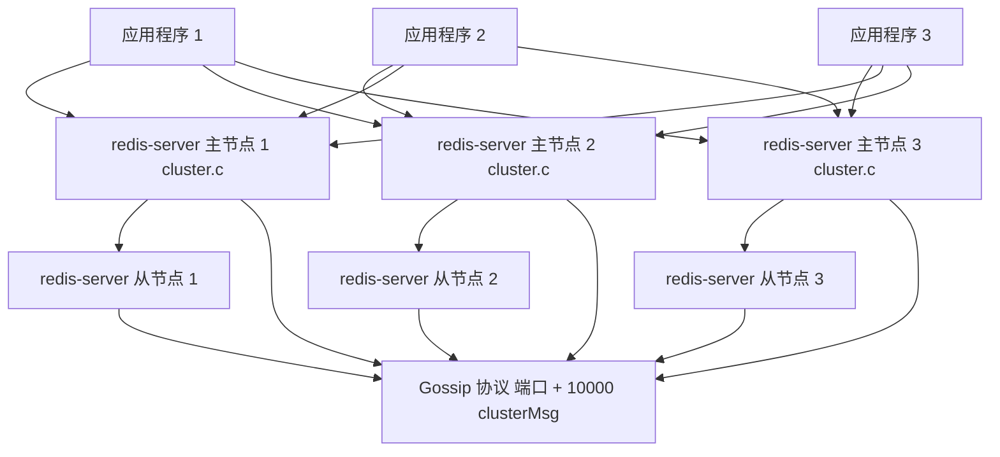
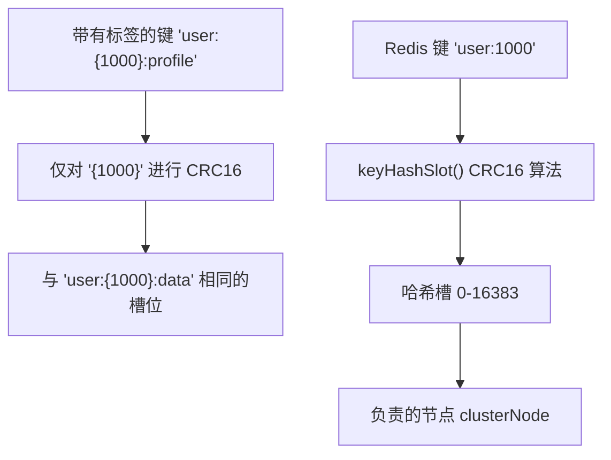
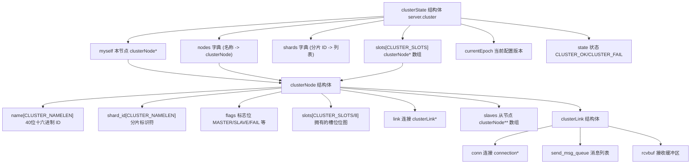
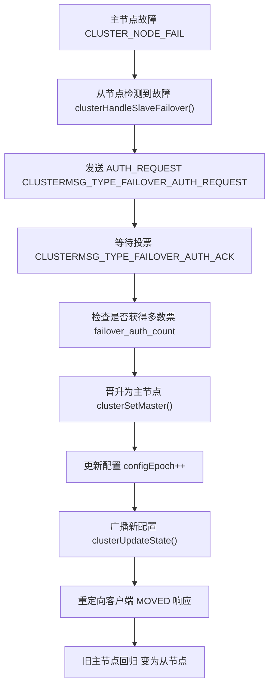
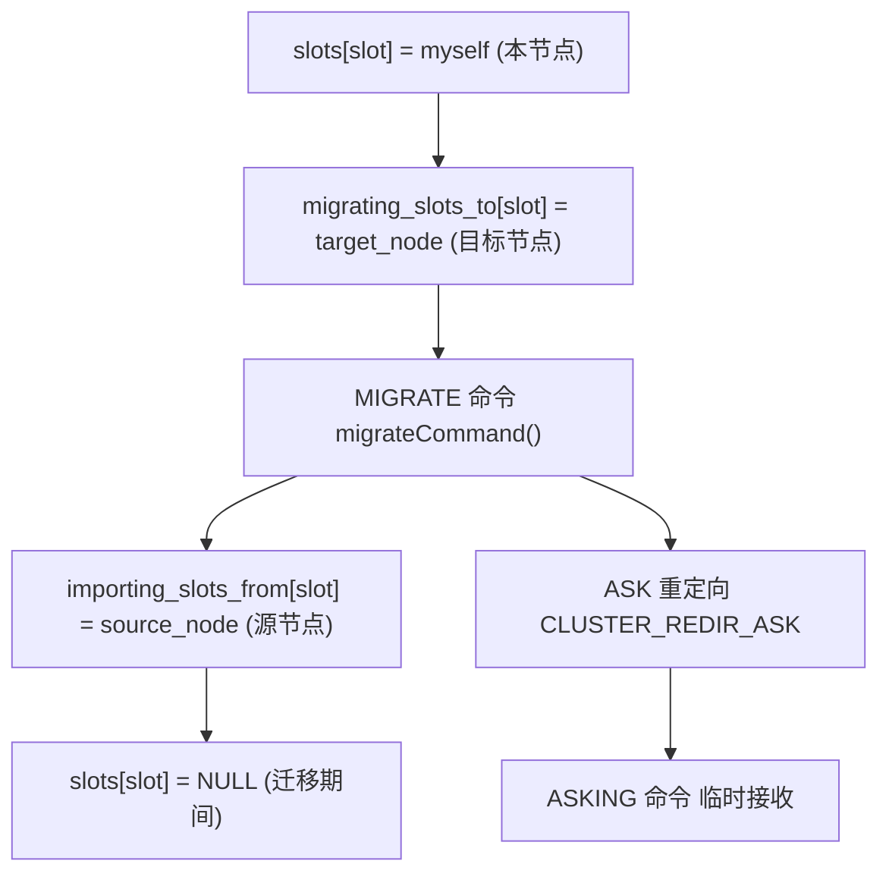
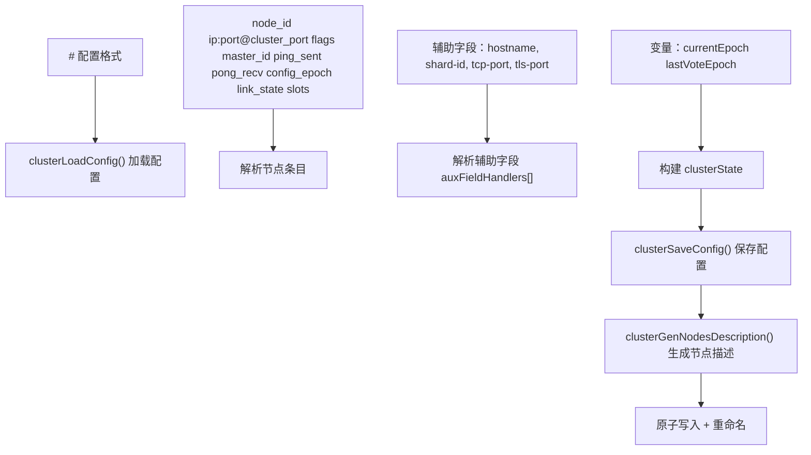
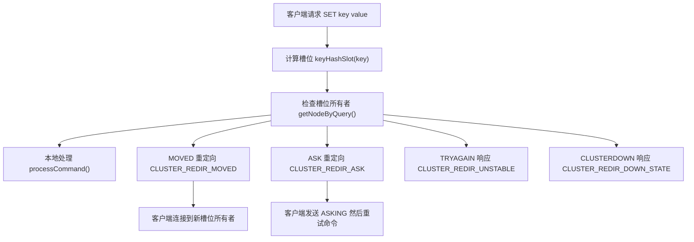
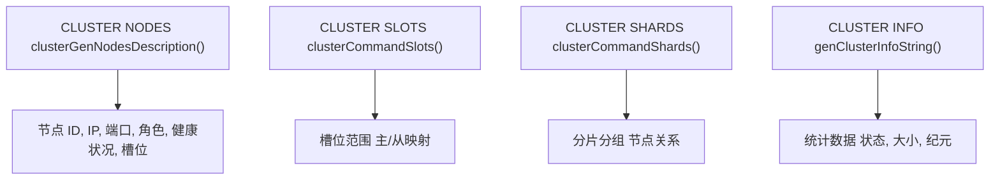

# Redis 集群 (Cluster)

相关源文件

-   [src/cluster.c](https://github.com/redis/redis/blob/8ad54215/src/cluster.c)
-   [src/cluster.h](https://github.com/redis/redis/blob/8ad54215/src/cluster.h)
-   [src/cluster\_legacy.c](https://github.com/redis/redis/blob/8ad54215/src/cluster_legacy.c)
-   [src/cluster\_legacy.h](https://github.com/redis/redis/blob/8ad54215/src/cluster_legacy.h)
-   [tests/support/cluster\_util.tcl](https://github.com/redis/redis/blob/8ad54215/tests/support/cluster_util.tcl)
-   [tests/unit/cluster/hostnames.tcl](https://github.com/redis/redis/blob/8ad54215/tests/unit/cluster/hostnames.tcl)
-   [tests/unit/cluster/human-announced-nodename.tcl](https://github.com/redis/redis/blob/8ad54215/tests/unit/cluster/human-announced-nodename.tcl)

Redis 集群是 Redis 内置的解决方案，通过自动数据分片和复制来实现水平扩展和高可用性。它使用哈希槽机制将数据分布在多个 Redis 实例上，并在节点不可用时提供自动故障转移能力。

有关主节点与从节点之间 Redis 复制的信息，请参阅[复制](/redis/redis/4.1-eviction-and-expiration-policies)。有关高可用监控和故障转移协调的信息，请参阅 [Redis 哨兵](/redis/redis/4.2-memory-allocators-and-build-system)。

## 架构概览

Redis 集群实现了一个分布式哈希表，其中数据被自动分区到多个 Redis 节点。集群使用哈希槽方法，总共有 16,384 个槽位，每个主节点负责这些槽位的一个子集。

### 集群架构图

**来源：** [src/cluster.h22-27](https://github.com/redis/redis/blob/8ad54215/src/cluster.h#L22-L27) [src/cluster\_legacy.h341-390](https://github.com/redis/redis/blob/8ad54215/src/cluster_legacy.h#L341-L390)

## 哈希槽分布

集群使用哈希槽机制对键空间进行分区。每个键通过 CRC16 哈希映射到 16,384 个哈希槽中的一个。

### 键哈希实现

`keyHashSlot` 函数实现了核心哈希逻辑：

**来源：** [src/cluster.h57-76](https://github.com/redis/redis/blob/8ad54215/src/cluster.h#L57-L76) [src/cluster.c34-59](https://github.com/redis/redis/blob/8ad54215/src/cluster.c#L34-L59)

### 哈希槽分配

在集群设置期间，每个主节点都被分配一个哈希槽范围。槽位分配存储在 `clusterState.slots` 数组中，并通过 Gossip 协议在整个集群中传播。

| 组件 | 用途 | 实现位置 |
| --- | --- | --- |
| `CLUSTER_SLOTS` | 槽位总数 (16384) | [src/cluster.h23](https://github.com/redis/redis/blob/8ad54215/src/cluster.h#L23-L23) |
| `keyHashSlot()` | 使用 CRC16 将键映射到槽位 | [src/cluster.h57-76](https://github.com/redis/redis/blob/8ad54215/src/cluster.h#L57-L76) |
| `clusterState.slots[]` | 将槽位映射到负责的节点 | [src/cluster\_legacy.h351](https://github.com/redis/redis/blob/8ad54215/src/cluster_legacy.h#L351-L351) |
| `clusterNode.slots[]` | 该节点拥有的槽位位图 | [src/cluster\_legacy.h304](https://github.com/redis/redis/blob/8ad54215/src/cluster_legacy.h#L304-L304) |

**来源：** [src/cluster.h22-24](https://github.com/redis/redis/blob/8ad54215/src/cluster.h#L22-L24) [src/cluster\_legacy.h351](https://github.com/redis/redis/blob/8ad54215/src/cluster_legacy.h#L351-L351) [src/cluster\_legacy.h304](https://github.com/redis/redis/blob/8ad54215/src/cluster_legacy.h#L304-L304)

## 核心数据结构

Redis 集群的实现围绕几个管理集群状态、节点信息和节点间通信的关键数据结构展开。

### 集群状态管理

**来源：** [src/cluster\_legacy.h341-390](https://github.com/redis/redis/blob/8ad54215/src/cluster_legacy.h#L341-L390) [src/cluster\_legacy.h298-332](https://github.com/redis/redis/blob/8ad54215/src/cluster_legacy.h#L298-L332) [src/cluster\_legacy.h44-55](https://github.com/redis/redis/blob/8ad54215/src/cluster_legacy.h#L44-L55)

### 消息协议结构

集群总线协议对所有节点间通信使用 `clusterMsg` 结构：

| 字段 | 类型 | 用途 |
| --- | --- | --- |
| `sig[4]` | char | 协议签名 "RCmb" |
| `totlen` | uint32\_t | 消息总长度 |
| `type` | uint16\_t | 消息类型 (PING/PONG/MEET/FAIL) |
| `sender[CLUSTER_NAMELEN]` | char | 发送节点 ID |
| `myslots[CLUSTER_SLOTS/8]` | unsigned char | 发送者的槽位位图 |
| `data` | union | 特定类型的消息数据 |

**来源：** [src/cluster\_legacy.h230-256](https://github.com/redis/redis/blob/8ad54215/src/cluster_legacy.h#L230-L256) [src/cluster\_legacy.h94-105](https://github.com/redis/redis/blob/8ad54215/src/cluster_legacy.h#L94-L105)

## 节点发现与 Gossip 协议

Redis 集群使用 Gossip 协议进行节点发现、故障检测和配置传播。每个节点都与一小组其他节点保持连接，并定期交换集群状态信息。

### Gossip 通信流程

> **[Mermaid 序列图 (sequence)]**
> *(注：此处的图表结构已根据原文保留占位)*

### 节点状态与转换

> **[Mermaid 状态图 (stateDiagram)]**
> *(注：此处的图表结构已根据原文保留占位)*

**来源：** [src/cluster\_legacy.h57-78](https://github.com/redis/redis/blob/8ad54215/src/cluster_legacy.h#L57-L78) [src/cluster\_legacy.c1543-1595](https://github.com/redis/redis/blob/8ad54215/src/cluster_legacy.c#L1543-L1595)

## 故障转移与高可用

Redis 集群支持自动和手动故障转移机制，以便在主节点故障时保持可用性。

### 自动故障转移过程

### 故障转移状态机

故障转移过程由 `clusterState` 中的几个关键变量管理：

| 变量 | 用途 | 类型 |
| --- | --- | --- |
| `failover_auth_time` | 选举过程的计时 | `mstime_t` |
| `failover_auth_count` | 已收到的票数 | `int` |
| `failover_auth_rank` | 从节点在选举中的排名 | `int` |
| `failover_auth_epoch` | 选举纪元编号 | `uint64_t` |
| `cant_failover_reason` | 故障转移被阻塞的原因 | `int` |

**来源：** [src/cluster\_legacy.h354-360](https://github.com/redis/redis/blob/8ad54215/src/cluster_legacy.h#L354-L360) [src/cluster\_legacy.c3956-4158](https://github.com/redis/redis/blob/8ad54215/src/cluster_legacy.c#L3956-L4158)

## 槽位迁移与重新分片

Redis 集群通过槽位迁移支持在线重新分片，允许在不停机的情况下重新分配数据。

### 迁移状态追踪

### 迁移协议命令

迁移过程使用几个专门的命令：

| 命令 | 用途 | 实现位置 |
| --- | --- | --- |
| `MIGRATE` | 在节点间迁移键 | [src/cluster.c398-736](https://github.com/redis/redis/blob/8ad54215/src/cluster.c#L398-L736) |
| `DUMP` | 序列化用于迁移的键 | [src/cluster.c137-153](https://github.com/redis/redis/blob/8ad54215/src/cluster.c#L137-L153) |
| `RESTORE` | 迁移后反序列化键 | [src/cluster.c156-281](https://github.com/redis/redis/blob/8ad54215/src/cluster.c#L156-L281) |
| `ASKING` | 迁移期间绕过重定向 | 集群命令处理 |

**来源：** [src/cluster.c398-736](https://github.com/redis/redis/blob/8ad54215/src/cluster.c#L398-L736) [src/cluster.c137-153](https://github.com/redis/redis/blob/8ad54215/src/cluster.c#L137-L153) [src/cluster.c156-281](https://github.com/redis/redis/blob/8ad54215/src/cluster.c#L156-L281)

## 配置持久化

集群配置持久化在 `nodes.conf` 文件中，该文件包含节点信息、槽位分配和集群状态。

### 配置文件格式

### 辅助字段支持

现代集群配置支持用于扩展节点元数据的辅助字段：

| 字段 | 处理函数 | 用途 |
| --- | --- | --- |
| `shard-id` | `auxShardIdSetter()` | 将节点分组到分片中 |
| `hostname` | 内置处理 | 人类可读的端点 |
| `tcp-port` | `auxTcpPortSetter()` | TCP 客户端端口 |
| `tls-port` | `auxTlsPortSetter()` | TLS 客户端端口 |

**来源：** [src/cluster\_legacy.c311-665](https://github.com/redis/redis/blob/8ad54215/src/cluster_legacy.c#L311-L665) [src/cluster\_legacy.c679-742](https://github.com/redis/redis/blob/8ad54215/src/cluster_legacy.c#L679-L742) [src/cluster\_legacy.c197-202](https://github.com/redis/redis/blob/8ad54215/src/cluster_legacy.c#L197-L202)

## 客户端交互与重定向

客户端通过任意节点与 Redis 集群交互，该节点要么直接处理请求，要么将客户端重定向到适当的节点。

### 请求路由逻辑

### 重定向响应类型

| 响应 | 含义 | 客户端操作 |
| --- | --- | --- |
| `MOVED slot host:port` | 槽位已永久迁移 | 更新槽位映射，重试 |
| `ASK slot host:port` | 迁移期间的临时重定向 | 发送 ASKING，然后发送命令 |
| `TRYAGAIN` | 集群状态不稳定 | 延迟后重试 |
| `CLUSTERDOWN` | 集群不可用 | 作为错误处理 |

**来源：** [src/cluster.h29-37](https://github.com/redis/redis/blob/8ad54215/src/cluster.h#L29-L37) [src/cluster.h151-153](https://github.com/redis/redis/blob/8ad54215/src/cluster.h#L151-L153)

## 监控与诊断

Redis 集群通过各种命令和指标提供了广泛的监控能力。

### 集群信息命令

### 健康监控指标

集群追踪各种统计数据用于监控：

| 指标类别 | 示例 | 来源 |
| --- | --- | --- |
| 消息统计 | Ping/Pong 计数, Fail 报告 | `stats_bus_messages_*` |
| 节点健康 | PFAIL/FAIL 节点计数 | `stats_pfail_nodes` |
| 槽位统计 | 每个槽位的 CPU 使用率, 网络 I/O | `slot_stats[]` |
| 配置信息 | 当前纪元, 集群规模 | `currentEpoch`, `size` |

**来源：** [src/cluster\_legacy.h375-389](https://github.com/redis/redis/blob/8ad54215/src/cluster_legacy.h#L375-L389) [src/cluster.c925-955](https://github.com/redis/redis/blob/8ad54215/src/cluster.c#L925-L955)

Redis 集群为在多个节点上分布 Redis 数据提供了一个健壮、可扩展的解决方案，同时通过自动故障转移和无缝的客户端重定向保持了高可用性。
