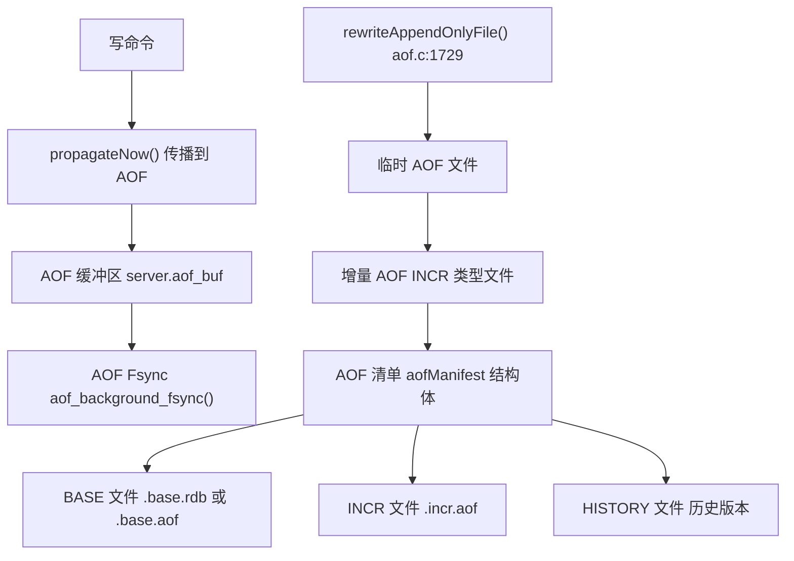

# 持久化与复制

相关源文件

-   [redis.conf](https://github.com/redis/redis/blob/8ad54215/redis.conf)
-   [src/aof.c](https://github.com/redis/redis/blob/8ad54215/src/aof.c)
-   [src/config.c](https://github.com/redis/redis/blob/8ad54215/src/config.c)
-   [src/db.c](https://github.com/redis/redis/blob/8ad54215/src/db.c)
-   [src/debug.c](https://github.com/redis/redis/blob/8ad54215/src/debug.c)
-   [src/module.c](https://github.com/redis/redis/blob/8ad54215/src/module.c)
-   [src/networking.c](https://github.com/redis/redis/blob/8ad54215/src/networking.c)
-   [src/object.c](https://github.com/redis/redis/blob/8ad54215/src/object.c)
-   [src/rdb.c](https://github.com/redis/redis/blob/8ad54215/src/rdb.c)
-   [src/replication.c](https://github.com/redis/redis/blob/8ad54215/src/replication.c)
-   [src/server.c](https://github.com/redis/redis/blob/8ad54215/src/server.c)
-   [src/server.h](https://github.com/redis/redis/blob/8ad54215/src/server.h)
-   [tests/unit/introspection.tcl](https://github.com/redis/redis/blob/8ad54215/tests/unit/introspection.tcl)

本文涵盖了 Redis 的数据持久化机制和主从复制系统。持久化通过 RDB 快照和 AOF 事务日志确保数据持久性，而复制则实现了跨多个 Redis 实例的数据同步，以实现高可用性和读扩展。

有关集群和分布式 Redis 部署的信息，请参阅 [Redis 集群](/redis/redis/6.1-redis-cluster)。有关高可用监控和故障转移管理的信息，请参阅 [Redis 哨兵](/redis/redis/6.2-redis-sentinel)。

## 概览

Redis 提供了两种互补的持久化机制和一个全面的复制系统：

**持久化系统：**

-   **RDB (Redis Database)**：存储在 `.rdb` 文件中的时间点二进制快照。
-   **AOF (Append Only File)**：在 `.aof` 文件中记录所有写操作的事务日志。

**复制系统：**

-   采用异步复制的主从架构。
-   全量同步 (FULLRESYNC) 和部分同步 (PSYNC)。
-   用于高效部分重同步的复制积压缓冲区 (Replication Backlog)。
-   RDB 通道复制，用于在全量同步期间提高性能。


**来源：** [src/server.h80-81](https://github.com/redis/redis/blob/8ad54215/src/server.h#L80-L81) [src/replication.c16-28](https://github.com/redis/redis/blob/8ad54215/src/replication.c#L16-L28) [src/rdb.c1-50](https://github.com/redis/redis/blob/8ad54215/src/rdb.c#L1-L50) [src/aof.c1-50](https://github.com/redis/redis/blob/8ad54215/src/aof.c#L1-L50)

## RDB 持久化

RDB 创建整个 Redis 数据集的时间点二进制快照。系统同时支持通过 `BGSAVE` 进行的手动快照和基于可配置保存点的自动快照。

### RDB 数据结构与流程


RDB 格式使用支持压缩的类型-长度-值（Type-Length-Value）编码：

| 组件 | 函数 | 描述 |
| --- | --- | --- |
| 类型字节 | `rdbSaveType()` | 对象类型标识符 |
| 长度编码 | `rdbSaveLen()` | 变长整数编码 |
| 对象数据 | `rdbSaveObject()` | 特定类型的序列化 |
| 校验和 | `rdbSaveRaw()` | 用于完整性校验的 CRC64 校验和 |

**来源：** [src/rdb.c95-103](https://github.com/redis/redis/blob/8ad54215/src/rdb.c#L95-L103) [src/rdb.c157-188](https://github.com/redis/redis/blob/8ad54215/src/rdb.c#L157-L188) [src/rdb.c1089-1150](https://github.com/redis/redis/blob/8ad54215/src/rdb.c#L1089-L1150)

### RDB 配置

`redis.conf` 中的关键配置选项：

```
save 900 1      # 如果 900 秒内至少有 1 个键发生变化，则保存
save 300 10     # 如果 300 秒内至少有 10 个键发生变化，则保存
save 60 10000   # 如果 60 秒内至少有 10000 个键发生变化，则保存

dbfilename dump.rdb
rdbcompression yes
rdbchecksum yes
```

保存点由 `saveparam` 结构管理，并在 `serverCron()` 中进行处理。

**来源：** [redis.conf394-415](https://github.com/redis/redis/blob/8ad54215/redis.conf#L394-L415) [src/server.h1527-1531](https://github.com/redis/redis/blob/8ad54215/src/server.h#L1527-L1531) [src/config.c344-349](https://github.com/redis/redis/blob/8ad54215/src/config.c#L344-L349)

## AOF 持久化

AOF (追加日志文件) 以人类可读的格式记录所有写操作，提供比 RDB 更好的持久性保证，但代价是文件体积更大。

### AOF 架构



### AOF 清单系统 (Manifest System)

AOF 清单追踪多个 AOF 文件及其关系：

| 字段 | 用途 | 取值 |
| --- | --- | --- |
| `file_type` | 文件分类 | `'b'` (基础文件), `'i'` (增量文件), `'h'` (历史文件) |
| `file_seq` | 序列号 | 单调递增 |
| `start_offset` | 起始复制偏移量 | 用于 PSYNC |
| `end_offset` | 结束复制偏移量 | 用于 PSYNC |

**来源：** [src/aof.c72-86](https://github.com/redis/redis/blob/8ad54215/src/aof.c#L72-L86) [src/aof.c153-171](https://github.com/redis/redis/blob/8ad54215/src/aof.c#L153-L171) [src/aof.c210-228](https://github.com/redis/redis/blob/8ad54215/src/aof.c#L210-L228)

### AOF Fsync 策略


**来源：** [src/aof.c615-618](https://github.com/redis/redis/blob/8ad54215/src/aof.c#L615-L618) [src/config.c80-85](https://github.com/redis/redis/blob/8ad54215/src/config.c#L80-L85) [src/bio.h50-60](https://github.com/redis/redis/blob/8ad54215/src/bio.h#L50-L60)

## 复制架构

Redis 复制遵循采用异步数据同步的主从模型。系统支持全量和部分同步，以优化网络使用并减少停机时间。

### 核心复制数据结构


`replBacklog` 结构管理复制缓冲区：

| 字段 | 类型 | 用途 |
| --- | --- | --- |
| `ref_repl_buf_node` | `listNode*` | 指向第一个缓冲块的引用 |
| `histlen` | `long long` | 积压缓冲区中的总字节数 |
| `offset` | `long long` | 积压缓冲区的起始偏移量 |
| `blocks_index` | `rax*` | 用于快速偏移量查找的索引 |

**来源：** [src/server.h1715-1724](https://github.com/redis/redis/blob/8ad54215/src/server.h#L1715-L1724) [src/replication.c163-174](https://github.com/redis/redis/blob/8ad54215/src/replication.c#L163-L174) [src/replication.c213-223](https://github.com/redis/redis/blob/8ad54215/src/replication.c#L213-L223)

## 主从同步

### PSYNC 协议状态机

> **[Mermaid 状态图 (stateDiagram)]**
> *(注：此处的图表结构已根据原文保留占位)*

### 同步类型

**全量同步 (FULLRESYNC)：**

-   当从节点第一次连接或无法进行部分重同步时触发。
-   主节点创建 RDB 快照并发送整个数据集。
-   可以使用磁盘或无盘（diskless）复制。

**部分同步 (PSYNC)：**

-   使用复制 ID 和偏移量从特定点恢复。
-   依靠复制积压缓冲区来重放错过的命令。
-   比全量同步快得多。

> **[Mermaid 序列图 (sequence)]**
> *(注：此处的图表结构已根据原文保留占位)*

**来源：** [src/replication.c498-514](https://github.com/redis/redis/blob/8ad54215/src/replication.c#L498-L514) [src/replication.c1089-1150](https://github.com/redis/redis/blob/8ad54215/src/replication.c#L1089-L1150) [src/server.h498-514](https://github.com/redis/redis/blob/8ad54215/src/server.h#L498-L514)

### RDB 通道复制

为了在全量同步期间提高性能，Redis 支持 RDB 通道复制，此时从节点开启两个连接：

1.  **主通道 (Main channel)**：接收复制流（在 RDB 加载期间进行缓冲）。
2.  **RDB 通道 (RDB channel)**：接收用于加载的 RDB 数据。


这种方法允许从节点在接收 RDB 快照的同时缓冲来自主节点的新写入，从而减少同步时间并降低主节点的内存使用。

**来源：** [src/replication.c26](https://github.com/redis/redis/blob/8ad54215/src/replication.c#L26-L26) [src/replication.c73-81](https://github.com/redis/redis/blob/8ad54215/src/replication.c#L73-L81) [src/replication.c556-560](https://github.com/redis/redis/blob/8ad54215/src/replication.c#L556-L560)

## 复制缓冲区管理

### 缓冲块结构

复制系统使用 `replBufBlock` 结构的链表来高效管理复制流：


引用计数系统确保仅在没有从节点需要时才释放这些块，而 Rax 树索引则实现了针对 PSYNC 操作的快速偏移量查找。

**来源：** [src/replication.c213-223](https://github.com/redis/redis/blob/8ad54215/src/replication.c#L213-L223) [src/replication.c318-371](https://github.com/redis/redis/blob/8ad54215/src/replication.c#L318-L371) [src/server.h1715-1724](https://github.com/redis/redis/blob/8ad54215/src/server.h#L1715-L1724)

## 配置与管理

### 关键配置参数

| 参数 | 默认值 | 用途 |
| --- | --- | --- |
| `repl-backlog-size` | 1MB | 复制积压缓冲区的大小 |
| `repl-backlog-ttl` | 3600 | 最后一个从节点断开后保留积压缓冲区的秒数 |
| `repl-diskless-sync` | no | 使用无盘复制 |
| `repl-diskless-load` | disabled | 直接从套接字加载 RDB |
| `min-replicas-to-write` | 0 | 允许写入所需的最小从节点数 |
| `min-replicas-max-lag` | 10 | 从节点允许的最大延迟秒数 |

### 监控与诊断

Redis 提供了多个命令用于监控持久化和复制：

-   `INFO replication` - 复制状态和指标。
-   `INFO persistence` - RDB 和 AOF 统计信息。
-   `LASTSAVE` - 最近一次成功 RDB 保存的时间戳。
-   `BGREWRITEAOF` - 触发 AOF 重写。
-   `BGSAVE` - 触发 RDB 快照。

服务器会追踪各种指标，包括复制延迟、积压缓冲区统计信息以及持久化操作计数，这些都可以通过 `INFO` 命令访问。

**来源：** [redis.conf394-500](https://github.com/redis/redis/blob/8ad54215/redis.conf#L394-L500) [src/server.h1527-1600](https://github.com/redis/redis/blob/8ad54215/src/server.h#L1527-L1600) [src/replication.c3500-3600](https://github.com/redis/redis/blob/8ad54215/src/replication.c#L3500-L3600)
