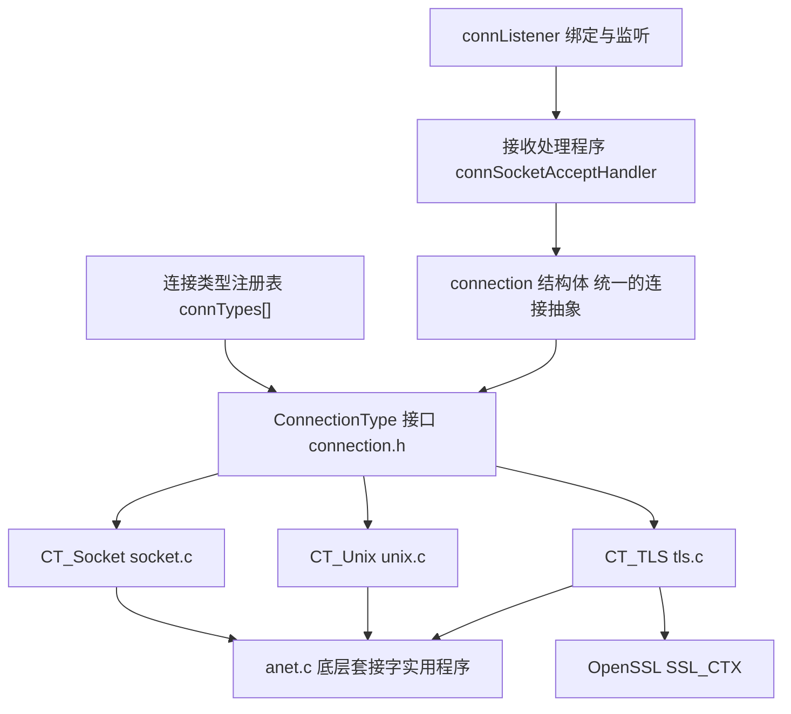
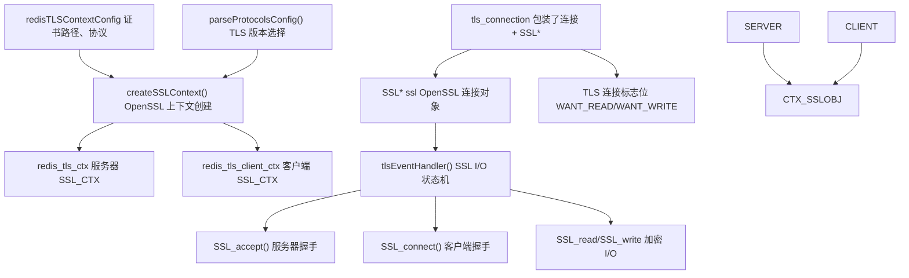
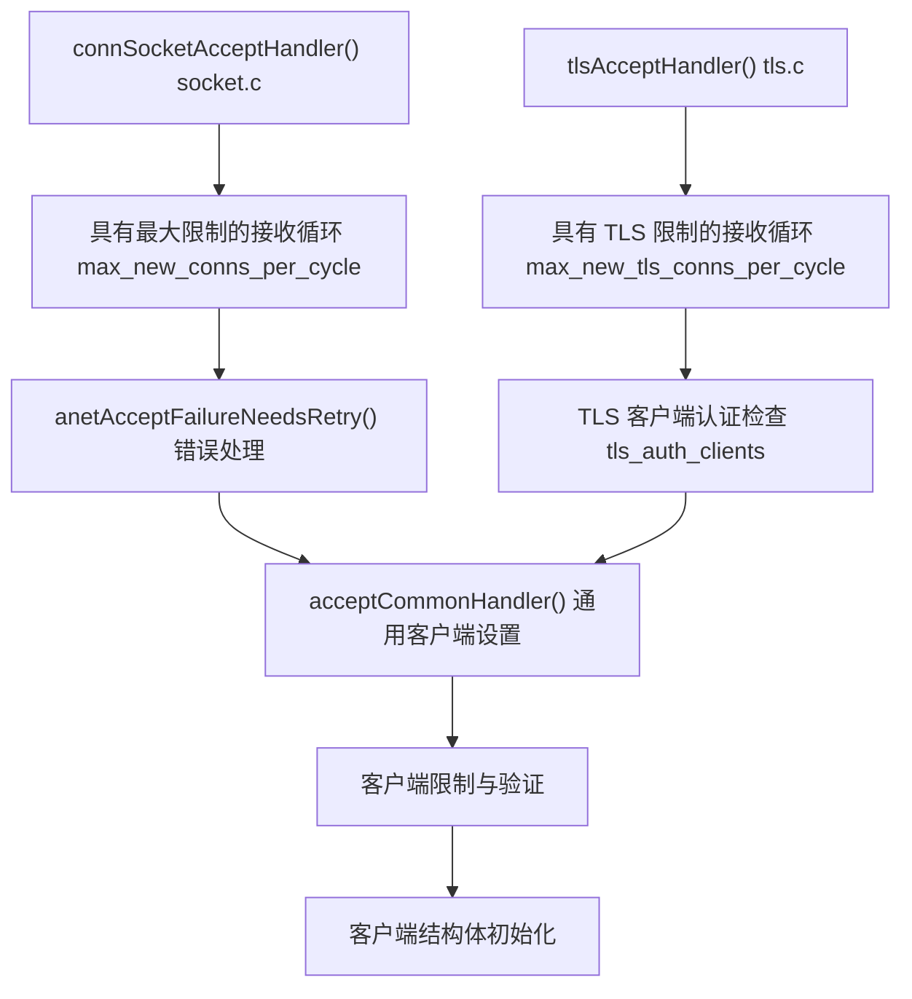

# 网络安全与 TLS

相关源文件

-   [src/anet.c](https://github.com/redis/redis/blob/8ad54215/src/anet.c)
-   [src/anet.h](https://github.com/redis/redis/blob/8ad54215/src/anet.h)
-   [src/connection.c](https://github.com/redis/redis/blob/8ad54215/src/connection.c)
-   [src/connection.h](https://github.com/redis/redis/blob/8ad54215/src/connection.h)
-   [src/socket.c](https://github.com/redis/redis/blob/8ad54215/src/socket.c)
-   [src/tls.c](https://github.com/redis/redis/blob/8ad54215/src/tls.c)
-   [src/unix.c](https://github.com/redis/redis/blob/8ad54215/src/unix.c)

本文涵盖了 Redis 的网络安全基础设施和 TLS（传输层安全）实现。内容包括连接抽象层、基于 OpenSSL 的 TLS 加密支持、证书管理以及安全连接处理。

有关访问控制和用户身份验证的信息，请参阅[访问控制列表 (ACL)](/redis/redis/8.1-access-control-lists)。有关通用网络和客户端连接管理的信息，请参阅[客户端连接管理](/redis/redis/2.2-client-connection-management)。

## 连接架构概览

Redis 实现了一个可插拔的连接架构，通过统一接口支持多种传输协议。系统支持三种主要的连接类型：TCP 套接字、Unix 域套接字和 TLS 加密连接。



**来源：** [src/connection.h47-95](https://github.com/redis/redis/blob/8ad54215/src/connection.h#L47-L95) [src/connection.c30-59](https://github.com/redis/redis/blob/8ad54215/src/connection.c#L30-L59) [src/socket.c385-430](https://github.com/redis/redis/blob/8ad54215/src/socket.c#L385-L430) [src/unix.c169-214](https://github.com/redis/redis/blob/8ad54215/src/unix.c#L169-L214) [src/tls.c16-41](https://github.com/redis/redis/blob/8ad54215/src/tls.c#L16-L41)

连接框架提供了一个类型安全的抽象，其中每种连接类型都实现了 `ConnectionType` 接口。连接类型在启动时注册，可以按名称查找或为了性能进行缓存。

## TLS 实现架构

Redis 的 TLS 支持构建在 OpenSSL 之上，为客户端-服务器和集群间通信提供了完整的加密能力。该实现同时处理服务器端和客户端的 TLS 上下文。



**来源：** [src/tls.c180-255](https://github.com/redis/redis/blob/8ad54215/src/tls.c#L180-L255) [src/tls.c425-431](https://github.com/redis/redis/blob/8ad54215/src/tls.c#L425-L431) [src/tls.c498-531](https://github.com/redis/redis/blob/8ad54215/src/tls.c#L498-L531) [src/tls.c757-762](https://github.com/redis/redis/blob/8ad54215/src/tls.c#L757-L762)

TLS 实现管理复杂的 SSL 状态转换，并处理 SSL 操作的异步性质，这些操作可能需要多次 I/O 操作才能完成。

## TLS 连接生命周期

TLS 连接遵循一个多阶段的生命周期，具有明确的握手阶段和事件驱动的 I/O 处理：

> **[Mermaid 状态图 (stateDiagram)]**
> *(注：此处的图表结构已根据原文保留占位)*

**来源：** [src/tls.c640-751](https://github.com/redis/redis/blob/8ad54215/src/tls.c#L640-L751) [src/tls.c835-862](https://github.com/redis/redis/blob/8ad54215/src/tls.c#L835-L862) [src/tls.c864-883](https://github.com/redis/redis/blob/8ad54215/src/tls.c#L864-L883)

状态机处理了 SSL 握手的复杂性，其中操作可能需要因为相反方向的 I/O 而阻塞（例如，写操作可能需要等待套接字可读）。

## 网络安全特性

### 协议支持与配置

Redis TLS 支持多个协议版本，并具有可配置的安全参数：

| 特性 | 实现 | 配置项 |
| --- | --- | --- |
| **TLS 版本** | TLSv1, TLSv1.1, TLSv1.2, TLSv1.3 | `tls-protocols` 配置 |
| **默认协议** | TLSv1.2 + TLSv1.3 | `REDIS_TLS_PROTO_DEFAULT` |
| **密码套件 (Ciphers)** | OpenSSL 密码列表 | `tls-ciphers` 配置 |
| **TLSv1.3 密码套件** | OpenSSL 密码套件 | `tls-ciphersuites` 配置 |
| **客户端身份验证** | 无、可选、必须 | `tls-auth-clients` 配置 |

**来源：** [src/tls.c29-39](https://github.com/redis/redis/blob/8ad54215/src/tls.c#L29-L39) [src/tls.c44-77](https://github.com/redis/redis/blob/8ad54215/src/tls.c#L44-L77) [src/tls.c238-248](https://github.com/redis/redis/blob/8ad54215/src/tls.c#L238-L248)

### 证书与密钥管理

TLS 实现支持独立的服务器和客户端证书，以及受密码保护的私钥：

```mermaid
flowchart TD
    CERT["tls-cert-file 服务器证书"]
    KEY["tls-key-file 服务器私钥"]
    KEYPASS["tls-key-file-pass 私钥密码"]
    CLIENTCERT["tls-client-cert-file 客户端证书"]
    CLIENTKEY["tls-client-key-file 客户端私钥"]
    CLIENTPASS["tls-client-key-file-pass 客户端私钥密码"]
    CAFILE["tls-ca-cert-file CA 证书文件"]
    CADIR["tls-ca-cert-dir CA 证书目录"]
    DHPARAMS["tls-dh-params-file Diffie-Hellman 参数"]
    SSL_CTX_use_certificate_chain_file["SSL_CTX_use_certificate_chain_file"]
    SSL_CTX_use_PrivateKey_file["SSL_CTX_use_PrivateKey_file"]
    tlsPasswordCallback["tlsPasswordCallback"]
    SSL_CTX_load_verify_locations["SSL_CTX_load_verify_locations"]
    SSL_CTX_set0_tmp_dh_pkey["SSL_CTX_set0_tmp_dh_pkey"]

    CERT --> SSL_CTX_use_certificate_chain_file
    KEY --> SSL_CTX_use_PrivateKey_file
    KEYPASS --> tlsPasswordCallback
    CLIENTCERT --> SSL_CTX_use_certificate_chain_file
    CLIENTKEY --> SSL_CTX_use_PrivateKey_file
    CLIENTPASS --> tlsPasswordCallback
    CAFILE --> SSL_CTX_load_verify_locations
    CADIR --> SSL_CTX_load_verify_locations
    DHPARAMS --> SSL_CTX_set0_tmp_dh_pkey
```



**来源：** [src/tls.c180-184](https://github.com/redis/redis/blob/8ad54215/src/tls.c#L180-L184) [src/tls.c219-236](https://github.com/redis/redis/blob/8ad54215/src/tls.c#L219-L236) [src/tls.c317-371](https://github.com/redis/redis/blob/8ad54215/src/tls.c#L317-L371) [src/tls.c162-175](https://github.com/redis/redis/blob/8ad54215/src/tls.c#L162-L175)

### 会话管理

为了提高性能，可以对 TLS 会话进行缓存，并设置可配置参数：

-   **会话缓存**：通过 `tls-session-caching` 启用/禁用。
-   **缓存大小**：通过 `tls-session-cache-size` 配置。
-   **缓存超时**：通过 `tls-session-cache-timeout` 配置。

**来源：** [src/tls.c296-303](https://github.com/redis/redis/blob/8ad54215/src/tls.c#L296-L303)

## 网络实用程序与套接字安全

`anet.c` 模块提供了具有安全相关特性的底层网络实用程序：

### 套接字安全特性

| 特性 | 函数 | 目的 |
| --- | --- | --- |
| **非阻塞 I/O** | `anetNonBlock()` | 防止阻塞攻击 |
| **执行时关闭** | `anetCloexec()` | 防止文件描述符泄漏到子进程 |
| **TCP 保活 (Keep-alive)** | `anetKeepAlive()` | 检测失效连接 |
| **TCP 无延迟 (No-delay)** | `anetEnableTcpNoDelay()` | 降低延迟 |
| **超时设置** | `anetSendTimeout()`, `anetRecvTimeout()` | 防止慢连接造成的 DoS 攻击 |

**来源：** [src/anet.c54-80](https://github.com/redis/redis/blob/8ad54215/src/anet.c#L54-L80) [src/anet.c93-111](https://github.com/redis/redis/blob/8ad54215/src/anet.c#L93-L111) [src/anet.c115-255](https://github.com/redis/redis/blob/8ad54215/src/anet.c#L115-L255) [src/anet.c257-275](https://github.com/redis/redis/blob/8ad54215/src/anet.c#L257-L275) [src/anet.c277-303](https://github.com/redis/redis/blob/8ad54215/src/anet.c#L277-L303)

### 连接接收处理

接收处理程序对传入连接实施了安全措施：



**来源：** [src/socket.c301-321](https://github.com/redis/redis/blob/8ad54215/src/socket.c#L301-L321) [src/tls.c764-784](https://github.com/redis/redis/blob/8ad54215/src/tls.c#L764-L784) [src/anet.c798-813](https://github.com/redis/redis/blob/8ad54215/src/anet.c#L798-L813)

## 连接类型注册与查找

连接框架提供了一个用于管理不同连接类型的注册表系统：

### 注册过程

连接类型在服务器启动期间通过初始化序列进行注册：

| 连接类型 | 注册函数 | 是否必需 |
| --- | --- | --- |
| **TCP 套接字** | `RedisRegisterConnectionTypeSocket()` | 是 |
| **Unix 套接字** | `RedisRegisterConnectionTypeUnix()` | 是 |
| **TLS** | `RedisRegisterConnectionTypeTLS()` | 可选 |

**来源：** [src/connection.c61-72](https://github.com/redis/redis/blob/8ad54215/src/connection.c#L61-L72) [src/socket.c465-468](https://github.com/redis/redis/blob/8ad54215/src/socket.c#L465-L468) [src/unix.c216-219](https://github.com/redis/redis/blob/8ad54215/src/unix.c#L216-L219)

### 查找与缓存

为常用连接类型提供了快速查找机制：

```c
ConnectionType *connectionTypeTcp(void);  // 缓存的 TCP 查找
ConnectionType *connectionTypeTls(void);  // 缓存的 TLS 查找
ConnectionType *connectionTypeUnix(void); // 缓存的 Unix 查找
```

**来源：** [src/connection.c92-128](https://github.com/redis/redis/blob/8ad54215/src/connection.c#L92-L128)

TLS 连接类型查找处理了 TLS 可能不可用的情况（当构建时不包含 OpenSSL 支持时），实现了优雅降级。
