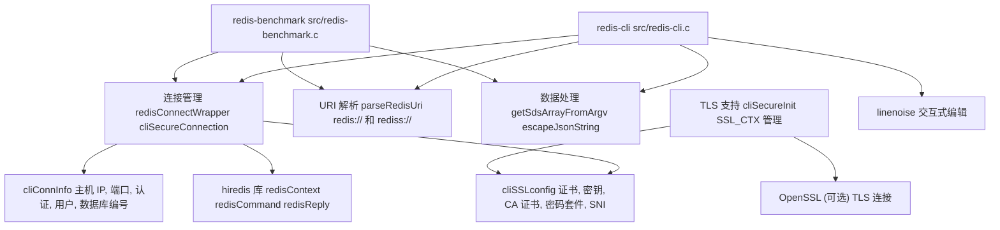

# 客户端工具

相关源文件

-   [src/cli\_common.c](https://github.com/redis/redis/blob/8ad54215/src/cli_common.c)
-   [src/cli\_common.h](https://github.com/redis/redis/blob/8ad54215/src/cli_common.h)
-   [src/redis-benchmark.c](https://github.com/redis/redis/blob/8ad54215/src/redis-benchmark.c)
-   [src/redis-cli.c](https://github.com/redis/redis/blob/8ad54215/src/redis-cli.c)
-   [tests/integration/redis-benchmark.tcl](https://github.com/redis/redis/blob/8ad54215/tests/integration/redis-benchmark.tcl)
-   [tests/integration/redis-cli.tcl](https://github.com/redis/redis/blob/8ad54215/tests/integration/redis-cli.tcl)
-   [tests/support/benchmark.tcl](https://github.com/redis/redis/blob/8ad54215/tests/support/benchmark.tcl)
-   [tests/unit/limits.tcl](https://github.com/redis/redis/blob/8ad54215/tests/unit/limits.tcl)

客户端工具（Client Tools）提供了用于与 Redis 服务器进行交互和测试的命令行实用程序。该系统由两个主要工具组成：用于直接与 Redis 交互和管理的交互式命令行界面 `redis-cli`，以及用于测量 Redis 服务器性能的性能测试工具 `redis-benchmark`。

这些工具共享用于连接管理、身份验证和协议处理的通用基础设施，使它们在 Redis 操作中表现出一致性和可靠性。

有关这些工具及其实现的详细信息，请参阅 [Redis CLI 与基准测试工具](/redis/redis/9.1-redis-cli-and-benchmark-tools)。

## 客户端工具概览

### Redis CLI (`redis-cli`)

主要的 Redis 命令行界面，在 [src/redis-cli.c](https://github.com/redis/redis/blob/8ad54215/src/redis-cli.c) 中实现，提供以下功能：

-   **交互模式**：具有命令历史、Tab 键补全和内联提示功能的全功能 REPL。
-   **非交互模式**：用于脚本编写的单条命令执行。
-   **专用模式**：监控、发布/订阅、集群管理、从节点同步等。
-   **输出格式**：针对不同用例提供标准（Standard）、原始（Raw）、CSV、JSON 等格式。
-   **集群管理**：内置集群管理工具。

### Redis 基准测试 (`redis-benchmark`)

性能测试工具，在 [src/redis-benchmark.c](https://github.com/redis/redis/blob/8ad54215/src/redis-benchmark.c) 中实现，提供以下功能：

-   **负载生成**：可配置的客户端连接数、请求流水线和线程。
-   **测试场景**：针对常见 Redis 操作的内置基准测试。
-   **指标收集**：延迟直方图和吞吐量测量。
-   **集群支持**：跨集群节点的分布式测试。
-   **自定义命令**：能够对任意 Redis 命令进行基准测试。

## 共享基础设施

两个工具都通过 `cli_common.c` 和 `cli_common.h` 使用通用功能：

| 组件 | 用途 | 关键函数 |
| --- | --- | --- |
| 连接管理 | 服务器连接性 | `redisConnectWrapper()`, `cliSecureConnection()` |
| URI 支持 | 连接字符串 | 用于 `redis://` 和 `rediss://` URI 的 `parseRedisUri()` |
| 身份验证 | 安全集成 | 用户/密码处理、TLS 证书管理 |
| 数据处理 | 输入/输出处理 | `getSdsArrayFromArgv()`, `escapeJsonString()` |
| 版本信息 | 构建元数据 | 包含 git 提交信息的 `cliVersion()` |

**来源：** [src/redis-cli.c1-50](https://github.com/redis/redis/blob/8ad54215/src/redis-cli.c#L1-L50) [src/redis-benchmark.c1-50](https://github.com/redis/redis/blob/8ad54215/src/redis-benchmark.c#L1-L50) [src/cli\_common.c1-50](https://github.com/redis/redis/blob/8ad54215/src/cli_common.c#L1-L50) [src/cli\_common.h1-59](https://github.com/redis/redis/blob/8ad54215/src/cli_common.h#L1-L59)

## 架构概览

客户端工具架构



该架构将工具特定的功能与共享基础设施分离，允许两个工具都从通用的连接处理、身份验证和数据处理能力中受益。

**来源：** [src/redis-cli.c30-50](https://github.com/redis/redis/blob/8ad54215/src/redis-cli.c#L30-L50) [src/redis-benchmark.c25-50](https://github.com/redis/redis/blob/8ad54215/src/redis-benchmark.c#L25-L50) [src/cli\_common.c1-50](https://github.com/redis/redis/blob/8ad54215/src/cli_common.c#L1-L50) [src/cli\_common.h1-35](https://github.com/redis/redis/blob/8ad54215/src/cli_common.h#L1-L35)

## 连接与协议支持

客户端工具支持多种连接类型和输出格式，以满足不同的使用场景：

### 连接类型

-   **TCP/IP**：通过 `redisConnect()` 进行标准的 Redis 服务器连接。
-   **Unix 套接字**：通过 `redisConnectUnix()` 进行本地连接。
-   **TLS/SSL**：使用 OpenSSL 集成的安全连接。
-   **URI 格式**：支持 `redis://` 和 `rediss://` 连接字符串。

### 输出格式

两个工具都支持针对不同场景的多种输出模式：

| 格式 | 用途 | 实现方式 |
| --- | --- | --- |
| 标准 (Standard) | 交互式 TTY 使用 | 带有颜色和结构的格式化输出 |
| 原始 (Raw) | Shell 脚本编写 | 无格式的纯文本 |
| CSV | 数据处理 | 逗号分隔值 |
| JSON | API 集成 | 通过 `escapeJsonString()` 提供符合 RFC 7159 的 JSON |

工具会自动检测 TTY 环境与非 TTY 环境并据此调整输出。

**来源：** [src/redis-cli.c52-56](https://github.com/redis/redis/blob/8ad54215/src/redis-cli.c#L52-L56) [src/cli\_common.c294-362](https://github.com/redis/redis/blob/8ad54215/src/cli_common.c#L294-L362) [src/cli\_common.c374-393](https://github.com/redis/redis/blob/8ad54215/src/cli_common.c#L374-L393)

## 版本与构建信息

两个工具都通过通用基础设施提供版本信息：

```
sds cliVersion(void) {
    sds version = sdscatprintf(sdsempty(), "%s", REDIS_VERSION);

    /* 如果可用，添加 git 提交和工作树状态。 */
    if (strtoll(redisGitSHA1(),NULL,16)) {
        version = sdscatprintf(version, " (git:%s", redisGitSHA1());
        if (strtoll(redisGitDirty(),NULL,10))
            version = sdscatprintf(version, "-dirty");
        version = sdscat(version, ")");
    }
    return version;
}
```

**来源：** [src/cli\_common.c395-406](https://github.com/redis/redis/blob/8ad54215/src/cli_common.c#L395-L406)

## 测试基础设施

客户端工具通过集成测试获得了广泛的测试覆盖，这些测试验证了在不同场景下的功能：

-   **CLI 测试**：交互和非交互模式、输出格式化、订阅、身份验证。
-   **基准测试**：性能测量准确性、多线程、集群支持、各种工作负载。
-   **通用基础设施测试**：连接处理、TLS 支持、URI 解析。

**来源：** [tests/integration/redis-cli.tcl1-50](https://github.com/redis/redis/blob/8ad54215/tests/integration/redis-cli.tcl#L1-L50) [tests/integration/redis-benchmark.tcl1-50](https://github.com/redis/redis/blob/8ad54215/tests/integration/redis-benchmark.tcl#L1-L50) [tests/support/benchmark.tcl1-34](https://github.com/redis/redis/blob/8ad54215/tests/support/benchmark.tcl#L1-L34)
