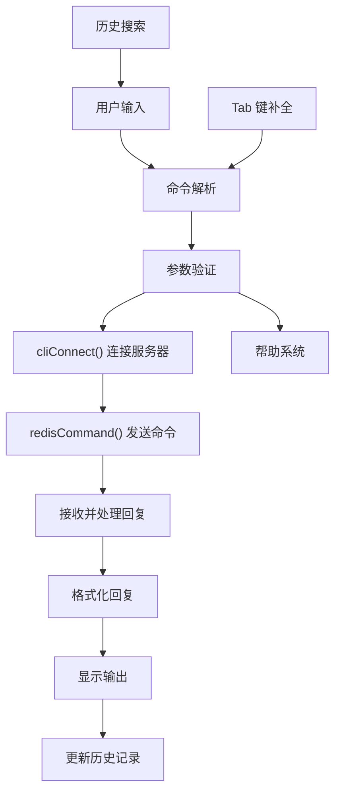
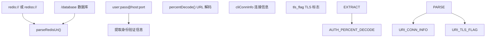

# Redis CLI 与基准测试工具

相关源文件

-   [src/cli\_common.c](https://github.com/redis/redis/blob/8ad54215/src/cli_common.c)
-   [src/cli\_common.h](https://github.com/redis/redis/blob/8ad54215/src/cli_common.h)
-   [src/redis-benchmark.c](https://github.com/redis/redis/blob/8ad54215/src/redis-benchmark.c)
-   [src/redis-cli.c](https://github.com/redis/redis/blob/8ad54215/src/redis-cli.c)
-   [tests/integration/redis-benchmark.tcl](https://github.com/redis/redis/blob/8ad54215/tests/integration/redis-benchmark.tcl)
-   [tests/integration/redis-cli.tcl](https://github.com/redis/redis/blob/8ad54215/tests/integration/redis-cli.tcl)
-   [tests/support/benchmark.tcl](https://github.com/redis/redis/blob/8ad54215/tests/support/benchmark.tcl)
-   [tests/unit/limits.tcl](https://github.com/redis/redis/blob/8ad54215/tests/unit/limits.tcl)

本文涵盖了 Redis 随附的客户端命令行工具：`redis-cli` 和 `redis-benchmark`。这些工具提供了用于 Redis 服务器管理和诊断的交互式命令执行、性能测试以及各种运维实用程序。

有关 Redis 服务器核心及网络的详细信息，请参阅[服务器架构与生命周期](/redis/redis/2.1-server-architecture-and-lifecycle)和[客户端连接管理](/redis/redis/2.2-client-connection-management)。有关这些工具使用的 Redis 安全特性的详细信息，请参阅[访问控制列表 (ACL)](/redis/redis/8.1-access-control-lists)和[网络安全与 TLS](/redis/redis/8.2-network-security-and-tls)。

## 工具概览

Redis 提供了两个主要的客户端命令行工具：

```mermaid
flowchart TD
    CLI["redis-cli"]
    BENCH["redis-benchmark"]
    COMMON["cli_common"]
    INTERACTIVE["交互式命令执行"]
    BATCH["批处理"]
    MONITOR["监控模式 (Monitor)"]
    PUBSUB["发布/订阅模式"]
    CLUSTER["集群管理"]
    PERF["性能测试"]
    MULTI["多线程"]
    PIPELINE["流水线 (Pipelining)"]
    STATS["延迟统计"]
    TLS["TLS/SSL 支持"]
    URI["URI 解析"]
    CONN["连接管理"]
    SERVER["Redis 服务器实例"]
    CLUSTER_NODES["集群节点"]

    CLI --> INTERACTIVE
    CLI --> BATCH
    CLI --> MONITOR
    CLI --> PUBSUB
    CLI --> CLUSTER
    BENCH --> PERF
    BENCH --> MULTI
    BENCH --> PIPELINE
    BENCH --> STATS
    COMMON --> TLS
    COMMON --> URI
    COMMON --> CONN
    CLI --> SERVER
    BENCH --> SERVER
    CLI --> CLUSTER_NODES
    BENCH --> CLUSTER_NODES
```

**来源：** [src/redis-cli.c1-100](https://github.com/redis/redis/blob/8ad54215/src/redis-cli.c#L1-L100) [src/redis-benchmark.c1-100](https://github.com/redis/redis/blob/8ad54215/src/redis-benchmark.c#L1-L100) [src/cli\_common.h1-59](https://github.com/redis/redis/blob/8ad54215/src/cli_common.h#L1-L59)

## Redis CLI 架构

Redis CLI 在 `redis-cli.c` 中实现，是一个支持多种运行模式和高级特性的综合命令行界面。

### 核心配置结构

```mermaid
flowchart TD
    CONFIG["config 结构体"]
    CONN_INFO["cliConnInfo 连接信息"]
    SSL_CONFIG["cliSSLconfig SSL 配置"]
    CLUSTER_CMD["clusterManagerCommand 集群管理命令"]
    HOSTIP["hostip 主机 IP"]
    HOSTPORT["hostport 端口"]
    DBNUM["input_dbnum 数据库编号"]
    AUTH["auth 认证密码"]
    USER["user 用户名"]
    INTERACTIVE["interactive 交互模式"]
    MONITOR["monitor_mode 监控模式"]
    PUBSUB["pubsub_mode 发布订阅模式"]
    CLUSTER["cluster_mode 集群模式"]
    SLAVE["slave_mode 副本模式"]
    PIPE["pipe_mode 管道模式"]
    SCAN["scan_mode 扫描模式"]
    LATENCY["latency_mode 延迟模式"]
    OUTPUT["output 输出格式"]
    STANDARD["OUTPUT_STANDARD 标准输出"]
    RAW["OUTPUT_RAW 原始输出"]
    CSV["OUTPUT_CSV CSV 格式"]
    JSON["OUTPUT_JSON JSON 格式"]

    CONN --> INFO_HOSTIP
    CONN --> INFO_HOSTPORT
    CONN --> INFO_DBNUM
    CONN --> INFO_AUTH
    CONN --> INFO_USER
    CONFIG --> INTERACTIVE
    CONFIG --> MONITOR
    CONFIG --> PUBSUB
    CONFIG --> CLUSTER
    CONFIG --> SLAVE
    CONFIG --> PIPE
    CONFIG --> SCAN
    CONFIG --> LATENCY
    CONFIG --> OUTPUT
    OUTPUT --> STANDARD
    OUTPUT --> RAW
    OUTPUT --> CSV
    OUTPUT --> JSON
```

主配置通过一个全局 `config` 结构进行管理，该结构涵盖了连接详情、运行模式以及输出格式化选项。

**来源：** [src/redis-cli.c198-270](https://github.com/redis/redis/blob/8ad54215/src/redis-cli.c#L198-L270) [src/cli\_common.h27-34](https://github.com/redis/redis/blob/8ad54215/src/cli_common.h#L27-L34)

### 命令处理流水线

**来源：** [src/redis-cli.c2800-3000](https://github.com/redis/redis/blob/8ad54215/src/redis-cli.c#L2800-L3000) [src/redis-cli.c1002-1100](https://github.com/redis/redis/blob/8ad54215/src/redis-cli.c#L1002-L1100)

### 帮助系统实现

CLI 包含一个全面的帮助系统，该系统动态加载命令文档：

**来源：** [src/redis-cli.c918-967](https://github.com/redis/redis/blob/8ad54215/src/redis-cli.c#L918-L967) [src/redis-cli.c430-445](https://github.com/redis/redis/blob/8ad54215/src/redis-cli.c#L430-L445) [src/redis-cli.c902-914](https://github.com/redis/redis/blob/8ad54215/src/redis-cli.c#L902-L914)

## Redis 基准测试架构

Redis Benchmark (基准测试) 提供了具有多线程和详细延迟分析的性能测试能力。

### 基准测试配置结构

```mermaid
flowchart TD
    CONFIG["config 结构体"]
    THREADS["benchmarkThread[] 线程数组"]
    CLIENTS["client 列表"]
    CLUSTER_NODES["clusterNode[] 集群节点数组"]
    NUMCLIENTS["numclients 客户端数量"]
    REQUESTS["requests 请求总数"]
    PIPELINE["pipeline 流水线深度"]
    NUM_THREADS["num_threads 线程数"]
    KEYSIZE["keysize 键大小"]
    DATASIZE["datasize 数据大小"]
    THREAD_STRUCT["benchmarkThread 线程结构体"]
    THREAD_ID["index 索引"]
    EVENT_LOOP["aeEventLoop *el 事件循环"]
    PTHREAD["pthread_t thread 线程句柄"]
    CLIENT_STRUCT["_client 客户端结构体"]
    CONTEXT["redisContext 上下文"]
    OBUF["sds obuf 输出缓冲区"]
    THREAD_ID_CLIENT["thread_id 线程 ID"]

    CONFIG --> NUMCLIENTS
    CONFIG --> REQUESTS
    CONFIG --> PIPELINE
    CONFIG --> NUM_THREADS
    CONFIG --> KEYSIZE
    CONFIG --> DATASIZE
    THREADS --> THREAD_STRUCT
    THREAD --> STRUCT_THREAD_ID
    THREAD --> STRUCT_EVENT_LOOP
    THREAD --> STRUCT_PTHREAD
    CLIENTS --> CLIENT_STRUCT
    CLIENT --> STRUCT_CONTEXT
    CLIENT --> STRUCT_OBUF
    CLIENT --> STRUCT_THREAD_ID_CLIENT
```

**来源：** [src/redis-benchmark.c61-108](https://github.com/redis/redis/blob/8ad54215/src/redis-benchmark.c#L61-L108) [src/redis-benchmark.c134-138](https://github.com/redis/redis/blob/8ad54215/src/redis-benchmark.c#L134-L138) [src/redis-benchmark.c110-130](https://github.com/redis/redis/blob/8ad54215/src/redis-benchmark.c#L110-L130)

### 基准测试执行流程

```mermaid
flowchart TD
    PARSE_ARGS["解析参数"]
    CREATE_THREADS["createBenchmarkThread() 创建线程"]
    CREATE_CLIENTS["createMissingClients() 创建缺失客户端"]
    WRITE_HANDLER["writeHandler() 写处理程序"]
    READ_HANDLER["readHandler() 读处理程序"]
    CLIENT_DONE["clientDone() 客户端完成"]
    LATENCY_HIST["hdr_histogram 延迟直方图"]
    THROUGHPUT["showThroughput() 显示吞吐量"]
    STATS_COLLECTION["统计数据收集"]
    MAIN_THREAD["主线程"]
    WORKER_THREADS["工作线程"]
    EXEC_THREAD["execBenchmarkThread() 执行线程逻辑"]

    PARSE --> ARGS_CREATE_THREADS
    CREATE --> THREADS_CREATE_CLIENTS
    CREATE --> CLIENTS_WRITE_HANDLER
    WRITE --> HANDLER_READ_HANDLER
    READ --> HANDLER_CLIENT_DONE
    READ --> HANDLER_LATENCY_HIST
    MAIN --> THREAD_WORKER_THREADS
    WORKER --> THREADS_EXEC_THREAD
    EXEC --> THREAD_THROUGHPUT
    THROUGHPUT --> STATS_COLLECTION
```

**来源：** [src/redis-benchmark.c555-602](https://github.com/redis/redis/blob/8ad54215/src/redis-benchmark.c#L555-L602) [src/redis-benchmark.c442-553](https://github.com/redis/redis/blob/8ad54215/src/redis-benchmark.c#L442-L553) [src/redis-benchmark.c169-182](https://github.com/redis/redis/blob/8ad54215/src/redis-benchmark.c#L169-L182)

### 延迟测量系统

```mermaid
flowchart TD
    HDR_HISTOGRAM["hdr_histogram 延迟分布"]
    CURRENT_SEC["current_sec_latency_histogram 当前秒延迟"]
    ATOMIC_RECORD["hdr_record_value_atomic() 原子记录"]
    START_TIME["ustime() - 开始时间"]
    END_TIME["ustime() - 延迟计算时间"]
    PRECISION["DEFAULT_LATENCY_PRECISION 默认精度"]
    MIN_VALUE["CONFIG_LATENCY_HISTOGRAM_MIN_VALUE 最小值"]
    MAX_VALUE["CONFIG_LATENCY_HISTOGRAM_MAX_VALUE 最大值"]
    PERCENTILES["百分位计算"]

    START --> TIME_END_TIME
    END --> TIME_ATOMIC_RECORD
    ATOMIC --> RECORD_HDR_HISTOGRAM
    ATOMIC --> RECORD_CURRENT_SEC
    HDR --> HISTOGRAM_PERCENTILES
    PERCENTILES --> MIN_VALUE
    PERCENTILES --> MAX_VALUE
```

**来源：** [src/redis-benchmark.c49-51](https://github.com/redis/redis/blob/8ad54215/src/redis-benchmark.c#L49-L51) [src/redis-benchmark.c528-542](https://github.com/redis/redis/blob/8ad54215/src/redis-benchmark.c#L528-L542) [src/redis-benchmark.c452](https://github.com/redis/redis/blob/8ad54215/src/redis-benchmark.c#L452-L452)

## 通用客户端功能

`cli_common` 模块在 Redis 客户端工具之间提供了共享的功能。

### 连接管理

| 函数 | 用途 | 关键特性 |
| --- | --- | --- |
| `cliSecureConnection()` | TLS/SSL 设置 | 证书验证、加密套件配置 |
| `parseRedisUri()` | URI 解析 | 支持 `redis://` 和 `rediss://` 协议方案 |
| `cliWriteConn()` | 原始连接写入 | 透明的 TLS 支持、缓冲区管理 |
| `redisConnectWrapper()` | 连接包装器 | 超时支持、错误处理 |

### SSL/TLS 配置结构

```mermaid
flowchart TD
    SSL_CONFIG["cliSSLconfig 结构体"]
    SSL_CTX["SSL_CTX 上下文"]
    SSL_OBJECT["SSL 对象"]
    SNI["sni 服务器名称指示"]
    CACERT["cacert CA 证书"]
    CACERTDIR["cacertdir CA 目录"]
    CERT["cert 证书"]
    KEY["key 密钥"]
    CIPHERS["ciphers 加密套件"]
    CIPHERSUITES["ciphersuites TLSv1.3 加密套件"]
    SKIP_VERIFY["skip_cert_verify 跳过证书验证"]
    SECURE_INIT["cliSecureInit() 初始化"]
    SECURE_CONN["cliSecureConnection() 加密连接"]
    SSL_INIT["redisInitiateSSL() 开启 SSL"]

    SSL --> CONFIG_SNI
    SSL --> CONFIG_CACERT
    SSL --> CONFIG_CACERTDIR
    SSL --> CONFIG_CERT
    SSL --> CONFIG_KEY
    SSL --> CONFIG_CIPHERS
    SSL --> CONFIG_CIPHERSUITES
    SSL --> CONFIG_SKIP_VERIFY
    SECURE --> INIT_SSL_CTX
    SSL --> CTX_SECURE_CONN
    SECURE --> CONN_SSL_OBJECT
    SSL --> OBJECT_SSL_INIT
```

**来源：** [src/cli\_common.c39-109](https://github.com/redis/redis/blob/8ad54215/src/cli_common.c#L39-L109) [src/cli\_common.h7-24](https://github.com/redis/redis/blob/8ad54215/src/cli_common.h#L7-L24)

### URI 解析实现

URI 解析系统支持带有身份验证和数据库选择的 Redis 连接 URI：

**来源：** [src/cli\_common.c294-362](https://github.com/redis/redis/blob/8ad54215/src/cli_common.c#L294-L362) [src/cli\_common.c257-284](https://github.com/redis/redis/blob/8ad54215/src/cli_common.c#L257-L284)

## 集群支持

两个工具都包含全面的 Redis 集群 (Cluster) 支持，具备自动槽位映射和故障转移处理能力。

### CLI 中的集群管理

```mermaid
flowchart TD
    CLUSTER_CMD["clusterManagerCommand"]
    NODE_ARRAY["clusterNode[] 节点数组"]
    SLOT_CONFIG["槽位配置"]
    CREATE_CLUSTER["create 创建"]
    CHECK_CLUSTER["check 检查"]
    REBALANCE["rebalance 重新平衡"]
    RESHARD["reshard 重新分片"]
    ADD_NODE["add-node 添加节点"]
    DEL_NODE["del-node 删除节点"]
    NODE_STRUCT["clusterNode 结构体"]
    NODE_IP["ip 地址"]
    NODE_PORT["port 端口"]
    SLOTS["slots[] 槽位"]
    FLAGS["flags 标志位"]

    NODE --> ARRAY_NODE_STRUCT
    NODE --> STRUCT_NODE_IP
    NODE --> STRUCT_NODE_PORT
    NODE --> STRUCT_SLOTS
    NODE --> STRUCT_FLAGS
    CLUSTER --> CMD_CREATE_CLUSTER
    CLUSTER --> CMD_CHECK_CLUSTER
    CLUSTER --> CMD_REBALANCE
    CLUSTER --> CMD_RESHARD
    CLUSTER --> CMD_ADD_NODE
    CLUSTER --> CMD_DEL_NODE
    NODE --> ARRAY_SLOT_CONFIG
```

**来源：** [src/redis-cli.c172-192](https://github.com/redis/redis/blob/8ad54215/src/redis-cli.c#L172-L192) [src/redis-cli.c66-118](https://github.com/redis/redis/blob/8ad54215/src/redis-cli.c#L66-L118)

### 基准测试集群支持

```mermaid
flowchart TD
    CLUSTER_MODE["cluster_mode 集群模式"]
    SLOT_UPDATE["updateClusterSlotsConfiguration() 更新槽位"]
    HASHTAG["setClusterKeyHashTag() 设置哈希标签"]
    FETCH_SLOTS["fetchClusterSlotsConfiguration() 获取槽位"]
    CRC16_TABLE["crc16_slot_table[] 槽位表"]
    SLOT_ASSIGNMENT["随机槽位选择"]
    MOVED_ERROR["MOVED 响应"]
    ASK_ERROR["ASK 响应"]
    CLUSTER_DOWN["CLUSTERDOWN 响应"]

    CLUSTER --> MODE_SLOT_UPDATE
    SLOT --> UPDATE_FETCH_SLOTS
    FETCH --> SLOTS_CRC16_TABLE
    CRC16 --> TABLE_HASHTAG
    HASHTAG --> SLOT_ASSIGNMENT
    MOVED --> ERROR_FETCH_SLOTS
    ASK --> ERROR_FETCH_SLOTS
    CLUSTER --> DOWN_FETCH_SLOTS
```

**来源：** [src/redis-benchmark.c395-418](https://github.com/redis/redis/blob/8ad54215/src/redis-benchmark.c#L395-L418) [src/redis-benchmark.c475-492](https://github.com/redis/redis/blob/8ad54215/src/redis-benchmark.c#L475-L492) [src/redis-benchmark.c179-180](https://github.com/redis/redis/blob/8ad54215/src/redis-benchmark.c#L179-L180)

## 测试与验证

两个工具都包含全面的测试套件，验证了不同场景下的功能。

### CLI 测试覆盖

| 测试类别 | 测试文件位置 | 关键特性 |
| --- | --- | --- |
| 交互式 CLI | [tests/integration/redis-cli.tcl80-86](https://github.com/redis/redis/blob/8ad54215/tests/integration/redis-cli.tcl#L80-L86) | 终端交互、历史搜索 |
| 命令解析 | [tests/integration/redis-cli.tcl380-397](https://github.com/redis/redis/blob/8ad54215/tests/integration/redis-cli.tcl#L380-L397) | 引号处理、参数验证 |
| 订阅模式 | [tests/integration/redis-cli.tcl399-444](https://github.com/redis/redis/blob/8ad54215/tests/integration/redis-cli.tcl#L399-L444) | 发布/订阅、推送消息处理 |
| 输出格式 | [tests/integration/redis-cli.tcl518-540](https://github.com/redis/redis/blob/8ad54215/tests/integration/redis-cli.tcl#L518-L540) | JSON、CSV、原始输出 |
| URI 连接 | [tests/integration/redis-cli.tcl40-51](https://github.com/redis/redis/blob/8ad54215/tests/integration/redis-cli.tcl#L40-L51) | 身份验证、TLS |

### 基准测试测试覆盖

| 测试类别 | 测试文件位置 | 关键特性 |
| --- | --- | --- |
| 基础基准测试 | [tests/integration/redis-benchmark.tcl34-38](https://github.com/redis/redis/blob/8ad54215/tests/integration/redis-benchmark.tcl#L34-L38) | set/get 操作 |
| 多线程 | [tests/integration/redis-benchmark.tcl78-85](https://github.com/redis/redis/blob/8ad54215/tests/integration/redis-benchmark.tcl#L78-L85) | 线程安全、统计数据 |
| 流水线 (Pipelining) | [tests/integration/redis-benchmark.tcl87-97](https://github.com/redis/redis/blob/8ad54215/tests/integration/redis-benchmark.tcl#L87-L97) | 流水线深度验证 |
| 自定义命令 | [tests/integration/redis-benchmark.tcl99-108](https://github.com/redis/redis/blob/8ad54215/tests/integration/redis-benchmark.tcl#L99-L108) | 任意命令执行 |
| TLS 支持 | [tests/integration/redis-benchmark.tcl139-176](https://github.com/redis/redis/blob/8ad54215/tests/integration/redis-benchmark.tcl#L139-L176) | 加密套件配置 |

**来源：** [tests/integration/redis-cli.tcl1-50](https://github.com/redis/redis/blob/8ad54215/tests/integration/redis-cli.tcl#L1-L50) [tests/integration/redis-benchmark.tcl1-50](https://github.com/redis/redis/blob/8ad54215/tests/integration/redis-benchmark.tcl#L1-L50)
