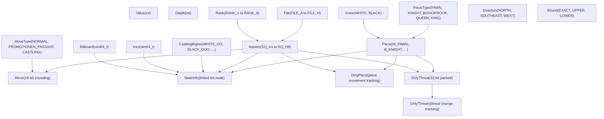
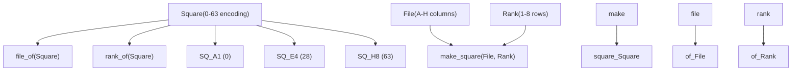
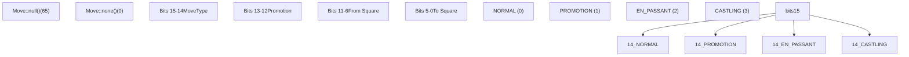
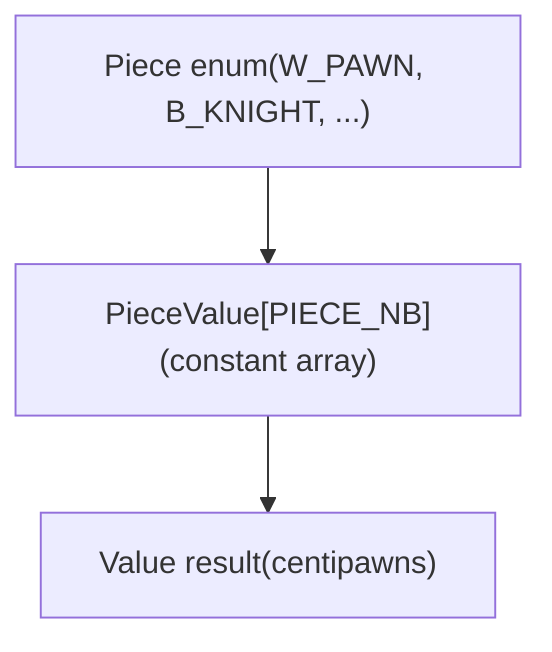
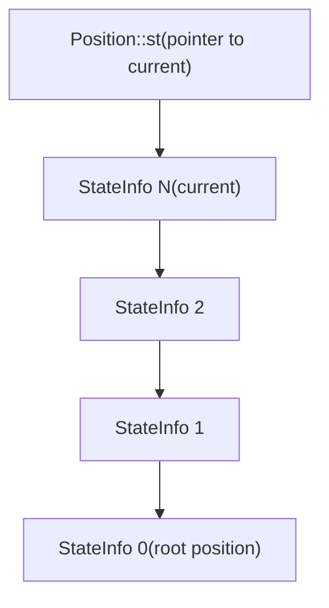
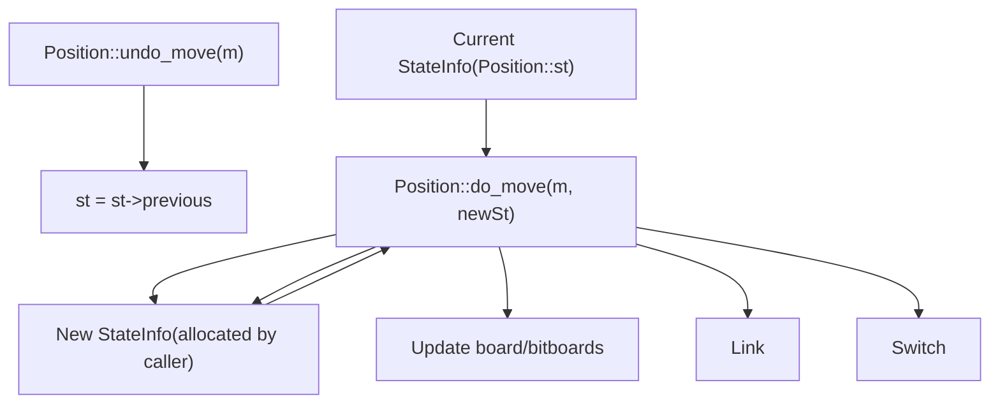
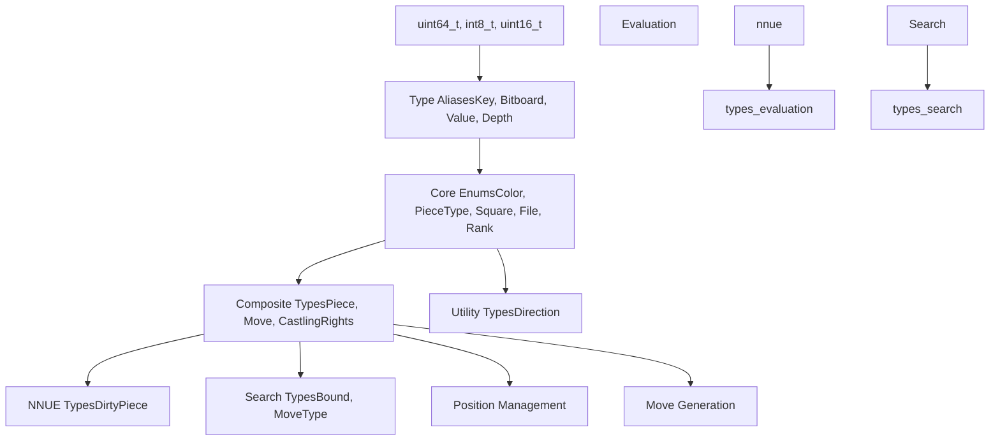

# Core Data Structures and Types

Relevant source files

-   [src/position.h](https://github.com/official-stockfish/Stockfish/blob/c27c1747/src/position.h)
-   [src/types.h](https://github.com/official-stockfish/Stockfish/blob/c27c1747/src/types.h)

This document covers the fundamental data types, enumerations, and utility systems that form the foundation of the Stockfish engine. These include chess-specific types defined in `src/types.h` for representing positions, moves, and evaluation values, as well as infrastructure types and utility systems defined in `src/misc.h` and `src/misc.cpp` that provide foundational functionality across the engine.

For information about how these types are used in board representation, see [Board Representation](/official-stockfish/Stockfish/3-board-representation). For details on how moves are generated and processed, see [Move Generation](/official-stockfish/Stockfish/3.3-move-generation). For evaluation-specific value handling, see [Evaluation System](/official-stockfish/Stockfish/5-evaluation-system). For additional utility functions and debugging tools, see [Utilities and Support Functions](/official-stockfish/Stockfish/7.2-utilities-and-support-functions).

## Type System Overview

Stockfish uses a strongly-typed system based on C++ enums and type aliases to represent chess concepts precisely, combined with utility types and infrastructure systems that provide foundational functionality. The core philosophy is to use distinct types for different concepts to prevent programming errors and make the code self-documenting.


Sources: [src/types.h114-335](https://github.com/official-stockfish/Stockfish/blob/c27c1747/src/types.h#L114-L335) [src/position.h42-64](https://github.com/official-stockfish/Stockfish/blob/c27c1747/src/position.h#L42-L64)

## Chess Entity Representation

### Colors and Pieces

The `Color` enum represents the two players, while `PieceType` and `Piece` represent chess pieces with and without color information respectively.

| Type | Values | Purpose |
| --- | --- | --- |
| `Color` | `WHITE`, `BLACK` | Player identification |
| `PieceType` | `PAWN`, `KNIGHT`, `BISHOP`, `ROOK`, `QUEEN`, `KING` | Piece types without color |
| `Piece` | `W_PAWN`, `B_KNIGHT`, etc. | Colored pieces (combines Color + PieceType) |

The `Piece` enum cleverly encodes both color and piece type in a single value using bit manipulation:

-   White pieces: `W_PAWN = 1`, `W_KNIGHT = 2`, ..., `W_KING = 6`
-   Black pieces: `B_PAWN = 9`, `B_KNIGHT = 10`, ..., `B_KING = 14`

Utility functions extract components:

-   `color_of(piece)` returns the `Color` of a `Piece`
-   `type_of(piece)` returns the `PieceType` of a `Piece`
-   `make_piece(color, piece_type)` creates a `Piece` from components

Sources: [src/types.h119-123](https://github.com/official-stockfish/Stockfish/blob/c27c1747/src/types.h#L119-L123) [src/types.h192-203](https://github.com/official-stockfish/Stockfish/blob/c27c1747/src/types.h#L192-L203) [src/types.h335-342](https://github.com/official-stockfish/Stockfish/blob/c27c1747/src/types.h#L335-L342)

### Board Coordinates


Squares are represented as integers from 0-63, where:

-   `SQ_A1 = 0`, `SQ_B1 = 1`, ..., `SQ_H1 = 7`
-   `SQ_A2 = 8`, `SQ_B2 = 9`, ..., `SQ_H8 = 63`

The encoding formula is: `square = rank * 8 + file`

Sources: [src/types.h229-242](https://github.com/official-stockfish/Stockfish/blob/c27c1747/src/types.h#L229-L242) [src/types.h257-279](https://github.com/official-stockfish/Stockfish/blob/c27c1747/src/types.h#L257-L279) [src/types.h333-354](https://github.com/official-stockfish/Stockfish/blob/c27c1747/src/types.h#L333-L354)

## Move Representation

The `Move` class encodes all move information in a compact 16-bit format:

| Bits | Content | Range |
| --- | --- | --- |
| 0-5 | Destination square | 0-63 |
| 6-11 | Origin square | 0-63 |
| 12-13 | Promotion piece type | KNIGHT-2 to QUEEN-2 |
| 14-15 | Special move flags | NORMAL, PROMOTION, EN\_PASSANT, CASTLING |


Key `Move` methods:

-   `from_sq()` and `to_sq()` extract source and destination squares
-   `type_of()` returns the `MoveType`
-   `promotion_type()` returns the promoted piece type for promotion moves
-   `make<MoveType>(from, to, piece_type)` creates moves with specific types

Sources: [src/types.h365-432](https://github.com/official-stockfish/Stockfish/blob/c27c1747/src/types.h#L365-L432)

## Value System and Evaluation

### Value Type and Constants

The `Value` type alias represents evaluation scores and game-theoretic values:

| Constant | Value | Purpose |
| --- | --- | --- |
| `VALUE_DRAW` | 0 | Draw evaluation |
| `VALUE_MATE` | 32000 | Checkmate base value |
| `VALUE_INFINITE` | 32001 | Infinite bound |
| `VALUE_NONE` | 32002 | Invalid/uninitialized value |

Mate scoring uses distance-to-mate encoding:

-   `mate_in(ply)` returns `VALUE_MATE - ply`
-   `mated_in(ply)` returns `-VALUE_MATE + ply`

### Piece Values

Standard piece values used in evaluation:

| Piece Type | Value | Purpose |
| --- | --- | --- |
| `PawnValue` | 208 | Pawn base value |
| `KnightValue` | 781 | Knight base value |
| `BishopValue` | 825 | Bishop base value |
| `RookValue` | 1276 | Rook base value |
| `QueenValue` | 2538 | Queen base value |


The `PieceValue` array provides O(1) lookup of piece values indexed by the `Piece` enum. These values are used for material counting and as starting points for more sophisticated NNUE evaluation.

Sources: [src/types.h185-209](https://github.com/official-stockfish/Stockfish/blob/c27c1747/src/types.h#L185-L209)

## Game State Types

### Castling Rights

The `CastlingRights` enum uses bit flags to efficiently represent castling availability:

| Flag | Bit Value | Meaning |
| --- | --- | --- |
| `WHITE_OO` | 1 | White kingside castling |
| `WHITE_OOO` | 2 | White queenside castling |
| `BLACK_OO` | 4 | Black kingside castling |
| `BLACK_OOO` | 8 | Black queenside castling |

Composite flags enable efficient operations:

-   `WHITE_CASTLING = WHITE_OO | WHITE_OOO`
-   `ANY_CASTLING = WHITE_CASTLING | BLACK_CASTLING`

### Search Bounds

The `Bound` enum represents transposition table entry types:

-   `BOUND_EXACT`: Exact minimax value
-   `BOUND_UPPER`: Upper bound (beta cutoff)
-   `BOUND_LOWER`: Lower bound (alpha cutoff)
-   `BOUND_NONE`: No bound information

Sources: [src/types.h125-139](https://github.com/official-stockfish/Stockfish/blob/c27c1747/src/types.h#L125-L139) [src/types.h141-146](https://github.com/official-stockfish/Stockfish/blob/c27c1747/src/types.h#L141-L146)

## NNUE Integration Types

### DirtyPiece Structure

The `DirtyPiece` struct tracks piece movements for efficient NNUE neural network updates:

```
struct DirtyPiece {
    Piece  pc;        // moved piece (never NO_PIECE)
    Square from, to;  // source and destination

    // For complex moves like castling:
    Square remove_sq, add_sq;  // additional piece movements
    Piece  remove_pc, add_pc;  // additional pieces affected
};
```
This structure enables incremental NNUE evaluation updates rather than full position re-evaluation after each move.

Sources: [src/types.h283-292](https://github.com/official-stockfish/Stockfish/blob/c27c1747/src/types.h#L283-L292)

### DirtyThreats Structure

The `DirtyThreats` struct tracks changes in piece threats for NNUE threat feature updates:

```
struct DirtyThreats {
    DirtyThreatList list;        // List of threat changes
    Color           us;          // Side to move
    Square          prevKsq, ksq; // Previous and current king squares
    Bitboard        threatenedSqs, threateningSqs; // Threat bitboards
};
```
Individual threat changes are represented by `DirtyThreat`, which packs threat information into a 32-bit value encoding the attacking piece, threatened piece, and their squares. A move can change up to 80 threat features (96 with padding for vector operations).

Sources: [src/types.h294-335](https://github.com/official-stockfish/Stockfish/blob/c27c1747/src/types.h#L294-L335)

## Position State Management

### StateInfo Structure

The `StateInfo` struct stores all information needed to restore a `Position` to its previous state when retracting a move. This forms a linked list through game history, enabling efficient undo operations.

#### StateInfo Linked List Architecture


Sources: [src/position.h42-64](https://github.com/official-stockfish/Stockfish/blob/c27c1747/src/position.h#L42-L64)

#### StateInfo Field Categories

The `StateInfo` struct contains two categories of data:

**Copied Fields** (preserved when making moves):

-   `materialKey`, `pawnKey`, `minorPieceKey` - Hash keys for position features
-   `nonPawnKey[COLOR_NB]` - Per-color non-pawn material hash keys
-   `nonPawnMaterial[COLOR_NB]` - Material values excluding pawns
-   `castlingRights` - Current castling availability
-   `rule50` - Half-move clock for 50-move rule
-   `pliesFromNull` - Plies since last null move
-   `epSquare` - En passant target square

**Computed Fields** (recalculated after each move):

-   `key` - Zobrist hash key for the full position
-   `checkersBB` - Bitboard of pieces giving check
-   `blockersForKing[COLOR_NB]` - Pieces blocking attacks on kings
-   `pinners[COLOR_NB]` - Pieces pinning opponent pieces to their king
-   `checkSquares[PIECE_TYPE_NB]` - Squares from which each piece type gives check
-   `capturedPiece` - Piece captured by the last move (for undo)
-   `repetition` - Repetition status for draw detection

Sources: [src/position.h42-64](https://github.com/official-stockfish/Stockfish/blob/c27c1747/src/position.h#L42-L64)

#### StateInfo Usage in Move Operations


Sources: [src/position.h137-147](https://github.com/official-stockfish/Stockfish/blob/c27c1747/src/position.h#L137-L147) [src/position.h405-410](https://github.com/official-stockfish/Stockfish/blob/c27c1747/src/position.h#L405-L410)

The linked list design enables O(1) undo operations - simply move the pointer back. All position state is preserved in the chain, allowing the search to efficiently explore and backtrack through the game tree.

## Type System Architecture


This layered type system provides:

1.  **Foundation**: Standard integer types and aliases
2.  **Chess Abstraction**: Domain-specific enums and structures
3.  **System Integration**: Specialized types for subsystems
4.  **Higher-Level Usage**: Complex chess engine components

The design ensures type safety while maintaining efficiency through careful bit-packing and enum design.

Sources: [src/types.h113-447](https://github.com/official-stockfish/Stockfish/blob/c27c1747/src/types.h#L113-L447)
