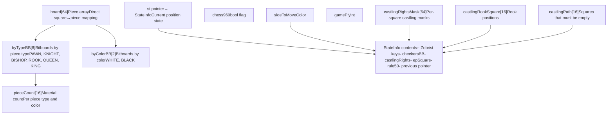
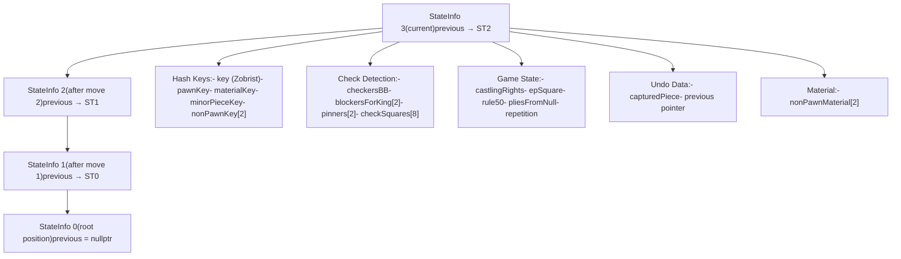
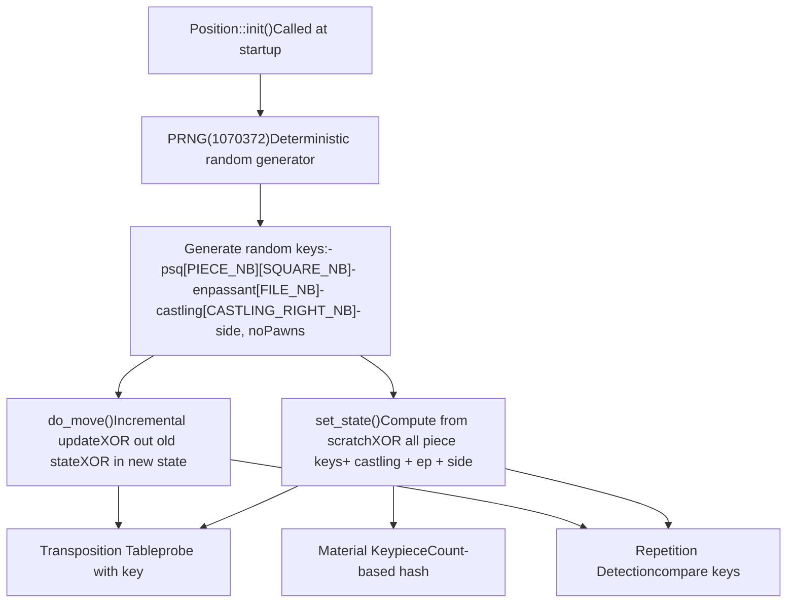
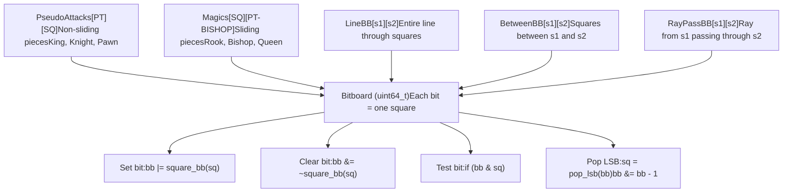
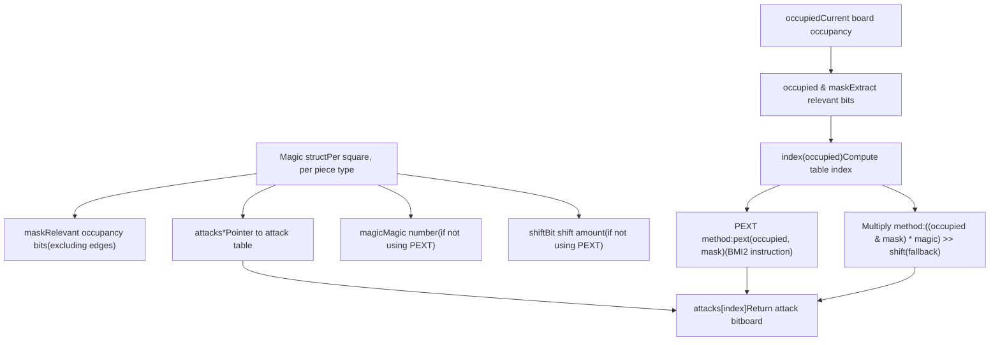
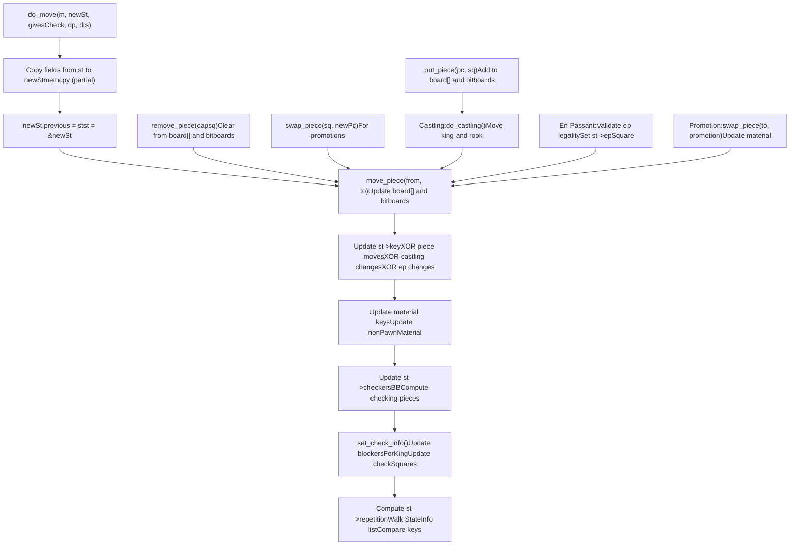
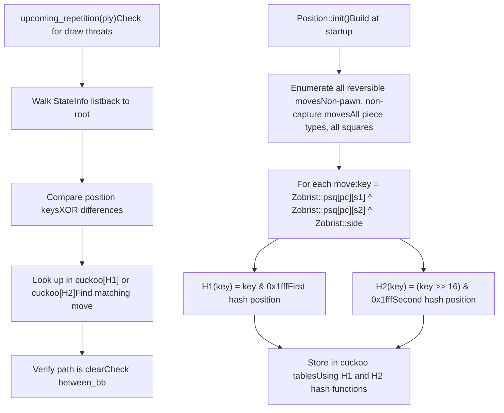

# Board Representation

Relevant source files

-   [src/bitboard.cpp](https://github.com/official-stockfish/Stockfish/blob/c27c1747/src/bitboard.cpp)
-   [src/bitboard.h](https://github.com/official-stockfish/Stockfish/blob/c27c1747/src/bitboard.h)
-   [src/position.cpp](https://github.com/official-stockfish/Stockfish/blob/c27c1747/src/position.cpp)

## Purpose and Scope

This document explains how Stockfish represents chess board state internally. The engine maintains multiple synchronized representations optimized for different operations: a piece array for direct lookup, bitboards for parallel operations, and various hash keys for fast position comparison. These representations work together to enable efficient move generation, position evaluation, and search operations.

For details on the `Position` class and state management, see [Position and State Management](/official-stockfish/Stockfish/3.1-position-and-state-management). For low-level bitboard operations and magic bitboards, see [Bitboards and Low-level Operations](/official-stockfish/Stockfish/3.2-bitboards-and-low-level-operations). For how these representations support move generation, see [Move Generation](/official-stockfish/Stockfish/3.3-move-generation).

---

## Overview of Multiple Synchronized Representations

Stockfish maintains several synchronized views of the board state within the `Position` class. Each representation is optimized for specific operations, trading memory for performance:

| Representation | Type | Purpose | Key Operations |
| --- | --- | --- | --- |
| `board[64]` | `Piece` array | Direct square lookup | O(1) piece query by square |
| `byTypeBB[PIECE_TYPE_NB]` | Bitboard array | All pieces of a type | Parallel operations on piece types |
| `byColorBB[COLOR_NB]` | Bitboard array | All pieces of a color | Fast color-based queries |
| `pieceCount[PIECE_NB]` | Count array | Material counting | Fast piece counting |
| `st` pointer | `StateInfo*` | Current state data | Hash keys, check info, game state |

All these representations must remain synchronized during move execution and undo operations. This redundancy enables the engine to choose the most efficient data structure for each operation.

**Sources:** [src/position.h](https://github.com/official-stockfish/Stockfish/blob/c27c1747/src/position.h) [src/position.cpp205-207](https://github.com/official-stockfish/Stockfish/blob/c27c1747/src/position.cpp#L205-L207)

---

## Position Class Architecture

The `Position` class is the central data structure representing a chess position. Here's how its components interact:


The `Position` class maintains these fields in strict synchronization. When a piece moves, all four core data structures are updated atomically through internal helper functions like `move_piece()`, `put_piece()`, and `remove_piece()`.

**Sources:** [src/position.h](https://github.com/official-stockfish/Stockfish/blob/c27c1747/src/position.h) [src/position.cpp205-296](https://github.com/official-stockfish/Stockfish/blob/c27c1747/src/position.cpp#L205-L296)

---

## StateInfo Linked List Design

Stockfish uses a linked list of `StateInfo` structures to enable efficient move undo. Each `StateInfo` node stores incremental state that cannot be easily recomputed:


This design enables O(1) undo: simply restore the `st` pointer to `st->previous`. The `Position::do_move()` function creates a new `StateInfo` node, copies necessary fields from the previous state, updates changed fields, and links it into the list.

**Sources:** [src/position.cpp697-990](https://github.com/official-stockfish/Stockfish/blob/c27c1747/src/position.cpp#L697-L990) [src/position.cpp995-1053](https://github.com/official-stockfish/Stockfish/blob/c27c1747/src/position.cpp#L995-L1053)

---

## Zobrist Hashing System

Stockfish uses Zobrist hashing to generate unique 64-bit keys for positions, enabling fast position comparison and transposition table lookup. The hash is incrementally maintained as moves are made:


The Zobrist key for a position is computed as:

```
key = 0
for each piece p on square s:
    key ^= Zobrist::psq[p][s]
if (epSquare != SQ_NONE):
    key ^= Zobrist::enpassant[file_of(epSquare)]
key ^= Zobrist::castling[castlingRights]
if (sideToMove == BLACK):
    key ^= Zobrist::side
```
During `do_move()`, the key is updated incrementally by XORing out removed pieces and XORing in added pieces, making it much faster than recomputing from scratch.

**Sources:** [src/position.cpp46-53](https://github.com/official-stockfish/Stockfish/blob/c27c1747/src/position.cpp#L46-L53) [src/position.cpp115-158](https://github.com/official-stockfish/Stockfish/blob/c27c1747/src/position.cpp#L115-L158) [src/position.cpp338-380](https://github.com/official-stockfish/Stockfish/blob/c27c1747/src/position.cpp#L338-L380) [src/position.cpp697-990](https://github.com/official-stockfish/Stockfish/blob/c27c1747/src/position.cpp#L697-L990)

---

## Bitboard Fundamentals

Bitboards are 64-bit integers where each bit represents one square of the chessboard. Bit 0 represents A1, bit 7 represents H1, bit 56 represents A8, and bit 63 represents H8. This representation enables parallel operations on multiple squares:


Key bitboard operations:

| Operation | Code | Description |
| --- | --- | --- |
| Create single bit | `square_bb(sq)` | Returns bitboard with single bit set |
| Count bits | `popcount(bb)` | Counts set bits (pieces on board) |
| Get LSB | `lsb(bb)` | Returns lowest set bit position |
| Pop LSB | `pop_lsb(bb)` | Returns and clears lowest set bit |
| Test if multiple | `more_than_one(bb)` | Returns true if >1 bit set |
| Get MSB | `msb(bb)` | Returns highest set bit position |

**Sources:** [src/bitboard.h97-118](https://github.com/official-stockfish/Stockfish/blob/c27c1747/src/bitboard.h#L97-L118) [src/bitboard.h207-233](https://github.com/official-stockfish/Stockfish/blob/c27c1747/src/bitboard.h#L207-L233) [src/bitboard.h236-317](https://github.com/official-stockfish/Stockfish/blob/c27c1747/src/bitboard.h#L236-L317)

---

## Magic Bitboards for Sliding Pieces

Magic bitboards are a fast technique for computing sliding piece attacks (rooks, bishops, queens). Instead of iteratively scanning rays, Stockfish uses precomputed attack tables indexed by a magic multiplication:


The `Magic` struct stores precomputed data for each square:

```
// From bitboard.h
struct Magic {
    Bitboard  mask;      // Relevant occupancy bits
    Bitboard* attacks;   // Attack table pointer
    #ifndef USE_PEXT
    Bitboard magic;      // Magic multiplier
    unsigned shift;      // Right shift amount
    #endif

    unsigned index(Bitboard occupied) const;
    Bitboard attacks_bb(Bitboard occupied) const;
};
```
At startup, `Bitboards::init()` computes magic numbers and populates attack tables using the "fancy magic bitboards" approach. For each square and piece type, it:

1.  Computes the attack mask (sliding attacks on empty board, excluding edges)
2.  Enumerates all possible occupancy patterns within the mask
3.  For each occupancy, computes the actual sliding attacks
4.  Finds a magic number that maps each occupancy to a unique index
5.  Stores attacks in the table at the corresponding index

During search, attack lookup is extremely fast: `attacks_bb<ROOK>(sq, occupied)` performs a single table lookup after computing the index.

**Sources:** [src/bitboard.h69-93](https://github.com/official-stockfish/Stockfish/blob/c27c1747/src/bitboard.h#L69-L93) [src/bitboard.cpp102-183](https://github.com/official-stockfish/Stockfish/blob/c27c1747/src/bitboard.cpp#L102-L183) [src/bitboard.h414-429](https://github.com/official-stockfish/Stockfish/blob/c27c1747/src/bitboard.h#L414-L429)

---

## Move Execution and Undo

Stockfish's move execution maintains synchronization across all representations. The `do_move()` function performs these operations:


The corresponding `undo_move()` is much simpler:

1.  Flip `sideToMove` back
2.  Restore captured piece (if any) using `put_piece()`
3.  Move piece back from destination to source
4.  Restore `st` pointer: `st = st->previous`
5.  Decrement `gamePly`

No hash recomputation is needed because the previous `StateInfo` already contains the correct hash values. This makes undo extremely fast, which is critical since the search makes and unmakes millions of moves per second.

**Sources:** [src/position.cpp697-990](https://github.com/official-stockfish/Stockfish/blob/c27c1747/src/position.cpp#L697-L990) [src/position.cpp995-1053](https://github.com/official-stockfish/Stockfish/blob/c27c1747/src/position.cpp#L995-L1053) [src/position.cpp1213-1242](https://github.com/official-stockfish/Stockfish/blob/c27c1747/src/position.cpp#L1213-L1242)

---

## Cuckoo Tables for Repetition Detection

Stockfish uses a clever cuckoo hash table to accelerate repetition detection. The tables store Zobrist hash differences for all possible reversible moves:


The algorithm works by:

1.  At startup, computing the Zobrist key difference for every possible reversible move
2.  Storing these differences in two arrays (`cuckoo` and `cuckooMove`) using cuckoo hashing
3.  During search, computing key differences between positions in the game history
4.  Looking up these differences in the cuckoo tables to quickly identify if a position can repeat

This approach is much faster than generating all legal moves and checking if any leads to a repeated position. The cuckoo hash construction uses 3668 entries and handles collisions by alternating between two hash positions.

**Sources:** [src/position.cpp101-158](https://github.com/official-stockfish/Stockfish/blob/c27c1747/src/position.cpp#L101-L158) [src/position.cpp1428-1470](https://github.com/official-stockfish/Stockfish/blob/c27c1747/src/position.cpp#L1428-L1470)

---

## Position Validation and Consistency

Stockfish includes comprehensive position validation in `pos_is_ok()` to catch bugs during development:

| Check Category | Validation |
| --- | --- |
| Side to move | Must be `WHITE` or `BLACK` |
| Kings | Exactly one king per side, on expected squares |
| En passant | If set, must be on 6th rank of side to move |
| Pawns | No pawns on 1st/8th rank, max 8 per side |
| Bitboard consistency | White and black bitboards don't overlap |
| Piece counts | Match between `board[]`, bitboards, and `pieceCount[]` |
| Castling rights | Rooks on correct squares, masks consistent |
| Material key | Recomputed key matches stored key |
| Opposite king | Not in check |

The validation can run in "fast" mode (checking only critical invariants) or "full" mode (checking all consistency constraints). This helps identify bugs in move generation, evaluation, or other position manipulation code.

**Sources:** [src/position.cpp1510-1562](https://github.com/official-stockfish/Stockfish/blob/c27c1747/src/position.cpp#L1510-L1562)

---

## Key Lookup Functions

The `Position` class provides numerous query functions that leverage the multiple representations:

| Function | Return Type | Description | Complexity |
| --- | --- | --- | --- |
| `piece_on(sq)` | `Piece` | Piece on square | O(1) array lookup |
| `pieces()` | `Bitboard` | All pieces | O(1) bitboard union |
| `pieces(pt)` | `Bitboard` | All pieces of type | O(1) bitboard access |
| `pieces(c, pt)` | `Bitboard` | Pieces of color and type | O(1) bitboard AND |
| `square<KING>(c)` | `Square` | King position | O(1) from bitboard |
| `attackers_to(sq, occ)` | `Bitboard` | All pieces attacking square | O(1) with magic bitboards |
| `blockers_for_king(c)` | `Bitboard` | Pieces blocking checks to king | O(1) from StateInfo |
| `checkers()` | `Bitboard` | Pieces giving check | O(1) from StateInfo |
| `key()` | `Key` | Zobrist hash key | O(1) from StateInfo |

These functions abstract away the underlying representation, allowing the search and evaluation code to query position properties efficiently without needing to understand the internal data structures.

**Sources:** [src/position.h](https://github.com/official-stockfish/Stockfish/blob/c27c1747/src/position.h) [src/position.cpp491-512](https://github.com/official-stockfish/Stockfish/blob/c27c1747/src/position.cpp#L491-L512)
