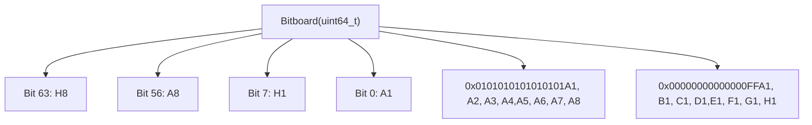
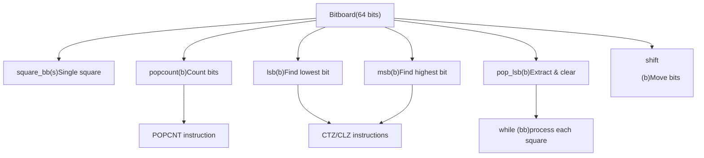
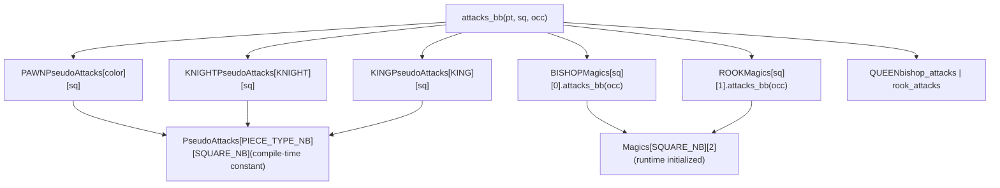
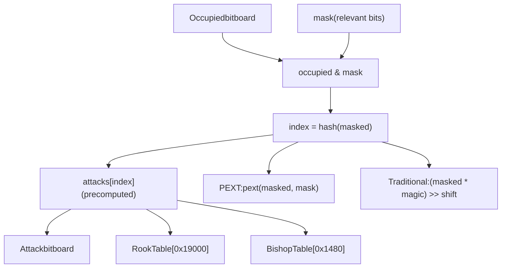
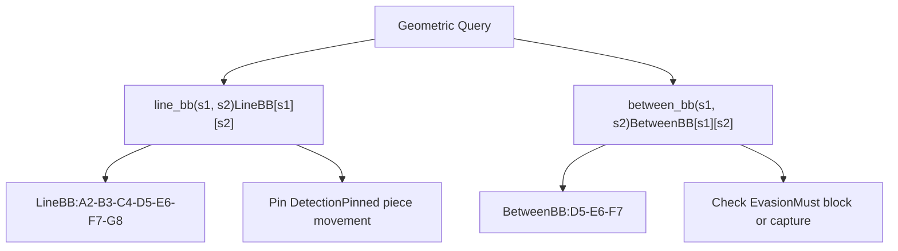
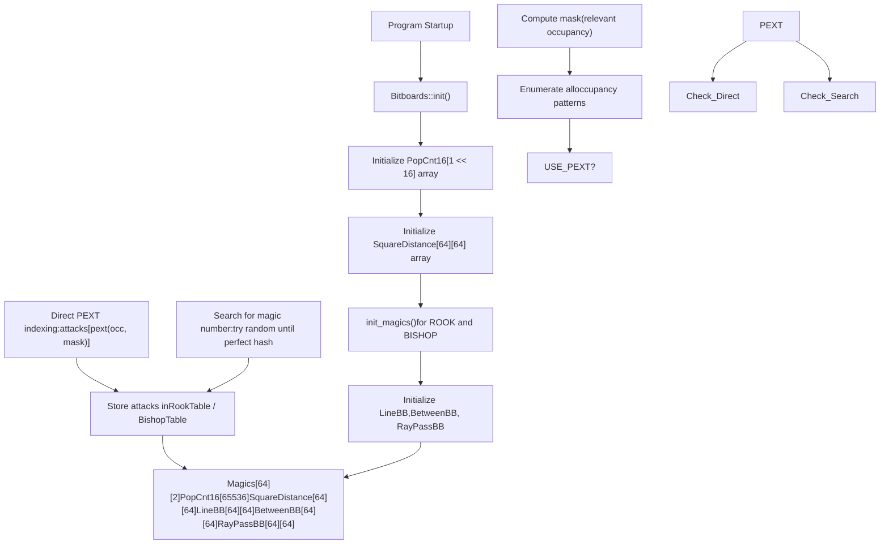

# Bitboards and Low-level Operations

Relevant source files

-   [src/bitboard.cpp](https://github.com/official-stockfish/Stockfish/blob/c27c1747/src/bitboard.cpp)
-   [src/bitboard.h](https://github.com/official-stockfish/Stockfish/blob/c27c1747/src/bitboard.h)

## Purpose and Scope

This page documents Stockfish's bitboard representation and the low-level bit manipulation operations that enable efficient board state queries and attack generation. Bitboards are the fundamental data structure for representing sets of squares on the chess board, allowing multiple square queries to be performed in parallel using bitwise operations.

For information about how bitboards are used within the `Position` class to represent complete board state, see [Position and State Management](/official-stockfish/Stockfish/3.1-position-and-state-management). For information about how bitboards are used to generate moves, see [Move Generation](/official-stockfish/Stockfish/3.3-move-generation).

**Sources:** [src/bitboard.h1-468](https://github.com/official-stockfish/Stockfish/blob/c27c1747/src/bitboard.h#L1-L468) [src/bitboard.cpp1-186](https://github.com/official-stockfish/Stockfish/blob/c27c1747/src/bitboard.cpp#L1-L186)

---

## Bitboard Fundamentals

### What is a Bitboard?

A `Bitboard` is a 64-bit unsigned integer (`uint64_t`) where each bit represents one square on the chess board. The least significant bit (bit 0) corresponds to square A1, and the most significant bit (bit 63) corresponds to square H8. The mapping follows this layout:

| Bit Position | 56-63 | 48-55 | 40-47 | 32-39 | 24-31 | 16-23 | 8-15 | 0-7 |
| --- | --- | --- | --- | --- | --- | --- | --- | --- |
| **Rank** | 8 | 7 | 6 | 5 | 4 | 3 | 2 | 1 |
| **Files** | A-H | A-H | A-H | A-H | A-H | A-H | A-H | A-H |

A set bit (1) indicates the square is part of the set; a clear bit (0) indicates it is not. This representation allows operations on multiple squares simultaneously using single CPU instructions.


**Sources:** [src/types.h](https://github.com/official-stockfish/Stockfish/blob/c27c1747/src/types.h) [src/bitboard.h43-59](https://github.com/official-stockfish/Stockfish/blob/c27c1747/src/bitboard.h#L43-L59)

### Predefined Bitboard Constants

Stockfish defines several useful bitboard constants for files and ranks:

| Constant | Value | Description |
| --- | --- | --- |
| `FileABB` | `0x0101010101010101ULL` | All squares on the A file |
| `FileBBB` through `FileHBB` | Left-shifted `FileABB` | Other files |
| `Rank1BB` | `0xFF` | All squares on rank 1 |
| `Rank2BB` through `Rank8BB` | Left-shifted `Rank1BB` | Other ranks |

**Sources:** [src/bitboard.h43-59](https://github.com/official-stockfish/Stockfish/blob/c27c1747/src/bitboard.h#L43-L59)

---

## Basic Bitboard Operations

### Square to Bitboard Conversion

The fundamental operation is converting a `Square` to a `Bitboard` with only that square set:

```
constexpr Bitboard square_bb(Square s)
```
This creates a bitboard with a single bit set at position `s` by computing `1ULL << s`.

**Sources:** [src/bitboard.h97-100](https://github.com/official-stockfish/Stockfish/blob/c27c1747/src/bitboard.h#L97-L100)

### Bitwise Operations with Squares

Stockfish overloads bitwise operators to allow natural operations between bitboards and squares:

| Operation | Meaning | Example |
| --- | --- | --- |
| `b & s` | Test if square is in bitboard | `if (occupied & SQ_E4)` |
| `b | s` | Add square to bitboard | `attacks |= target_square` |
| `b ^ s` | Toggle square in bitboard | `bb ^= move_from` |
| `b |= s` | Add square (compound) | `targets |= SQ_D5` |
| `b ^= s` | Toggle square (compound) | `pieces ^= from` |

**Sources:** [src/bitboard.h106-116](https://github.com/official-stockfish/Stockfish/blob/c27c1747/src/bitboard.h#L106-L116)

### Shift Operations

The `shift<Direction>()` template function moves all bits in a bitboard one or two steps in a specified direction, handling edge wrapping correctly:

```
template<Direction D>
constexpr Bitboard shift(Bitboard b)
```
Supported directions include `NORTH`, `SOUTH`, `EAST`, `WEST`, and diagonal directions like `NORTH_EAST`. The function masks edge files when shifting horizontally to prevent wrap-around (e.g., `(b & ~FileHBB) << 1` for `EAST`).

**Example use case:** Generating pawn attacks:

```
template<Color C>
constexpr Bitboard pawn_attacks_bb(Bitboard b)
```
For white pawns, this shifts north-west and north-east to get attack squares.

**Sources:** [src/bitboard.h134-156](https://github.com/official-stockfish/Stockfish/blob/c27c1747/src/bitboard.h#L134-L156)

### Population Count (popcount)

Counts the number of set bits in a bitboard, representing the number of squares in the set:

```
inline int popcount(Bitboard b)
```
The implementation varies by platform:

-   **With `USE_POPCNT`:** Uses hardware POPCNT instruction (`_mm_popcnt_u64` or `__builtin_popcountll`)
-   **Without hardware support:** Uses precomputed `PopCnt16` lookup table, breaking the 64-bit value into four 16-bit chunks

**Sources:** [src/bitboard.h215-233](https://github.com/official-stockfish/Stockfish/blob/c27c1747/src/bitboard.h#L215-L233) [src/bitboard.cpp29-70](https://github.com/official-stockfish/Stockfish/blob/c27c1747/src/bitboard.cpp#L29-L70)

### Least/Most Significant Bit

Extract the lowest or highest set bit:

```
inline Square lsb(Bitboard b)  // Returns least significant bit
inline Square msb(Bitboard b)  // Returns most significant bit
```
These use compiler intrinsics:

-   GCC/Clang: `__builtin_ctzll()` for LSB, `__builtin_clzll()` for MSB
-   MSVC: `_BitScanForward64()` / `_BitScanReverse64()`

**Common operation:** `pop_lsb()` returns the LSB and clears it from the bitboard, enabling iteration:

```
inline Square pop_lsb(Bitboard& b) {
    const Square s = lsb(b);
    b &= b - 1;  // Clear lowest bit
    return s;
}
```
**Sources:** [src/bitboard.h236-317](https://github.com/official-stockfish/Stockfish/blob/c27c1747/src/bitboard.h#L236-L317)

### Utility Functions

| Function | Purpose |
| --- | --- |
| `more_than_one(b)` | Tests if bitboard has multiple bits set (`b & (b-1)`) |
| `least_significant_square_bb(b)` | Returns bitboard with only LSB set (`b & -b`) |
| `rank_bb(Rank r)` / `rank_bb(Square s)` | Returns bitboard for a rank |
| `file_bb(File f)` / `file_bb(Square s)` | Returns bitboard for a file |

**Sources:** [src/bitboard.h118-131](https://github.com/official-stockfish/Stockfish/blob/c27c1747/src/bitboard.h#L118-L131)


**Sources:** [src/bitboard.h207-317](https://github.com/official-stockfish/Stockfish/blob/c27c1747/src/bitboard.h#L207-L317)

---

## Precomputed Attack Tables

### PseudoAttacks Array

The `PseudoAttacks` compile-time constant array stores attack bitboards for all piece types (except pawns, which are color-dependent) from all squares, assuming an empty board:

```
constexpr auto PseudoAttacks = []() constexpr {
    std::array<std::array<Bitboard, SQUARE_NB>, PIECE_TYPE_NB> attacks{};
    // ... initialization at compile time
    return attacks;
}();
```
This is a `PIECE_TYPE_NB × SQUARE_NB` 2D array computed at compile time. For sliding pieces (bishops, rooks, queens), these represent attacks assuming no blockers.

**Sources:** [src/bitboard.h383-398](https://github.com/official-stockfish/Stockfish/blob/c27c1747/src/bitboard.h#L383-L398)

### attacks\_bb Template Functions

The primary interface for querying piece attacks is the overloaded `attacks_bb()` function family:

**Non-sliding pieces (Knight, King) and empty board sliding pieces:**

```
template<PieceType Pt>
inline Bitboard attacks_bb(Square s, Color c = COLOR_NB)
```
Returns attacks from square `s`. For pawns, `c` specifies the color. For other pieces, simply looks up `PseudoAttacks[Pt][s]`.

**Sliding pieces with occupancy:**

```
template<PieceType Pt>
inline Bitboard attacks_bb(Square s, Bitboard occupied)
```
For bishops, rooks, and queens, computes attacks considering blockers in `occupied` using magic bitboards (see next section).

**Runtime dispatch versions:**

```
inline Bitboard attacks_bb(PieceType pt, Square s, Bitboard occupied)
inline Bitboard attacks_bb(Piece pc, Square s, Bitboard occupied)
```
**Sources:** [src/bitboard.h403-464](https://github.com/official-stockfish/Stockfish/blob/c27c1747/src/bitboard.h#L403-L464)


**Sources:** [src/bitboard.h383-464](https://github.com/official-stockfish/Stockfish/blob/c27c1747/src/bitboard.h#L383-L464)

---

## Magic Bitboards for Sliding Pieces

### The Magic Struct

Magic bitboards enable fast lookups of sliding piece (bishop, rook, queen) attacks with blockers. Each square has a `Magic` struct for bishops and rooks:

```
struct Magic {
    Bitboard  mask;      // Relevant occupancy bits (excluding edges)
    Bitboard* attacks;   // Pointer to attack table
    #ifndef USE_PEXT
    Bitboard magic;      // Magic number for hash function
    unsigned shift;      // Shift amount for indexing
    #endif

    unsigned index(Bitboard occupied) const;
    Bitboard attacks_bb(Bitboard occupied) const;
};
```
The array `Magics[SQUARE_NB][2]` stores magic data for all squares, with index `[sq][0]` for bishops and `[sq][1]` for rooks.

**Sources:** [src/bitboard.h69-93](https://github.com/official-stockfish/Stockfish/blob/c27c1747/src/bitboard.h#L69-L93) [src/bitboard.cpp36](https://github.com/official-stockfish/Stockfish/blob/c27c1747/src/bitboard.cpp#L36-L36)

### How Magic Bitboards Work

The magic bitboard technique maps any occupancy pattern to a unique index in a precomputed attack table:

1.  **Mask relevant bits:** `occupied & mask` isolates only the squares that can block attacks (excludes board edges)
2.  **Hash to index:**
    -   **With PEXT:** `pext(occupied, mask)` extracts relevant bits directly
    -   **Without PEXT:** `((occupied & mask) * magic) >> shift` multiplies by a magic number and shifts
3.  **Lookup attack:** `attacks[index]` returns the precomputed attack bitboard


**Sources:** [src/bitboard.h69-93](https://github.com/official-stockfish/Stockfish/blob/c27c1747/src/bitboard.h#L69-L93) [src/bitboard.cpp40-41](https://github.com/official-stockfish/Stockfish/blob/c27c1747/src/bitboard.cpp#L40-L41)

### Magic Number Generation

During initialization (when not using PEXT), Stockfish searches for "magic numbers" that produce perfect hash functions:

1.  Generate all possible occupancy patterns for the square's mask (using carry-rippler trick)
2.  Compute correct attacks for each occupancy pattern
3.  Try random magic numbers until finding one where:
    -   `(occupancy[i] & mask) * magic) >> shift` produces unique indices for all occupancies
    -   Each index maps to the correct attack pattern

The search uses a PRNG with seeds optimized per square to find magic numbers quickly.

**Sources:** [src/bitboard.cpp98-183](https://github.com/official-stockfish/Stockfish/blob/c27c1747/src/bitboard.cpp#L98-L183)

### PEXT Optimization

Modern CPUs (Intel Haswell+ and AMD Zen 3+) provide the `PEXT` instruction, which directly extracts bits according to a mask. When `USE_PEXT` is defined, Stockfish uses this instead of multiply-shift hashing, eliminating the need to search for magic numbers at startup.

**Sources:** [src/bitboard.h78-90](https://github.com/official-stockfish/Stockfish/blob/c27c1747/src/bitboard.h#L78-L90)

---

## Geometric Query Tables

### Line and Between Bitboards

Three geometric query tables enable efficient queries about square relationships:

| Table | Purpose | Example |
| --- | --- | --- |
| `LineBB[s1][s2]` | Full line connecting squares (if aligned) | `line_bb(SQ_C4, SQ_F7)` returns A2-G8 diagonal |
| `BetweenBB[s1][s2]` | Squares between s1 and s2 (semi-open: excludes s1, includes s2) | `between_bb(SQ_C4, SQ_F7)` returns D5, E6, F7 |
| `RayPassBB[s1][s2]` | Ray from s1 passing through s2 | Used for threat detection |

If squares are not aligned on a rank/file/diagonal:

-   `LineBB[s1][s2]` returns 0
-   `BetweenBB[s1][s2]` returns just `s2` (allowing move generation to work correctly)


**Sources:** [src/bitboard.h64-181](https://github.com/official-stockfish/Stockfish/blob/c27c1747/src/bitboard.h#L64-L181) [src/bitboard.cpp32-94](https://github.com/official-stockfish/Stockfish/blob/c27c1747/src/bitboard.cpp#L32-L94)

### Distance Tables and Functions

**SquareDistance table:** Precomputed Chebyshev distance (king distance) between all square pairs:

```
extern uint8_t SquareDistance[SQUARE_NB][SQUARE_NB];
```
**Distance template functions:**

```
template<typename T = Square>
inline int distance(Square x, Square y)
```
Specializations:

-   `distance<File>(x, y)`: File distance (absolute difference of files)
-   `distance<Rank>(x, y)`: Rank distance (absolute difference of ranks)
-   `distance<Square>(x, y)`: Chebyshev distance (max of file and rank distance), uses lookup table

**Edge distance:**

```
inline int edge_distance(File f)
```
Returns minimum distance from file to board edge (A-file or H-file).

**Sources:** [src/bitboard.h62-204](https://github.com/official-stockfish/Stockfish/blob/c27c1747/src/bitboard.h#L62-L204) [src/bitboard.cpp30-74](https://github.com/official-stockfish/Stockfish/blob/c27c1747/src/bitboard.cpp#L30-L74)

---

## Initialization System

### Bitboards::init() Function

The `Bitboards::init()` function must be called at program startup before any bitboard operations. It initializes all lookup tables:

```
void Bitboards::init() {
    // 1. Initialize PopCnt16 lookup table
    for (unsigned i = 0; i < (1 << 16); ++i)
        PopCnt16[i] = count of set bits in i;

    // 2. Initialize SquareDistance table
    for (Square s1 : all squares)
        for (Square s2 : all squares)
            SquareDistance[s1][s2] = max(file_distance, rank_distance);

    // 3. Initialize magic bitboards
    init_magics(ROOK, RookTable, Magics);
    init_magics(BISHOP, BishopTable, Magics);

    // 4. Initialize geometric tables (LineBB, BetweenBB, RayPassBB)
    for (Square s1 : all squares)
        for (Square s2 : all squares)
            if (s1 and s2 are aligned)
                compute LineBB, BetweenBB, RayPassBB;
}
```
**Sources:** [src/bitboard.cpp67-95](https://github.com/official-stockfish/Stockfish/blob/c27c1747/src/bitboard.cpp#L67-L95)

### Magic Table Initialization

The `init_magics()` function initializes attack tables for bishops and rooks:

**With PEXT:**

1.  For each square, compute the mask (relevant occupancy bits)
2.  Enumerate all possible occupancies using carry-rippler
3.  For each occupancy, compute attacks and store at `attacks[pext(occupancy, mask)]`

**Without PEXT (traditional magic):**

1.  Same mask and occupancy enumeration
2.  Search for magic number using PRNG with optimized seeds
3.  Verify magic produces perfect hash (no collisions with different attack patterns)
4.  Populate attack table using the found magic number

The attack tables are separate arrays:

-   `RookTable[0x19000]`: ~102KB for all rook attacks
-   `BishopTable[0x1480]`: ~5KB for all bishop attacks

Total memory: ~107KB for all magic bitboard attack tables.

**Sources:** [src/bitboard.cpp98-183](https://github.com/official-stockfish/Stockfish/blob/c27c1747/src/bitboard.cpp#L98-L183)


**Sources:** [src/bitboard.cpp67-183](https://github.com/official-stockfish/Stockfish/blob/c27c1747/src/bitboard.cpp#L67-L183)

---

## Performance Characteristics

### Bitboard Operation Performance

| Operation | Complexity | Implementation |
| --- | --- | --- |
| `square_bb(s)` | O(1) | Single bit shift |
| `popcount(b)` | O(1) | Hardware POPCNT or 4 lookups |
| `lsb(b)` / `msb(b)` | O(1) | Hardware CTZ/CLZ instruction |
| `pop_lsb(b)` | O(1) | CTZ + AND |
| `attacks_bb<KNIGHT>(s)` | O(1) | Array lookup |
| `attacks_bb<ROOK>(s, occ)` | O(1) | Hash + lookup (~2-3 cycles) |

Magic bitboard lookups are extremely fast - typically 2-3 CPU cycles:

-   Mask operation: 1 cycle (AND)
-   Hash function: 1-2 cycles (PEXT or multiply + shift)
-   Memory access: ~1 cycle (L1 cache hit)

**Sources:** [src/bitboard.h78-429](https://github.com/official-stockfish/Stockfish/blob/c27c1747/src/bitboard.h#L78-L429)

### Memory Footprint

| Data Structure | Size | Purpose |
| --- | --- | --- |
| `RookTable` | ~102 KB | Rook attack lookup |
| `BishopTable` | ~5 KB | Bishop attack lookup |
| `PseudoAttacks` | ~4 KB | Non-sliding attacks (compile-time) |
| `PopCnt16` | 64 KB | Popcount lookup |
| `SquareDistance` | 4 KB | Distance lookup |
| `LineBB` | 32 KB | Line queries |
| `BetweenBB` | 32 KB | Between queries |
| `RayPassBB` | 32 KB | Ray passing queries |
| **Total** | **~275 KB** | All bitboard tables |

All tables are read-only after initialization and have excellent cache locality.

**Sources:** [src/bitboard.cpp29-41](https://github.com/official-stockfish/Stockfish/blob/c27c1747/src/bitboard.cpp#L29-L41) [src/bitboard.h61-66](https://github.com/official-stockfish/Stockfish/blob/c27c1747/src/bitboard.h#L61-L66)
