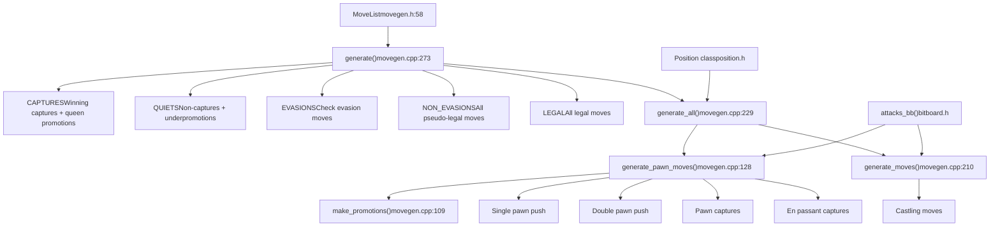
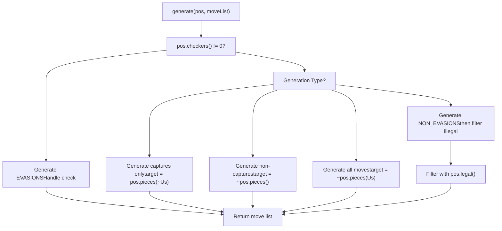
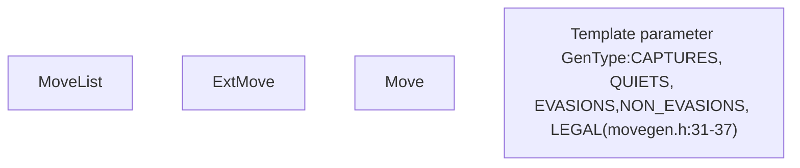
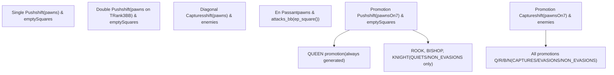
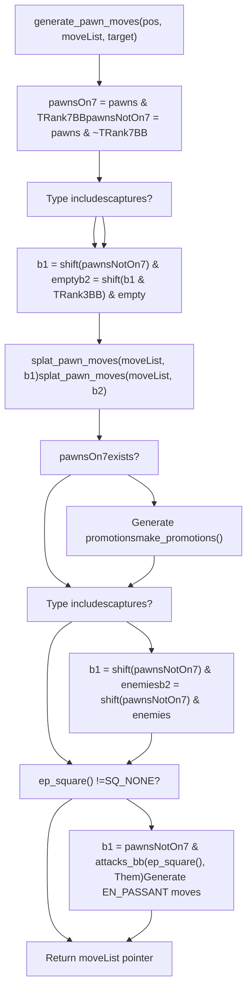
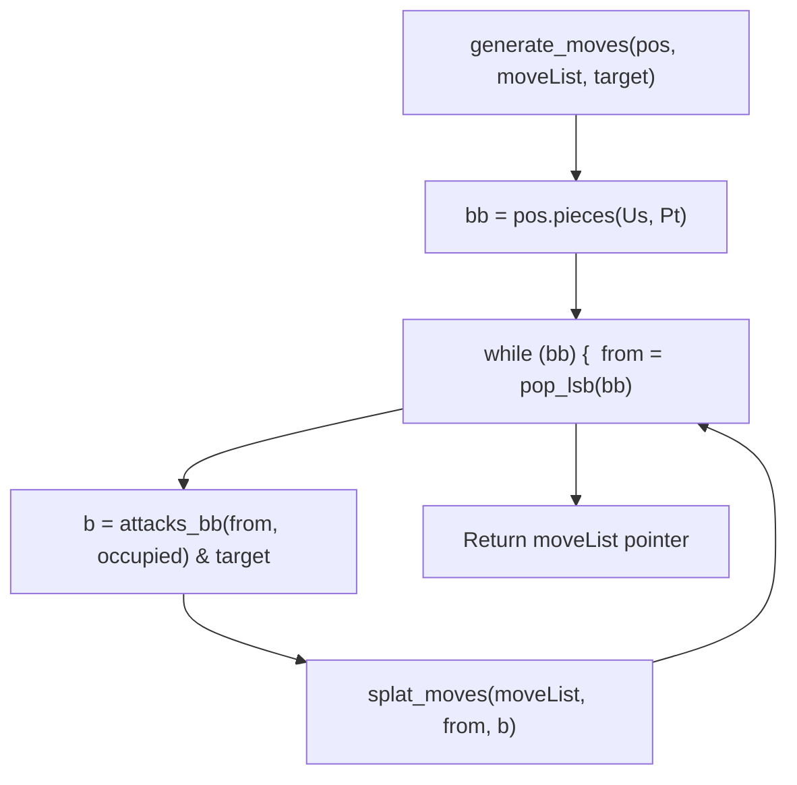
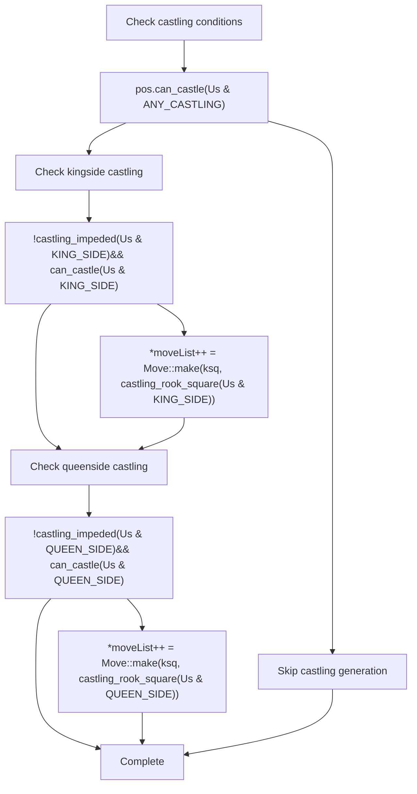
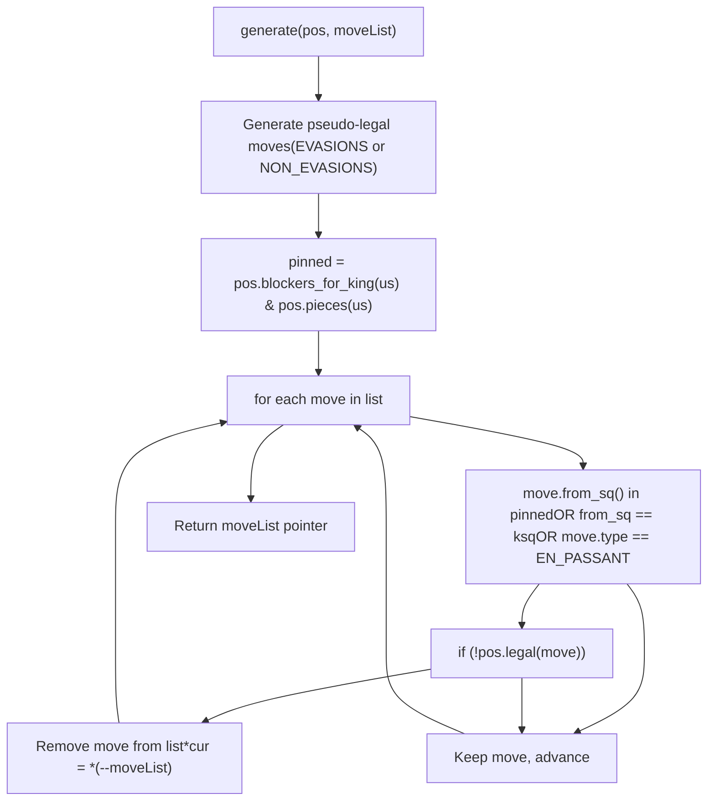
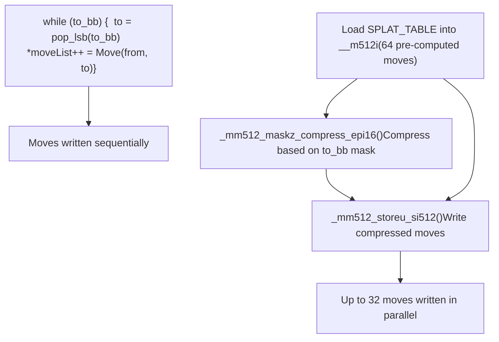

# Move Generation

Relevant source files

-   [src/movegen.cpp](https://github.com/official-stockfish/Stockfish/blob/c27c1747/src/movegen.cpp)
-   [src/movegen.h](https://github.com/official-stockfish/Stockfish/blob/c27c1747/src/movegen.h)

## Purpose and Scope

This page documents the move generation system in Stockfish, which is responsible for generating all legal and pseudo-legal moves from a given chess position. Move generation is a fundamental operation that occurs millions of times during search, making its performance critical to engine strength.

For information about how generated moves are ordered and selected during search, see [Move Ordering and Move Picker](/official-stockfish/Stockfish/4.3-move-ordering-and-move-picker). For details about the Position class that move generation operates on, see [Position and State Management](/official-stockfish/Stockfish/3.1-position-and-state-management). For the underlying bitboard operations used by move generation, see [Bitboards and Low-level Operations](/official-stockfish/Stockfish/3.2-bitboards-and-low-level-operations).

---

## Overview

The move generation system provides multiple generation modes optimized for different search contexts. All generation functions operate on a `Position` object and write moves to a provided array, returning a pointer to the end of the generated move list.


**Sources:** [src/movegen.h31-37](https://github.com/official-stockfish/Stockfish/blob/c27c1747/src/movegen.h#L31-L37) [src/movegen.cpp273-282](https://github.com/official-stockfish/Stockfish/blob/c27c1747/src/movegen.cpp#L273-L282)

---

## Generation Types

The `GenType` enum defines five distinct generation modes, each optimized for specific search contexts:

| GenType | Description | Use Case |
| --- | --- | --- |
| `CAPTURES` | Generates all pseudo-legal captures plus queen promotions | Quiescence search, MVV-LVA ordering |
| `QUIETS` | Generates all pseudo-legal non-captures and underpromotions | Main search quiet move phase |
| `EVASIONS` | Generates all pseudo-legal moves that may evade check | When position is in check |
| `NON_EVASIONS` | Generates all pseudo-legal moves when not in check | General move generation |
| `LEGAL` | Generates only strictly legal moves | Root move generation, validation |

**Sources:** [src/movegen.h31-37](https://github.com/official-stockfish/Stockfish/blob/c27c1747/src/movegen.h#L31-L37)

### Generation Mode Selection


**Sources:** [src/movegen.cpp229-261](https://github.com/official-stockfish/Stockfish/blob/c27c1747/src/movegen.cpp#L229-L261) [src/movegen.cpp293-310](https://github.com/official-stockfish/Stockfish/blob/c27c1747/src/movegen.cpp#L293-L310)

---

## MoveList Template

The `MoveList<T>` template provides a convenient wrapper around the raw `generate()` function, automatically managing move storage and providing iterator access.


**Example Usage:**

```
// Generate all legal moves
MoveList<LEGAL> legalMoves(position);
for (Move m : legalMoves) {
    // Process each move
}

// Check if a specific move is in the list
if (legalMoves.contains(ttMove)) {
    // Move is legal
}
```
**Sources:** [src/movegen.h54-70](https://github.com/official-stockfish/Stockfish/blob/c27c1747/src/movegen.h#L54-L70) [src/movegen.h39-47](https://github.com/official-stockfish/Stockfish/blob/c27c1747/src/movegen.h#L39-L47)

---

## Pawn Move Generation

Pawn moves require special handling due to their complex movement rules: single/double pushes, diagonal captures, en passant, and promotions.

### Pawn Move Types


**Sources:** [src/movegen.cpp128-206](https://github.com/official-stockfish/Stockfish/blob/c27c1747/src/movegen.cpp#L128-L206)

### Pawn Generation Implementation

The `generate_pawn_moves<Us, Type>()` function handles all pawn move types using bitboard operations:

**Key Steps:**

1.  **Separate pawns by rank** - Pawns on rank 7 (2 for black) are handled separately for promotions
2.  **Generate pushes** - Single and double pushes using bitboard shifts, masked by empty squares
3.  **Generate captures** - Diagonal shifts masked by enemy pieces
4.  **Handle promotions** - Different promotion types based on `GenType` (queen only for captures, all types for quiets)
5.  **En passant** - Special case when `ep_square() != SQ_NONE`


**Sources:** [src/movegen.cpp128-206](https://github.com/official-stockfish/Stockfish/blob/c27c1747/src/movegen.cpp#L128-L206)

---

## Piece Move Generation

Non-pawn pieces (knight, bishop, rook, queen, king) use a unified generation approach based on attack bitboards.

### Piece Move Generation Flow


**Key Points:**

-   Uses `attacks_bb<Pt>()` template function to get attack bitboard for each piece
-   For sliding pieces (bishop, rook, queen), attacks consider board occupancy via magic bitboards
-   For non-sliding pieces (knight, king), attacks use precomputed `PseudoAttacks` table
-   The `target` bitboard masks which destination squares are allowed based on `GenType`

**Sources:** [src/movegen.cpp210-225](https://github.com/official-stockfish/Stockfish/blob/c27c1747/src/movegen.cpp#L210-L225)

### Attack Bitboard Computation

| Piece Type | Attack Computation | Source |
| --- | --- | --- |
| Knight | `PseudoAttacks[KNIGHT][sq]` | [src/bitboard.h209-213](https://github.com/official-stockfish/Stockfish/blob/c27c1747/src/bitboard.h#L209-L213) |
| Bishop | `Magics[sq][BISHOP].attacks_bb(occupied)` | [src/bitboard.h220-234](https://github.com/official-stockfish/Stockfish/blob/c27c1747/src/bitboard.h#L220-L234) |
| Rook | `Magics[sq][ROOK].attacks_bb(occupied)` | [src/bitboard.h220-234](https://github.com/official-stockfish/Stockfish/blob/c27c1747/src/bitboard.h#L220-L234) |
| Queen | `attacks_bb<BISHOP>(sq, occ) | attacks_bb<ROOK>(sq, occ)` | [src/bitboard.h220-234](https://github.com/official-stockfish/Stockfish/blob/c27c1747/src/bitboard.h#L220-L234) |
| King | `PseudoAttacks[KING][sq]` | [src/bitboard.h209-213](https://github.com/official-stockfish/Stockfish/blob/c27c1747/src/bitboard.h#L209-L213) |

**Sources:** [src/bitboard.h209-234](https://github.com/official-stockfish/Stockfish/blob/c27c1747/src/bitboard.h#L209-L234) [src/bitboard.cpp84-114](https://github.com/official-stockfish/Stockfish/blob/c27c1747/src/bitboard.cpp#L84-L114)

---

## Special Move Generation

### Castling

Castling moves are generated only for `QUIETS` and `NON_EVASIONS` types when the position is not in check.


**Notes:**

-   Castling is encoded as "king captures rook" in the move format
-   Castling path checks for attacks happen later in `Position::legal()`, not during generation
-   Supports Chess960 castling with arbitrary rook positions

**Sources:** [src/movegen.cpp255-258](https://github.com/official-stockfish/Stockfish/blob/c27c1747/src/movegen.cpp#L255-L258) [src/position.cpp539-553](https://github.com/official-stockfish/Stockfish/blob/c27c1747/src/position.cpp#L539-L553)

### En Passant

En passant captures are generated when `pos.ep_square() != SQ_NONE`:

1.  Find pawns that can capture the en passant square: `pawnsNotOn7 & attacks_bb<PAWN>(ep_square, Them)`
2.  For each attacking pawn, generate `Move::make<EN_PASSANT>(pawnSq, ep_square)`
3.  In `EVASIONS` mode, skip if the en passant capture cannot resolve a discovered check

**Sources:** [src/movegen.cpp188-202](https://github.com/official-stockfish/Stockfish/blob/c27c1747/src/movegen.cpp#L188-L202)

---

## Pseudo-legal vs Legal Move Generation

Stockfish uses a two-stage approach for efficiency:

### Pseudo-legal Generation

Most move generation produces **pseudo-legal** moves - moves that satisfy basic chess rules but may leave the king in check. This is faster because it avoids expensive legality checks during generation.

**Pseudo-legal moves satisfy:**

-   Basic piece movement rules
-   Destination square is not occupied by own piece
-   For evasions, move blocks check or captures checking piece
-   Castling path is clear of own pieces

**Pseudo-legal moves may be illegal due to:**

-   Moving a pinned piece off the pin ray
-   King moving into check
-   En passant revealing a discovered check
-   Castling through or into check

**Sources:** [src/movegen.cpp273-288](https://github.com/official-stockfish/Stockfish/blob/c27c1747/src/movegen.cpp#L273-L288)

### Legal Move Generation

The `generate<LEGAL>()` specialization filters pseudo-legal moves to produce only legal moves:


**Optimization:** Only moves that could potentially be illegal are tested:

-   Moves from pinned pieces
-   King moves
-   En passant captures (always need special legality check)

**Sources:** [src/movegen.cpp293-310](https://github.com/official-stockfish/Stockfish/blob/c27c1747/src/movegen.cpp#L293-L310)

### Position::legal() Implementation

The `Position::legal()` function validates individual pseudo-legal moves:

**For en passant:**

-   Temporarily apply the capture and check if the king is attacked

**For castling:**

-   Check that each square the king passes through is not attacked
-   In Chess960, verify the rook doesn't block checks

**For king moves:**

-   Check that the destination square is not attacked

**For other moves:**

-   If piece is pinned (`blockers_for_king(us) & from`), verify move is along the pin ray

**Sources:** [src/position.cpp508-563](https://github.com/official-stockfish/Stockfish/blob/c27c1747/src/position.cpp#L508-L563)

---

## Performance Optimizations

### AVX512 SIMD Move Writing

On systems with AVX512 support (`USE_AVX512ICL`), move generation uses SIMD instructions to write multiple moves at once:


**Key Functions:**

-   `splat_pawn_moves<offset>()` [src/movegen.cpp46-66](https://github.com/official-stockfish/Stockfish/blob/c27c1747/src/movegen.cpp#L46-L66) - Generates pawn moves using pre-computed offset table and SIMD compression
-   `splat_moves()` [src/movegen.cpp68-86](https://github.com/official-stockfish/Stockfish/blob/c27c1747/src/movegen.cpp#L68-L86) - Generates moves for a single piece using SIMD vectorization
-   `write_moves()` [src/movegen.cpp39-44](https://github.com/official-stockfish/Stockfish/blob/c27c1747/src/movegen.cpp#L39-L44) - Writes compressed move list using bitmask and `_mm512_maskz_compress_epi16()`

**Performance Impact:**

-   Reduces move generation overhead by ~30-40% on AVX512-capable CPUs (Ice Lake and later)
-   Particularly effective for pawn moves and pieces with many destination squares (queens, bishops on open diagonals)
-   Falls back to traditional loop-based generation [src/movegen.cpp90-104](https://github.com/official-stockfish/Stockfish/blob/c27c1747/src/movegen.cpp#L90-L104) on non-AVX512 systems

**Sources:** [src/movegen.cpp27-106](https://github.com/official-stockfish/Stockfish/blob/c27c1747/src/movegen.cpp#L27-L106)

### Target Bitboard Masking

Each generation type uses a `target` bitboard to filter destination squares, avoiding unnecessary move creation:

| GenType | Target Calculation |
| --- | --- |
| `CAPTURES` | `pos.pieces(~Us)` - Enemy pieces only |
| `QUIETS` | `~pos.pieces()` - Empty squares only |
| `NON_EVASIONS` | `~pos.pieces(Us)` - Not own pieces |
| `EVASIONS` | `between_bb(ksq, checkerSq)` - Blocking/capturing squares |

**Sources:** [src/movegen.cpp234-243](https://github.com/official-stockfish/Stockfish/blob/c27c1747/src/movegen.cpp#L234-L243)

---

## Integration with Search

Move generation is called extensively during search:

**Usage Patterns:**

1.  **Root move generation:** Uses `generate<LEGAL>()` [src/movegen.cpp293-310](https://github.com/official-stockfish/Stockfish/blob/c27c1747/src/movegen.cpp#L293-L310) to ensure only legal moves are searched from the root position
2.  **Interior nodes:** MovePicker stages generation (captures first via `generate<CAPTURES>()`, then quiets via `generate<QUIETS>()`) to avoid generating moves that won't be searched due to pruning or cutoffs
3.  **Quiescence search:** Only `generate<CAPTURES>()` [src/movegen.cpp285](https://github.com/official-stockfish/Stockfish/blob/c27c1747/src/movegen.cpp#L285-L285) is called to search tactical sequences
4.  **Check evasion:** Automatically switches to `generate<EVASIONS>()` [src/movegen.cpp287](https://github.com/official-stockfish/Stockfish/blob/c27c1747/src/movegen.cpp#L287-L287) when `pos.checkers() != 0`

**Sources:** [src/movegen.cpp273-310](https://github.com/official-stockfish/Stockfish/blob/c27c1747/src/movegen.cpp#L273-L310)

---

## Summary

The move generation system provides:

-   **Multiple generation modes** optimized for different search contexts (captures, quiets, evasions, etc.)
-   **Efficient pseudo-legal generation** that defers expensive legality checks
-   **SIMD optimizations** for modern CPU architectures (AVX512)
-   **Bitboard-based implementation** leveraging precomputed attack tables
-   **Clean template-based API** via `MoveList<GenType>` for easy usage

The system generates millions of moves per second, with careful attention to performance through bitboard operations, SIMD instructions, and lazy legality validation only when necessary.
