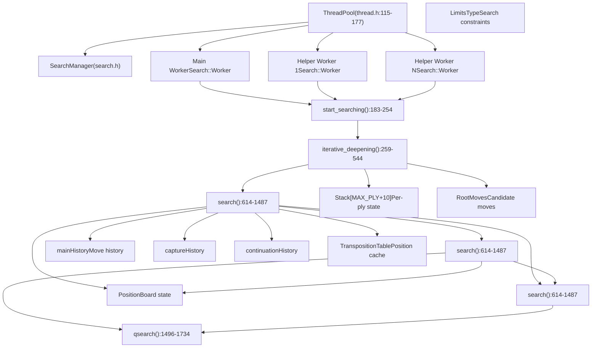
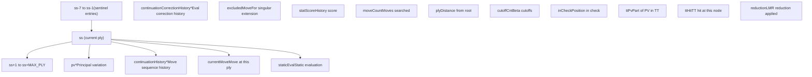
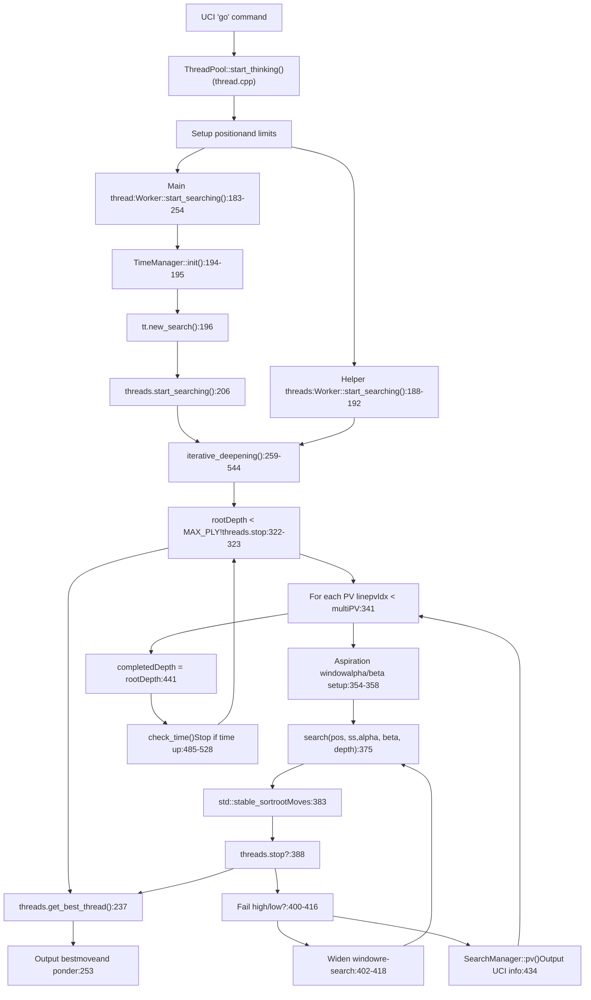
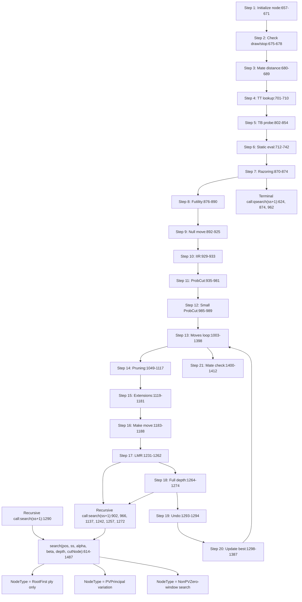
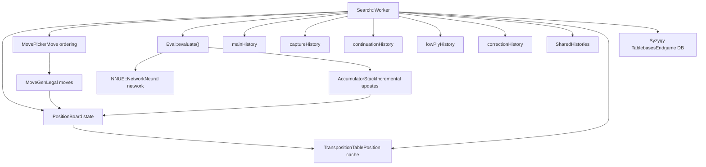

# Search System

Relevant source files

-   [src/search.cpp](https://github.com/official-stockfish/Stockfish/blob/c27c1747/src/search.cpp)
-   [src/thread.h](https://github.com/official-stockfish/Stockfish/blob/c27c1747/src/thread.h)

## Purpose and Scope

The Search System is the most critical component of Stockfish (importance 3593), responsible for exploring the game tree to find the best chess move. This page provides a comprehensive overview of the search architecture, its key components, and how they interact.

For detailed information about specific aspects:

-   **Algorithm details** (iterative deepening, alpha-beta, pruning, extensions): See [Search Algorithm and Iterative Deepening](/official-stockfish/Stockfish/4.1-search-algorithm-and-iterative-deepening)
-   **Thread management and parallelization**: See [Thread Management and Parallel Search](/official-stockfish/Stockfish/4.2-thread-management-and-parallel-search)
-   **Move ordering heuristics**: See [Move Ordering and Move Picker](/official-stockfish/Stockfish/4.3-move-ordering-and-move-picker)
-   **Position evaluation**: See [Evaluation System](/official-stockfish/Stockfish/5-evaluation-system)
-   **Move generation**: See [Move Generation](/official-stockfish/Stockfish/3.3-move-generation)

## System Architecture

The search system consists of several interconnected components that work together to explore the chess position tree efficiently.

**Sources:** [src/search.cpp1-2212](https://github.com/official-stockfish/Stockfish/blob/c27c1747/src/search.cpp#L1-L2212) [src/thread.h74-109](https://github.com/official-stockfish/Stockfish/blob/c27c1747/src/thread.h#L74-L109) [src/thread.h115-177](https://github.com/official-stockfish/Stockfish/blob/c27c1747/src/thread.h#L115-L177)

## Key Data Structures

### Search::Worker

The `Search::Worker` class is the core search engine that executes the search algorithm. Each thread has its own `Worker` instance with thread-local state.

| Member | Type | Purpose |
| --- | --- | --- |
| `rootPos` | `Position` | Root position being searched |
| `rootMoves` | `RootMoves` | Candidate moves at root with scores |
| `rootDepth` | `Depth` | Current depth being searched |
| `completedDepth` | `Depth` | Last fully completed depth |
| `selDepth` | `int` | Maximum selective depth reached |
| `mainHistory` | `ButterflyHistory` | Main history table (color, move) |
| `captureHistory` | `CapturePieceToHistory` | History for capture moves |
| `continuationHistory` | `ContinuationHistory` | History based on move sequences |
| `lowPlyHistory` | `LowPlyHistory` | History for low ply positions |
| `accumulatorStack` | `AccumulatorStack` | NNUE incremental updates |
| `nodes` | `atomic<uint64_t>` | Node count for this worker |
| `tbHits` | `atomic<uint64_t>` | Tablebase probe count |

**Key Methods:**

| Method | Line | Purpose |
| --- | --- | --- |
| `start_searching()` | [183-254](https://github.com/official-stockfish/Stockfish/blob/c27c1747/183-254) | Entry point for search |
| `iterative_deepening()` | [259-544](https://github.com/official-stockfish/Stockfish/blob/c27c1747/259-544) | Main iterative deepening loop |
| `search<NodeType>()` | [614-1487](https://github.com/official-stockfish/Stockfish/blob/c27c1747/614-1487) | Recursive alpha-beta search |
| `qsearch<NodeType>()` | [1496-1734](https://github.com/official-stockfish/Stockfish/blob/c27c1747/1496-1734) | Quiescence search |
| `do_move()` | [547-568](https://github.com/official-stockfish/Stockfish/blob/c27c1747/547-568) | Make move and update state |
| `undo_move()` | [577-580](https://github.com/official-stockfish/Stockfish/blob/c27c1747/577-580) | Unmake move |
| `evaluate()` | [1755-1758](https://github.com/official-stockfish/Stockfish/blob/c27c1747/1755-1758) | Evaluate position using NNUE |

**Sources:** [src/search.cpp156-175](https://github.com/official-stockfish/Stockfish/blob/c27c1747/src/search.cpp#L156-L175) [src/search.cpp183-254](https://github.com/official-stockfish/Stockfish/blob/c27c1747/src/search.cpp#L183-L254) [src/search.cpp259-544](https://github.com/official-stockfish/Stockfish/blob/c27c1747/src/search.cpp#L259-L544)

### Stack Structure

The `Stack` structure maintains per-ply search state. An array of `Stack` objects forms the search stack, with each element representing one ply in the search tree.

The stack is initialized with sentinel entries at negative indices to allow safe access from continuation history lookups. At each search node, the stack pointer `ss` is passed down, with child nodes using `ss+1`.

**Stack Usage Pattern:**

-   `ss`: Current search node
-   `(ss-1)->currentMove`: Parent's move that led here
-   `(ss-2)->staticEval`: Grandparent's static evaluation
-   `(ss+1)->pv`: Child's principal variation

**Sources:** [src/search.cpp278-292](https://github.com/official-stockfish/Stockfish/blob/c27c1747/src/search.cpp#L278-L292) [src/search.cpp547-568](https://github.com/official-stockfish/Stockfish/blob/c27c1747/src/search.cpp#L547-L568) [src/search.cpp570-575](https://github.com/official-stockfish/Stockfish/blob/c27c1747/src/search.cpp#L570-L575)

### RootMove Structure

`RootMove` tracks information about candidate moves at the root position during iterative deepening.

| Field | Type | Purpose |
| --- | --- | --- |
| `pv` | `std::vector<Move>` | Principal variation starting with this move |
| `score` | `Value` | Current search score |
| `uciScore` | `Value` | Score reported to UCI |
| `previousScore` | `Value` | Score from previous iteration |
| `averageScore` | `Value` | Running average of scores |
| `meanSquaredScore` | `Value` | Mean squared score for aspiration window |
| `effort` | `uint64_t` | Nodes spent searching this move |
| `selDepth` | `int` | Selective depth reached |
| `tbRank` | `int` | Tablebase rank (for TB root positions) |
| `tbScore` | `Value` | Tablebase score |
| `scoreLowerbound` | `bool` | Score is lower bound (fail high) |
| `scoreUpperbound` | `bool` | Score is upper bound (fail low) |

The `RootMoves` vector is sorted after each search iteration, with the best move moved to the front.

**Sources:** [src/search.cpp331-333](https://github.com/official-stockfish/Stockfish/blob/c27c1747/src/search.cpp#L331-L333) [src/search.cpp383](https://github.com/official-stockfish/Stockfish/blob/c27c1747/src/search.cpp#L383-L383) [src/search.cpp1305-1354](https://github.com/official-stockfish/Stockfish/blob/c27c1747/src/search.cpp#L1305-L1354)

### SearchManager

`SearchManager` coordinates the search process, manages time, and handles output.

| Responsibility | Implementation |
| --- | --- |
| Time management | `TimeManager tm` member |
| PV output | `pv()` method [2114-2183](https://github.com/official-stockfish/Stockfish/blob/c27c1747/2114-2183) |
| Time checking | `check_time()` [1944-1974](https://github.com/official-stockfish/Stockfish/blob/c27c1747/1944-1974) |
| Search updates | `UpdateContext` callbacks |
| Best move tracking | `bestPreviousScore`, `bestPreviousAverageScore` |
| Pondering control | `ponder`, `stopOnPonderhit` flags |

**Sources:** [src/search.cpp1944-1974](https://github.com/official-stockfish/Stockfish/blob/c27c1747/src/search.cpp#L1944-L1974) [src/search.cpp2114-2183](https://github.com/official-stockfish/Stockfish/blob/c27c1747/src/search.cpp#L2114-L2183)

## Search Control Flow

The following diagram shows the complete control flow from search initiation to completion, with actual function calls and their locations in the code.

**Sources:** [src/search.cpp183-254](https://github.com/official-stockfish/Stockfish/blob/c27c1747/src/search.cpp#L183-L254) [src/search.cpp259-544](https://github.com/official-stockfish/Stockfish/blob/c27c1747/src/search.cpp#L259-L544)

## Recursive Search Structure

The core search algorithm uses template specialization to handle three node types: `Root`, `PV` (Principal Variation), and `NonPV`.

**Key Search Characteristics:**

-   **Template-based dispatch**: Three node types with `constexpr bool` flags determine behavior at compile time [618-620](https://github.com/official-stockfish/Stockfish/blob/c27c1747/618-620)
-   **Fail-soft alpha-beta**: Returns values outside `[alpha, beta]` window
-   **Zero-window search**: Non-PV nodes use `alpha = beta - 1` for faster searches [638](https://github.com/official-stockfish/Stockfish/blob/c27c1747/638)
-   **Depth-first with iterative deepening**: Explores to depth D before increasing to D+1

**Sources:** [src/search.cpp614-1487](https://github.com/official-stockfish/Stockfish/blob/c27c1747/src/search.cpp#L614-L1487)

## Quiescence Search

When depth reaches zero, regular search transitions to quiescence search (`qsearch`) to resolve tactical sequences and avoid the horizon effect.

**Quiescence Characteristics:**

| Aspect | Description |
| --- | --- |
| **Entry condition** | `depth <= 0` in main search [623-624](https://github.com/official-stockfish/Stockfish/blob/c27c1747/623-624) |
| **Moves searched** | Only captures and checks (in check positions: all evasions) [1614-1616](https://github.com/official-stockfish/Stockfish/blob/c27c1747/1614-1616) |
| **Stand pat** | Can return static eval without searching [1590-1600](https://github.com/official-stockfish/Stockfish/blob/c27c1747/1590-1600) |
| **Depth** | Uses special `DEPTH_QS` constant for TT entries |
| **Pruning** | Futility pruning based on material gain [1636-1658](https://github.com/official-stockfish/Stockfish/blob/c27c1747/1636-1658) |
| **SEE filtering** | Prunes captures with bad Static Exchange Evaluation [1654-1667](https://github.com/official-stockfish/Stockfish/blob/c27c1747/1654-1667) |

**Sources:** [src/search.cpp1496-1734](https://github.com/official-stockfish/Stockfish/blob/c27c1747/src/search.cpp#L1496-L1734)

## Integration with Other Systems

The search system integrates tightly with other Stockfish components:

**Integration Points:**

| System | Usage in Search | Location |
| --- | --- | --- |
| Position | Board state, move execution, legal move validation | Throughout search |
| MovePicker | Iterates moves in optimal order | [996-997](https://github.com/official-stockfish/Stockfish/blob/c27c1747/996-997) [1615-1616](https://github.com/official-stockfish/Stockfish/blob/c27c1747/1615-1616) |
| MoveGen | Generates pseudo-legal moves | Via MovePicker |
| NNUE | Position evaluation at leaf nodes | [1755-1758](https://github.com/official-stockfish/Stockfish/blob/c27c1747/1755-1758) |
| AccumulatorStack | Incremental NNUE updates during move execution | [557-558](https://github.com/official-stockfish/Stockfish/blob/c27c1747/557-558) |
| TranspositionTable | Position cache for cutoffs and move ordering | [704](https://github.com/official-stockfish/Stockfish/blob/c27c1747/704) [838-840](https://github.com/official-stockfish/Stockfish/blob/c27c1747/838-840) [974-975](https://github.com/official-stockfish/Stockfish/blob/c27c1747/974-975) |
| History tables | Move ordering and pruning decisions | [996-997](https://github.com/official-stockfish/Stockfish/blob/c27c1747/996-997) [1084-1092](https://github.com/official-stockfish/Stockfish/blob/c27c1747/1084-1092) [1220-1225](https://github.com/official-stockfish/Stockfish/blob/c27c1747/1220-1225) |
| Syzygy | Endgame tablebase probes | [802-854](https://github.com/official-stockfish/Stockfish/blob/c27c1747/802-854) |
| TimeManager | Time control and search stopping | [194-195](https://github.com/official-stockfish/Stockfish/blob/c27c1747/194-195) [485-528](https://github.com/official-stockfish/Stockfish/blob/c27c1747/485-528) |

**Sources:** [src/search.cpp547-568](https://github.com/official-stockfish/Stockfish/blob/c27c1747/src/search.cpp#L547-L568) [src/search.cpp704](https://github.com/official-stockfish/Stockfish/blob/c27c1747/src/search.cpp#L704-L704) [src/search.cpp996-997](https://github.com/official-stockfish/Stockfish/blob/c27c1747/src/search.cpp#L996-L997) [src/search.cpp1755-1758](https://github.com/official-stockfish/Stockfish/blob/c27c1747/src/search.cpp#L1755-L1758)

## Thread Coordination

The search is parallelized using a shared-nothing architecture where each thread maintains its own `Search::Worker` with thread-local state.

**Thread Roles:**

| Thread Type | Responsibilities |
| --- | --- |
| Main thread | Time management, PV output, best thread selection, result reporting |
| Helper threads | Independent searches at the same root position with different random variations |

**Shared State:**

-   `TranspositionTable`: Lock-free shared hash table
-   `SharedHistories`: NUMA-replicated shared history tables
-   `threads.stop`: Atomic flag to stop all threads
-   `threads.increaseDepth`: Flag to control depth increments

**Thread Coordination Flow:**

1.  Main thread initializes time manager and transposition table [194-196](https://github.com/official-stockfish/Stockfish/blob/c27c1747/194-196)
2.  Main thread starts helper threads [206](https://github.com/official-stockfish/Stockfish/blob/c27c1747/206)
3.  All threads run `iterative_deepening()` independently [188-191](https://github.com/official-stockfish/Stockfish/blob/c27c1747/188-191) [207](https://github.com/official-stockfish/Stockfish/blob/c27c1747/207)
4.  Main thread monitors time and sets stop flag [485-528](https://github.com/official-stockfish/Stockfish/blob/c27c1747/485-528)
5.  All threads check stop flag periodically [322](https://github.com/official-stockfish/Stockfish/blob/c27c1747/322) [388](https://github.com/official-stockfish/Stockfish/blob/c27c1747/388) [676](https://github.com/official-stockfish/Stockfish/blob/c27c1747/676)
6.  Main thread waits for all threads to finish [223](https://github.com/official-stockfish/Stockfish/blob/c27c1747/223)
7.  Best thread is selected based on completed depth and score [237](https://github.com/official-stockfish/Stockfish/blob/c27c1747/237)

**Sources:** [src/search.cpp183-254](https://github.com/official-stockfish/Stockfish/blob/c27c1747/src/search.cpp#L183-L254) [src/search.cpp322-323](https://github.com/official-stockfish/Stockfish/blob/c27c1747/src/search.cpp#L322-L323) [src/thread.h115-177](https://github.com/official-stockfish/Stockfish/blob/c27c1747/src/thread.h#L115-L177)

## Search Heuristics Summary

The search employs numerous heuristics to improve efficiency. These are documented in detail in [Search Algorithm and Iterative Deepening](/official-stockfish/Stockfish/4.1-search-algorithm-and-iterative-deepening), but are summarized here for reference:

| Heuristic | Purpose | Location |
| --- | --- | --- |
| Aspiration windows | Narrow alpha-beta window around expected score | [354-421](https://github.com/official-stockfish/Stockfish/blob/c27c1747/354-421) |
| Transposition table | Cache position evaluations | [701-799](https://github.com/official-stockfish/Stockfish/blob/c27c1747/701-799) |
| Null move pruning | Skip move to prove position is good | [892-925](https://github.com/official-stockfish/Stockfish/blob/c27c1747/892-925) |
| Internal iterative reduction | Reduce depth when no TT move | [929-933](https://github.com/official-stockfish/Stockfish/blob/c27c1747/929-933) |
| ProbCut | Prune if reduced search gives high value | [935-981](https://github.com/official-stockfish/Stockfish/blob/c27c1747/935-981) |
| Razoring | Return qsearch if eval very low | [870-874](https://github.com/official-stockfish/Stockfish/blob/c27c1747/870-874) |
| Futility pruning | Prune moves unlikely to raise alpha | [876-890](https://github.com/official-stockfish/Stockfish/blob/c27c1747/876-890) [1100-1109](https://github.com/official-stockfish/Stockfish/blob/c27c1747/1100-1109) |
| Late move reductions (LMR) | Search later moves at reduced depth | [1231-1262](https://github.com/official-stockfish/Stockfish/blob/c27c1747/1231-1262) |
| Singular extensions | Extend moves that appear uniquely best | [1129-1181](https://github.com/official-stockfish/Stockfish/blob/c27c1747/1129-1181) |
| SEE pruning | Prune moves with bad material exchange | [1075-1080](https://github.com/official-stockfish/Stockfish/blob/c27c1747/1075-1080) [1114](https://github.com/official-stockfish/Stockfish/blob/c27c1747/1114) |
| History-based pruning | Prune moves with poor historical performance | [1089-1090](https://github.com/official-stockfish/Stockfish/blob/c27c1747/1089-1090) |

**Sources:** [src/search.cpp354-421](https://github.com/official-stockfish/Stockfish/blob/c27c1747/src/search.cpp#L354-L421) [src/search.cpp870-1181](https://github.com/official-stockfish/Stockfish/blob/c27c1747/src/search.cpp#L870-L1181)
