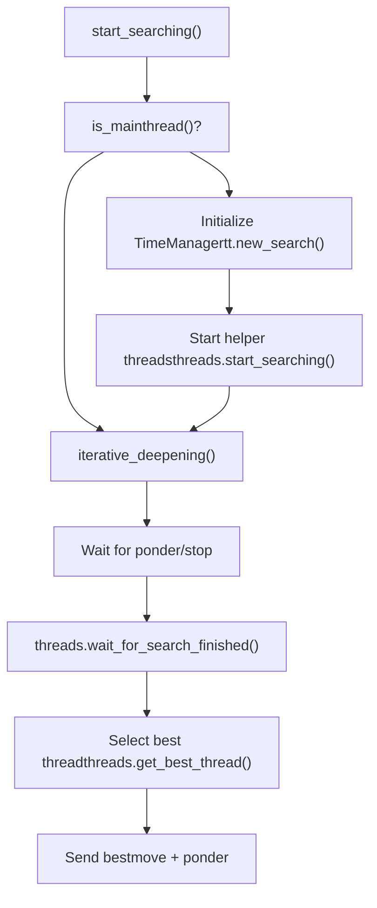
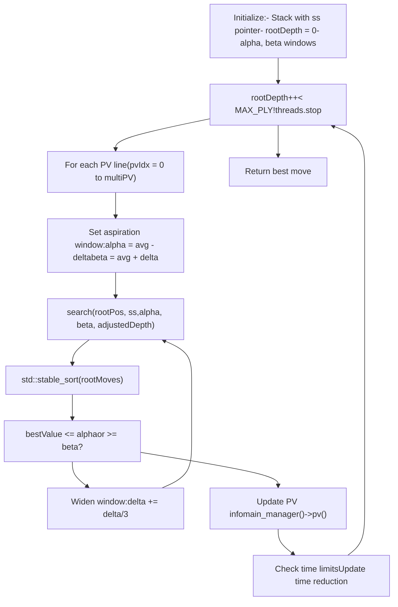
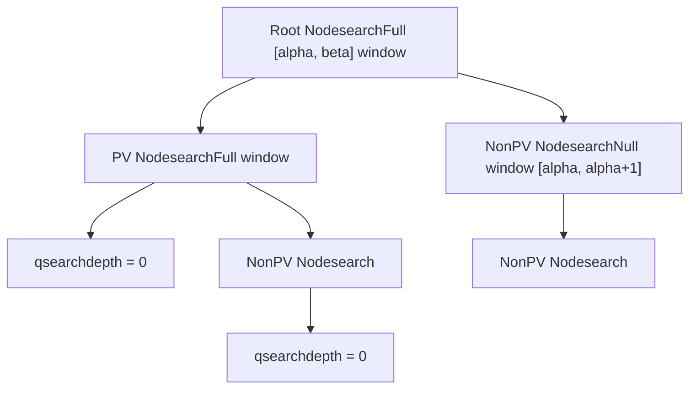
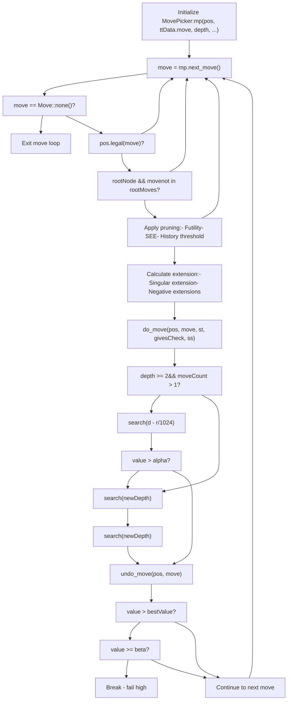
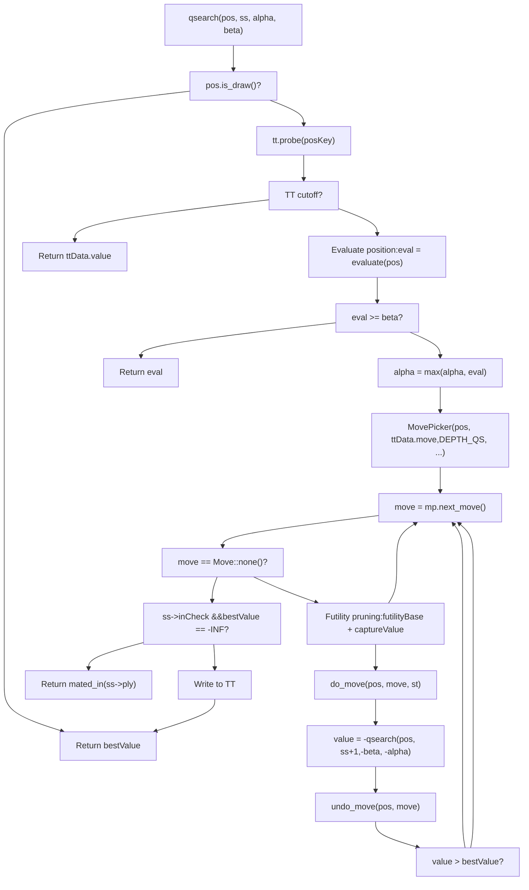
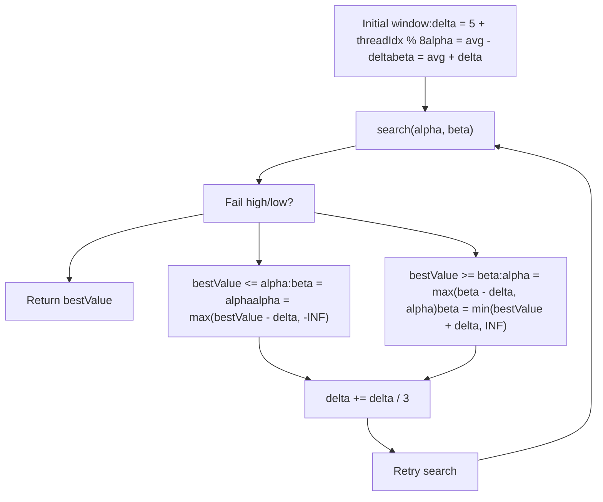
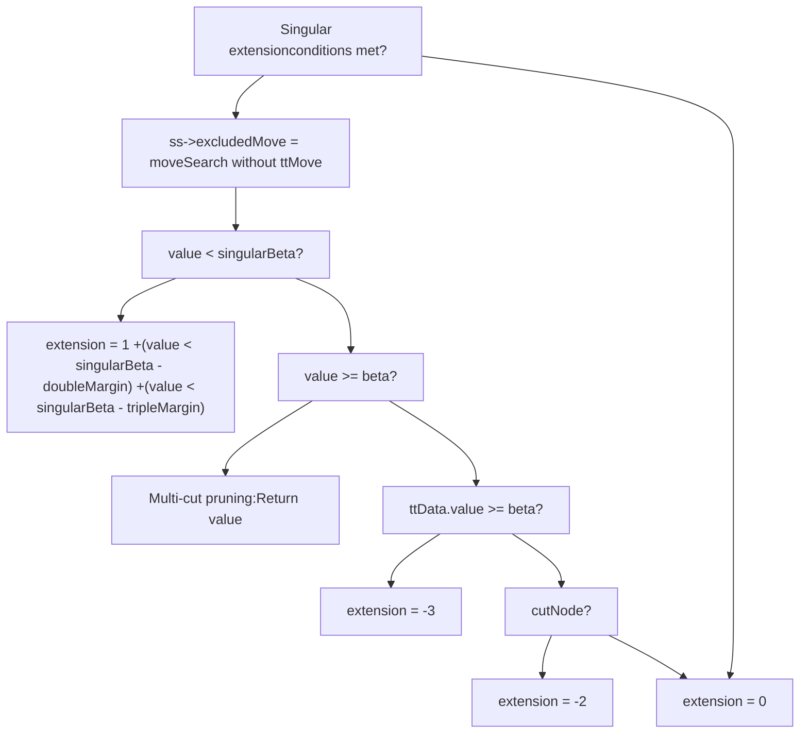
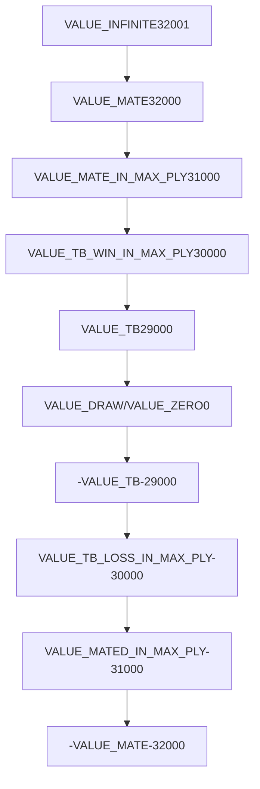
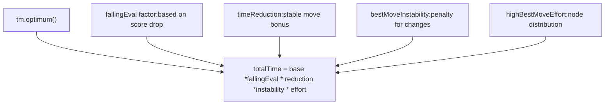

# Search Algorithm and Iterative Deepening

Relevant source files

-   [src/search.cpp](https://github.com/official-stockfish/Stockfish/blob/c27c1747/src/search.cpp)
-   [src/thread.h](https://github.com/official-stockfish/Stockfish/blob/c27c1747/src/thread.h)

## Purpose and Scope

This page documents the core search algorithm implementation in Stockfish, focusing on the iterative deepening framework and the alpha-beta search function that explores the game tree. This includes the main search loop, quiescence search for tactical positions, aspiration windows, and the various pruning and extension techniques that make the search efficient.

For information about move ordering heuristics and the `MovePicker` system, see [4.3](/official-stockfish/Stockfish/4.3-move-ordering-and-move-picker). For thread management and parallel search coordination, see [4.2](/official-stockfish/Stockfish/4.2-thread-management-and-parallel-search). For position evaluation using NNUE, see [5.1](/official-stockfish/Stockfish/5.1-nnue-neural-network-evaluation).

---

## Overview

The search system is built around three main components:

1.  **Iterative Deepening Loop** - Progressively searches deeper until time runs out
2.  **Alpha-Beta Search** - Recursive minimax with alpha-beta pruning
3.  **Quiescence Search** - Extends search to resolve tactical sequences

The search operates on a `Position` object and returns a `Value` representing the best score achievable, along with a principal variation (PV) showing the best line of play.

**Sources:** [src/search.cpp259-544](https://github.com/official-stockfish/Stockfish/blob/c27c1747/src/search.cpp#L259-L544) [src/search.cpp615-1487](https://github.com/official-stockfish/Stockfish/blob/c27c1747/src/search.cpp#L615-L1487)

---

## Iterative Deepening Framework

### Main Entry Point and Control Flow

The search begins in `Search::Worker::start_searching()` which initializes the search and calls `iterative_deepening()`. The main thread has additional responsibilities for time management and final result selection.


**Sources:** [src/search.cpp183-254](https://github.com/official-stockfish/Stockfish/blob/c27c1747/src/search.cpp#L183-L254)

### The Iterative Deepening Loop

The `iterative_deepening()` function at [src/search.cpp259-544](https://github.com/official-stockfish/Stockfish/blob/c27c1747/src/search.cpp#L259-L544) implements the main search loop. It repeatedly calls `search<Root>()` with increasing depth values, from 1 to `MAX_PLY` or until stopped.


**Sources:** [src/search.cpp259-544](https://github.com/official-stockfish/Stockfish/blob/c27c1747/src/search.cpp#L259-L544)

### Key Data Structures

| Structure | Purpose | Location |
| --- | --- | --- |
| `Stack[MAX_PLY + 10]` | Per-ply search state, stores move info, eval, history pointers | [src/search.cpp278-292](https://github.com/official-stockfish/Stockfish/blob/c27c1747/src/search.cpp#L278-L292) |
| `rootMoves` | Vector of candidate moves at root with scores and PVs | [src/search.h](https://github.com/official-stockfish/Stockfish/blob/c27c1747/src/search.h) |
| `rootDepth` | Current search depth in the iterative loop | [src/search.cpp322](https://github.com/official-stockfish/Stockfish/blob/c27c1747/src/search.cpp#L322-L322) |
| `alpha`, `beta` | Aspiration window bounds | [src/search.cpp269](https://github.com/official-stockfish/Stockfish/blob/c27c1747/src/search.cpp#L269-L269) |
| `bestValue` | Best score found so far | [src/search.cpp270](https://github.com/official-stockfish/Stockfish/blob/c27c1747/src/search.cpp#L270-L270) |

**Sources:** [src/search.cpp263-292](https://github.com/official-stockfish/Stockfish/blob/c27c1747/src/search.cpp#L263-L292)

---

## Alpha-Beta Search Algorithm

### Search Function Template

The main search is implemented as a template function `search<NodeType>()` that handles three node types:

```
template<NodeType nodeType>
Value Search::Worker::search(Position& pos, Stack* ss,
                              Value alpha, Value beta,
                              Depth depth, bool cutNode)
```
**Node Types:**

-   `Root` - The root node of the search tree
-   `PV` - Principal Variation nodes on the expected best path
-   `NonPV` - Non-PV nodes searched with null window

**Sources:** [src/search.cpp614-1487](https://github.com/official-stockfish/Stockfish/blob/c27c1747/src/search.cpp#L614-L1487)

### Search Tree Structure


**Sources:** [src/search.cpp614-625](https://github.com/official-stockfish/Stockfish/blob/c27c1747/src/search.cpp#L614-L625)

### Main Search Loop Steps

The search function follows these steps (as documented in the code comments):

| Step | Lines | Description |
| --- | --- | --- |
| 1 | [657-671](https://github.com/official-stockfish/Stockfish/blob/c27c1747/657-671) | Initialize node - set `ss->inCheck`, `ss->moveCount`, `bestValue` |
| 2 | [675-678](https://github.com/official-stockfish/Stockfish/blob/c27c1747/675-678) | Check for aborted search and immediate draw |
| 3 | [680-690](https://github.com/official-stockfish/Stockfish/blob/c27c1747/680-690) | Mate distance pruning |
| 4 | [701-711](https://github.com/official-stockfish/Stockfish/blob/c27c1747/701-711) | Transposition table lookup via `tt.probe(posKey)` |
| 5 | [802-854](https://github.com/official-stockfish/Stockfish/blob/c27c1747/802-854) | Tablebase probe for positions in endgame databases |
| 6 | [712-742](https://github.com/official-stockfish/Stockfish/blob/c27c1747/712-742) | Static evaluation via `evaluate(pos)` or TT |
| 7 | [870-874](https://github.com/official-stockfish/Stockfish/blob/c27c1747/870-874) | Razoring - return qsearch if eval very low |
| 8 | [876-890](https://github.com/official-stockfish/Stockfish/blob/c27c1747/876-890) | Futility pruning at parent node |
| 9 | [892-925](https://github.com/official-stockfish/Stockfish/blob/c27c1747/892-925) | Null move pruning with verification |
| 10 | [929-933](https://github.com/official-stockfish/Stockfish/blob/c27c1747/929-933) | Internal iterative reduction (IIR) |
| 11 | [935-981](https://github.com/official-stockfish/Stockfish/blob/c27c1747/935-981) | ProbCut - prune if capture beats beta by margin |
| 12 | [983-989](https://github.com/official-stockfish/Stockfish/blob/c27c1747/983-989) | Small ProbCut based on TT bounds |
| 13 | [1005-1398](https://github.com/official-stockfish/Stockfish/blob/c27c1747/1005-1398) | **Main move loop** - search all legal moves |
| 14 | [1049-1116](https://github.com/official-stockfish/Stockfish/blob/c27c1747/1049-1116) | Forward pruning of quiet moves and captures |
| 15 | [1119-1181](https://github.com/official-stockfish/Stockfish/blob/c27c1747/1119-1181) | Singular extension and multi-cut pruning |
| 16 | [1184](https://github.com/official-stockfish/Stockfish/blob/c27c1747/1184) | Make the move via `do_move()` |
| 17 | [1232-1262](https://github.com/official-stockfish/Stockfish/blob/c27c1747/1232-1262) | Late Move Reduction (LMR) |
| 18 | [1264-1274](https://github.com/official-stockfish/Stockfish/blob/c27c1747/1264-1274) | Full-depth search when LMR is skipped |
| 19 | [1294](https://github.com/official-stockfish/Stockfish/blob/c27c1747/1294) | Undo the move via `undo_move()` |
| 20 | [1298-1387](https://github.com/official-stockfish/Stockfish/blob/c27c1747/1298-1387) | Check for new best move and update PV |
| 21 | [1400-1412](https://github.com/official-stockfish/Stockfish/blob/c27c1747/1400-1412) | Check for mate/stalemate if no moves |

**Sources:** [src/search.cpp615-1487](https://github.com/official-stockfish/Stockfish/blob/c27c1747/src/search.cpp#L615-L1487)

### Move Loop Implementation


**Sources:** [src/search.cpp996-1398](https://github.com/official-stockfish/Stockfish/blob/c27c1747/src/search.cpp#L996-L1398)

---

## Quiescence Search

When `depth <= 0`, the search transitions to quiescence search via `qsearch<NodeType>()`. This function searches only tactical moves (captures and checks) to resolve the "horizon effect" where the static evaluation is unstable due to pending captures.

### Quiescence Search Flow


**Sources:** [src/search.cpp1497-1734](https://github.com/official-stockfish/Stockfish/blob/c27c1747/src/search.cpp#L1497-L1734)

### Stand Pat Optimization

In quiescence search, if not in check, the search can "stand pat" (do nothing) and use the static evaluation. If `eval >= beta`, the position is already too good, so we return immediately without searching any moves.

**Sources:** [src/search.cpp1589-1600](https://github.com/official-stockfish/Stockfish/blob/c27c1747/src/search.cpp#L1589-L1600)

---

## Aspiration Windows

Aspiration windows narrow the alpha-beta search bounds to improve cutoff efficiency. The search starts with a small window around the previous iteration's score, then widens if it fails high or low.

### Aspiration Window Logic


**Initial Delta Calculation:**

```
delta = 5 + threadIdx % 8 + abs(rootMoves[pvIdx].meanSquaredScore) / 9000
```
This varies slightly per thread to reduce search overlap in parallel search.

**Sources:** [src/search.cpp354-421](https://github.com/official-stockfish/Stockfish/blob/c27c1747/src/search.cpp#L354-L421)

---

## Search Optimizations

### Pruning Techniques

Stockfish employs numerous pruning techniques to reduce the search tree without sacrificing accuracy. These are applied at different points in the search.

| Technique | Location | Condition | Effect |
| --- | --- | --- | --- |
| **Razoring** | [870-874](https://github.com/official-stockfish/Stockfish/blob/c27c1747/870-874) | `eval < alpha - 485 - 281*depth^2` | Return qsearch result immediately |
| **Futility Pruning** | [876-890](https://github.com/official-stockfish/Stockfish/blob/c27c1747/876-890) | `eval - margin >= beta` at shallow depth | Return early without move search |
| **Null Move Pruning** | [892-925](https://github.com/official-stockfish/Stockfish/blob/c27c1747/892-925) | `eval >= beta - 18*depth + 350` at cut nodes | Skip move, search at reduced depth |
| **ProbCut** | [935-981](https://github.com/official-stockfish/Stockfish/blob/c27c1747/935-981) | Good capture beats `beta + 235` | Prune entire subtree |
| **Late Move Pruning** | [1054-1055](https://github.com/official-stockfish/Stockfish/blob/c27c1747/1054-1055) | `moveCount >= (3 + depth^2) / (2 - improving)` | Skip remaining quiet moves |
| **Futility for Captures** | [1066-1073](https://github.com/official-stockfish/Stockfish/blob/c27c1747/1066-1073) | `futilityValue <= alpha` at low depth | Skip bad captures |
| **SEE Pruning** | [1075-1080](https://github.com/official-stockfish/Stockfish/blob/c27c1747/1075-1080) | `!pos.see_ge(move, -margin)` | Skip moves losing material |
| **Continuation History** | [1088-1090](https://github.com/official-stockfish/Stockfish/blob/c27c1747/1088-1090) | `history < -4083 * depth` | Skip quiet moves with bad history |
| **Quiet SEE Pruning** | [1114-1115](https://github.com/official-stockfish/Stockfish/blob/c27c1747/1114-1115) | `!pos.see_ge(move, -25*lmrDepth^2)` | Skip quiet moves with negative SEE |

**Sources:** [src/search.cpp870-1116](https://github.com/official-stockfish/Stockfish/blob/c27c1747/src/search.cpp#L870-L1116)

### Extension Techniques

Extensions increase the search depth for critical moves to ensure important tactical sequences are fully analyzed.


**Singular Extension:** When the TT move appears much better than all alternatives, extend its search depth. Conditions:

-   `move == ttData.move`
-   `depth >= 6 + ss->ttPv`
-   TT value is valid and has `BOUND_LOWER`
-   Not in a shuffling position

**Sources:** [src/search.cpp1129-1181](https://github.com/official-stockfish/Stockfish/blob/c27c1747/src/search.cpp#L1129-L1181)

### Late Move Reduction (LMR)

LMR is a critical optimization that searches later moves at reduced depth, based on the assumption that the first moves (better ordered) are more likely to be best.

**Reduction Formula:**

```
Depth r = reduction(improving, depth, moveCount, delta);
```
The reduction is calculated in [src/search.cpp1736-1739](https://github.com/official-stockfish/Stockfish/blob/c27c1747/src/search.cpp#L1736-L1739) as:

```
int reductionScale = reductions[d] * reductions[mn];
return reductionScale - delta * 608 / rootDelta
       + !i * reductionScale * 238 / 512 + 1182;
```
Where:

-   `reductions[i] = int(2747 / 128.0 * log(i))` - logarithmic base reduction
-   `delta` is the current window size
-   `improving` reduces LMR when position is improving

**Adjustments to Reduction:**

-   Decreased for PV nodes: `r -= 2719 + PvNode * 983 + ...` [1192-1193](https://github.com/official-stockfish/Stockfish/blob/c27c1747/1192-1193)
-   Decreased per move searched: `r -= moveCount * 73` [1196](https://github.com/official-stockfish/Stockfish/blob/c27c1747/1196)
-   Increased at cut nodes: `r += 3372 + 997 * !ttData.move` [1201](https://github.com/official-stockfish/Stockfish/blob/c27c1747/1201)
-   Increased if ttMove is capture: `r += 1119` [1205](https://github.com/official-stockfish/Stockfish/blob/c27c1747/1205)
-   Decreased based on history: `r -= ss->statScore * 850 / 8192` [1225](https://github.com/official-stockfish/Stockfish/blob/c27c1747/1225)

**LMR Re-search:** If reduced search fails high (`value > alpha`), a full-depth search is performed at [1257](https://github.com/official-stockfish/Stockfish/blob/c27c1747/1257)

**Sources:** [src/search.cpp1232-1262](https://github.com/official-stockfish/Stockfish/blob/c27c1747/src/search.cpp#L1232-L1262) [src/search.cpp1736-1739](https://github.com/official-stockfish/Stockfish/blob/c27c1747/src/search.cpp#L1736-L1739)

---

## Value Management and Scoring

### Value Types and Ranges


**Value Classification Functions:**

-   `is_win(v)` - Value indicates forced win
-   `is_loss(v)` - Value indicates forced loss
-   `is_decisive(v)` - Either win or loss
-   `is_valid(v)` - Not `VALUE_NONE`

**Sources:** [src/types.h](https://github.com/official-stockfish/Stockfish/blob/c27c1747/src/types.h)

### Value Transformations

Values stored in the transposition table are adjusted to be ply-invariant:

**`value_to_tt(v, ply)`** [1764](https://github.com/official-stockfish/Stockfish/blob/c27c1747/1764) - Before storing in TT:

```
return is_win(v) ? v + ply : is_loss(v) ? v - ply : v;
```
**`value_from_tt(v, ply, r50c)`** [1772-1806](https://github.com/official-stockfish/Stockfish/blob/c27c1747/1772-1806) - When retrieving from TT:

-   Adjusts mate/TB scores back to root perspective
-   Downgrades potentially false mate scores based on rule50 count
-   Returns `VALUE_NONE` for invalid values

**Sources:** [src/search.cpp1760-1806](https://github.com/official-stockfish/Stockfish/blob/c27c1747/src/search.cpp#L1760-L1806)

### Correction History

Static evaluations are adjusted by correction history to account for systematic evaluation errors:

```
Value to_corrected_static_eval(Value v, int cv) {
    return clamp(v + cv / 131072,
                 VALUE_TB_LOSS_IN_MAX_PLY + 1,
                 VALUE_TB_WIN_IN_MAX_PLY - 1);
}
```
The `correction_value()` at [80-94](https://github.com/official-stockfish/Stockfish/blob/c27c1747/80-94) combines multiple correction histories:

-   Pawn structure correction
-   Minor piece correction
-   Non-pawn material correction
-   Continuation correction history

These are updated at [102-124](https://github.com/official-stockfish/Stockfish/blob/c27c1747/102-124) when the search completes to reduce future evaluation errors.

**Sources:** [src/search.cpp80-124](https://github.com/official-stockfish/Stockfish/blob/c27c1747/src/search.cpp#L80-L124)

---

## Stack Structure and Move State

The `Stack` structure maintains per-ply search state. An array of `Stack[MAX_PLY + 10]` is allocated with a pointer `ss` to the current ply.

### Stack Members

| Member | Type | Purpose |
| --- | --- | --- |
| `pv` | `Move*` | Pointer to principal variation array |
| `ply` | `int` | Distance from root node |
| `currentMove` | `Move` | Move that led to this position |
| `excludedMove` | `Move` | Move to exclude in singular extension |
| `continuationHistory` | `PieceToHistory**` | Pointer to history tables for this piece/square |
| `continuationCorrectionHistory` | `int**` | Pointer to correction history |
| `staticEval` | `Value` | Static evaluation of position |
| `statScore` | `int` | Combined history score for current move |
| `moveCount` | `int` | Number of moves searched |
| `inCheck` | `bool` | Whether side to move is in check |
| `ttHit` | `bool` | Whether TT had an entry |
| `ttPv` | `bool` | Whether this is a PV node |
| `reduction` | `int` | Reduction applied to last search |
| `cutoffCnt` | `int` | Number of beta cutoffs at this ply |

**Initialization:**

```
Stack stack[MAX_PLY + 10] = {};
Stack* ss = stack + 7;  // Allow ss-7 access
```
Extra space allows accessing `(ss - 7)` for continuation history updates and `(ss + 2)` for cutoff tracking.

**Sources:** [src/search.cpp278-292](https://github.com/official-stockfish/Stockfish/blob/c27c1747/src/search.cpp#L278-L292) [src/search.h](https://github.com/official-stockfish/Stockfish/blob/c27c1747/src/search.h)

---

## Move Execution in Search

### Worker Move Functions

The `Search::Worker` class provides wrapper functions for move execution that update search-specific state:

**`do_move()`** [547-568](https://github.com/official-stockfish/Stockfish/blob/c27c1747/547-568):

```
void Search::Worker::do_move(Position& pos, Move move,
                              StateInfo& st, bool givesCheck,
                              Stack* ss) {
    nodes++;
    auto [dirtyPiece, dirtyThreats] = accumulatorStack.push();
    pos.do_move(move, st, givesCheck, dirtyPiece, dirtyThreats,
                &tt, &sharedHistory);

    ss->currentMove = move;
    ss->continuationHistory =
        &continuationHistory[ss->inCheck][capture][dirtyPiece.pc][move.to_sq()];
    ss->continuationCorrectionHistory =
        &continuationCorrectionHistory[dirtyPiece.pc][move.to_sq()];
}
```
This:

1.  Increments node counter
2.  Pushes NNUE accumulator state
3.  Calls `Position::do_move()`
4.  Updates stack with move and history pointers

**`undo_move()`** [577-580](https://github.com/official-stockfish/Stockfish/blob/c27c1747/577-580):

```
void Search::Worker::undo_move(Position& pos, Move move) {
    pos.undo_move(move);
    accumulatorStack.pop();
}
```
**Null Move:** Special handling at [570-575](https://github.com/official-stockfish/Stockfish/blob/c27c1747/570-575) and [582](https://github.com/official-stockfish/Stockfish/blob/c27c1747/582) for null move pruning.

**Sources:** [src/search.cpp547-583](https://github.com/official-stockfish/Stockfish/blob/c27c1747/src/search.cpp#L547-L583)

---

## Search Termination and Time Management

### Stop Conditions

The search can terminate for several reasons, checked at various points:

1.  **Explicit Stop** - `threads.stop` flag set by time manager or UCI command
2.  **Maximum Depth** - `rootDepth > limits.depth`
3.  **Mate Found** - Mate in N where N matches `limits.mate`
4.  **Time Expired** - `elapsed > tm.maximum()` or `elapsed > totalTime`
5.  **Node Limit** - `nodes >= limits.nodes`

**Check Time Function:**

The main thread periodically calls `check_time()` at [1944-1974](https://github.com/official-stockfish/Stockfish/blob/c27c1747/1944-1974) to evaluate whether to stop:

```
void SearchManager::check_time(Search::Worker& worker) {
    if (--callsCnt > 0)
        return;

    callsCnt = worker.limits.nodes
               ? min(512, int(worker.limits.nodes / 1024))
               : 512;

    // Check time/node limits and set threads.stop if needed
}
```
**Sources:** [src/search.cpp666-667](https://github.com/official-stockfish/Stockfish/blob/c27c1747/src/search.cpp#L666-L667) [src/search.cpp1944-1974](https://github.com/official-stockfish/Stockfish/blob/c27c1747/src/search.cpp#L1944-L1974)

### Time Management Factors

The time allocation considers multiple factors at [485-528](https://github.com/official-stockfish/Stockfish/blob/c27c1747/485-528):


**Factors:**

-   `fallingEval` - Spend more time if score is dropping [490-493](https://github.com/official-stockfish/Stockfish/blob/c27c1747/490-493)
-   `timeReduction` - Spend less time if best move is stable [496-499](https://github.com/official-stockfish/Stockfish/blob/c27c1747/496-499)
-   `bestMoveInstability` - Spend more time if best move keeps changing [503](https://github.com/official-stockfish/Stockfish/blob/c27c1747/503)
-   `highBestMoveEffort` - Spend less time if one move dominates node count [505](https://github.com/official-stockfish/Stockfish/blob/c27c1747/505)

**Sources:** [src/search.cpp485-528](https://github.com/official-stockfish/Stockfish/blob/c27c1747/src/search.cpp#L485-L528)

---

## Principal Variation Management

### PV Array Structure

Each node maintains a PV array that represents the best line from that position:

```
Move pv[MAX_PLY + 1];
ss->pv = pv;  // Point to this ply's PV array
```
**PV Update:** When a better move is found at [1369-1370](https://github.com/official-stockfish/Stockfish/blob/c27c1747/1369-1370):

```
if (PvNode && !rootNode)
    update_pv(ss->pv, move, (ss + 1)->pv);
```
The `update_pv()` function at [1810-1815](https://github.com/official-stockfish/Stockfish/blob/c27c1747/1810-1815) copies the child's PV:

```
void update_pv(Move* pv, Move move, const Move* childPv) {
    for (*pv++ = move; childPv && *childPv != Move::none();)
        *pv++ = *childPv++;
    *pv = Move::none();
}
```
**Sources:** [src/search.cpp1810-1815](https://github.com/official-stockfish/Stockfish/blob/c27c1747/src/search.cpp#L1810-L1815) [src/search.cpp1369-1370](https://github.com/official-stockfish/Stockfish/blob/c27c1747/src/search.cpp#L1369-L1370)

### Root Move Structure

At the root, each candidate move has a `RootMove` structure tracking:

```
struct RootMove {
    Value score;           // Current search score
    Value previousScore;   // Score from last iteration
    Value averageScore;    // Average score over searches
    Value uciScore;        // Score sent to GUI (with bounds)
    int selDepth;          // Selective depth reached
    int tbRank;           // Tablebase rank
    Value tbScore;        // Tablebase score
    std::vector<Move> pv; // Principal variation
    uint64_t effort;      // Nodes spent on this move
    bool scoreLowerbound; // Score is >= real value
    bool scoreUpperbound; // Score is <= real value
}
```
**Sources:** [src/search.h](https://github.com/official-stockfish/Stockfish/blob/c27c1747/src/search.h)

---

## Statistics and History Updates

### History Table Updates

When a move causes a beta cutoff, history tables are updated to improve future move ordering:

**`update_all_stats()`** [1819-1872](https://github.com/official-stockfish/Stockfish/blob/c27c1747/1819-1872):

-   Updates `mainHistory` for quiet moves
-   Updates `captureHistory` for captures
-   Updates `continuationHistory` for move sequences
-   Applies bonuses to good moves and penalties to bad moves

**Bonus Calculation:**

```
int bonus = min(116 * depth - 81, 1515)
          + 347 * (bestMove == ttMove)
          + (ss - 1)->statScore / 32;
```
**Malus Calculation:**

```
int malus = min(848 * depth - 207, 2446) - 17 * moveCount;
```
**Sources:** [src/search.cpp1819-1872](https://github.com/official-stockfish/Stockfish/blob/c27c1747/src/search.cpp#L1819-L1872)

### Continuation History

Continuation history tracks move pairs at different plies. When a move is good/bad, the 6 most recent move pairs are updated at [1877-1890](https://github.com/official-stockfish/Stockfish/blob/c27c1747/1877-1890):

```
void update_continuation_histories(Stack* ss, Piece pc,
                                    Square to, int bonus) {
    static std::array<ConthistBonus, 6> conthist_bonuses = {
        {{1, 1133}, {2, 683}, {3, 312},
         {4, 582}, {5, 149}, {6, 474}}
    };

    for (const auto [i, weight] : conthist_bonuses) {
        if (ss->inCheck && i > 2)
            break;
        if (((ss - i)->currentMove).is_ok())
            (*(ss - i)->continuationHistory)[pc][to]
                << (bonus * weight / 1024) + 88 * (i < 2);
    }
}
```
This creates patterns like "after opponent played X, our move Y worked well."

**Sources:** [src/search.cpp1877-1890](https://github.com/official-stockfish/Stockfish/blob/c27c1747/src/search.cpp#L1877-L1890)
