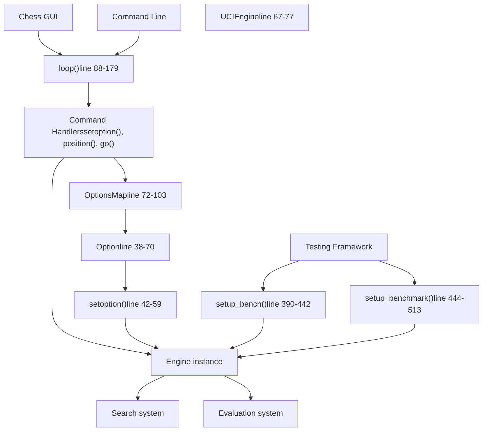
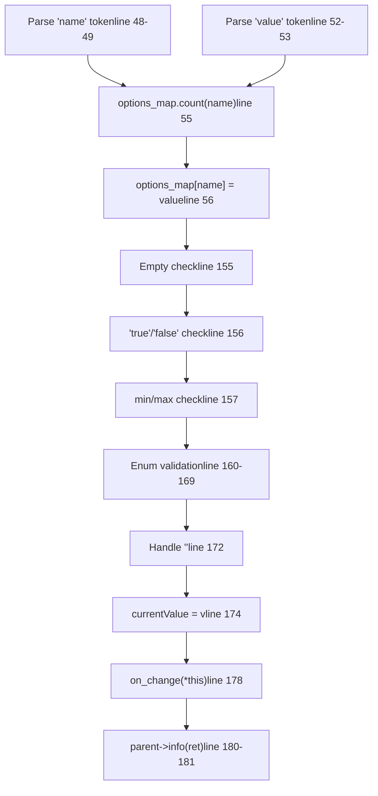
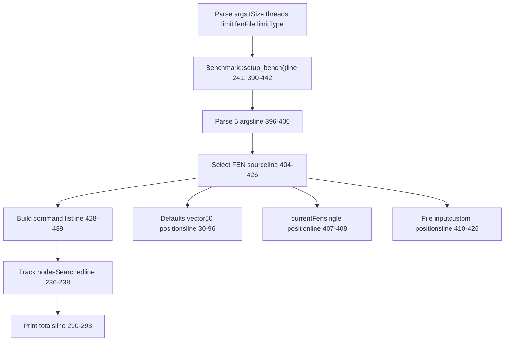
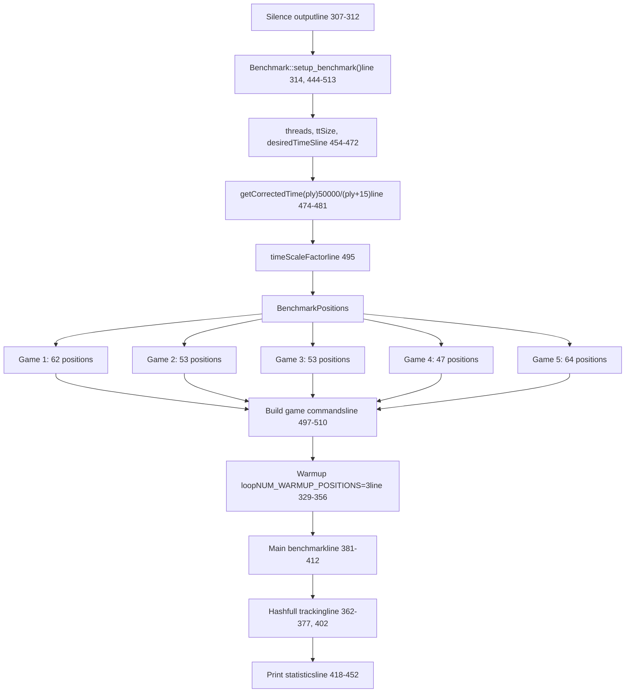
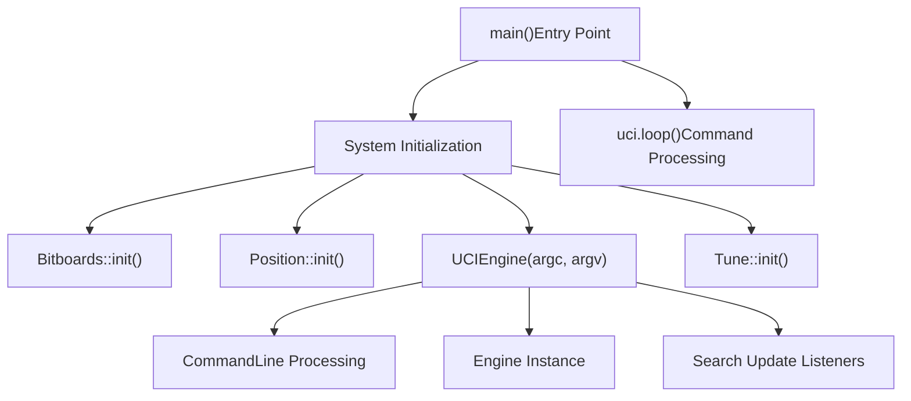

# External Interface

Relevant source files

-   [src/benchmark.cpp](https://github.com/official-stockfish/Stockfish/blob/c27c1747/src/benchmark.cpp)
-   [src/main.cpp](https://github.com/official-stockfish/Stockfish/blob/c27c1747/src/main.cpp)
-   [src/uci.cpp](https://github.com/official-stockfish/Stockfish/blob/c27c1747/src/uci.cpp)
-   [src/ucioption.cpp](https://github.com/official-stockfish/Stockfish/blob/c27c1747/src/ucioption.cpp)
-   [src/ucioption.h](https://github.com/official-stockfish/Stockfish/blob/c27c1747/src/ucioption.h)

The External Interface provides communication between Stockfish and external programs through the UCI (Universal Chess Interface) protocol, configuration management via `OptionsMap`, and performance testing through benchmark facilities. The primary entry point is the `UCIEngine` class defined in [src/uci.cpp67-77](https://github.com/official-stockfish/Stockfish/blob/c27c1747/src/uci.cpp#L67-L77) and [src/uci.h39-76](https://github.com/official-stockfish/Stockfish/blob/c27c1747/src/uci.h#L39-L76)

For UCI protocol command handling details, see [UCI Protocol Handler](/official-stockfish/Stockfish/6.1-uci-protocol-handler). For configuration system implementation, see [UCI Options and Configuration](/official-stockfish/Stockfish/6.2-uci-options-and-configuration).

## System Architecture

**Core Interface Components**

**`UCIEngine` Class Structure**

The `UCIEngine` class encapsulates the UCI protocol implementation and owns an `Engine` instance:

| Component | Type | Location | Purpose |
| --- | --- | --- | --- |
| `engine` | `Engine` | [src/uci.h74](https://github.com/official-stockfish/Stockfish/blob/c27c1747/src/uci.h#L74-L74) | Core chess engine instance |
| `cli` | `CommandLine` | [src/uci.h75](https://github.com/official-stockfish/Stockfish/blob/c27c1747/src/uci.h#L75-L75) | Command-line argument parser |
| `loop()` | Method | [src/uci.cpp88-179](https://github.com/official-stockfish/Stockfish/blob/c27c1747/src/uci.cpp#L88-L179) | Main command processing loop |
| `setoption()` | Method | [src/uci.cpp457-460](https://github.com/official-stockfish/Stockfish/blob/c27c1747/src/uci.cpp#L457-L460) | UCI option configuration |
| `position()` | Method | [src/uci.cpp468-492](https://github.com/official-stockfish/Stockfish/blob/c27c1747/src/uci.cpp#L468-L492) | Board position setup |
| `go()` | Method | [src/uci.cpp220-228](https://github.com/official-stockfish/Stockfish/blob/c27c1747/src/uci.cpp#L220-L228) | Search initialization |
| `bench()` | Method | [src/uci.cpp230-297](https://github.com/official-stockfish/Stockfish/blob/c27c1747/src/uci.cpp#L230-L297) | Traditional benchmark |
| `benchmark()` | Method | [src/uci.cpp299-455](https://github.com/official-stockfish/Stockfish/blob/c27c1747/src/uci.cpp#L299-L455) | Performance benchmark (speedtest) |

Sources: [src/uci.h39-76](https://github.com/official-stockfish/Stockfish/blob/c27c1747/src/uci.h#L39-L76) [src/uci.cpp67-77](https://github.com/official-stockfish/Stockfish/blob/c27c1747/src/uci.cpp#L67-L77) [src/ucioption.h72-103](https://github.com/official-stockfish/Stockfish/blob/c27c1747/src/ucioption.h#L72-L103) [src/benchmark.cpp377-515](https://github.com/official-stockfish/Stockfish/blob/c27c1747/src/benchmark.cpp#L377-L515)

## UCI Protocol Message Flow

**Command-Response Sequence**

> **[Mermaid sequence]**
> *(图表结构无法解析)*

**UCI Command Tokens Recognized**

The `loop()` function [src/uci.cpp88-179](https://github.com/official-stockfish/Stockfish/blob/c27c1747/src/uci.cpp#L88-L179) parses these command tokens:

| Token | Handler Method | Line | Description |
| --- | --- | --- | --- |
| `"uci"` | inline | 115-121 | Engine identification |
| `"setoption"` | `setoption()` | 123-124, 457-460 | Configure options |
| `"go"` | `go()` | 125-131, 220-228 | Start search |
| `"position"` | `position()` | 132-133, 468-492 | Set board position |
| `"ucinewgame"` | inline | 134-135 | Clear search state |
| `"isready"` | inline | 136-137 | Synchronization |
| `"quit"` / `"stop"` | inline | 105-106 | Terminate/stop search |
| `"ponderhit"` | inline | 112-113 | Ponder mode transition |

**Custom Commands** (non-UCI):

| Token | Handler | Line | Description |
| --- | --- | --- | --- |
| `"bench"` | `bench()` | 143-144, 230-297 | Traditional benchmark |
| `"speedtest"` | `benchmark()` | 145-146, 299-455 | Performance benchmark |
| `"d"` | inline | 147-148 | Display position |
| `"eval"` | inline | 149-150 | Trace evaluation |
| `"flip"` | inline | 141-142 | Mirror board |
| `"export_net"` | inline | 153-164 | Export NNUE networks |

Sources: [src/uci.cpp88-179](https://github.com/official-stockfish/Stockfish/blob/c27c1747/src/uci.cpp#L88-L179) [src/uci.cpp457-460](https://github.com/official-stockfish/Stockfish/blob/c27c1747/src/uci.cpp#L457-L460) [src/uci.cpp468-492](https://github.com/official-stockfish/Stockfish/blob/c27c1747/src/uci.cpp#L468-L492) [src/uci.cpp220-228](https://github.com/official-stockfish/Stockfish/blob/c27c1747/src/uci.cpp#L220-L228)

## Command Processing Loop

**`loop()` Implementation**

The main loop [src/uci.cpp88-179](https://github.com/official-stockfish/Stockfish/blob/c27c1747/src/uci.cpp#L88-L179) operates in two modes:

1.  **Interactive mode** (`argc == 1`): Reads commands from `std::cin` line-by-line until EOF or `"quit"`
2.  **Batch mode** (`argc > 1`): Concatenates command-line arguments and executes once

```mermaid
flowchart TD
    StdIn["std::cin(interactive)"]
    Argv["cli.argv(batch)"]
    GetLine["getline(cin, cmd)line 97"]
    Tokenize["istringstream is(cmd)line 100"]
    ExtractToken["is >> skipws >> tokenline 103"]
    Uci["token == 'uci'line 115-121"]
    IsReady["token == 'isready'line 136-137"]
    UciNewGame["token == 'ucinewgame'line 134-135"]
    Stop["token == 'stop/quit'line 105-106"]
    Ponderhit["token == 'ponderhit'line 112-113"]
    SetoptionCall["setoption(is)line 124, 457-460"]
    PositionCall["position(is)line 133, 468-492"]
    GoCall["go(is)line 130, 220-228"]
    BenchCall["bench(is)line 144, 230-297"]
    BenchmarkCall["benchmark(is)line 146, 299-455"]
    Display["token == 'd'line 147-148"]
    Eval["token == 'eval'line 149-150"]
    Flip["token == 'flip'line 141-142"]
    ExportNet["token == 'export_net'line 153-164"]
    Compiler["token == 'compiler'line 151-152"]

    StdIn --> GetLine
    Argv --> GetLine
    GetLine --> Tokenize
    Tokenize --> ExtractToken
    ExtractToken --> Uci
    ExtractToken --> IsReady
    ExtractToken --> UciNewGame
    ExtractToken --> Stop
    ExtractToken --> Ponderhit
    ExtractToken --> SetoptionCall
    ExtractToken --> PositionCall
    ExtractToken --> GoCall
    ExtractToken --> BenchCall
    ExtractToken --> BenchmarkCall
    ExtractToken --> Display
    ExtractToken --> Eval
    ExtractToken --> Flip
    ExtractToken --> ExportNet
    ExtractToken --> Compiler
```

**Search Callback Registration**

The constructor [src/uci.cpp67-77](https://github.com/official-stockfish/Stockfish/blob/c27c1747/src/uci.cpp#L67-L77) and `init_search_update_listeners()` [src/uci.cpp79-86](https://github.com/official-stockfish/Stockfish/blob/c27c1747/src/uci.cpp#L79-L86) register callbacks for search progress reporting:

| Callback | Function | Line | Trigger |
| --- | --- | --- | --- |
| `on_iter` | `UCIEngine::on_iter()` | 80, 643-652 | New depth iteration starts |
| `on_update_no_moves` | `UCIEngine::on_update_no_moves()` | 81, 614-616 | No legal moves at root |
| `on_update_full` | `UCIEngine::on_update_full()` | 82-83, 618-641 | Search info update |
| `on_bestmove` | `UCIEngine::on_bestmove()` | 84, 654-659 | Search completes |
| `on_verify_networks` | `print_info_string()` | 85, 55-65 | NNUE network verification |

Sources: [src/uci.cpp88-179](https://github.com/official-stockfish/Stockfish/blob/c27c1747/src/uci.cpp#L88-L179) [src/uci.cpp67-86](https://github.com/official-stockfish/Stockfish/blob/c27c1747/src/uci.cpp#L67-L86) [src/uci.h63-68](https://github.com/official-stockfish/Stockfish/blob/c27c1747/src/uci.h#L63-L68)

## Option System

**`OptionsMap` and `Option` Classes**

The `OptionsMap` class [src/ucioption.h72-103](https://github.com/official-stockfish/Stockfish/blob/c27c1747/src/ucioption.h#L72-L103) maintains a `std::map<std::string, Option, CaseInsensitiveLess>` for case-insensitive option lookup [src/ucioption.h99-101](https://github.com/official-stockfish/Stockfish/blob/c27c1747/src/ucioption.h#L99-L101) The `Option` class [src/ucioption.h38-70](https://github.com/official-stockfish/Stockfish/blob/c27c1747/src/ucioption.h#L38-L70) supports five UCI option types with validation:

| Type | Constructor | Validation Logic | Line |
| --- | --- | --- | --- |
| `"spin"` | `Option(int v, int minv, int maxv, OnChange)` | `stoi(v) >= min && stoi(v) <= max` | 113-119, 157 |
| `"check"` | `Option(bool v, OnChange)` | `v == "true" || v == "false"` | 99-105, 156 |
| `"string"` | `Option(const char* v, OnChange)` | None (empty string as `"<empty>"`) | 91-97, 172 |
| `"combo"` | `Option(const char* v, const char* cur, OnChange)` | Value in enumeration list | 121-128, 160-169 |
| `"button"` | `Option(OnChange)` | No stored value | 107-111, 155 |

**Option Assignment Flow**

**Type Conversion Operators**

The `Option` class provides implicit conversions [src/ucioption.cpp130-145](https://github.com/official-stockfish/Stockfish/blob/c27c1747/src/ucioption.cpp#L130-L145):

| Operator | Return Type | Condition | Line |
| --- | --- | --- | --- |
| `operator int()` | `int` | `type == "spin"`: returns `stoi(currentValue)`
`type == "check"`: returns 1 or 0 | 130-133 |
| `operator std::string()` | `std::string` | `type == "string"`: returns `currentValue` | 135-138 |
| `operator==(const char*)` | `bool` | `type == "combo"`: case-insensitive compare | 140-143 |

Sources: [src/ucioption.cpp42-185](https://github.com/official-stockfish/Stockfish/blob/c27c1747/src/ucioption.cpp#L42-L185) [src/ucioption.h38-103](https://github.com/official-stockfish/Stockfish/blob/c27c1747/src/ucioption.h#L38-L103)

## Benchmark Commands

**Two Benchmark Modes**

Stockfish provides two distinct benchmark commands with different purposes:

| Command | Function | Purpose | Position Source | Lines |
| --- | --- | --- | --- | --- |
| `bench` | `UCIEngine::bench()` | Traditional benchmark for regression testing | `Defaults` vector or file | 230-297, 390-442 |
| `speedtest` | `UCIEngine::benchmark()` | Performance benchmark with realistic game timing | `BenchmarkPositions` vector (5 games) | 299-455, 444-513 |

**`bench` Command Setup**

**`speedtest` Command Setup**

The `BenchmarkCommand` constant [src/uci.cpp44](https://github.com/official-stockfish/Stockfish/blob/c27c1747/src/uci.cpp#L44-L44) defines `"speedtest"` as the command token. The `benchmark()` method [src/uci.cpp299-455](https://github.com/official-stockfish/Stockfish/blob/c27c1747/src/uci.cpp#L299-L455) uses a more sophisticated setup:

**Benchmark Statistics Collection**

The `benchmark()` command tracks additional statistics [src/uci.cpp362-377](https://github.com/official-stockfish/Stockfish/blob/c27c1747/src/uci.cpp#L362-L377) [src/uci.cpp420-450](https://github.com/official-stockfish/Stockfish/blob/c27c1747/src/uci.cpp#L420-L450):

| Statistic | Variables | Purpose |
| --- | --- | --- |
| Total nodes | `nodes` | Cumulative node count |
| Total time | `totalTime` | Cumulative search time in ms |
| Nodes/second | `1000 * nodes / totalTime` | Performance metric |
| Hashfull readings | `numHashfullReadings` | Number of samples |
| Normal hashfull | `totalHashfull[0]`, `maxHashfull[0]` | Hash table utilization (age 0) |
| Touched hashfull | `totalHashfull[1]`, `maxHashfull[1]` | Hash table utilization (age 999) |

Sources: [src/benchmark.cpp377-515](https://github.com/official-stockfish/Stockfish/blob/c27c1747/src/benchmark.cpp#L377-L515) [src/uci.cpp230-297](https://github.com/official-stockfish/Stockfish/blob/c27c1747/src/uci.cpp#L230-L297) [src/uci.cpp299-455](https://github.com/official-stockfish/Stockfish/blob/c27c1747/src/uci.cpp#L299-L455) [src/uci.cpp44](https://github.com/official-stockfish/Stockfish/blob/c27c1747/src/uci.cpp#L44-L44)

## Entry Point and Initialization

The external interface is initialized through the main entry point, which sets up the UCI engine and establishes the communication layer:

The `UCIEngine` constructor establishes the communication framework by setting up callback functions for search updates and integrating with the engine's option system.

Sources: [src/main.cpp30-43](https://github.com/official-stockfish/Stockfish/blob/c27c1747/src/main.cpp#L30-L43) [src/uci.cpp67-86](https://github.com/official-stockfish/Stockfish/blob/c27c1747/src/uci.cpp#L67-L86) [src/uci.h41-59](https://github.com/official-stockfish/Stockfish/blob/c27c1747/src/uci.h#L41-L59)
