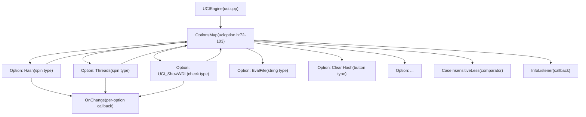
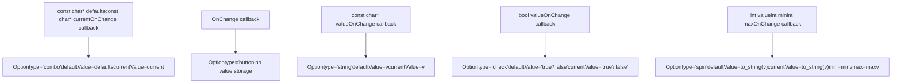
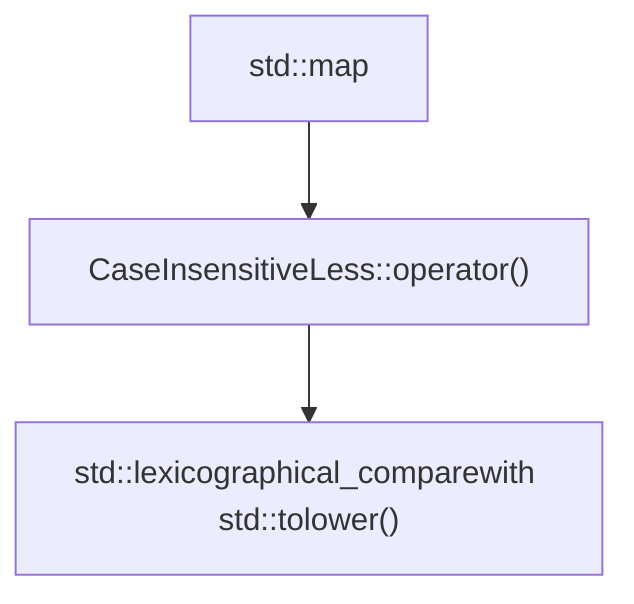
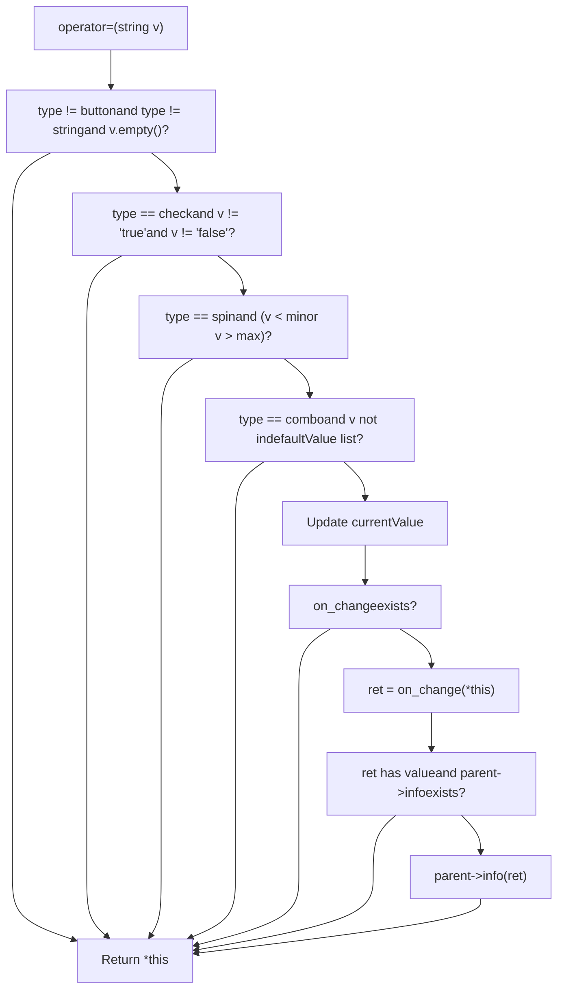
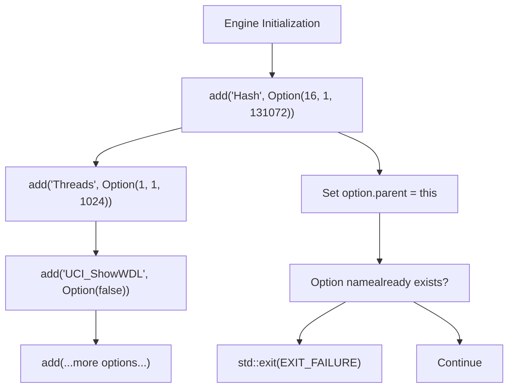

# UCI Options and Configuration

Relevant source files

-   [src/ucioption.cpp](https://github.com/official-stockfish/Stockfish/blob/c27c1747/src/ucioption.cpp)
-   [src/ucioption.h](https://github.com/official-stockfish/Stockfish/blob/c27c1747/src/ucioption.h)

## Purpose and Scope

This document describes the UCI options system in Stockfish, which provides a type-safe, configurable parameter system compliant with the Universal Chess Interface (UCI) protocol. The system allows chess GUIs and users to configure engine behavior through standardized option types including integers (spin), booleans (check), strings, buttons, and enumerated values (combo).

For information about how these options are used by the UCI protocol handler, see [UCI Protocol Handler](/official-stockfish/Stockfish/6.1-uci-protocol-handler). For details on specific engine features controlled by options (thread pool, hash table, NNUE networks), see [Thread Management and Parallel Search](/official-stockfish/Stockfish/4.2-thread-management-and-parallel-search) and [NNUE Neural Network Evaluation](/official-stockfish/Stockfish/5.1-nnue-neural-network-evaluation).

## System Architecture

The options system consists of two primary classes: `OptionsMap` which acts as a container for all engine options, and `Option` which represents individual configurable parameters with type safety and validation.


**Sources:** [src/ucioption.h1-106](https://github.com/official-stockfish/Stockfish/blob/c27c1747/src/ucioption.h#L1-L106) [src/ucioption.cpp1-213](https://github.com/official-stockfish/Stockfish/blob/c27c1747/src/ucioption.cpp#L1-L213)

## Option Types and Constructors

Stockfish supports five distinct option types, each with a dedicated constructor that enforces type-specific constraints:

| Option Type | UCI Protocol Name | C++ Constructor Signature | Purpose |
| --- | --- | --- | --- |
| **Spin** | `spin` | `Option(int v, int minv, int maxv, OnChange f)` | Integer values with min/max bounds |
| **Check** | `check` | `Option(bool v, OnChange f)` | Boolean flags (true/false) |
| **String** | `string` | `Option(const char* v, OnChange f)` | Arbitrary text values |
| **Button** | `button` | `Option(OnChange f)` | Trigger actions (no value storage) |
| **Combo** | `combo` | `Option(const char* v, const char* cur, OnChange f)` | Enumerated choices from list |

### Constructor Details


**Sources:** [src/ucioption.cpp88-128](https://github.com/official-stockfish/Stockfish/blob/c27c1747/src/ucioption.cpp#L88-L128)

### Type Conversion Operators

The `Option` class provides implicit conversion operators for accessing option values in a type-safe manner:

-   **`operator int()`**: Converts `spin` or `check` options to integer (check returns 0 or 1)
-   **`operator std::string()`**: Returns string option value
-   **`operator==(const char*)`**: Case-insensitive comparison for `combo` options
-   **`operator!=(const char*)`**: Negation of equality comparison

**Sources:** [src/ucioption.cpp130-145](https://github.com/official-stockfish/Stockfish/blob/c27c1747/src/ucioption.cpp#L130-L145) [src/ucioption.h49-53](https://github.com/official-stockfish/Stockfish/blob/c27c1747/src/ucioption.h#L49-L53)

## Option Lifecycle and Modification

**Sources:** [src/ucioption.cpp42-59](https://github.com/official-stockfish/Stockfish/blob/c27c1747/src/ucioption.cpp#L42-L59) [src/ucioption.cpp151-185](https://github.com/official-stockfish/Stockfish/blob/c27c1747/src/ucioption.cpp#L151-L185)

## Key Classes and Interfaces

### OptionsMap Class

The `OptionsMap` class maintains a case-insensitive map of option names to `Option` objects. It serves as the central registry for all engine configuration parameters.

**Data Members:**

-   `OptionsStore options_map` - `std::map<std::string, Option, CaseInsensitiveLess>` storing all options
-   `InfoListener info` - Callback for sending informational messages to the GUI

**Key Methods:**

| Method | Signature | Purpose |
| --- | --- | --- |
| `add()` | `void add(const std::string& name, const Option& option)` | Register new option with sequential index |
| `setoption()` | `void setoption(std::istringstream& is)` | Parse and apply UCI setoption command |
| `operator[]` | `const Option& operator[](const std::string& name) const` | Retrieve option by name (case-insensitive) |
| `count()` | `std::size_t count(const std::string& name) const` | Check if option exists |
| `add_info_listener()` | `void add_info_listener(InfoListener&& func)` | Set GUI notification callback |

**Sources:** [src/ucioption.h72-103](https://github.com/official-stockfish/Stockfish/blob/c27c1747/src/ucioption.h#L72-L103) [src/ucioption.cpp40-86](https://github.com/official-stockfish/Stockfish/blob/c27c1747/src/ucioption.cpp#L40-L86)

### Option Class

The `Option` class represents a single configurable parameter with type information, validation, and change notification.

**Data Members:**

```
std::string       defaultValue   // Original default value
std::string       currentValue   // Current active value
std::string       type           // UCI type: "spin", "check", "string", "button", "combo"
int               min, max       // For spin options
size_t            idx            // Insertion order for printing
OnChange          on_change      // Optional callback function
const OptionsMap* parent         // Back-pointer to containing map
```
**Callback Type:**

```
using OnChange = std::function<std::optional<std::string>(const Option&)>;
```
The `OnChange` callback is invoked when an option value changes. It receives the modified `Option` object and may return an optional message string to be forwarded to the GUI via the `InfoListener`.

**Sources:** [src/ucioption.h38-70](https://github.com/official-stockfish/Stockfish/blob/c27c1747/src/ucioption.h#L38-L70) [src/ucioption.cpp88-185](https://github.com/official-stockfish/Stockfish/blob/c27c1747/src/ucioption.cpp#L88-L185)

### CaseInsensitiveLess Comparator


The `CaseInsensitiveLess` struct provides a case-insensitive comparison operator for the options map, ensuring that option names like "Hash", "hash", and "HASH" are treated as equivalent per UCI protocol requirements.

**Implementation:**

-   Uses `std::lexicographical_compare()` with lambda applying `std::tolower()` to each character
-   Enables case-insensitive key lookup in the `std::map` container

**Sources:** [src/ucioption.h31-33](https://github.com/official-stockfish/Stockfish/blob/c27c1747/src/ucioption.h#L31-L33) [src/ucioption.cpp33-38](https://github.com/official-stockfish/Stockfish/blob/c27c1747/src/ucioption.cpp#L33-L38)

## Value Validation and Constraints

The assignment operator `Option::operator=()` implements comprehensive validation before accepting new values:


### Validation Rules

1.  **Empty Value Check**: Button and string options allow empty values; others reject them
2.  **Boolean Check**: Check options must be exactly "true" or "false"
3.  **Range Check**: Spin options must be within \[min, max\] bounds
4.  **Combo Check**: Combo options must match one of the allowed values (case-insensitive)
5.  **String Special Case**: String value `"<empty>"` is converted to empty string `""`

**Sources:** [src/ucioption.cpp151-185](https://github.com/official-stockfish/Stockfish/blob/c27c1747/src/ucioption.cpp#L151-L185)

## UCI Protocol Integration

### Setoption Command Parsing

The `OptionsMap::setoption()` method parses UCI setoption commands with the format:

```
setoption name <option_name> value <option_value>
```
Both option names and values can contain spaces, requiring careful tokenization:

1.  Skip the "name" token
2.  Accumulate tokens until "value" keyword is encountered
3.  Accumulate remaining tokens as the value
4.  Look up option by name (case-insensitive)
5.  Apply value via `Option::operator=()`

**Sources:** [src/ucioption.cpp42-59](https://github.com/official-stockfish/Stockfish/blob/c27c1747/src/ucioption.cpp#L42-L59)

### Option Output Format

The `operator<<(std::ostream&, const OptionsMap&)` formats all options for UCI protocol output, respecting insertion order via the `idx` field:

```
option name <name> type <type> [default <default>] [min <min>] [max <max>]
```
**Type-Specific Formatting:**

-   **spin**: Includes `default`, `min`, and `max` fields
-   **check**: Includes `default` ("true" or "false")
-   **string**: Includes `default` (or `"<empty>"` if empty)
-   **combo**: Includes `default` value (space-separated list of choices)
-   **button**: No additional fields

**Sources:** [src/ucioption.cpp187-212](https://github.com/official-stockfish/Stockfish/blob/c27c1747/src/ucioption.cpp#L187-L212)

## Option Registration Pattern

Options are typically registered during engine initialization using the `OptionsMap::add()` method, which assigns sequential indices for deterministic output ordering:


The insertion order is preserved via the `idx` field, ensuring consistent option output across engine restarts. Attempting to register duplicate option names causes immediate program termination.

**Sources:** [src/ucioption.cpp68-83](https://github.com/official-stockfish/Stockfish/blob/c27c1747/src/ucioption.cpp#L68-L83)

## Callback Mechanism

The options system supports two levels of callbacks for responding to configuration changes:

### Per-Option OnChange Callback

Each `Option` can have an associated `OnChange` function that executes when the option value changes:

**Signature:**

```
std::function<std::optional<std::string>(const Option&)>
```
**Behavior:**

-   Called after value validation succeeds and `currentValue` is updated
-   Receives const reference to the modified `Option` object
-   Returns optional message string for GUI notification
-   If message is returned and `parent->info` exists, message is forwarded to GUI

**Common Use Cases:**

-   Resize transposition table when Hash option changes
-   Reinitialize thread pool when Threads option changes
-   Reload NNUE network when EvalFile changes
-   Clear hash tables when Clear Hash button is pressed

### Global InfoListener Callback

The `OptionsMap` maintains a single `InfoListener` callback that receives all messages from option change handlers:

**Signature:**

```
std::function<void(std::optional<std::string>)>
```
This callback is typically set by the UCI engine to forward informational messages to the chess GUI via UCI info strings.

**Sources:** [src/ucioption.h40](https://github.com/official-stockfish/Stockfish/blob/c27c1747/src/ucioption.h#L40-L40) [src/ucioption.h74](https://github.com/official-stockfish/Stockfish/blob/c27c1747/src/ucioption.h#L74-L74) [src/ucioption.cpp40](https://github.com/official-stockfish/Stockfish/blob/c27c1747/src/ucioption.cpp#L40-L40) [src/ucioption.cpp176-182](https://github.com/official-stockfish/Stockfish/blob/c27c1747/src/ucioption.cpp#L176-L182)

## Thread Safety Considerations

The options system is **not thread-safe**. Option modifications should only occur:

1.  During engine initialization before threads are started
2.  Between search operations when the engine is idle
3.  Via UCI commands processed on the main thread

The UCI protocol ensures serialization of commands, preventing concurrent option modifications during active searches. Options are typically read by worker threads but never modified concurrently.

**Sources:** Based on architectural understanding from diagrams and thread system design
