# Build System

Relevant source files

-   [AUTHORS](https://github.com/official-stockfish/Stockfish/blob/c27c1747/AUTHORS)
-   [src/Makefile](https://github.com/official-stockfish/Stockfish/blob/c27c1747/src/Makefile)

## Purpose and Scope

This document describes the Stockfish build system, which is implemented as a GNU Makefile located at [src/Makefile](https://github.com/official-stockfish/Stockfish/blob/c27c1747/src/Makefile) The build system is responsible for compiling the engine with appropriate architecture-specific optimizations, managing profile-guided optimization (PGO), downloading neural network files, and supporting multiple compilers and platforms. For information about the network files themselves, see [NNUE Neural Network Evaluation](/official-stockfish/Stockfish/5.1-nnue-neural-network-evaluation). For information about testing and benchmarking after building, see [Testing and Benchmarking](/official-stockfish/Stockfish/7.3-testing-and-benchmarking).

## Build System Architecture

The build system is structured in five main sections within [src/Makefile18-1147](https://github.com/official-stockfish/Stockfish/blob/c27c1747/src/Makefile#L18-L1147):

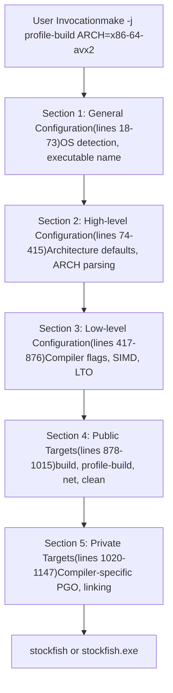
Sources: [src/Makefile18-1147](https://github.com/official-stockfish/Stockfish/blob/c27c1747/src/Makefile#L18-L1147)

## Architecture Selection

The build system supports a wide range of CPU architectures through the `ARCH` parameter. If not specified, `ARCH` defaults to `native`, which auto-detects the host CPU capabilities using [../scripts/get\_native\_properties.sh](https://github.com/official-stockfish/Stockfish/blob/c27c1747/../scripts/get_native_properties.sh)

### Architecture Detection and Validation

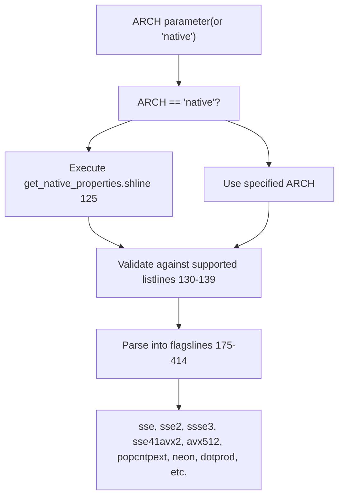
Sources: [src/Makefile120-414](https://github.com/official-stockfish/Stockfish/blob/c27c1747/src/Makefile#L120-L414)

### Supported Architecture Categories

| Category | Example Architectures | Key Features |
| --- | --- | --- |
| **x86-64** | `x86-64-avx512icl`, `x86-64-avx2`, `x86-64-bmi2` | SSE, AVX, VNNI, PEXT instructions |
| **x86-32** | `x86-32-sse41-popcnt`, `x86-32-sse2` | 32-bit x86 with various SIMD levels |
| **ARM** | `armv8-dotprod`, `armv7-neon`, `apple-silicon` | NEON, dot product support |
| **PowerPC** | `ppc-64-vsx`, `ppc-64-altivec` | Altivec, VSX SIMD |
| **Other** | `riscv64`, `loongarch64-lasx`, `e2k` | Various other architectures |

Sources: [src/Makefile130-414](https://github.com/official-stockfish/Stockfish/blob/c27c1747/src/Makefile#L130-L414) [src/Makefile898-930](https://github.com/official-stockfish/Stockfish/blob/c27c1747/src/Makefile#L898-L930)

### Architecture to Flags Mapping

The Makefile converts architecture specifications into compiler flags using conditional logic:

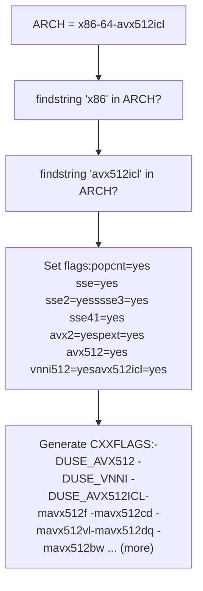
Sources: [src/Makefile283-294](https://github.com/official-stockfish/Stockfish/blob/c27c1747/src/Makefile#L283-L294) [src/Makefile736-741](https://github.com/official-stockfish/Stockfish/blob/c27c1747/src/Makefile#L736-L741)

## Compiler Configuration

The build system supports multiple compilers via the `COMP` parameter, with `gcc` as the default. The compiler can also be overridden directly using `COMPCXX`.

### Compiler Selection Flow

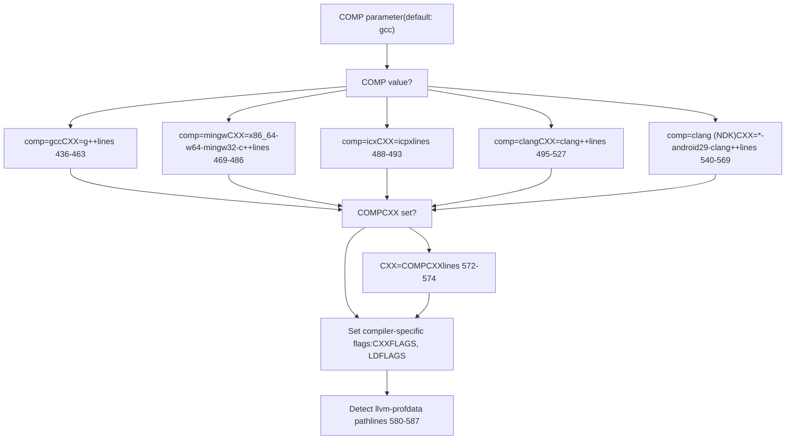
Sources: [src/Makefile432-587](https://github.com/official-stockfish/Stockfish/blob/c27c1747/src/Makefile#L432-L587)

### Compiler-Specific Flags

Each compiler has specific warning flags and optimization settings:

| Compiler | Key Flags |
| --- | --- |
| **gcc** | `-pedantic -Wextra -Wshadow -Wmissing-declarations -Wstack-usage=128000` |
| **clang** | `-pedantic -Wextra -Wshadow -Wmissing-prototypes -Wconditional-uninitialized` |
| **icx** | `--intel -pedantic -Wextra -Wshadow -Wmissing-prototypes -Wabi -Wdeprecated` |
| **mingw** | `-pedantic -Wextra -Wshadow -Wmissing-declarations` |

Sources: [src/Makefile439](https://github.com/official-stockfish/Stockfish/blob/c27c1747/src/Makefile#L439-L439) [src/Makefile485](https://github.com/official-stockfish/Stockfish/blob/c27c1747/src/Makefile#L485-L485) [src/Makefile491-492](https://github.com/official-stockfish/Stockfish/blob/c27c1747/src/Makefile#L491-L492) [src/Makefile502-503](https://github.com/official-stockfish/Stockfish/blob/c27c1747/src/Makefile#L502-L503)

## Build Targets

### Primary Build Targets

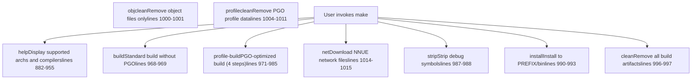
Sources: [src/Makefile882-1015](https://github.com/official-stockfish/Stockfish/blob/c27c1747/src/Makefile#L882-L1015)

### Build Target Dependencies

The build process has several dependency chains:

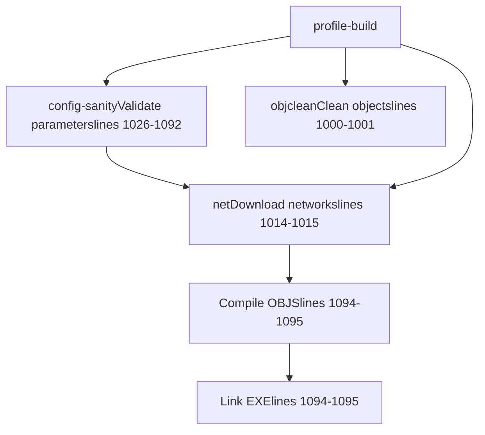
Sources: [src/Makefile968-985](https://github.com/official-stockfish/Stockfish/blob/c27c1747/src/Makefile#L968-L985) [src/Makefile1026-1092](https://github.com/official-stockfish/Stockfish/blob/c27c1747/src/Makefile#L1026-L1092)

## Profile-Guided Optimization

The `profile-build` target implements a four-step PGO workflow that significantly improves performance:

### PGO Workflow

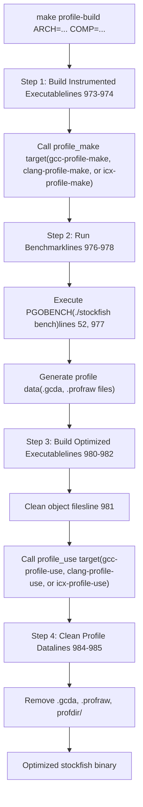
Sources: [src/Makefile971-985](https://github.com/official-stockfish/Stockfish/blob/c27c1747/src/Makefile#L971-L985)

### Compiler-Specific PGO Implementation

Different compilers use different PGO mechanisms:

**GCC Profile Targets** ([src/Makefile1114-1127](https://github.com/official-stockfish/Stockfish/blob/c27c1747/src/Makefile#L1114-L1127)):

-   `gcc-profile-make`: Compiles with `-fprofile-generate=profdir` and links with `-lgcov`
-   `gcc-profile-use`: Compiles with `-fprofile-use=profdir -fno-peel-loops -fno-tracer` and links with `-lgcov`

**Clang Profile Targets** ([src/Makefile1101-1112](https://github.com/official-stockfish/Stockfish/blob/c27c1747/src/Makefile#L1101-L1112)):

-   `clang-profile-make`: Compiles with `-fprofile-generate`
-   `clang-profile-use`: Merges `.profraw` files using `llvm-profdata merge`, then compiles with `-fprofile-use=stockfish.profdata`

**ICX Profile Targets** ([src/Makefile1129-1140](https://github.com/official-stockfish/Stockfish/blob/c27c1747/src/Makefile#L1129-L1140)):

-   `icx-profile-make`: Compiles with `-fprofile-instr-generate`
-   `icx-profile-use`: Merges `.profraw` files using `llvm-profdata merge`, then compiles with `-fprofile-instr-use=stockfish.profdata`

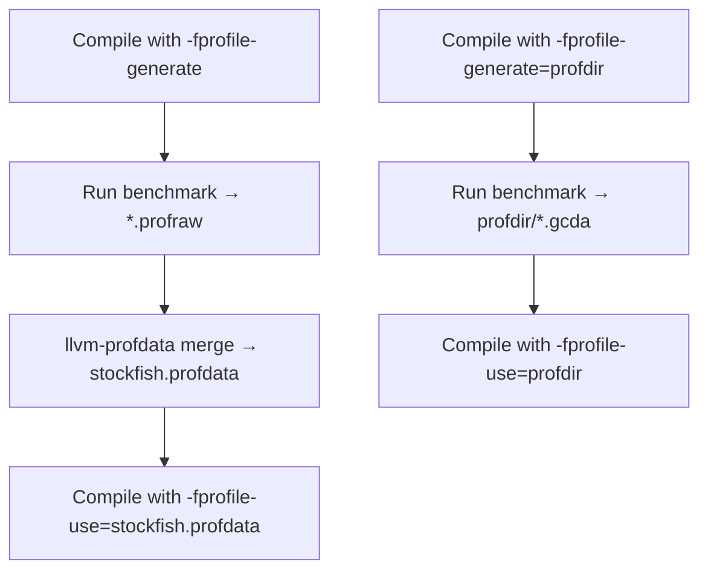
Sources: [src/Makefile589-611](https://github.com/official-stockfish/Stockfish/blob/c27c1747/src/Makefile#L589-L611) [src/Makefile1101-1140](https://github.com/official-stockfish/Stockfish/blob/c27c1747/src/Makefile#L1101-L1140)

## SIMD Instruction Set Configuration

The build system configures SIMD instruction sets based on the selected architecture. These are translated into both preprocessor defines and compiler flags.

### SIMD Flag Variables

The Makefile uses boolean variables to track which instruction sets are enabled:

| Variable | Preprocessor Define | Compiler Flag | Description |
| --- | --- | --- | --- |
| `sse` | N/A | `-msse` | Streaming SIMD Extensions |
| `sse2` | `-DUSE_SSE2` | `-msse2` | SSE2 instructions |
| `ssse3` | `-DUSE_SSSE3` | `-mssse3` | Supplemental SSE3 |
| `sse41` | `-DUSE_SSE41` | `-msse4.1` | SSE 4.1 instructions |
| `avx2` | `-DUSE_AVX2` | `-mavx2 -mbmi` | Advanced Vector Extensions 2 |
| `avxvnni` | `-DUSE_VNNI -DUSE_AVXVNNI` | `-mavxvnni` | AVX Vector Neural Network Instructions |
| `avx512` | `-DUSE_AVX512` | `-mavx512f -mavx512bw -mavx512dq -mavx512vl` | AVX-512 Foundation |
| `vnni512` | `-DUSE_VNNI` | `-mavx512vnni` (+ avx512 flags) | AVX-512 VNNI |
| `neon` | `-DUSE_NEON=<arm_version>` | `-mfpu=neon` (ARM32) | ARM NEON SIMD |
| `dotprod` | `-DUSE_NEON_DOTPROD` | `-march=armv8.2-a+dotprod` | ARM dot product |
| `pext` | `-DUSE_PEXT` | `-mbmi2` | Parallel bit extract |
| `popcnt` | `-DUSE_POPCNT` | `-mpopcnt` | Population count |

Sources: [src/Makefile707-817](https://github.com/official-stockfish/Stockfish/blob/c27c1747/src/Makefile#L707-L817)

### SIMD Configuration Flow

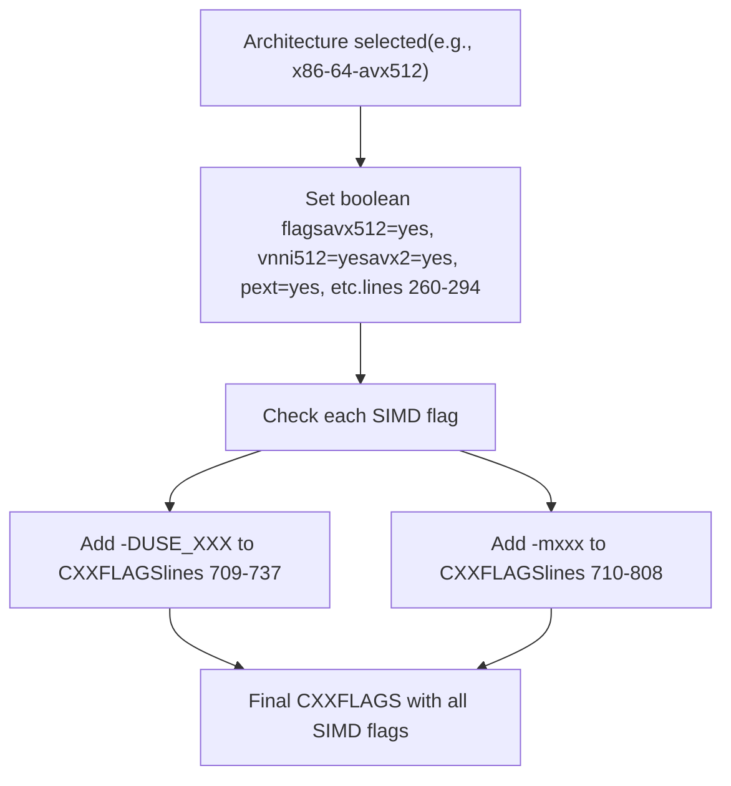
Sources: [src/Makefile260-294](https://github.com/official-stockfish/Stockfish/blob/c27c1747/src/Makefile#L260-L294) [src/Makefile707-817](https://github.com/official-stockfish/Stockfish/blob/c27c1747/src/Makefile#L707-L817)

## Network File Management

The build system automatically downloads required NNUE neural network files using the `net` target.

### Network Download Mechanism

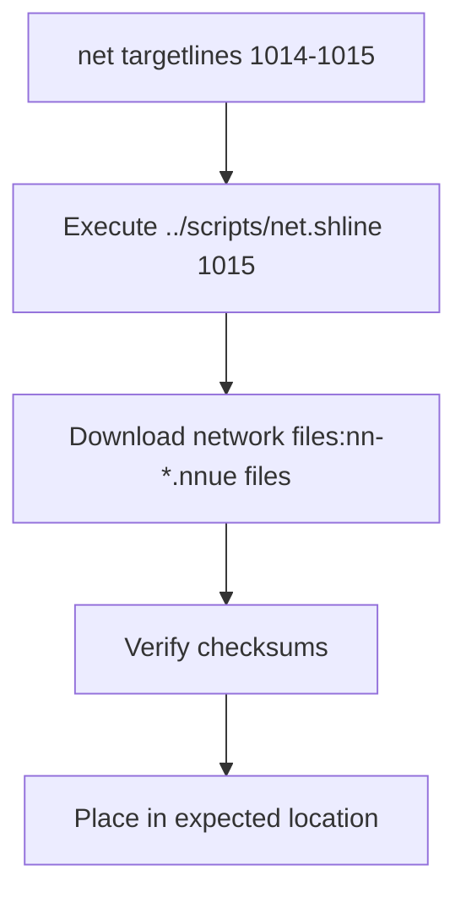
The `net` target is a prerequisite for most build operations, ensuring the network files are present before compilation. It is called by:

-   `build` target (line 968)
-   `profile-build` target (line 971)
-   `config-sanity` target (line 1026)
-   `analyze` target (line 965)

Sources: [src/Makefile1014-1015](https://github.com/official-stockfish/Stockfish/blob/c27c1747/src/Makefile#L1014-L1015) [src/Makefile968-971](https://github.com/official-stockfish/Stockfish/blob/c27c1747/src/Makefile#L968-L971)

## Configuration Options

The build system supports several high-level configuration flags that modify the build behavior:

### Configuration Variables

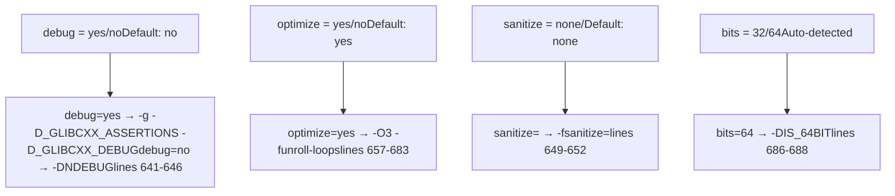
Sources: [src/Makefile141-165](https://github.com/official-stockfish/Stockfish/blob/c27c1747/src/Makefile#L141-L165) [src/Makefile640-688](https://github.com/official-stockfish/Stockfish/blob/c27c1747/src/Makefile#L640-L688)

### Configuration Validation

The `config-sanity` target validates all configuration parameters before building:

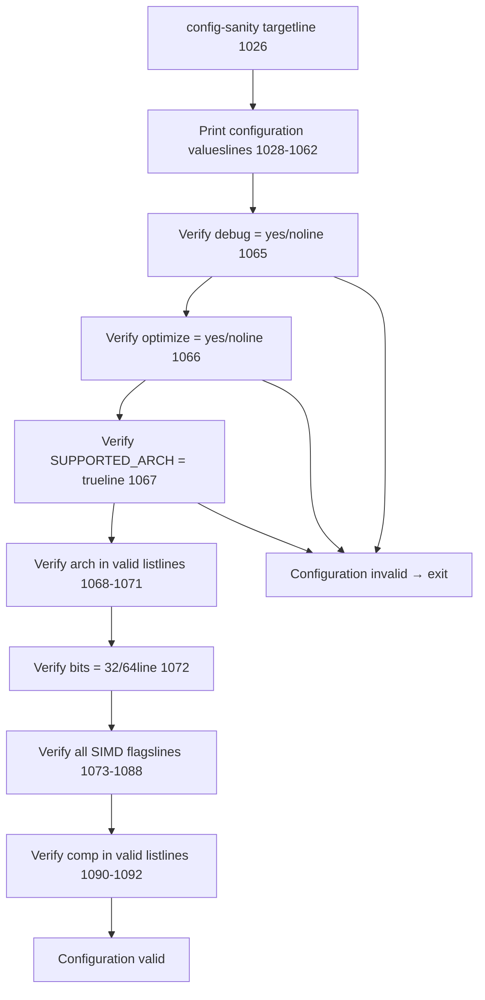
Sources: [src/Makefile1026-1092](https://github.com/official-stockfish/Stockfish/blob/c27c1747/src/Makefile#L1026-L1092)

## Link-Time Optimization

When `optimize=yes` and `debug=no`, the build system enables Link-Time Optimization (LTO) for supported compilers:

### LTO Configuration

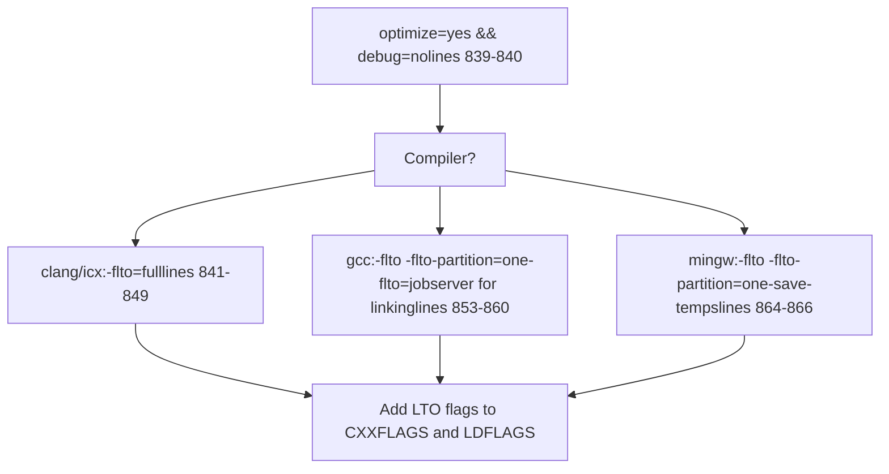
For GCC, the `-flto=jobserver` flag enables parallel LTO compilation using the make jobserver, allowing efficient use of multiple cores during the link phase.

Sources: [src/Makefile836-869](https://github.com/official-stockfish/Stockfish/blob/c27c1747/src/Makefile#L836-L869)

## Platform-Specific Handling

The build system detects the operating system and applies platform-specific configuration:

### OS Detection and Configuration

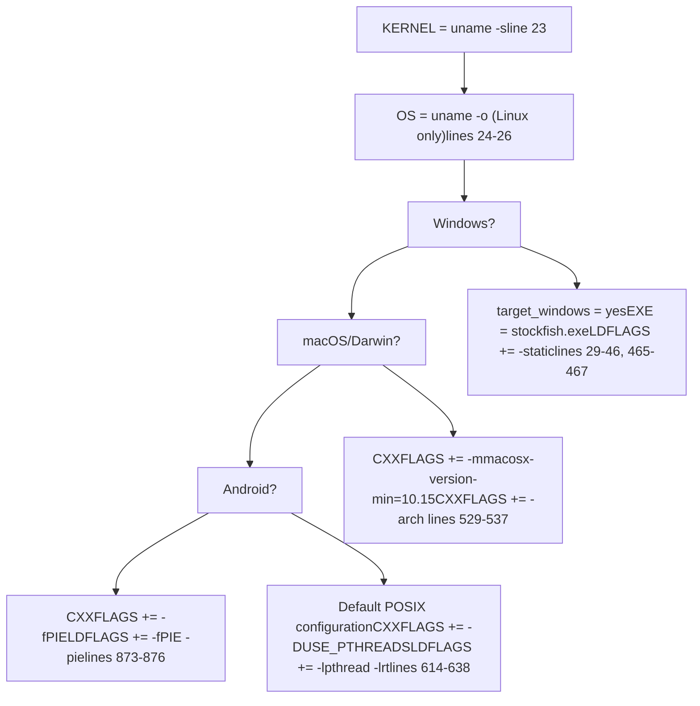
### Threading Configuration

The build system uses POSIX threads (pthreads) on all platforms except Windows with MinGW:

-   **Non-MinGW compilers**: Add `-DUSE_PTHREADS` and link with `-lpthread` (lines 614-638)
-   **MinGW**: Use Windows threads (no pthread flags)
-   **Android**: Bionic C library includes pthread, so no explicit linking needed (lines 617-637)

Sources: [src/Makefile23-46](https://github.com/official-stockfish/Stockfish/blob/c27c1747/src/Makefile#L23-L46) [src/Makefile465-467](https://github.com/official-stockfish/Stockfish/blob/c27c1747/src/Makefile#L465-L467) [src/Makefile529-537](https://github.com/official-stockfish/Stockfish/blob/c27c1747/src/Makefile#L529-L537) [src/Makefile614-638](https://github.com/official-stockfish/Stockfish/blob/c27c1747/src/Makefile#L614-L638) [src/Makefile873-876](https://github.com/official-stockfish/Stockfish/blob/c27c1747/src/Makefile#L873-L876)

## Source Files and Dependencies

The build system tracks source files and automatically generates dependencies:

### Source File Management

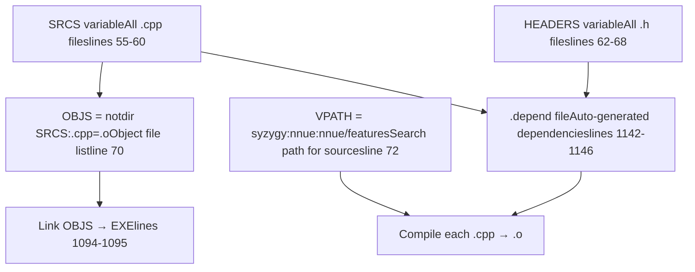
The `.depend` file is automatically regenerated using `$(CXX) $(DEPENDFLAGS) -MM $(SRCS)` and included in the Makefile if the target is not a cleaning operation.

Sources: [src/Makefile54-72](https://github.com/official-stockfish/Stockfish/blob/c27c1747/src/Makefile#L54-L72) [src/Makefile1094-1095](https://github.com/official-stockfish/Stockfish/blob/c27c1747/src/Makefile#L1094-L1095) [src/Makefile1142-1147](https://github.com/official-stockfish/Stockfish/blob/c27c1747/src/Makefile#L1142-L1147)

## Version Information

The build system embeds version information into the binary using Git:

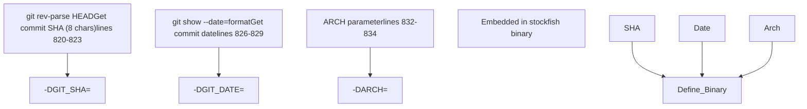
The `misc.o` target is forced to recompile on every build (lines 1098-1099) to ensure version information is always up-to-date.

Sources: [src/Makefile819-834](https://github.com/official-stockfish/Stockfish/blob/c27c1747/src/Makefile#L819-L834) [src/Makefile1098-1099](https://github.com/official-stockfish/Stockfish/blob/c27c1747/src/Makefile#L1098-L1099)

## Example Build Commands

Common build invocations and their effects:

| Command | Description |
| --- | --- |
| `make -j profile-build ARCH=x86-64-avx2` | Build with PGO for AVX2-capable CPUs |
| `make -j profile-build ARCH=x86-64-sse41-popcnt` | Build with PGO for older x86-64 CPUs |
| `make -j build ARCH=armv8-dotprod COMP=clang` | Build for ARM with dot product, using clang |
| `make -j build ARCH=apple-silicon` | Build for Apple Silicon Macs |
| `make build ARCH=x86-64 debug=yes sanitize=address` | Debug build with address sanitizer |
| `make net` | Download neural network files only |
| `make clean` | Remove all build artifacts |

Sources: [src/Makefile940-951](https://github.com/official-stockfish/Stockfish/blob/c27c1747/src/Makefile#L940-L951)
