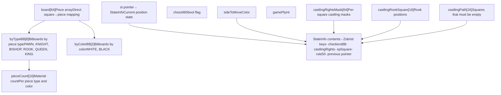
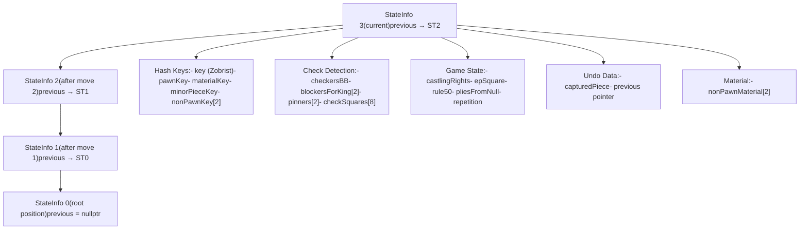
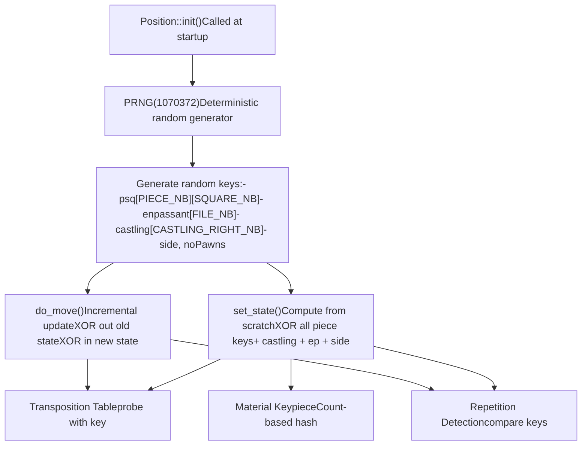
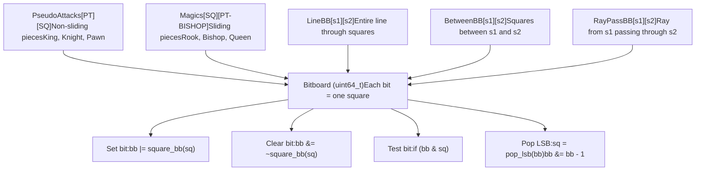
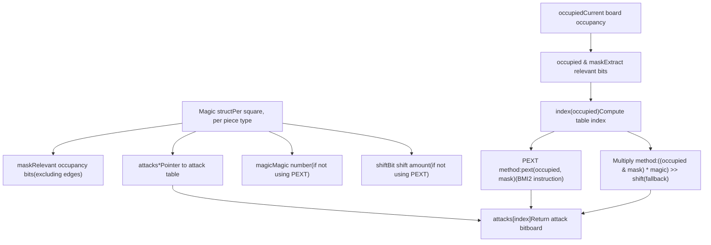
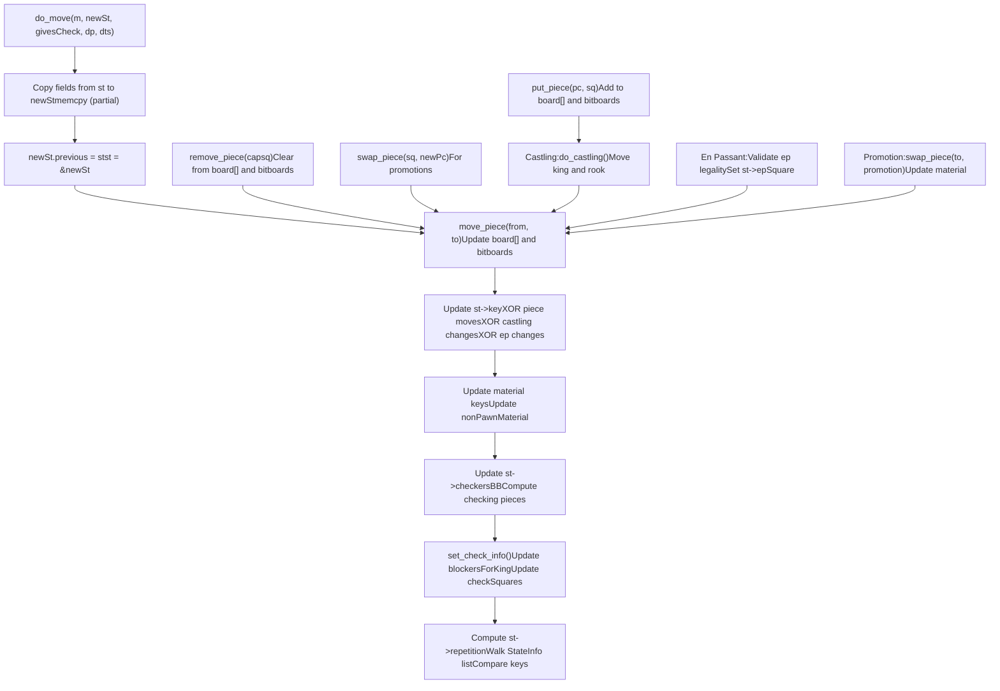
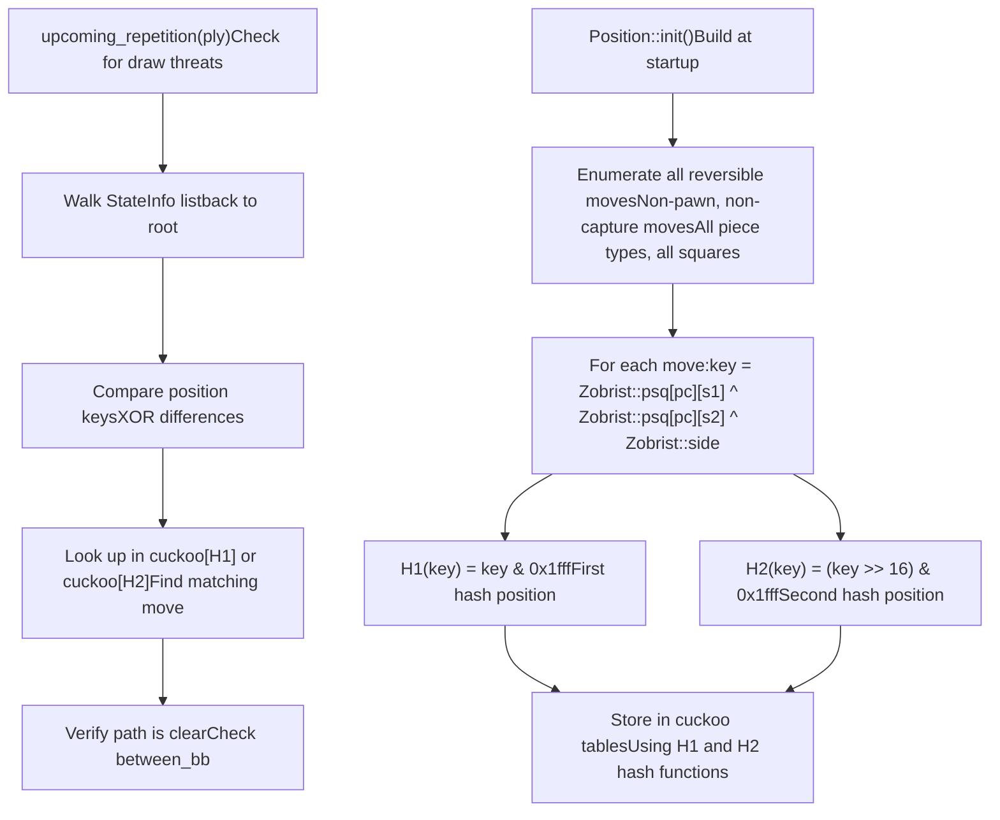

# 棋盘表示

相关源文件

-   [src/bitboard.cpp](https://github.com/official-stockfish/Stockfish/blob/c27c1747/src/bitboard.cpp)
-   [src/bitboard.h](https://github.com/official-stockfish/Stockfish/blob/c27c1747/src/bitboard.h)
-   [src/position.cpp](https://github.com/official-stockfish/Stockfish/blob/c27c1747/src/position.cpp)

## 目的与范围

本文档解释了 Stockfish 内部如何表示国际象棋棋盘状态。引擎维护了多个同步的表示形式，针对不同的操作进行了优化：用于直接查找的棋子数组、用于并行操作的位棋盘（bitboards），以及用于快速局面比较的各种哈希键。这些表示形式协同工作，实现了高效的着法生成、局面评估和搜索操作。

关于 `Position` 类和状态管理的详细信息，请参阅 [局面与状态管理](/official-stockfish/Stockfish/3.1-position-and-state-management)。关于低级位棋盘操作和魔术位棋盘（magic bitboards），请参阅 [位棋盘与低级操作](/official-stockfish/Stockfish/3.2-bitboards-and-low-level-operations)。关于这些表示形式如何支持着法生成，请参阅 [着法生成](/official-stockfish/Stockfish/3.3-move-generation)。

---

## 多重同步表示概述

Stockfish 在 `Position` 类中维护了棋盘状态的几种同步视图。每种表示形式都针对特定操作进行了优化，以空间换时间：

| 表示形式 | 类型 | 用途 | 关键操作 |
| --- | --- | --- | --- |
| `board[64]` | `Piece` 数组 | 直接格位查找 | O(1) 按格位查询棋子 |
| `byTypeBB[PIECE_TYPE_NB]` | 位棋盘数组 | 某类型的所有棋子 | 针对棋子类型的并行操作 |
| `byColorBB[COLOR_NB]` | 位棋盘数组 | 某颜色的所有棋子 | 基于颜色的快速查询 |
| `pieceCount[PIECE_NB]` | 计数数组 | 子力统计 | 快速棋子计数 |
| `st` 指针 | `StateInfo*` | 当前状态数据 | 哈希键、将军信息、游戏状态 |

在执行着法和撤销操作期间，所有这些表示形式必须保持同步。这种冗余使得引擎能够为每个操作选择最高效的数据结构。

**来源：** [src/position.h](https://github.com/official-stockfish/Stockfish/blob/c27c1747/src/position.h) [src/position.cpp205-207](https://github.com/official-stockfish/Stockfish/blob/c27c1747/src/position.cpp#L205-L207)

---

## Position 类架构

`Position` 类是表示国际象棋局面的核心数据结构。以下是其组件的交互方式：


`Position` 类保持这些字段严格同步。当一个棋子移动时，所有四个核心数据结构都会通过内部辅助函数（如 `move_piece()`、`put_piece()` 和 `remove_piece()`）原子地更新。

**来源：** [src/position.h](https://github.com/official-stockfish/Stockfish/blob/c27c1747/src/position.h) [src/position.cpp205-296](https://github.com/official-stockfish/Stockfish/blob/c27c1747/src/position.cpp#L205-L296)

---

## StateInfo 链表设计

Stockfish 使用 `StateInfo` 结构的链表来实现高效的着法撤销。每个 `StateInfo` 节点存储了无法轻易重新计算的增量状态：


这种设计实现了 O(1) 的撤销：只需将 `st` 指针恢复为 `st->previous`。`Position::do_move()` 函数创建一个新的 `StateInfo` 节点，从前一个状态复制必要的字段，更新已更改的字段，并将其链接到列表中。

**来源：** [src/position.cpp697-990](https://github.com/official-stockfish/Stockfish/blob/c27c1747/src/position.cpp#L697-L990) [src/position.cpp995-1053](https://github.com/official-stockfish/Stockfish/blob/c27c1747/src/position.cpp#L995-L1053)

---

## Zobrist 哈希系统

Stockfish 使用 Zobrist 哈希生成局面的唯一 64 位键值，从而实现快速的局面比较和置换表查找。随着着法的进行，哈希值会被增量维护：


局面的 Zobrist 键值计算如下：

```
key = 0
for each piece p on square s:
    key ^= Zobrist::psq[p][s]
if (epSquare != SQ_NONE):
    key ^= Zobrist::enpassant[file_of(epSquare)]
key ^= Zobrist::castling[castlingRights]
if (sideToMove == BLACK):
    key ^= Zobrist::side
```
在 `do_move()` 期间，键值通过异或（XOR）移除已移除的棋子并异或加入新添加的棋子来进行增量更新，这比从头开始重新计算要快得多。

**来源：** [src/position.cpp46-53](https://github.com/official-stockfish/Stockfish/blob/c27c1747/src/position.cpp#L46-L53) [src/position.cpp115-158](https://github.com/official-stockfish/Stockfish/blob/c27c1747/src/position.cpp#L115-L158) [src/position.cpp338-380](https://github.com/official-stockfish/Stockfish/blob/c27c1747/src/position.cpp#L338-L380) [src/position.cpp697-990](https://github.com/official-stockfish/Stockfish/blob/c27c1747/src/position.cpp#L697-L990)

---

## 位棋盘基础

位棋盘（Bitboards）是 64 位整数，其中每一位代表棋盘上的一个格位。第 0 位代表 A1，第 7 位代表 H1，第 56 位代表 A8，第 63 位代表 H8。这种表示形式允许对多个格位进行并行操作：


关键位棋盘操作：

| 操作 | 代码 | 描述 |
| --- | --- | --- |
| 创建单一位 | `square_bb(sq)` | 返回设置了单一位的位棋盘 |
| 计数位 | `popcount(bb)` | 计数已设置的位（棋盘上的棋子） |
| 获取最低有效位（LSB） | `lsb(bb)` | 返回最低设置位的位置 |
| 弹出最低有效位 | `pop_lsb(bb)` | 返回并清除最低设置位 |
| 测试是否多个 | `more_than_one(bb)` | 如果设置了 >1 位，则返回 true |
| 获取最高有效位（MSB） | `msb(bb)` | 返回最高设置位的位置 |

**来源：** [src/bitboard.h97-118](https://github.com/official-stockfish/Stockfish/blob/c27c1747/src/bitboard.h#L97-L118) [src/bitboard.h207-233](https://github.com/official-stockfish/Stockfish/blob/c27c1747/src/bitboard.h#L207-L233) [src/bitboard.h236-317](https://github.com/official-stockfish/Stockfish/blob/c27c1747/src/bitboard.h#L236-L317)

---

## 滑动棋子的魔术位棋盘

魔术位棋盘（Magic Bitboards）是一种用于计算滑动棋子（车、象、后）攻击范围的快速技术。Stockfish 不使用迭代扫描射线，而是使用通过魔术乘法索引的预计算攻击表：


`Magic` 结构体存储了每个格位的预计算数据：

```
// From bitboard.h
struct Magic {
    Bitboard  mask;      // 相关占用位
    Bitboard* attacks;   // 攻击表指针
    #ifndef USE_PEXT
    Bitboard magic;      // 魔术乘数
    unsigned shift;      // 右移量
    #endif

    unsigned index(Bitboard occupied) const;
    Bitboard attacks_bb(Bitboard occupied) const;
};
```
在启动时，`Bitboards::init()` 使用“fancy magic bitboards”方法计算魔术数字并填充攻击表。对于每个格位和棋子类型，它：

1.  计算攻击掩码（空棋盘上的滑动攻击，不包括边缘）
2.  枚举掩码内所有可能的占用模式
3.  对于每种占用，计算实际的滑动攻击
4.  找到一个魔术数字，将每种占用映射到一个唯一的索引
5.  将攻击存储在表中对应的索引处

在搜索过程中，攻击查找非常快：`attacks_bb<ROOK>(sq, occupied)` 在计算索引后执行单次查表。

**来源：** [src/bitboard.h69-93](https://github.com/official-stockfish/Stockfish/blob/c27c1747/src/bitboard.h#L69-L93) [src/bitboard.cpp102-183](https://github.com/official-stockfish/Stockfish/blob/c27c1747/src/bitboard.cpp#L102-L183) [src/bitboard.h414-429](https://github.com/official-stockfish/Stockfish/blob/c27c1747/src/bitboard.h#L414-L429)

---

## 着法执行与撤销

Stockfish 的着法执行保持所有表示形式的同步。`do_move()` 函数执行以下操作：


对应的 `undo_move()` 要简单得多：

1.  将 `sideToMove` 翻转回去
2.  使用 `put_piece()` 恢复被吃掉的棋子（如果有）
3.  将棋子从目标格移回起始格
4.  恢复 `st` 指针：`st = st->previous`
5.  递减 `gamePly`

不需要重新计算哈希，因为前一个 `StateInfo` 已经包含了正确的哈希值。这使得撤销操作极快，这点至关重要，因为搜索每秒会执行和撤销数百万次着法。

**来源：** [src/position.cpp697-990](https://github.com/official-stockfish/Stockfish/blob/c27c1747/src/position.cpp#L697-L990) [src/position.cpp995-1053](https://github.com/official-stockfish/Stockfish/blob/c27c1747/src/position.cpp#L995-L1053) [src/position.cpp1213-1242](https://github.com/official-stockfish/Stockfish/blob/c27c1747/src/position.cpp#L1213-L1242)

---

## 用于重复检测的布谷鸟表（Cuckoo Tables）

Stockfish 使用巧妙的布谷鸟哈希表来加速重复局面的检测。该表存储所有可能的不可逆着法（reversible moves，这里应指可逆着法，根据下文逻辑纠正为可逆）的 Zobrist 哈希差值：


该算法的工作原理如下：

1.  启动时，计算每一个可能的**可逆着法**的 Zobrist 键值差
2.  使用布谷鸟哈希将这些差值存储在两个数组（`cuckoo` 和 `cuckooMove`）中
3.  搜索期间，计算游戏历史中局面之间的键值差
4.  在布谷鸟表中查找这些差值，以快速识别局面是否可能重复

这种方法比生成所有合法着法并检查是否有任何着法导致重复局面要快得多。布谷鸟哈希构造使用了 3668 个条目，并通过在两个哈希位置之间交替来处理冲突。

**来源：** [src/position.cpp101-158](https://github.com/official-stockfish/Stockfish/blob/c27c1747/src/position.cpp#L101-L158) [src/position.cpp1428-1470](https://github.com/official-stockfish/Stockfish/blob/c27c1747/src/position.cpp#L1428-L1470)

---

## 局面验证与一致性

Stockfish 在 `pos_is_ok()` 中包含了全面的局面验证，以捕获开发过程中的错误：

| 检查类别 | 验证 |
| --- | --- |
| 走棋方 | 必须是 `WHITE` 或 `BLACK` |
| 王 | 每方正好一个王，位于预期格位 |
| 吃过路兵 | 如果设置，必须位于走棋方的第 6 横排 |
| 兵 | 第 1/8 横排无兵，每方最多 8 个 |
| 位棋盘一致性 | 白方和黑方位棋盘不重叠 |
| 棋子计数 | `board[]`、位棋盘和 `pieceCount[]` 之间匹配 |
| 易位权 | 车位于正确格位，掩码一致 |
| 材质键（Material key） | 重新计算的键值与存储的键值匹配 |
| 对方王 | 未处于被将军状态 |

验证可以在“快速”模式（仅检查关键不变量）或“完整”模式（检查所有一致性约束）下运行。这有助于识别着法生成、评估或其他局面操作代码中的错误。

**来源：** [src/position.cpp1510-1562](https://github.com/official-stockfish/Stockfish/blob/c27c1747/src/position.cpp#L1510-L1562)

---

## 关键查找函数

`Position` 类提供了许多利用多重表示形式的查询函数：

| 函数 | 返回类型 | 描述 | 复杂度 |
| --- | --- | --- | --- |
| `piece_on(sq)` | `Piece` | 格位上的棋子 | O(1) 数组查找 |
| `pieces()` | `Bitboard` | 所有棋子 | O(1) 位棋盘并集 |
| `pieces(pt)` | `Bitboard` | 某类型的所有棋子 | O(1) 位棋盘访问 |
| `pieces(c, pt)` | `Bitboard` | 某颜色和类型的棋子 | O(1) 位棋盘与运算 |
| `square<KING>(c)` | `Square` | 王的位置 | O(1) 从位棋盘获取 |
| `attackers_to(sq, occ)` | `Bitboard` | 所有攻击该格位的棋子 | O(1) 使用魔术位棋盘 |
| `blockers_for_king(c)` | `Bitboard` | 阻挡将军的棋子 | O(1) 从 StateInfo 获取 |
| `checkers()` | `Bitboard` | 将军的棋子 | O(1) 从 StateInfo 获取 |
| `key()` | `Key` | Zobrist 哈希键 | O(1) 从 StateInfo 获取 |

这些函数抽象了底层表示，允许搜索和评估代码高效地查询局面属性，而无需了解内部数据结构。

**来源：** [src/position.h](https://github.com/official-stockfish/Stockfish/blob/c27c1747/src/position.h) [src/position.cpp491-512](https://github.com/official-stockfish/Stockfish/blob/c27c1747/src/position.cpp#L491-L512)
