# 局面与状态管理

相关源文件

-   [src/position.cpp](https://github.com/official-stockfish/Stockfish/blob/c27c1747/src/position.cpp)
-   [src/position.h](https://github.com/official-stockfish/Stockfish/blob/c27c1747/src/position.h)

本文档详细介绍了在 Stockfish 中管理国际象棋游戏状态的 `Position` 类和 `StateInfo` 结构体。`Position` 类提供了核心棋盘表示，包括着法执行方法（`do_move`/`undo_move`）、用于局面识别的 Zobrist 哈希以及增量状态更新。关于低级位棋盘操作，请参阅 3.2 节。关于着法生成，请参阅 3.3 节。

## Position 类数据成员

`Position` 类维护了冗余的棋盘表示以实现快速查询。该类以多种格式存储棋盘状态，以优化不同的访问模式：

**Position 类数据成员图表**

```mermaid
flowchart TD
    Position["Position class[src/position.h:76]"]
    board["std::array<Piece, SQUARE_NB> boardSquare-indexed piece array"]
    byTypeBB["std::array<Bitboard, PIECE_TYPE_NB> byTypeBBBitboards indexed by piece type"]
    byColorBB["std::array<Bitboard, COLOR_NB> byColorBBBitboards indexed by color"]
    pieceCount["int pieceCount[PIECE_NB]Count of each piece type"]
    castlingRightsMask["int castlingRightsMask[SQUARE_NB]Rights lost when square changes"]
    castlingRookSquare["Square castlingRookSquare[CASTLING_RIGHT_NB]Initial rook positions"]
    castlingPath["Bitboard castlingPath[CASTLING_RIGHT_NB]Squares that must be empty"]
    st["StateInfo* stPointer to current state"]
    gamePly["int gamePlyHalf-moves from start"]
    sideToMove["Color sideToMoveWHITE or BLACK"]
    chess960["bool chess960Chess960 mode flag"]

    Position --> board
    Position --> byTypeBB
    Position --> byColorBB
    Position --> pieceCount
    Position --> castlingRightsMask
    Position --> castlingRookSquare
    Position --> castlingPath
    Position --> st
    Position --> gamePly
    Position --> sideToMove
    Position --> chess960
```
**来源：** [src/position.h195-206](https://github.com/official-stockfish/Stockfish/blob/c27c1747/src/position.h#L195-L206)

## StateInfo 结构体与状态链

`StateInfo` 结构体存储随每次着法变化的局面状态。这些结构体通过 `previous` 指针形成一个链接链表，实现了无需重新计算的高效撤销操作。

**StateInfo 结构体图表**

```mermaid
flowchart TD
    StateInfo["StateInfo struct[src/position.h:40]"]
    materialKey["Key materialKeyMaterial configuration hash"]
    pawnKey["Key pawnKeyPawn structure hash"]
    minorPieceKey["Key minorPieceKeyKnights and bishops hash"]
    nonPawnKey["Key nonPawnKey[COLOR_NB]Non-pawn pieces by color"]
    nonPawnMaterial["Value nonPawnMaterial[COLOR_NB]Material value excluding pawns"]
    castlingRights["int castlingRightsCastling rights bitfield"]
    rule50["int rule50Halfmove clock"]
    pliesFromNull["int pliesFromNullPlies since null move"]
    epSquare["Square epSquareEn passant target square"]
    key["Key keyFull position hash (Zobrist)"]
    checkersBB["Bitboard checkersBBPieces giving check"]
    previous["StateInfo* previousPrevious state in chain"]
    blockersForKing["Bitboard blockersForKing[COLOR_NB]Pieces blocking checks"]
    pinners["Bitboard pinners[COLOR_NB]Pieces pinning opponent pieces"]
    checkSquares["Bitboard checkSquares[PIECE_TYPE_NB]Squares where piece type gives check"]
    capturedPiece["Piece capturedPiecePiece captured by last move"]
    repetition["int repetitionRepetition distance"]

    StateInfo --> materialKey
    StateInfo --> pawnKey
    StateInfo --> minorPieceKey
    StateInfo --> nonPawnKey
    StateInfo --> nonPawnMaterial
    StateInfo --> castlingRights
    StateInfo --> rule50
    StateInfo --> pliesFromNull
    StateInfo --> epSquare
    StateInfo --> key
    StateInfo --> checkersBB
    StateInfo --> previous
    StateInfo --> blockersForKing
    StateInfo --> pinners
    StateInfo --> checkSquares
    StateInfo --> capturedPiece
    StateInfo --> repetition
```
**来源：** [src/position.h40-62](https://github.com/official-stockfish/Stockfish/blob/c27c1747/src/position.h#L40-L62)

### StateInfo 链机制

`StateInfo` 链通过保留先前的状态实现了 O(1) 的撤销操作：

**StateInfo 链图表**

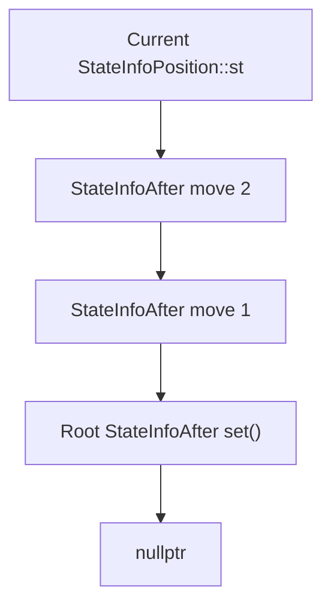
当调用 `do_move()` 时，它会从前一个状态复制直到 `offsetof(StateInfo, key)` 的字段 [src/position.cpp704](https://github.com/official-stockfish/Stockfish/blob/c27c1747/src/position.cpp#L704-L704)，然后重新计算剩余字段。`undo_move()` 函数只需简单地重置 `st = st->previous` [src/position.cpp1034](https://github.com/official-stockfish/Stockfish/blob/c27c1747/src/position.cpp#L1034-L1034)。

**来源：** [src/position.h56](https://github.com/official-stockfish/Stockfish/blob/c27c1747/src/position.h#L56-L56) [src/position.cpp704](https://github.com/official-stockfish/Stockfish/blob/c27c1747/src/position.cpp#L704-L704) [src/position.cpp1034](https://github.com/official-stockfish/Stockfish/blob/c27c1747/src/position.cpp#L1034-L1034)

## Position 公共接口

`Position` 类按逻辑类别提供方法：

| 类别 | 方法 | 描述 |
| --- | --- | --- |
| **初始化** | `init()` [src/position.cpp114](https://github.com/official-stockfish/Stockfish/blob/c27c1747/src/position.cpp#L114-L114) `set()` [src/position.cpp163](https://github.com/official-stockfish/Stockfish/blob/c27c1747/src/position.cpp#L163-L163) | Zobrist 键和布谷鸟表的静态初始化；FEN 解析 |
| **查询** | `pieces()` [src/position.h224](https://github.com/official-stockfish/Stockfish/blob/c27c1747/src/position.h#L224-L224) `piece_on()` [src/position.h213](https://github.com/official-stockfish/Stockfish/blob/c27c1747/src/position.h#L213-L213) `empty()` [src/position.h220](https://github.com/official-stockfish/Stockfish/blob/c27c1747/src/position.h#L220-L220) | 通过数组或位棋盘访问棋盘状态 |
| **着法操作** | `do_move()` [src/position.cpp691](https://github.com/official-stockfish/Stockfish/blob/c27c1747/src/position.cpp#L691-L691) `undo_move()` [src/position.cpp980](https://github.com/official-stockfish/Stockfish/blob/c27c1747/src/position.cpp#L980-L980) `do_null_move()` [src/position.cpp1175](https://github.com/official-stockfish/Stockfish/blob/c27c1747/src/position.cpp#L1175-L1175) | 执行和撤销着法 |
| **着法验证** | `legal()` [src/position.cpp508](https://github.com/official-stockfish/Stockfish/blob/c27c1747/src/position.cpp#L508-L508) `pseudo_legal()` [src/position.cpp569](https://github.com/official-stockfish/Stockfish/blob/c27c1747/src/position.cpp#L569-L569) `gives_check()` [src/position.cpp640](https://github.com/official-stockfish/Stockfish/blob/c27c1747/src/position.cpp#L640-L640) | 验证着法合法性 |
| **攻击检测** | `attackers_to()` [src/position.cpp487](https://github.com/official-stockfish/Stockfish/blob/c27c1747/src/position.cpp#L487-L487) `checkers()` [src/position.h286](https://github.com/official-stockfish/Stockfish/blob/c27c1747/src/position.h#L286-L286) `blockers_for_king()` [src/position.h288](https://github.com/official-stockfish/Stockfish/blob/c27c1747/src/position.h#L288-L288) | 计算攻击和将军状态 |
| **评估支持** | `see_ge()` [src/position.cpp1219](https://github.com/official-stockfish/Stockfish/blob/c27c1747/src/position.cpp#L1219-L1219) `non_pawn_material()` [src/position.h308](https://github.com/official-stockfish/Stockfish/blob/c27c1747/src/position.h#L308-L308) | 静态交换评估，子力材质 |
| **和棋检测** | `is_draw()` [src/position.cpp1325](https://github.com/official-stockfish/Stockfish/blob/c27c1747/src/position.cpp#L1325-L1325) `is_repetition()` [src/position.cpp1335](https://github.com/official-stockfish/Stockfish/blob/c27c1747/src/position.cpp#L1335-L1335) `upcoming_repetition()` [src/position.cpp1356](https://github.com/official-stockfish/Stockfish/blob/c27c1747/src/position.cpp#L1356-L1356) | 重复局面和 50 回合规则 |
| **哈希键** | `key()` [src/position.h294](https://github.com/official-stockfish/Stockfish/blob/c27c1747/src/position.h#L294-L294) `pawn_key()` [src/position.h300](https://github.com/official-stockfish/Stockfish/blob/c27c1747/src/position.h#L300-L300) `material_key()` [src/position.h302](https://github.com/official-stockfish/Stockfish/blob/c27c1747/src/position.h#L302-L302) | 访问各种哈希键 |

**来源：** [src/position.h78-166](https://github.com/official-stockfish/Stockfish/blob/c27c1747/src/position.h#L78-L166) [src/position.cpp114-1485](https://github.com/official-stockfish/Stockfish/blob/c27c1747/src/position.cpp#L114-L1485)

## FEN 解析与局面设置

`Position::set()` 方法解析 FEN 字符串以初始化棋盘状态。FEN（Forsyth-Edwards Notation）是描述国际象棋局面的标准记法。

### FEN 格式

FEN 字符串包含六个以空格分隔的字段：

1.  **棋子放置**：第 8-1 横排，a-h 纵线，数字表示空位，`/` 分隔横排
2.  **当前走棋方**：`w` 代表白方，`b` 代表黑方
3.  **易位权**：`K`（白方短易位），`Q`（白方长易位），`k`（黑方短易位），`q`（黑方长易位），或 `-`
4.  **吃过路兵格位**：代数记法表示的目标格位，或 `-`
5.  **半回合时钟**：自上一次兵移动或吃子以来的半回合数
6.  **全回合数**：从 1 开始，黑方走棋后递增

**Position::set() 流程图**

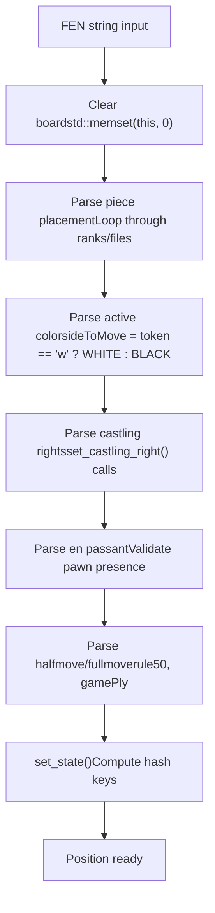
解析处理三种 FEN 标准：普通 FEN、Shredder-FEN（使用纵线字母表示车）和 X-FEN（用于 Chess960 的扩展 FEN）。

**来源：** [src/position.cpp163-295](https://github.com/official-stockfish/Stockfish/blob/c27c1747/src/position.cpp#L163-L295) [src/position.cpp300-314](https://github.com/official-stockfish/Stockfish/blob/c27c1747/src/position.cpp#L300-L314) [src/position.cpp337-382](https://github.com/official-stockfish/Stockfish/blob/c27c1747/src/position.cpp#L337-L382)

## 着法执行：do\_move()

`do_move()` 方法 [src/position.cpp691-975](https://github.com/official-stockfish/Stockfish/blob/c27c1747/src/position.cpp#L691-L975) 执行着法并更新局面状态。它返回用于 NNUE 增量更新的 `DirtyBoardData`。

**do\_move() 执行流程图**

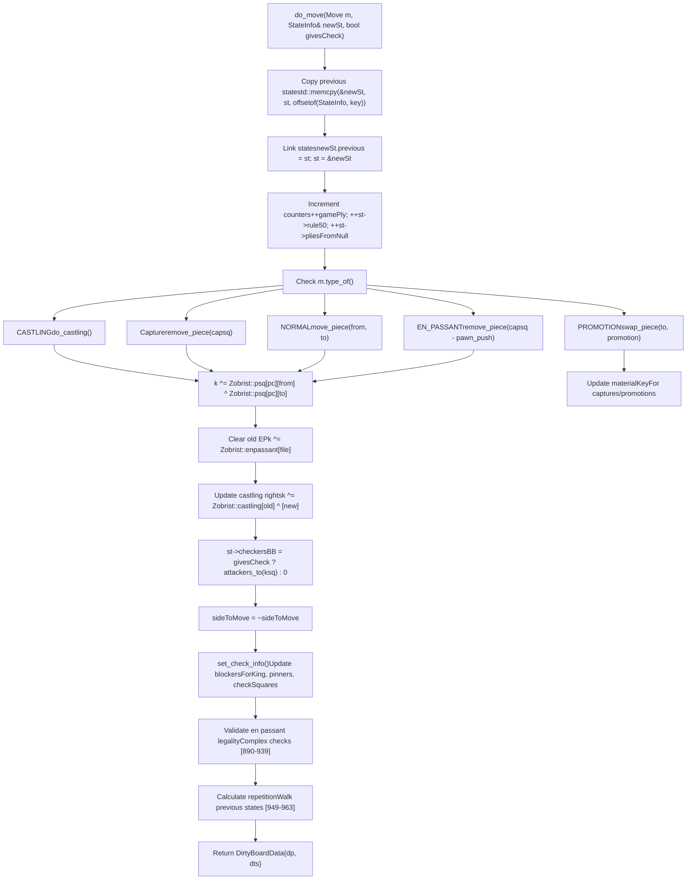
### 着法类型处理

`do_move()` 函数通过 `m.type_of()` 处理四种着法类型：

| 着法类型 | 处理方式 | 代码参考 |
| --- | --- | --- |
| `NORMAL` | `move_piece(from, to)` 或如果是吃子则 `swap_piece(to, pc)` | [src/position.cpp814-823](https://github.com/official-stockfish/Stockfish/blob/c27c1747/src/position.cpp#L814-L823) |
| `PROMOTION` | `swap_piece(to, promotion)`，更新子力哈希键 | [src/position.cpp832-857](https://github.com/official-stockfish/Stockfish/blob/c27c1747/src/position.cpp#L832-L857) |
| `EN_PASSANT` | 吃子格位是 `to - pawn_push(us)`，而不是 `to` | [src/position.cpp757-770](https://github.com/official-stockfish/Stockfish/blob/c27c1747/src/position.cpp#L757-L770) |
| `CASTLING` | 调用 `do_castling<true>()`，处理 Chess960 中重叠的格位 | [src/position.cpp737-748](https://github.com/official-stockfish/Stockfish/blob/c27c1747/src/position.cpp#L737-L748) |

**来源：** [src/position.cpp691-975](https://github.com/official-stockfish/Stockfish/blob/c27c1747/src/position.cpp#L691-L975)

## 着法撤回：undo\_move()

`undo_move()` 方法 [src/position.cpp980-1038](https://github.com/official-stockfish/Stockfish/blob/c27c1747/src/position.cpp#L980-L1038) 通过恢复棋子位置并将状态指针重置为前一个状态来反转着法。

**undo\_move() 流程图**

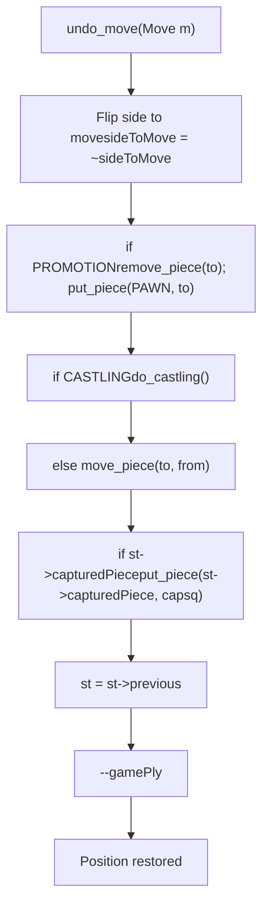
撤销操作是 O(1) 的，因为所有先前的状态都保存在 `StateInfo` 链中。无需重新计算哈希键、将军棋子或阻挡棋子。

**来源：** [src/position.cpp980-1038](https://github.com/official-stockfish/Stockfish/blob/c27c1747/src/position.cpp#L980-L1038)

## 空着（Null Move）操作

空着用于搜索中的空着剪枝（Null Move Pruning）。它们切换走棋方而不执行任何棋盘更改。

**do\_null\_move() 实现**

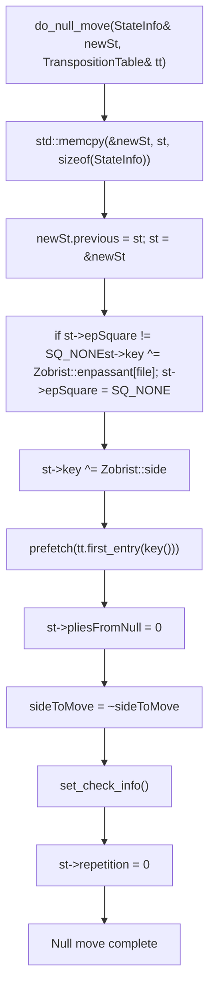
`undo_null_move()` [src/position.cpp1207-1213](https://github.com/official-stockfish/Stockfish/blob/c27c1747/src/position.cpp#L1207-L1213) 只是简单地重置 `st = st->previous` 和 `sideToMove = ~sideToMove`。

**来源：** [src/position.cpp1175-1203](https://github.com/official-stockfish/Stockfish/blob/c27c1747/src/position.cpp#L1175-L1203) [src/position.cpp1207-1213](https://github.com/official-stockfish/Stockfish/blob/c27c1747/src/position.cpp#L1207-L1213)

## Zobrist 哈希系统

Stockfish 使用 Zobrist 哈希生成唯一的局面标识符（哈希键），用于置换表查找。哈希值随着着法的进行增量计算。

### Zobrist 键表

`Zobrist` 命名空间 [src/position.cpp45-52](https://github.com/official-stockfish/Stockfish/blob/c27c1747/src/position.cpp#L45-L52) 包含由 `Position::init()` 初始化 [src/position.cpp114-157](https://github.com/official-stockfish/Stockfish/blob/c27c1747/src/position.cpp#L114-L157) 的伪随机键：

**Zobrist 键组件**

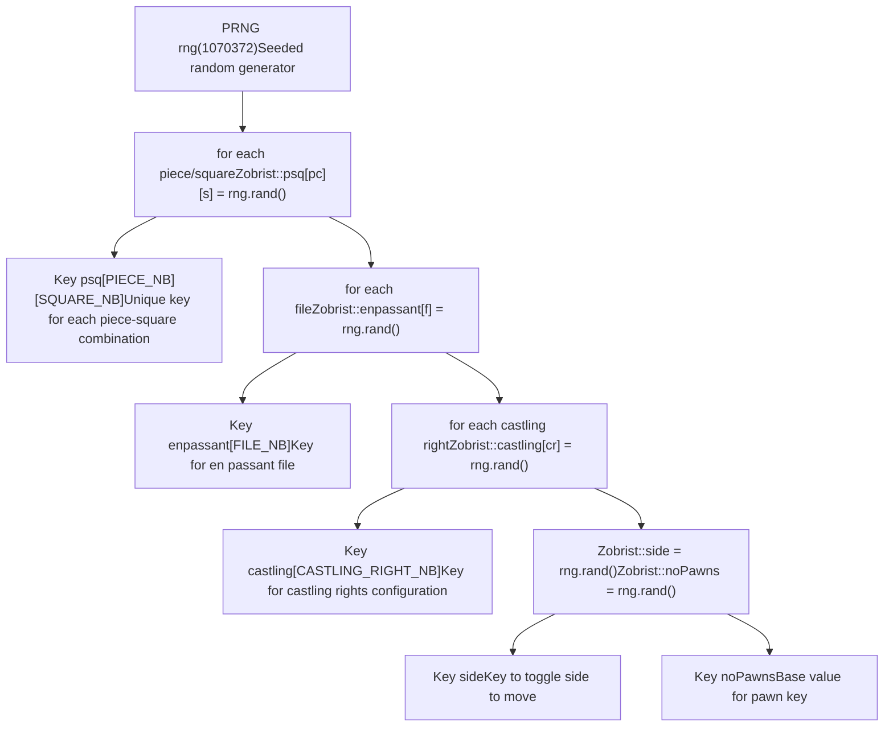
**来源：** [src/position.cpp45-52](https://github.com/official-stockfish/Stockfish/blob/c27c1747/src/position.cpp#L45-L52) [src/position.cpp114-132](https://github.com/official-stockfish/Stockfish/blob/c27c1747/src/position.cpp#L114-L132)

### StateInfo 中的哈希键类型

`StateInfo` 结构体维护多个专用的哈希键：

| 哈希键 | 用途 | 更新时机 |
| --- | --- | --- |
| `key` | 全局面哈希 (Zobrist) | 每次着法，异或棋子移动、走棋方、易位权、吃过路兵 |
| `materialKey` | 子力材质配置 | 吃子和升变 |
| `pawnKey` | 兵型结构 | 兵的移动和吃子 |
| `minorPieceKey` | 马和象 | 轻子移动/吃子 |
| `nonPawnKey[COLOR_NB]` | 按颜色的非兵棋子 | 非兵移动/吃子 |

### 增量哈希更新

在 `do_move()` 期间，哈希键使用异或（XOR）操作增量更新 [src/position.cpp796-877](https://github.com/official-stockfish/Stockfish/blob/c27c1747/src/position.cpp#L796-L877)。使用 XOR 是因为它是可逆的：`A ^ B ^ B = A`。

**do\_move() 中的哈希更新过程**

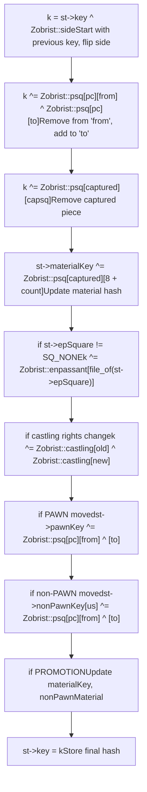
`adjust_key50()` 方法 [src/position.h296-298](https://github.com/official-stockfish/Stockfish/blob/c27c1747/src/position.h#L296-L298) 根据 50 回合规则计数器修改键值，以区分具有不同 rule50 值的局面：

```
Key adjust_key50(Key k) const {
    return st->rule50 < 14 ? k : k ^ make_key((st->rule50 - 14) / 8);
}
```
这确保了具有不同 50 回合计数器的局面具有不同的哈希键，防止过早声明和棋。

**来源：** [src/position.cpp699](https://github.com/official-stockfish/Stockfish/blob/c27c1747/src/position.cpp#L699-L699) [src/position.cpp796](https://github.com/official-stockfish/Stockfish/blob/c27c1747/src/position.cpp#L796-L796) [src/position.cpp771](https://github.com/official-stockfish/Stockfish/blob/c27c1747/src/position.cpp#L771-L771) [src/position.cpp799-811](https://github.com/official-stockfish/Stockfish/blob/c27c1747/src/position.cpp#L799-L811) [src/position.cpp849-871](https://github.com/official-stockfish/Stockfish/blob/c27c1747/src/position.cpp#L849-L871) [src/position.h296-298](https://github.com/official-stockfish/Stockfish/blob/c27c1747/src/position.h#L296-L298)

## 基于布谷鸟算法的重复检测

Stockfish 使用 Marcel van Kervinck 的布谷鸟算法 [src/position.cpp100-111](https://github.com/official-stockfish/Stockfish/blob/c27c1747/src/position.cpp#L100-L111) 来高效检测三次重复和棋。该算法预先计算所有可能的可逆着法，并将它们存储在布谷鸟哈希表中。

### 布谷鸟哈希表

布谷鸟表在 `Position::init()` [src/position.cpp134-156](https://github.com/official-stockfish/Stockfish/blob/c27c1747/src/position.cpp#L134-L156) 中初始化，通过遍历所有棋子-格位对并存储可逆（非兵）着法：

**布谷鸟表结构**

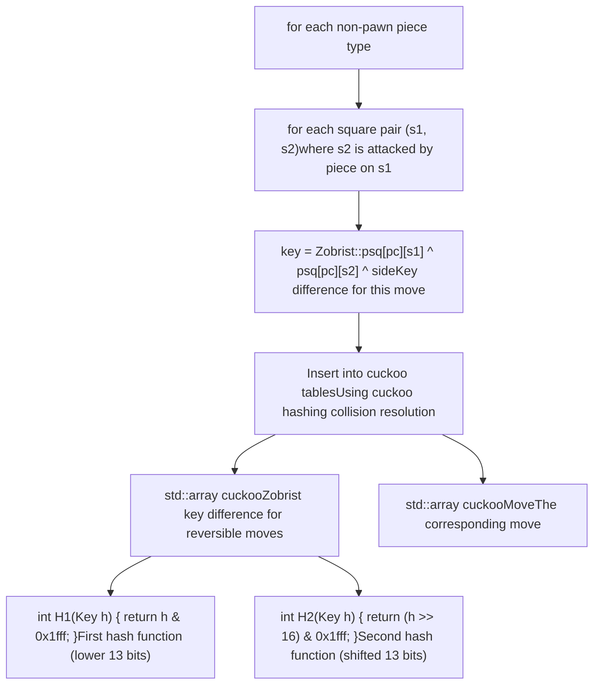
初始化创建了 3668 个条目 [src/position.cpp156](https://github.com/official-stockfish/Stockfish/blob/c27c1747/src/position.cpp#L156-L156)。布谷鸟哈希通过使用两个哈希函数将条目移动到替代位置来处理冲突。

**来源：** [src/position.cpp106-111](https://github.com/official-stockfish/Stockfish/blob/c27c1747/src/position.cpp#L106-L111) [src/position.cpp134-156](https://github.com/official-stockfish/Stockfish/blob/c27c1747/src/position.cpp#L134-L156)

### 重复检测方法

Stockfish 提供了三种检查重复的方法：

| 方法 | 用途 | 代码参考 |
| --- | --- | --- |
| `is_repetition(int ply)` | 如果局面在 ply 之前重复，则返回 true | [src/position.cpp1335](https://github.com/official-stockfish/Stockfish/blob/c27c1747/src/position.cpp#L1335-L1335) |
| `has_repeated()` | 如果自上次不可逆着法以来有任何重复，则返回 true | [src/position.cpp1339-1351](https://github.com/official-stockfish/Stockfish/blob/c27c1747/src/position.cpp#L1339-L1351) |
| `upcoming_repetition(int ply)` | 检测可逆着法是否会导致重复 | [src/position.cpp1356-1398](https://github.com/official-stockfish/Stockfish/blob/c27c1747/src/position.cpp#L1356-L1398) |

### upcoming\_repetition() 算法

`upcoming_repetition()` 方法使用布谷鸟表来检测任何合法着法是否会导致重复：

**upcoming\_repetition() 过程图**

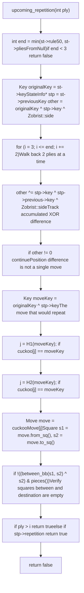
算法工作原理如下：

1.  异或连续的状态键以跟踪累积的局面变化
2.  当 `other` 变为零时，表示只有一个可逆着法不同
3.  计算着法键并在布谷鸟表中查找
4.  验证着法路径是否清晰
5.  根据 ply 检查重复是发生在根节点之前还是之后

**来源：** [src/position.cpp1356-1398](https://github.com/official-stockfish/Stockfish/blob/c27c1747/src/position.cpp#L1356-L1398)

### do\_move() 中的重复跟踪

在 `do_move()` 期间，通过向后遍历状态链来检测重复 [src/position.cpp949-963](https://github.com/official-stockfish/Stockfish/blob/c27c1747/src/position.cpp#L949-L963)：

```
st->repetition = 0;
int end = std::min(st->rule50, st->pliesFromNull);
if (end >= 4) {
    StateInfo* stp = st->previous->previous;
    for (int i = 4; i <= end; i += 2) {
        stp = stp->previous->previous;
        if (stp->key == st->key) {
            st->repetition = stp->repetition ? -i : i;
            break;
        }
    }
}
```
`repetition` 字段存储：

-   正值：到第一次出现的层数距离
-   负值：到第二次出现的层数距离（三次重复）
-   零：无重复

**来源：** [src/position.cpp949-963](https://github.com/official-stockfish/Stockfish/blob/c27c1747/src/position.cpp#L949-L963) [src/position.cpp1335](https://github.com/official-stockfish/Stockfish/blob/c27c1747/src/position.cpp#L1335-L1335)

## 局面验证与调试

局面管理系统包括全面的验证，用于调试和完整性检查：

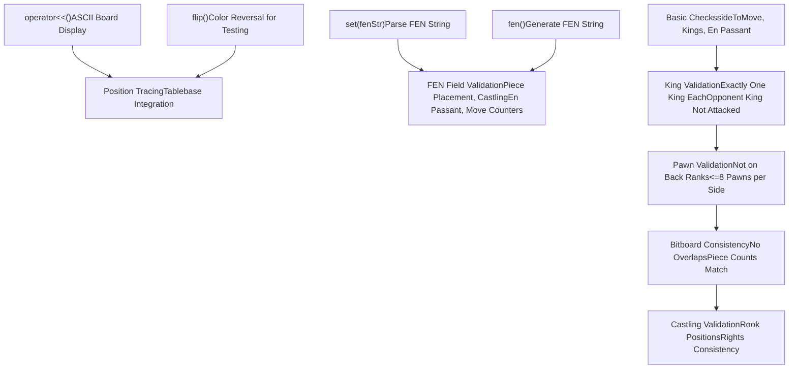
**来源：** [src/position.cpp1315-1362](https://github.com/official-stockfish/Stockfish/blob/c27c1747/src/position.cpp#L1315-L1362) [src/position.cpp162-294](https://github.com/official-stockfish/Stockfish/blob/c27c1747/src/position.cpp#L162-L294) [src/position.cpp407-451](https://github.com/official-stockfish/Stockfish/blob/c27c1747/src/position.cpp#L407-L451) [src/position.cpp63-96](https://github.com/official-stockfish/Stockfish/blob/c27c1747/src/position.cpp#L63-L96)
