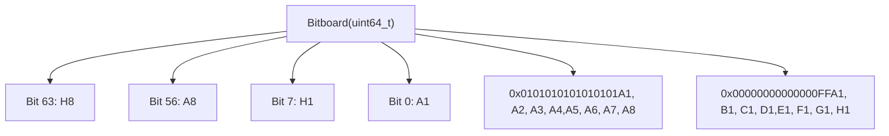
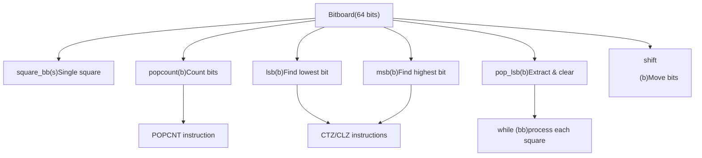
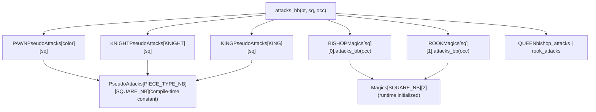
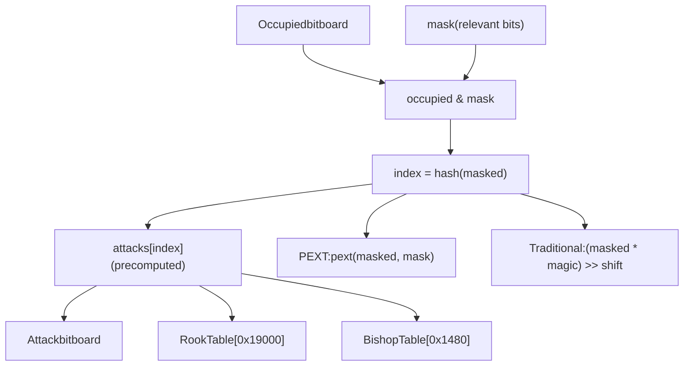
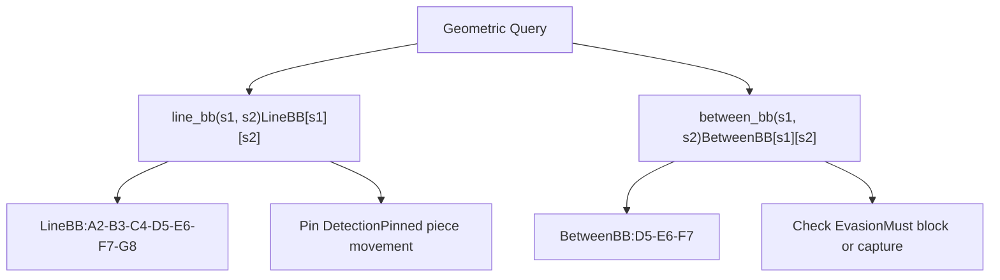
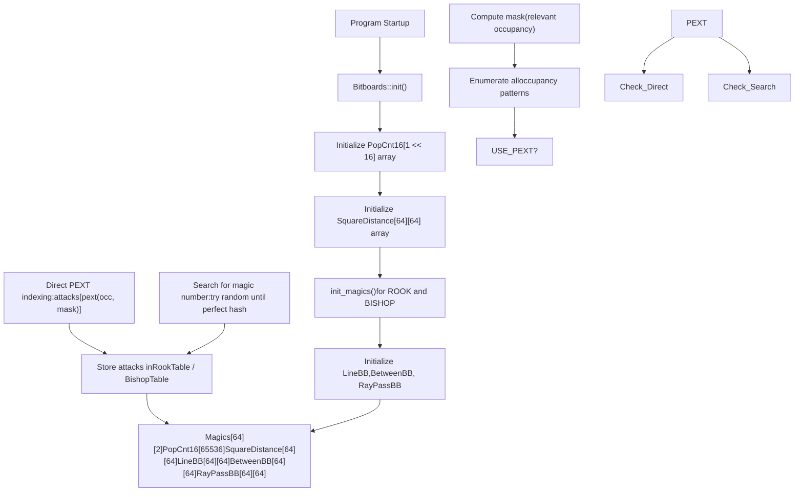

# 位棋盘与低级操作

相关源文件

-   [src/bitboard.cpp](https://github.com/official-stockfish/Stockfish/blob/c27c1747/src/bitboard.cpp)
-   [src/bitboard.h](https://github.com/official-stockfish/Stockfish/blob/c27c1747/src/bitboard.h)

## 目的与范围

本页面记录了 Stockfish 的位棋盘（bitboard）表示以及实现高效棋盘状态查询和攻击生成的低级位操作。位棋盘是用于表示国际象棋棋盘上格位集合的基础数据结构，允许使用按位运算并行执行多个格位查询。

关于位棋盘如何在 `Position` 类中用于表示完整棋盘状态的信息，请参阅 [局面与状态管理](/official-stockfish/Stockfish/3-board-representation/3.1-position-and-state-management)。关于位棋盘如何用于生成着法的信息，请参阅 [着法生成](/official-stockfish/Stockfish/3-board-representation/3.3-move-generation)。

**来源：** [src/bitboard.h1-468](https://github.com/official-stockfish/Stockfish/blob/c27c1747/src/bitboard.h#L1-L468) [src/bitboard.cpp1-186](https://github.com/official-stockfish/Stockfish/blob/c27c1747/src/bitboard.cpp#L1-L186)

---

## 位棋盘基础

### 什么是位棋盘？

`Bitboard` 是一个 64 位无符号整数 (`uint64_t`)，其中每一位代表国际象棋棋盘上的一个格位。最低有效位（位 0）对应格位 A1，最高有效位（位 63）对应格位 H8。映射遵循以下布局：

| 位位置 | 56-63 | 48-55 | 40-47 | 32-39 | 24-31 | 16-23 | 8-15 | 0-7 |
| --- | --- | --- | --- | --- | --- | --- | --- | --- |
| **横排 (Rank)** | 8 | 7 | 6 | 5 | 4 | 3 | 2 | 1 |
| **纵线 (File)** | A-H | A-H | A-H | A-H | A-H | A-H | A-H | A-H |

置位（1）表示该格位属于该集合；清零（0）表示不属于。这种表示允许使用单个 CPU 指令同时操作多个格位。


**来源：** [src/types.h](https://github.com/official-stockfish/Stockfish/blob/c27c1747/src/types.h) [src/bitboard.h43-59](https://github.com/official-stockfish/Stockfish/blob/c27c1747/src/bitboard.h#L43-L59)

### 预定义的位棋盘常量

Stockfish 为纵线和横排定义了几个有用的位棋盘常量：

| 常量 | 值 | 描述 |
| --- | --- | --- |
| `FileABB` | `0x0101010101010101ULL` | A 纵线上的所有格位 |
| `FileBBB` 到 `FileHBB` | 左移的 `FileABB` | 其他纵线 |
| `Rank1BB` | `0xFF` | 第 1 横排上的所有格位 |
| `Rank2BB` 到 `Rank8BB` | 左移的 `Rank1BB` | 其他横排 |

**来源：** [src/bitboard.h43-59](https://github.com/official-stockfish/Stockfish/blob/c27c1747/src/bitboard.h#L43-L59)

---

## 基本位棋盘操作

### 格位到位棋盘转换

最基本的操作是将 `Square` 转换为仅设置了该格位的 `Bitboard`：

```
constexpr Bitboard square_bb(Square s)
```
这通过计算 `1ULL << s` 创建一个在位置 `s` 处设置了单一位的位棋盘。

**来源：** [src/bitboard.h97-100](https://github.com/official-stockfish/Stockfish/blob/c27c1747/src/bitboard.h#L97-L100)

### 带格位的按位运算

Stockfish 重载了按位运算符，以允许位棋盘和格位之间进行自然的操作：

| 操作 | 含义 | 示例 |
| --- | --- | --- |
| `b & s` | 测试格位是否在位棋盘中 | `if (occupied & SQ_E4)` |
| `b | s` | 将格位添加到位棋盘 | `attacks |= target_square` |
| `b ^ s` | 切换位棋盘中的格位 | `bb ^= move_from` |
| `b |= s` | 添加格位（复合） | `targets |= SQ_D5` |
| `b ^= s` | 切换格位（复合） | `pieces ^= from` |

**来源：** [src/bitboard.h106-116](https://github.com/official-stockfish/Stockfish/blob/c27c1747/src/bitboard.h#L106-L116)

### 移位操作

`shift<Direction>()` 模板函数将位棋盘中的所有位向指定方向移动一步或两步，正确处理边缘回绕：

```
template<Direction D>
constexpr Bitboard shift(Bitboard b)
```
支持的方向包括 `NORTH`（北）、`SOUTH`（南）、`EAST`（东）、`WEST`（西）以及对角线方向如 `NORTH_EAST`（东北）。该函数在水平移位时会屏蔽边缘纵线以防止回绕（例如，向 `EAST` 移位时使用 `(b & ~FileHBB) << 1`）。

**使用示例：** 生成兵的攻击：

```
template<Color C>
constexpr Bitboard pawn_attacks_bb(Bitboard b)
```
对于白兵，这将向西北和东北移位以获取攻击格位。

**来源：** [src/bitboard.h134-156](https://github.com/official-stockfish/Stockfish/blob/c27c1747/src/bitboard.h#L134-L156)

### 种群计数 (popcount)

计算位棋盘中设置位的数量，代表集合中格位的数量：

```
inline int popcount(Bitboard b)
```
实现因平台而异：

-   **使用 `USE_POPCNT`：** 使用硬件 POPCNT 指令（`_mm_popcnt_u64` 或 `__builtin_popcountll`）
-   **无硬件支持：** 使用预计算的 `PopCnt16` 查找表，将 64 位值分解为四个 16 位块

**来源：** [src/bitboard.h215-233](https://github.com/official-stockfish/Stockfish/blob/c27c1747/src/bitboard.h#L215-L233) [src/bitboard.cpp29-70](https://github.com/official-stockfish/Stockfish/blob/c27c1747/src/bitboard.cpp#L29-L70)

### 最低/最高有效位

提取最低或最高设置位：

```
inline Square lsb(Bitboard b)  // 返回最低有效位
inline Square msb(Bitboard b)  // 返回最高有效位
```
这些使用编译器内置函数：

-   GCC/Clang：`__builtin_ctzll()` 用于 LSB，`__builtin_clzll()` 用于 MSB
-   MSVC：`_BitScanForward64()` / `_BitScanReverse64()`

**常用操作：** `pop_lsb()` 返回 LSB 并从位棋盘中清除它，从而实现迭代：

```
inline Square pop_lsb(Bitboard& b) {
    const Square s = lsb(b);
    b &= b - 1;  // 清除最低位
    return s;
}
```
**来源：** [src/bitboard.h236-317](https://github.com/official-stockfish/Stockfish/blob/c27c1747/src/bitboard.h#L236-L317)

### 实用函数

| 函数 | 用途 |
| --- | --- |
| `more_than_one(b)` | 测试位棋盘是否设置了多个位 (`b & (b-1)`) |
| `least_significant_square_bb(b)` | 返回仅设置了 LSB 的位棋盘 (`b & -b`) |
| `rank_bb(Rank r)` / `rank_bb(Square s)` | 返回某横排的位棋盘 |
| `file_bb(File f)` / `file_bb(Square s)` | 返回某纵线的位棋盘 |

**来源：** [src/bitboard.h118-131](https://github.com/official-stockfish/Stockfish/blob/c27c1747/src/bitboard.h#L118-L131)


**来源：** [src/bitboard.h207-317](https://github.com/official-stockfish/Stockfish/blob/c27c1747/src/bitboard.h#L207-L317)

---

## 预计算攻击表

### PseudoAttacks 数组

`PseudoAttacks` 编译时常量数组存储了所有棋子类型（兵除外，因为兵依赖于颜色）从所有格位的攻击位棋盘，假设棋盘为空：

```
constexpr auto PseudoAttacks = []() constexpr {
    std::array<std::array<Bitboard, SQUARE_NB>, PIECE_TYPE_NB> attacks{};
    // ... initialization at compile time
    return attacks;
}();
```
这是一个在编译时计算的 `PIECE_TYPE_NB × SQUARE_NB` 二维数组。对于滑动棋子（象、车、后），这些代表假设无阻挡时的攻击。

**来源：** [src/bitboard.h383-398](https://github.com/official-stockfish/Stockfish/blob/c27c1747/src/bitboard.h#L383-L398)

### attacks\_bb 模板函数

查询棋子攻击的主要接口是重载的 `attacks_bb()` 函数族：

**非滑动棋子（马、王）和空棋盘滑动棋子：**

```
template<PieceType Pt>
inline Bitboard attacks_bb(Square s, Color c = COLOR_NB)
```
返回从格位 `s` 的攻击。对于兵，`c` 指定颜色。对于其他棋子，简单地查找 `PseudoAttacks[Pt][s]`。

**带占用的滑动棋子：**

```
template<PieceType Pt>
inline Bitboard attacks_bb(Square s, Bitboard occupied)
```
对于象、车和后，使用魔术位棋盘（见下一节）计算考虑 `occupied` 中阻挡者的攻击。

**运行时分发版本：**

```
inline Bitboard attacks_bb(PieceType pt, Square s, Bitboard occupied)
inline Bitboard attacks_bb(Piece pc, Square s, Bitboard occupied)
```
**来源：** [src/bitboard.h403-464](https://github.com/official-stockfish/Stockfish/blob/c27c1747/src/bitboard.h#L403-L464)


**来源：** [src/bitboard.h383-464](https://github.com/official-stockfish/Stockfish/blob/c27c1747/src/bitboard.h#L383-L464)

---

## 滑动棋子的魔术位棋盘

### Magic 结构体

魔术位棋盘（Magic bitboards）实现了带阻挡者的滑动棋子（象、车、后）攻击的快速查找。每个格位都有一个用于象和车的 `Magic` 结构体：

```
struct Magic {
    Bitboard  mask;      // 相关占用位（不包括边缘）
    Bitboard* attacks;   // 攻击表指针
    #ifndef USE_PEXT
    Bitboard magic;      // 哈希函数的魔术数字
    unsigned shift;      // 索引的移位量
    #endif

    unsigned index(Bitboard occupied) const;
    Bitboard attacks_bb(Bitboard occupied) const;
};
```
数组 `Magics[SQUARE_NB][2]` 存储所有格位的魔术数据，索引 `[sq][0]` 用于象，`[sq][1]` 用于车。

**来源：** [src/bitboard.h69-93](https://github.com/official-stockfish/Stockfish/blob/c27c1747/src/bitboard.h#L69-L93) [src/bitboard.cpp36](https://github.com/official-stockfish/Stockfish/blob/c27c1747/src/bitboard.cpp#L36-L36)

### 魔术位棋盘如何工作

魔术位棋盘技术将任何占用模式映射到预计算攻击表中的唯一索引：

1.  **掩码相关位：** `occupied & mask` 仅隔离可能阻挡攻击的格位（排除棋盘边缘）
2.  **哈希到索引：**
    -   **使用 PEXT：** `pext(occupied, mask)` 直接提取相关位
    -   **不使用 PEXT：** `((occupied & mask) * magic) >> shift` 乘以魔术数字并移位
3.  **查找攻击：** `attacks[index]` 返回预计算的攻击位棋盘


**来源：** [src/bitboard.h69-93](https://github.com/official-stockfish/Stockfish/blob/c27c1747/src/bitboard.h#L69-L93) [src/bitboard.cpp40-41](https://github.com/official-stockfish/Stockfish/blob/c27c1747/src/bitboard.cpp#L40-L41)

### 魔术数字生成

在初始化期间（当不使用 PEXT 时），Stockfish 搜索产生完美哈希函数的“魔术数字”：

1.  为该格位的掩码生成所有可能的占用模式（使用进位涟漪技巧 carry-rippler trick）
2.  计算每个占用模式的正确攻击
3.  尝试随机魔术数字，直到找到一个满足以下条件的数字：
    -   `(occupancy[i] & mask) * magic) >> shift` 为所有占用产生唯一的索引
    -   每个索引映射到正确的攻击模式

搜索使用针对每个格位优化的种子的 PRNG 来快速找到魔术数字。

**来源：** [src/bitboard.cpp98-183](https://github.com/official-stockfish/Stockfish/blob/c27c1747/src/bitboard.cpp#L98-L183)

### PEXT 优化

现代 CPU（Intel Haswell+ 和 AMD Zen 3+）提供 `PEXT` 指令，该指令根据掩码直接提取位。当定义了 `USE_PEXT` 时，Stockfish 使用它代替乘法-移位哈希，消除了启动时搜索魔术数字的需要。

**来源：** [src/bitboard.h78-90](https://github.com/official-stockfish/Stockfish/blob/c27c1747/src/bitboard.h#L78-L90)

---

## 几何查询表

### Line 和 Between 位棋盘

三个几何查询表实现了关于格位关系的高效查询：

| 表 | 用途 | 示例 |
| --- | --- | --- |
| `LineBB[s1][s2]` | 连接格位的完整线条（如果对齐） | `line_bb(SQ_C4, SQ_F7)` 返回 A2-G8 对角线 |
| `BetweenBB[s1][s2]` | s1 和 s2 之间的格位（半开：不含 s1，含 s2） | `between_bb(SQ_C4, SQ_F7)` 返回 D5, E6, F7 |
| `RayPassBB[s1][s2]` | 从 s1 穿过 s2 的射线 | 用于威胁检测 |

如果格位未在横排/纵线/对角线上对齐：

-   `LineBB[s1][s2]` 返回 0
-   `BetweenBB[s1][s2]` 仅返回 `s2`（允许着法生成正确工作）


**来源：** [src/bitboard.h64-181](https://github.com/official-stockfish/Stockfish/blob/c27c1747/src/bitboard.h#L64-L181) [src/bitboard.cpp32-94](https://github.com/official-stockfish/Stockfish/blob/c27c1747/src/bitboard.cpp#L32-L94)

### 距离表与函数

**SquareDistance 表：** 预计算的所有格位对之间的切比雪夫距离（王距离）：

```
extern uint8_t SquareDistance[SQUARE_NB][SQUARE_NB];
```
**距离模板函数：**

```
template<typename T = Square>
inline int distance(Square x, Square y)
```
特化：

-   `distance<File>(x, y)`：纵线距离（纵线绝对差）
-   `distance<Rank>(x, y)`：横排距离（横排绝对差）
-   `distance<Square>(x, y)`：切比雪夫距离（纵线和横排距离的最大值），使用查找表

**边缘距离：**

```
inline int edge_distance(File f)
```
返回纵线到棋盘边缘（A 线或 H 线）的最小距离。

**来源：** [src/bitboard.h62-204](https://github.com/official-stockfish/Stockfish/blob/c27c1747/src/bitboard.h#L62-L204) [src/bitboard.cpp30-74](https://github.com/official-stockfish/Stockfish/blob/c27c1747/src/bitboard.cpp#L30-L74)

---

## 初始化系统

### Bitboards::init() 函数

`Bitboards::init()` 函数必须在程序启动时、任何位棋盘操作之前调用。它初始化所有查找表：

```
void Bitboards::init() {
    // 1. Initialize PopCnt16 lookup table
    for (unsigned i = 0; i < (1 << 16); ++i)
        PopCnt16[i] = count of set bits in i;

    // 2. Initialize SquareDistance table
    for (Square s1 : all squares)
        for (Square s2 : all squares)
            SquareDistance[s1][s2] = max(file_distance, rank_distance);

    // 3. Initialize magic bitboards
    init_magics(ROOK, RookTable, Magics);
    init_magics(BISHOP, BishopTable, Magics);

    // 4. Initialize geometric tables (LineBB, BetweenBB, RayPassBB)
    for (Square s1 : all squares)
        for (Square s2 : all squares)
            if (s1 and s2 are aligned)
                compute LineBB, BetweenBB, RayPassBB;
}
```
**来源：** [src/bitboard.cpp67-95](https://github.com/official-stockfish/Stockfish/blob/c27c1747/src/bitboard.cpp#L67-L95)

### 魔术表初始化

`init_magics()` 函数初始化象和车的攻击表：

**使用 PEXT：**

1.  对于每个格位，计算掩码（相关占用位）
2.  使用进位涟漪枚举所有可能的占用
3.  对于每个占用，计算攻击并存储在 `attacks[pext(occupancy, mask)]`

**不使用 PEXT（传统魔术）：**

1.  相同的掩码和占用枚举
2.  使用具有优化种子的 PRNG 搜索魔术数字
3.  验证魔术数字产生完美哈希（无不同攻击模式的冲突）
4.  使用找到的魔术数字填充攻击表

攻击表是独立的数组：

-   `RookTable[0x19000]`：~102KB 用于所有车攻击
-   `BishopTable[0x1480]`：~5KB 用于所有象攻击

总内存：~107KB 用于所有魔术位棋盘攻击表。

**来源：** [src/bitboard.cpp98-183](https://github.com/official-stockfish/Stockfish/blob/c27c1747/src/bitboard.cpp#L98-L183)


**来源：** [src/bitboard.cpp67-183](https://github.com/official-stockfish/Stockfish/blob/c27c1747/src/bitboard.cpp#L67-L183)

---

## 性能特征

### 位棋盘操作性能

| 操作 | 复杂度 | 实现 |
| --- | --- | --- |
| `square_bb(s)` | O(1) | 单次位移位 |
| `popcount(b)` | O(1) | 硬件 POPCNT 或 4 次查找 |
| `lsb(b)` / `msb(b)` | O(1) | 硬件 CTZ/CLZ 指令 |
| `pop_lsb(b)` | O(1) | CTZ + AND |
| `attacks_bb<KNIGHT>(s)` | O(1) | 数组查找 |
| `attacks_bb<ROOK>(s, occ)` | O(1) | 哈希 + 查找 (~2-3 周期) |

魔术位棋盘查找极快——通常 2-3 个 CPU 周期：

-   掩码操作：1 周期 (AND)
-   哈希函数：1-2 周期 (PEXT 或 乘法 + 移位)
-   内存访问：~1 周期 (L1 缓存命中)

**来源：** [src/bitboard.h78-429](https://github.com/official-stockfish/Stockfish/blob/c27c1747/src/bitboard.h#L78-L429)

### 内存占用

| 数据结构 | 大小 | 用途 |
| --- | --- | --- |
| `RookTable` | ~102 KB | 车攻击查找 |
| `BishopTable` | ~5 KB | 象攻击查找 |
| `PseudoAttacks` | ~4 KB | 非滑动攻击（编译时） |
| `PopCnt16` | 64 KB | Popcount 查找 |
| `SquareDistance` | 4 KB | 距离查找 |
| `LineBB` | 32 KB | 线条查询 |
| `BetweenBB` | 32 KB | 中间查询 |
| `RayPassBB` | 32 KB | 射线经过查询 |
| **总计** | **~275 KB** | 所有位棋盘表 |

所有表在初始化后均为只读，并具有极佳的缓存局部性。

**来源：** [src/bitboard.cpp29-41](https://github.com/official-stockfish/Stockfish/blob/c27c1747/src/bitboard.cpp#L29-L41) [src/bitboard.h61-66](https://github.com/official-stockfish/Stockfish/blob/c27c1747/src/bitboard.h#L61-L66)
