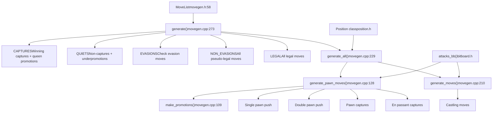
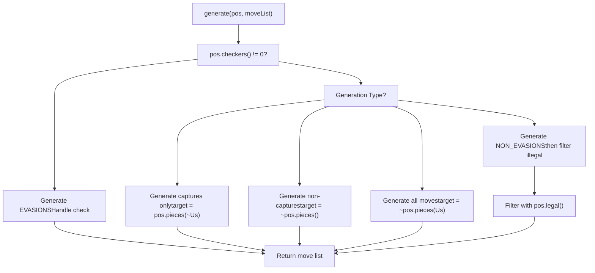
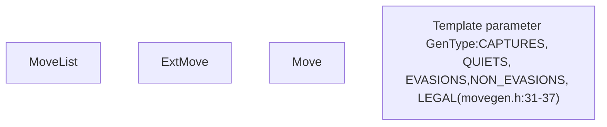
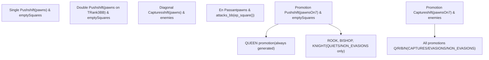
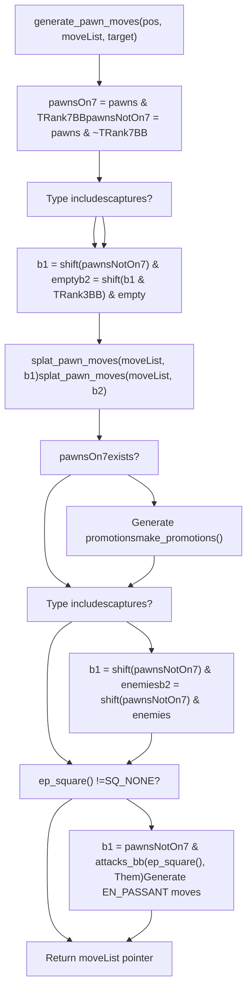
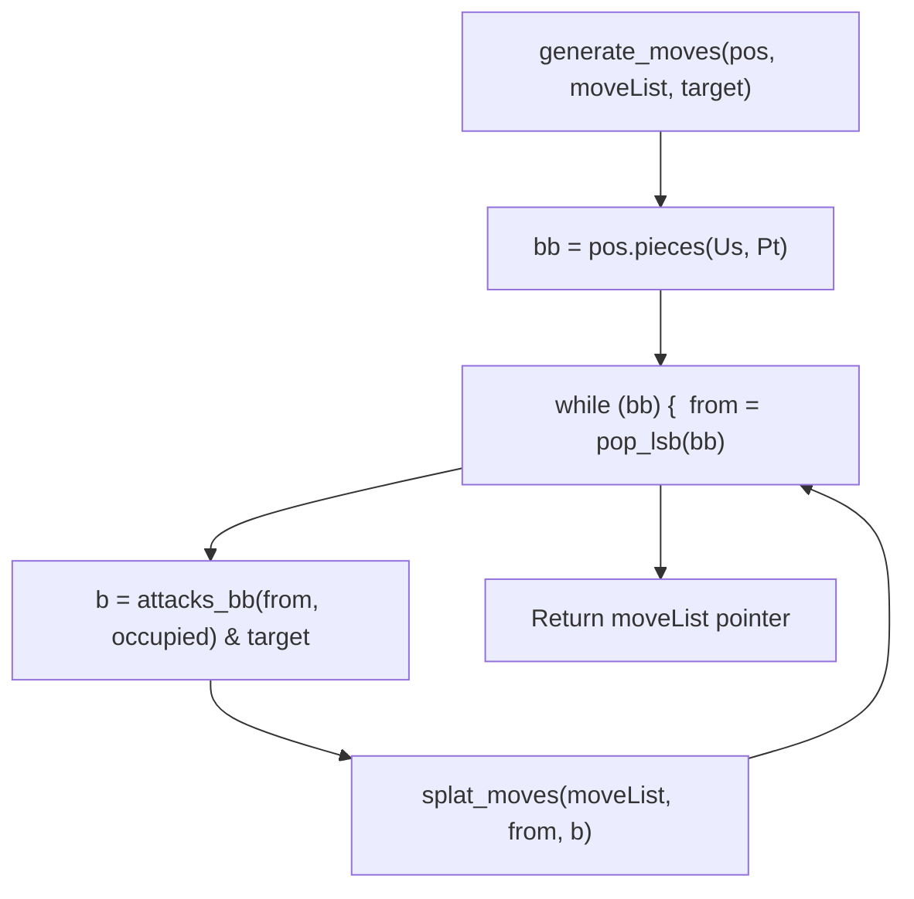
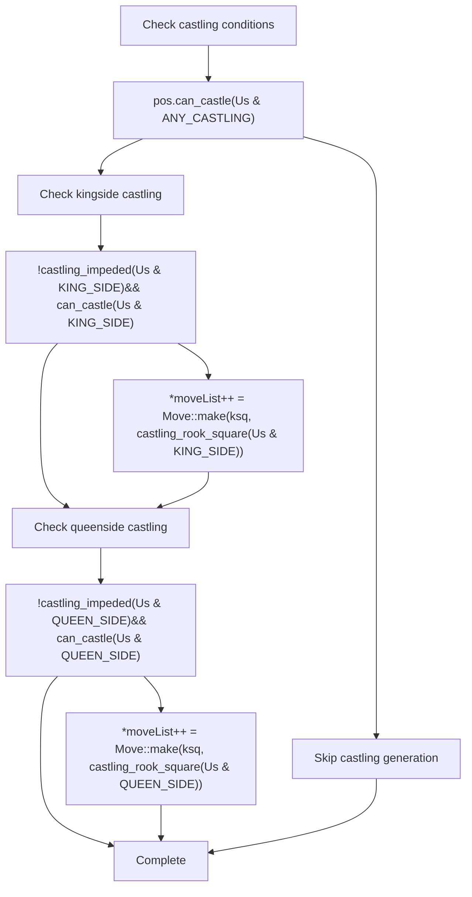
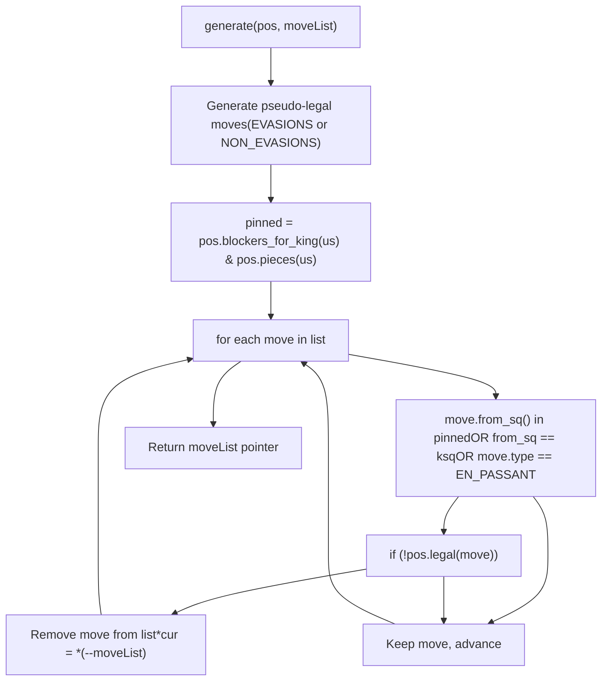
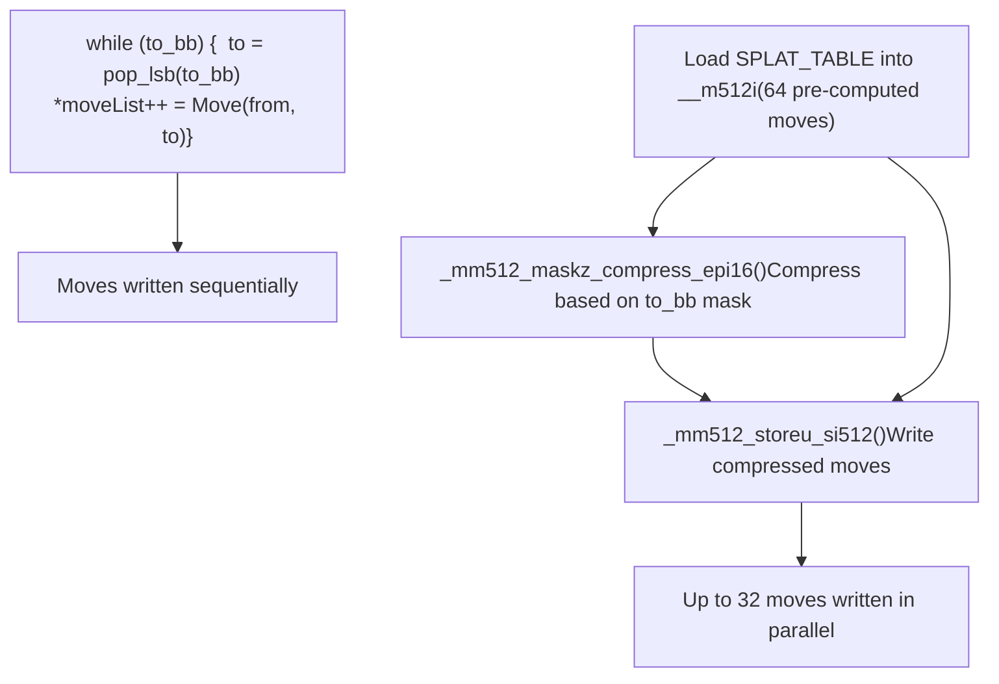

# 着法生成

相关源文件

-   [src/movegen.cpp](https://github.com/official-stockfish/Stockfish/blob/c27c1747/src/movegen.cpp)
-   [src/movegen.h](https://github.com/official-stockfish/Stockfish/blob/c27c1747/src/movegen.h)

## 目的与范围

本页面记录了 Stockfish 中的着法生成系统，该系统负责从给定的国际象棋局面生成所有合法和伪合法着法。着法生成是一项基本操作，在搜索过程中会发生数百万次，因此其性能对引擎强度至关重要。

关于生成的着法如何在搜索期间进行排序和选择的信息，请参阅 [着法排序与着法拾取器](/official-stockfish/Stockfish/4-search-system/4.3-move-ordering-and-move-picker)。关于着法生成所操作的 Position 类的详细信息，请参阅 [局面与状态管理](/official-stockfish/Stockfish/3-board-representation/3.1-position-and-state-management)。关于着法生成使用的底层位棋盘操作，请参阅 [位棋盘与低级操作](/official-stockfish/Stockfish/3-board-representation/3.2-bitboards-and-low-level-operations)。

---

## 概述

着法生成系统提供了多种针对不同搜索上下文优化的生成模式。所有生成函数都对 `Position` 对象进行操作，并将着法写入提供的数组，返回指向生成着法列表末尾的指针。


**来源：** [src/movegen.h31-37](https://github.com/official-stockfish/Stockfish/blob/c27c1747/src/movegen.h#L31-L37) [src/movegen.cpp273-282](https://github.com/official-stockfish/Stockfish/blob/c27c1747/src/movegen.cpp#L273-L282)

---

## 生成类型

`GenType` 枚举定义了五种不同的生成模式，每种模式都针对特定的搜索上下文进行了优化：

| GenType | 描述 | 用例 |
| --- | --- | --- |
| `CAPTURES` | 生成所有伪合法的吃子加上后升变 | 静态搜索，MVV-LVA 排序 |
| `QUIETS` | 生成所有伪合法的非吃子和低级升变 | 主搜索静止着法阶段 |
| `EVASIONS` | 生成所有可能解将的伪合法着法 | 当局面被将军时 |
| `NON_EVASIONS` | 在未被将军时生成所有伪合法着法 | 一般着法生成 |
| `LEGAL` | 仅生成严格合法的着法 | 根着法生成，验证 |

**来源：** [src/movegen.h31-37](https://github.com/official-stockfish/Stockfish/blob/c27c1747/src/movegen.h#L31-L37)

### 生成模式选择


**来源：** [src/movegen.cpp229-261](https://github.com/official-stockfish/Stockfish/blob/c27c1747/src/movegen.cpp#L229-L261) [src/movegen.cpp293-310](https://github.com/official-stockfish/Stockfish/blob/c27c1747/src/movegen.cpp#L293-L310)

---

## MoveList 模板

`MoveList<T>` 模板提供了对原始 `generate()` 函数的便捷封装，自动管理着法存储并提供迭代器访问。


**用法示例：**

```
// 生成所有合法着法
MoveList<LEGAL> legalMoves(position);
for (Move m : legalMoves) {
    // 处理每个着法
}

// 检查特定着法是否在列表中
if (legalMoves.contains(ttMove)) {
    // 着法是合法的
}
```
**来源：** [src/movegen.h54-70](https://github.com/official-stockfish/Stockfish/blob/c27c1747/src/movegen.h#L54-L70) [src/movegen.h39-47](https://github.com/official-stockfish/Stockfish/blob/c27c1747/src/movegen.h#L39-L47)

---

## 兵着法生成

由于兵的移动规则复杂：单步/双步推进、斜向吃子、吃过路兵和升变，因此需要特殊处理。

### 兵着法类型


**来源：** [src/movegen.cpp128-206](https://github.com/official-stockfish/Stockfish/blob/c27c1747/src/movegen.cpp#L128-L206)

### 兵生成实现

`generate_pawn_moves<Us, Type>()` 函数使用位棋盘操作处理所有兵着法类型：

**关键步骤：**

1.  **按横排分离兵** - 第 7 横排（黑方为第 2 横排）的兵单独处理以进行升变
2.  **生成推进** - 使用位棋盘移位生成单步和双步推进，并由空位掩码过滤
3.  **生成吃子** - 斜向移位，由敌方棋子掩码过滤
4.  **处理升变** - 基于 `GenType` 的不同升变类型（吃子模式仅后，静止模式所有类型）
5.  **吃过路兵** - 当 `ep_square() != SQ_NONE` 时的特殊情况


**来源：** [src/movegen.cpp128-206](https://github.com/official-stockfish/Stockfish/blob/c27c1747/src/movegen.cpp#L128-L206)

---

## 棋子着法生成

非兵棋子（马、象、车、后、王）使用基于攻击位棋盘的统一生成方法。

### 棋子着法生成流程


**关键点：**

-   使用 `attacks_bb<Pt>()` 模板函数获取每个棋子的攻击位棋盘
-   对于滑动棋子（象、车、后），攻击考虑了通过魔术位棋盘计算的棋盘占用情况
-   对于非滑动棋子（马、王），攻击使用预计算的 `PseudoAttacks` 表
-   `target` 位棋盘根据 `GenType` 掩码过滤允许的目标格位

**来源：** [src/movegen.cpp210-225](https://github.com/official-stockfish/Stockfish/blob/c27c1747/src/movegen.cpp#L210-L225)

### 攻击位棋盘计算

| 棋子类型 | 攻击计算 | 来源 |
| --- | --- | --- |
| 马 | `PseudoAttacks[KNIGHT][sq]` | [src/bitboard.h209-213](https://github.com/official-stockfish/Stockfish/blob/c27c1747/src/bitboard.h#L209-L213) |
| 象 | `Magics[sq][BISHOP].attacks_bb(occupied)` | [src/bitboard.h220-234](https://github.com/official-stockfish/Stockfish/blob/c27c1747/src/bitboard.h#L220-L234) |
| 车 | `Magics[sq][ROOK].attacks_bb(occupied)` | [src/bitboard.h220-234](https://github.com/official-stockfish/Stockfish/blob/c27c1747/src/bitboard.h#L220-L234) |
| 后 | `attacks_bb<BISHOP>(sq, occ) | attacks_bb<ROOK>(sq, occ)` | [src/bitboard.h220-234](https://github.com/official-stockfish/Stockfish/blob/c27c1747/src/bitboard.h#L220-L234) |
| 王 | `PseudoAttacks[KING][sq]` | [src/bitboard.h209-213](https://github.com/official-stockfish/Stockfish/blob/c27c1747/src/bitboard.h#L209-L213) |

**来源：** [src/bitboard.h209-234](https://github.com/official-stockfish/Stockfish/blob/c27c1747/src/bitboard.h#L209-L234) [src/bitboard.cpp84-114](https://github.com/official-stockfish/Stockfish/blob/c27c1747/src/bitboard.cpp#L84-L114)

---

## 特殊着法生成

### 王车易位

易位着法仅在 `QUIETS` 和 `NON_EVASIONS` 类型下且局面未被将军时生成。


**注意：**

-   易位在着法格式中编码为“王吃车”
-   针对攻击的易位路径检查发生在稍后的 `Position::legal()` 中，而不是在生成期间
-   支持 Chess960 易位，具有任意车的位置

**来源：** [src/movegen.cpp255-258](https://github.com/official-stockfish/Stockfish/blob/c27c1747/src/movegen.cpp#L255-L258) [src/position.cpp539-553](https://github.com/official-stockfish/Stockfish/blob/c27c1747/src/position.cpp#L539-L553)

### 吃过路兵

当 `pos.ep_square() != SQ_NONE` 时生成吃过路兵着法：

1.  找到可以吃过路兵格位的兵：`pawnsNotOn7 & attacks_bb<PAWN>(ep_square, Them)`
2.  为每个攻击兵生成 `Move::make<EN_PASSANT>(pawnSq, ep_square)`
3.  在 `EVASIONS` 模式下，如果吃过路兵不能解决闪击将军，则跳过

**来源：** [src/movegen.cpp188-202](https://github.com/official-stockfish/Stockfish/blob/c27c1747/src/movegen.cpp#L188-L202)

---

## 伪合法 vs 合法着法生成

Stockfish 使用两阶段方法来提高效率：

### 伪合法生成

大多数着法生成产生**伪合法**着法——满足基本国际象棋规则但可能使王处于被将军状态的着法。这更快，因为它避免了生成期间昂贵的合法性检查。

**伪合法着法满足：**

-   基本棋子移动规则
-   目标格位未被己方棋子占据
-   对于解将，着法阻挡将军或吃掉将军棋子
-   易位路径上没有己方棋子

**伪合法着法可能因以下原因而不合法：**

-   将受牵制的棋子移出牵制射线
-   王移动到被将军的位置
-   吃过路兵导致闪击将军
-   易位穿过或进入被将军的区域

**来源：** [src/movegen.cpp273-288](https://github.com/official-stockfish/Stockfish/blob/c27c1747/src/movegen.cpp#L273-L288)

### 合法着法生成

`generate<LEGAL>()` 特化过滤伪合法着法以仅产生合法着法：


**优化：** 仅测试可能不合法的着法：

-   受牵制棋子的着法
-   王着法
-   吃过路兵（总是需要特殊的合法性检查）

**来源：** [src/movegen.cpp293-310](https://github.com/official-stockfish/Stockfish/blob/c27c1747/src/movegen.cpp#L293-L310)

### Position::legal() 实现

`Position::legal()` 函数验证单个伪合法着法：

**对于吃过路兵：**

-   临时应用吃子并检查王是否受到攻击

**对于易位：**

-   检查王经过的每个格位是否未受到攻击
-   在 Chess960 中，验证车不会阻挡将军

**对于王着法：**

-   检查目标格位是否未受到攻击

**对于其他着法：**

-   如果棋子受牵制 (`blockers_for_king(us) & from`)，验证着法是否沿牵制射线进行

**来源：** [src/position.cpp508-563](https://github.com/official-stockfish/Stockfish/blob/c27c1747/src/position.cpp#L508-L563)

---

## 性能优化

### AVX512 SIMD 着法写入

在支持 AVX512 的系统上 (`USE_AVX512ICL`)，着法生成使用 SIMD 指令一次写入多个着法：


**关键函数：**

-   `splat_pawn_moves<offset>()` [src/movegen.cpp46-66](https://github.com/official-stockfish/Stockfish/blob/c27c1747/src/movegen.cpp#L46-L66) - 使用预计算的偏移表和 SIMD 压缩生成兵着法
-   `splat_moves()` [src/movegen.cpp68-86](https://github.com/official-stockfish/Stockfish/blob/c27c1747/src/movegen.cpp#L68-L86) - 使用 SIMD 向量化生成单个棋子的着法
-   `write_moves()` [src/movegen.cpp39-44](https://github.com/official-stockfish/Stockfish/blob/c27c1747/src/movegen.cpp#L39-L44) - 使用位掩码和 `_mm512_maskz_compress_epi16()` 写入压缩的着法列表

**性能影响：**

-   在支持 AVX512 的 CPU（Ice Lake 及更高版本）上，减少约 30-40% 的着法生成开销
-   对兵着法和具有许多目标格位的棋子（后、开放对角线上的象）特别有效
-   在非 AVX512 系统上回退到传统的基于循环的生成 [src/movegen.cpp90-104](https://github.com/official-stockfish/Stockfish/blob/c27c1747/src/movegen.cpp#L90-L104)

**来源：** [src/movegen.cpp27-106](https://github.com/official-stockfish/Stockfish/blob/c27c1747/src/movegen.cpp#L27-L106)

### 目标位棋盘掩码

每种生成类型都使用 `target` 位棋盘过滤目标格位，避免不必要的着法创建：

| GenType | 目标计算 |
| --- | --- |
| `CAPTURES` | `pos.pieces(~Us)` - 仅敌方棋子 |
| `QUIETS` | `~pos.pieces()` - 仅空格位 |
| `NON_EVASIONS` | `~pos.pieces(Us)` - 非己方棋子 |
| `EVASIONS` | `between_bb(ksq, checkerSq)` - 阻挡/吃子格位 |

**来源：** [src/movegen.cpp234-243](https://github.com/official-stockfish/Stockfish/blob/c27c1747/src/movegen.cpp#L234-L243)

---

## 与搜索的集成

着法生成在搜索期间被广泛调用：

**使用模式：**

1.  **根着法生成：** 使用 `generate<LEGAL>()` [src/movegen.cpp293-310](https://github.com/official-stockfish/Stockfish/blob/c27c1747/src/movegen.cpp#L293-L310) 确保仅从根局面搜索合法着法
2.  **内部节点：** 着法拾取器分阶段生成（先通过 `generate<CAPTURES>()` 生成吃子，再通过 `generate<QUIETS>()` 生成静止着法），以避免生成由于剪枝或截断而不会被搜索的着法
3.  **静态搜索：** 仅调用 `generate<CAPTURES>()` [src/movegen.cpp285](https://github.com/official-stockfish/Stockfish/blob/c27c1747/src/movegen.cpp#L285-L285) 搜索战术序列
4.  **解将：** 当 `pos.checkers() != 0` 时，自动切换到 `generate<EVASIONS>()` [src/movegen.cpp287](https://github.com/official-stockfish/Stockfish/blob/c27c1747/src/movegen.cpp#L287-L287)

**来源：** [src/movegen.cpp273-310](https://github.com/official-stockfish/Stockfish/blob/c27c1747/src/movegen.cpp#L273-L310)

---

## 总结

着法生成系统提供：

-   针对不同搜索上下文（吃子、静止、解将等）优化的**多种生成模式**
-   推迟昂贵的合法性检查的**高效伪合法生成**
-   针对现代 CPU 架构 (AVX512) 的 **SIMD 优化**
-   利用预计算攻击表的**基于位棋盘的实现**
-   通过 `MoveList<GenType>` 提供易于使用的**干净的基于模板的 API**

该系统每秒生成数百万个着法，并通过位棋盘操作、SIMD 指令和仅在必要时进行的惰性合法性验证来精心关注性能。
