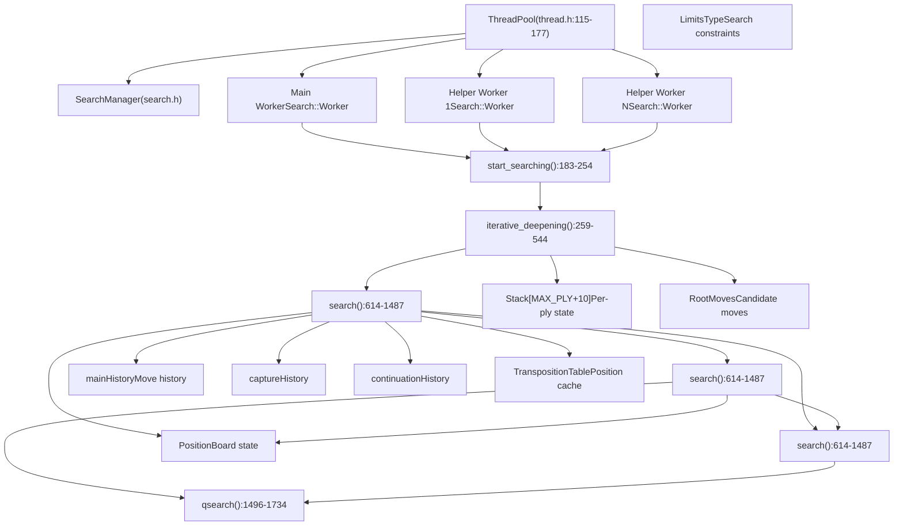
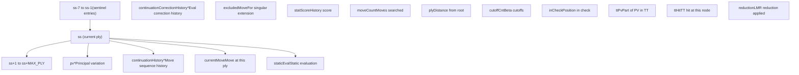
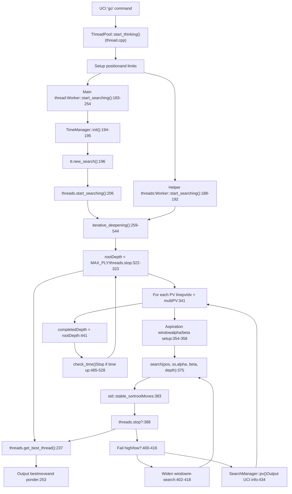
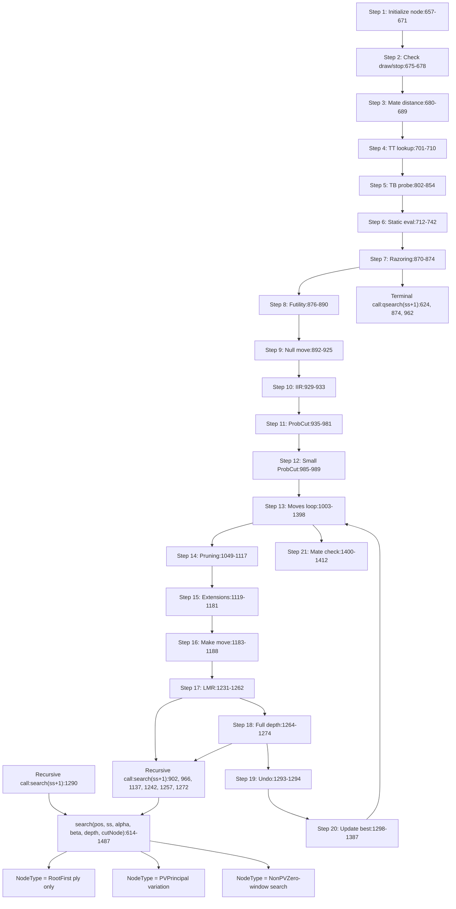
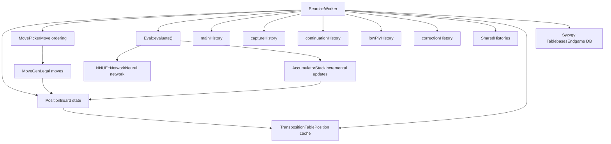

# 搜索系统

相关源文件

-   [src/search.cpp](https://github.com/official-stockfish/Stockfish/blob/c27c1747/src/search.cpp)
-   [src/thread.h](https://github.com/official-stockfish/Stockfish/blob/c27c1747/src/thread.h)

## 目的与范围

搜索系统是 Stockfish 最关键的组件（重要性 3593），负责探索博弈树以找到最佳的国际象棋着法。本页面提供了搜索架构、其关键组件以及它们如何交互的全面概述。

关于特定方面的详细信息：

-   **算法细节**（迭代加深、Alpha-Beta、剪枝、延伸）：请参阅 [搜索算法与迭代加深](/official-stockfish/Stockfish/4.1-search-algorithm-and-iterative-deepening)
-   **线程管理与并行化**：请参阅 [线程管理与并行搜索](/official-stockfish/Stockfish/4.2-thread-management-and-parallel-search)
-   **着法排序启发式**：请参阅 [着法排序与着法拾取器](/official-stockfish/Stockfish/4.3-move-ordering-and-move-picker)
-   **局面评估**：请参阅 [评估系统](/official-stockfish/Stockfish/5-evaluation-system)
-   **着法生成**：请参阅 [着法生成](/official-stockfish/Stockfish/3.3-move-generation)

## 系统架构

搜索系统由几个相互连接的组件组成，它们协同工作以高效地探索国际象棋局面树。

**来源：** [src/search.cpp1-2212](https://github.com/official-stockfish/Stockfish/blob/c27c1747/src/search.cpp#L1-L2212) [src/thread.h74-109](https://github.com/official-stockfish/Stockfish/blob/c27c1747/src/thread.h#L74-L109) [src/thread.h115-177](https://github.com/official-stockfish/Stockfish/blob/c27c1747/src/thread.h#L115-L177)

## 关键数据结构

### Search::Worker

`Search::Worker` 类是执行搜索算法的核心搜索引擎。每个线程都有自己的 `Worker` 实例，带有线程局部状态。

| 成员 | 类型 | 用途 |
| --- | --- | --- |
| `rootPos` | `Position` | 正在搜索的根局面 |
| `rootMoves` | `RootMoves` | 根节点的候选着法及其分数 |
| `rootDepth` | `Depth` | 当前正在搜索的深度 |
| `completedDepth` | `Depth` | 上一次完全完成的深度 |
| `selDepth` | `int` | 达到的最大选择性深度 |
| `mainHistory` | `ButterflyHistory` | 主历史表（颜色，着法） |
| `captureHistory` | `CapturePieceToHistory` | 吃子着法的历史 |
| `continuationHistory` | `ContinuationHistory` | 基于着法序列的历史 |
| `lowPlyHistory` | `LowPlyHistory` | 低层数局面的历史 |
| `accumulatorStack` | `AccumulatorStack` | NNUE 增量更新 |
| `nodes` | `atomic<uint64_t>` | 此 worker 的节点计数 |
| `tbHits` | `atomic<uint64_t>` | 码表探测计数 |

**关键方法：**

| 方法 | 行号 | 用途 |
| --- | --- | --- |
| `start_searching()` | [183-254](https://github.com/official-stockfish/Stockfish/blob/c27c1747/183-254) | 搜索入口点 |
| `iterative_deepening()` | [259-544](https://github.com/official-stockfish/Stockfish/blob/c27c1747/259-544) | 主迭代加深循环 |
| `search<NodeType>()` | [614-1487](https://github.com/official-stockfish/Stockfish/blob/c27c1747/614-1487) | 递归 Alpha-Beta 搜索 |
| `qsearch<NodeType>()` | [1496-1734](https://github.com/official-stockfish/Stockfish/blob/c27c1747/1496-1734) | 静态搜索（Quiescence search） |
| `do_move()` | [547-568](https://github.com/official-stockfish/Stockfish/blob/c27c1747/547-568) | 执行着法并更新状态 |
| `undo_move()` | [577-580](https://github.com/official-stockfish/Stockfish/blob/c27c1747/577-580) | 撤销着法 |
| `evaluate()` | [1755-1758](https://github.com/official-stockfish/Stockfish/blob/c27c1747/1755-1758) | 使用 NNUE 评估局面 |

**来源：** [src/search.cpp156-175](https://github.com/official-stockfish/Stockfish/blob/c27c1747/src/search.cpp#L156-L175) [src/search.cpp183-254](https://github.com/official-stockfish/Stockfish/blob/c27c1747/src/search.cpp#L183-L254) [src/search.cpp259-544](https://github.com/official-stockfish/Stockfish/blob/c27c1747/src/search.cpp#L259-L544)

### Stack 结构

`Stack` 结构维护每层（ply）的搜索状态。一个 `Stack` 对象数组构成了搜索栈，其中每个元素代表搜索树中的一层。

栈在负索引处使用哨兵条目进行初始化，以允许安全地访问连续历史查找。在每个搜索节点，栈指针 `ss` 向下传递，子节点使用 `ss+1`。

**栈使用模式：**

-   `ss`：当前搜索节点
-   `(ss-1)->currentMove`：导致此处的父节点着法
-   `(ss-2)->staticEval`：祖父节点的静态评估
-   `(ss+1)->pv`：子节点的主要变例

**来源：** [src/search.cpp278-292](https://github.com/official-stockfish/Stockfish/blob/c27c1747/src/search.cpp#L278-L292) [src/search.cpp547-568](https://github.com/official-stockfish/Stockfish/blob/c27c1747/src/search.cpp#L547-L568) [src/search.cpp570-575](https://github.com/official-stockfish/Stockfish/blob/c27c1747/src/search.cpp#L570-L575)

### RootMove 结构

`RootMove` 跟踪迭代加深期间根局面的候选着法信息。

| 字段 | 类型 | 用途 |
| --- | --- | --- |
| `pv` | `std::vector<Move>` | 从此着法开始的主要变例 |
| `score` | `Value` | 当前搜索分数 |
| `uciScore` | `Value` | 报告给 UCI 的分数 |
| `previousScore` | `Value` | 上一次迭代的分数 |
| `averageScore` | `Value` | 分数的运行平均值 |
| `meanSquaredScore` | `Value` | 渴望窗口（aspiration window）的均方分数 |
| `effort` | `uint64_t` | 搜索此着法花费的节点数 |
| `selDepth` | `int` | 达到的选择性深度 |
| `tbRank` | `int` | 码表排名（用于 TB 根局面） |
| `tbScore` | `Value` | 码表分数 |
| `scoreLowerbound` | `bool` | 分数是下界（高出截断） |
| `scoreUpperbound` | `bool` | 分数是上界（低出截断） |

`RootMoves` 向量在每次搜索迭代后进行排序，最佳着法移动到前面。

**来源：** [src/search.cpp331-333](https://github.com/official-stockfish/Stockfish/blob/c27c1747/src/search.cpp#L331-L333) [src/search.cpp383](https://github.com/official-stockfish/Stockfish/blob/c27c1747/src/search.cpp#L383-L383) [src/search.cpp1305-1354](https://github.com/official-stockfish/Stockfish/blob/c27c1747/src/search.cpp#L1305-L1354)

### SearchManager

`SearchManager` 协调搜索过程、管理时间并处理输出。

| 职责 | 实现 |
| --- | --- |
| 时间管理 | `TimeManager tm` 成员 |
| PV 输出 | `pv()` 方法 [2114-2183](https://github.com/official-stockfish/Stockfish/blob/c27c1747/2114-2183) |
| 时间检查 | `check_time()` [1944-1974](https://github.com/official-stockfish/Stockfish/blob/c27c1747/1944-1974) |
| 搜索更新 | `UpdateContext` 回调 |
| 最佳着法跟踪 | `bestPreviousScore`, `bestPreviousAverageScore` |
| 思考控制 | `ponder`, `stopOnPonderhit` 标志 |

**来源：** [src/search.cpp1944-1974](https://github.com/official-stockfish/Stockfish/blob/c27c1747/src/search.cpp#L1944-L1974) [src/search.cpp2114-2183](https://github.com/official-stockfish/Stockfish/blob/c27c1747/src/search.cpp#L2114-L2183)

## 搜索控制流

下图显示了从搜索启动到完成的完整控制流，包括实际函数调用及其在代码中的位置。

**来源：** [src/search.cpp183-254](https://github.com/official-stockfish/Stockfish/blob/c27c1747/src/search.cpp#L183-L254) [src/search.cpp259-544](https://github.com/official-stockfish/Stockfish/blob/c27c1747/src/search.cpp#L259-L544)

## 递归搜索结构

核心搜索算法使用模板特化来处理三种节点类型：`Root`（根）、`PV`（主要变例）和 `NonPV`（非主要变例）。

**关键搜索特征：**

-   **基于模板的分派**：三种节点类型带有 `constexpr bool` 标志，在编译时决定行为 [618-620](https://github.com/official-stockfish/Stockfish/blob/c27c1747/618-620)
-   **Fail-soft Alpha-Beta**：返回 `[alpha, beta]` 窗口之外的值
-   **零窗口搜索**：Non-PV 节点使用 `alpha = beta - 1` 进行更快的搜索 [638](https://github.com/official-stockfish/Stockfish/blob/c27c1747/638)
-   **深度优先与迭代加深**：在增加到 D+1 之前先探索到深度 D

**来源：** [src/search.cpp614-1487](https://github.com/official-stockfish/Stockfish/blob/c27c1747/src/search.cpp#L614-L1487)

## 静态搜索 (Quiescence Search)

当深度达到零时，常规搜索过渡到静态搜索（`qsearch`），以解决战术序列并避免水平线效应。

**静态搜索特征：**

| 方面 | 描述 |
| --- | --- |
| **入口条件** | 主搜索中 `depth <= 0` [623-624](https://github.com/official-stockfish/Stockfish/blob/c27c1747/623-624) |
| **搜索的着法** | 仅吃子和将军（在被将军局面中：所有解将着法） [1614-1616](https://github.com/official-stockfish/Stockfish/blob/c27c1747/1614-1616) |
| **站立（Stand pat）** | 可以不进行搜索而直接返回静态评估 [1590-1600](https://github.com/official-stockfish/Stockfish/blob/c27c1747/1590-1600) |
| **深度** | 对 TT 条目使用特殊的 `DEPTH_QS` 常量 |
| **剪枝** | 基于材质增益的富余剪枝（Futility pruning） [1636-1658](https://github.com/official-stockfish/Stockfish/blob/c27c1747/1636-1658) |
| **SEE 过滤** | 剪枝具有糟糕静态交换评估（Static Exchange Evaluation）的吃子 [1654-1667](https://github.com/official-stockfish/Stockfish/blob/c27c1747/1654-1667) |

**来源：** [src/search.cpp1496-1734](https://github.com/official-stockfish/Stockfish/blob/c27c1747/src/search.cpp#L1496-L1734)

## 与其他系统的集成

搜索系统与其他 Stockfish 组件紧密集成：

**集成点：**

| 系统 | 在搜索中的用法 | 位置 |
| --- | --- | --- |
| Position | 棋盘状态、着法执行、合法着法验证 | 贯穿搜索 |
| MovePicker | 以最佳顺序迭代着法 | [996-997](https://github.com/official-stockfish/Stockfish/blob/c27c1747/996-997) [1615-1616](https://github.com/official-stockfish/Stockfish/blob/c27c1747/1615-1616) |
| MoveGen | 生成伪合法着法 | 通过 MovePicker |
| NNUE | 叶子节点的局面评估 | [1755-1758](https://github.com/official-stockfish/Stockfish/blob/c27c1747/1755-1758) |
| AccumulatorStack | 着法执行期间的增量 NNUE 更新 | [557-558](https://github.com/official-stockfish/Stockfish/blob/c27c1747/557-558) |
| TranspositionTable | 用于截断和着法排序的局面缓存 | [704](https://github.com/official-stockfish/Stockfish/blob/c27c1747/704) [838-840](https://github.com/official-stockfish/Stockfish/blob/c27c1747/838-840) [974-975](https://github.com/official-stockfish/Stockfish/blob/c27c1747/974-975) |
| 历史表 | 着法排序和剪枝决策 | [996-997](https://github.com/official-stockfish/Stockfish/blob/c27c1747/996-997) [1084-1092](https://github.com/official-stockfish/Stockfish/blob/c27c1747/1084-1092) [1220-1225](https://github.com/official-stockfish/Stockfish/blob/c27c1747/1220-1225) |
| Syzygy | 残局码表探测 | [802-854](https://github.com/official-stockfish/Stockfish/blob/c27c1747/802-854) |
| TimeManager | 时间控制和搜索停止 | [194-195](https://github.com/official-stockfish/Stockfish/blob/c27c1747/194-195) [485-528](https://github.com/official-stockfish/Stockfish/blob/c27c1747/485-528) |

**来源：** [src/search.cpp547-568](https://github.com/official-stockfish/Stockfish/blob/c27c1747/src/search.cpp#L547-L568) [src/search.cpp704](https://github.com/official-stockfish/Stockfish/blob/c27c1747/src/search.cpp#L704-L704) [src/search.cpp996-997](https://github.com/official-stockfish/Stockfish/blob/c27c1747/src/search.cpp#L996-L997) [src/search.cpp1755-1758](https://github.com/official-stockfish/Stockfish/blob/c27c1747/src/search.cpp#L1755-L1758)

## 线程协调

搜索使用 Shared-Nothing 架构进行并行化，其中每个线程维护自己的 `Search::Worker` 和线程局部状态。

**线程角色：**

| 线程类型 | 职责 |
| --- | --- |
| 主线程 | 时间管理、PV 输出、最佳线程选择、结果报告 |
| 辅助线程 | 在同一根局面下以不同的随机变化进行独立搜索 |

**共享状态：**

-   `TranspositionTable`：无锁共享哈希表
-   `SharedHistories`：NUMA 复制的共享历史表
-   `threads.stop`：停止所有线程的原子标志
-   `threads.increaseDepth`：控制深度增加的标志

**线程协调流程：**

1.  主线程初始化时间管理器和置换表 [194-196](https://github.com/official-stockfish/Stockfish/blob/c27c1747/194-196)
2.  主线程启动辅助线程 [206](https://github.com/official-stockfish/Stockfish/blob/c27c1747/206)
3.  所有线程独立运行 `iterative_deepening()` [188-191](https://github.com/official-stockfish/Stockfish/blob/c27c1747/188-191) [207](https://github.com/official-stockfish/Stockfish/blob/c27c1747/207)
4.  主线程监控时间并设置停止标志 [485-528](https://github.com/official-stockfish/Stockfish/blob/c27c1747/485-528)
5.  所有线程定期检查停止标志 [322](https://github.com/official-stockfish/Stockfish/blob/c27c1747/322) [388](https://github.com/official-stockfish/Stockfish/blob/c27c1747/388) [676](https://github.com/official-stockfish/Stockfish/blob/c27c1747/676)
6.  主线程等待所有线程完成 [223](https://github.com/official-stockfish/Stockfish/blob/c27c1747/223)
7.  根据完成深度和分数选择最佳线程 [237](https://github.com/official-stockfish/Stockfish/blob/c27c1747/237)

**来源：** [src/search.cpp183-254](https://github.com/official-stockfish/Stockfish/blob/c27c1747/src/search.cpp#L183-L254) [src/search.cpp322-323](https://github.com/official-stockfish/Stockfish/blob/c27c1747/src/search.cpp#L322-L323) [src/thread.h115-177](https://github.com/official-stockfish/Stockfish/blob/c27c1747/src/thread.h#L115-L177)

## 搜索启发式汇总

搜索采用了大量启发式方法来提高效率。这些在 [搜索算法与迭代加深](/official-stockfish/Stockfish/4.1-search-algorithm-and-iterative-deepening) 中有详细文档，此处为参考摘要：

| 启发式 | 用途 | 位置 |
| --- | --- | --- |
| 渴望窗口（Aspiration windows） | 围绕预期分数的狭窄 Alpha-Beta 窗口 | [354-421](https://github.com/official-stockfish/Stockfish/blob/c27c1747/354-421) |
| 置换表（Transposition table） | 缓存局面评估 | [701-799](https://github.com/official-stockfish/Stockfish/blob/c27c1747/701-799) |
| 空着剪枝（Null move pruning） | 跳过着法以证明局面是好的 | [892-925](https://github.com/official-stockfish/Stockfish/blob/c27c1747/892-925) |
| 内部迭代归约（Internal iterative reduction） | 无 TT 着法时减少深度 | [929-933](https://github.com/official-stockfish/Stockfish/blob/c27c1747/929-933) |
| ProbCut | 如果归约搜索给出高值则剪枝 | [935-981](https://github.com/official-stockfish/Stockfish/blob/c27c1747/935-981) |
| Razoring | 如果评估非常低则返回 qsearch | [870-874](https://github.com/official-stockfish/Stockfish/blob/c27c1747/870-874) |
| 富余剪枝（Futility pruning） | 剪枝不太可能提高 Alpha 的着法 | [876-890](https://github.com/official-stockfish/Stockfish/blob/c27c1747/876-890) [1100-1109](https://github.com/official-stockfish/Stockfish/blob/c27c1747/1100-1109) |
| 晚期着法归约（LMR） | 以归约深度搜索后面的着法 | [1231-1262](https://github.com/official-stockfish/Stockfish/blob/c27c1747/1231-1262) |
| 奇异延伸（Singular extensions） | 延伸看似唯一最佳的着法 | [1129-1181](https://github.com/official-stockfish/Stockfish/blob/c27c1747/1129-1181) |
| SEE 剪枝 | 剪枝具有糟糕材质交换的着法 | [1075-1080](https://github.com/official-stockfish/Stockfish/blob/c27c1747/1075-1080) [1114](https://github.com/official-stockfish/Stockfish/blob/c27c1747/1114) |
| 基于历史的剪枝 | 剪枝具有糟糕历史表现的着法 | [1089-1090](https://github.com/official-stockfish/Stockfish/blob/c27c1747/1089-1090) |

**来源：** [src/search.cpp354-421](https://github.com/official-stockfish/Stockfish/blob/c27c1747/src/search.cpp#L354-L421) [src/search.cpp870-1181](https://github.com/official-stockfish/Stockfish/blob/c27c1747/src/search.cpp#L870-L1181)
