# 搜索算法与迭代加深

相关源文件

-   [src/search.cpp](https://github.com/official-stockfish/Stockfish/blob/c27c1747/src/search.cpp)
-   [src/thread.h](https://github.com/official-stockfish/Stockfish/blob/c27c1747/src/thread.h)

## 目的与范围

本文档记录了 Stockfish 中的核心搜索算法实现，重点关注探索博弈树的迭代加深框架和 Alpha-Beta 搜索函数。这包括主搜索循环、针对战术局面的静态搜索（Quiescence Search）、渴望窗口（Aspiration Windows），以及使搜索高效的各种剪枝和延伸技术。

关于着法排序启发式和 `MovePicker` 系统的信息，请参阅 [4.3](/official-stockfish/Stockfish/4-search-system/4.3-move-ordering-and-move-picker)。关于线程管理和并行搜索协调，请参阅 [4.2](/official-stockfish/Stockfish/4-search-system/4.2-thread-management-and-parallel-search)。关于使用 NNUE 的局面评估，请参阅 [5.1](/official-stockfish/Stockfish/5-evaluation-system/5.1-nnue-neural-network-evaluation)。

---

## 概述

搜索系统围绕三个主要组件构建：

1.  **迭代加深循环** - 逐步加深搜索直到时间耗尽
2.  **Alpha-Beta 搜索** - 带有 Alpha-Beta 剪枝的递归极小极大算法
3.  **静态搜索** - 延伸搜索以解决战术序列

搜索对 `Position` 对象进行操作，并返回一个代表可实现的最佳分数的 `Value`，以及显示最佳行棋路线的主要变例（PV）。

**来源：** [src/search.cpp259-544](https://github.com/official-stockfish/Stockfish/blob/c27c1747/src/search.cpp#L259-L544) [src/search.cpp615-1487](https://github.com/official-stockfish/Stockfish/blob/c27c1747/src/search.cpp#L615-L1487)

---

## 迭代加深框架

### 主入口点与控制流

搜索始于 `Search::Worker::start_searching()`，它初始化搜索并调用 `iterative_deepening()`。主线程承担时间管理和最终结果选择的额外责任。


**来源：** [src/search.cpp183-254](https://github.com/official-stockfish/Stockfish/blob/c27c1747/src/search.cpp#L183-L254)

### 迭代加深循环

位于 [src/search.cpp259-544](https://github.com/official-stockfish/Stockfish/blob/c27c1747/src/search.cpp#L259-L544) 的 `iterative_deepening()` 函数实现了主搜索循环。它以递增的深度值（从 1 到 `MAX_PLY` 或直到停止）反复调用 `search<Root>()`。


**来源：** [src/search.cpp259-544](https://github.com/official-stockfish/Stockfish/blob/c27c1747/src/search.cpp#L259-L544)

### 关键数据结构

| 结构 | 用途 | 位置 |
| --- | --- | --- |
| `Stack[MAX_PLY + 10]` | 每层（ply）搜索状态，存储着法信息、评估、历史指针 | [src/search.cpp278-292](https://github.com/official-stockfish/Stockfish/blob/c27c1747/src/search.cpp#L278-L292) |
| `rootMoves` | 根节点的候选着法向量，带分数和 PV | [src/search.h](https://github.com/official-stockfish/Stockfish/blob/c27c1747/src/search.h) |
| `rootDepth` | 迭代循环中的当前搜索深度 | [src/search.cpp322](https://github.com/official-stockfish/Stockfish/blob/c27c1747/src/search.cpp#L322-L322) |
| `alpha`, `beta` | 渴望窗口边界 | [src/search.cpp269](https://github.com/official-stockfish/Stockfish/blob/c27c1747/src/search.cpp#L269-L269) |
| `bestValue` | 迄今为止发现的最佳分数 | [src/search.cpp270](https://github.com/official-stockfish/Stockfish/blob/c27c1747/src/search.cpp#L270-L270) |

**来源：** [src/search.cpp263-292](https://github.com/official-stockfish/Stockfish/blob/c27c1747/src/search.cpp#L263-L292)

---

## Alpha-Beta 搜索算法

### 搜索函数模板

主搜索实现为一个模板函数 `search<NodeType>()`，处理三种节点类型：

```
template<NodeType nodeType>
Value Search::Worker::search(Position& pos, Stack* ss,
                              Value alpha, Value beta,
                              Depth depth, bool cutNode)
```
**节点类型：**

-   `Root` - 搜索树的根节点
-   `PV` - 预期最佳路径上的主要变例（Principal Variation）节点
-   `NonPV` - 使用空窗口（null window）搜索的非 PV 节点

**来源：** [src/search.cpp614-1487](https://github.com/official-stockfish/Stockfish/blob/c27c1747/src/search.cpp#L614-L1487)

### 搜索树结构


**来源：** [src/search.cpp614-625](https://github.com/official-stockfish/Stockfish/blob/c27c1747/src/search.cpp#L614-L625)

### 主搜索循环步骤

搜索函数遵循以下步骤（如代码注释中所述）：

| 步骤 | 行号 | 描述 |
| --- | --- | --- |
| 1 | [657-671](https://github.com/official-stockfish/Stockfish/blob/c27c1747/657-671) | 初始化节点 - 设置 `ss->inCheck`, `ss->moveCount`, `bestValue` |
| 2 | [675-678](https://github.com/official-stockfish/Stockfish/blob/c27c1747/675-678) | 检查中止搜索和立即和棋 |
| 3 | [680-690](https://github.com/official-stockfish/Stockfish/blob/c27c1747/680-690) | 杀棋距离剪枝 |
| 4 | [701-711](https://github.com/official-stockfish/Stockfish/blob/c27c1747/701-711) | 通过 `tt.probe(posKey)` 查找置换表 |
| 5 | [802-854](https://github.com/official-stockfish/Stockfish/blob/c27c1747/802-854) | 针对残局数据库中的局面进行码表探测 |
| 6 | [712-742](https://github.com/official-stockfish/Stockfish/blob/c27c1747/712-742) | 通过 `evaluate(pos)` 或 TT 进行静态评估 |
| 7 | [870-874](https://github.com/official-stockfish/Stockfish/blob/c27c1747/870-874) | Razoring - 如果评估非常低，直接返回 qsearch 结果 |
| 8 | [876-890](https://github.com/official-stockfish/Stockfish/blob/c27c1747/876-890) | 父节点的富余剪枝（Futility pruning） |
| 9 | [892-925](https://github.com/official-stockfish/Stockfish/blob/c27c1747/892-925) | 带验证的空着剪枝（Null move pruning） |
| 10 | [929-933](https://github.com/official-stockfish/Stockfish/blob/c27c1747/929-933) | 内部迭代归约（Internal iterative reduction, IIR） |
| 11 | [935-981](https://github.com/official-stockfish/Stockfish/blob/c27c1747/935-981) | ProbCut - 如果吃子大幅超过 beta 则剪枝 |
| 12 | [983-989](https://github.com/official-stockfish/Stockfish/blob/c27c1747/983-989) | 基于 TT 边界的 Small ProbCut |
| 13 | [1005-1398](https://github.com/official-stockfish/Stockfish/blob/c27c1747/1005-1398) | **主着法循环** - 搜索所有合法着法 |
| 14 | [1049-1116](https://github.com/official-stockfish/Stockfish/blob/c27c1747/1049-1116) | 静止着法和吃子的前向剪枝 |
| 15 | [1119-1181](https://github.com/official-stockfish/Stockfish/blob/c27c1747/1119-1181) | 奇异延伸（Singular extension）和 Multi-cut 剪枝 |
| 16 | [1184](https://github.com/official-stockfish/Stockfish/blob/c27c1747/1184) | 通过 `do_move()` 执行着法 |
| 17 | [1232-1262](https://github.com/official-stockfish/Stockfish/blob/c27c1747/1232-1262) | 晚期着法归约（Late Move Reduction, LMR） |
| 18 | [1264-1274](https://github.com/official-stockfish/Stockfish/blob/c27c1747/1264-1274) | 跳过 LMR 时的全深度搜索 |
| 19 | [1294](https://github.com/official-stockfish/Stockfish/blob/c27c1747/1294) | 通过 `undo_move()` 撤销着法 |
| 20 | [1298-1387](https://github.com/official-stockfish/Stockfish/blob/c27c1747/1298-1387) | 检查新的最佳着法并更新 PV |
| 21 | [1400-1412](https://github.com/official-stockfish/Stockfish/blob/c27c1747/1400-1412) | 如果无着法，检查杀棋/逼和 |

**来源：** [src/search.cpp615-1487](https://github.com/official-stockfish/Stockfish/blob/c27c1747/src/search.cpp#L615-L1487)

### 着法循环实现


**来源：** [src/search.cpp996-1398](https://github.com/official-stockfish/Stockfish/blob/c27c1747/src/search.cpp#L996-L1398)

---

## 静态搜索 (Quiescence Search)

当 `depth <= 0` 时，搜索通过 `qsearch<NodeType>()` 过渡到静态搜索。该函数仅搜索战术着法（吃子和将军），以解决因挂起的吃子而导致静态评估不稳定的“水平线效应”。

### 静态搜索流程


**来源：** [src/search.cpp1497-1734](https://github.com/official-stockfish/Stockfish/blob/c27c1747/src/search.cpp#L1497-L1734)

### 站立 (Stand Pat) 优化

在静态搜索中，如果未被将军，搜索可以“站立”（什么都不做）并使用静态评估。如果 `eval >= beta`，则局面已经足够好，因此我们立即返回而不搜索任何着法。

**来源：** [src/search.cpp1589-1600](https://github.com/official-stockfish/Stockfish/blob/c27c1747/src/search.cpp#L1589-L1600)

---

## 渴望窗口 (Aspiration Windows)

渴望窗口缩小了 Alpha-Beta 搜索边界，以提高截断效率。搜索从前一次迭代分数周围的一个小窗口开始，如果高出或低出（fails high or low），则扩大窗口。

### 渴望窗口逻辑

```mermaid
flowchart TD
    Start["Initial window:delta = 5 + threadIdx % 8alpha = avg - deltabeta = avg + delta"]
    Search["search<Root>(alpha, beta)"]
    CheckFail["Fail high/low?"]
    Success["Return bestValue"]
    FailLow["bestValue <= alpha:beta = alphaalpha = max(bestValue - delta, -INF)"]
    FailHigh["bestValue >= beta:alpha = max(beta - delta, alpha)beta = min(bestValue + delta, INF)"]
    Widen["delta += delta / 3"]
    Retry["Retry search"]

    Start --> Search
    Search --> CheckFail
    CheckFail --> Success
    CheckFail --> FailLow
    CheckFail --> FailHigh
    FailLow --> Widen
    FailHigh --> Widen
    Widen --> Retry
    Retry --> Search
```


**初始 Delta 计算：**

```
delta = 5 + threadIdx % 8 + abs(rootMoves[pvIdx].meanSquaredScore) / 9000
```
每个线程的 Delta 略有不同，以减少并行搜索中的搜索重叠。

**来源：** [src/search.cpp354-421](https://github.com/official-stockfish/Stockfish/blob/c27c1747/src/search.cpp#L354-L421)

---

## 搜索优化

### 剪枝技术

Stockfish 采用了多种剪枝技术来减少搜索树而不牺牲准确性。这些技术应用于搜索的不同点。

| 技术 | 位置 | 条件 | 效果 |
| --- | --- | --- | --- |
| **Razoring** | [870-874](https://github.com/official-stockfish/Stockfish/blob/c27c1747/870-874) | `eval < alpha - 485 - 281*depth^2` | 立即返回 qsearch 结果 |
| **富余剪枝 (Futility Pruning)** | [876-890](https://github.com/official-stockfish/Stockfish/blob/c27c1747/876-890) | 浅层深度处 `eval - margin >= beta` | 提前返回而不搜索着法 |
| **空着剪枝 (Null Move Pruning)** | [892-925](https://github.com/official-stockfish/Stockfish/blob/c27c1747/892-925) | 在 cut 节点 `eval >= beta - 18*depth + 350` | 跳过着法，在归约深度搜索 |
| **ProbCut** | [935-981](https://github.com/official-stockfish/Stockfish/blob/c27c1747/935-981) | 好的吃子超过 `beta + 235` | 剪枝整个子树 |
| **晚期着法剪枝 (Late Move Pruning)** | [1054-1055](https://github.com/official-stockfish/Stockfish/blob/c27c1747/1054-1055) | `moveCount >= (3 + depth^2) / (2 - improving)` | 跳过剩余的静止着法 |
| **吃子富余剪枝** | [1066-1073](https://github.com/official-stockfish/Stockfish/blob/c27c1747/1066-1073) | 低深度处 `futilityValue <= alpha` | 跳过糟糕的吃子 |
| **SEE 剪枝** | [1075-1080](https://github.com/official-stockfish/Stockfish/blob/c27c1747/1075-1080) | `!pos.see_ge(move, -margin)` | 跳过丢失材质的着法 |
| **延续历史 (Continuation History)** | [1088-1090](https://github.com/official-stockfish/Stockfish/blob/c27c1747/1088-1090) | `history < -4083 * depth` | 跳过历史表现糟糕的静止着法 |
| **静止 SEE 剪枝** | [1114-1115](https://github.com/official-stockfish/Stockfish/blob/c27c1747/1114-1115) | `!pos.see_ge(move, -25*lmrDepth^2)` | 跳过负 SEE 的静止着法 |

**来源：** [src/search.cpp870-1116](https://github.com/official-stockfish/Stockfish/blob/c27c1747/src/search.cpp#L870-L1116)

### 延伸技术

延伸增加了关键着法的搜索深度，以确保充分分析重要的战术序列。


**奇异延伸 (Singular Extension)：** 当 TT 着法看起来比所有替代着法好得多时，延伸其搜索深度。条件：

-   `move == ttData.move`
-   `depth >= 6 + ss->ttPv`
-   TT 值有效且具有 `BOUND_LOWER`
-   不处于 shuffling 局面

**来源：** [src/search.cpp1129-1181](https://github.com/official-stockfish/Stockfish/blob/c27c1747/src/search.cpp#L1129-L1181)

### 晚期着法归约 (LMR)

LMR 是一项关键优化，它以归约深度搜索后面的着法，基于前面的着法（排序更好）更可能是最佳着法的假设。

**归约公式：**

```
Depth r = reduction(improving, depth, moveCount, delta);
```
归约在 [src/search.cpp1736-1739](https://github.com/official-stockfish/Stockfish/blob/c27c1747/src/search.cpp#L1736-L1739) 中计算为：

```
int reductionScale = reductions[d] * reductions[mn];
return reductionScale - delta * 608 / rootDelta
       + !i * reductionScale * 238 / 512 + 1182;
```
其中：

-   `reductions[i] = int(2747 / 128.0 * log(i))` - 对数基归约
-   `delta` 是当前窗口大小
-   `improving` 在局面改善时减少 LMR

**归约调整：**

-   对 PV 节点减少：`r -= 2719 + PvNode * 983 + ...` [1192-1193](https://github.com/official-stockfish/Stockfish/blob/c27c1747/1192-1193)
-   按搜索的着法减少：`r -= moveCount * 73` [1196](https://github.com/official-stockfish/Stockfish/blob/c27c1747/1196)
-   在 cut 节点增加：`r += 3372 + 997 * !ttData.move` [1201](https://github.com/official-stockfish/Stockfish/blob/c27c1747/1201)
-   如果 ttMove 是吃子则增加：`r += 1119` [1205](https://github.com/official-stockfish/Stockfish/blob/c27c1747/1205)
-   基于历史减少：`r -= ss->statScore * 850 / 8192` [1225](https://github.com/official-stockfish/Stockfish/blob/c27c1747/1225)

**LMR 重新搜索：** 如果归约搜索高出（`value > alpha`），则在 [1257](https://github.com/official-stockfish/Stockfish/blob/c27c1747/1257) 执行全深度搜索。

**来源：** [src/search.cpp1232-1262](https://github.com/official-stockfish/Stockfish/blob/c27c1747/src/search.cpp#L1232-L1262) [src/search.cpp1736-1739](https://github.com/official-stockfish/Stockfish/blob/c27c1747/src/search.cpp#L1736-L1739)

---

## 价值管理与评分

### 价值类型与范围


**价值分类函数：**

-   `is_win(v)` - 价值表示强制胜
-   `is_loss(v)` - 价值表示强制负
-   `is_decisive(v)` - 胜或负
-   `is_valid(v)` - 非 `VALUE_NONE`

**来源：** [src/types.h](https://github.com/official-stockfish/Stockfish/blob/c27c1747/src/types.h)

### 价值转换

存储在置换表中的值被调整为与层数无关：

**`value_to_tt(v, ply)`** [1764](https://github.com/official-stockfish/Stockfish/blob/c27c1747/1764) - 存入 TT 之前：

```
return is_win(v) ? v + ply : is_loss(v) ? v - ply : v;
```
**`value_from_tt(v, ply, r50c)`** [1772-1806](https://github.com/official-stockfish/Stockfish/blob/c27c1747/1772-1806) - 从 TT 检索时：

-   将杀棋/TB 分数调整回根视角
-   根据 rule50 计数降级潜在的虚假杀棋分数
-   对于无效值返回 `VALUE_NONE`

**来源：** [src/search.cpp1760-1806](https://github.com/official-stockfish/Stockfish/blob/c27c1747/src/search.cpp#L1760-L1806)

### 修正历史

静态评估通过修正历史进行调整，以解决系统性评估误差：

```
Value to_corrected_static_eval(Value v, int cv) {
    return clamp(v + cv / 131072,
                 VALUE_TB_LOSS_IN_MAX_PLY + 1,
                 VALUE_TB_WIN_IN_MAX_PLY - 1);
}
```
位于 [80-94](https://github.com/official-stockfish/Stockfish/blob/c27c1747/80-94) 的 `correction_value()` 结合了多个修正历史：

-   兵型结构修正
-   轻子修正
-   非兵材质修正
-   延续修正历史

这些在搜索完成时于 [102-124](https://github.com/official-stockfish/Stockfish/blob/c27c1747/102-124) 更新，以减少未来的评估误差。

**来源：** [src/search.cpp80-124](https://github.com/official-stockfish/Stockfish/blob/c27c1747/src/search.cpp#L80-L124)

---

## 栈结构与着法状态

`Stack` 结构维护每层搜索状态。分配了一个 `Stack[MAX_PLY + 10]` 数组，并有一个指向当前层数的指针 `ss`。

### Stack 成员

| 成员 | 类型 | 用途 |
| --- | --- | --- |
| `pv` | `Move*` | 指向主要变例数组的指针 |
| `ply` | `int` | 到根节点的距离 |
| `currentMove` | `Move` | 导致此局面的着法 |
| `excludedMove` | `Move` | 在奇异延伸中排除的着法 |
| `continuationHistory` | `PieceToHistory**` | 指向此棋子/格位的历史表的指针 |
| `continuationCorrectionHistory` | `int**` | 指向修正历史的指针 |
| `staticEval` | `Value` | 局面的静态评估 |
| `statScore` | `int` | 当前着法的组合历史分数 |
| `moveCount` | `int` | 搜索的着法数量 |
| `inCheck` | `bool` | 走棋方是否被将军 |
| `ttHit` | `bool` | TT 是否有条目 |
| `ttPv` | `bool` | 这是否是 PV 节点 |
| `reduction` | `int` | 应用于上次搜索的归约 |
| `cutoffCnt` | `int` | 此层数的 beta 截断次数 |

**初始化：**

```
Stack stack[MAX_PLY + 10] = {};
Stack* ss = stack + 7;  // Allow ss-7 access
```
额外的空间允许访问 `(ss - 7)` 进行延续历史更新，以及 `(ss + 2)` 进行截断跟踪。

**来源：** [src/search.cpp278-292](https://github.com/official-stockfish/Stockfish/blob/c27c1747/src/search.cpp#L278-L292) [src/search.h](https://github.com/official-stockfish/Stockfish/blob/c27c1747/src/search.h)

---

## 搜索中的着法执行

### Worker 着法函数

`Search::Worker` 类提供了着法执行的包装函数，用于更新搜索特定状态：

**`do_move()`** [547-568](https://github.com/official-stockfish/Stockfish/blob/c27c1747/547-568)：

```
void Search::Worker::do_move(Position& pos, Move move,
                              StateInfo& st, bool givesCheck,
                              Stack* ss) {
    nodes++;
    auto [dirtyPiece, dirtyThreats] = accumulatorStack.push();
    pos.do_move(move, st, givesCheck, dirtyPiece, dirtyThreats,
                &tt, &sharedHistory);

    ss->currentMove = move;
    ss->continuationHistory =
        &continuationHistory[ss->inCheck][capture][dirtyPiece.pc][move.to_sq()];
    ss->continuationCorrectionHistory =
        &continuationCorrectionHistory[dirtyPiece.pc][move.to_sq()];
}
```
这会：

1.  增加节点计数器
2.  推送 NNUE 累加器状态
3.  调用 `Position::do_move()`
4.  使用着法和历史指针更新堆栈

**`undo_move()`** [577-580](https://github.com/official-stockfish/Stockfish/blob/c27c1747/577-580)：

```
void Search::Worker::undo_move(Position& pos, Move move) {
    pos.undo_move(move);
    accumulatorStack.pop();
}
```
**空着：** 在 [570-575](https://github.com/official-stockfish/Stockfish/blob/c27c1747/570-575) 和 [582](https://github.com/official-stockfish/Stockfish/blob/c27c1747/582) 处进行特殊处理以用于空着剪枝。

**来源：** [src/search.cpp547-583](https://github.com/official-stockfish/Stockfish/blob/c27c1747/src/search.cpp#L547-L583)

---

## 搜索终止与时间管理

### 停止条件

搜索可能会因多种原因终止，并在各个点进行检查：

1.  **显式停止** - 由时间管理器或 UCI 命令设置 `threads.stop` 标志
2.  **最大深度** - `rootDepth > limits.depth`
3.  **发现杀棋** - N 步杀，其中 N 匹配 `limits.mate`
4.  **时间耗尽** - `elapsed > tm.maximum()` 或 `elapsed > totalTime`
5.  **节点限制** - `nodes >= limits.nodes`

**检查时间函数：**

主线程在 [1944-1974](https://github.com/official-stockfish/Stockfish/blob/c27c1747/1944-1974) 处定期调用 `check_time()` 以评估是否停止：

```
void SearchManager::check_time(Search::Worker& worker) {
    if (--callsCnt > 0)
        return;

    callsCnt = worker.limits.nodes
               ? min(512, int(worker.limits.nodes / 1024))
               : 512;

    // Check time/node limits and set threads.stop if needed
}
```
**来源：** [src/search.cpp666-667](https://github.com/official-stockfish/Stockfish/blob/c27c1747/src/search.cpp#L666-L667) [src/search.cpp1944-1974](https://github.com/official-stockfish/Stockfish/blob/c27c1747/src/search.cpp#L1944-L1974)

### 时间管理因素

时间分配在 [485-528](https://github.com/official-stockfish/Stockfish/blob/c27c1747/485-528) 处考虑了多个因素：


**因素：**

-   `fallingEval` - 如果分数下降，花费更多时间 [490-493](https://github.com/official-stockfish/Stockfish/blob/c27c1747/490-493)
-   `timeReduction` - 如果最佳着法稳定，花费更少时间 [496-499](https://github.com/official-stockfish/Stockfish/blob/c27c1747/496-499)
-   `bestMoveInstability` - 如果最佳着法不断变化，花费更多时间 [503](https://github.com/official-stockfish/Stockfish/blob/c27c1747/503)
-   `highBestMoveEffort` - 如果一个着法主导节点计数，花费更少时间 [505](https://github.com/official-stockfish/Stockfish/blob/c27c1747/505)

**来源：** [src/search.cpp485-528](https://github.com/official-stockfish/Stockfish/blob/c27c1747/src/search.cpp#L485-L528)

---

## 主要变例 (Principal Variation) 管理

### PV 数组结构

每个节点维护一个 PV 数组，代表从该位置开始的最佳路线：

```
Move pv[MAX_PLY + 1];
ss->pv = pv;  // Point to this ply's PV array
```
**PV 更新：** 当在 [1369-1370](https://github.com/official-stockfish/Stockfish/blob/c27c1747/1369-1370) 处找到更好的着法时：

```
if (PvNode && !rootNode)
    update_pv(ss->pv, move, (ss + 1)->pv);
```
[1810-1815](https://github.com/official-stockfish/Stockfish/blob/c27c1747/1810-1815) 处的 `update_pv()` 函数复制子节点的 PV：

```
void update_pv(Move* pv, Move move, const Move* childPv) {
    for (*pv++ = move; childPv && *childPv != Move::none();)
        *pv++ = *childPv++;
    *pv = Move::none();
}
```
**来源：** [src/search.cpp1810-1815](https://github.com/official-stockfish/Stockfish/blob/c27c1747/src/search.cpp#L1810-L1815) [src/search.cpp1369-1370](https://github.com/official-stockfish/Stockfish/blob/c27c1747/src/search.cpp#L1369-L1370)

### 根着法结构

在根节点，每个候选着法都有一个 `RootMove` 结构跟踪：

```
struct RootMove {
    Value score;           // Current search score
    Value previousScore;   // Score from last iteration
    Value averageScore;    // Average score over searches
    Value uciScore;        // Score sent to GUI (with bounds)
    int selDepth;          // Selective depth reached
    int tbRank;           // Tablebase rank
    Value tbScore;        // Tablebase score
    std::vector<Move> pv; // Principal variation
    uint64_t effort;      // Nodes spent on this move
    bool scoreLowerbound; // Score is >= real value
    bool scoreUpperbound; // Score is <= real value
}
```
**来源：** [src/search.h](https://github.com/official-stockfish/Stockfish/blob/c27c1747/src/search.h)

---

## 统计与历史更新

### 历史表更新

当着法导致 beta 截断时，更新历史表以改善未来的着法排序：

**`update_all_stats()`** [1819-1872](https://github.com/official-stockfish/Stockfish/blob/c27c1747/1819-1872)：

-   为静止着法更新 `mainHistory`
-   为吃子更新 `captureHistory`
-   为着法序列更新 `continuationHistory`
-   对好着法应用奖励，对坏着法应用惩罚

**奖励计算：**

```
int bonus = min(116 * depth - 81, 1515)
          + 347 * (bestMove == ttMove)
          + (ss - 1)->statScore / 32;
```
**惩罚计算：**

```
int malus = min(848 * depth - 207, 2446) - 17 * moveCount;
```
**来源：** [src/search.cpp1819-1872](https://github.com/official-stockfish/Stockfish/blob/c27c1747/src/search.cpp#L1819-L1872)

### 延续历史 (Continuation History)

延续历史跟踪不同层数的着法对。当一个着法是好/坏时，在 [1877-1890](https://github.com/official-stockfish/Stockfish/blob/c27c1747/1877-1890) 处更新最近的 6 个着法对：

```
void update_continuation_histories(Stack* ss, Piece pc,
                                    Square to, int bonus) {
    static std::array<ConthistBonus, 6> conthist_bonuses = {
        {{1, 1133}, {2, 683}, {3, 312},
         {4, 582}, {5, 149}, {6, 474}}
    };

    for (const auto [i, weight] : conthist_bonuses) {
        if (ss->inCheck && i > 2)
            break;
        if (((ss - i)->currentMove).is_ok())
            (*(ss - i)->continuationHistory)[pc][to]
                << (bonus * weight / 1024) + 88 * (i < 2);
    }
}
```
这创建了诸如“在对手走 X 之后，我们走 Y 效果很好”的模式。

**来源：** [src/search.cpp1877-1890](https://github.com/official-stockfish/Stockfish/blob/c27c1747/src/search.cpp#L1877-L1890)
