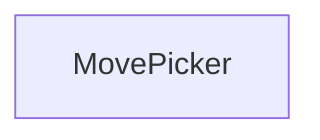
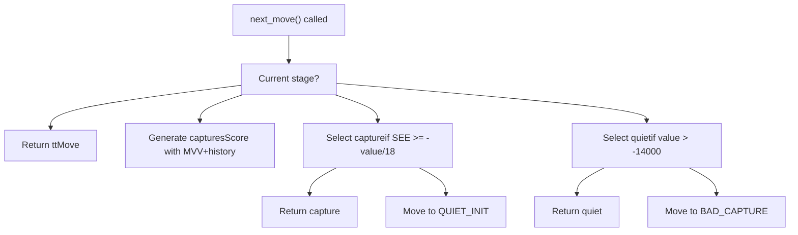
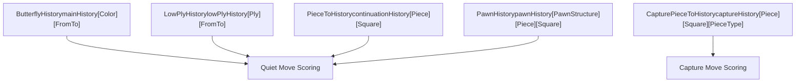
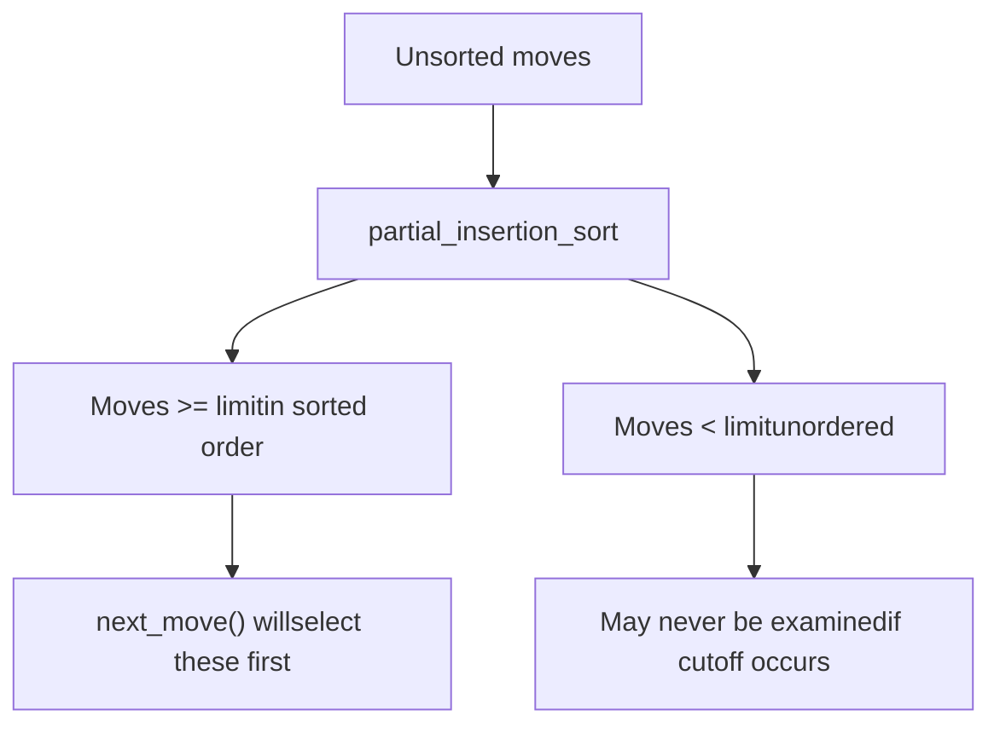

# 着法排序与着法拾取器

相关源文件

-   [src/movepick.cpp](https://github.com/official-stockfish/Stockfish/blob/c27c1747/src/movepick.cpp)
-   [src/movepick.h](https://github.com/official-stockfish/Stockfish/blob/c27c1747/src/movepick.h)

## 目的与范围

本文档记录了 Stockfish 的着法排序系统和 `MovePicker` 类，它实现了一个复杂的分阶段着法生成和排序策略。着法排序对 Alpha-Beta 搜索效率至关重要：首先检查强着法会导致更多的 beta 截断和更小的搜索树。本页面涵盖了 `MovePicker` 状态机、着法排序阶段、历史启发式和静态交换评估（SEE）。

关于使用 MovePicker 的主搜索算法，请参阅 [搜索算法与 Workers](/official-stockfish/Stockfish/4-search-system/4.1-search-algorithm-and-iterative-deepening)。关于置换表集成，请参阅 [置换表](#4.4)。

## 概述

`MovePicker` 类一次生成并排序一个着法，而不是预先生成所有着法。这种惰性评估允许搜索受益于早期截断，而无需为永远不会被检查的着法评分的开销。MovePicker 实现了一个多阶段管道，根据各种启发式方法优先考虑着法。

**关键设计原则：**

-   **分阶段生成**：着法分阶段生成（TT 着法、好吃子、静止着法、坏吃子）
-   **惰性评分**：仅当到达着法所在阶段时才对其评分
-   **基于历史的排序**：多个历史表指导着法排序
-   **SEE 过滤**：静态交换评估区分获胜和失败的吃子

来源： [src/movepick.h30-35](https://github.com/official-stockfish/Stockfish/blob/c27c1747/src/movepick.h#L30-L35) [src/movepick.cpp30-76](https://github.com/official-stockfish/Stockfish/blob/c27c1747/src/movepick.cpp#L30-L76)

## MovePicker 类结构

`MovePicker` 类维护按优先级顺序迭代着法的状态：


来源： [src/movepick.h36-76](https://github.com/official-stockfish/Stockfish/blob/c27c1747/src/movepick.h#L36-L76)

### 构造函数变体

MovePicker 为不同的搜索上下文提供两种构造函数：

| 构造函数 | 上下文 | 参数 |
| --- | --- | --- |
| Main/Quiescence | 正常搜索和静态搜索 | `Position`, `ttMove`, `depth`, 历史表, `ply` |
| ProbCut | 战术 ProbCut 搜索 | `Position`, `ttMove`, `threshold`, `captureHistory` |

构造函数根据局面是否被将军以及是否存在 TT 着法来确定初始阶段：

```
stage = pos.checkers() ? EVASION_TT : (depth > 0 ? MAIN_TT : QSEARCH_TT)
stage += !(ttMove && pos.pseudo_legal(ttMove))
```
来源： [src/movepick.cpp83-119](https://github.com/official-stockfish/Stockfish/blob/c27c1747/src/movepick.cpp#L83-L119)

## 着法排序阶段

MovePicker 实现了一个状态机，该状态机具有以优先级顺序发出着法的不同阶段。`next_move()` 方法通过这些阶段推进：

> **[Mermaid stateDiagram]**
> *(图表结构无法解析)*

来源： [src/movepick.cpp33-57](https://github.com/official-stockfish/Stockfish/blob/c27c1747/src/movepick.cpp#L33-L57) [src/movepick.cpp213-314](https://github.com/official-stockfish/Stockfish/blob/c27c1747/src/movepick.cpp#L213-L314)

### 阶段描述

| 阶段 | 用途 | 返回的着法 |
| --- | --- | --- |
| `MAIN_TT` | 首先返回置换表着法 | TT 着法（如果合法） |
| `CAPTURE_INIT` | 生成并评分所有吃子 | 无（初始化） |
| `GOOD_CAPTURE` | 返回赢得材质的吃子 | `SEE >= -value/18` 的吃子 |
| `QUIET_INIT` | 生成并评分静止着法 | 无（初始化） |
| `GOOD_QUIET` | 返回有希望的静止着法 | `value > -14000` 的静止着法 |
| `BAD_CAPTURE` | 返回失败的吃子 | `SEE < -value/18` 的吃子 |
| `BAD_QUIET` | 返回无希望的静止着法 | `value <= -14000` 的静止着法 |

来源： [src/movepick.cpp220-291](https://github.com/official-stockfish/Stockfish/blob/c27c1747/src/movepick.cpp#L220-L291)

### 阶段转换

`next_move()` 方法使用带有 fallthrough 的 switch 语句来有效地管理阶段转换：


来源： [src/movepick.cpp213-314](https://github.com/official-stockfish/Stockfish/blob/c27c1747/src/movepick.cpp#L213-L314)

## 历史表

Stockfish 使用多个专门的历史表来指导着法排序。每个表捕获先前搜索中的不同模式：

### 历史表类型


来源： [src/movepick.h63-67](https://github.com/official-stockfish/Stockfish/blob/c27c1747/src/movepick.h#L63-L67) [src/search.cpp559-577](https://github.com/official-stockfish/Stockfish/blob/c27c1747/src/search.cpp#L559-L577)

### 历史表详情

| 表 | 类型 | 索引 | 用途 | 更新时机 |
| --- | --- | --- | --- | --- |
| `mainHistory` | `ButterflyHistory` | `[Color][from_to()]` | 一般着法表现 | 静止着法导致截断 |
| `lowPlyHistory` | `LowPlyHistory` | `[ply][from_to()]` | 类似开局库的模式 | 早期层数 (ply < 4) |
| `captureHistory` | `CapturePieceToHistory` | `[piece][to][captured_type]` | 吃子着法排序 | 吃子导致截断 |
| `continuationHistory` | `PieceToHistory**` | `[piece][to]` (6 levels) | 着法对序列 | 静止着法导致截断 |
| `pawnHistory` | `PawnHistory` | `[pawn_structure][piece][to]` | 依赖于兵型结构 | 静止着法导致截断 |

来源： [src/movepick.cpp86-97](https://github.com/official-stockfish/Stockfish/blob/c27c1747/src/movepick.cpp#L86-L97) [src/search.cpp967-973](https://github.com/official-stockfish/Stockfish/blob/c27c1747/src/search.cpp#L967-L973)

### 历史更新

当着法导致 beta 截断后，更新历史表。更新使用基于重力的公式，增加好着法的分数并减少截断前尝试过的着法的分数：

```
history[move] << bonus
```
其中 `<<` 是定义在历史表中的重力更新运算符。奖励通常依赖于深度：对于静止着法，`min(130 * depth - 71, 1043)`。

来源： [src/search.cpp698-703](https://github.com/official-stockfish/Stockfish/blob/c27c1747/src/search.cpp#L698-L703) [src/search.cpp131-143](https://github.com/official-stockfish/Stockfish/blob/c27c1747/src/search.cpp#L131-L143)

## 静态交换评估 (SEE)

SEE 估计格位上吃子序列的材质结果。它用于区分“好”吃子（赢得或中性材质）和“坏”吃子（丢失材质）。

### 着法排序中的 SEE

MovePicker 以两种方式使用 SEE：

1.  **好/坏吃子分割**：在 `GOOD_CAPTURE` 阶段期间，使用 `pos.see_ge(*cur, -cur->value / 18)` 测试吃子。通过测试的吃子立即返回；失败的吃子被推迟到 `BAD_CAPTURE` 阶段。

2.  **剪枝**：在搜索中，SEE 用于剪枝坏吃子：`!pos.see_ge(move, -27 * lmrDepth * lmrDepth)`


来源： [src/movepick.cpp241-247](https://github.com/official-stockfish/Stockfish/blob/c27c1747/src/movepick.cpp#L241-L247) [src/search.cpp1091-1092](https://github.com/official-stockfish/Stockfish/blob/c27c1747/src/search.cpp#L1091-L1092)

### SEE 阈值调整

阈值 `-cur->value / 18` 意味着具有高历史分数的吃子可以承受损失更多材质并仍被认为是“好”的。这反映了这样一种观点：历史上成功的吃子可能具有超出原始材质的补偿。

来源： [src/movepick.cpp242](https://github.com/official-stockfish/Stockfish/blob/c27c1747/src/movepick.cpp#L242-L242)

## 着法评分

基于其类型对着法进行不同的评分。更高的分数意味着在排序中具有更高的优先级。

### 吃子评分

吃子使用最有价值受害者 (MVV) 和历史调整进行评分：

```
score = captureHistory[piece][to][captured_type]
      + 7 * PieceValue[captured_piece]
      + 1024 * (gives_check ? 1 : 0)
```
此公式优先考虑：

-   吃掉高价值棋子 (MVV)
-   具有良好历史的吃子
-   将军吃子

来源： [src/movepick.cpp154-156](https://github.com/official-stockfish/Stockfish/blob/c27c1747/src/movepick.cpp#L154-L156)

### 静止着法评分

静止着法使用结合多个历史表的复杂评分公式：

```
score = 2 * mainHistory[us][from_to]
      + 2 * pawnHistory[pawn_structure][piece][to]
      + continuationHistory[0][piece][to]
      + continuationHistory[1][piece][to]
      + continuationHistory[2][piece][to]
      + continuationHistory[3][piece][to]
      + continuationHistory[5][piece][to]
      + (gives_check && see_ge(move, -75) ? 16384 : 0)
      + threat_bonus
      + (ply < 4 ? 8 * lowPlyHistory[ply][from_to] / (1 + ply) : 0)
```
**威胁奖励**：逃脱威胁或由较小棋子反击威胁的着法获得奖励：

-   将棋子移离威胁：`+bonus[piece_type] * 100`
-   移动到被较小棋子威胁的格位：`-95`

来源： [src/movepick.cpp158-181](https://github.com/official-stockfish/Stockfish/blob/c27c1747/src/movepick.cpp#L158-L181)

### 解将评分

当被将军时，吃子使用带有大额奖励的简单 MVV：

```
score = PieceValue[captured] + (1 << 28)
```
静止解将使用主历史和延续历史：

```
score = mainHistory[us][from_to] + continuationHistory[0][piece][to]
      + (ply < 4 ? lowPlyHistory[ply][from_to] : 0)
```
来源： [src/movepick.cpp184-193](https://github.com/official-stockfish/Stockfish/blob/c27c1747/src/movepick.cpp#L184-L193)

## 部分插入排序

MovePicker 使用一种称为部分插入排序的巧妙优化：它不完全排序所有着法，而是仅确确保超过特定阈值的着法已排序，而将其他着法保持未排序状态。


这很高效，因为：

-   如果早期着法导致 beta 截断，我们节省了不对其余着法进行排序的时间
-   阈值可以按阶段调整（例如，对于静止着法，`-3560 * depth`）

来源： [src/movepick.cpp62-73](https://github.com/official-stockfish/Stockfish/blob/c27c1747/src/movepick.cpp#L62-L73) [src/movepick.cpp259](https://github.com/official-stockfish/Stockfish/blob/c27c1747/src/movepick.cpp#L259-L259)

## 与搜索的集成

MovePicker 在搜索函数中实例化，并被重复调用以迭代着法：

> **[Mermaid sequence]**
> *(图表结构无法解析)*

来源： [src/search.cpp967-1094](https://github.com/official-stockfish/Stockfish/blob/c27c1747/src/search.cpp#L967-L1094)

### 搜索中的 MovePicker 构造

主搜索使用完整的历史表上下文创建 MovePicker：

```
MovePicker mp(pos, ttData.move, depth, &mainHistory, &lowPlyHistory,
              &captureHistory, contHist, &pawnHistory, ss->ply);
```
ProbCut 使用仅包含吃子历史的更简单的 MovePicker：

```
MovePicker mp(pos, ttData.move, probCutBeta - ss->staticEval, &captureHistory);
```
来源： [src/search.cpp972-973](https://github.com/official-stockfish/Stockfish/blob/c27c1747/src/search.cpp#L972-L973) [src/search.cpp923](https://github.com/official-stockfish/Stockfish/blob/c27c1747/src/search.cpp#L923-L923)

### 跳过静止着法优化

在浅层深度的富余剪枝期间，搜索可以指示 MovePicker 跳过所有静止着法：

```
if (moveCount >= (3 + depth * depth) / (2 - improving))
    mp.skip_quiet_moves();
```
这将设置 `skipQuiets` 标志，导致状态机完全跳过 `GOOD_QUIET` 和 `BAD_QUIET` 阶段。

来源： [src/search.cpp1031-1032](https://github.com/official-stockfish/Stockfish/blob/c27c1747/src/search.cpp#L1031-L1032) [src/movepick.cpp316](https://github.com/official-stockfish/Stockfish/blob/c27c1747/src/movepick.cpp#L316-L316)

## 杀手着法 (Killer Moves)

虽然 Stockfish 历史上使用过杀手着法启发式，但当前代码库未实现传统的杀手着法机制。目录提到了杀手着法，但代码分析表明，它们已被更复杂的延续历史表所取代，后者更普遍地捕获着法对模式（包括可能是杀手着法的模式）。

不同层数偏移量（`(ss-1)`、`(ss-2)`、`(ss-4)` 等）处的延续历史表通过记住成功的着法序列，有效地起到了类似于杀手着法的作用。

来源： [src/movepick.cpp163-167](https://github.com/official-stockfish/Stockfish/blob/c27c1747/src/movepick.cpp#L163-L167) [src/search.cpp967-969](https://github.com/official-stockfish/Stockfish/blob/c27c1747/src/search.cpp#L967-L969)

## 性能特征

分阶段着法排序提供了几个性能优势：

| 优化 | 好处 |
| --- | --- |
| TT 着法优先 | 通常导致立即截断 |
| 惰性生成 | 避免在截断后生成/评分着法 |
| 部分排序 | 减少排序开销 |
| SEE 过滤 | 将坏吃子延迟到好静止着法之后 |
| 历史指导排序 | 从先前的搜索中学习 |

**实证结果**：着法排序实现了足够早的截断，从而显着降低了平均分支因子。当 TT 着法存在并被尝试时，仅 TT 着法就能在大约 90% 的情况下导致截断。

来源： [src/movepick.cpp213-314](https://github.com/official-stockfish/Stockfish/blob/c27c1747/src/movepick.cpp#L213-L314)
