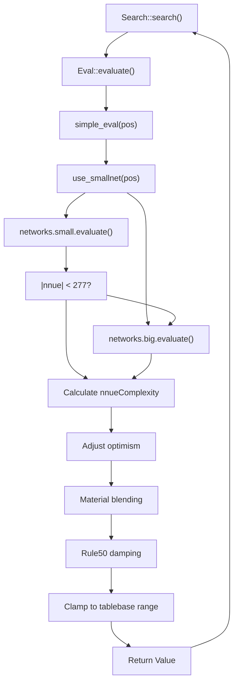
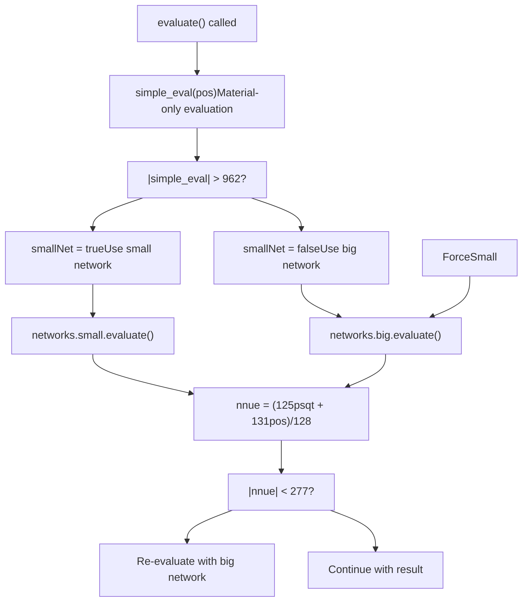
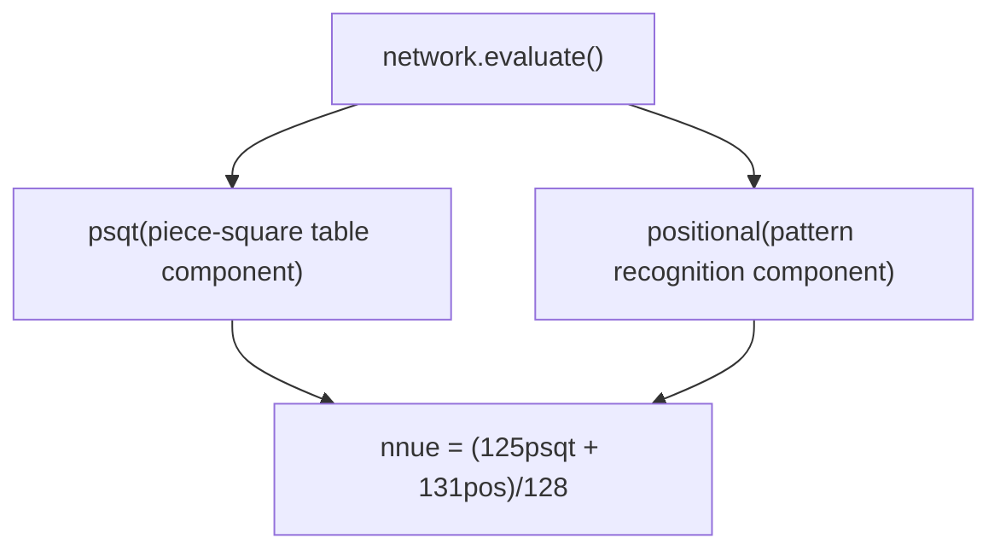
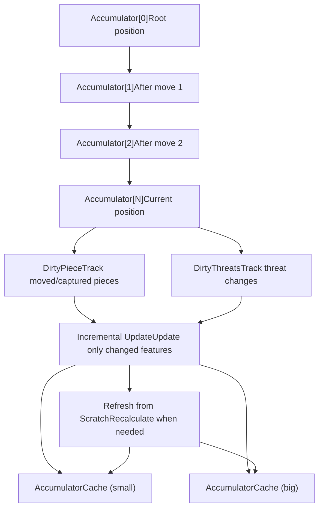
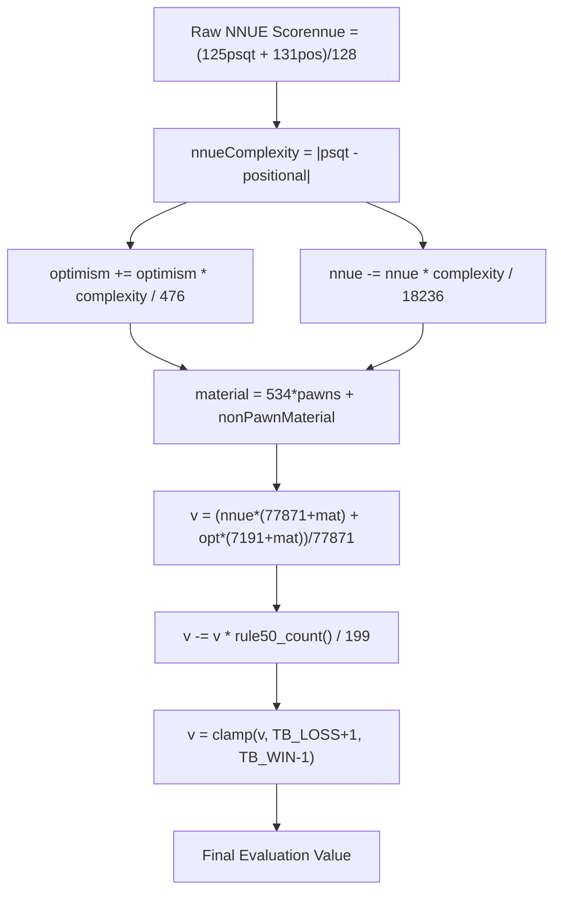
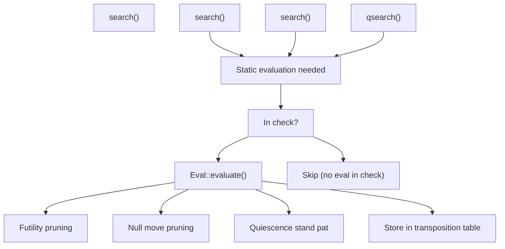

# NNUE 神经网络评估

相关源文件

-   [src/evaluate.cpp](https://github.com/official-stockfish/Stockfish/blob/c27c1747/src/evaluate.cpp)

## 目的与范围

本文档详细介绍了 Stockfish 的 NNUE（高效可更新神经网络）评估系统，该系统从 Stockfish 12 开始取代了传统的手工评估。NNUE 使用神经网络来评估国际象棋局面，提供了比以前的评估方法强得多的对弈水平。

本页面涵盖：

-   双网络架构（小网络和大网络）
-   基于局面特征的网络选择逻辑
-   基于累加器的增量更新系统
-   调整原始神经网络输出的分数转换管道
-   与搜索系统的集成

关于搜索期间如何调用评估的信息，请参阅 [搜索算法与迭代加深](/official-stockfish/Stockfish/4-search-system/4.1-search-algorithm-and-iterative-deepening)。关于 NNUE 评估的局面表示的详细信息，请参阅 [局面与状态管理](/official-stockfish/Stockfish/3-board-representation/3.1-position-and-state-management)。

**来源：** [src/evaluate.cpp1-124](https://github.com/official-stockfish/Stockfish/blob/c27c1747/src/evaluate.cpp#L1-L124)

---

## 概述

NNUE（Efficiently Updatable Neural Network）是一种专门为国际象棋评估设计的神经网络架构。与传统的深度学习方法（对于搜索期间的实时逐着法评估来说太慢）不同，NNUE 通过以下方式实现了高速度：

1.  **小网络规模**：网络设计为在微秒内完成评估
2.  **增量更新**：不是在每次着法后从头开始重新计算，而是仅更新更改的特征
3.  **整数算术**：所有计算都使用整数数学运算以提高速度
4.  **累加器缓存**：特征激活被缓存并增量维护

Stockfish 中的 NNUE 系统使用双网络方法：

-   **小网络**：更快但不太准确，用于具有材质不平衡的局面
-   **大网络**：较慢但更准确，用于平衡的局面

这种混合方法优化了不同局面类型下的速度/准确性权衡。

**来源：** [src/evaluate.cpp1-124](https://github.com/official-stockfish/Stockfish/blob/c27c1747/src/evaluate.cpp#L1-L124)

---

## 评估入口点

主评估函数是 `Eval::evaluate()`，它充当搜索系统和 NNUE 网络之间的接口。


**函数签名：**

```
Value Eval::evaluate(
    const Eval::NNUE::Networks&    networks,
    const Position&                pos,
    Eval::NNUE::AccumulatorStack&  accumulators,
    Eval::NNUE::AccumulatorCaches& caches,
    int                            optimism
)
```
**参数：**

| 参数 | 类型 | 用途 |
| --- | --- | --- |
| `networks` | `Eval::NNUE::Networks&` | 包含小和大的神经网络 |
| `pos` | `Position&` | 要评估的当前棋盘局面 |
| `accumulators` | `AccumulatorStack&` | 用于增量更新的 NNUE 累加器栈 |
| `caches` | `AccumulatorCaches&` | 小网络和大网络的独立缓存 |
| `optimism` | `int` | 走棋方的乐观参数 |

**重要前提条件：** 局面必须未处于被将军状态。这由 [src/evaluate.cpp59](https://github.com/official-stockfish/Stockfish/blob/c27c1747/src/evaluate.cpp#L59-L59) 处的断言强制执行。

**来源：** [src/evaluate.cpp53-90](https://github.com/official-stockfish/Stockfish/blob/c27c1747/src/evaluate.cpp#L53-L90)

---

## 网络选择逻辑

Stockfish 使用唯物主义启发式来决定使用哪个网络，根据局面特征优化速度/准确性权衡。


### 辅助函数：`simple_eval()`

`simple_eval()` 函数计算纯唯物主义评估：

```
int Eval::simple_eval(const Position& pos) {
    Color c = pos.side_to_move();
    return PawnValue * (pos.count<PAWN>(c) - pos.count<PAWN>(~c))
         + pos.non_pawn_material(c) - pos.non_pawn_material(~c);
}
```
该函数从走棋方的角度计算材质平衡，计算：

-   兵的差值乘以 `PawnValue`
-   非兵材质差值（马、象、车、后）

### 网络选择规则

`use_smallnet()` 函数实现选择逻辑：

```
bool Eval::use_smallnet(const Position& pos) {
    return std::abs(simple_eval(pos)) > 962;
}
```
**选择标准：**

| 条件 | 选定的网络 | 理由 |
| --- | --- | --- |
| |material| > 962 | 小网络 | 局面不平衡；速度比精度更重要 |
| |material| ≤ 962 | 大网络 | 局面平衡；准确性至关重要 |

### 重新评估逻辑

即使最初选择了小网络，如果评估接近均势，Stockfish 可能会切换到大网络：

```
if (smallNet && (std::abs(nnue) < 277)) {
    std::tie(psqt, positional) = networks.big.evaluate(pos, accumulators, caches.big);
    nnue = (125 * psqt + 131 * positional) / 128;
    smallNet = false;
}
```
这确保了在接近均势的关键局面中的高准确性，在这种局面中，微小的评估差异可能会显着影响搜索决策。

**来源：** [src/evaluate.cpp40-73](https://github.com/official-stockfish/Stockfish/blob/c27c1747/src/evaluate.cpp#L40-L73)

---

## 网络架构与输出

小网络和大网络共享相同的输出结构，但其内部层大小不同。

### 网络输出组件

每个网络评估返回两个单独的分数：


| 组件 | 描述 | 用途 |
| --- | --- | --- |
| **psqt** | 棋子-格位表组件 | 基于棋子位置捕获位置价值（类似于传统的 PST） |
| **positional** | 模式识别组件 | 捕获复杂的模式和棋子间的交互 |

### 组合输出

两个输出使用加权公式组合：

```
Value nnue = (125 * psqt + 131 * positional) / 128;
```
这给予位置组件略高的权重 (131/256 ≈ 51.2%)，相比之下 psqt 组件为 (125/256 ≈ 48.8%)。

### NNUE 复杂性指标

这两个组件之间的差异提供了局面复杂性的度量：

```
int nnueComplexity = std::abs(psqt - positional);
```
此指标用于后续的分数调整（见下文的分数转换管道）。

**来源：** [src/evaluate.cpp62-78](https://github.com/official-stockfish/Stockfish/blob/c27c1747/src/evaluate.cpp#L62-L78)

---

## 累加器系统

累加器系统是使 NNUE 对国际象棋足够快的关键创新。该系统不是在每次着法后重新计算所有网络输入，而是维护可以增量更新的缓存中间值。


### AccumulatorStack

`AccumulatorStack` 维护一个累加器状态栈，搜索树的每一层一个。这允许搜索：

-   在执行着法时推送新的累加器状态
-   在撤销着法时弹出累加器状态
-   在搜索树的兄弟节点之间重用累加值

### 增量更新

当执行着法时，不是重新计算所有特征：

1.  **DirtyPiece** 跟踪识别移动或被吃掉的棋子
2.  **DirtyThreats** 跟踪识别改变的威胁关系
3.  仅更新受这些更改影响的特征
4.  累加器的其余部分从父局面复制

这大大降低了每次着法的计算成本，从 O(棋子数量) 降低到 O(更改的棋子数量)，通常每次着法 1-3 个棋子。

### AccumulatorCaches

为小网络和大网络维护单独的缓存：

-   `caches.small` - 小网络累加器缓存
-   `caches.big` - 大网络累加器缓存

这些缓存存储以前计算的累加器状态，并且当通过不同的着法顺序到达相同局面时可以提供命中。

**来源：** [src/evaluate.cpp56-63](https://github.com/official-stockfish/Stockfish/blob/c27c1747/src/evaluate.cpp#L56-L63) [src/evaluate.h](https://github.com/official-stockfish/Stockfish/blob/c27c1747/src/evaluate.h) (implied from includes)

---

## 分数转换管道

原始 NNUE 输出在成为最终评估分数之前经过几个转换阶段。此管道根据局面特征调整评估。


### 阶段 1：基于复杂性的调整

NNUE 复杂性指标用于调整乐观参数和 NNUE 评估本身：

```
int nnueComplexity = std::abs(psqt - positional);
optimism += optimism * nnueComplexity / 476;
nnue -= nnue * nnueComplexity / 18236;
```
**理由：**

-   当 `psqt` 和 `positional` 不一致（高复杂性）时，局面可能是战术性的或不寻常的
-   在这样的局面中，增加乐观度以鼓励更深层的搜索
-   通过抑制原始 NNUE 分数来降低对其的置信度

### 阶段 2：基于材质的混合

根据棋盘上的总材质，NNUE 评估与乐观度混合：

```
int material = 534 * pos.count<PAWN>() + pos.non_pawn_material();
int v = (nnue * (77871 + material) + optimism * (7191 + material)) / 77871;
```
**行为：**

-   该公式给予 NNUE 主导权重，但允许乐观度影响评估
-   材质项根据游戏阶段微调相对权重
-   更多材质 → 略微增加 NNUE 的权重
-   更少材质 → 略微增加乐观度的权重

### 阶段 3：Rule50 阻尼

随着 50 回合规则计数器的增加，评估线性衰减为零：

```
v -= v * pos.rule50_count() / 199;
```
**理由：**

-   接近 50 回合规则的局面更有可能和棋
-   阻尼防止引擎高估可能被强制和棋的局面
-   因子 199 是根据经验确定的，以产生良好的实际结果

### 阶段 4：码表范围钳位

最终评估被钳位以避免与码表杀棋分数重叠：

```
v = std::clamp(v, VALUE_TB_LOSS_IN_MAX_PLY + 1, VALUE_TB_WIN_IN_MAX_PLY - 1);
```
这确保了 NNUE 评估永远不会声称杀棋序列，这是搜索和码表系统的领域。

**来源：** [src/evaluate.cpp76-88](https://github.com/official-stockfish/Stockfish/blob/c27c1747/src/evaluate.cpp#L76-L88)

---

## 与搜索的集成

评估函数在需要确定局面强度的特定点从搜索系统调用。


### 何时调用评估

| 搜索点 | 用途 |
| --- | --- |
| **内部节点** | 用于剪枝决策（空着、富余等） |
| **静态搜索** | 站立（Stand-pat）分数以确定何时停止搜索吃子 |
| **叶子节点** | 深度达到零时的最终局面评估 |
| **根节点** | 开始搜索前的初始评估 |

### 重要约束

[src/evaluate.cpp59](https://github.com/official-stockfish/Stockfish/blob/c27c1747/src/evaluate.cpp#L59-L59) 处的前提条件 `assert(!pos.checkers())` 强制执行永远不在被将军的局面调用评估。当王被将军时：

-   局面太具有战术性，静态评估不可靠
-   搜索必须继续，直到王逃脱将军或被杀
-   在这种局面中，搜索纯粹依赖于树搜索

**来源：** [src/evaluate.cpp59](https://github.com/official-stockfish/Stockfish/blob/c27c1747/src/evaluate.cpp#L59-L59)

---

## 评估跟踪与调试

Stockfish 提供了一个跟踪函数用于调试和分析评估细节：

```
std::string Eval::trace(Position& pos, const Eval::NNUE::Networks& networks)
```
此函数：

1.  创建临时累加器结构
2.  调用 `NNUE::trace()` 以获取详细的网络信息
3.  使用大网络评估局面
4.  使用完整的转换管道进行评估
5.  返回显示所有组件的格式化字符串

### 跟踪输出格式

跟踪显示：

-   详细的 NNUE 网络内部信息（特征激活、层输出）
-   调整前的原始 NNUE 评估
-   所有转换后的最终评估
-   所有值均从白方视角

这主要用于：

-   调试评估问题
-   理解引擎为何以某种方式评估局面
-   评估功能的测试和开发

**来源：** [src/evaluate.cpp96-122](https://github.com/official-stockfish/Stockfish/blob/c27c1747/src/evaluate.cpp#L96-L122)

---

## 关键类、函数和数据结构

### 主要函数

| 函数 | 位置 | 用途 |
| --- | --- | --- |
| `Eval::evaluate()` | [src/evaluate.cpp53-90](https://github.com/official-stockfish/Stockfish/blob/c27c1747/src/evaluate.cpp#L53-L90) | 主评估入口点 |
| `Eval::simple_eval()` | [src/evaluate.cpp43-47](https://github.com/official-stockfish/Stockfish/blob/c27c1747/src/evaluate.cpp#L43-L47) | 仅材质评估 |
| `Eval::use_smallnet()` | [src/evaluate.cpp49](https://github.com/official-stockfish/Stockfish/blob/c27c1747/src/evaluate.cpp#L49-L49) | 网络选择逻辑 |
| `Eval::trace()` | [src/evaluate.cpp96-122](https://github.com/official-stockfish/Stockfish/blob/c27c1747/src/evaluate.cpp#L96-L122) | 用于调试的详细评估跟踪 |

### 关键数据结构

| 结构 | 用途 |
| --- | --- |
| `Eval::NNUE::Networks` | 包含小和大的神经网络的容器 |
| `Eval::NNUE::AccumulatorStack` | 用于增量更新的累加器状态栈 |
| `Eval::NNUE::AccumulatorCaches` | 小网络和大网络累加器的缓存 |
| `Position` | 正在评估的棋盘状态 |

### 重要常量

| 常量 | 值 | 用途 |
| --- | --- | --- |
| **网络选择阈值** | 962 | 网络选择的材质不平衡阈值 |
| **重新评估阈值** | 277 | 强制使用大网络的 NNUE 值阈值 |
| **PSQT 权重** | 125/128 | 棋子-格位组件的权重 |
| **Positional 权重** | 131/128 | 位置组件的权重 |
| **复杂性乐观因子** | 476 | 乐观调整的除数 |
| **复杂性阻尼因子** | 18236 | NNUE 阻尼的除数 |
| **材质兵因子** | 534 | 兵对材质计算的贡献 |
| **Rule50 阻尼除数** | 199 | 50 回合规则阻尼的除数 |

### 网络文件

神经网络权重从外部文件加载：

-   小网络：通过 UCI 选项 `EvalFileSmall` 指定
-   大网络：通过 UCI 选项 `EvalFile` 指定

这些文件包含所有网络层的训练权重和偏差。网络在引擎初始化时加载，可以通过 UCI 选项更改。

**来源：** [src/evaluate.cpp1-124](https://github.com/official-stockfish/Stockfish/blob/c27c1747/src/evaluate.cpp#L1-L124)

---

## 总结

NNUE 评估系统代表了国际象棋引擎中的一项重大架构创新：

1.  **混合速度/准确性**：两个网络在不同局面类型之间提供最佳权衡
2.  **增量效率**：累加器系统使评估速度足以进行实时搜索
3.  **自适应调整**：多个转换阶段使原始 NNUE 输出适应局面特征
4.  **清晰的接口**：简单的 `evaluate()` 函数向搜索系统隐藏了复杂性

该系统实现了关键的平衡：

-   **足够快** 以每秒评估数百万个局面
-   **足够准确** 以指导搜索指向强着法
-   通过网络推理和分数转换的清晰分离实现**可维护性**

这种架构使 Stockfish 能够在其对弈水平上实现重大飞跃，同时保持对国际象棋引擎性能至关重要的高速树搜索。

**来源：** [src/evaluate.cpp1-124](https://github.com/official-stockfish/Stockfish/blob/c27c1747/src/evaluate.cpp#L1-L124)
