# 外部接口

相关源文件

-   [src/benchmark.cpp](https://github.com/official-stockfish/Stockfish/blob/c27c1747/src/benchmark.cpp)
-   [src/main.cpp](https://github.com/official-stockfish/Stockfish/blob/c27c1747/src/main.cpp)
-   [src/uci.cpp](https://github.com/official-stockfish/Stockfish/blob/c27c1747/src/uci.cpp)
-   [src/ucioption.cpp](https://github.com/official-stockfish/Stockfish/blob/c27c1747/src/ucioption.cpp)
-   [src/ucioption.h](https://github.com/official-stockfish/Stockfish/blob/c27c1747/src/ucioption.h)

外部接口通过 UCI (通用国际象棋接口) 协议提供 Stockfish 与外部程序之间的通信，通过 `OptionsMap` 进行配置管理，并通过基准测试工具进行性能测试。主要的入口点是定义在 [src/uci.cpp67-77](https://github.com/official-stockfish/Stockfish/blob/c27c1747/src/uci.cpp#L67-L77) 和 [src/uci.h39-76](https://github.com/official-stockfish/Stockfish/blob/c27c1747/src/uci.h#L39-L76) 中的 `UCIEngine` 类。

关于 UCI 协议命令处理的详细信息，请参阅 [UCI 协议处理程序](/official-stockfish/Stockfish/6.1-uci-protocol-handler)。关于配置系统实现的详细信息，请参阅 [UCI 选项与配置](/official-stockfish/Stockfish/6.2-uci-options-and-configuration)。

## 系统架构

**核心接口组件**

**`UCIEngine` 类结构**

`UCIEngine` 类封装了 UCI 协议实现并拥有一个 `Engine` 实例：

| 组件 | 类型 | 位置 | 用途 |
| --- | --- | --- | --- |
| `engine` | `Engine` | [src/uci.h74](https://github.com/official-stockfish/Stockfish/blob/c27c1747/src/uci.h#L74-L74) | 核心国际象棋引擎实例 |
| `cli` | `CommandLine` | [src/uci.h75](https://github.com/official-stockfish/Stockfish/blob/c27c1747/src/uci.h#L75-L75) | 命令行参数解析器 |
| `loop()` | 方法 | [src/uci.cpp88-179](https://github.com/official-stockfish/Stockfish/blob/c27c1747/src/uci.cpp#L88-L179) | 主命令处理循环 |
| `setoption()` | 方法 | [src/uci.cpp457-460](https://github.com/official-stockfish/Stockfish/blob/c27c1747/src/uci.cpp#L457-L460) | UCI 选项配置 |
| `position()` | 方法 | [src/uci.cpp468-492](https://github.com/official-stockfish/Stockfish/blob/c27c1747/src/uci.cpp#L468-L492) | 棋盘局面设置 |
| `go()` | 方法 | [src/uci.cpp220-228](https://github.com/official-stockfish/Stockfish/blob/c27c1747/src/uci.cpp#L220-L228) | 搜索初始化 |
| `bench()` | 方法 | [src/uci.cpp230-297](https://github.com/official-stockfish/Stockfish/blob/c27c1747/src/uci.cpp#L230-L297) | 传统基准测试 |
| `benchmark()` | 方法 | [src/uci.cpp299-455](https://github.com/official-stockfish/Stockfish/blob/c27c1747/src/uci.cpp#L299-L455) | 性能基准测试 (speedtest) |

来源： [src/uci.h39-76](https://github.com/official-stockfish/Stockfish/blob/c27c1747/src/uci.h#L39-L76) [src/uci.cpp67-77](https://github.com/official-stockfish/Stockfish/blob/c27c1747/src/uci.cpp#L67-L77) [src/ucioption.h72-103](https://github.com/official-stockfish/Stockfish/blob/c27c1747/src/ucioption.h#L72-L103) [src/benchmark.cpp377-515](https://github.com/official-stockfish/Stockfish/blob/c27c1747/src/benchmark.cpp#L377-L515)

## UCI 协议消息流

**命令-响应序列**

> **[Mermaid sequence]**
> *(图表结构无法解析)*

**识别的 UCI 命令令牌**

`loop()` 函数 [src/uci.cpp88-179](https://github.com/official-stockfish/Stockfish/blob/c27c1747/src/uci.cpp#L88-L179) 解析以下命令令牌：

| 令牌 | 处理方法 | 行号 | 描述 |
| --- | --- | --- | --- |
| `"uci"` | inline | 115-121 | 引擎标识 |
| `"setoption"` | `setoption()` | 123-124, 457-460 | 配置选项 |
| `"go"` | `go()` | 125-131, 220-228 | 开始搜索 |
| `"position"` | `position()` | 132-133, 468-492 | 设置棋盘局面 |
| `"ucinewgame"` | inline | 134-135 | 清除搜索状态 |
| `"isready"` | inline | 136-137 | 同步 |
| `"quit"` / `"stop"` | inline | 105-106 | 终止/停止搜索 |
| `"ponderhit"` | inline | 112-113 | 思考模式转换 |

**自定义命令** (非 UCI)：

| 令牌 | 处理程序 | 行号 | 描述 |
| --- | --- | --- | --- |
| `"bench"` | `bench()` | 143-144, 230-297 | 传统基准测试 |
| `"speedtest"` | `benchmark()` | 145-146, 299-455 | 性能基准测试 |
| `"d"` | inline | 147-148 | 显示局面 |
| `"eval"` | inline | 149-150 | 跟踪评估 |
| `"flip"` | inline | 141-142 | 镜像棋盘 |
| `"export_net"` | inline | 153-164 | 导出 NNUE 网络 |

来源： [src/uci.cpp88-179](https://github.com/official-stockfish/Stockfish/blob/c27c1747/src/uci.cpp#L88-L179) [src/uci.cpp457-460](https://github.com/official-stockfish/Stockfish/blob/c27c1747/src/uci.cpp#L457-L460) [src/uci.cpp468-492](https://github.com/official-stockfish/Stockfish/blob/c27c1747/src/uci.cpp#L468-L492) [src/uci.cpp220-228](https://github.com/official-stockfish/Stockfish/blob/c27c1747/src/uci.cpp#L220-L228)

## 命令处理循环

**`loop()` 实现**

主循环 [src/uci.cpp88-179](https://github.com/official-stockfish/Stockfish/blob/c27c1747/src/uci.cpp#L88-L179) 在两种模式下运行：

1.  **交互模式** (`argc == 1`)：从 `std::cin` 逐行读取命令，直到 EOF 或 `"quit"`
2.  **批处理模式** (`argc > 1`)：连接命令行参数并执行一次

**搜索回调注册**

构造函数 [src/uci.cpp67-77](https://github.com/official-stockfish/Stockfish/blob/c27c1747/src/uci.cpp#L67-L77) 和 `init_search_update_listeners()` [src/uci.cpp79-86](https://github.com/official-stockfish/Stockfish/blob/c27c1747/src/uci.cpp#L79-L86) 注册用于搜索进度报告的回调：

| 回调 | 函数 | 行号 | 触发条件 |
| --- | --- | --- | --- |
| `on_iter` | `UCIEngine::on_iter()` | 80, 643-652 | 新深度迭代开始 |
| `on_update_no_moves` | `UCIEngine::on_update_no_moves()` | 81, 614-616 | 根节点无合法着法 |
| `on_update_full` | `UCIEngine::on_update_full()` | 82-83, 618-641 | 搜索信息更新 |
| `on_bestmove` | `UCIEngine::on_bestmove()` | 84, 654-659 | 搜索完成 |
| `on_verify_networks` | `print_info_string()` | 85, 55-65 | NNUE 网络验证 |

来源： [src/uci.cpp88-179](https://github.com/official-stockfish/Stockfish/blob/c27c1747/src/uci.cpp#L88-L179) [src/uci.cpp67-86](https://github.com/official-stockfish/Stockfish/blob/c27c1747/src/uci.cpp#L67-L86) [src/uci.h63-68](https://github.com/official-stockfish/Stockfish/blob/c27c1747/src/uci.h#L63-L68)

## 选项系统

**`OptionsMap` 和 `Option` 类**

`OptionsMap` 类 [src/ucioption.h72-103](https://github.com/official-stockfish/Stockfish/blob/c27c1747/src/ucioption.h#L72-L103) 维护一个 `std::map<std::string, Option, CaseInsensitiveLess>` 用于不区分大小写的选项查找 [src/ucioption.h99-101](https://github.com/official-stockfish/Stockfish/blob/c27c1747/src/ucioption.h#L99-L101) `Option` 类 [src/ucioption.h38-70](https://github.com/official-stockfish/Stockfish/blob/c27c1747/src/ucioption.h#L38-L70) 支持五种带有验证的 UCI 选项类型：

| 类型 | 构造函数 | 验证逻辑 | 行号 |
| --- | --- | --- | --- |
| `"spin"` | `Option(int v, int minv, int maxv, OnChange)` | `stoi(v) >= min && stoi(v) <= max` | 113-119, 157 |
| `"check"` | `Option(bool v, OnChange)` | `v == "true" || v == "false"` | 99-105, 156 |
| `"string"` | `Option(const char* v, OnChange)` | 无 (空字符串为 `"<empty>"`) | 91-97, 172 |
| `"combo"` | `Option(const char* v, const char* cur, OnChange)` | 枚举列表中的值 | 121-128, 160-169 |
| `"button"` | `Option(OnChange)` | 无存储值 | 107-111, 155 |

**选项赋值流程**

**类型转换运算符**

`Option` 类提供隐式转换 [src/ucioption.cpp130-145](https://github.com/official-stockfish/Stockfish/blob/c27c1747/src/ucioption.cpp#L130-L145)：

| 运算符 | 返回类型 | 条件 | 行号 |
| --- | --- | --- | --- |
| `operator int()` | `int` | `type == "spin"`: 返回 `stoi(currentValue)`
`type == "check"`: 返回 1 或 0 | 130-133 |
| `operator std::string()` | `std::string` | `type == "string"`: 返回 `currentValue` | 135-138 |
| `operator==(const char*)` | `bool` | `type == "combo"`: 不区分大小写比较 | 140-143 |

来源： [src/ucioption.cpp42-185](https://github.com/official-stockfish/Stockfish/blob/c27c1747/src/ucioption.cpp#L42-L185) [src/ucioption.h38-103](https://github.com/official-stockfish/Stockfish/blob/c27c1747/src/ucioption.h#L38-L103)

## 基准测试命令

**两种基准测试模式**

Stockfish 提供两种具有不同用途的独特基准测试命令：

| 命令 | 函数 | 用途 | 局面来源 | 行号 |
| --- | --- | --- | --- | --- |
| `bench` | `UCIEngine::bench()` | 用于回归测试的传统基准测试 | `Defaults` 向量或文件 | 230-297, 390-442 |
| `speedtest` | `UCIEngine::benchmark()` | 具有真实游戏计时的性能基准测试 | `BenchmarkPositions` 向量 (5 局游戏) | 299-455, 444-513 |

**`bench` 命令设置**

```mermaid
flowchart TD
    BenchArgs["Parse argsttSize threads limit fenFile limitType"]
    SetupBench["Benchmark::setup_bench()line 241, 390-442"]
    NodeTracking["Track nodesSearchedline 236-238"]
    PrintResults["Print totalsline 290-293"]
    ParseArgs["Parse 5 argsline 396-400"]
    SelectFens["Select FEN sourceline 404-426"]
    BuildCommands["Build command listline 428-439"]
    Defaults["Defaults vector50 positionsline 30-96"]
    Current["currentFensingle positionline 407-408"]
    File["File inputcustom positionsline 410-426"]

    BenchArgs --> SetupBench
    SetupBench --> ParseArgs
    ParseArgs --> SelectFens
    SelectFens --> Defaults
    SelectFens --> Current
    SelectFens --> File
    SelectFens --> BuildCommands
    BuildCommands --> NodeTracking
    NodeTracking --> PrintResults
```

**`speedtest` 命令设置**

`BenchmarkCommand` 常量 [src/uci.cpp44](https://github.com/official-stockfish/Stockfish/blob/c27c1747/src/uci.cpp#L44-L44) 定义 `"speedtest"` 为命令令牌。`benchmark()` 方法 [src/uci.cpp299-455](https://github.com/official-stockfish/Stockfish/blob/c27c1747/src/uci.cpp#L299-L455) 使用更复杂的设置：

**基准测试统计收集**

`benchmark()` 命令跟踪额外的统计信息 [src/uci.cpp362-377](https://github.com/official-stockfish/Stockfish/blob/c27c1747/src/uci.cpp#L362-L377) [src/uci.cpp420-450](https://github.com/official-stockfish/Stockfish/blob/c27c1747/src/uci.cpp#L420-L450)：

| 统计 | 变量 | 用途 |
| --- | --- | --- |
| 总节点数 | `nodes` | 累积节点计数 |
| 总时间 | `totalTime` | 累积搜索时间（毫秒） |
| 节点/秒 | `1000 * nodes / totalTime` | 性能指标 |
| Hashfull 读数 | `numHashfullReadings` | 样本数量 |
| 普通 hashfull | `totalHashfull[0]`, `maxHashfull[0]` | 哈希表利用率 (age 0) |
| Touched hashfull | `totalHashfull[1]`, `maxHashfull[1]` | 哈希表利用率 (age 999) |

来源： [src/benchmark.cpp377-515](https://github.com/official-stockfish/Stockfish/blob/c27c1747/src/benchmark.cpp#L377-L515) [src/uci.cpp230-297](https://github.com/official-stockfish/Stockfish/blob/c27c1747/src/uci.cpp#L230-L297) [src/uci.cpp299-455](https://github.com/official-stockfish/Stockfish/blob/c27c1747/src/uci.cpp#L299-L455) [src/uci.cpp44](https://github.com/official-stockfish/Stockfish/blob/c27c1747/src/uci.cpp#L44-L44)

## 入口点与初始化

外部接口通过主入口点进行初始化，该入口点设置 UCI 引擎并建立通信层：

`UCIEngine` 构造函数通过设置用于搜索更新的回调函数并与引擎的选项系统集成来建立通信框架。

来源： [src/main.cpp30-43](https://github.com/official-stockfish/Stockfish/blob/c27c1747/src/main.cpp#L30-L43) [src/uci.cpp67-86](https://github.com/official-stockfish/Stockfish/blob/c27c1747/src/uci.cpp#L67-L86) [src/uci.h41-59](https://github.com/official-stockfish/Stockfish/blob/c27c1747/src/uci.h#L41-L59)
