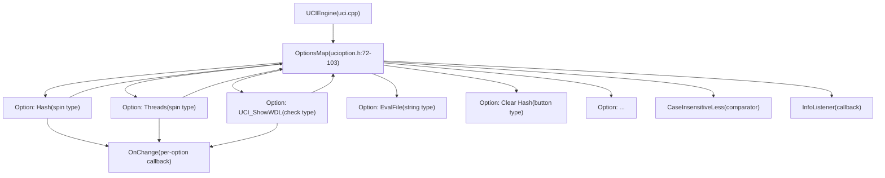
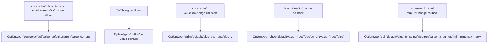
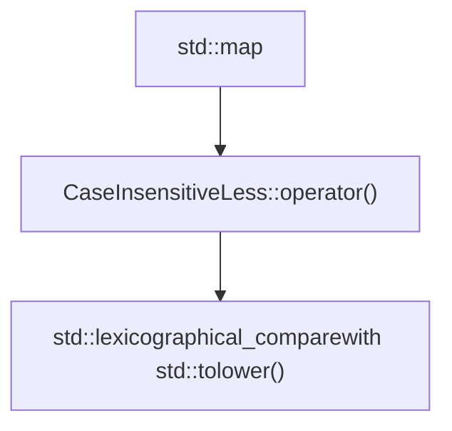
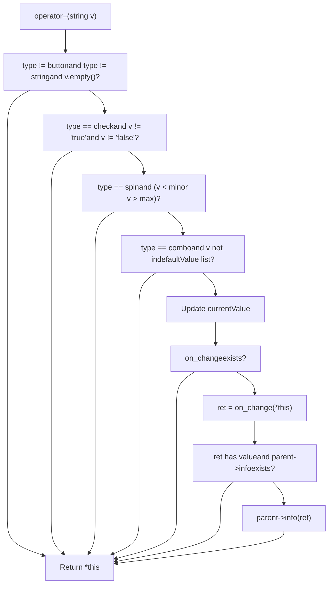
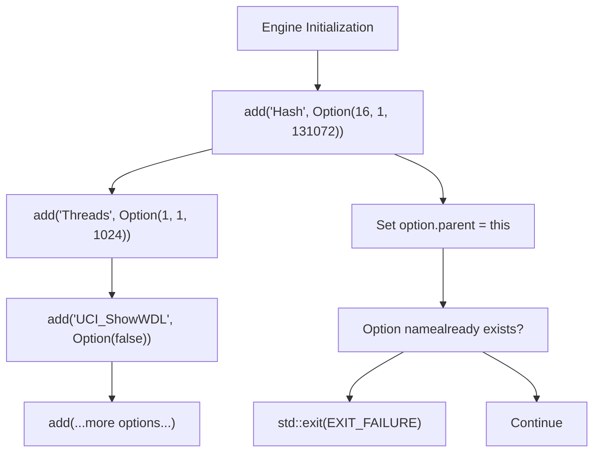

# UCI 选项与配置

相关源文件

-   [src/ucioption.cpp](https://github.com/official-stockfish/Stockfish/blob/c27c1747/src/ucioption.cpp)
-   [src/ucioption.h](https://github.com/official-stockfish/Stockfish/blob/c27c1747/src/ucioption.h)

## 目的与范围

本文档描述了 Stockfish 中的 UCI 选项系统，该系统提供了一个符合通用国际象棋接口 (UCI) 协议的类型安全、可配置的参数系统。该系统允许国际象棋 GUI 和用户通过标准化选项类型（包括整数 (spin)、布尔值 (check)、字符串、按钮和枚举值 (combo)）配置引擎行为。

关于 UCI 协议处理程序如何使用这些选项的信息，请参阅 [UCI 协议处理程序](/official-stockfish/Stockfish/6-external-interface/6.1-uci-protocol-handler)。关于由选项控制的特定引擎功能（线程池、哈希表、NNUE 网络）的详细信息，请参阅 [线程管理与并行搜索](/official-stockfish/Stockfish/4-search-system/4.2-thread-management-and-parallel-search) 和 [NNUE 神经网络评估](/official-stockfish/Stockfish/5-evaluation-system/5.1-nnue-neural-network-evaluation)。

## 系统架构

选项系统由两个主要类组成：`OptionsMap` 作为所有引擎选项的容器，以及 `Option` 代表具有类型安全和验证功能的单个可配置参数。


**来源：** [src/ucioption.h1-106](https://github.com/official-stockfish/Stockfish/blob/c27c1747/src/ucioption.h#L1-L106) [src/ucioption.cpp1-213](https://github.com/official-stockfish/Stockfish/blob/c27c1747/src/ucioption.cpp#L1-L213)

## 选项类型与构造函数

Stockfish 支持五种不同的选项类型，每种类型都有一个专用构造函数来强制执行特定于类型的约束：

| 选项类型 | UCI 协议名称 | C++ 构造函数签名 | 用途 |
| --- | --- | --- | --- |
| **Spin** | `spin` | `Option(int v, int minv, int maxv, OnChange f)` | 具有最小/最大边界的整数值 |
| **Check** | `check` | `Option(bool v, OnChange f)` | 布尔标志 (true/false) |
| **String** | `string` | `Option(const char* v, OnChange f)` | 任意文本值 |
| **Button** | `button` | `Option(OnChange f)` | 触发动作（无值存储） |
| **Combo** | `combo` | `Option(const char* v, const char* cur, OnChange f)` | 列表中的枚举选择 |

### 构造函数细节


**来源：** [src/ucioption.cpp88-128](https://github.com/official-stockfish/Stockfish/blob/c27c1747/src/ucioption.cpp#L88-L128)

### 类型转换运算符

`Option` 类提供隐式转换运算符，以便以类型安全的方式访问选项值：

-   **`operator int()`**：将 `spin` 或 `check` 选项转换为整数（check 返回 0 或 1）
-   **`operator std::string()`**：返回字符串选项值
-   **`operator==(const char*)`**：`combo` 选项的不区分大小写比较
-   **`operator!=(const char*)`**：相等比较的否定

**来源：** [src/ucioption.cpp130-145](https://github.com/official-stockfish/Stockfish/blob/c27c1747/src/ucioption.cpp#L130-L145) [src/ucioption.h49-53](https://github.com/official-stockfish/Stockfish/blob/c27c1747/src/ucioption.h#L49-L53)

## 选项生命周期与修改

**来源：** [src/ucioption.cpp42-59](https://github.com/official-stockfish/Stockfish/blob/c27c1747/src/ucioption.cpp#L42-L59) [src/ucioption.cpp151-185](https://github.com/official-stockfish/Stockfish/blob/c27c1747/src/ucioption.cpp#L151-L185)

## 关键类与接口

### OptionsMap 类

`OptionsMap` 类维护从选项名称到 `Option` 对象的不区分大小写映射。它是所有引擎配置参数的中央注册表。

**数据成员：**

-   `OptionsStore options_map` - 存储所有选项的 `std::map<std::string, Option, CaseInsensitiveLess>`
-   `InfoListener info` - 用于向 GUI 发送信息性消息的回调

**关键方法：**

| 方法 | 签名 | 用途 |
| --- | --- | --- |
| `add()` | `void add(const std::string& name, const Option& option)` | 使用顺序索引注册新选项 |
| `setoption()` | `void setoption(std::istringstream& is)` | 解析并应用 UCI setoption 命令 |
| `operator[]` | `const Option& operator[](const std::string& name) const` | 按名称检索选项（不区分大小写） |
| `count()` | `std::size_t count(const std::string& name) const` | 检查选项是否存在 |
| `add_info_listener()` | `void add_info_listener(InfoListener&& func)` | 设置 GUI 通知回调 |

**来源：** [src/ucioption.h72-103](https://github.com/official-stockfish/Stockfish/blob/c27c1747/src/ucioption.h#L72-L103) [src/ucioption.cpp40-86](https://github.com/official-stockfish/Stockfish/blob/c27c1747/src/ucioption.cpp#L40-L86)

### Option 类

`Option` 类代表具有类型信息、验证和更改通知的单个可配置参数。

**数据成员：**

```
std::string       defaultValue   // 原始默认值
std::string       currentValue   // 当前活动值
std::string       type           // UCI 类型："spin", "check", "string", "button", "combo"
int               min, max       // 用于 spin 选项
size_t            idx            // 打印时的插入顺序
OnChange          on_change      // 可选回调函数
const OptionsMap* parent         // 指向包含映射的反向指针
```
**回调类型：**

```
using OnChange = std::function<std::optional<std::string>(const Option&)>;
```
当选项值更改时调用 `OnChange` 回调。它接收修改后的 `Option` 对象，并可能返回一个可选的消息字符串，该字符串将通过 `InfoListener` 转发到 GUI。

**来源：** [src/ucioption.h38-70](https://github.com/official-stockfish/Stockfish/blob/c27c1747/src/ucioption.h#L38-L70) [src/ucioption.cpp88-185](https://github.com/official-stockfish/Stockfish/blob/c27c1747/src/ucioption.cpp#L88-L185)

### CaseInsensitiveLess 比较器


`CaseInsensitiveLess` 结构体为选项映射提供不区分大小写的比较运算符，确保像 "Hash"、"hash" 和 "HASH" 这样的选项名称根据 UCI 协议要求被视为等效。

**实现：**

-   使用带有 lambda 的 `std::lexicographical_compare()`，对每个字符应用 `std::tolower()`
-   在 `std::map` 容器中启用不区分大小写的键查找

**来源：** [src/ucioption.h31-33](https://github.com/official-stockfish/Stockfish/blob/c27c1747/src/ucioption.h#L31-L33) [src/ucioption.cpp33-38](https://github.com/official-stockfish/Stockfish/blob/c27c1747/src/ucioption.cpp#L33-L38)

## 值验证与约束

赋值运算符 `Option::operator=()` 在接受新值之前实现全面验证：


### 验证规则

1.  **空值检查**：按钮和字符串选项允许空值；其他拒绝
2.  **布尔检查**：Check 选项必须完全是 "true" 或 "false"
3.  **范围检查**：Spin 选项必须在 \[min, max\] 范围内
4.  **Combo 检查**：Combo 选项必须匹配允许值之一（不区分大小写）
5.  **字符串特例**：字符串值 `"<empty>"` 被转换为空字符串 `""`

**来源：** [src/ucioption.cpp151-185](https://github.com/official-stockfish/Stockfish/blob/c27c1747/src/ucioption.cpp#L151-L185)

## UCI 协议集成

### Setoption 命令解析

`OptionsMap::setoption()` 方法解析格式如下的 UCI setoption 命令：

```
setoption name <option_name> value <option_value>
```
选项名称和值都可以包含空格，需要仔细的标记化：

1.  跳过 "name" 令牌
2.  累积令牌直到遇到 "value" 关键字
3.  累积剩余令牌作为值
4.  按名称查找选项（不区分大小写）
5.  通过 `Option::operator=()` 应用值

**来源：** [src/ucioption.cpp42-59](https://github.com/official-stockfish/Stockfish/blob/c27c1747/src/ucioption.cpp#L42-L59)

### 选项输出格式

`operator<<(std::ostream&, const OptionsMap&)` 格式化所有选项以进行 UCI 协议输出，通过 `idx` 字段遵守插入顺序：

```
option name <name> type <type> [default <default>] [min <min>] [max <max>]
```
**特定类型格式化：**

-   **spin**：包括 `default`、`min` 和 `max` 字段
-   **check**：包括 `default` ("true" 或 "false")
-   **string**：包括 `default`（如果为空则为 `"<empty>"`）
-   **combo**：包括 `default` 值（以空格分隔的选择列表）
-   **button**：无附加字段

**来源：** [src/ucioption.cpp187-212](https://github.com/official-stockfish/Stockfish/blob/c27c1747/src/ucioption.cpp#L187-L212)

## 选项注册模式

选项通常在引擎初始化期间使用 `OptionsMap::add()` 方法注册，该方法分配顺序索引以实现确定性输出顺序：


插入顺序通过 `idx` 字段保留，确保跨引擎重启的一致选项输出。尝试注册重复的选项名称会导致程序立即终止。

**来源：** [src/ucioption.cpp68-83](https://github.com/official-stockfish/Stockfish/blob/c27c1747/src/ucioption.cpp#L68-L83)

## 回调机制

选项系统支持两级回调以响应配置更改：

### 每选项 OnChange 回调

每个 `Option` 都可以有一个关联的 `OnChange` 函数，该函数在选项值更改时执行：

**签名：**

```
std::function<std::optional<std::string>(const Option&)>
```
**行为：**

-   在值验证成功且 `currentValue` 更新后调用
-   接收对修改后的 `Option` 对象的 const 引用
-   返回用于 GUI 通知的可选消息字符串
-   如果返回消息且 `parent->info` 存在，则消息转发给 GUI

**常见用例：**

-   Hash 选项更改时调整置换表大小
-   Threads 选项更改时重新初始化线程池
-   EvalFile 更改时重新加载 NNUE 网络
-   按下 Clear Hash 按钮时清除哈希表

### 全局 InfoListener 回调

`OptionsMap` 维护一个 `InfoListener` 回调，该回调接收来自选项更改处理程序的所有消息：

**签名：**

```
std::function<void(std::optional<std::string>)>
```
此回调通常由 UCI 引擎设置，以便通过 UCI info 字符串将信息性消息转发到国际象棋 GUI。

**来源：** [src/ucioption.h40](https://github.com/official-stockfish/Stockfish/blob/c27c1747/src/ucioption.h#L40-L40) [src/ucioption.h74](https://github.com/official-stockfish/Stockfish/blob/c27c1747/src/ucioption.h#L74-L74) [src/ucioption.cpp40](https://github.com/official-stockfish/Stockfish/blob/c27c1747/src/ucioption.cpp#L40-L40) [src/ucioption.cpp176-182](https://github.com/official-stockfish/Stockfish/blob/c27c1747/src/ucioption.cpp#L176-L182)

## 线程安全考量

选项系统**不是线程安全的**。选项修改应仅发生在：

1.  在启动线程之前的引擎初始化期间
2.  引擎空闲时的搜索操作之间
3.  通过主线程处理的 UCI 命令

UCI 协议确保命令的序列化，防止在活动搜索期间并发修改选项。选项通常由工作线程读取，但从未并发修改。

**来源：** 基于图表和线程系统设计的架构理解
