# 构建系统

相关源文件

-   [AUTHORS](https://github.com/official-stockfish/Stockfish/blob/c27c1747/AUTHORS)
-   [src/Makefile](https://github.com/official-stockfish/Stockfish/blob/c27c1747/src/Makefile)

## 目的与范围

本文档描述了 Stockfish 的构建系统，它作为一个 GNU Makefile 实现，位于 [src/Makefile](https://github.com/official-stockfish/Stockfish/blob/c27c1747/src/Makefile)。构建系统负责使用适当的特定于架构的优化来编译引擎、管理配置文件引导优化 (PGO)、下载神经网络文件以及支持多种编译器和平台。关于网络文件本身的信息，请参阅 [NNUE 神经网络评估](/official-stockfish/Stockfish/5.1-nnue-neural-network-evaluation)。关于构建后的测试和基准测试信息，请参阅 [测试与基准测试](/official-stockfish/Stockfish/7.3-testing-and-benchmarking)。

## 构建系统架构

构建系统在 [src/Makefile18-1147](https://github.com/official-stockfish/Stockfish/blob/c27c1747/src/Makefile#L18-L1147) 中分为五个主要部分：

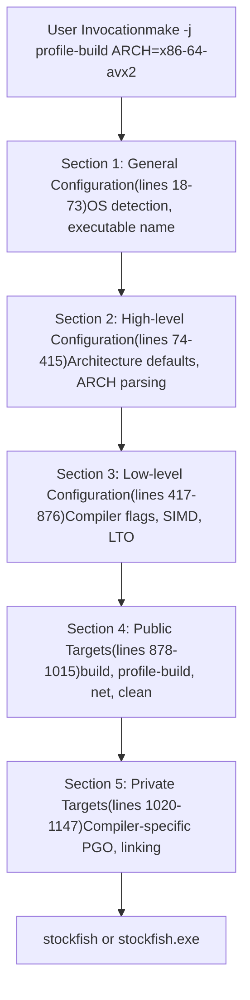
来源： [src/Makefile18-1147](https://github.com/official-stockfish/Stockfish/blob/c27c1747/src/Makefile#L18-L1147)

## 架构选择

构建系统通过 `ARCH` 参数支持广泛的 CPU 架构。如果未指定，`ARCH` 默认为 `native`，它使用 [../scripts/get\_native\_properties.sh](https://github.com/official-stockfish/Stockfish/blob/c27c1747/../scripts/get_native_properties.sh) 自动检测主机 CPU 功能。

### 架构检测与验证

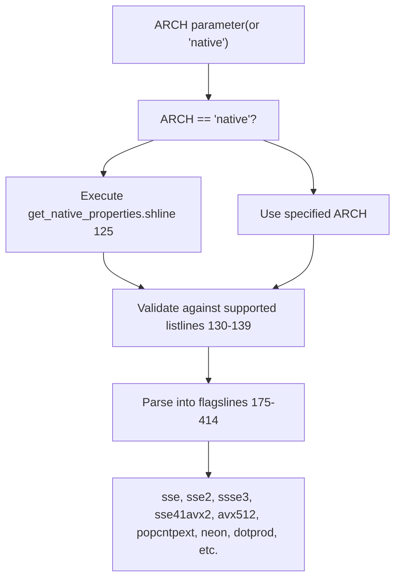
来源： [src/Makefile120-414](https://github.com/official-stockfish/Stockfish/blob/c27c1747/src/Makefile#L120-L414)

### 支持的架构类别

| 类别 | 示例架构 | 关键特性 |
| --- | --- | --- |
| **x86-64** | `x86-64-avx512icl`, `x86-64-avx2`, `x86-64-bmi2` | SSE, AVX, VNNI, PEXT 指令 |
| **x86-32** | `x86-32-sse41-popcnt`, `x86-32-sse2` | 具有各种 SIMD 级别的 32 位 x86 |
| **ARM** | `armv8-dotprod`, `armv7-neon`, `apple-silicon` | NEON, 点积支持 |
| **PowerPC** | `ppc-64-vsx`, `ppc-64-altivec` | Altivec, VSX SIMD |
| **其他** | `riscv64`, `loongarch64-lasx`, `e2k` | 各种其他架构 |

来源： [src/Makefile130-414](https://github.com/official-stockfish/Stockfish/blob/c27c1747/src/Makefile#L130-L414) [src/Makefile898-930](https://github.com/official-stockfish/Stockfish/blob/c27c1747/src/Makefile#L898-L930)

### 架构到标志的映射

Makefile 使用条件逻辑将架构规范转换为编译器标志：

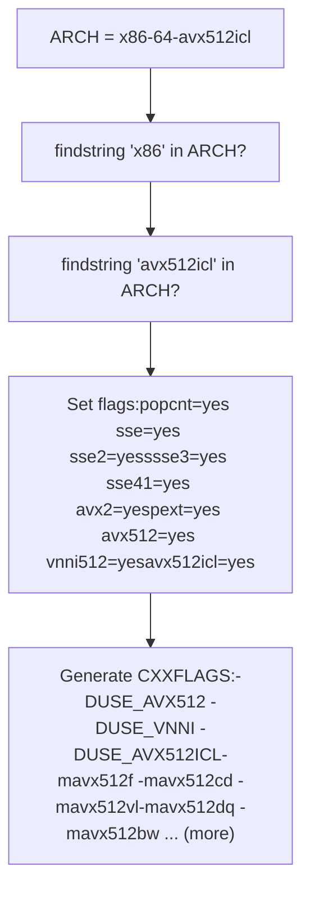
来源： [src/Makefile283-294](https://github.com/official-stockfish/Stockfish/blob/c27c1747/src/Makefile#L283-L294) [src/Makefile736-741](https://github.com/official-stockfish/Stockfish/blob/c27c1747/src/Makefile#L736-L741)

## 编译器配置

构建系统通过 `COMP` 参数支持多种编译器，默认为 `gcc`。也可以使用 `COMPCXX` 直接覆盖编译器。

### 编译器选择流程

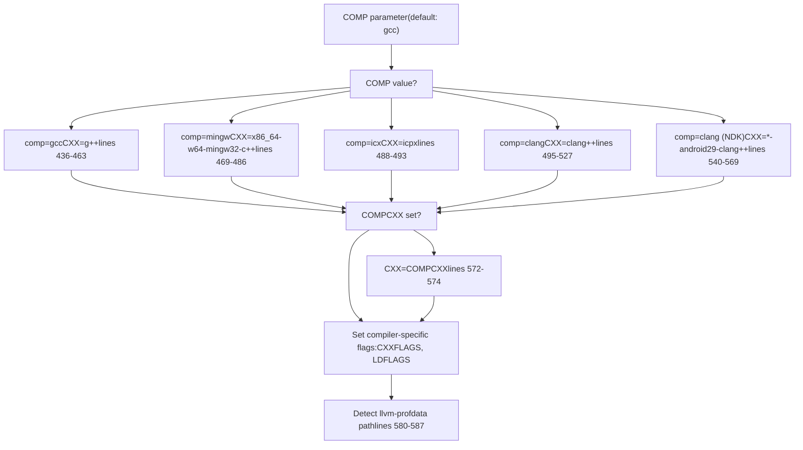
来源： [src/Makefile432-587](https://github.com/official-stockfish/Stockfish/blob/c27c1747/src/Makefile#L432-L587)

### 编译器特定标志

每个编译器都有特定的警告标志和优化设置：

| 编译器 | 关键标志 |
| --- | --- |
| **gcc** | `-pedantic -Wextra -Wshadow -Wmissing-declarations -Wstack-usage=128000` |
| **clang** | `-pedantic -Wextra -Wshadow -Wmissing-prototypes -Wconditional-uninitialized` |
| **icx** | `--intel -pedantic -Wextra -Wshadow -Wmissing-prototypes -Wabi -Wdeprecated` |
| **mingw** | `-pedantic -Wextra -Wshadow -Wmissing-declarations` |

来源： [src/Makefile439](https://github.com/official-stockfish/Stockfish/blob/c27c1747/src/Makefile#L439-L439) [src/Makefile485](https://github.com/official-stockfish/Stockfish/blob/c27c1747/src/Makefile#L485-L485) [src/Makefile491-492](https://github.com/official-stockfish/Stockfish/blob/c27c1747/src/Makefile#L491-L492) [src/Makefile502-503](https://github.com/official-stockfish/Stockfish/blob/c27c1747/src/Makefile#L502-L503)

## 构建目标

### 主要构建目标

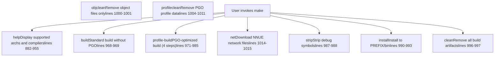
来源： [src/Makefile882-1015](https://github.com/official-stockfish/Stockfish/blob/c27c1747/src/Makefile#L882-L1015)

### 构建目标依赖

构建过程有几个依赖链：

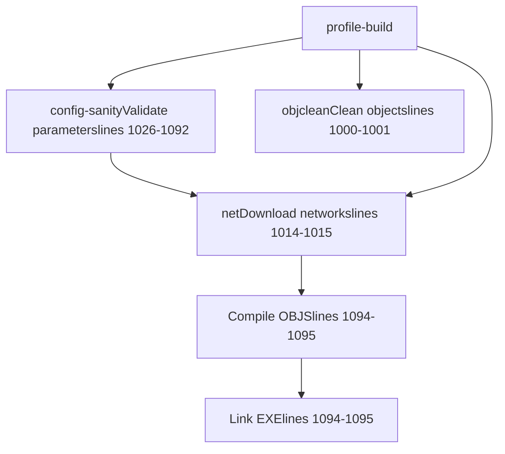
来源： [src/Makefile968-985](https://github.com/official-stockfish/Stockfish/blob/c27c1747/src/Makefile#L968-L985) [src/Makefile1026-1092](https://github.com/official-stockfish/Stockfish/blob/c27c1747/src/Makefile#L1026-L1092)

## 配置文件引导优化 (PGO)

`profile-build` 目标实现了四个步骤的 PGO 工作流，显著提高了性能：

### PGO 工作流

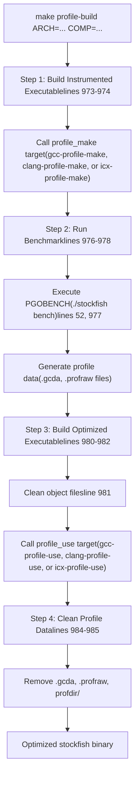
来源： [src/Makefile971-985](https://github.com/official-stockfish/Stockfish/blob/c27c1747/src/Makefile#L971-L985)

### 编译器特定的 PGO 实现

不同的编译器使用不同的 PGO 机制：

**GCC Profile Targets** ([src/Makefile1114-1127](https://github.com/official-stockfish/Stockfish/blob/c27c1747/src/Makefile#L1114-L1127))：

-   `gcc-profile-make`：使用 `-fprofile-generate=profdir` 编译并链接 `-lgcov`
-   `gcc-profile-use`：使用 `-fprofile-use=profdir -fno-peel-loops -fno-tracer` 编译并链接 `-lgcov`

**Clang Profile Targets** ([src/Makefile1101-1112](https://github.com/official-stockfish/Stockfish/blob/c27c1747/src/Makefile#L1101-L1112))：

-   `clang-profile-make`：使用 `-fprofile-generate` 编译
-   `clang-profile-use`：使用 `llvm-profdata merge` 合并 `.profraw` 文件，然后使用 `-fprofile-use=stockfish.profdata` 编译

**ICX Profile Targets** ([src/Makefile1129-1140](https://github.com/official-stockfish/Stockfish/blob/c27c1747/src/Makefile#L1129-L1140))：

-   `icx-profile-make`：使用 `-fprofile-instr-generate` 编译
-   `icx-profile-use`：使用 `llvm-profdata merge` 合并 `.profraw` 文件，然后使用 `-fprofile-instr-use=stockfish.profdata` 编译

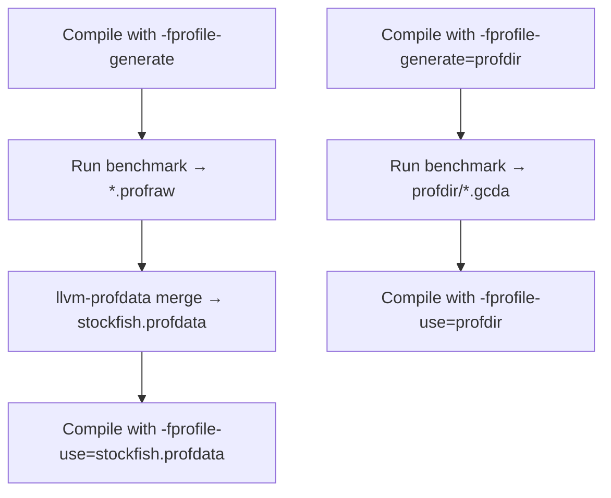
来源： [src/Makefile589-611](https://github.com/official-stockfish/Stockfish/blob/c27c1747/src/Makefile#L589-L611) [src/Makefile1101-1140](https://github.com/official-stockfish/Stockfish/blob/c27c1747/src/Makefile#L1101-L1140)

## SIMD 指令集配置

构建系统根据选定的架构配置 SIMD 指令集。这些会被转换为预处理器定义和编译器标志。

### SIMD 标志变量

Makefile 使用布尔变量来跟踪启用的指令集：

| 变量 | 预处理器定义 | 编译器标志 | 描述 |
| --- | --- | --- | --- |
| `sse` | N/A | `-msse` | 流式 SIMD 扩展 |
| `sse2` | `-DUSE_SSE2` | `-msse2` | SSE2 指令 |
| `ssse3` | `-DUSE_SSSE3` | `-mssse3` | 补充 SSE3 |
| `sse41` | `-DUSE_SSE41` | `-msse4.1` | SSE 4.1 指令 |
| `avx2` | `-DUSE_AVX2` | `-mavx2 -mbmi` | 高级矢量扩展 2 |
| `avxvnni` | `-DUSE_VNNI -DUSE_AVXVNNI` | `-mavxvnni` | AVX 矢量神经网络指令 |
| `avx512` | `-DUSE_AVX512` | `-mavx512f -mavx512bw -mavx512dq -mavx512vl` | AVX-512 基础 |
| `vnni512` | `-DUSE_VNNI` | `-mavx512vnni` (+ avx512 flags) | AVX-512 VNNI |
| `neon` | `-DUSE_NEON=<arm_version>` | `-mfpu=neon` (ARM32) | ARM NEON SIMD |
| `dotprod` | `-DUSE_NEON_DOTPROD` | `-march=armv8.2-a+dotprod` | ARM 点积 |
| `pext` | `-DUSE_PEXT` | `-mbmi2` | 并行位提取 |
| `popcnt` | `-DUSE_POPCNT` | `-mpopcnt` | 种群计数 (Population count) |

来源： [src/Makefile707-817](https://github.com/official-stockfish/Stockfish/blob/c27c1747/src/Makefile#L707-L817)

### SIMD 配置流程

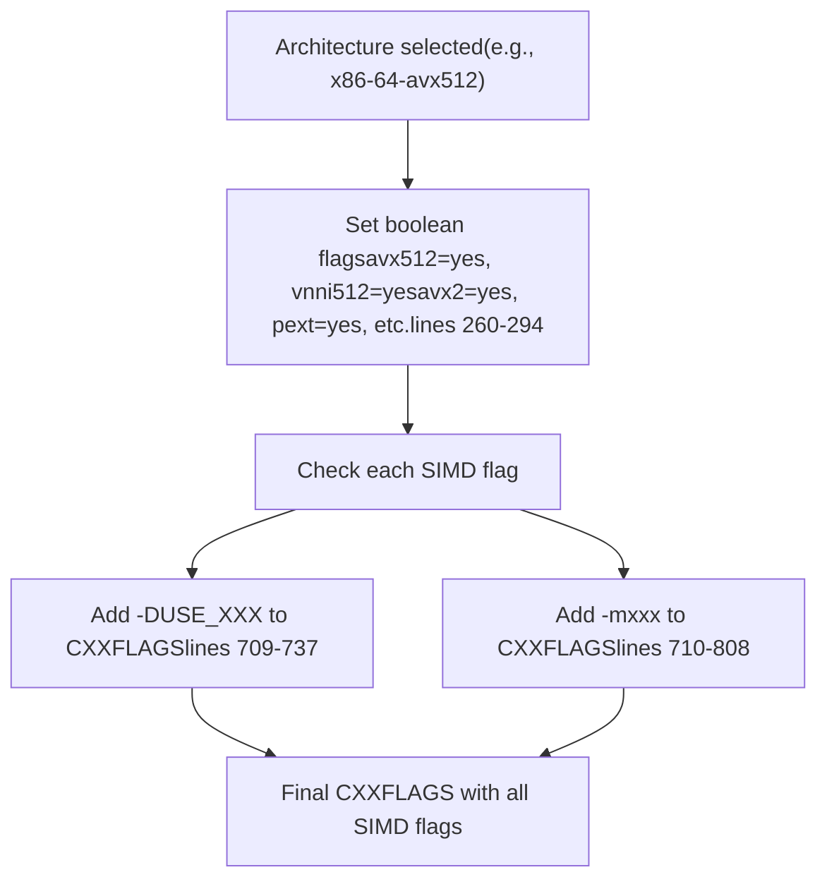
来源： [src/Makefile260-294](https://github.com/official-stockfish/Stockfish/blob/c27c1747/src/Makefile#L260-L294) [src/Makefile707-817](https://github.com/official-stockfish/Stockfish/blob/c27c1747/src/Makefile#L707-L817)

## 网络文件管理

构建系统使用 `net` 目标自动下载所需的 NNUE 神经网络文件。

### 网络下载机制

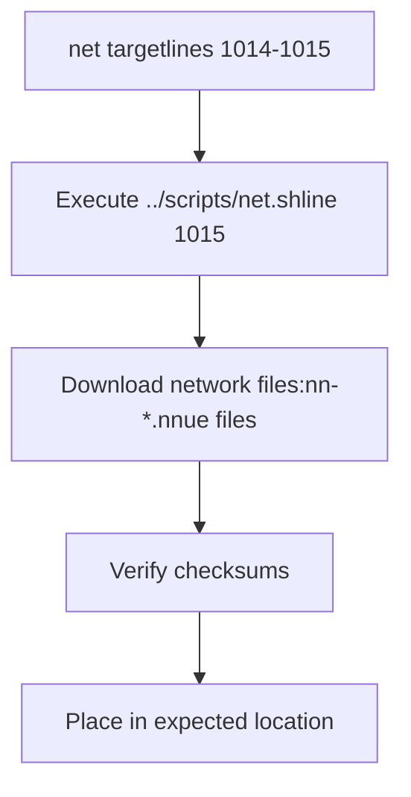
`net` 目标是大多数构建操作的先决条件，确保编译前网络文件存在。它被以下目标调用：

-   `build` 目标 (行 968)
-   `profile-build` 目标 (行 971)
-   `config-sanity` 目标 (行 1026)
-   `analyze` 目标 (行 965)

来源： [src/Makefile1014-1015](https://github.com/official-stockfish/Stockfish/blob/c27c1747/src/Makefile#L1014-L1015) [src/Makefile968-971](https://github.com/official-stockfish/Stockfish/blob/c27c1747/src/Makefile#L968-L971)

## 配置选项

构建系统支持几个修改构建行为的高级配置标志：

### 配置变量

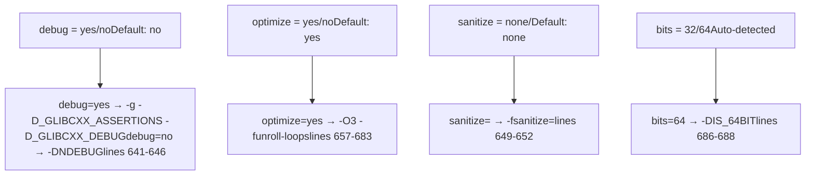
来源： [src/Makefile141-165](https://github.com/official-stockfish/Stockfish/blob/c27c1747/src/Makefile#L141-L165) [src/Makefile640-688](https://github.com/official-stockfish/Stockfish/blob/c27c1747/src/Makefile#L640-L688)

### 配置验证

`config-sanity` 目标在构建前验证所有配置参数：

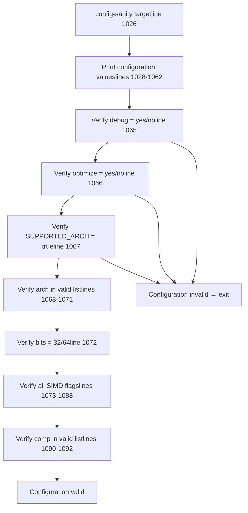
来源： [src/Makefile1026-1092](https://github.com/official-stockfish/Stockfish/blob/c27c1747/src/Makefile#L1026-L1092)

## 链接时优化 (LTO)

当 `optimize=yes` 且 `debug=no` 时，构建系统为支持的编译器启用链接时优化 (LTO)：

### LTO 配置

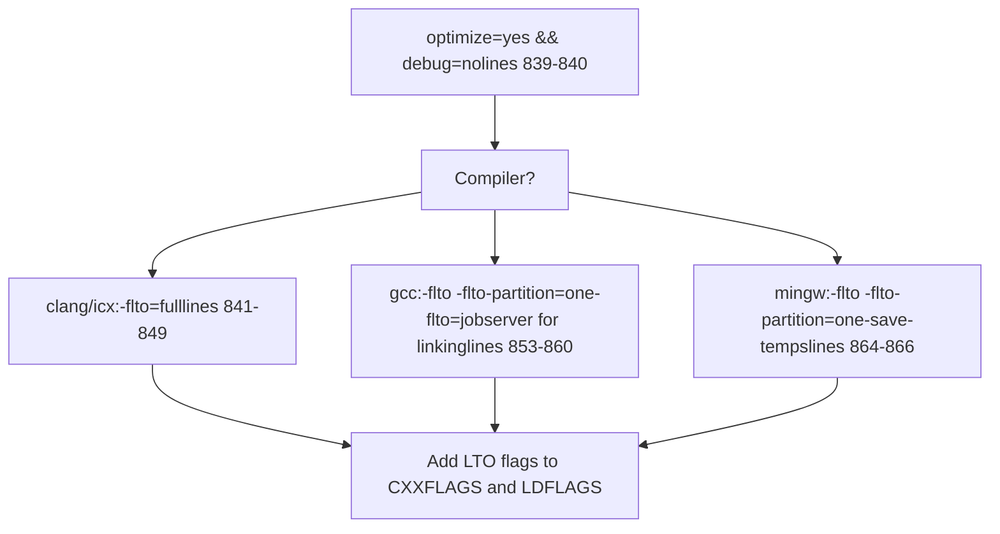
对于 GCC，`-flto=jobserver` 标志允许在链接阶段使用 make jobserver 进行并行 LTO 编译，从而高效利用多核。

来源： [src/Makefile836-869](https://github.com/official-stockfish/Stockfish/blob/c27c1747/src/Makefile#L836-L869)

## 平台特定处理

构建系统检测操作系统并应用特定于平台的配置：

### 操作系统检测与配置

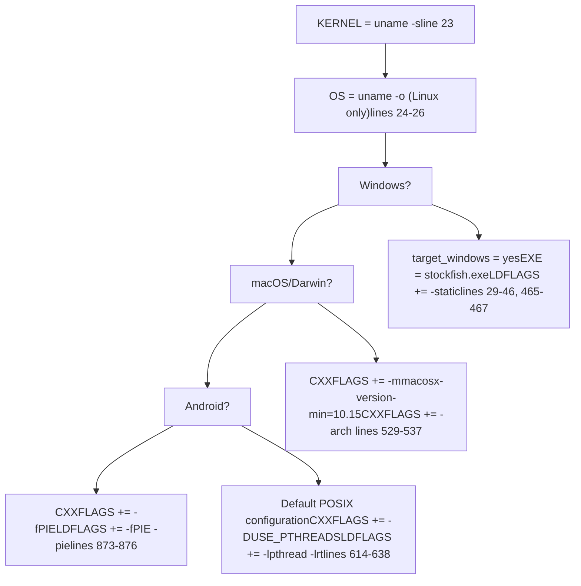
### 线程配置

除了使用 MinGW 的 Windows 外，构建系统在所有平台上都使用 POSIX 线程 (pthreads)：

-   **非 MinGW 编译器**：添加 `-DUSE_PTHREADS` 并链接 `-lpthread` (行 614-638)
-   **MinGW**：使用 Windows 线程（无 pthread 标志）
-   **Android**：Bionic C 库包含 pthread，因此无需显式链接 (行 617-637)

来源： [src/Makefile23-46](https://github.com/official-stockfish/Stockfish/blob/c27c1747/src/Makefile#L23-L46) [src/Makefile465-467](https://github.com/official-stockfish/Stockfish/blob/c27c1747/src/Makefile#L465-L467) [src/Makefile529-537](https://github.com/official-stockfish/Stockfish/blob/c27c1747/src/Makefile#L529-L537) [src/Makefile614-638](https://github.com/official-stockfish/Stockfish/blob/c27c1747/src/Makefile#L614-L638) [src/Makefile873-876](https://github.com/official-stockfish/Stockfish/blob/c27c1747/src/Makefile#L873-L876)

## 源文件与依赖

构建系统跟踪源文件并自动生成依赖关系：

### 源文件管理

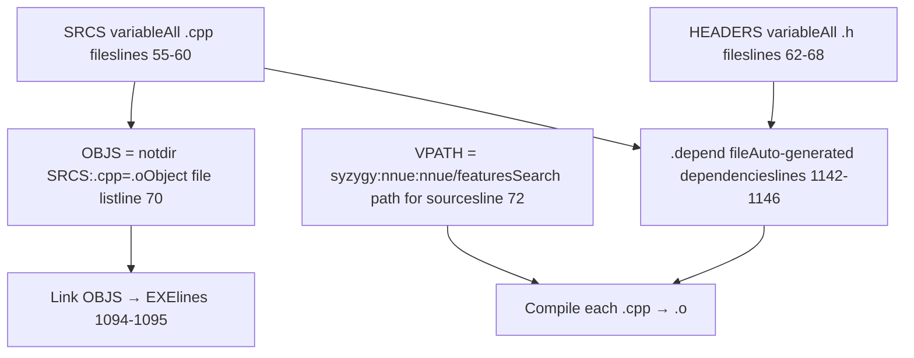
`.depend` 文件使用 `$(CXX) $(DEPENDFLAGS) -MM $(SRCS)` 自动重新生成，并且如果目标不是清理操作，则会包含在 Makefile 中。

来源： [src/Makefile54-72](https://github.com/official-stockfish/Stockfish/blob/c27c1747/src/Makefile#L54-L72) [src/Makefile1094-1095](https://github.com/official-stockfish/Stockfish/blob/c27c1747/src/Makefile#L1094-L1095) [src/Makefile1142-1147](https://github.com/official-stockfish/Stockfish/blob/c27c1747/src/Makefile#L1142-L1147)

## 版本信息

构建系统使用 Git 将版本信息嵌入到二进制文件中：

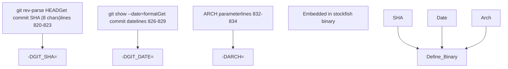
`misc.o` 目标在每次构建时都被强制重新编译 (行 1098-1099)，以确保版本信息始终是最新的。

来源： [src/Makefile819-834](https://github.com/official-stockfish/Stockfish/blob/c27c1747/src/Makefile#L819-L834) [src/Makefile1098-1099](https://github.com/official-stockfish/Stockfish/blob/c27c1747/src/Makefile#L1098-L1099)

## 示例构建命令

常见构建调用及其效果：

| 命令 | 描述 |
| --- | --- |
| `make -j profile-build ARCH=x86-64-avx2` | 为支持 AVX2 的 CPU 使用 PGO 构建 |
| `make -j profile-build ARCH=x86-64-sse41-popcnt` | 为较旧的 x86-64 CPU 使用 PGO 构建 |
| `make -j build ARCH=armv8-dotprod COMP=clang` | 使用 clang 为支持点积的 ARM 构建 |
| `make -j build ARCH=apple-silicon` | 为 Apple Silicon Mac 构建 |
| `make build ARCH=x86-64 debug=yes sanitize=address` | 使用地址消毒剂进行调试构建 |
| `make net` | 仅下载神经网络文件 |
| `make clean` | 删除所有构建产物 |

来源： [src/Makefile940-951](https://github.com/official-stockfish/Stockfish/blob/c27c1747/src/Makefile#L940-L951)
