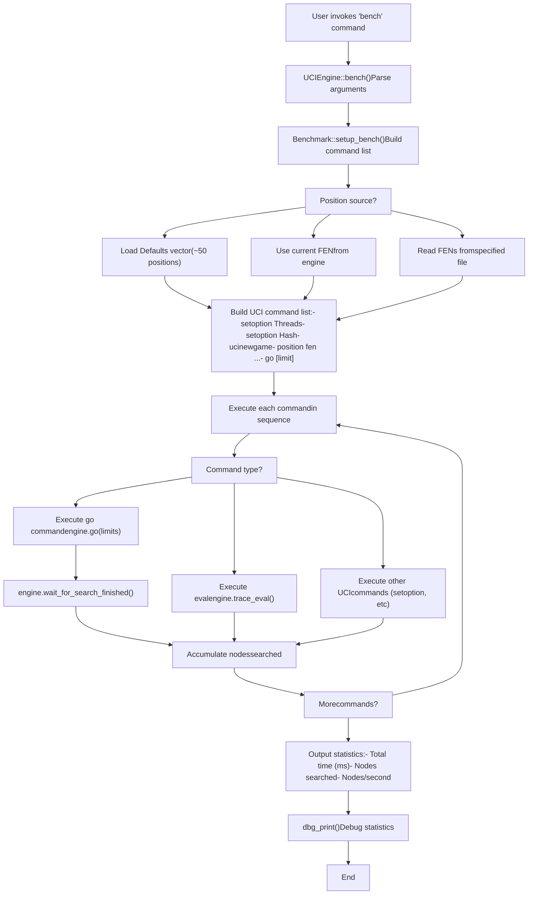
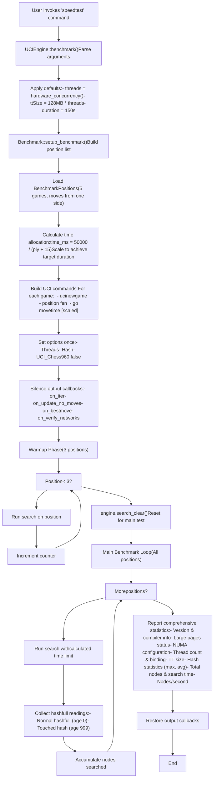
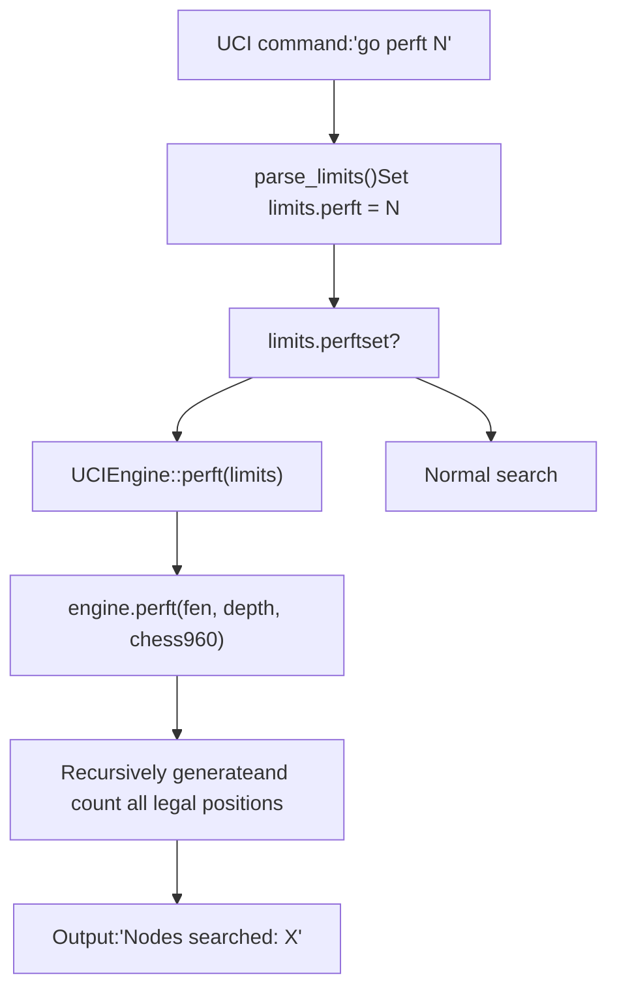
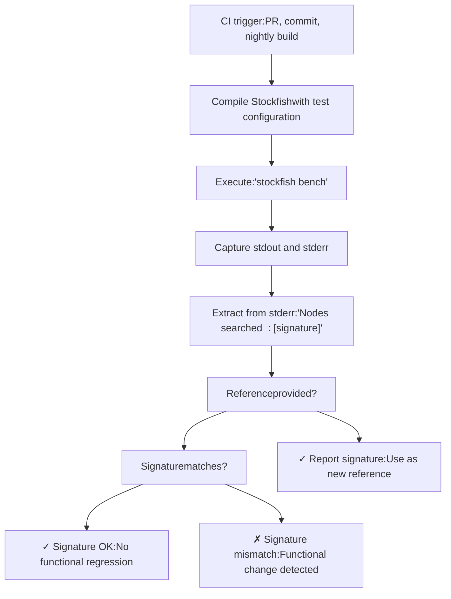
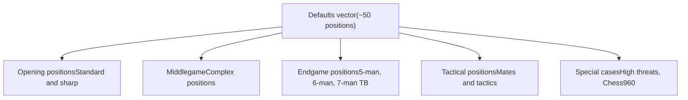
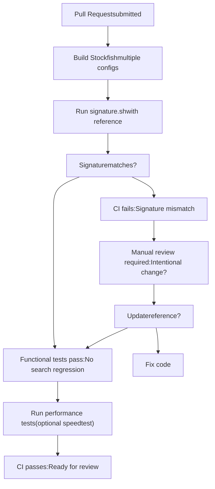

# 测试与基准测试

相关源文件

-   [src/benchmark.cpp](https://github.com/official-stockfish/Stockfish/blob/c27c1747/src/benchmark.cpp)
-   [src/main.cpp](https://github.com/official-stockfish/Stockfish/blob/c27c1747/src/main.cpp)
-   [src/uci.cpp](https://github.com/official-stockfish/Stockfish/blob/c27c1747/src/uci.cpp)

## 目的与范围

本文档描述了 Stockfish 的测试和基准测试基础设施，包括用于性能测量的 `bench` 和 `speedtest` 命令，用于着法生成验证的 `perft` 命令，以及用于持续集成中的签名验证系统。关于构建系统和编译选项的信息，请参阅 [构建系统](/official-stockfish/Stockfish/7.1-build-system)。关于实用函数和调试支持，请参阅 [实用程序和支持函数](/official-stockfish/Stockfish/7.2-utilities-and-support-functions)。

## 概述

Stockfish 提供了多种测试和基准测试工具来测量性能、验证正确性并检测回归：

-   **bench**：一个快速、可配置的基准测试，在一组局面上运行搜索
-   **speedtest**：一个全面的、标准化的基准测试，用于一致的性能比较
-   **perft**：通过在指定深度计数节点来进行着法生成验证
-   **签名验证**：CI 中用于检测回归的确定性节点计数

所有基准测试命令都通过 UCI 接口调用，并作为标准 UCI 协议的扩展来实现。

来源： [src/uci.cpp143-146](https://github.com/official-stockfish/Stockfish/blob/c27c1747/src/uci.cpp#L143-L146) [src/uci.cpp230-297](https://github.com/official-stockfish/Stockfish/blob/c27c1747/src/uci.cpp#L230-L297) [src/uci.cpp299-461](https://github.com/official-stockfish/Stockfish/blob/c27c1747/src/uci.cpp#L299-L461) [src/uci.cpp468-472](https://github.com/official-stockfish/Stockfish/blob/c27c1747/src/uci.cpp#L468-L472)

## bench 命令

### 用途与用法

`bench` 命令提供了一个灵活的基准测试工具，可以针对不同的测试场景进行定制。它是生成 CI 回归测试中使用的“签名”的主要工具。

**语法**：

```
bench [ttSize] [threads] [limit] [fenFile] [limitType]
```
**参数**（均为可选，带有默认值）：

-   `ttSize`：哈希表大小，单位 MB（默认：16）
-   `threads`：搜索线程数（默认：1）
-   `limit`：搜索限制值（默认：13）
-   `fenFile`：局面来源 - "default"、"current" 或文件路径（默认："default"）
-   `limitType`：限制类型 - "depth"、"nodes"、"movetime"、"perft" 或 "eval"（默认："depth"）

**示例**：

```
bench                            # 搜索默认局面到深度 13
bench 64 1 15                    # 使用 64 MB 哈希搜索默认局面到深度 15
bench 64 1 100000 default nodes  # 对每个局面搜索 100K 节点
bench 64 4 5000 current movetime # 使用 4 个线程对当前局面搜索 5 秒
bench 16 1 5 custom.fen perft    # 对 custom.fen 中的局面运行 perft 5
```
来源： [src/benchmark.cpp379-390](https://github.com/official-stockfish/Stockfish/blob/c27c1747/src/benchmark.cpp#L379-L390) [src/uci.cpp230-244](https://github.com/official-stockfish/Stockfish/blob/c27c1747/src/uci.cpp#L230-L244)

### 执行流程


来源： [src/uci.cpp230-297](https://github.com/official-stockfish/Stockfish/blob/c27c1747/src/uci.cpp#L230-L297) [src/benchmark.cpp390-442](https://github.com/official-stockfish/Stockfish/blob/c27c1747/src/benchmark.cpp#L390-L442)

### 实现细节

`bench` 命令在 `UCIEngine::bench()` 中实现，并使用 `Benchmark::setup_bench()` 构建 UCI 命令列表：

| 组件 | 文件位置 | 职责 |
| --- | --- | --- |
| 命令处理程序 | [src/uci.cpp230-297](https://github.com/official-stockfish/Stockfish/blob/c27c1747/src/uci.cpp#L230-L297) | 解析参数，执行命令，报告统计 |
| 设置函数 | [src/benchmark.cpp390-442](https://github.com/official-stockfish/Stockfish/blob/c27c1747/src/benchmark.cpp#L390-L442) | 根据参数构建 UCI 命令列表 |
| 默认局面 | [src/benchmark.cpp30-96](https://github.com/official-stockfish/Stockfish/blob/c27c1747/src/benchmark.cpp#L30-L96) | 标准局面集（约 50 个局面） |
| 节点跟踪 | [src/uci.cpp232-270](https://github.com/official-stockfish/Stockfish/blob/c27c1747/src/uci.cpp#L232-L270) | 通过回调捕获搜索的节点 |

节点计数通过设置自定义 `on_update_full` 回调来跟踪，该回调从搜索期间的 `Engine::InfoFull` 中捕获 `nodes` 字段。

来源： [src/uci.cpp230-297](https://github.com/official-stockfish/Stockfish/blob/c27c1747/src/uci.cpp#L230-L297) [src/benchmark.cpp390-442](https://github.com/official-stockfish/Stockfish/blob/c27c1747/src/benchmark.cpp#L390-L442)

## speedtest 命令

### 用途与设计

`speedtest` 命令（内部也称为 `benchmark`）提供了一个标准化的、综合的基准测试，旨在进行一致的性能比较。与 `bench` 不同，它使用一组固定的游戏局面和现实的时间分配，以更好地模拟实际对局条件。

**语法**：

```
speedtest [threads] [ttSize] [duration]
```
**参数**（均为可选，带有默认值）：

-   `threads`：线程数（默认：硬件并发数）
-   `ttSize`：哈希大小，单位 MB（默认：每线程 128 MB）
-   `duration`：总基准测试时长，单位秒（默认：150）

**与 bench 的主要区别**：

-   使用现实的游戏局面（5 局完整对局）
-   时间分配随层数变化，以模拟真实对局条件
-   包括预热阶段（3 个局面）以保证缓存稳定性
-   收集详细的系统信息（NUMA、线程绑定、hashfull 统计）
-   在执行期间静默大多数输出，以获得更清晰的结果
-   更适合性能回归检测

来源： [src/uci.cpp299-461](https://github.com/official-stockfish/Stockfish/blob/c27c1747/src/uci.cpp#L299-L461) [src/benchmark.cpp444-514](https://github.com/official-stockfish/Stockfish/blob/c27c1747/src/benchmark.cpp#L444-L514)

### 执行流程与统计


来源： [src/uci.cpp299-461](https://github.com/official-stockfish/Stockfish/blob/c27c1747/src/uci.cpp#L299-L461) [src/benchmark.cpp444-514](https://github.com/official-stockfish/Stockfish/blob/c27c1747/src/benchmark.cpp#L444-L514)

### 时间分配模型

`speedtest` 命令使用基于层数的时间分配公式来模拟现实对局条件：

**公式**：`time_ms = 50000 / (ply + 15)`

选择此公式是为了匹配典型的 LTC（长时间控制）对局时间分布：

-   第 10 回合获得约 2000ms
-   开局着法获得更多时间
-   后中局/残局着法获得较少时间

然后缩放总时间以达到所需的基准测试时长：

```
scale_factor = (desired_duration_s * 1000) / total_calculated_time
final_time_ms = calculated_time_ms * scale_factor
```
来源： [src/benchmark.cpp474-496](https://github.com/official-stockfish/Stockfish/blob/c27c1747/src/benchmark.cpp#L474-L496)

### 收集的统计信息

`speedtest` 命令收集全面的性能指标：

| 指标 | 描述 | 用途 |
| --- | --- | --- |
| **搜索的总节点数** | 所有局面的累积节点 | 主要性能指标 |
| **总搜索时间** | 搜索花费的毫秒数（不包括设置） | 用于 nps 计算 |
| **节点/秒** | `(nodes * 1000) / time_ms` | 标准性能指标 |
| **Hashfull (normal)** | 最大和平均 TT 填充率 (age 0) | 内存利用率 |
| **Hashfull (touched)** | 最大和平均 touched hash (age 999) | 哈希替换有效性 |
| **版本信息** | 引擎版本字符串 | 可复现性 |
| **编译器信息** | 编译器和优化标志 | 构建验证 |
| **线程绑定** | NUMA 节点分配 | 硬件利用率 |

来源： [src/uci.cpp369-458](https://github.com/official-stockfish/Stockfish/blob/c27c1747/src/uci.cpp#L369-L458)

## Perft 测试

### 用途与实现

`perft`（性能测试）命令通过计数指定深度的所有节点来验证着法生成的正确性。它主要用于调试和确保着法生成器生成正确数量的合法局面。

**调用**：`go perft [depth]`

Perft 命令由 `UCIEngine::perft()` 处理，它使用当前局面和指定深度调用 `Engine::perft()`。


来源： [src/uci.cpp224-228](https://github.com/official-stockfish/Stockfish/blob/c27c1747/src/uci.cpp#L224-L228) [src/uci.cpp468-472](https://github.com/official-stockfish/Stockfish/blob/c27c1747/src/uci.cpp#L468-L472)

### 测试中的用法

Perft 通常用于以下场景：

1.  **着法生成验证**：验证着法生成器是否生成预期数量的局面
2.  **调试**：识别着法生成与参考实现不同的特定局面
3.  **性能分析**：测量原始着法生成速度（尽管搜索基准测试与引擎强度更相关）

起始局面的 Perft 结果示例：

```
go perft 1  -> 20 nodes    (20 legal moves)
go perft 2  -> 400 nodes   (20 moves * 20 responses average)
go perft 3  -> 8902 nodes
go perft 4  -> 197281 nodes
go perft 5  -> 4865609 nodes
go perft 6  -> 119060324 nodes
```
来源： [src/uci.cpp468-472](https://github.com/official-stockfish/Stockfish/blob/c27c1747/src/uci.cpp#L468-L472)

## 签名验证

### 概述与用途

“签名”是使用默认参数运行 `bench` 产生的确定性节点计数。它充当指纹，用于检测引擎版本之间的功能变更。任何影响搜索行为（评估、着法排序、剪枝等）的更改都会改变签名，使其成为有效的回归检测工具。

**标准签名命令**：`bench`（使用默认值：16 MB 哈希，1 线程，深度 13）

来源： [tests/signature.sh1-41](https://github.com/official-stockfish/Stockfish/blob/c27c1747/tests/signature.sh#L1-L41)

### 签名验证过程


来源： [tests/signature.sh1-41](https://github.com/official-stockfish/Stockfish/blob/c27c1747/tests/signature.sh#L1-L41)

### 实现

签名验证在 `tests/signature.sh` 中实现：

**关键组件**：

| 行范围 | 功能 |
| --- | --- |
| [tests/signature.sh21-22](https://github.com/official-stockfish/Stockfish/blob/c27c1747/tests/signature.sh#L21-L22) | 执行 bench 并捕获输出 |
| [tests/signature.sh22](https://github.com/official-stockfish/Stockfish/blob/c27c1747/tests/signature.sh#L22-L22) | 使用 awk 提取签名：`awk '{print $4}'` |
| [tests/signature.sh26-37](https://github.com/official-stockfish/Stockfish/blob/c27c1747/tests/signature.sh#L26-L37) | 如果提供则与参考进行比较 |
| [tests/signature.sh39-40](https://github.com/official-stockfish/Stockfish/blob/c27c1747/tests/signature.sh#L39-L40) | 输出签名以用作参考 |

**使用模式**：

```
# 生成新签名（无验证）
./signature.sh

# 针对参考进行验证
./signature.sh 1234567890

# 匹配时的典型输出
# signature OK: 1234567890

# 不匹配时的典型输出
# signature mismatch: reference 1234567890 obtained: 9876543210
```
来源： [tests/signature.sh1-41](https://github.com/official-stockfish/Stockfish/blob/c27c1747/tests/signature.sh#L1-L41)

### 签名何时更改

当发生以下情况时，签名更改是**预期的**：

-   评估函数被修改
-   搜索启发式被调整
-   着法排序更改
-   剪枝条件被改变
-   任何影响搜索决策的功能性更改

当发生以下情况时，签名更改是**意外的**：

-   仅更改了注释或格式
-   构建系统或配置更改
-   文档更新
-   非功能性重构

当签名合法更改时，新值将成为未来比较的参考。

来源： [tests/signature.sh26-37](https://github.com/official-stockfish/Stockfish/blob/c27c1747/tests/signature.sh#L26-L37)

## 基准测试局面集

### 默认局面 (bench)

`Defaults` 向量包含约 50 个精心挑选的局面，涵盖了多样化的国际象棋场景：


**局面类别**：

| 类别 | 数量（大约） | 示例 | 用途 |
| --- | --- | --- | --- |
| 标准开局 | ~10 | 起始局面，常见开局 | 一般搜索测试 |
| 复杂中局 | ~15 | 多子力战术战斗 | 评估和剪枝压力测试 |
| 残局局面 | ~8 | 5/6/7 子码表局面 | 码表集成测试 |
| 战术谜题 | ~5 | N 步杀，战术打击 | 战术搜索验证 |
| 特殊局面 | ~5 | 高威胁计数，Chess960 | 边缘情况覆盖 |
| 逼和/杀棋 | ~3 | 和棋/被杀局面 | 边界条件测试 |

来源： [src/benchmark.cpp30-96](https://github.com/official-stockfish/Stockfish/blob/c27c1747/src/benchmark.cpp#L30-L96)

### Speedtest 局面 (BenchmarkPositions)

`BenchmarkPositions` 向量包含 5 局完整对局，仅显示一方的着法：

**结构**：

```
Game 1: 59 positions (moves 8-64 for one side)
Game 2: 54 positions (moves 6-57 for one side)
Game 3: 48 positions (moves 8-56 for one side)
Game 4: 46 positions (moves 7-47 for one side)
Game 5: 58 positions (moves 6-64 for one side)

Total: 265 positions
```
**选择标准**：

-   从 LTC（长时间控制）fishtest 对局中人工随机挑选
-   少于 60 回合的对局（侧重于开局到中局）
-   仅一方的着法以避免重复
-   用于现实评估分布的真实对局局面

来源： [src/benchmark.cpp100-372](https://github.com/official-stockfish/Stockfish/blob/c27c1747/src/benchmark.cpp#L100-L372) [src/benchmark.cpp444-514](https://github.com/official-stockfish/Stockfish/blob/c27c1747/src/benchmark.cpp#L444-L514)

### 局面集比较

| 方面 | 默认 (bench) | BenchmarkPositions (speedtest) |
| --- | --- | --- |
| **数量** | ~50 局面 | 265 局面 (5 局) |
| **来源** | 精选测试套件 | 真实对局序列 |
| **多样性** | 最大多样性 | 现实对局流程 |
| **用途** | 快速测试，签名 | 性能基准测试 |
| **时间分配** | 统一（按深度/节点） | 基于层数（现实） |
| **覆盖** | 所有游戏阶段均等 | 更多开局/中局 |

来源： [src/benchmark.cpp30-96](https://github.com/official-stockfish/Stockfish/blob/c27c1747/src/benchmark.cpp#L30-L96) [src/benchmark.cpp100-372](https://github.com/official-stockfish/Stockfish/blob/c27c1747/src/benchmark.cpp#L100-L372)

## 与开发工作流的集成

### 持续集成

签名验证系统与 CI 管道集成以检测回归：


来源： [tests/signature.sh1-41](https://github.com/official-stockfish/Stockfish/blob/c27c1747/tests/signature.sh#L1-L41)

### 开发者使用模式

**快速功能检查**：

```
# 代码更改后，验证是否有意外的搜索更改
./stockfish bench
# 将输出与之前的签名进行比较
```
**性能比较**：

```
# 更改前
./stockfish speedtest > baseline.txt

# 更改后
./stockfish speedtest > modified.txt

# 比较节点/秒
diff baseline.txt modified.txt
```
**调试着法生成**：

```
# 验证着法生成正确性
echo "position startpos" | ./stockfish
# 然后在 UCI 中：go perft 6
# 与已知正确值比较：119060324
```
来源： [src/uci.cpp143-146](https://github.com/official-stockfish/Stockfish/blob/c27c1747/src/uci.cpp#L143-L146) [src/uci.cpp230-297](https://github.com/official-stockfish/Stockfish/blob/c27c1747/src/uci.cpp#L230-L297) [src/uci.cpp299-461](https://github.com/official-stockfish/Stockfish/blob/c27c1747/src/uci.cpp#L299-L461)

## 调试统计

`bench` 和 `speedtest` 都在完成后调用 `dbg_print()` 输出调试统计信息。这些统计信息仅在调试构建中生成，并提供对搜索行为的深入了解：

**调试统计类别**（启用时）：

-   着法生成统计
-   剪枝计数器（富余、razoring、空着等）
-   延伸计数器
-   哈希表统计
-   时间管理决策

调试输出有助于开发人员了解搜索修改对搜索算法不同方面的影响。

来源： [src/uci.cpp288](https://github.com/official-stockfish/Stockfish/blob/c27c1747/src/uci.cpp#L288-L288) [src/uci.cpp422](https://github.com/official-stockfish/Stockfish/blob/c27c1747/src/uci.cpp#L422-L422)
