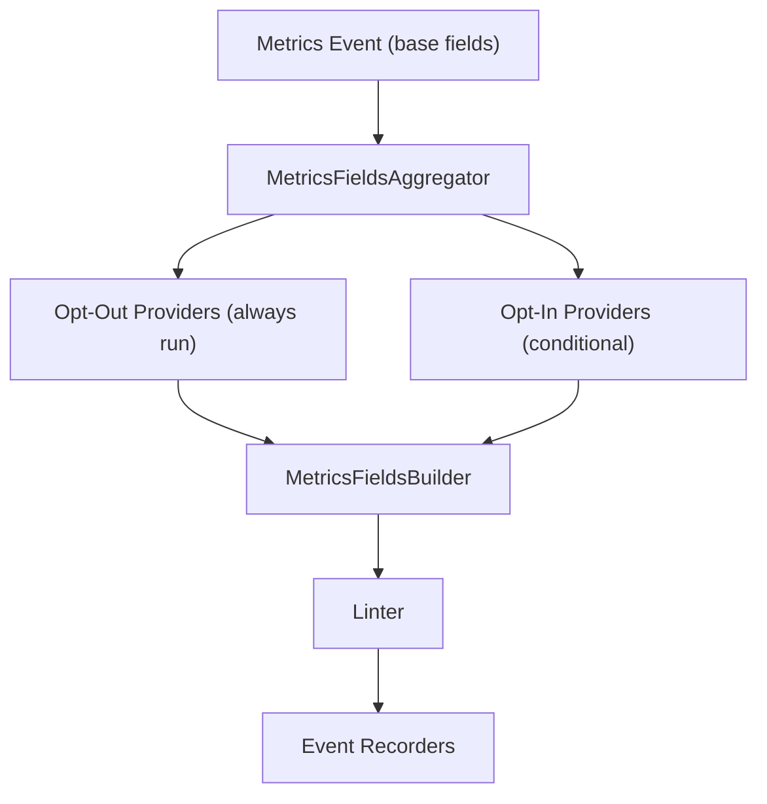
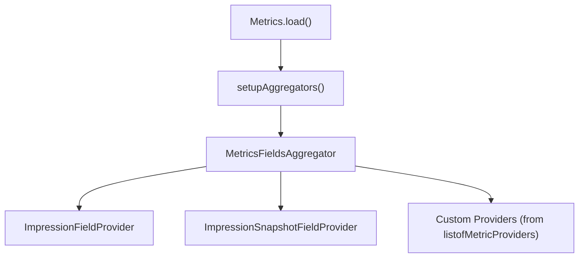
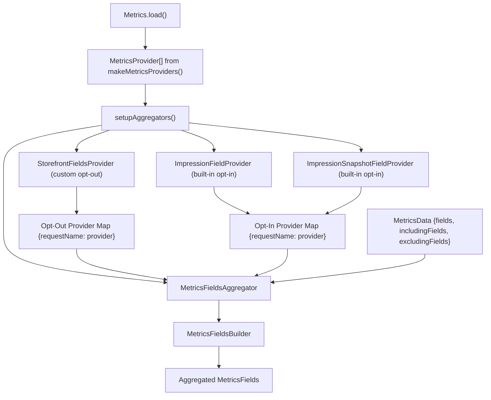

# Metrics Providers

-   [shared/metrics-8/src/impression-provider.ts](https://github.com/Chesszyh/apps.apple.com/blob/279d0c4d/shared/metrics-8/src/impression-provider.ts)
-   [shared/metrics-8/src/impression-snapshot-provider.ts](https://github.com/Chesszyh/apps.apple.com/blob/279d0c4d/shared/metrics-8/src/impression-snapshot-provider.ts)
-   [shared/metrics-8/src/impressions/index.ts](https://github.com/Chesszyh/apps.apple.com/blob/279d0c4d/shared/metrics-8/src/impressions/index.ts)
-   [shared/metrics-8/src/index.ts](https://github.com/Chesszyh/apps.apple.com/blob/279d0c4d/shared/metrics-8/src/index.ts)
-   [src/jet/metrics/providers/StorefrontFieldsProvider.ts](https://github.com/Chesszyh/apps.apple.com/blob/279d0c4d/src/jet/metrics/providers/StorefrontFieldsProvider.ts)
-   [src/jet/metrics/providers/index.ts](https://github.com/Chesszyh/apps.apple.com/blob/279d0c4d/src/jet/metrics/providers/index.ts)

## Purpose and Scope

This document describes the **Metrics Providers** pattern used to inject contextual fields into metrics events. Providers implement a standardized interface for adding data to events as they flow through the metrics pipeline. For information about the overall metrics pipeline architecture, see [Metrics Pipeline](#3.1). For details on how events are recorded after processing, see [Event Recorders](#3.2).

**Sources:** [shared/metrics-8/src/index.ts1-579](https://github.com/Chesszyh/apps.apple.com/blob/279d0c4d/shared/metrics-8/src/index.ts#L1-L579)

---

## Provider Pattern Overview

Metrics providers follow a simple builder pattern where each provider contributes specific fields to metrics events. The `MetricsFieldsProvider` interface from `@jet/engine` defines a single method:

```
interface MetricsFieldsProvider {    addMetricsFields(        builder: MetricsFieldsBuilder,        context: MetricsFieldsContext    ): void;}
```
Providers are aggregated by `MetricsFieldsAggregator`, which orchestrates calling each provider in sequence to build the complete set of fields for an event. This design allows modular, composable addition of contextual data without coupling providers to each other.

### Provider Flow Through Pipeline


**Sources:** [shared/metrics-8/src/index.ts531-555](https://github.com/Chesszyh/apps.apple.com/blob/279d0c4d/shared/metrics-8/src/index.ts#L531-L555)

---

## Provider Types: Opt-In vs Opt-Out

The aggregator supports two categories of providers with different execution semantics:

### Opt-Out Providers

Opt-out providers **always execute** for every metrics event unless explicitly excluded. These are registered with `addOptOutProvider()` and are the default choice for most contextual fields.

```
aggregator.addOptOutProvider(    new StorefrontFieldsProvider(objectGraph),    'storeFrontCountryCode');
```
The second parameter is a **request name** that identifies which field this provider contributes. Events can exclude specific providers by adding the request name to `excludingFields`.

### Opt-In Providers

Opt-in providers **only execute when explicitly requested**. These are registered with `addOptInProvider()` and are used for expensive or conditional data.

```
aggregator.addOptInProvider(    new ImpressionFieldProvider(context),    'impressions');aggregator.addOptInProvider(    new ImpressionSnapshotFieldProvider(context),    'impressionsSnapshot');
```
Events must add the request name to `includingFields` to trigger these providers.

| Provider Type | Execution Model | Use Case | Registration Method |
| --- | --- | --- | --- |
| **Opt-Out** | Always runs unless excluded | Lightweight contextual fields (storefront, locale, etc.) | `addOptOutProvider(provider, requestName)` |
| **Opt-In** | Only runs when requested | Expensive operations (impressions, snapshots) | `addOptInProvider(provider, requestName)` |

**Sources:** [shared/metrics-8/src/index.ts531-555](https://github.com/Chesszyh/apps.apple.com/blob/279d0c4d/shared/metrics-8/src/index.ts#L531-L555) [@jet/engine MetricsFieldsAggregator](https://github.com/Chesszyh/apps.apple.com/blob/279d0c4d/@jet/engine MetricsFieldsAggregator)

---

## Built-In Providers

The metrics system includes several built-in providers for common data types:

### ImpressionFieldProvider

Adds consumed impression data to metrics events. This provider retrieves impressions that have been observed and consumes them (clearing the buffer).

```
class ImpressionFieldProvider implements MetricsFieldsProvider {    addMetricsFields(builder: MetricsFieldsBuilder, _context: MetricsFieldsContext) {        const impressionInstance = this.appContext.get(IMPRESSION_CONTEXT_NAME);                if (impressionInstance?.settings?.captureType === 'jet') {            let impressions = impressionInstance.consumeImpressions();            builder.addValue(impressions, 'impressions');        }    }}
```
-   **Type:** Opt-in
-   **Request Name:** `'impressions'`
-   **Behavior:** Consumes (removes) impressions from buffer
-   **When Used:** Exit events, click events (when configured)

**Sources:** [shared/metrics-8/src/impression-provider.ts1-28](https://github.com/Chesszyh/apps.apple.com/blob/279d0c4d/shared/metrics-8/src/impression-provider.ts#L1-L28)

### ImpressionSnapshotFieldProvider

Adds snapshot impression data to metrics events without consuming. This provider captures a point-in-time snapshot of current impressions.

```
class ImpressionSnapshotFieldProvider implements MetricsFieldsProvider {    addMetricsFields(builder: MetricsFieldsBuilder, _context: MetricsFieldsContext) {        const impressionInstance = this.appContext.get(IMPRESSION_CONTEXT_NAME);                if (impressionInstance?.settings?.captureType === 'jet') {            let impressions = impressionInstance.captureSnapshotImpression();            builder.addValue(impressions, 'impressions');        }    }}
```
-   **Type:** Opt-in
-   **Request Name:** `'impressionsSnapshot'`
-   **Behavior:** Captures snapshot without consuming
-   **When Used:** Page transition events, navigation events

**Sources:** [shared/metrics-8/src/impression-snapshot-provider.ts1-28](https://github.com/Chesszyh/apps.apple.com/blob/279d0c4d/shared/metrics-8/src/impression-snapshot-provider.ts#L1-L28)

### Provider Registration in Metrics.load()


**Sources:** [shared/metrics-8/src/index.ts531-555](https://github.com/Chesszyh/apps.apple.com/blob/279d0c4d/shared/metrics-8/src/index.ts#L531-L555)

---

## Creating Custom Providers

### Step 1: Implement MetricsFieldsProvider Interface

Create a class that implements the `MetricsFieldsProvider` interface from `@jet/engine`:

```
// Example from codebaseexport class StorefrontFieldsProvider implements MetricsFieldsProvider {    constructor(private readonly objectGraph: AppStoreObjectGraph) {}    addMetricsFields(        builder: MetricsFieldsBuilder,        _context: MetricsFieldsContext,    ) {        const { storefront } = getLocale(this.objectGraph);        builder.addValue(storefront, 'storeFrontCountryCode');    }}
```
**Key Points:**

-   Accept dependencies via constructor (object graph, context, etc.)
-   Use `builder.addValue(value, fieldName)` to add fields
-   The `MetricsFieldsContext` parameter can be used for runtime context

**Sources:** [src/jet/metrics/providers/StorefrontFieldsProvider.ts1-20](https://github.com/Chesszyh/apps.apple.com/blob/279d0c4d/src/jet/metrics/providers/StorefrontFieldsProvider.ts#L1-L20)

### Step 2: Create Provider Factory

Package providers in a factory function that returns `MetricsProvider[]`:

```
export function makeMetricsProviders(    objectGraph: AppStoreObjectGraph,): MetricsProvider[] {    return [        {            provider: new StorefrontFieldsProvider(objectGraph),            request: 'storeFrontCountryCode',        },    ];}
```
The `MetricsProvider` type wraps the provider with its request name:

```
export type MetricsProvider = {    provider: MetricsFieldsProvider;    request: string;  // Used to identify/exclude this provider};
```
**Sources:** [src/jet/metrics/providers/index.ts1-16](https://github.com/Chesszyh/apps.apple.com/blob/279d0c4d/src/jet/metrics/providers/index.ts#L1-L16) [shared/metrics-8/src/index.ts50-53](https://github.com/Chesszyh/apps.apple.com/blob/279d0c4d/shared/metrics-8/src/index.ts#L50-L53)

### Step 3: Register During Metrics Initialization

Pass providers to `Metrics.load()`:

```
const metricsProviders = makeMetricsProviders(objectGraph);const metrics = Metrics.load(    loggerFactory,    context,    processEvent,    config,    metricsProviders,  // <-- Providers registered here    settings);
```
The `setupAggregators()` function registers all custom providers as opt-out providers:

```
function setupAggregators(    metricsFieldsProviders: MetricsProvider[],    context: Map<string, unknown>,): MetricsFieldsAggregator {    const aggregator = MetricsFieldsAggregator.makeDefaultAggregator();        // Built-in opt-in providers    aggregator.addOptInProvider(        new ImpressionFieldProvider(context),        'impressions',    );    aggregator.addOptInProvider(        new ImpressionSnapshotFieldProvider(context),        'impressionsSnapshot',    );        // Custom opt-out providers    metricsFieldsProviders.forEach((metricsFields) => {        aggregator.addOptOutProvider(            metricsFields.provider,            metricsFields.request,        );    });        return aggregator;}
```
**Sources:** [shared/metrics-8/src/index.ts531-555](https://github.com/Chesszyh/apps.apple.com/blob/279d0c4d/shared/metrics-8/src/index.ts#L531-L555)

---

## Provider Execution Model

### Event Processing with Providers

> **[Mermaid sequence]**
> *(图表结构无法解析)*

**Sources:** [shared/metrics-8/src/index.ts176-199](https://github.com/Chesszyh/apps.apple.com/blob/279d0c4d/shared/metrics-8/src/index.ts#L176-L199) [@jet/engine MetricsPipeline](https://github.com/Chesszyh/apps.apple.com/blob/279d0c4d/@jet/engine MetricsPipeline)

---

## Common Provider Patterns

### Context-Based Providers

Providers that access shared application context (like `Impressions` instance):

```
export class ImpressionFieldProvider implements MetricsFieldsProvider {    constructor(private readonly appContext: Map<string, unknown>) {}        addMetricsFields(builder: MetricsFieldsBuilder, _context: MetricsFieldsContext) {        const impressionInstance = this.appContext.get(IMPRESSION_CONTEXT_NAME);        // Use instance to get data    }}
```
**Sources:** [shared/metrics-8/src/impression-provider.ts9-27](https://github.com/Chesszyh/apps.apple.com/blob/279d0c4d/shared/metrics-8/src/impression-provider.ts#L9-L27)

### Object Graph Providers

Providers that access application services via object graph:

```
export class StorefrontFieldsProvider implements MetricsFieldsProvider {    constructor(private readonly objectGraph: AppStoreObjectGraph) {}        addMetricsFields(builder: MetricsFieldsBuilder, _context: MetricsFieldsContext) {        const { storefront } = getLocale(this.objectGraph);        builder.addValue(storefront, 'storeFrontCountryCode');    }}
```
**Sources:** [src/jet/metrics/providers/StorefrontFieldsProvider.ts9-19](https://github.com/Chesszyh/apps.apple.com/blob/279d0c4d/src/jet/metrics/providers/StorefrontFieldsProvider.ts#L9-L19)

### Conditional Field Providers

Providers that only add fields under certain conditions:

```
addMetricsFields(builder: MetricsFieldsBuilder, _context: MetricsFieldsContext) {    const instance = this.appContext.get(IMPRESSION_CONTEXT_NAME);        if (instance?.settings?.captureType === 'jet') {        let impressions = instance.consumeImpressions();        builder.addValue(impressions, 'impressions');    }}
```
**Sources:** [shared/metrics-8/src/impression-provider.ts14-26](https://github.com/Chesszyh/apps.apple.com/blob/279d0c4d/shared/metrics-8/src/impression-provider.ts#L14-L26)

---

## Provider Architecture Diagram


**Sources:** [shared/metrics-8/src/index.ts108-263](https://github.com/Chesszyh/apps.apple.com/blob/279d0c4d/shared/metrics-8/src/index.ts#L108-L263) [shared/metrics-8/src/index.ts531-555](https://github.com/Chesszyh/apps.apple.com/blob/279d0c4d/shared/metrics-8/src/index.ts#L531-L555)

---

## Summary

| Aspect | Details |
| --- | --- |
| **Purpose** | Inject contextual fields into metrics events using modular providers |
| **Interface** | `MetricsFieldsProvider` from `@jet/engine` |
| **Key Method** | `addMetricsFields(builder: MetricsFieldsBuilder, context: MetricsFieldsContext)` |
| **Provider Types** | Opt-in (conditional) and Opt-out (always run) |
| **Registration** | Via `MetricsFieldsAggregator` in `setupAggregators()` |
| **Built-in Providers** | `ImpressionFieldProvider`, `ImpressionSnapshotFieldProvider` |
| **Custom Provider Example** | `StorefrontFieldsProvider` |

**Sources:** All files referenced throughout this document.
