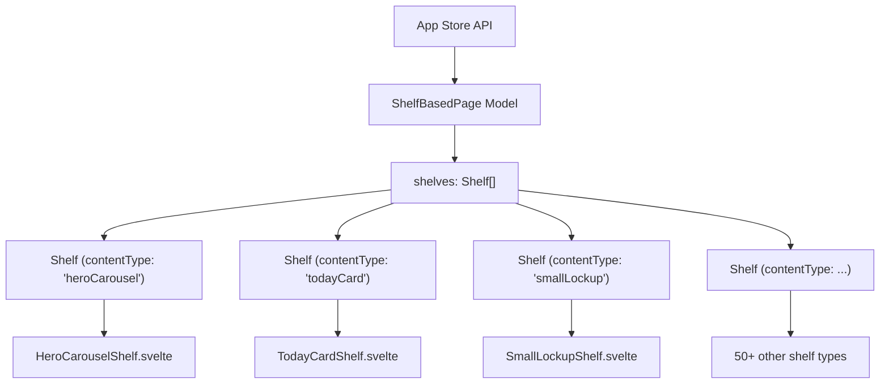
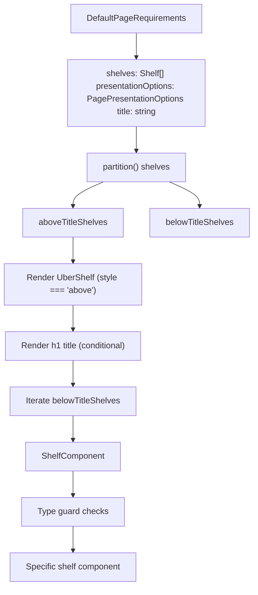
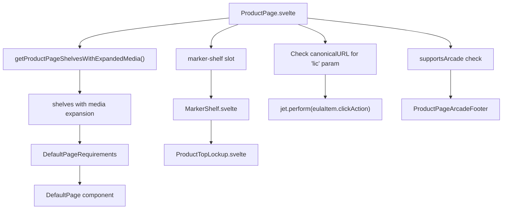
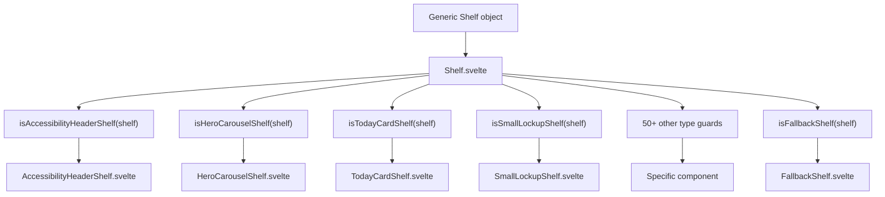
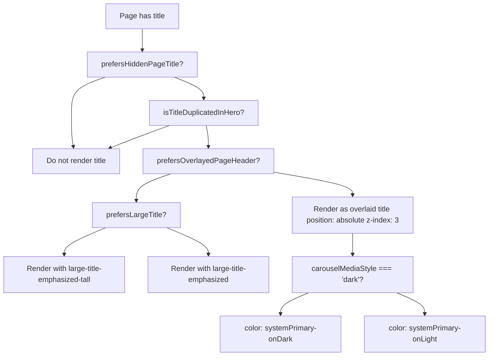
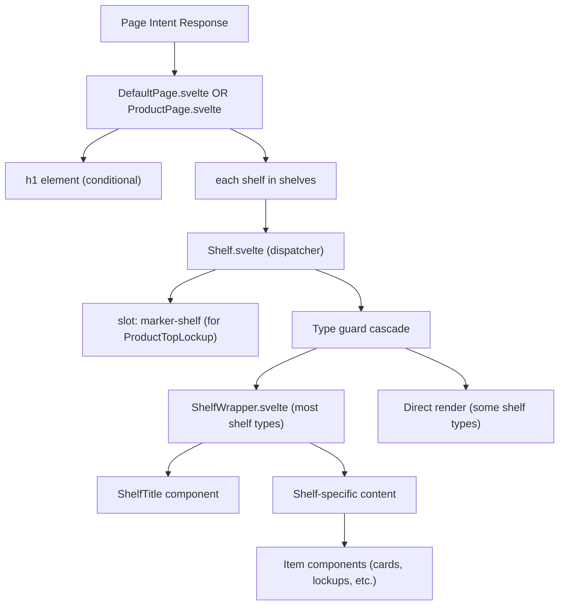
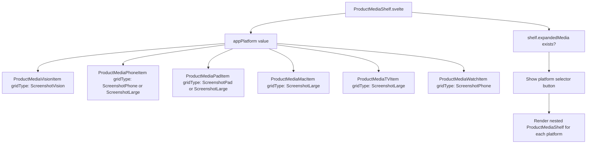

# Page Rendering System

-   [src/components/AmbientBackgroundArtwork.svelte](https://github.com/Chesszyh/apps.apple.com/blob/279d0c4d/src/components/AmbientBackgroundArtwork.svelte)
-   [src/components/Shelf/Wrapper.svelte](https://github.com/Chesszyh/apps.apple.com/blob/279d0c4d/src/components/Shelf/Wrapper.svelte)
-   [src/components/jet/marker-shelf/ProductTopLockup.svelte](https://github.com/Chesszyh/apps.apple.com/blob/279d0c4d/src/components/jet/marker-shelf/ProductTopLockup.svelte)
-   [src/components/jet/shelf/ArcadeFooterShelf.svelte](https://github.com/Chesszyh/apps.apple.com/blob/279d0c4d/src/components/jet/shelf/ArcadeFooterShelf.svelte)
-   [src/components/jet/shelf/PageHeaderShelf.svelte](https://github.com/Chesszyh/apps.apple.com/blob/279d0c4d/src/components/jet/shelf/PageHeaderShelf.svelte)
-   [src/components/jet/shelf/PrivacyFooterShelf.svelte](https://github.com/Chesszyh/apps.apple.com/blob/279d0c4d/src/components/jet/shelf/PrivacyFooterShelf.svelte)
-   [src/components/jet/shelf/ProductDescriptionShelf.svelte](https://github.com/Chesszyh/apps.apple.com/blob/279d0c4d/src/components/jet/shelf/ProductDescriptionShelf.svelte)
-   [src/components/jet/shelf/ProductMediaShelf.svelte](https://github.com/Chesszyh/apps.apple.com/blob/279d0c4d/src/components/jet/shelf/ProductMediaShelf.svelte)
-   [src/components/jet/shelf/Shelf.svelte](https://github.com/Chesszyh/apps.apple.com/blob/279d0c4d/src/components/jet/shelf/Shelf.svelte)
-   [src/components/pages/DefaultPage.svelte](https://github.com/Chesszyh/apps.apple.com/blob/279d0c4d/src/components/pages/DefaultPage.svelte)
-   [src/components/pages/ProductPage.svelte](https://github.com/Chesszyh/apps.apple.com/blob/279d0c4d/src/components/pages/ProductPage.svelte)

## Purpose and Scope

The Page Rendering System transforms shelf-based data models received from the App Store API into rendered DOM components. This system orchestrates the top-level page layout, shelf iteration, type-based dispatching, and presentation customization.

This document focuses on the overall rendering architecture and data flow. For detailed information about specific page types, see [Page Components](#4.1). For the shelf dispatcher and type guard pattern, see [Shelf System](#4.2). For modal rendering, see [Modal Presentation](#4.3).

## Shelf-Based Page Model

Pages in the App Store web application are fundamentally **collections of shelves**. Each page receives an array of `Shelf` objects from the API, which the rendering system iterates through and renders using type-specific components.


**Sources:** [src/components/pages/DefaultPage.svelte1-174](https://github.com/Chesszyh/apps.apple.com/blob/279d0c4d/src/components/pages/DefaultPage.svelte#L1-L174)

## Page Component Architecture

The system provides two primary page components that orchestrate shelf rendering:

### DefaultPage Component

`DefaultPage` is the generic page renderer that handles most page types including editorial pages, search results, and category pages.


**Key responsibilities:**

-   **Shelf partitioning**: Splits shelves into above-title and below-title groups using `partition()` [src/components/pages/DefaultPage.svelte45-57](https://github.com/Chesszyh/apps.apple.com/blob/279d0c4d/src/components/pages/DefaultPage.svelte#L45-L57)
-   **Title rendering**: Conditionally renders page title based on `presentationOptions` [src/components/pages/DefaultPage.svelte100-109](https://github.com/Chesszyh/apps.apple.com/blob/279d0c4d/src/components/pages/DefaultPage.svelte#L100-L109)
-   **Marker shelf delegation**: Provides slot for parent components to handle `MarkerShelf` types [src/components/pages/DefaultPage.svelte30-37](https://github.com/Chesszyh/apps.apple.com/blob/279d0c4d/src/components/pages/DefaultPage.svelte#L30-L37)
-   **Presentation customization**: Applies `prefersHiddenPageTitle`, `prefersLargeTitle`, and `prefersOverlayedPageHeader` options [src/components/pages/DefaultPage.svelte59-68](https://github.com/Chesszyh/apps.apple.com/blob/279d0c4d/src/components/pages/DefaultPage.svelte#L59-L68)

**Sources:** [src/components/pages/DefaultPage.svelte1-174](https://github.com/Chesszyh/apps.apple.com/blob/279d0c4d/src/components/pages/DefaultPage.svelte#L1-L174)

### ProductPage Component

`ProductPage` extends `DefaultPage` with product-specific rendering logic, including the hero lockup section and EULA deep linking.


**Key features:**

-   **Media expansion**: Processes shelves to handle platform-specific media via `getProductPageShelvesWithExpandedMedia()` [src/components/pages/ProductPage.svelte22](https://github.com/Chesszyh/apps.apple.com/blob/279d0c4d/src/components/pages/ProductPage.svelte#L22-L22)
-   **Marker shelf rendering**: Renders `ProductTopLockup` for the hero section [src/components/pages/ProductPage.svelte70-72](https://github.com/Chesszyh/apps.apple.com/blob/279d0c4d/src/components/pages/ProductPage.svelte#L70-L72)
-   **EULA deep linking**: Automatically opens License Agreement modal when `?lic` parameter present [src/components/pages/ProductPage.svelte42-60](https://github.com/Chesszyh/apps.apple.com/blob/279d0c4d/src/components/pages/ProductPage.svelte#L42-L60)
-   **Accessibility context**: Sets up shelf neighbor detection for accessibility features [src/components/pages/ProductPage.svelte33-34](https://github.com/Chesszyh/apps.apple.com/blob/279d0c4d/src/components/pages/ProductPage.svelte#L33-L34)

**Sources:** [src/components/pages/ProductPage.svelte1-78](https://github.com/Chesszyh/apps.apple.com/blob/279d0c4d/src/components/pages/ProductPage.svelte#L1-L78)

## Shelf Type Dispatching

The `Shelf.svelte` component implements a type dispatcher pattern that routes generic `Shelf` models to 50+ specialized components using TypeScript type guard functions.

### Type Guard Pattern


### Type Guard Implementation

Each shelf type has a corresponding type guard function that narrows the generic `Shelf` type:

```
// Type guard function signature patternexport function is[ShelfType]Shelf(shelf: Shelf): shelf is [ShelfType]Shelf {    const { contentType, items } = shelf;    return contentType === '[contentTypeValue]' && Array.isArray(items);}
```
**Example type guards:**

-   `isPageHeaderShelf(shelf)` - checks `contentType === 'pageHeader'` [src/components/jet/shelf/PageHeaderShelf.svelte8-11](https://github.com/Chesszyh/apps.apple.com/blob/279d0c4d/src/components/jet/shelf/PageHeaderShelf.svelte#L8-L11)
-   `isProductMediaShelf(shelf)` - checks `contentType === 'productMediaItem'` [src/components/jet/shelf/ProductMediaShelf.svelte15-20](https://github.com/Chesszyh/apps.apple.com/blob/279d0c4d/src/components/jet/shelf/ProductMediaShelf.svelte#L15-L20)
-   `isProductDescriptionShelf(shelf)` - checks `contentType === 'productDescription'` [src/components/jet/shelf/ProductDescriptionShelf.svelte11-17](https://github.com/Chesszyh/apps.apple.com/blob/279d0c4d/src/components/jet/shelf/ProductDescriptionShelf.svelte#L11-L17)

### Dispatcher Control Flow

The `Shelf.svelte` component uses a cascading `if-else` chain to check each type guard in sequence:

[src/components/jet/shelf/Shelf.svelte205-320](https://github.com/Chesszyh/apps.apple.com/blob/279d0c4d/src/components/jet/shelf/Shelf.svelte#L205-L320)

**Special cases:**

-   **MarkerShelf**: Yields rendering to parent via slot `<slot name="marker-shelf" {shelf} />` [src/components/jet/shelf/Shelf.svelte316-317](https://github.com/Chesszyh/apps.apple.com/blob/279d0c4d/src/components/jet/shelf/Shelf.svelte#L316-L317)
-   **BannerShelf**: Currently no-op [src/components/jet/shelf/Shelf.svelte225-227](https://github.com/Chesszyh/apps.apple.com/blob/279d0c4d/src/components/jet/shelf/Shelf.svelte#L225-L227)
-   **FallbackShelf**: Catches unrecognized shelf types [src/components/jet/shelf/Shelf.svelte318-319](https://github.com/Chesszyh/apps.apple.com/blob/279d0c4d/src/components/jet/shelf/Shelf.svelte#L318-L319)

**Sources:** [src/components/jet/shelf/Shelf.svelte1-321](https://github.com/Chesszyh/apps.apple.com/blob/279d0c4d/src/components/jet/shelf/Shelf.svelte#L1-L321)

## Shelf Layout and Presentation

### ShelfWrapper Component

`ShelfWrapper` provides consistent layout, spacing, and optional elements across all shelf types:

| Property | Type | Default | Purpose |
| --- | --- | --- | --- |
| `centered` | `boolean` | `false` | Constrains shelf to page width with horizontal margins |
| `withTopBorder` | `boolean` | `false` | Adds top border separator |
| `withTopMargin` | `boolean` | `false` | Adds top margin spacing |
| `withPaddingTop` | `boolean` | `true` | Adds top padding |
| `withBottomPadding` | `boolean` | `true` | Adds bottom padding |

**Title rendering logic:**

1.  Checks for custom `title` slot
2.  Falls back to `shelf.header.title` if present
3.  Falls back to `shelf.title` if present
4.  Renders `ShelfTitle` component with optional "See All" action

[src/components/Shelf/Wrapper.svelte1-82](https://github.com/Chesszyh/apps.apple.com/blob/279d0c4d/src/components/Shelf/Wrapper.svelte#L1-L82)

**Sources:** [src/components/Shelf/Wrapper.svelte1-82](https://github.com/Chesszyh/apps.apple.com/blob/279d0c4d/src/components/Shelf/Wrapper.svelte#L1-L82)

## Title Rendering Logic

Page titles follow a sophisticated rendering strategy based on presentation options and content duplication:

### Title Rendering Decision Tree


**Title duplication detection:**

The system checks if the page title is duplicated in the first hero carousel item to avoid redundancy:

[src/components/pages/DefaultPage.svelte69-85](https://github.com/Chesszyh/apps.apple.com/blob/279d0c4d/src/components/pages/DefaultPage.svelte#L69-L85)

**Overlaid title positioning:**

When `prefersOverlayedPageHeader` is enabled and viewport is `xsmall`, the title overlays the first shelf with dynamic color based on background darkness [src/components/pages/DefaultPage.svelte163-172](https://github.com/Chesszyh/apps.apple.com/blob/279d0c4d/src/components/pages/DefaultPage.svelte#L163-L172)

**Sources:** [src/components/pages/DefaultPage.svelte59-109](https://github.com/Chesszyh/apps.apple.com/blob/279d0c4d/src/components/pages/DefaultPage.svelte#L59-L109) [src/components/pages/DefaultPage.svelte148-173](https://github.com/Chesszyh/apps.apple.com/blob/279d0c4d/src/components/pages/DefaultPage.svelte#L148-L173)

## Data Flow Architecture

### End-to-End Rendering Pipeline

> **[Mermaid sequence]**
> *(图表结构无法解析)*

### Component Hierarchy


**Sources:** [src/components/pages/DefaultPage.svelte1-174](https://github.com/Chesszyh/apps.apple.com/blob/279d0c4d/src/components/pages/DefaultPage.svelte#L1-L174) [src/components/jet/shelf/Shelf.svelte1-321](https://github.com/Chesszyh/apps.apple.com/blob/279d0c4d/src/components/jet/shelf/Shelf.svelte#L1-L321)

## Special Shelf Types

### MarkerShelf

The `MarkerShelf` type is unique because it requires access to the entire page model, not just its own shelf data. This is handled via slot delegation:

1.  `Shelf.svelte` detects `isMarkerShelf(shelf)` [src/components/jet/shelf/Shelf.svelte316-317](https://github.com/Chesszyh/apps.apple.com/blob/279d0c4d/src/components/jet/shelf/Shelf.svelte#L316-L317)
2.  Renders slot: `<slot name="marker-shelf" {shelf} />`
3.  Parent component (ProductPage) provides slot content [src/components/pages/ProductPage.svelte70-72](https://github.com/Chesszyh/apps.apple.com/blob/279d0c4d/src/components/pages/ProductPage.svelte#L70-L72)
4.  `MarkerShelf.svelte` receives full page data [src/components/jet/marker-shelf/ProductTopLockup.svelte48](https://github.com/Chesszyh/apps.apple.com/blob/279d0c4d/src/components/jet/marker-shelf/ProductTopLockup.svelte#L48-L48)

**ProductTopLockup rendering:**

The marker shelf renders the product hero section with:

-   App icon with glow effect
-   Title, subtitle, editorial tagline
-   Platform exclusivity text
-   Pricing/offer information
-   Share and "Launch Native" buttons
-   Arcade logo (when applicable)
-   Animated background with blur effects

[src/components/jet/marker-shelf/ProductTopLockup.svelte1-464](https://github.com/Chesszyh/apps.apple.com/blob/279d0c4d/src/components/jet/marker-shelf/ProductTopLockup.svelte#L1-L464)

**Sources:** [src/components/jet/marker-shelf/ProductTopLockup.svelte1-464](https://github.com/Chesszyh/apps.apple.com/blob/279d0c4d/src/components/jet/marker-shelf/ProductTopLockup.svelte#L1-L464) [src/components/pages/ProductPage.svelte70-72](https://github.com/Chesszyh/apps.apple.com/blob/279d0c4d/src/components/pages/ProductPage.svelte#L70-L72)

### Platform-Specific Media Rendering

`ProductMediaShelf` adapts its rendering based on the `appPlatform` and `mediaType` properties:


**Platform icon mapping:**

| Platform | SF Symbol |
| --- | --- |
| `phone` | `iphone.gen2` |
| `pad` | `ipad.gen2` |
| `tv` | `tv` |
| `watch` | `applewatch` |
| `mac` | `macbook.gen2` |
| `messages` | `message` |
| `vision` | `visionpro` |

[src/components/jet/shelf/ProductMediaShelf.svelte22-40](https://github.com/Chesszyh/apps.apple.com/blob/279d0c4d/src/components/jet/shelf/ProductMediaShelf.svelte#L22-L40)

**Sources:** [src/components/jet/shelf/ProductMediaShelf.svelte1-270](https://github.com/Chesszyh/apps.apple.com/blob/279d0c4d/src/components/jet/shelf/ProductMediaShelf.svelte#L1-L270)

## Presentation Options

Page components support several presentation customization flags:

| Option | Effect | Component |
| --- | --- | --- |
| `prefersHiddenPageTitle` | Hides the `h1` title completely | DefaultPage |
| `prefersLargeTitle` | Uses `large-title-emphasized-tall` font | DefaultPage |
| `prefersOverlayedPageHeader` | Positions title absolutely over first shelf (xsmall viewport only) | DefaultPage |

**Presentation options usage:**

[src/components/pages/DefaultPage.svelte42](https://github.com/Chesszyh/apps.apple.com/blob/279d0c4d/src/components/pages/DefaultPage.svelte#L42-L42) [src/components/pages/DefaultPage.svelte59-68](https://github.com/Chesszyh/apps.apple.com/blob/279d0c4d/src/components/pages/DefaultPage.svelte#L59-L68)

**Dynamic styling based on background:**

When title is overlaid, its color adapts to the carousel media background (dark or light) using the `carouselMediaStyle` store [src/components/pages/DefaultPage.svelte66-67](https://github.com/Chesszyh/apps.apple.com/blob/279d0c4d/src/components/pages/DefaultPage.svelte#L66-L67)

**Sources:** [src/components/pages/DefaultPage.svelte42-109](https://github.com/Chesszyh/apps.apple.com/blob/279d0c4d/src/components/pages/DefaultPage.svelte#L42-L109)

## Ambient Background Effects

Hero shelves can render animated ambient backgrounds using `AmbientBackgroundArtwork`:

**Key features:**

-   Loads artwork as background image with blur and saturation filters [src/components/AmbientBackgroundArtwork.svelte106](https://github.com/Chesszyh/apps.apple.com/blob/279d0c4d/src/components/AmbientBackgroundArtwork.svelte#L106-L106)
-   Animates background position and scale over 60s cycle [src/components/AmbientBackgroundArtwork.svelte176-201](https://github.com/Chesszyh/apps.apple.com/blob/279d0c4d/src/components/AmbientBackgroundArtwork.svelte#L176-L201)
-   Pauses animation when out of viewport or during resize [src/components/AmbientBackgroundArtwork.svelte170-174](https://github.com/Chesszyh/apps.apple.com/blob/279d0c4d/src/components/AmbientBackgroundArtwork.svelte#L170-L174)
-   Uses gradient mask to fade edges into page background [src/components/AmbientBackgroundArtwork.svelte87-97](https://github.com/Chesszyh/apps.apple.com/blob/279d0c4d/src/components/AmbientBackgroundArtwork.svelte#L87-L97)
-   Supports dark mode with different veil opacity [src/components/AmbientBackgroundArtwork.svelte111-113](https://github.com/Chesszyh/apps.apple.com/blob/279d0c4d/src/components/AmbientBackgroundArtwork.svelte#L111-L113)

**Sources:** [src/components/AmbientBackgroundArtwork.svelte1-203](https://github.com/Chesszyh/apps.apple.com/blob/279d0c4d/src/components/AmbientBackgroundArtwork.svelte#L1-L203)

## Summary

The Page Rendering System implements a flexible, type-safe architecture for rendering shelf-based pages:

1.  **Page components** (`DefaultPage`, `ProductPage`) orchestrate shelf iteration and presentation
2.  **Type dispatcher** (`Shelf.svelte`) uses type guards to route to 50+ specialized components
3.  **Layout wrapper** (`ShelfWrapper`) provides consistent spacing and optional elements
4.  **Special handling** for marker shelves, platform-specific media, and presentation customization
5.  **Title rendering logic** that avoids duplication and supports overlay positioning

For implementation details on specific shelf types, see [Shelf Type Reference](#7).
