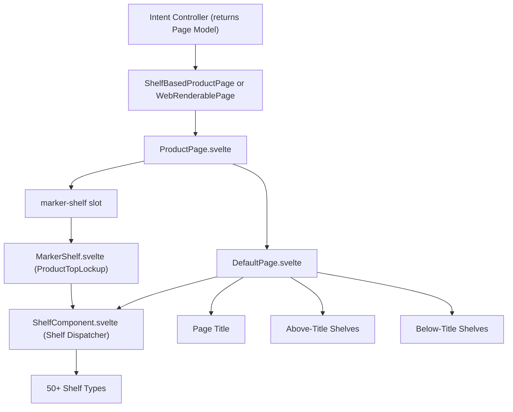
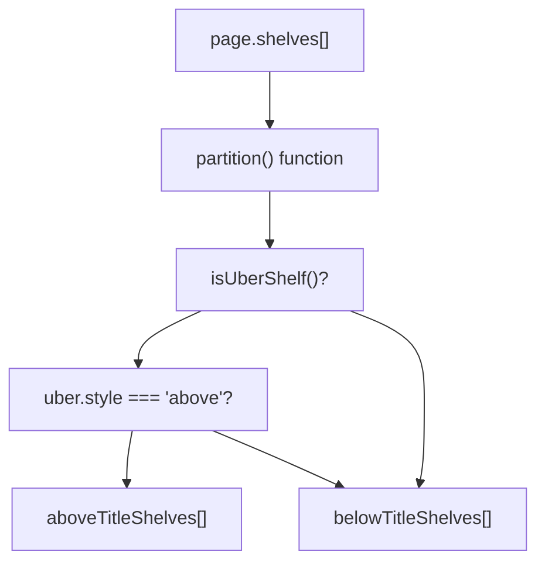
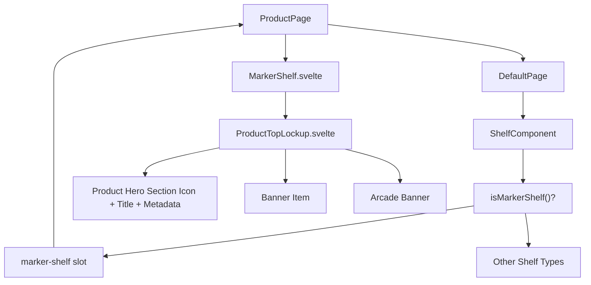
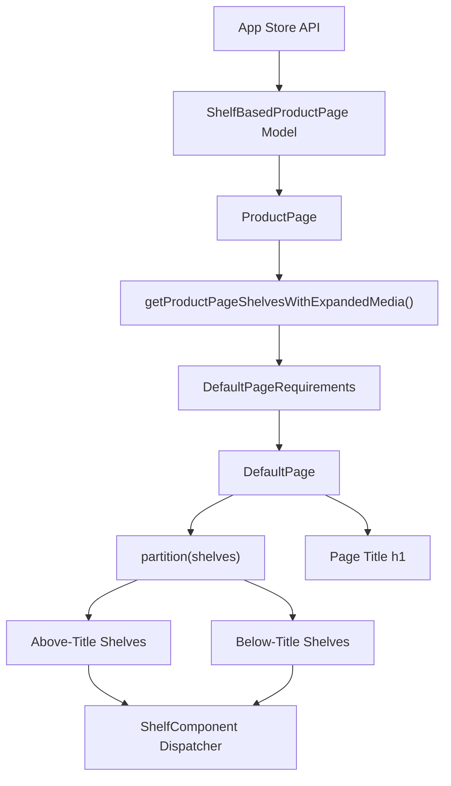

# Page Components

-   [src/components/AmbientBackgroundArtwork.svelte](https://github.com/Chesszyh/apps.apple.com/blob/279d0c4d/src/components/AmbientBackgroundArtwork.svelte)
-   [src/components/Shelf/Wrapper.svelte](https://github.com/Chesszyh/apps.apple.com/blob/279d0c4d/src/components/Shelf/Wrapper.svelte)
-   [src/components/jet/marker-shelf/ProductTopLockup.svelte](https://github.com/Chesszyh/apps.apple.com/blob/279d0c4d/src/components/jet/marker-shelf/ProductTopLockup.svelte)
-   [src/components/jet/shelf/ArcadeFooterShelf.svelte](https://github.com/Chesszyh/apps.apple.com/blob/279d0c4d/src/components/jet/shelf/ArcadeFooterShelf.svelte)
-   [src/components/jet/shelf/PageHeaderShelf.svelte](https://github.com/Chesszyh/apps.apple.com/blob/279d0c4d/src/components/jet/shelf/PageHeaderShelf.svelte)
-   [src/components/jet/shelf/PrivacyFooterShelf.svelte](https://github.com/Chesszyh/apps.apple.com/blob/279d0c4d/src/components/jet/shelf/PrivacyFooterShelf.svelte)
-   [src/components/jet/shelf/ProductDescriptionShelf.svelte](https://github.com/Chesszyh/apps.apple.com/blob/279d0c4d/src/components/jet/shelf/ProductDescriptionShelf.svelte)
-   [src/components/jet/shelf/ProductMediaShelf.svelte](https://github.com/Chesszyh/apps.apple.com/blob/279d0c4d/src/components/jet/shelf/ProductMediaShelf.svelte)
-   [src/components/pages/DefaultPage.svelte](https://github.com/Chesszyh/apps.apple.com/blob/279d0c4d/src/components/pages/DefaultPage.svelte)
-   [src/components/pages/ProductPage.svelte](https://github.com/Chesszyh/apps.apple.com/blob/279d0c4d/src/components/pages/ProductPage.svelte)

## Purpose and Scope

This document covers the top-level page components that orchestrate shelf rendering: **DefaultPage** and **ProductPage**. These components consume shelf-based data models from the API and coordinate the rendering of individual shelves, titles, and page-level layout concerns.

For details about the shelf dispatching system and individual shelf implementations, see [Shelf System](#4.2). For modal presentation patterns, see [Modal Presentation](#4.3).

---

## Page Component Architecture

The page rendering system follows a two-tier pattern where `ProductPage` wraps `DefaultPage` to provide product-specific functionality while delegating core shelf orchestration to the base component.


Sources: [src/components/pages/DefaultPage.svelte1-174](https://github.com/Chesszyh/apps.apple.com/blob/279d0c4d/src/components/pages/DefaultPage.svelte#L1-L174) [src/components/pages/ProductPage.svelte1-78](https://github.com/Chesszyh/apps.apple.com/blob/279d0c4d/src/components/pages/ProductPage.svelte#L1-L78)

---

## DefaultPage Component

### Component Interface

`DefaultPage` accepts a minimal page requirements interface and provides the core shelf rendering logic.

**Type Definition:**

```
interface DefaultPageRequirements extends WebRenderablePage {    shelves: Shelf[];    presentationOptions?: PagePresentationOptions;}
```
**Slots:**

-   `before-shelves` - Content injected after title but before belowTitleShelves
-   `marker-shelf` - Scoped slot for rendering MarkerShelf with page data access

Sources: [src/components/pages/DefaultPage.svelte8-14](https://github.com/Chesszyh/apps.apple.com/blob/279d0c4d/src/components/pages/DefaultPage.svelte#L8-L14)

### Shelf Partitioning Logic

`DefaultPage` partitions the shelves array into two groups: shelves that render above the page title and shelves that render below it. This allows certain full-width hero shelves to appear before the page title.


**Implementation:** The partitioning logic uses the `partition` utility function to split shelves based on whether they are `UberShelf` components with `style === 'above'`.

Sources: [src/components/pages/DefaultPage.svelte45-57](https://github.com/Chesszyh/apps.apple.com/blob/279d0c4d/src/components/pages/DefaultPage.svelte#L45-L57)

### Title Rendering

The page title is rendered conditionally based on several factors:

| Condition | Description | Result |
| --- | --- | --- |
| `!title` | No title provided | Title omitted |
| `prefersHiddenPageTitle` | Presentation option set | Title omitted |
| `isTitleDuplicatedInHero` | Title appears in first HeroCarouselShelf | Title omitted to avoid duplication |
| `prefersLargeTitle` | Presentation option set | Large title variant used |
| `prefersOverlayedPageHeader` | Presentation option on xsmall viewport | Title positioned absolutely over content |

**Title Duplication Detection:** The component checks if the page title is already present in the first shelf's hero item to avoid showing it twice.

Sources: [src/components/pages/DefaultPage.svelte69-85](https://github.com/Chesszyh/apps.apple.com/blob/279d0c4d/src/components/pages/DefaultPage.svelte#L69-L85) [src/components/pages/DefaultPage.svelte100-109](https://github.com/Chesszyh/apps.apple.com/blob/279d0c4d/src/components/pages/DefaultPage.svelte#L100-L109)

### Presentation Options

`DefaultPage` respects several presentation hints from the page model:

**prefersHiddenPageTitle**

-   Completely hides the page title even if one exists
-   Used for pages where title is embedded in content

**prefersLargeTitle**

-   Applies `.large-title` CSS class
-   Uses `var(--large-title-emphasized-tall)` font
-   Provides more visual hierarchy

**prefersOverlayedPageHeader**

-   Only applies on `xsmall` viewport (mobile)
-   Positions title absolutely over content
-   Adjusts container margin: `margin-top: -13px`
-   Adapts text color based on carousel media style (light/dark)

Sources: [src/components/pages/DefaultPage.svelte59-67](https://github.com/Chesszyh/apps.apple.com/blob/279d0c4d/src/components/pages/DefaultPage.svelte#L59-L67) [src/components/pages/DefaultPage.svelte148-172](https://github.com/Chesszyh/apps.apple.com/blob/279d0c4d/src/components/pages/DefaultPage.svelte#L148-L172)

### Rendering Flow

Sources: [src/components/pages/DefaultPage.svelte88-125](https://github.com/Chesszyh/apps.apple.com/blob/279d0c4d/src/components/pages/DefaultPage.svelte#L88-L125)

---

## ProductPage Component

### Wrapper Pattern

`ProductPage` is a thin wrapper around `DefaultPage` that provides product-specific functionality. It consumes a `ShelfBasedProductPage` model and transforms it into the `DefaultPageRequirements` interface.

**Component Composition:**

```
// ProductPage constructs DefaultPageRequirementsdefaultPageRequirements = {    shelves: getProductPageShelvesWithExpandedMedia(page),    presentationOptions: page.presentationOptions,    webNavigation: page.webNavigation,}
```
Sources: [src/components/pages/ProductPage.svelte24-30](https://github.com/Chesszyh/apps.apple.com/blob/279d0c4d/src/components/pages/ProductPage.svelte#L24-L30)

### MarkerShelf Integration

The `marker-shelf` slot mechanism allows `ProductPage` to inject product-specific data into the `MarkerShelf` component (rendered as `ProductTopLockup`), which appears as a special shelf type in the shelves array.


**MarkerShelfPageRequirements:** The marker shelf requires specific page properties to render the product hero:

```
type MarkerShelfPageRequirements = Pick<ShelfBasedProductPage,    | 'badges'    | 'banner'    | 'developerAction'    | 'lockup'    | 'shelfMapping'    | 'titleOfferDisplayProperties'    | 'canonicalURL'    | 'appPlatforms'>;
```
Sources: [src/components/pages/ProductPage.svelte69-73](https://github.com/Chesszyh/apps.apple.com/blob/279d0c4d/src/components/pages/ProductPage.svelte#L69-L73) [src/components/jet/marker-shelf/ProductTopLockup.svelte11-21](https://github.com/Chesszyh/apps.apple.com/blob/279d0c4d/src/components/jet/marker-shelf/ProductTopLockup.svelte#L11-L21)

### Deep Linking Support

`ProductPage` supports deep linking to the License Agreement modal via the `?lic` query parameter. This is implemented by scanning the shelves for a `ProductPageLinkShelf` containing an EULA action and programmatically performing it.

**Deep Link Flow:**

> **[Mermaid sequence]**
> *(图表结构无法解析)*

Sources: [src/components/pages/ProductPage.svelte36-61](https://github.com/Chesszyh/apps.apple.com/blob/279d0c4d/src/components/pages/ProductPage.svelte#L36-L61)

### Accessibility Context Setup

`ProductPage` initializes the accessibility layout context with the shelves array, enabling neighbor shelf detection for accessibility features.

```
setAccessibilityLayoutContext({ shelves });
```
Sources: [src/components/pages/ProductPage.svelte32-34](https://github.com/Chesszyh/apps.apple.com/blob/279d0c4d/src/components/pages/ProductPage.svelte#L32-L34)

### Arcade Support

`ProductPage` detects if the product is an Arcade app by checking `page.lockup.offerDisplayProperties?.offerType === 'arcadeApp'` and conditionally renders the `ProductPageArcadeFooter` component.

Sources: [src/components/pages/ProductPage.svelte63-77](https://github.com/Chesszyh/apps.apple.com/blob/279d0c4d/src/components/pages/ProductPage.svelte#L63-L77)

---

## Page-Level Data Transformation


Sources: [src/components/pages/ProductPage.svelte1-78](https://github.com/Chesszyh/apps.apple.com/blob/279d0c4d/src/components/pages/ProductPage.svelte#L1-L78) [src/components/pages/DefaultPage.svelte1-174](https://github.com/Chesszyh/apps.apple.com/blob/279d0c4d/src/components/pages/DefaultPage.svelte#L1-L174)

---

## Presentation Options Reference

| Option | Type | Viewport | Effect | CSS Class |
| --- | --- | --- | --- | --- |
| `prefersHiddenPageTitle` | boolean | All | Hides page title completely | N/A |
| `prefersLargeTitle` | boolean | All | Uses larger title font | `.large-title` |
| `prefersOverlayedPageHeader` | boolean | xsmall only | Positions title absolutely over content | `.overlaid` |
| N/A (carousel style) | computed | xsmall + overlaid | Adapts title color for dark backgrounds | `.on-dark-background` |

**CSS Variables Used:**

-   `--large-title-emphasized`: Default title font
-   `--large-title-emphasized-tall`: Large title variant font
-   `--systemPrimary-onLight`: Title color on light background
-   `--systemPrimary-onDark`: Title color on dark background
-   `--bodyGutter`: Horizontal padding

Sources: [src/components/pages/DefaultPage.svelte59-67](https://github.com/Chesszyh/apps.apple.com/blob/279d0c4d/src/components/pages/DefaultPage.svelte#L59-L67) [src/components/pages/DefaultPage.svelte148-172](https://github.com/Chesszyh/apps.apple.com/blob/279d0c4d/src/components/pages/DefaultPage.svelte#L148-L172)

---

## Component File Structure

| Component | Path | Responsibility |
| --- | --- | --- |
| DefaultPage | [src/components/pages/DefaultPage.svelte1-174](https://github.com/Chesszyh/apps.apple.com/blob/279d0c4d/src/components/pages/DefaultPage.svelte#L1-L174) | Core shelf orchestration, title rendering, presentation options |
| ProductPage | [src/components/pages/ProductPage.svelte1-78](https://github.com/Chesszyh/apps.apple.com/blob/279d0c4d/src/components/pages/ProductPage.svelte#L1-L78) | Product-specific wrapper, marker shelf integration, deep linking |
| ProductTopLockup | [src/components/jet/marker-shelf/ProductTopLockup.svelte1-464](https://github.com/Chesszyh/apps.apple.com/blob/279d0c4d/src/components/jet/marker-shelf/ProductTopLockup.svelte#L1-L464) | Product hero section with app icon, metadata, ambient background |
| ShelfWrapper | [src/components/Shelf/Wrapper.svelte1-82](https://github.com/Chesszyh/apps.apple.com/blob/279d0c4d/src/components/Shelf/Wrapper.svelte#L1-L82) | Common shelf layout and spacing (see [Shelf Wrapper and Common Layout](#4.4)) |

Sources: [src/components/pages/DefaultPage.svelte1-174](https://github.com/Chesszyh/apps.apple.com/blob/279d0c4d/src/components/pages/DefaultPage.svelte#L1-L174) [src/components/pages/ProductPage.svelte1-78](https://github.com/Chesszyh/apps.apple.com/blob/279d0c4d/src/components/pages/ProductPage.svelte#L1-L78) [src/components/jet/marker-shelf/ProductTopLockup.svelte1-464](https://github.com/Chesszyh/apps.apple.com/blob/279d0c4d/src/components/jet/marker-shelf/ProductTopLockup.svelte#L1-L464) [src/components/Shelf/Wrapper.svelte1-82](https://github.com/Chesszyh/apps.apple.com/blob/279d0c4d/src/components/Shelf/Wrapper.svelte#L1-L82)
