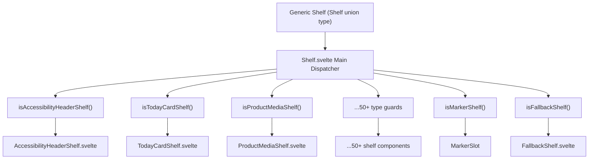
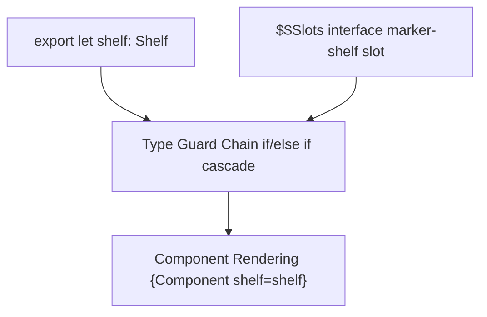
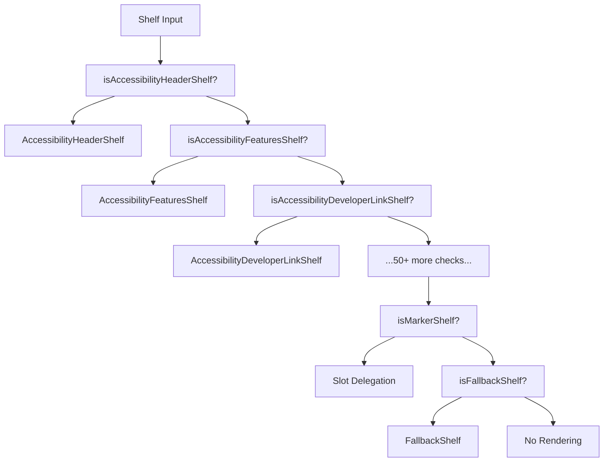

# Shelf System

-   [src/components/jet/shelf/Shelf.svelte](https://github.com/Chesszyh/apps.apple.com/blob/279d0c4d/src/components/jet/shelf/Shelf.svelte)

## Purpose and Scope

The Shelf System is the core polymorphic rendering mechanism that dynamically dispatches generic `Shelf` data models to type-specific Svelte components. The system uses type guard functions to narrow the generic `Shelf` type down to specific shelf types, then renders the appropriate component implementation. This dispatcher pattern enables the application to render 50+ different shelf types from a unified interface.

For information about the page-level composition and how shelves are orchestrated within pages, see [Page Components](#4.1). For details about the common layout patterns applied to shelves, see [Shelf Wrapper and Common Layout](#4.4). For a comprehensive catalog of all shelf types, see [Shelf Type Reference](#7).

---

## Architecture Overview

The Shelf System implements a **type guard dispatcher pattern** where a single component (`Shelf.svelte`) acts as a routing layer between generic shelf data and type-specific rendering implementations.

### System Architecture


**Sources:** [src/components/jet/shelf/Shelf.svelte1-321](https://github.com/Chesszyh/apps.apple.com/blob/279d0c4d/src/components/jet/shelf/Shelf.svelte#L1-L321)

---

## Type Guard Pattern

Each shelf type implements a **type guard function** that performs runtime type checking and provides TypeScript type narrowing. Type guards follow a consistent naming convention: `is{ShelfType}(shelf: Shelf): shelf is {ShelfType}`.

### Type Guard Implementation Pattern

Type guards check for the presence of a specific `kind` property on the shelf object:

```
// Example type guard structureexport function isTodayCardShelf(shelf: Shelf): shelf is TodayCardShelf {    return shelf.kind === 'TodayCardShelf';}
```
The dispatcher component uses these type guards in a cascading if/else chain:

```
{#if isAccessibilityHeaderShelf(shelf)}    <AccessibilityHeaderShelf {shelf} />{:else if isAccessibilityFeaturesShelf(shelf)}    <AccessibilityFeaturesShelf {shelf} />{:else if isActionShelf(shelf)}    <ActionShelf {shelf} /><!-- ...continues for all shelf types... -->{/if}
```
**Sources:** [src/components/jet/shelf/Shelf.svelte205-320](https://github.com/Chesszyh/apps.apple.com/blob/279d0c4d/src/components/jet/shelf/Shelf.svelte#L205-L320)

### Type Guard Execution Flow

> **[Mermaid sequence]**
> *(图表结构无法解析)*

**Sources:** [src/components/jet/shelf/Shelf.svelte195-203](https://github.com/Chesszyh/apps.apple.com/blob/279d0c4d/src/components/jet/shelf/Shelf.svelte#L195-L203)

---

## Shelf Type Catalog

The system supports 50+ shelf types, categorized by function:

### Editorial and Promotional Shelves

| Shelf Type | Type Guard | Component |
| --- | --- | --- |
| `TodayCardShelf` | `isTodayCardShelf` | `TodayCardShelf.svelte` |
| `EditorialCardShelf` | `isEditorialCardShelf` | `EditorialCardShelf.svelte` |
| `HeroCarouselShelf` | `isHeroCarouselShelf` | `HeroCarouselShelf.svelte` |
| `AppPromotionShelf` | `isAppPromotionShelf` | `AppPromotionShelf.svelte` |
| `AppShowcaseShelf` | `isAppShowcaseShelf` | `AppShowcaseShelf.svelte` |
| `UberShelf` | `isUberShelf` | `UberShelf.svelte` |

### Lockup Shelves

| Shelf Type | Type Guard | Component |
| --- | --- | --- |
| `SmallLockupShelf` | `isSmallLockupShelf` | `SmallLockupShelf.svelte` |
| `MediumLockupShelf` | `isMediumLockupShelf` | `MediumLockupShelf.svelte` |
| `LargeLockupShelf` | `isLargeLockupShelf` | `LargeLockupShelf.svelte` |
| `PosterLockupShelf` | `isPosterLockupShelf` | `PosterLockupShelf.svelte` |
| `AppTrailerLockupShelf` | `isAppTrailerLockupShelf` | `AppTrailerLockupShelf.svelte` |
| `InAppPurchaseLockupShelf` | `isInAppPurchaseLockupShelf` | `InAppPurchaseLockupShelf.svelte` |

### Brick and Card Shelves

| Shelf Type | Type Guard | Component |
| --- | --- | --- |
| `BrickShelf` | `isBrickShelf` | `BrickShelf.svelte` |
| `SmallBrickShelf` | `isSmallBrickShelf` | `SmallBrickShelf.svelte` |
| `LargeBrickShelf` | `isLargeBrickShelf` | `LargeBrickShelf.svelte` |
| `CategoryBrickShelf` | `isCategoryBrickShelf` | `CategoryBrickShelf.svelte` |
| `SmallStoryCardShelf` | `isSmallStoryCardShelf` | `SmallStoryCardShelf.svelte` |
| `MediumStoryCardShelf` | `isMediumStoryCardShelf` | `MediumStoryCardShelf.svelte` |
| `LargeStoryCardShelf` | `isLargeStoryCardShelf` | `LargeStoryCardShelf.svelte` |

### Product-Specific Shelves

| Shelf Type | Type Guard | Component |
| --- | --- | --- |
| `ProductMediaShelf` | `isProductMediaShelf` | `ProductMediaShelf.svelte` |
| `ProductDescriptionShelf` | `isProductDescriptionShelf` | `ProductDescriptionShelf.svelte` |
| `ProductRatingsShelf` | `isProductRatingsShelf` | `ProductRatingsShelf.svelte` |
| `ProductReviewShelf` | `isProductReviewShelf` | `ProductReviewShelf.svelte` |
| `ProductBadgeShelf` | `isProductBadgeShelf` | `ProductBadgeShelf.svelte` |
| `ProductCapabilityShelf` | `isProductCapabilityShelf` | `ProductCapabilityShelf.svelte` |
| `ProductPageLinkShelf` | `isProductPageLinkShelf` | `ProductPageLinkShelf.svelte` |

### Image and Media Shelves

| Shelf Type | Type Guard | Component |
| --- | --- | --- |
| `LargeImageLockupShelf` | `isLargeImageLockupShelf` | `LargeImageLockupShelf.svelte` |
| `MediumImageLockupShelf` | `isMediumImageLockupShelf` | `MediumImageLockupShelf.svelte` |
| `FramedArtworkShelf` | `isFramedArtworkShelf` | `FramedArtworkShelf.svelte` |
| `FramedVideoShelf` | `isFramedVideoShelf` | `FramedVideoShelf.svelte` |

### Breakout Shelves

| Shelf Type | Type Guard | Component |
| --- | --- | --- |
| `SmallBreakoutShelf` | `isSmallBreakoutShelf` | `SmallBreakoutShelf.svelte` |
| `LargeHeroBreakoutShelf` | `isLargeHeroBreakoutShelf` | `LargeHeroBreakoutShelf.svelte` |

### Informational Shelves

| Shelf Type | Type Guard | Component |
| --- | --- | --- |
| `AccessibilityHeaderShelf` | `isAccessibilityHeaderShelf` | `AccessibilityHeaderShelf.svelte` |
| `AccessibilityFeaturesShelf` | `isAccessibilityFeaturesShelf` | `AccessibilityFeaturesShelf.svelte` |
| `AccessibilityDeveloperLinkShelf` | `isAccessibilityDeveloperLinkShelf` | `AccessibilityDeveloperLinkShelf.svelte` |
| `PrivacyHeaderShelf` | `isPrivacyHeaderShelf` | `PrivacyHeaderShelf.svelte` |
| `PrivacyFooterShelf` | `isPrivacyFooterShelf` | `PrivacyFooterShelf.svelte` |
| `PrivacyTypeShelf` | `isPrivacyTypeShelf` | `PrivacyTypeShelf.svelte` |
| `PageHeaderShelf` | `isPageHeaderShelf` | `PageHeaderShelf.svelte` |
| `ParagraphShelf` | `isParagraphShelf` | `ParagraphShelf.svelte` |
| `TitledParagraphShelf` | `isTitledParagraphShelf` | `TitledParagraphShelf.svelte` |
| `QuoteShelf` | `isQuoteShelf` | `QuoteShelf.svelte` |
| `AnnotationShelf` | `isAnnotationShelf` | `AnnotationShelf.svelte` |
| `LinkableTextShelf` | `isLinkableTextShelf` | `LinkableTextShelf.svelte` |

### Review Shelves

| Shelf Type | Type Guard | Component |
| --- | --- | --- |
| `ReviewsShelf` | `isReviewsShelf` | `ReviewsShelf.svelte` |
| `ReviewsContainerShelf` | `isReviewsContainerShelf` | `ReviewsContainerShelf.svelte` |

### Search and Navigation Shelves

| Shelf Type | Type Guard | Component |
| --- | --- | --- |
| `SearchResultShelf` | `isSearchResultShelf` | `SearchResultShelf.svelte` |
| `SearchLinkShelf` | `isSearchLinkShelf` | `SearchLinkShelf.svelte` |
| `EditorialLinkShelf` | `isEditorialLinkShelf` | `EditorialLinkShelf.svelte` |

### Utility and UI Shelves

| Shelf Type | Type Guard | Component |
| --- | --- | --- |
| `ActionShelf` | `isActionShelf` | `ActionShelf.svelte` |
| `AppEventDetailShelf` | `isAppEventDetailShelf` | `AppEventDetailShelf.svelte` |
| `ArcadeFooterShelf` | `isArcadeFooterShelf` | `ArcadeFooterShelf.svelte` |
| `HorizontalRuleShelf` | `isHorizontalRuleShelf` | `HorizontalRuleShelf.svelte` |
| `RibbonBarShelf` | `isRibbonBarShelf` | `RibbonBarShelf.svelte` |

### Special Shelves

| Shelf Type | Type Guard | Component | Notes |
| --- | --- | --- | --- |
| `MarkerShelf` | `isMarkerShelf` | Slot delegation | Uses parent component slot |
| `BannerShelf` | `isBannerShelf` | No-op | Currently disabled |
| `FallbackShelf` | `isFallbackShelf` | `FallbackShelf.svelte` | Catch-all for unknown types |

**Sources:** [src/components/jet/shelf/Shelf.svelte5-174](https://github.com/Chesszyh/apps.apple.com/blob/279d0c4d/src/components/jet/shelf/Shelf.svelte#L5-L174) [src/components/jet/shelf/Shelf.svelte205-320](https://github.com/Chesszyh/apps.apple.com/blob/279d0c4d/src/components/jet/shelf/Shelf.svelte#L205-L320)

---

## Component Dispatcher Implementation

### Main Shelf Component

The `Shelf.svelte` component is implemented as a pure conditional rendering component with no additional logic beyond type checking:


The component accepts a single `shelf` prop of the generic `Shelf` union type and declares a typed slot interface for the special `marker-shelf` slot.

**Sources:** [src/components/jet/shelf/Shelf.svelte176-193](https://github.com/Chesszyh/apps.apple.com/blob/279d0c4d/src/components/jet/shelf/Shelf.svelte#L176-L193)

### Type Guard Cascade

The type guard cascade follows a specific ordering:


The ordering is alphabetical by shelf type within functional categories, making it easy to locate specific shelf types in the source code.

**Sources:** [src/components/jet/shelf/Shelf.svelte205-320](https://github.com/Chesszyh/apps.apple.com/blob/279d0c4d/src/components/jet/shelf/Shelf.svelte#L205-L320)

---

## Special Cases

### MarkerShelf Slot Delegation

`MarkerShelf` is a special shelf type that requires access to the entire page data model for rendering, not just the shelf itself. Instead of rendering directly, the `Shelf` component delegates rendering back to the parent through a named slot:

```
{:else if isMarkerShelf(shelf)}    <slot name="marker-shelf" {shelf} />{/if}
```
The parent component (typically `ProductPage`) provides the slot implementation with access to the full page context:

```
<Shelf {shelf}>    <svelte:fragment slot="marker-shelf" let:shelf>        <!-- Render with access to page data -->    </svelte:fragment></Shelf>
```
**Sources:** [src/components/jet/shelf/Shelf.svelte176-190](https://github.com/Chesszyh/apps.apple.com/blob/279d0c4d/src/components/jet/shelf/Shelf.svelte#L176-L190) [src/components/jet/shelf/Shelf.svelte316-317](https://github.com/Chesszyh/apps.apple.com/blob/279d0c4d/src/components/jet/shelf/Shelf.svelte#L316-L317)

### BannerShelf No-Op

The `BannerShelf` type is currently disabled with a no-op implementation:

```
{:else if isBannerShelf(shelf)}    <!-- a no-op until we determine if we actually want to support these banners -->    <!-- <BannerShelf {shelf} /> -->{/if}
```
This preserves the type guard and import structure while preventing banner rendering until a product decision is made.

**Sources:** [src/components/jet/shelf/Shelf.svelte225-227](https://github.com/Chesszyh/apps.apple.com/blob/279d0c4d/src/components/jet/shelf/Shelf.svelte#L225-L227)

### FallbackShelf

The `FallbackShelf` acts as a catch-all for shelf types that don't match any specific type guard. It's placed at the end of the type guard cascade to handle unknown or future shelf types gracefully:

```
{:else if isFallbackShelf(shelf)}    <FallbackShelf {shelf} />{/if}
```
**Sources:** [src/components/jet/shelf/Shelf.svelte318-319](https://github.com/Chesszyh/apps.apple.com/blob/279d0c4d/src/components/jet/shelf/Shelf.svelte#L318-L319)

---

## Integration with Page Components

The Shelf component is integrated into page components through iteration over the `shelves` array:

> **[Mermaid sequence]**
> *(图表结构无法解析)*

Page components receive a `shelves` array from the API and iterate over it, passing each shelf to the `Shelf` dispatcher component. The dispatcher determines the appropriate component and renders it.

**Sources:** [src/components/jet/shelf/Shelf.svelte195-203](https://github.com/Chesszyh/apps.apple.com/blob/279d0c4d/src/components/jet/shelf/Shelf.svelte#L195-L203)

---

## Adding New Shelf Types

To add a new shelf type to the system, follow the pattern established by existing shelf types:

1.  **Create the shelf component** (e.g., `NewShelf.svelte`)
2.  **Implement the type guard function** with signature `isNewShelf(shelf: Shelf): shelf is NewShelf`
3.  **Import the component and type guard** in `Shelf.svelte`
4.  **Add a conditional branch** in the type guard cascade
5.  **Place the check before the fallback** shelf check

For detailed implementation guidance, see [Adding a New Shelf Type](#8.1).

**Sources:** [src/components/jet/shelf/Shelf.svelte1-321](https://github.com/Chesszyh/apps.apple.com/blob/279d0c4d/src/components/jet/shelf/Shelf.svelte#L1-L321)

---

## Type Safety and Runtime Guarantees

The type guard pattern provides both **compile-time type safety** and **runtime type checking**:

-   **Compile-time**: TypeScript's type narrowing ensures that once a type guard returns true, the component receives the correctly typed shelf data
-   **Runtime**: The `kind` property check ensures the correct component is rendered based on actual runtime data

This dual guarantee prevents both type errors and rendering bugs from mismatched shelf types.

**Sources:** [src/components/jet/shelf/Shelf.svelte205-320](https://github.com/Chesszyh/apps.apple.com/blob/279d0c4d/src/components/jet/shelf/Shelf.svelte#L205-L320)
