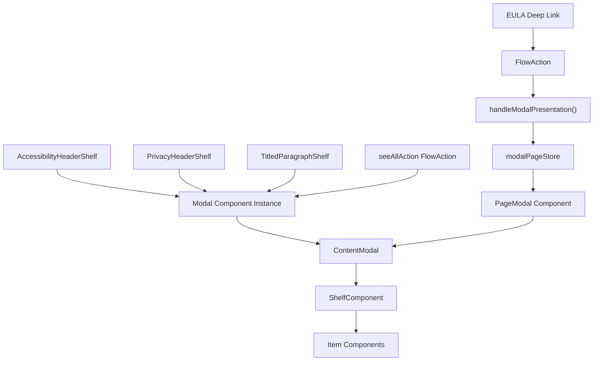
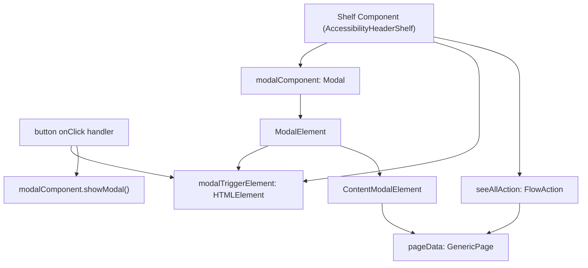
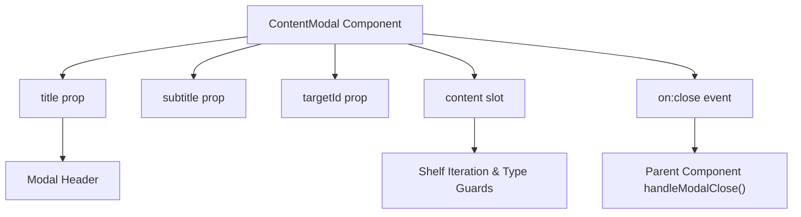
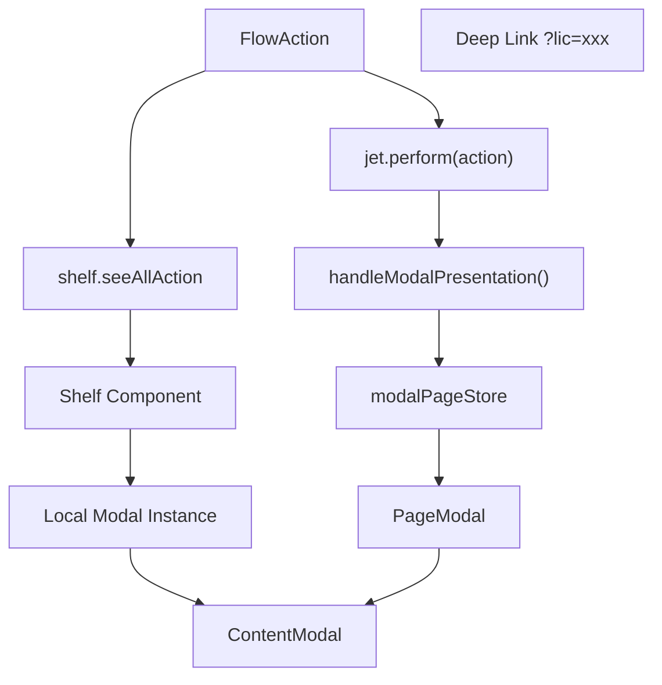

# Modal Presentation

-   [src/components/PageModal.svelte](https://github.com/Chesszyh/apps.apple.com/blob/279d0c4d/src/components/PageModal.svelte)
-   [src/components/jet/shelf/AccessibilityHeaderShelf.svelte](https://github.com/Chesszyh/apps.apple.com/blob/279d0c4d/src/components/jet/shelf/AccessibilityHeaderShelf.svelte)
-   [src/components/jet/shelf/PrivacyHeaderShelf.svelte](https://github.com/Chesszyh/apps.apple.com/blob/279d0c4d/src/components/jet/shelf/PrivacyHeaderShelf.svelte)
-   [src/components/jet/shelf/TitledParagraphShelf.svelte](https://github.com/Chesszyh/apps.apple.com/blob/279d0c4d/src/components/jet/shelf/TitledParagraphShelf.svelte)
-   [src/jet/utils/handle-modal-presentation.ts](https://github.com/Chesszyh/apps.apple.com/blob/279d0c4d/src/jet/utils/handle-modal-presentation.ts)
-   [src/stores/modalPage.ts](https://github.com/Chesszyh/apps.apple.com/blob/279d0c4d/src/stores/modalPage.ts)

## Purpose and Scope

This document describes the modal presentation system in the App Store web application. The system implements two complementary patterns for displaying overlay content: **direct shelf modals** where individual shelf components manage their own modal instances, and a **global modal system** that uses centralized state management via `modalPageStore`. Both patterns render `GenericPage` content through the shared `ContentModal` component.

For information about page-level components and shelf orchestration, see [Page Components](#4.1). For the shelf component dispatcher system, see [Shelf System](#4.2).

---

## Modal Architecture Overview

The modal system provides two distinct architectural patterns, each optimized for different use cases:

**Dual Modal Pattern Architecture**


Sources: [src/components/jet/shelf/AccessibilityHeaderShelf.svelte](https://github.com/Chesszyh/apps.apple.com/blob/279d0c4d/src/components/jet/shelf/AccessibilityHeaderShelf.svelte) [src/components/PageModal.svelte](https://github.com/Chesszyh/apps.apple.com/blob/279d0c4d/src/components/PageModal.svelte) [src/jet/utils/handle-modal-presentation.ts](https://github.com/Chesszyh/apps.apple.com/blob/279d0c4d/src/jet/utils/handle-modal-presentation.ts)

| Pattern | Use Case | State Management | Trigger Method |
| --- | --- | --- | --- |
| Direct Shelf Modal | Simple "See All" expansions from product page shelves | Component-local `modalComponent` variable | User clicks shelf title button |
| Global Modal | Complex navigation flows, deep links (EULA), programmatic triggers | Centralized `modalPageStore` | `handleModalPresentation()` utility |

---

## Direct Shelf Modal Pattern

Direct shelf modals are self-contained within individual shelf components. The shelf owns a local `Modal` component instance and directly controls its lifecycle through `showModal()` and `close()` methods.

**Direct Modal Component Structure**


Sources: [src/components/jet/shelf/AccessibilityHeaderShelf.svelte74-90](https://github.com/Chesszyh/apps.apple.com/blob/279d0c4d/src/components/jet/shelf/AccessibilityHeaderShelf.svelte#L74-L90) [src/components/jet/shelf/TitledParagraphShelf.svelte51-69](https://github.com/Chesszyh/apps.apple.com/blob/279d0c4d/src/components/jet/shelf/TitledParagraphShelf.svelte#L51-L69)

### Implementation Components

**AccessibilityHeaderShelf Example**

The shelf component declares local state for modal management:

```
let modalComponent: Modal | undefined;let modalTriggerElement: HTMLElement | null = null;
```
[src/components/jet/shelf/AccessibilityHeaderShelf.svelte74-75](https://github.com/Chesszyh/apps.apple.com/blob/279d0c4d/src/components/jet/shelf/AccessibilityHeaderShelf.svelte#L74-L75)

Event handlers control modal lifecycle:

```
const handleModalClose = () => modalComponent?.close();const handleOpenModalClick = (e: Event) => {    modalTriggerElement = e.target as HTMLElement;    modalComponent?.showModal();};
```
[src/components/jet/shelf/AccessibilityHeaderShelf.svelte80-84](https://github.com/Chesszyh/apps.apple.com/blob/279d0c4d/src/components/jet/shelf/AccessibilityHeaderShelf.svelte#L80-L84)

The modal is conditionally rendered based on `pageData` availability:

```
{#if pageData}    <Modal {modalTriggerElement} bind:this={modalComponent}>        <ContentModal            on:close={handleModalClose}            title={pageData.title || null}            subtitle={null}        >            <!-- shelf iteration -->        </ContentModal>    </Modal>{/if}
```
[src/components/jet/shelf/AccessibilityHeaderShelf.svelte108-141](https://github.com/Chesszyh/apps.apple.com/blob/279d0c4d/src/components/jet/shelf/AccessibilityHeaderShelf.svelte#L108-L141)

Sources: [src/components/jet/shelf/AccessibilityHeaderShelf.svelte74-141](https://github.com/Chesszyh/apps.apple.com/blob/279d0c4d/src/components/jet/shelf/AccessibilityHeaderShelf.svelte#L74-L141)

### FlowAction Data Extraction

Direct modals extract `pageData` from the shelf's `seeAllAction` using type guards:

```
interface AccessibilityDetailPageFlowAction extends FlowAction {    page: 'accessibilityDetails';    pageData: AccessibilityDetailPage;}function isAccessibilityDetailFlowAction(    action: Action,): action is AccessibilityDetailPageFlowAction {    return isFlowAction(action) && action.page === 'accessibilityDetails';}const destination =    seeAllAction && isAccessibilityDetailFlowAction(seeAllAction)        ? seeAllAction        : undefined;const pageData = destination?.pageData;
```
[src/components/jet/shelf/AccessibilityHeaderShelf.svelte28-90](https://github.com/Chesszyh/apps.apple.com/blob/279d0c4d/src/components/jet/shelf/AccessibilityHeaderShelf.svelte#L28-L90)

Each shelf type defines its own `FlowAction` interface and type guard for the specific `page` field value:

| Shelf Type | FlowAction Page Value | Type Guard Function |
| --- | --- | --- |
| AccessibilityHeaderShelf | `'accessibilityDetails'` | `isAccessibilityDetailFlowAction()` |
| PrivacyHeaderShelf | `'privacyDetail'` | `isPrivacyDetailFlowAction()` |
| TitledParagraphShelf | `'versionHistory'` | `isVersionHistoryFlowAction()` |

Sources: [src/components/jet/shelf/AccessibilityHeaderShelf.svelte53-57](https://github.com/Chesszyh/apps.apple.com/blob/279d0c4d/src/components/jet/shelf/AccessibilityHeaderShelf.svelte#L53-L57) [src/components/jet/shelf/PrivacyHeaderShelf.svelte36-40](https://github.com/Chesszyh/apps.apple.com/blob/279d0c4d/src/components/jet/shelf/PrivacyHeaderShelf.svelte#L36-L40) [src/components/jet/shelf/TitledParagraphShelf.svelte28-32](https://github.com/Chesszyh/apps.apple.com/blob/279d0c4d/src/components/jet/shelf/TitledParagraphShelf.svelte#L28-L32)

### Modal Content Iteration

Inside the `ContentModal`, each direct modal iterates its `pageData.shelves` array and uses type guards to render appropriate items:

```
{#each pageData.shelves as shelf}    <div class="content-section">        {#if isAccessibilityParagraphShelf(shelf)}            {#each shelf.items as item}                <AccessibilityParagraphItem {item} />            {/each}        {/if}        {#if isAccessibilityFeaturesShelf(shelf)}            {#each shelf.items as item}                <AccessibilityFeaturesItem {item} isDetailView={true} />            {/each}        {/if}    </div>{/each}
```
[src/components/jet/shelf/AccessibilityHeaderShelf.svelte117-136](https://github.com/Chesszyh/apps.apple.com/blob/279d0c4d/src/components/jet/shelf/AccessibilityHeaderShelf.svelte#L117-L136)

Sources: [src/components/jet/shelf/AccessibilityHeaderShelf.svelte115-138](https://github.com/Chesszyh/apps.apple.com/blob/279d0c4d/src/components/jet/shelf/AccessibilityHeaderShelf.svelte#L115-L138) [src/components/jet/shelf/PrivacyHeaderShelf.svelte92-109](https://github.com/Chesszyh/apps.apple.com/blob/279d0c4d/src/components/jet/shelf/PrivacyHeaderShelf.svelte#L92-L109) [src/components/jet/shelf/TitledParagraphShelf.svelte89-99](https://github.com/Chesszyh/apps.apple.com/blob/279d0c4d/src/components/jet/shelf/TitledParagraphShelf.svelte#L89-L99)

---

## Global Modal System

The global modal system uses a centralized Svelte store to manage modal state, allowing any part of the application to trigger modal presentation without direct component coupling.

**Global Modal Data Flow**

> **[Mermaid sequence]**
> *(图表结构无法解析)*

Sources: [src/jet/utils/handle-modal-presentation.ts](https://github.com/Chesszyh/apps.apple.com/blob/279d0c4d/src/jet/utils/handle-modal-presentation.ts) [src/components/PageModal.svelte](https://github.com/Chesszyh/apps.apple.com/blob/279d0c4d/src/components/PageModal.svelte) [src/stores/modalPage.ts](https://github.com/Chesszyh/apps.apple.com/blob/279d0c4d/src/stores/modalPage.ts)

### Modal Page Store

The store provides a reactive interface for managing global modal state:

```
interface Page {    page: GenericPage;    pageDetail?: string;}interface ModalPageStore extends Readable<Page | undefined> {    setPage: (page: Page) => void;    clearPage: () => void;}
```
[src/stores/modalPage.ts4-27](https://github.com/Chesszyh/apps.apple.com/blob/279d0c4d/src/stores/modalPage.ts#L4-L27)

The store writable is created with SSR protection:

```
const modalPageStore: Writable<Page | undefined> = (() => {    // prevent global store on the server    if (typeof window === 'undefined') {        return {            subscribe: () => { return () => {}; },            set: () => {},            update: () => {},        } as unknown as Writable<Page | undefined>;    }    return writable();})();
```
[src/stores/modalPage.ts9-22](https://github.com/Chesszyh/apps.apple.com/blob/279d0c4d/src/stores/modalPage.ts#L9-L22)

Sources: [src/stores/modalPage.ts](https://github.com/Chesszyh/apps.apple.com/blob/279d0c4d/src/stores/modalPage.ts)

### handleModalPresentation Utility

The `handleModalPresentation()` function serves as the entry point for triggering global modals:

```
export const handleModalPresentation = (    page: { promise: Promise<Page> },    log: Logger<unknown[]>,    pageDetail?: string,) => {    page.promise        .then((page) => {            if (isGenericPage(page)) {                const modalStore = getModalPageStore();                modalStore.setPage({ page, pageDetail });            } else {                throw new Error('only generic page is rendered in modal');            }        })        .catch((e) => {            log.error('modal presentation failed', e);        });};
```
[src/jet/utils/handle-modal-presentation.ts12-29](https://github.com/Chesszyh/apps.apple.com/blob/279d0c4d/src/jet/utils/handle-modal-presentation.ts#L12-L29)

This function:

1.  Accepts a page promise (from intent controller resolution)
2.  Validates the resolved page is a `GenericPage`
3.  Updates the `modalPageStore` with page data
4.  Optionally tags the modal with a `pageDetail` identifier for metrics

Sources: [src/jet/utils/handle-modal-presentation.ts](https://github.com/Chesszyh/apps.apple.com/blob/279d0c4d/src/jet/utils/handle-modal-presentation.ts)

### PageModal Component

The `PageModal` component subscribes to `modalPageStore` and reactively manages the modal element:

```
let modalElement: SvelteComponent;let modalPage = getModalPageStore();let page: GenericPage | undefined;$: page = $modalPage?.page;$: shelves = page?.shelves ?? [];$: title = page?.title ?? null;$: targetId =    $modalPage?.pageDetail === 'licenseAgreement'        ? LICENSE_AGREEMENT_MODAL_ID        : undefined;
```
[src/components/PageModal.svelte11-21](https://github.com/Chesszyh/apps.apple.com/blob/279d0c4d/src/components/PageModal.svelte#L11-L21)

Reactive statement controls modal visibility:

```
$: {    if ($modalPage) {        modalElement?.showModal();    } else {        handleModalClose();    }}
```
[src/components/PageModal.svelte27-33](https://github.com/Chesszyh/apps.apple.com/blob/279d0c4d/src/components/PageModal.svelte#L27-L33)

The component renders shelves using the generic `ShelfComponent` dispatcher:

```
<ContentModal {title} subtitle={null} on:close={handleModalClose} {targetId}>    <svelte:fragment slot="content">        {#each shelves as shelf}            <ShelfComponent {shelf}>                <slot name="marker-shelf" slot="marker-shelf" let:shelf {shelf} />            </ShelfComponent>        {/each}    </svelte:fragment></ContentModal>
```
[src/components/PageModal.svelte48-65](https://github.com/Chesszyh/apps.apple.com/blob/279d0c4d/src/components/PageModal.svelte#L48-L65)

Sources: [src/components/PageModal.svelte](https://github.com/Chesszyh/apps.apple.com/blob/279d0c4d/src/components/PageModal.svelte)

---

## ContentModal Component

The `ContentModal` component provides the shared rendering layer for both modal patterns. It wraps the `Modal` component from `@amp/web-app-components` and provides a consistent header and close button.

**ContentModal Structure**


Sources: [src/components/jet/item/ContentModal.svelte](https://github.com/Chesszyh/apps.apple.com/blob/279d0c4d/src/components/jet/item/ContentModal.svelte) (file not provided but referenced throughout)

The `targetId` prop enables metrics tracking for specific modal types:

| Modal Type | targetId Constant | Usage |
| --- | --- | --- |
| Version History | `VERSION_HISTORY_MODAL_ID` | TitledParagraphShelf modal |
| License Agreement | `LICENSE_AGREEMENT_MODAL_ID` | EULA deep link modal |
| App Privacy | `APP_PRIVACY_MODAL_ID` | PrivacyHeaderShelf modal |

Sources: [src/components/jet/shelf/TitledParagraphShelf.svelte46-86](https://github.com/Chesszyh/apps.apple.com/blob/279d0c4d/src/components/jet/shelf/TitledParagraphShelf.svelte#L46-L86) [src/components/PageModal.svelte9-21](https://github.com/Chesszyh/apps.apple.com/blob/279d0c4d/src/components/PageModal.svelte#L9-L21) [src/components/jet/shelf/PrivacyHeaderShelf.svelte51-89](https://github.com/Chesszyh/apps.apple.com/blob/279d0c4d/src/components/jet/shelf/PrivacyHeaderShelf.svelte#L51-L89)

---

## Modal Lifecycle Management

**Modal State Transitions**

> **[Mermaid stateDiagram]**
> *(图表结构无法解析)*

Sources: [src/components/jet/shelf/AccessibilityHeaderShelf.svelte80-84](https://github.com/Chesszyh/apps.apple.com/blob/279d0c4d/src/components/jet/shelf/AccessibilityHeaderShelf.svelte#L80-L84) [src/components/PageModal.svelte23-38](https://github.com/Chesszyh/apps.apple.com/blob/279d0c4d/src/components/PageModal.svelte#L23-L38)

### Cleanup and Memory Management

The `PageModal` component registers a cleanup function on mount to prevent memory leaks:

```
onMount(() => {    return modalPage.clearPage;});
```
[src/components/PageModal.svelte23-25](https://github.com/Chesszyh/apps.apple.com/blob/279d0c4d/src/components/PageModal.svelte#L23-L25)

This ensures the store is cleared when the component is destroyed, preventing stale modal state from persisting across page navigations.

Sources: [src/components/PageModal.svelte23-25](https://github.com/Chesszyh/apps.apple.com/blob/279d0c4d/src/components/PageModal.svelte#L23-L25)

---

## Implementation Pattern Selection

**Decision Matrix for Modal Pattern Selection**

| Criteria | Direct Shelf Modal | Global Modal |
| --- | --- | --- |
| **Data Source** | `shelf.seeAllAction` with embedded `pageData` | External navigation intent or deep link |
| **Trigger Location** | Single shelf component | Multiple trigger points across app |
| **State Scope** | Component-local | Application-global |
| **URL Update** | No | No (both patterns avoid history changes) |
| **Navigation Flow** | Simple expansion | Complex flow (EULA, multi-step) |
| **Typical Content** | 1-2 shelf types, known at compile time | Dynamic shelf types from API |

### Direct Modal Example Use Cases

1.  **Version History** - TitledParagraphShelf with `versionHistory` FlowAction
2.  **Accessibility Details** - AccessibilityHeaderShelf with `accessibilityDetails` FlowAction
3.  **App Privacy Details** - PrivacyHeaderShelf with `privacyDetail` FlowAction

Sources: [src/components/jet/shelf/TitledParagraphShelf.svelte15-18](https://github.com/Chesszyh/apps.apple.com/blob/279d0c4d/src/components/jet/shelf/TitledParagraphShelf.svelte#L15-L18) [src/components/jet/shelf/AccessibilityHeaderShelf.svelte28-31](https://github.com/Chesszyh/apps.apple.com/blob/279d0c4d/src/components/jet/shelf/AccessibilityHeaderShelf.svelte#L28-L31) [src/components/jet/shelf/PrivacyHeaderShelf.svelte24-27](https://github.com/Chesszyh/apps.apple.com/blob/279d0c4d/src/components/jet/shelf/PrivacyHeaderShelf.svelte#L24-L27)

### Global Modal Example Use Cases

1.  **EULA Deep Links** - URL parameter `?lic` triggers license agreement modal via `handleModalPresentation()`
2.  **Programmatic Modals** - Any `FlowAction` can be performed via `jet.perform()` to show modal
3.  **Dynamic Content** - Content structure unknown at shelf compile time

Sources: [src/components/PageModal.svelte18-21](https://github.com/Chesszyh/apps.apple.com/blob/279d0c4d/src/components/PageModal.svelte#L18-L21) [src/jet/utils/handle-modal-presentation.ts6-11](https://github.com/Chesszyh/apps.apple.com/blob/279d0c4d/src/jet/utils/handle-modal-presentation.ts#L6-L11)

---

## Integration with Action System

Both modal patterns integrate with the action dispatching system described in [Intent and Action System](#2.2):

**FlowAction to Modal Rendering**


Sources: [src/components/jet/shelf/TitledParagraphShelf.svelte48-62](https://github.com/Chesszyh/apps.apple.com/blob/279d0c4d/src/components/jet/shelf/TitledParagraphShelf.svelte#L48-L62) [src/jet/utils/handle-modal-presentation.ts12-29](https://github.com/Chesszyh/apps.apple.com/blob/279d0c4d/src/jet/utils/handle-modal-presentation.ts#L12-L29)

The `TitledParagraphShelf` demonstrates integration with `jet.perform()` to emit metrics alongside modal presentation:

```
const perform = getJetPerform();const handleOpenModalClick = (e: Event) => {    modalTriggerElement = e.target as HTMLElement;    modalComponent?.showModal();    perform(destination);};
```
[src/components/jet/shelf/TitledParagraphShelf.svelte48-62](https://github.com/Chesszyh/apps.apple.com/blob/279d0c4d/src/components/jet/shelf/TitledParagraphShelf.svelte#L48-L62)

This pattern allows the modal presentation to be tracked by the metrics system while maintaining the direct modal architecture.

Sources: [src/components/jet/shelf/TitledParagraphShelf.svelte45-62](https://github.com/Chesszyh/apps.apple.com/blob/279d0c4d/src/components/jet/shelf/TitledParagraphShelf.svelte#L45-L62)

---

## Summary

The modal presentation system provides two complementary patterns:

1.  **Direct Shelf Modals** - Self-contained, component-local modal instances for simple "See All" expansion flows where `pageData` is embedded in `shelf.seeAllAction`

2.  **Global Modal System** - Centralized state management via `modalPageStore` and `handleModalPresentation()` utility for complex navigation flows, deep links, and programmatic modal triggers


Both patterns converge on `ContentModal` for rendering `GenericPage` content, with shelf iteration and type guard-based component dispatch. This dual approach balances simplicity for common cases with flexibility for advanced scenarios, while maintaining a consistent user experience across all modal presentations.

Sources: [src/components/jet/shelf/AccessibilityHeaderShelf.svelte](https://github.com/Chesszyh/apps.apple.com/blob/279d0c4d/src/components/jet/shelf/AccessibilityHeaderShelf.svelte) [src/components/jet/shelf/TitledParagraphShelf.svelte](https://github.com/Chesszyh/apps.apple.com/blob/279d0c4d/src/components/jet/shelf/TitledParagraphShelf.svelte) [src/components/jet/shelf/PrivacyHeaderShelf.svelte](https://github.com/Chesszyh/apps.apple.com/blob/279d0c4d/src/components/jet/shelf/PrivacyHeaderShelf.svelte) [src/components/PageModal.svelte](https://github.com/Chesszyh/apps.apple.com/blob/279d0c4d/src/components/PageModal.svelte) [src/stores/modalPage.ts](https://github.com/Chesszyh/apps.apple.com/blob/279d0c4d/src/stores/modalPage.ts) [src/jet/utils/handle-modal-presentation.ts](https://github.com/Chesszyh/apps.apple.com/blob/279d0c4d/src/jet/utils/handle-modal-presentation.ts)
